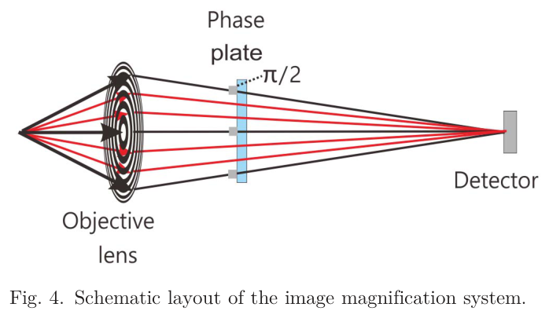
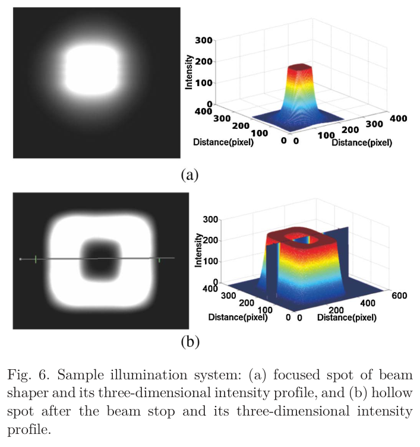
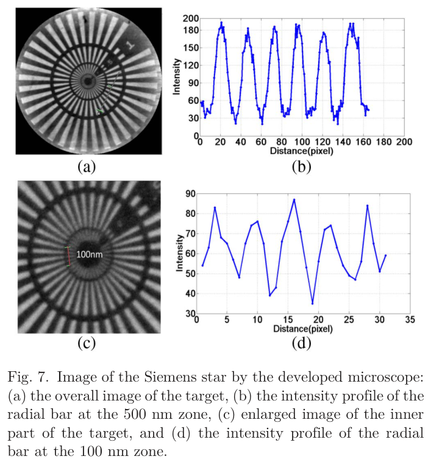

---
tags:
  - papers/X-ray-nano-imaging
  - facilities/SSRF
aliases:
  - "SSRF FXNI 2016"
  - "Full-field X-ray nano-imaging system at SSRF"
date: 2016-09-10
doi: 10.3788/COL201614.093401
---

# Full-field X-ray nano-imaging system designed and constructed at SSRF

## 核心信息

- 标题: Full-field X-ray nano-imaging system designed and constructed at SSRF
- 标题翻译: 上海光源全场 X 射线纳米成像系统的设计与建设
- 作者: Binggang Feng（丰丙刚）, Biao Deng（邓彪）, Yuqi Ren（任玉琦）, Yudan Wang（王玉丹）, Guohao Du（杜国浩）, Hai Tan（谭海）, Yanling Xue（薛艳玲）, Tiqiao Xiao（肖体乔）
- 机构: 中国科学院上海应用物理研究所；中国科学院大学
- 发表时间: 2016-09-10
- 发表渠道: Chinese Optics Letters, 14(9), 093401
- DOI: 10.3788/COL201614.093401
- 论文链接: [DOI](https://doi.org/10.3788/COL201614.093401)
- 论文类型: 同步辐射成像系统 / 仪器方法论文

## 原文摘要翻译

全场 X 射线纳米成像（FXNI）是以纳米尺度原位、无损观察样品内部结构的最有力工具之一。得益于第三代同步辐射装置的高通量密度，这项技术及其应用已取得长足进展，迄今空间分辨率已达到 20 纳米。根据上海同步辐射光源 X 射线成像线站多年的用户运行经验，许多用户实验需要覆盖较宽的空间分辨率和视场范围；尤其是兼具大视场和约 100 纳米中等空间分辨率的 X 射线显微镜，在众多研究领域具有广泛用途。在用户需求驱动下，上海光源设计并建成了一套专用全场纳米成像系统。该显微镜以光束整形器和波带片为基础，优化工作能区为 8–10 千电子伏。西门子星靶测试表明，系统在获得 50 微米视场的同时实现了 100 纳米空间分辨率。

## 创新点

1. **把“分辨率—视场”作为联合设计目标。** 论文没有单纯追逐当时约 20 纳米的最小二维线宽，而是从 BL13W1 用户需求出发，将验收组合设为 100 纳米分辨率和 50 微米×50 微米视场，强调可覆盖更多实际样品。
2. **用二元光学元件（BOE）光束整形器产生方形平顶照明。** 其局部分区把一级衍射叠加到同一方形焦域，使照明形状与探测器有效区匹配，并以较低衍射效率换取均匀大视场和较低的扫描复杂度。
3. **将空心锥照明、中央挡块和斜入射 FZP 组合。** 这一路线既抑制直透零级光造成的高背景，又扩大物镜可收集的空间频率范围；论文由此给出 \(0.61\Delta r\) 的设计分辨率关系。
4. **在同一放大链路中预留吸收衬度与 Zernike 相衬。** 后焦面相位点阵按 BOE 的傅里叶光场设计，为低吸收样品的相位—强度转换提供了结构基础，尽管本文尚未给出相衬模式的实验验收。

## 一句话总结

这篇论文证明上海光源在 BL13W1 已建成一套可运行的二维全场硬 X 射线纳米显微原型，并以 100 nm / 50 μm 的联合指标完成靶标验证；它是后来 BL18B 纳米三维成像线站的技术前驱，但本身还不是已经验收的 nano-CT 系统。

## 研究问题

### 分辨率与视场为何需要折中

全场显微镜中，更细的物镜外环和更高的放大倍率通常有利于分辨率，却会压缩视场、降低通量裕量并放大机械漂移的影响。作者依据 BL13W1 的用户运行经验提出：材料、能源和生物医学用户并不都需要极限线宽，很多任务更需要在几十微米范围内可靠定位内部结构。因此，本文的核心问题不是“能否刷新二维分辨率纪录”，而是“能否把约 100 nm 的可辨结构和 \(50~\mu\text{m}\) 大视场放在同一台用户导向系统中”。

### 原型机的工程定位

系统安装于 SSRF BL13W1。该线站由混合型扭摆器供光，双晶单色器覆盖 8–72.5 keV，而这套纳米显微镜针对 8–10 keV 优化。论文要完成的是照明、样品台、物镜、相位元件、长距离探测和控制机械的系统集成，并以标准靶验证二维成像；作者仅把等斜率断层重建（EST）和三维 nano-CT 写为后续计划。

## 数据与任务定义

### 输入、输出与验证对象

- **输入光束：** BL13W1 单色硬 X 射线，显微系统优化能区 8–10 keV。
- **测试对象：** 最小结构宽度为 100 nm 的 Siemens 星分辨率靶。
- **系统输出：** 50 微米×50 微米范围内的二维放大透射像及径向条纹强度剖面。
- **判据：** 整视场内条纹能否各向近似一致地分开，以及 500 nm、100 nm 区域是否仍有可辨强度调制。

这一定义刻意不包含旋转投影序列、断层重建体或三维分辨率。因此，本文数据支持“二维 FXNI 原型完成”，不能直接支持“100 nm 三维 CT 已实现”。

### 关键器件与标称参数

| 环节 | 论文参数 | 对任务的作用 |
|---|---:|---|
| BOE 光束整形器 | 最外环 70 nm；金结构高 1 μm；纵横比 13；约 8% 衍射效率 | 收集 1.8 毫米×1.8 毫米入射束并在 1459 毫米后形成 50 微米方形照明 |
| 中央挡块 | \(1.3~\text{mm}\times1.3~\text{mm}\) 金挡块 | 生成空心锥光束，阻止直透光进入成像背景 |
| FZP 物镜 | 直径 100 μm；最外环 70 nm；金区高 1 μm；焦距 56.5 mm | 对样品透射场进行纳米分辨放大 |
| 探测链 | FZP 后约 6900 mm；6.5 μm 探测像素；标称放大倍率 122 | 把纳米结构映射到可见光耦合探测器 |
| 机械链 | 四维样品台，含高精度旋转和 \(x/y\) 定心；FZP 与相位点阵各自三维调节 | 支持对心、聚焦和未来角度扫描 |

## 方法主线

### 机制流程

1. **输入与整形：** 8–10 keV 单色 X 射线送入 BOE 光束整形器，各局部线栅的一阶衍射在焦面叠加，生成与探测器匹配的方形平顶照明。
2. **空心锥照射样品：** 中央挡块滤除直透分量，倾斜光束以空心锥形式照明样品，使直透零级光避开探测器，并把更高空间频率送入 FZP 接受角。
3. **物镜放大与衬度形成：** 直径 100 μm 的 FZP 对样品出射波进行放大；需要相衬时，后焦面的 Zernike 点阵对聚焦分量引入 \(\pi/2\) 相移，将相位差转换为强度差。
4. **远场探测与输出：** 放大像经过充氦光路传播到约 6.9 m 外的探测器，生成二维投影及强度剖面；本文以 Siemens 星而不是重建体完成验收。

*论文原图编号：Fig. 4。FZP、后焦面 Zernike 相位点阵与远端探测器组成的图像放大链路；该图用于对应上述第 3–4 步。*

### BOE 平顶照明为什么能覆盖大视场

作者把常规 FZP 分割为多个局部空间频率和方向固定的子区，每个子区相当于线栅。各子区的一阶衍射在焦面形成重合的方形区域，因而可以同时提高样品面光子密度、减小杂散光，并让照明轮廓贴合方形探测器。设计首先采用常见关系

$$
\delta = 1.22\Delta R_n ,
$$

其中 \(\Delta R_n\) 为最外环宽。若目标为 100 nm，理论上需 \(\Delta R_n<81.9\) nm；实际选择 70 nm。代价是 BOE 的报告衍射效率约为 8%，所以“均匀大视场”并非没有通量成本。

*论文原图编号：Fig. 6。BOE 产生的方形平顶聚焦光斑及加入中央挡块后的空心光斑，直接展示大视场照明与零级光抑制机制。*

### 斜入射与 Zernike 相衬

在正入射下，同一 FZP 只能收集到有限空间频率；斜入射把频谱移入物镜接受范围，作者给出的设计关系为

$$
\delta_{\mathrm{inclined}} = 0.61\Delta r_n .
$$

对 70 nm 最外环，这一几何关系给出约 43 nm 的**光学设计潜力**，并不等于本文实测分辨率。Zernike 点阵位于 FZP 后焦面，硅中刻蚀深度 6.34 μm、周期 1.935 μm、点宽 600 nm，目标相移为 \(\pi/2\)。论文说明了结构和预期机制，却没有提供相衬样品或相位恢复的定量结果。

> [!figure] Fig. 3 正入射与斜入射的空间频率收集
> 建议位置：方法主线
> 放置原因：该图是理解斜入射为何扩展 FZP 可收集空间频率、并导出 \(0.61\Delta r_n\) 关系的关键示意。
> 当前状态：保留占位；人工复核发现提取候选右侧混入无关的 Fig. 5 装置照片，无法作为独立原图稳定插入。

### 探测采样约束

有效物方像素可用

$$
p_{\mathrm{eff}}=\frac{p_{\mathrm{det}}}{M}
$$

估算。按论文同时给出的 \(p_{\mathrm{det}}=6.5~\mu\text{m}\) 和 \(M=122\) 简单相除，得到约 53 纳米/像素；正文另称约 43 纳米/像素。两者并不完全一致，可能涉及正文未交代的实际几何倍率或标定值。因此，论文关于“换用 2× 可见光物镜即可接近 50 纳米”的判断是合理的工程方向，但仍需以独立标定和分辨率曲线验收，不能只由名义倍率推出。

## 关键结果

### 已经实测的联合指标

*论文原图编号：Fig. 7。Siemens 星整视场、局部放大及 500 nm 和 100 nm 径向条纹强度剖面，是本文分辨率主张的直接证据。*

| 指标 | 报告结果 | 证据强度 |
|---|---:|---|
| 二维视场 | 50 微米×50 微米 | 西门子星整视场图直接支持 |
| 二维可辨结构 | 100 nm | 最内层条纹可区分，属单靶标二维证据 |
| 500 nm 处对比度 | 0.76 | 径向强度剖面 |
| 100 nm 处对比度 | 0.28 | 径向强度剖面 |
| 单幅曝光 | 60 s | 实验条件直接报告 |

这组结果最有价值之处是同时报告视场、线宽、对比度和曝光，而不是只给一个最小线宽数字。作者还称整视场内分辨表现近似各向同性，但证据仍来自单张靶标图，没有多位置统计或重复扫描。

### 实测、推算与未来目标必须分开

| 层级 | 数值 | 正确解释 |
|---|---:|---|
| 本文实测 | 100 nm / 50 μm FOV | BL13W1 原型的二维靶标结果 |
| 光学设计潜力 | 约 43–50 nm | 由 70 nm 外环、斜入射和更细探测采样推算，未在本文实现 |
| 后续二期线站目标 | 20 nm / 20 μm FOV / 5–14 keV | 未来专用弯转磁铁线站的设计目标，不是本系统验收值 |

## 深度分析

### 真正贡献是系统折中，而非极限数字

在论文写作时，国际全场硬 X 射线纳米成像已报道约 20 nm 的二维分辨率。本文仍选择 100 nm，并不意味着不知道前沿，而是把用户样品尺寸、视场和系统复杂度纳入目标函数。BOE 相比单毛细管效率较低，但能直接形成均匀方形大视场，避免为小光斑配置高精度二维扫描。对一个需要开放给多学科用户的原型，这种“较少极限、更多覆盖”的策略具有明确工程价值。

### 证据链能证明什么

论文提供了完整光学和机械参数、聚光光斑、系统实物描述及 Siemens 星结果，足以证明 BL13W1 原型已被集成并运行，也支持 100 nm / 50 μm 的二维联合能力。它没有提供角度投影序列、重建算法、三维体数据或三维分辨率指标，所以“将其与 EST 结合发展 nano-CT”应理解为下一阶段路线，而非已完成成果。

### 从 BL13W1 原型到专用线站的技术继承

该工作验证了后续线站最关键的若干部件关系：整形照明与 FZP 的相空间匹配、中央挡块与斜入射的背景控制、长距离高倍率探测、纳米样品台对心，以及相衬接口。论文末尾提出 5–14 keV、20 μm 视场和 20 nm 分辨率的二期专用线站目标，说明原型承担了技术预研功能。评估 SSRF 纳米 CT 的历史时，应把它标为“二维原型和技术储备节点”，再由后续 BL18B 论文证明三维能力和用户运行。

### 容易被误读的三处

1. **100 nm 不是三维分辨率。** 它是 Siemens 星二维线宽和强度调制结果。
2. **43–50 nm 不是已实现分辨率。** 它来自物镜几何及探测采样潜力。
3. **Zernike 相衬与 EST 不是本文验收项。** 前者只有设计描述，后者明确写为未来结合方向。

## 局限

1. **缺少三维数据。** 没有旋转序列、断层重建、各向同性三维分辨率、缺失楔效应或配准误差评估。
2. **验证对象单一。** 只有 Siemens 星，没有真实材料或生物样品，也没有重复性、跨视场或跨日期统计。
3. **时间和剂量代价显著。** 单幅曝光 60 s；若机械地扩展到数百角度，仅曝光就可能达到数小时，尚未计入换角、对心和漂移校正。
4. **系统稳定性未量化。** 约 9 m 光路和 6.9 m 放大距离对振动、热漂移与束流位置敏感，论文没有长期漂移曲线或闭环稳定指标。
5. **相衬模式尚未闭环。** Zernike 点阵的尺寸和相移被给出，但没有低 \(Z\) 样品的对比增益、能量容差或伪影结果。
6. **部分标称参数存在复核缺口。** 6.5 μm 像素与 122 倍倍率的简单换算和正文“约 43 nm”不一致，实际有效像素需要标尺实验确认。

## 我的笔记

### 对后续 nano-CT 建设可复用的验收框架

这篇早期工作提示，线站验收不应只保留“最小线宽”。更稳健的联合指标至少包括：二维 MTF/PSD、视场内多位置一致性、样品面通量、单投影曝光、完整 CT 时间、吸收剂量、旋转轴漂移、三维 FSC 或 3D-MTF、真实样品可重复性。只有这些指标共同达标，光学理论分辨率才会转化为用户可获得的三维分辨率。

### 值得追问的实验

1. 在相同能量、视场和探测器条件下，BOE 与单毛细管照明的样品面通量密度、均匀性和 CT 环伪影有何定量差异？
2. 改用 2× 可见光物镜后，能否在合理曝光下稳定达到约 50 nm，而不被漂移、信噪比或剂量抵消？
3. Zernike 点阵在 8–10 keV 范围内的相移误差会怎样改变低 \(Z\) 样品的对比度和晕环伪影？
4. 若采用 EST，有限角度和低投影数能节省多少时间，其重建偏差如何与常规 180° CT 对照？

## 引用

- Feng, B., Deng, B., Ren, Y., et al. “Full-field X-ray nano-imaging system designed and constructed at SSRF.” *Chinese Optics Letters* 14(9), 093401 (2016). [DOI](https://doi.org/10.3788/COL201614.093401)
- Stampanoni, M., Marone, F., Vila-Comamala, J., et al. *AIP Conference Proceedings* 1365, 239 (2011).（论文据此讨论 BOE 光束整形路线）
- Miao, J., Förster, F., and Levi, O. “Equally sloped tomography with oversampling reconstruction.” *Physical Review B* 72, 052103 (2005).（论文将 EST 作为后续 nano-CT 路线）
