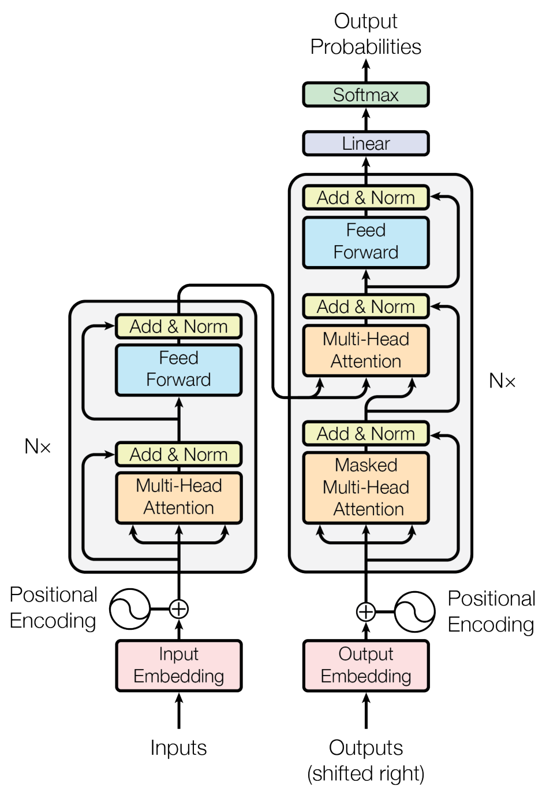
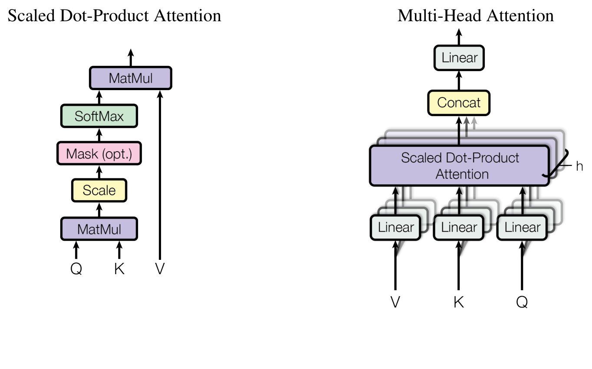
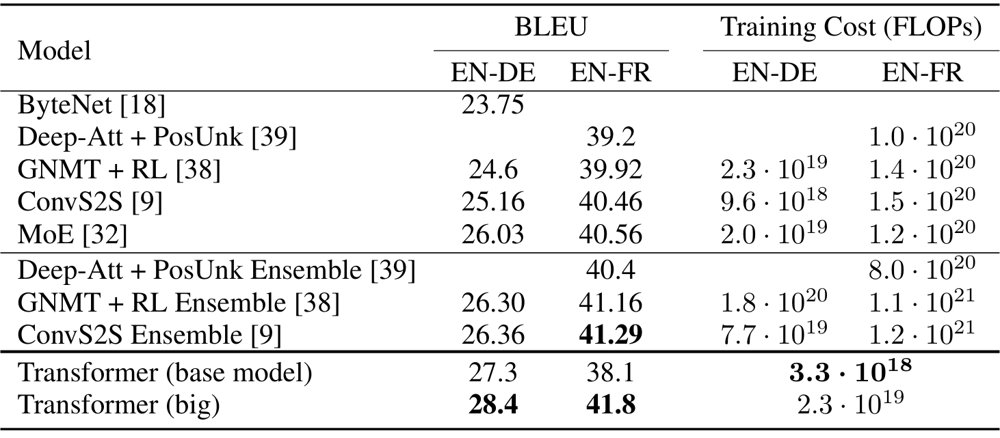
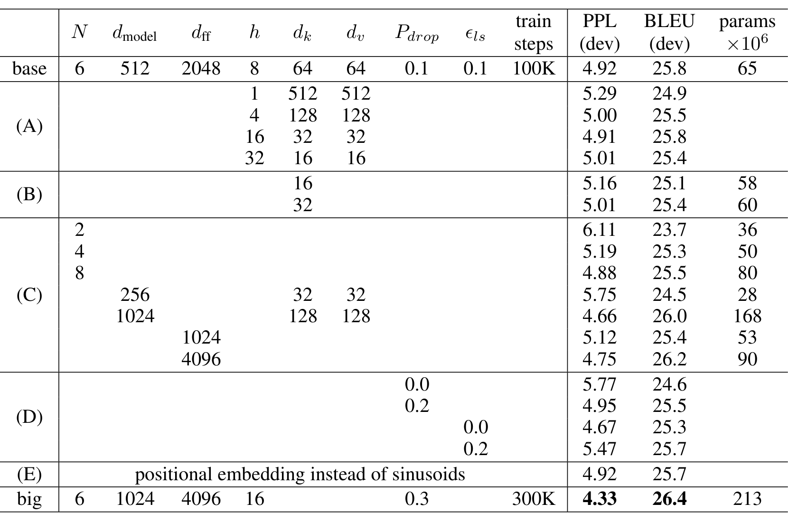
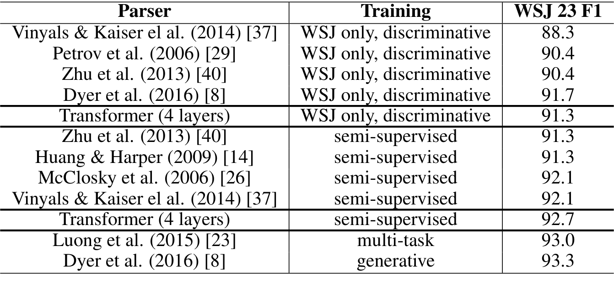
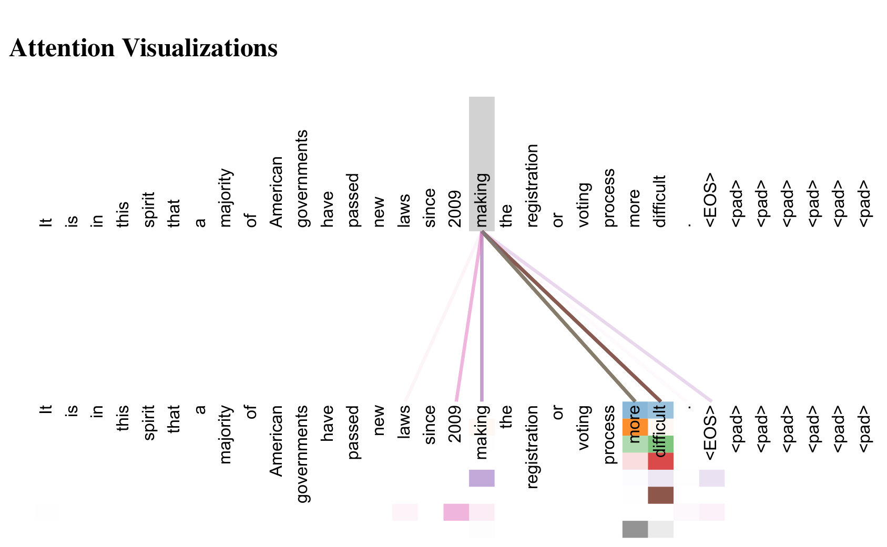
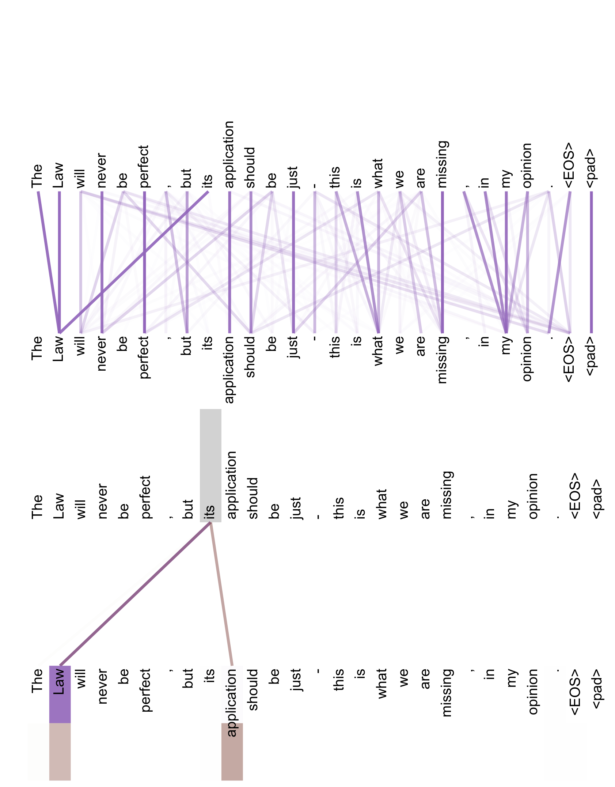
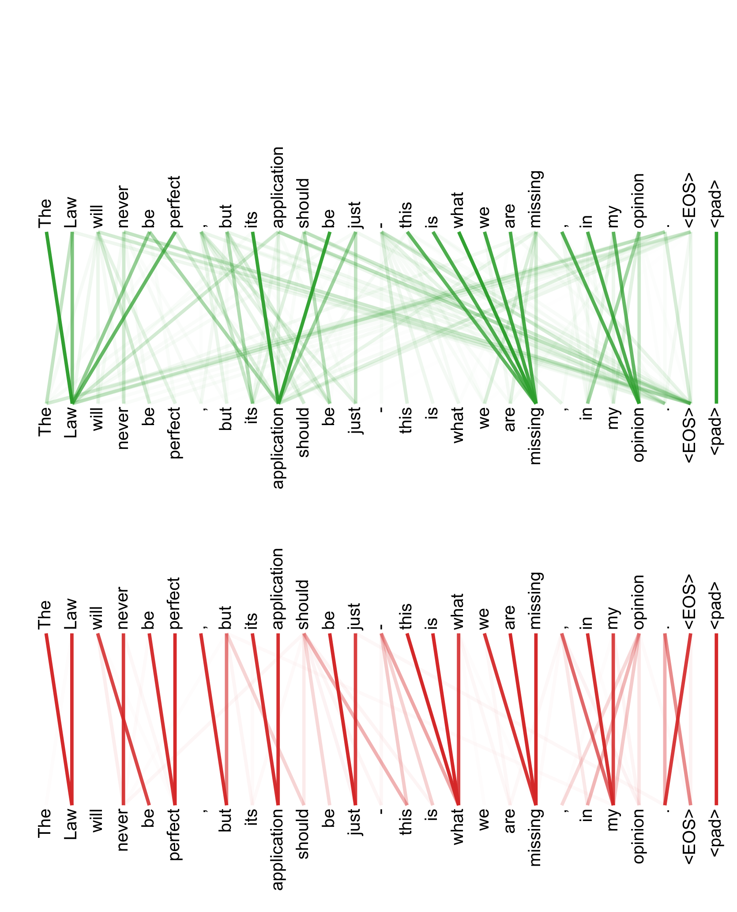

---
tags:
  - papers/nlp
  - papers/deep-learning
  - transformer
aliases:
  - Attention Is All You Need
  - 注意力即一切
  - Transformer 原始论文
date: 2026-08-24
arxiv_id: "1706.03762"
doi: "10.48550/arXiv.1706.03762"
---

# Attention Is All You Need——Transformer 奠基论文深读与全文翻译

## 核心信息

- 标题: Attention Is All You Need
- 标题翻译: 注意力即一切
- 作者: Ashish Vaswani、Noam Shazeer、Niki Parmar、Jakob Uszkoreit、Llion Jones、Aidan N. Gomez、Łukasz Kaiser、Illia Polosukhin
- 机构: Google Brain、Google Research、多伦多大学
- 发表时间: 2017 年 6 月 12 日首次提交；本文核对版本为 2023 年 8 月 2 日的 arXiv v7
- 发表渠道: 第 31 届神经信息处理系统大会（NIPS 2017）
- DOI: [10.48550/arXiv.1706.03762](https://doi.org/10.48550/arXiv.1706.03762)
- arXiv: [1706.03762](https://arxiv.org/abs/1706.03762)
- 论文链接: [arXiv HTML 全文](https://arxiv.org/html/1706.03762v7)；[arXiv PDF](https://arxiv.org/pdf/1706.03762)
- 代码 / 项目: [Tensor2Tensor](https://github.com/tensorflow/tensor2tensor)
- 数据 / 资源: WMT 2014 英德与英法机器翻译数据；Penn Treebank 的 Wall Street Journal 成分句法分析数据
- 论文类型: 人工智能方法论文

## 原文摘要翻译

主流的序列转导模型建立在包含编码器和解码器的复杂循环神经网络或卷积神经网络之上。表现最好的模型还通过注意力机制连接编码器与解码器。我们提出一种新的简单网络架构 Transformer，它完全基于注意力机制，彻底舍弃循环与卷积。在两个机器翻译任务上的实验表明，这些模型不仅质量更高，而且更易并行化，所需训练时间也显著减少。在 2014 年世界机器翻译评测的英译德任务上，我们的模型取得 28.4 BLEU，比此前包括集成模型在内的最佳结果高出 2 个以上 BLEU。在同一评测的英译法任务上，我们的模型使用 8 张图形处理器训练 3.5 天后，取得 41.8 BLEU 的单模型最新最佳结果，而训练成本仅为文献中最佳模型的一小部分。我们还将 Transformer 成功用于英语成分句法分析，证明它在训练数据充足和有限两种条件下都能很好地泛化到其他任务。

## 创新点

1. **把自注意力从辅助模块提升为整个序列建模主干。** 论文首次给出完全不依赖序列对齐 RNN 或卷积的编码器—解码器，以多头自注意力承担输入内部、输出内部以及输入—输出之间的信息交互。
2. **提出缩放点积注意力。** 在点积后除以 $\sqrt{d_k}$，抑制高维点积过大导致的 softmax 饱和和梯度过小，同时保留矩阵乘法的高效实现。
3. **提出多头注意力的完整参数化方式。** 多组查询、键和值投影并行工作，使模型能在不同表示子空间和不同位置上同时取信息；消融显示单头会损失 0.9 BLEU。
4. **用位置编码补回顺序信息。** 正弦与余弦编码让无循环、无卷积的模型仍能区分词元位置，并为相对位移提供线性可表示性假设。
5. **把架构选择与计算图性质直接联系起来。** 论文不只报告精度，还比较每层复杂度、最少顺序操作数和最大依赖路径，说明 Transformer 为何适合并行训练与远距离依赖建模。

## 一句话总结

Transformer 的关键突破不是“使用了注意力”，而是证明“注意力可以承担全部序列表示计算”，从而以全局内容寻址换掉 RNN 的时间递归和 CNN 的逐层感受野扩张。

## 研究问题

### 问题链

2017 年前，语言模型和机器翻译的主干通常是 LSTM、GRU 等循环网络。循环模型把序列位置绑定到计算时间步：第 $t$ 个状态依赖第 $t-1$ 个状态，因此单个样本内部难以并行，序列越长，训练吞吐和梯度传播越受限制。

CNN 序列模型能并行计算全部位置，但有限卷积核只能直接混合局部邻域。要让任意两个位置发生信息交互，需要堆叠普通卷积或空洞卷积，长程依赖路径分别随序列长度线性或对数增长。

论文提出的问题因此是：能否保留编码器—解码器与自回归生成范式，却用一种可全位置并行、任意位置短路径互联的机制取代循环和卷积？答案是以全局自注意力作为表示主干。

### 必须区分的两个“并行”

Transformer 显著并行化的是训练时的层内表示计算。解码器仍然是自回归的：生成第 $i$ 个词元时只能依赖此前输出，因此逐词元推理并未在这篇论文中被消除。原文结论也把“让生成更少串行”列为未来工作。

## 数据与任务定义

### 机器翻译

| 任务 | 训练规模 | 分词与词表 | 主要评价 |
|---|---:|---|---|
| WMT 2014 英译德 | 约 450 万句对 | 共享源—目标 BPE 词表，约 3.7 万词元 | newstest2014 BLEU |
| WMT 2014 英译法 | 约 3600 万句对 | 约 3.2 万词片词表 | newstest2014 BLEU |

句对按近似长度分批；每个训练批次约含 2.5 万源词元与 2.5 万目标词元。该批处理方式对复现训练吞吐和梯度统计都很关键，不能只用“句子数”替代。

### 英语成分句法分析

主实验使用 Penn Treebank 的 WSJ 部分，约有 4 万个训练句子。

半监督设置再使用约 1700 万个高置信句子和 BerkeleyParser 语料。仅 WSJ 设置使用 1.6 万词表，半监督设置使用 3.2 万词表。

评价指标为 WSJ 第 23 节的 F1。

这个任务的输出受强结构约束，且明显长于输入，因而用于检验 Transformer 是否只在大规模翻译上有效。作者只对丢弃率、学习率和束宽做少量调参，其余参数沿用英德基础模型。

## 方法主线

### 机制流程

1. **输入：**源词元与右移一位的目标词元；**操作：**查表得到嵌入并乘以 $\sqrt{d_{\text{model}}}$，再加位置编码；**输出去向：**分别进入编码器与解码器底部。
2. **输入：**带位置信息的源序列；**操作：**依次通过 6 层多头自注意力和逐位置前馈网络，每个子层都使用残差连接与层归一化；**输出去向：**形成供所有解码层读取的源序列记忆。
3. **输入：**右移目标序列和编码器记忆；**操作：**解码器先做带未来遮罩的自注意力，再以解码状态为查询、编码器输出为键和值做交叉注意力，随后通过前馈网络；**输出去向：**形成当前位置的上下文化目标表示。
4. **输入：**解码器顶层表示；**操作：**线性投影并经过 softmax；**输出去向：**得到下一个词元的概率分布，训练时并行计算全部目标位置，推理时自回归地回送已生成词元。

### 模型结构

*原论文图 1：Transformer 模型架构。*

编码器和解码器均堆叠 $N=6$ 层。编码器层含多头自注意力与逐位置前馈网络两个子层；解码器层在两者之间增加编码器—解码器注意力。原论文采用后归一化结构：

$$
\operatorname{LayerNorm}\bigl(x+\operatorname{Sublayer}(x)\bigr)
$$

所有子层和嵌入输出维度均为 $d_{\text{model}}=512$。解码器的遮罩自注意力把非法的未来连接在 softmax 之前设为 $-\infty$，再配合右移目标嵌入，保证第 $i$ 个位置只依赖小于 $i$ 的已知输出。

### 缩放点积注意力

查询 $Q$ 表示“当前位置要找什么”，键 $K$ 表示“每个位置可用什么地址匹配”，值 $V$ 表示“匹配后真正汇聚什么内容”。核心公式为：

$$
\operatorname{Attention}(Q,K,V)=\operatorname{softmax}\left(\frac{QK^{\mathsf T}}{\sqrt{d_k}}\right)V
$$

若查询向量与键向量的分量独立、均值为 0、方差为 1，则点积的方差随键维度增大：

$$
\operatorname{Var}(q\cdot k)=d_k.
$$

维度增大时，不缩放的点积会把 softmax 推入梯度极小区域；用键维度平方根缩放可把数值尺度拉回稳定区间。点积注意力还能直接调用高度优化的矩阵乘法，因此比加性注意力更快、更节省空间。

### 多头注意力

*原论文图 2：左侧为缩放点积注意力，右侧为多头注意力。*

$$
\begin{aligned}
\operatorname{MultiHead}(Q,K,V)
&=\operatorname{Concat}(\operatorname{head}_1,\ldots,\operatorname{head}_h)W^O,\\
\operatorname{head}_i
&=\operatorname{Attention}(QW_i^Q,KW_i^K,VW_i^V).
\end{aligned}
$$

投影矩阵的形状为：

$$
W_i^Q,W_i^K\in\mathbb{R}^{d_{\text{model}}\times d_k},\qquad W_i^V\in\mathbb{R}^{d_{\text{model}}\times d_v},\qquad W^O\in\mathbb{R}^{hd_v\times d_{\text{model}}}.
$$

基础模型使用 8 个注意力头，每头的键和值维度均为 64。每头维度相应缩小，因此总计算量与全维单头注意力相近。

论文中的多头注意力有三种用途：

- 编码器自注意力：$Q,K,V$ 均来自编码器前一层，每个源位置可查看全部源位置。
- 遮罩解码器自注意力：$Q,K,V$ 均来自解码器前一层，但不能查看未来目标位置。
- 编码器—解码器注意力：$Q$ 来自解码器，$K,V$ 来自编码器输出，使每个目标位置可查看全部源位置。

### 逐位置前馈网络、嵌入与位置编码

每一层还包含对各位置独立且参数共享的两层前馈网络：

$$
\operatorname{FFN}(x)=\max(0,xW_1+b_1)W_2+b_2
$$

其输入和输出维度为 512，中间维度为 2048。等价地看，它是两个核宽为 1 的卷积。输入嵌入、输出嵌入与 softmax 前线性变换共享同一权重矩阵，嵌入使用时乘以 $\sqrt{d_{\text{model}}}$。

因为模型没有循环和卷积，顺序必须显式注入：

$$
\begin{aligned}
PE_{(pos,2i)}&=\sin\left(pos/10000^{2i/d_{\text{model}}}\right),\\
PE_{(pos,2i+1)}&=\cos\left(pos/10000^{2i/d_{\text{model}}}\right).
\end{aligned}
$$

不同维度对应不同波长的正弦曲线，波长从 $2\pi$ 到 $10000\cdot2\pi$ 按几何级数变化。对任意固定偏移，偏移后的位置编码可表示为原位置编码的线性函数。作者据此推测模型会更容易学习相对位置；但论文只验证了它与学习式位置嵌入表现近似，没有验证长度外推。

### 训练目标与关键实现细节

训练使用 Adam，$\beta_1=0.9$、$\beta_2=0.98$、$\epsilon=10^{-9}$，学习率为：

$$
lrate=d_{\text{model}}^{-0.5}\min\left(step^{-0.5},\;step\cdot warmup^{-1.5}\right),\qquad warmup=4000.
$$

前 4000 步线性升温，之后按步数的平方根倒数衰减。基础模型丢弃率为 0.1；大型英法模型使用 0.1，而其他大型模型配置表给出 0.3。标签平滑系数为 $\epsilon_{ls}=0.1$，它会使困惑度变差，却提升准确率与 BLEU。

## 关键结果

### 机器翻译主结果

| 模型 | 英德 BLEU | 英法 BLEU | 英德训练 FLOPs | 英法训练 FLOPs |
|---|---:|---:|---:|---:|
| GNMT + RL | 24.6 | 39.92 | $2.3\times10^{19}$ | $1.4\times10^{20}$ |
| ConvS2S | 25.16 | 40.46 | $9.6\times10^{18}$ | $1.5\times10^{20}$ |
| MoE | 26.03 | 40.56 | $2.0\times10^{19}$ | $1.2\times10^{20}$ |
| GNMT + RL 集成 | 26.30 | 41.16 | $1.8\times10^{20}$ | $1.1\times10^{21}$ |
| ConvS2S 集成 | 26.36 | 41.29 | $7.7\times10^{19}$ | $1.2\times10^{21}$ |
| Transformer 基础模型 | 27.3 | 38.1 | $3.3\times10^{18}$ | — |
| Transformer 大型模型 | **28.4** | **41.8** | $2.3\times10^{19}$ | — |

*原论文表 2：英德、英法翻译质量与估算训练成本。*

大型模型在英德任务取得 28.4 BLEU，比此前包括集成系统在内的最佳结果高出 2 个以上 BLEU。基础模型也以明显更低的估算训练成本超过此前已发表模型。英法表 2 和摘要报告 41.8 BLEU；第 6.1 节正文却写 41.0，这是原文内部不一致，引用结果时应优先注明表格值并标出差异。

### 消融结果说明了什么

| 变化 | 验证集 PPL | 验证集 BLEU | 解释 |
|---|---:|---:|---|
| 基础模型：8 头，$d_k=d_v=64$ | 4.92 | 25.8 | 基准 |
| 1 头，$d_k=d_v=512$ | 5.29 | 24.9 | 单头比最佳设置低 0.9 BLEU |
| 4 头，$d_k=d_v=128$ | 5.00 | 25.5 | 多头有益，但并非越多越好 |
| 16 头，$d_k=d_v=32$ | 4.91 | 25.8 | 与基础相当 |
| 32 头，$d_k=d_v=16$ | 5.01 | 25.4 | 过多且每头过窄会下降 |
| 将 $d_k$ 降到 16 | 5.16 | 25.1 | 匹配空间过小会损害兼容性估计 |
| 2 层 | 6.11 | 23.7 | 容量不足明显受损 |
| $d_{\text{model}}=1024$ | 4.66 | 26.0 | 更宽模型更好但参数增至 1.68 亿 |
| $d_{ff}=4096$ | 4.75 | 26.2 | 增大前馈容量有效 |
| 标签平滑为 0 | 4.67 | 25.3 | PPL 更好、BLEU 更差 |
| 学习式位置嵌入 | 4.92 | 25.7 | 与正弦位置编码几乎相同 |
| 大型模型 | **4.33** | **26.4** | 2.13 亿参数，验证集最佳 |

*原论文表 3：Transformer 架构变体及开发集结果。*

关键读法是：多头、足够的键维度、模型容量与正则化都重要，但该表不能证明任何单一组件独立造成主结果。尤其缩放因子没有单独消融，位置编码的长度外推优势也只是设计假设。

### 跨任务泛化

| 设置 | Transformer F1 | 同组代表性对照 | 结论 |
|---|---:|---:|---|
| 仅 WSJ、判别式 | 91.3 | Dyer 等：91.7 | 未达该组最佳，但超过 BerkeleyParser 的 90.4 |
| 半监督 | 92.7 | 此前半监督最佳：92.1 | 新的半监督最佳结果 |
| 全部列出系统 | 92.7 | 生成式 RNN Grammar：93.3 | 并非全表最佳 |

*原论文表 4：WSJ 第 23 节英语成分句法分析结果。*

这组实验支持“架构可迁移”，但不支持“在所有任务上都最优”。它最有价值的证据是：仅用约 4 万个 WSJ 句子时，普通 RNN 序列到序列模型此前难以达到的水平，Transformer 仍取得 91.3 F1。

## 深度分析

### 为什么它在当时有效

第一，计算图的顺序深度从 $O(n)$ 降为 $O(1)$。这不是说总计算量恒定，而是说同一层内所有位置可一起计算，图形处理器能充分执行大矩阵乘法。第二，任意位置之间只需一次注意力交互，前向和反向信号都不必沿时间步或卷积层逐级传递。第三，多头机制缓解单次加权平均的分辨率损失，使不同子空间可学习句法、指代或局部结构等不同关系。第四，位置前馈网络在每个词元上提供非线性特征变换，使“跨位置混合”和“逐位置变换”分工明确。

这些机制共同解释更好的质量和吞吐，但论文的证据链仍有层级差异：多头、容量和正则化有直接消融；全局注意力与缩放的作用主要由理论动机和整体结果共同支持，不能把主结果全部归因于某一个设计。

### RNN、CNN、Transformer 对比

| 维度 | RNN / LSTM / GRU | 序列 CNN | Transformer |
|---|---|---|---|
| 核心信息流 | 隐状态按时间递归更新 | 固定卷积核聚合局部邻域，逐层扩大感受野 | 查询—键匹配后对全局值做内容加权汇聚 |
| 顺序信息来源 | 递归计算天然编码顺序 | 卷积核位置与层级结构天然编码局部顺序 | 必须显式加入位置编码或位置偏置 |
| 训练并行性 | 单样本内部弱，时间步相互依赖 | 强，全部位置可并行 | 强，全部位置可并行计算注意力和前馈层 |
| 自回归推理 | 串行 | 因果卷积生成时仍串行 | 原始解码器生成时仍串行 |
| 单层复杂度 | $O(nd^2)$ | $O(knd^2)$ | $O(n^2d)$ |
| 最少顺序操作 | $O(n)$ | $O(1)$ | $O(1)$ |
| 最大依赖路径 | 随序列长度线性增长 | 普通卷积随堆叠层数线性缩短；空洞卷积可降为对数级 | 常数 |
| 长程依赖 | 需沿时间链传递，门控只能缓解 | 需堆层或扩张卷积 | 单层即可直接连接任意位置 |
| 主要归纳偏置 | 强时间连续性和状态压缩 | 强局部性、平移等变性 | 较弱局部偏置，依赖数据学习关系 |
| 长序列瓶颈 | 串行深度和状态压缩 | 深层路径与大核成本 | 全局注意力的 $n^2$ 时间和显存 |
| 小数据倾向 | 强偏置有时更稳 | 局部结构任务常较高效 | 通常更依赖数据、正则化和训练规模 |
| 典型优势 | 流式、低延迟状态更新、自然处理在线序列 | 局部模式、硬件友好、长度近线性 | 全局依赖、训练并行、统一扩展性 |
| 典型短板 | 难并行、长依赖路径、梯度传播困难 | 全局关系需多层，固定核不按内容动态寻址 | 二次复杂度、位置偏置需设计、生成仍串行 |

复杂度交叉点也很重要。序列长度小于表示维度时，自注意力理论上比循环层便宜：

$$
n<d\quad\Longrightarrow\quad n^2d<nd^2.
$$

这是当时子词级机器翻译的常见区域。当序列远长于表示维度时，二次项会占主导，卷积网络、局部注意力或其他稀疏机制可能更合适。因此“Transformer 总是更快”不是论文能够支持的结论。

### 如何选型

- 在线传感、严格流式、设备内存很小且序列状态可被紧凑压缩时，RNN 仍可能合理。
- 局部结构占主导、长度很长、低层纹理或邻域模式关键时，CNN 的局部归纳偏置和近线性复杂度仍有优势。
- 需要全局内容寻址、训练吞吐、跨任务扩展或大规模预训练时，Transformer 通常更具工程吸引力。
- 实际系统常采用混合结构，例如卷积前端加 Transformer、局部窗口加少量全局词元，选择不必是三者互斥。

### 复现注意事项

1. 原论文是后归一化 Transformer，不能无说明地换成现代常见的预归一化结构。
2. 输入嵌入、输出嵌入与 softmax 前线性层共享权重，且嵌入乘 $\sqrt{d_{\text{model}}}$。
3. 学习率计划、4000 步预热、标签平滑、残差丢弃和位置编码是一个组合；只复刻层数与维度不足以复现结果。
4. 基础模型取最后 5 个检查点平均，大型模型取最后 20 个；束宽为 4、长度惩罚 $\alpha=0.6$，最大输出长度为输入长度加 50。
5. 训练成本是跨论文估算 FLOPs，不是统一代码、统一硬件、统一混合精度下的实测基准。

## 局限

1. **全局注意力是二次复杂度。** $O(n^2d)$ 在句子级任务中有利，但长文档、图像、音频和视频会快速触及显存与算力上限。论文只把局部受限注意力列为未来工作。
2. **没有消除自回归生成的串行性。** 编码和训练可并行，不等于逐词元解码可并行。
3. **实验任务范围有限。** 两个机器翻译方向和一个英语句法任务不足以证明对所有序列、模态和低资源问题都通用。
4. **跨论文训练成本比较存在测量误差。** 估算依赖图形处理器的持续单精度算力与公开训练时间，受实现效率、通信、利用率和预处理影响。
5. **消融不是全因子实验。** 头数改变时同时改变每头维度；更大模型也改变多个容量参数，因此难以获得严格因果归因。
6. **可解释性证据较弱。** 少量注意力热图显示出句法和指代模式，但“可视化像语言结构”不等于对应头对预测具有因果作用。
7. **原文数字存在内部不一致。** 英法大型模型在摘要与表 2 中为 41.8 BLEU，第 6.1 节正文为 41.0；后续引用应说明采用哪个值。

## 我的笔记

这篇论文最耐看的部分不是架构图，而是第 4 节的三个评价维度：每层复杂度、最少顺序操作数、最大路径长度。它把“模型能否学到长依赖”与“信息和梯度要走多远”联系起来，再把这个理论视角变成图形处理器友好的矩阵乘法设计。今天看 Transformer 很自然，是因为后来的大规模预训练遮住了当时真正激进的一步：作者不是给 RNN 再加一个注意力模块，而是直接移除了时间递归。

另一个值得保留的判断是：多头注意力并不是简单地“看很多地方”。它先把表示投影到不同子空间，再分别执行内容寻址，最后拼接回统一表示。单头劣化与头数过多也劣化共同说明，收益来自表示子空间的合适分解，而不是头数越多越好。

## 全文翻译

以下翻译覆盖作者说明、正文、公式、表格信息、脚注、结论、致谢和附录图注。参考文献按学术惯例保留原始著录，不翻译论文题名。

### 作者说明

在正确署名的前提下，Google 授权仅为新闻报道或学术作品复制本文的表格与图片。

作者贡献相同，署名顺序随机。

- Jakob 提出以自注意力替代 RNN，并启动了对这一想法的评估。
- Ashish 与 Illia 设计并实现了最初的 Transformer 模型，深入参与了工作的各个方面。
- Noam 提出缩放点积注意力、多头注意力和无参数位置表示，也参与了几乎所有细节。
- Niki 在原始代码库和 Tensor2Tensor 中设计、实现、调优并评估了大量模型变体。
- Llion 也尝试了新的模型变体，负责最初的代码库、高效推理和可视化。
- Lukasz 与 Aidan 长时间参与 Tensor2Tensor 各部分的设计与实现，用它替换早期代码库，显著改善结果并大幅加快研究进度。
- Aidan 的工作在 Google Brain 完成；Illia 的工作在 Google Research 完成。

### 1 引言

循环神经网络，尤其是长短期记忆网络和门控循环神经网络，已经成为语言建模、机器翻译等序列建模与序列转导问题中的主流最佳方法。此后，许多工作继续推进循环语言模型和编码器—解码器架构的性能边界。

循环模型通常沿输入和输出序列的符号位置分解计算。把位置与计算时间步对齐后，它们生成一系列隐状态 $h_t$，其中每个状态是前一隐状态 $h_{t-1}$ 与位置 $t$ 输入的函数。这种内在的顺序性使单个训练样本内部无法并行；序列变长时，这一点尤为关键，因为内存约束会限制跨样本批处理。近期工作通过分解技巧和条件计算显著提高了计算效率，后者还改善了模型表现，但顺序计算这一根本限制仍然存在。

注意力机制已经成为多种任务中高性能序列建模和转导模型的组成部分，它允许模型不受输入或输出位置距离限制地建模依赖。不过除少数情况外，这类注意力机制仍与循环网络结合使用。

本文提出 Transformer：它舍弃循环，完全依靠注意力机制建立输入与输出之间的全局依赖。Transformer 可实现显著更高的并行度，并能在 8 张 P100 图形处理器上训练短至 12 小时后达到新的翻译质量最佳结果。

### 2 背景

减少顺序计算也是 Extended Neural GPU、ByteNet 和 ConvS2S 的出发点。

这些模型都以卷积神经网络为基本模块，对所有输入和输出位置并行计算隐表示。在这些模型中，让任意两个输入或输出位置的信号发生联系所需的操作数会随位置距离增加：ConvS2S 为线性增长，ByteNet 为对数增长。这会增加远距离依赖的学习难度。

在 Transformer 中，任意位置建立联系所需的顺序操作数降为常数；代价是对注意力加权位置求平均会降低有效分辨率。本文用第 3.2 节的多头注意力抵消这一影响。

自注意力有时也称内部注意力，它把同一序列的不同位置相互关联，以计算该序列的表示。自注意力此前已成功用于阅读理解、抽象式摘要、文本蕴含和任务无关句子表示学习。

端到端记忆网络采用循环注意力机制而非与序列位置对齐的循环，并已在简单语言问答和语言建模任务中取得良好表现。

据作者所知，Transformer 是第一个完全依靠自注意力计算输入和输出表示、不使用序列对齐 RNN 或卷积的转导模型。下文将描述 Transformer，说明采用自注意力的动机，并讨论它相对已有神经 GPU、ByteNet 和 ConvS2S 等模型的优势。

### 3 模型架构

大多数有竞争力的神经序列转导模型都采用编码器—解码器结构。编码器和解码器处理的序列关系为：

$$
(x_1,\ldots,x_n)\longrightarrow \mathbf z=(z_1,\ldots,z_n)\longrightarrow(y_1,\ldots,y_m).
$$

编码器先把符号表示序列映射为连续表示序列。给定连续表示后，解码器每次生成一个元素，逐步产生输出符号序列。模型在每一步都按自回归方式工作：生成下一个符号时，把此前已生成的符号作为附加输入。

Transformer 沿用这一总体架构，但编码器和解码器都使用堆叠的自注意力与逐位置全连接层，结构见前文图 1 的左右两部分。

#### 3.1 编码器与解码器堆栈

**编码器。**编码器由 6 个相同层堆叠而成。每层包含两个子层：第一个是多头自注意力，第二个是简单的逐位置全连接前馈网络。两个子层外都使用残差连接，随后进行层归一化。每个子层的输出为：

$$
\operatorname{LayerNorm}\bigl(x+\operatorname{Sublayer}(x)\bigr).
$$

为便于残差连接，模型中的全部子层以及嵌入层都输出 512 维表示。

**解码器。**解码器同样由 $N=6$ 个相同层堆叠而成。除编码器层已有的两个子层外，解码器层还插入第三个子层，对编码器堆栈的输出执行多头注意力。每个子层外同样使用残差连接与层归一化。解码器自注意力还经过修改，防止某位置关注后续位置。该遮罩与右移一位的输出嵌入结合，确保位置 $i$ 的预测只能依赖位置小于 $i$ 的已知输出。

#### 3.2 注意力

注意力函数可描述为：把一个查询和一组键—值对映射为输出，其中查询、键、值与输出都是向量。输出是值向量的加权和，每个值的权重由查询与对应键的兼容性函数计算。

##### 3.2.1 缩放点积注意力

本文把所用注意力称为缩放点积注意力。输入包含维度为 $d_k$ 的查询和键，以及维度为 $d_v$ 的值。先计算查询与所有键的点积，再分别除以 $\sqrt{d_k}$，最后用 softmax 得到值的权重。实际计算时，把一组查询装入矩阵 $Q$，键和值分别装入矩阵 $K$ 与 $V$，随后按公式（1）计算输出矩阵：

$$
\operatorname{Attention}(Q,K,V)=\operatorname{softmax}\left(\frac{QK^{\mathsf T}}{\sqrt{d_k}}\right)V.\tag{1}
$$

最常用的两类注意力函数是加性注意力与点积注意力。除 $1/\sqrt{d_k}$ 缩放因子外，普通点积注意力与本文方法相同；加性注意力则用带一个隐层的前馈网络计算兼容性。两者理论复杂度相近，但点积注意力在实践中更快、更节省空间，因为它能使用高度优化的矩阵乘法代码。

当键维度较小时，两种机制表现相近；键维度较大时，不带缩放的点积注意力不如加性注意力。作者推测原因是大维度点积的幅值会变大，把 softmax 推入梯度极小区域。若查询与键的各分量相互独立，均值为 0、方差为 1，则有：

$$
q\cdot k=\sum_{i=1}^{d_k}q_ik_i,\qquad
\mathbb E[q\cdot k]=0,\qquad
\operatorname{Var}(q\cdot k)=d_k.
$$

因此本文用键维度平方根的倒数缩放点积。

##### 3.2.2 多头注意力

与其用 $d_{\text{model}}$ 维键、值和查询只执行一次注意力，作者发现把查询、键和值分别用 $h$ 组不同的学习式线性投影映射到 $d_k$、$d_k$ 和 $d_v$ 维更有效。对每组投影后的查询、键和值并行执行注意力，得到 $d_v$ 维输出；随后拼接全部输出并再次投影，形成最终结果。

多头注意力允许模型在不同位置、不同表示子空间中联合取信息。单个注意力头的加权平均会抑制这种能力。其计算见前文公式。本文使用 $h=8$ 个并行注意力头，每头 $d_k=d_v=d_{\text{model}}/h=64$。由于每头维度降低，总计算成本与全维单头注意力近似。

##### 3.2.3 模型中注意力的三种用法

1. 在编码器—解码器注意力层中，查询来自前一个解码器层，记忆的键和值来自编码器输出。这使每个解码位置都能关注输入序列的全部位置，与典型序列到序列模型中的编码器—解码器注意力相似。
2. 编码器包含自注意力层，其中全部键、值和查询都来自同一位置，即编码器前一层输出。编码器的每个位置都能关注前一层的全部位置。
3. 解码器自注意力允许每个解码位置关注截至当前位置的全部解码位置。为了保持自回归性质，必须阻止未来信息流入；具体做法是在缩放点积注意力中，把 softmax 输入里对应非法连接的值设为 $-\infty$。

#### 3.3 逐位置前馈网络

除注意力子层外，编码器和解码器每一层都包含一个全连接前馈网络，它以相同方式独立应用于每个位置。该网络由两个线性变换组成，中间使用 ReLU 激活：

$$
\operatorname{FFN}(x)=\max(0,xW_1+b_1)W_2+b_2.\tag{2}
$$

不同位置共享线性变换，但不同层使用不同参数。另一种等价描述是两个核宽为 1 的卷积。输入与输出维度为 $d_{\text{model}}=512$，内层维度为 $d_{ff}=2048$。

#### 3.4 嵌入与输出归一化

与其他序列转导模型相同，本文使用学习式嵌入把输入和输出词元转为模型维度的向量，再用学习式线性变换和 softmax 把解码器输出转为下一个词元的预测概率。两个嵌入层与输出线性变换共享同一权重矩阵；在嵌入层中，该权重乘以模型维度的平方根。

#### 3.5 位置编码

由于模型不含循环和卷积，为了利用序列顺序，必须注入词元的相对或绝对位置信息。因此，作者把位置编码加到编码器和解码器堆栈底部的输入嵌入上。位置编码与嵌入具有相同维度，所以两者可以相加。位置编码可以是学习式或固定式，本文使用不同频率的正弦和余弦函数，公式见前文。

每个位置编码维度对应一条正弦曲线，波长从 $2\pi$ 到 $10000\cdot2\pi$ 按几何级数变化。作者假设该函数能让模型更容易按相对位置取信息：对任意固定偏移，偏移后的位置编码可表示为原位置编码的线性函数。作者也试验了学习式位置嵌入，发现两者结果几乎相同。最终选择正弦版本，是因为它可能外推到比训练时更长的序列。

### 4 为什么选择自注意力

本节比较自注意力层、循环层与卷积层完成下列等长序列映射时的性质：

$$
(x_1,\ldots,x_n)\longrightarrow(z_1,\ldots,z_n),\qquad x_i,z_i\in\mathbb R^d.
$$

作者考察三个目标：每层总计算复杂度；用最少顺序操作数衡量的可并行程度；以及网络中长程依赖之间的路径长度。

学习长程依赖是序列转导的关键难题。一个重要因素是前向和反向信号在网络中必须经过的路径长度。输入和输出位置之间的路径越短，长程依赖越容易学习。因此，作者比较了不同层构成的网络中任意两个位置之间的最大路径长度。

**原文表 1：不同层类型的最大路径长度、每层复杂度和最少顺序操作数。**$n$ 为序列长度，$d$ 为表示维度，$k$ 为卷积核宽度，$r$ 为受限自注意力的邻域大小。

| 层类型 | 每层复杂度 | 顺序操作数 | 最大路径长度 |
|---|---:|---:|---:|
| 自注意力 | $O(n^2d)$ | $O(1)$ | $O(1)$ |
| 循环层 | $O(nd^2)$ | $O(n)$ | $O(n)$ |
| 卷积层 | $O(knd^2)$ | $O(1)$ | $O(\log_k n)$ |
| 受限自注意力 | $O(rnd)$ | $O(1)$ | $O(n/r)$ |

自注意力层用常数次顺序操作连接全部位置，而循环层需要 $O(n)$ 次顺序操作。当序列长度 $n$ 小于表示维度 $d$ 时，自注意力在计算复杂度上快于循环层；当时机器翻译所用的词片与 BPE 句子表示通常满足这一条件。

对超长序列，可把自注意力限制在以输出位置为中心、大小为 $r$ 的输入邻域内，以改善计算性能；代价是最大路径长度增至 $O(n/r)$。作者计划在未来进一步研究这一方案。

卷积核宽度小于序列长度时，单个卷积层不能连接所有输入与输出位置。普通卷积与空洞卷积所需堆叠深度分别为：

$$
O(n/k),\qquad O(\log_k n).
$$

这会拉长任意两个位置之间的最大路径。卷积层通常比循环层贵一个核宽倍数。可分离卷积可把复杂度显著降低：

$$
O(knd+nd^2).
$$

但即使卷积核覆盖完整序列，它的复杂度仍等于一个自注意力层加一个逐位置前馈层的组合，也就是本文采用的方案。

自注意力还可能带来更强可解释性。作者检查模型的注意力分布，并在附录给出示例。不同注意力头明显学会了不同任务，许多头似乎呈现与句法和语义结构有关的行为。

### 5 训练

#### 5.1 训练数据与批处理

英德模型在标准 WMT 2014 英德数据上训练，约含 450 万句对。句子采用 BPE 编码，源语言与目标语言共享约 3.7 万词元的词表。

英法任务使用规模更大的 WMT 2014 英法数据，约 3600 万句对，并使用 3.2 万词片词表。句对按近似长度组批，每批约包含 2.5 万源词元与 2.5 万目标词元。

#### 5.2 硬件与训练日程

模型在一台配有 8 张 NVIDIA P100 图形处理器的机器上训练。基础模型每步约 0.4 秒，共训练 10 万步，即约 12 小时。大型模型每步约 1.0 秒，共训练 30 万步，即 3.5 天。

#### 5.3 优化器

训练使用 Adam，$\beta_1=0.9$、$\beta_2=0.98$、$\epsilon=10^{-9}$，学习率按公式（3）变化。前 $warmup\_steps=4000$ 步线性提高学习率，之后按步数的平方根倒数衰减。

#### 5.4 正则化

**残差丢弃。**每个子层的输出先进行丢弃，再与子层输入相加并归一化。编码器和解码器底部的嵌入与位置编码之和也进行丢弃。基础模型的 $P_{drop}=0.1$。

**标签平滑。**训练使用 $\epsilon_{ls}=0.1$ 的标签平滑。它会使模型更不确定，从而损害困惑度，却改善准确率与 BLEU。

### 6 结果

#### 6.1 机器翻译

在 WMT 2014 英译德任务上，大型 Transformer 比此前包括集成模型在内的最佳报告结果高出 2 个以上 BLEU，取得 28.4 BLEU 的新最佳结果。训练使用 8 张 P100，耗时 3.5 天。基础模型也超过此前全部已发表单模型与集成模型，而训练成本只是竞争模型的一小部分。

在 WMT 2014 英译法任务上，大型模型超过此前全部已发表单模型，训练成本不到此前最佳模型的四分之一。这里正文报告 41.0 BLEU，但摘要与表 2 报告 41.8。英法大型模型使用 $P_{drop}=0.1$，而不是大型配置默认的 0.3。

基础模型使用最后 5 个检查点的平均，每个检查点间隔 10 分钟；大型模型平均最后 20 个检查点。束搜索宽度为 4，长度惩罚 $\alpha=0.6$。这些超参数在开发集上选定。推理时最大输出长度设为输入长度加 50，并尽可能提前终止。

表 2 汇总了翻译质量与训练成本。训练浮点操作数的估算方法是：训练时间乘图形处理器数量，再乘每张卡的持续单精度浮点能力。

K80、K40、M40 与 P100 分别按 2.8、3.7、6.0 与 9.5 TFLOPS 估算。

#### 6.2 模型变体

作者改变基础模型的不同组成，在英德 newstest2013 开发集上测量性能变化。束搜索沿用上一节设置，但不做检查点平均。表 3 的 A 组在保持计算量近似不变时改变注意力头数及键、值维度。单头注意力比最佳设置低 0.9 BLEU，头数过多也会降低质量。

B 组显示，减小注意力键维度 $d_k$ 会损害模型质量。这说明兼容性判断并不容易，可能需要比点积更复杂的兼容性函数。C 组与 D 组显示，更大的模型通常更好，而丢弃对避免过拟合非常重要。E 组用学习式位置嵌入替代正弦编码，结果与基础模型几乎相同。

#### 6.3 英语成分句法分析

为评估 Transformer 能否泛化到其他任务，作者进行英语成分句法分析实验。该任务有两项特殊挑战：输出受强结构约束，且明显长于输入；此外，RNN 序列到序列模型在小数据条件下未能达到最佳结果。

作者在 Penn Treebank 的 WSJ 部分训练一个 4 层 Transformer，模型维度为 1024，训练集约 4 万句。

半监督设置再使用约 1700 万个高置信句子与 BerkeleyParser 语料。仅 WSJ 设置使用 1.6 万词表，半监督设置使用 3.2 万词表。

作者只在第 22 节开发集上用少量实验选择注意力与残差丢弃率、学习率和束宽，其余参数保持与英德基础模型一致。推理时把最大输出长度增至输入长度加 300，两个设置都使用束宽 21 和 $\alpha=0.3$。

结果显示，尽管缺少任务专用调优，模型仍表现良好；只有循环神经网络文法模型的结果更高。

与 RNN 序列到序列模型不同，即使只使用约 4 万个 WSJ 训练句，Transformer 也超过 BerkeleyParser。

### 7 结论

本文提出 Transformer，这是第一个完全基于注意力的序列转导模型。它用多头自注意力替代编码器—解码器架构中最常见的循环层。

在翻译任务上，Transformer 的训练速度显著快于循环或卷积架构。在 WMT 2014 英德与英法任务上，作者都取得新的最佳结果；英德最佳模型甚至超过此前报告的全部集成模型。

作者计划把基于注意力的模型应用到其他任务，扩展到文本以外的输入和输出模态，并研究局部、受限注意力，以高效处理图像、音频和视频等大规模输入输出。让生成过程减少串行性也是未来目标。训练与评估代码已在 Tensor2Tensor 项目公开。

### 致谢

作者感谢 Nal Kalchbrenner 和 Stephan Gouws 富有成效的评论、修正与启发。

### 附录：注意力可视化

*原论文图 3：编码器第 5 层注意力跟踪远距离依赖。*

**图 3 翻译。**这是编码器 6 层中的第 5 层自注意力跟踪远距离依赖的示例。许多注意力头都关注动词 “making” 的远距离依赖，从而补全 “making…more difficult” 这一短语。图中只显示单词 “making” 的注意力，不同颜色代表不同注意力头，彩色查看效果最佳。

*原论文图 4：与指代消解相关的两个注意力头。*

**图 4 翻译。**图中两个注意力头也来自 6 层中的第 5 层，它们似乎参与指代消解。上半部分显示第 5 头的完整注意力；下半部分只隔离显示单词 “its” 在第 5 头和第 6 头中的注意力。可以看到，该词的注意力分布非常尖锐。

*原论文图 5：不同注意力头学习到不同句子结构关系。*

**图 5 翻译。**许多注意力头表现出与句子结构有关的行为。图中给出两个示例，分别来自编码器 6 层中的第 5 层自注意力的两个不同头。这些头明显学会了执行不同任务。

## 引用

> Vaswani, A., Shazeer, N., Parmar, N., Uszkoreit, J., Jones, L., Gomez, A. N., Kaiser, Ł., & Polosukhin, I. (2017). *Attention Is All You Need*. Advances in Neural Information Processing Systems 30. arXiv:1706.03762.

原文 40 条参考文献及可点击条目见 [arXiv HTML 的 References 部分](https://arxiv.org/html/1706.03762v7#bib.bib1)。本笔记中的方括号编号与原文保持一致。
