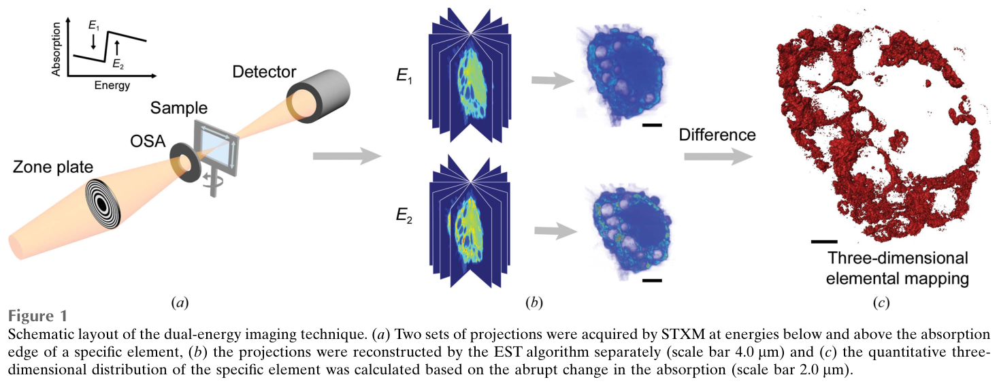
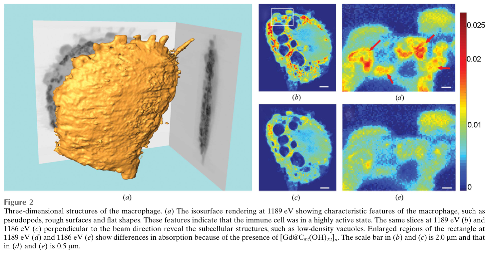
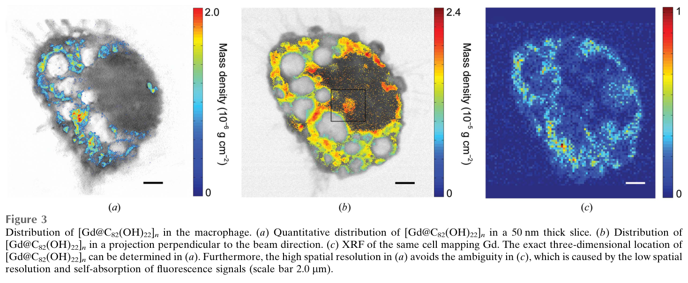
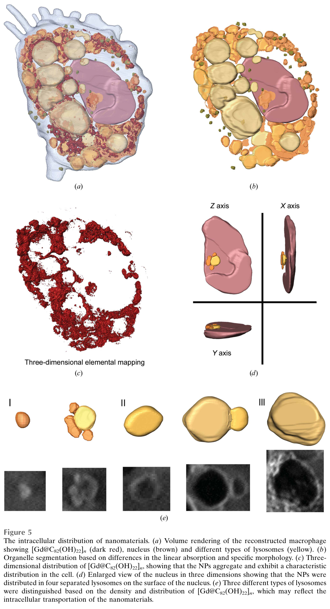
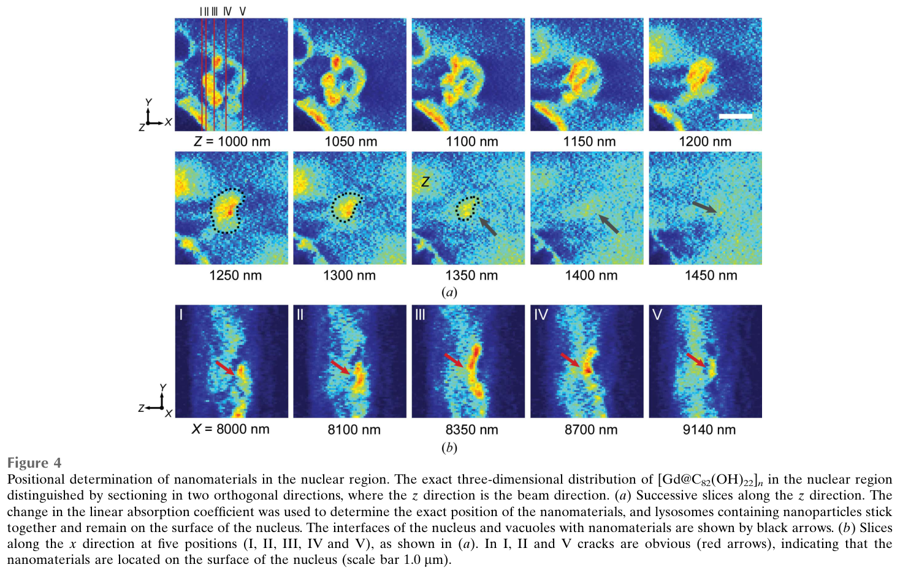

---
tags:
  - papers/上海光源纳米CT
  - papers/软X射线三维成像
aliases:
  - "Dual-energy STXM-EST cell tomography"
  - "BL08U1A mammalian-cell nano-tomography"
date: 2018
doi: 10.1107/S2052252517017912
---

# Three-dimensional ultrastructural imaging reveals the nanoscale architecture of mammalian cells

## 核心信息

- 标题: Three-dimensional ultrastructural imaging reveals the nanoscale architecture of mammalian cells
- 标题翻译: 三维超微结构成像揭示哺乳动物细胞的纳米尺度构筑
- 作者: Shengkun Yao, Jiadong Fan, Zhiyun Chen, Yunbing Zong, Jianhua Zhang, Zhibin Sun, Lijuan Zhang, Renzhong Tai, Zhi Liu, Chunying Chen, Huaidong Jiang
- 机构: 上海科技大学、中国科学院国家纳米科学中心、山东大学、中国科学院上海应用物理研究所上海同步辐射光源
- 发表时间: 2018
- 发表渠道: IUCrJ, 5, 141–149
- DOI: 10.1107/S2052252517017912
- 论文链接: https://journals.iucr.org/m/issues/2018/02/00/mf5022/
- 数据 / 资源: 上海光源软X射线谱学显微束线 BL08U1A；同细胞硬X射线荧光对照来自 BL15U
- 论文类型: 实验成像方法与单细胞生物应用

## 原文摘要翻译

关于纳米材料与大尺寸哺乳动物细胞相互作用的认识，包括细胞摄取、细胞内定位和转运，已经显著推动了纳米医学与纳米毒理学的发展。能够以纳米尺度分辨率在完整大尺寸细胞结构中定位纳米材料的成像技术，对获取这类认识至关重要。本文将双能衬度X射线显微术与一种称为等倾斜断层成像的迭代重建算法结合，实现了细胞内纳米材料的定量三维成像。研究对象是尺寸约为 `20 µm`、暴露于潜在抗肿瘤药物 `[Gd@C82(OH)22]n` 的巨噬细胞。大量纳米颗粒在细胞内聚集，并主要位于吞噬体；细胞核内未观察到纳米颗粒。对完整细胞内纳米药物的成像增进了对该药物高效抗肿瘤活性和低毒性的理解。该成像技术能够以三维方向上较均匀的纳米级分辨率探测完整大尺寸细胞中的纳米材料，并可能使纳米医学和纳米毒理学研究显著受益。

## 创新点

1. **在同一完整大尺寸细胞内联结结构体与元素体。** 作者没有把二维元素图叠加到单幅形貌图上，而是在钆吸收边下方和上方分别采集完整倾转序列，再对两个三维体作差，因此可以把细胞器结构与含钆纳米药物放进同一个三维坐标系。
2. **将等倾斜采样用于软X射线双能细胞断层。** `46` 个等倾斜角与等倾斜断层算法配套，在存在约 `20°` 缺失楔和投影数有限的条件下，以实空间支撑与非负约束稳定重建；这是一项针对原型束线采集约束的算法—实验协同设计。
3. **用正交虚拟切片解决“核内还是核表面”的投影歧义。** 论文不只展示三维渲染，而是沿束流方向和正交方向逐层检查核周热点，证明二维投影中看似与细胞核重叠的颗粒实际位于核表面的吞噬囊泡。
4. **给出纳米药物的质量和体积分数估计。** 在元素差分、阈值分割和细胞器分割的基础上，作者报告纳米颗粒总质量约 `1.2×10^-10 g`、占巨噬细胞体积约 `29%`，把定性定位推进到可审查的定量主张。

## 一句话总结

这篇工作证明上海光源 `BL08U1A` 已能以双能扫描透射X射线显微术结合等倾斜断层重建，在一个完整、固定和脱水的巨噬细胞中获得约 `75–80 nm` 的三维结构，并把含钆纳米颗粒定位到吞噬囊泡而非细胞核；它是软X射线纳米断层的重要实证，但不是自动化、高通量或活细胞平台能力的证明。

## 研究问题

### 科学问题

纳米药物的生物效应取决于它被细胞摄取后进入何种亚细胞区室、是否接近细胞核以及如何随吞噬囊泡发生聚集和转运。电子显微镜虽然分辨率高，却通常依赖切片和复杂制样；荧光显微镜具有分子特异性，但难以同时保持完整细胞结构背景和无标记定量；二维X射线荧光图又把束流方向上的所有结构压在同一平面内。因此，真正困难的不是“看见钆信号”，而是在约 `20 µm` 的完整细胞中判断信号的三维位置。

### 技术问题

作者需要同时解决三个约束：软X射线剂量不能破坏固定细胞；样品架遮挡造成有限角缺失；每改变能量或角度都要重新对焦。论文把任务定义为：在钆 `M2` 吸收边两侧获取配准的断层投影，分别恢复结构体，再利用吸收突变提取钆元素体，最后与细胞器分割结果联合解释。

## 数据与任务定义

### 样品与对照

实验使用小鼠腹腔巨噬细胞，在浓度为每升 `50` 毫摩尔的 `[Gd@C82(OH)22]n` 中处理 `3` 小时，随后以乙醇固定并逐级脱水，铺载于 `100` 纳米碳膜。

主体软X射线实验在上海光源 `BL08U1A` 完成；同一细胞随后在 `BL15U` 以 `8 keV`、`200 nm` 焦斑和 `200 nm` 步长采集二维钆荧光图，作为元素分布的跨模态对照。

### 采集任务

| 环节 | 关键设置 | 对结论的作用 |
|---|---:|---|
| 软X射线聚焦与扫描 | `50 nm` 焦斑，`50 nm` 步长，单点驻留 `5 ms` | 决定投影采样和横向信息上限，不能直接当作三维分辨率 |
| 双能选择 | `1186 eV` 与 `1189 eV` | 位于钆 `M2` 边下、边上，用于元素差分 |
| 断层角度 | `46` 个等倾斜角，约 `±79.4°` | 与等倾斜断层算法配套；样品架仍留下约 `20°` 缺失楔 |
| 辐射剂量 | 约 `4.43×10^6 Gy` | 作者以采集前后 `0°` 投影一致性判断未见可检测结构损伤 |
| 重建 | 每个能量各迭代 `300` 次 | 误差稳定后输出两个三维线性吸收系数体 |

任务输出有三层：两个能量下的细胞结构体、两体配准相减得到的钆分布体，以及基于线性吸收和形貌手工分割的细胞核、不同类型囊泡与纳米颗粒三维模型。

## 方法主线

### 双能差分的物理含义

对同一体素，边上与边下的线性吸收系数之差可近似写为

$$
\Delta \mu(\mathbf r)
=\mu(\mathbf r,E_{\mathrm{above}})
-\mu(\mathbf r,E_{\mathrm{below}})
\approx \rho_{\mathrm{Gd}}(\mathbf r)
\left[
\left(\frac{\mu}{\rho}\right)_{\mathrm{Gd},E_{\mathrm{above}}}
-
\left(\frac{\mu}{\rho}\right)_{\mathrm{Gd},E_{\mathrm{below}}}
\right].
$$

两个能量只相差 `3 eV`，非目标组分的吸收变化被视为缓慢背景；钆在吸收边处的突变成为元素特异性信号。工程上，真正敏感的不是公式本身，而是两能量体的对焦、旋转轴校正和三维配准误差，因为任何边缘错位都会在差分体中形成伪元素信号。

### 机制流程

1. **输入—双能有限角投影。** 在钆吸收边下、边上各采集 `46` 个等倾斜角投影；每次转角或换能量后重新对焦，输出两套待配准的二维投影序列。
2. **操作—投影校轴与等倾斜重建。** 先以质心法把投影对齐到公共倾转轴，再用伪极坐标快速傅里叶变换在实空间和傅里叶空间之间迭代 `300` 次；实空间将负密度和支撑外密度置零，输出两个能量下的三维吸收体。
3. **操作—跨能量配准与元素差分。** 把两个体校准到同一坐标系，逐体素计算吸收差并通过强度直方图设定阈值，输出钆纳米颗粒的三维质量密度分布。
4. **输出—细胞器联合分割与定量。** 在 `Amira` 中依据吸收系数和形貌手工分割细胞核、囊泡与颗粒，输出空间定位、总质量、体积分数及核周囊泡关系。

*论文原图编号：Figure 1。双能STXM—EST—体数据差分的完整流程；它把元素特异性从二维投影提升到三维坐标中的体素判定。*

### 等倾斜重建到底解决什么

常规等角投影在笛卡尔傅里叶网格上需要插值；等倾斜采样则与伪极坐标网格配套，使已测投影更直接地写入三维傅里叶空间。实空间支撑、非负密度和测量傅里叶系数交替约束，在少投影条件下能减少条纹和插值误差。但文中“消除缺失楔”的表述应谨慎理解：算法能压低由缺失楔造成的伪影，却不能从物理上补回未采集方向的独立信息。

## 关键结果

### 三维结构与分辨率

重建巨噬细胞尺寸约为 `18.1×15.5×3 µm³`，可见粗糙表面、伪足、低密度大囊泡和直径约 `200–400 nm` 的高密度初级溶酶体。作者通过实验投影与重投影的一致性以及补充材料中的线剖面，给出约 `75–80 nm` 的三维分辨率。这个数字高于 `50 nm` 焦斑和步长，符合完整系统受光斑、角覆盖、信噪比和重建共同限制的预期。

*论文原图编号：Figure 2。巨噬细胞三维外形及同一位置在`1189 eV`和`1186 eV`下的切片；双能差异集中在含钆区域。*

### 三维定位优于二维元素投影

三种表示给出的证据强度不同：`50 nm` 厚的三维切片能把钆信号放到具体深度；三维体的二维投影重新引入沿束流方向重叠；同细胞X射线荧光图受 `200 nm` 焦斑和自吸收影响，在核周区域只能显示模糊热点。论文最有说服力的结果不是“STXM图更清楚”，而是正交切片能把核周热点判为核表面囊泡中的颗粒。

*论文原图编号：Figure 3。三维切片、该体数据的二维投影与同细胞XRF钆图对照；只有切片保留了束流方向的空间判别力。*

### 纳米颗粒定量和细胞器关系

| 指标 | 论文结果 | 解释边界 |
|---|---:|---|
| 三维结构分辨率 | 约 `75–80 nm` | 不是 `50 nm` 各向同性分辨率 |
| 颗粒总质量 | 约 `1.2×10^-10 g` | 依赖吸收系数、双能配准和阈值 |
| 颗粒体积占比 | 约 `29%` | 来自单细胞分割，不代表群体统计 |
| 大囊泡体积 | 约 `1.7–6.3 µm³` | 依赖手工形貌分类 |
| 颗粒位置 | 仅在细胞质吞噬囊泡中观察到；核内未见 | “未见”受分辨率、剂量和检测阈值约束 |

*论文原图编号：Figure 5。细胞器、钆元素体和三类吞噬囊泡的联合分割；该图支撑质量、体积分数和“核外囊泡定位”结论。*

## 深度分析

### 中央证据链

中央主张由四个环节串联：同一细胞的双能投影保证元素差分有共同结构背景；等倾斜重建把投影变为三维吸收体；正交切片排除束流方向重叠造成的“假核内”信号；同细胞X射线荧光图确认总体钆分布趋势。前三环节支撑三维定位，第四环节只提供较低分辨率的跨模态一致性，不能独立验证每个三维热点。

*论文原图编号：Figure 4。核周区域沿两个正交方向的连续切片；颗粒热点与细胞核之间存在界面或裂隙，支持“位于核表面囊泡而非核内”的判断。*

### 为什么结果成立

双能差分提供元素选择性，三维重建解除投影重叠，两者必须同时成立才足以回答生物定位问题。只做双能二维图仍无法判断深度，只做单能断层则难以区分高密度含钆团簇与其他细胞器。论文的关键方法价值正是把“结构在哪里”和“目标元素在哪里”放到同一体素网格。

### 与替代路线的位置关系

相对电子显微断层，该方法牺牲部分空间分辨率，换取完整约 `20 µm` 细胞、无物理切片和元素边衬度；相对二维X射线荧光，它提高了核周空间判别力，但只能针对预先选定的钆吸收边；相对完整谱学断层，它只用两个能点，采集更省剂量，却不能给出细致化学态谱。它代表上海光源 `BL08U1A` 的软X射线纳米断层支线，不能与后来 `BL18B` 的硬X射线全场透射纳米CT指标混算。

### 生物学解释的边界

数据证明在这个固定巨噬细胞中，大量含钆颗粒位于吞噬囊泡且未在细胞核内达到检测阈值。论文进一步把这种定位与低毒性、免疫刺激和抗肿瘤机制联系起来，但单细胞静态成像没有对照剂量组、时间序列或细胞结局，因而只能提出机制相容性，不能建立“核外定位导致低毒”或“巨噬细胞摄取导致抗肿瘤”的因果链。

## 局限

1. **角度覆盖不完整。** 约 `20°` 缺失楔造成方向性信息缺失；等倾斜迭代可抑制伪影，不能恢复未测傅里叶空间。
2. **原型系统高度依赖人工操作。** 每次转角和换能量后人工复焦，作者明确指出总采集时间是首要瓶颈，而且主要耗在用户操作。
3. **损伤检测灵敏度有限。** 前后两幅 `0°` 投影一致只能说明没有可见形貌变化，不能排除更细微的化学变化或低于成像灵敏度的超微结构损伤。
4. **分割和定量依赖阈值。** `Amira` 手工分割、强度直方图阈值及跨能量配准共同决定质量、体积分数和细胞器分类；操作者间一致性与阈值敏感性并未经过实验检验。
5. **样本外推弱。** 主要证据来自一个固定、脱水巨噬细胞。多细胞重复、活细胞、低温保持、不同纳米材料或不同摄取时程均不在本研究的验证范围内。
6. **作者对缺失楔和三维均匀性的措辞偏强。** 公开结果支持约 `75–80 nm` 的三维成像，但不足以证明所有方向严格同分辨率，也不支持把焦斑尺寸写成实证体分辨率。

## 我的笔记

### 对上海光源路线的可复用启示

- 双能或多能纳米断层必须把自动对焦、跨能量配准和角度切换做成同一控制闭环，否则元素差分精度会被机械漂移主导。
- 每次验收应同时报告焦斑、扫描步长、重建体素、方向性三维分辨率、剂量和端到端采集时间，避免用单个“纳米分辨率”覆盖不同层级。
- 元素质量定量需要标准样、盲测、阈值敏感性和多操作者分割重复性；仅有漂亮的三维渲染不足以支撑定量能力。
- 软X射线双能路线适合完整细胞内特定元素的高衬度定位，可与硬X射线大穿透三维XANES形成互补，但需要跨束线标准样和统一分辨率评价。

### 复现实验检查单

1. 复测同一标准颗粒在多日、不同操作者条件下的三维位置与总质量偏差。
2. 独立测量两能量切换后的焦点漂移和三维配准残差，并给出其对元素差分的误差传播。
3. 使用方向性傅里叶壳相关或至少三个正交线剖面，替代单一“整体分辨率”数字。
4. 对缺失楔、投影数、剂量和阈值做系统消融，建立质量误差与扫描成本的关系。

### 后续问题

- 自动对焦和在线配准能否把双能全流程压缩到常规用户实验可接受的时间尺度？
- 在低温或水合环境中，允许剂量、形貌稳定性和元素化学态保持程度如何共同验收？
- 当目标元素含量更低、吸收边变化更弱时，双能差分的检测限和假阳性率是多少？

## 引用

- Yao et al., 2016. Equally sloped tomography for limited-angle X-ray reconstruction.
- Zhang et al., 2015. Latest advances in soft X-ray spectromicroscopy at SSRF.
- Le Gros et al., 2005. Biological soft X-ray tomography.
- de Jonge et al., 2010. Quantitative three-dimensional elemental mapping by X-ray fluorescence tomography.
- 本地PDF：`01_核心论文PDF/2018_Three-dimensional_ultrastructural_imaging_mammalian_cells_BL08U1A.pdf`
