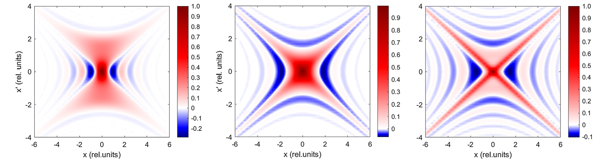
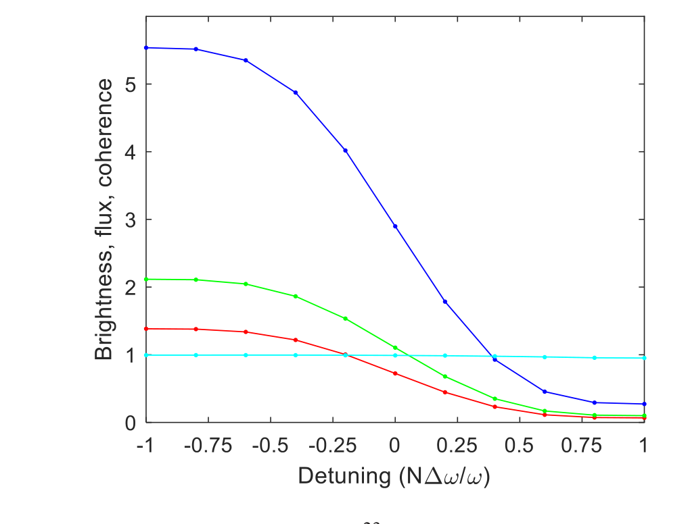
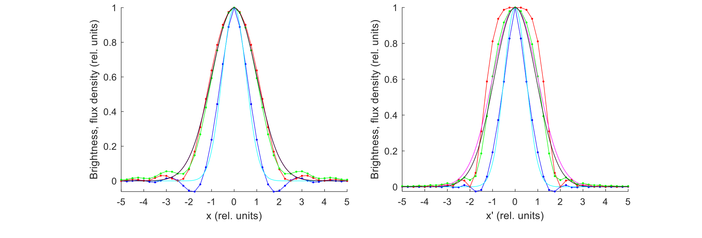
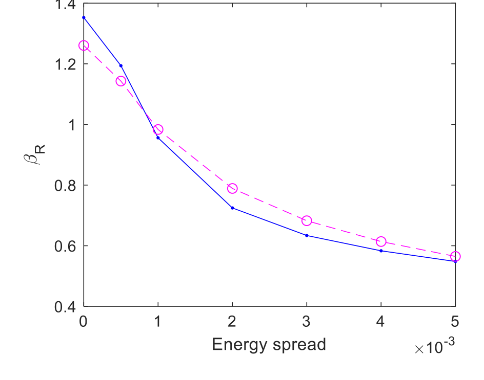
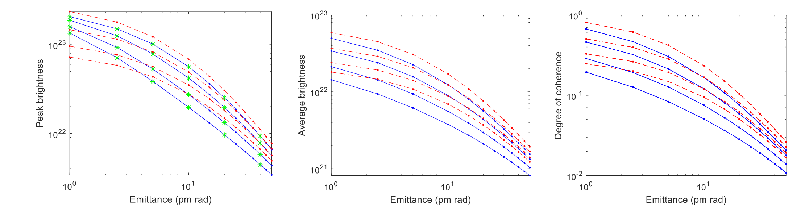
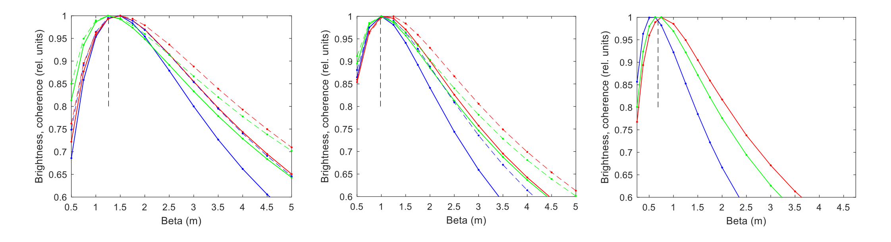

---
tags:
  - papers/synchrotron-radiation
  - papers/diffraction-limited-storage-ring
  - methods/Wigner-distribution
aliases:
  - "Walker undulator brightness coherence 2019"
  - "发射度能散与相干性"
date: 2019-05-28
doi: 10.1103/PhysRevAccelBeams.22.050704
---

# Undulator radiation brightness and coherence near the diffraction limit

## 核心信息

- 标题: Undulator radiation brightness and coherence near the diffraction limit
- 标题翻译: 衍射极限附近的波荡器辐射亮度与相干性
- 作者: Richard P. Walker
- 机构: Diamond Light Source, Oxfordshire, United Kingdom
- 发表时间: 2019-05-28
- 发表渠道: Physical Review Accelerators and Beams, 22, 050704
- DOI: 10.1103/PhysRevAccelBeams.22.050704
- 论文链接: [DOI](https://doi.org/10.1103/PhysRevAccelBeams.22.050704)
- 论文类型: 波荡器辐射相空间 / 理论与数值方法论文

## 原文摘要翻译

本文采用完整四维处理下的 Wigner 表述，研究同步辐射光源中波荡器辐射的亮度与横向相干性。文章给出了能散对亮度和相干性随发射度变化之影响的新结果。与这一主题的其他工作不同，作者发现：发射度减小时，能散的影响会增大；但当接近衍射极限时，亮度与相干性的行为会发生分叉。文章还详细考察了常用高斯近似估算亮度和相干性的准确性，并得到一个新结论：若要使高斯近似得到最准确的结果，通常采用的投影源尺寸和发散角并不是合适的量。为此，作者推导了可用于高斯近似的、随能散变化的 RMS 源尺寸与发散角新表达式。

## 创新点

1. **用完整四维 Wigner 分布统一定义三个指标。** 峰值亮度取相空间中心值，平均亮度对亮度平方做四维积分，总体谱相干度再由波长平方、平均亮度和总通量共同得到，避免二维投影对不可分离场给出错误相干度。
2. **揭示峰值亮度与相干性的低发射度分叉。** 零发射度时能散不降低中心峰值，却会把辐射展宽到离轴相空间，显著降低平均亮度和总体相干度。
3. **纠正高斯近似中的辐射宽度选择。** 常用投影宽度给出 $\lambda/(2\pi)$ 的表观辐射发射度；真正用于亮度和相干度的有效宽度位于中心截面与投影宽度之间，零能散时对应表 I 的模型 4。
4. **给出可用于快速估算的能散修正式。** 文章拟合有效源尺寸、发散角和辐射 beta，并说明其在所考察范围内可把高斯估算控制在约 10%–12% 的局部精度；完整参数扫描的最坏误差仍可接近因子 2。

## 一句话总结

把电子束发射度降到 $\lambda/(4\pi)$ 并不等于获得高相干波荡器光：在 10 千电子伏示例中两个平面均为 10 皮米时总体相干度仅约 17%，而能散会在峰值亮度看似不变时继续侵蚀平均亮度和相干性，因此第四代光源必须联合优化发射度、能散和 β 匹配。

## 研究问题

### “衍射极限储存环”究竟限制了什么

多弯铁消色散（MBA）晶格使电子束发射度快速下降，新环常被称为“衍射极限储存环”。常见判据 $\varepsilon\sim\lambda/(4\pi)$ 只是把电子束发射度与理想光子模的相空间面积相比，却没有直接说明峰值亮度、平均亮度或总体相干度达到多少；它还随波长变化。发射度进入皮米量级后，过去常被忽略的电子束能散可能成为同样重要的限制。

### 文章要检验的两个假设

第一，波荡器光能否用光子与电子的高斯尺寸、发散角平方相加来估算。第二，能散不改变零发射度下的峰值亮度，是否就意味着它不会形成“能散主导区”。作者用完整四维 Wigner 计算同时检验这两个命题，并特意把**峰值量**与**相空间积分量**分开。

## 数据与任务定义

### PETRA IV 示例与扫描变量

| 参数 | 取值 |
|---|---:|
| 电子能量 | 6 GeV |
| 束流电流 | 0.1 A |
| 波荡器周期 $\lambda_0$ | 0.018 m |
| 周期数 (N) | 220 |
| 长度 (L) | 3.96 m |
| 偏转参数 (K) | 1.341 |
| 光子能量 | 10 keV |
| 谐波 | 基波 (n=1) |

计算限制在标准平面波荡器、近轴水平偏振和低阶奇次谐波；主要扫描失谐、均方根相对能散、两个横向平面的几何发射度与 β 函数。输出分别是峰值亮度、平均亮度、总谱通量和总体谱相干度。

*论文原图编号：FIG. 1。三个失谐量下的单电子 $x-x'$ Wigner 亮度分布，非高斯、带负值且位置—角度不可分离。*

*论文原图编号：FIG. 2。单电子峰值亮度、平均亮度、总通量和相干度随失谐变化；相干度恒为 1，而亮度和通量共同随谱线变化。*

### 三个输出不能混为一谈

- **峰值亮度：** $\mathcal B_0=\mathcal B(0,0,0,0)$，只看相空间中心。
- **平均亮度：** 对亮度平方做四维相空间积分并除以总通量，因而对整个分布形状敏感。
- **总体谱相干度：** $\zeta=\lambda^2\mathcal B_{\rm av}/F$，衡量该谱切片中的横向相干份额。

能散可能保持中心不变，却把能量分布摊到离轴位置；这时第一项不变，后两项下降。

## 方法主线

### 机制流程

1. **输入单电子场：** 对给定波荡器、光子能量和失谐，计算近轴复电场及其四维 Wigner 亮度分布。
2. **加入能散：** 按高斯能量分布 $P(\delta)$ 对不同相对能偏差的 Wigner 分布积分，使共振失谐和离轴角分布展宽。
3. **加入发射度：** 将能散后的单电子 Wigner 分布与电子束在 $x,x',y,y'$ 中的高斯相空间密度做四重卷积。
4. **输出与校验：** 从完整分布提取峰值亮度、平均亮度和 $\zeta$，再与高斯近似、SPECTRA 及不同源宽度定义比较，最后扫描 beta 匹配。

### 从高斯近似到 Wigner 定义

常用高斯近似为

$$
\mathcal B_0^{\rm GA}=\frac{F}{4\pi^2\Sigma_x\Sigma_{x'}\Sigma_y\Sigma_{y'}},
\qquad
\Sigma_x^2=\sigma_x^2+\sigma_R^2,
$$

其余三个维度类似。若光子模完全高斯且 $\varepsilon_R=\sigma_R\sigma_{R'}=\lambda/(4\pi)$，则

$$
\zeta_{\rm GA}=\frac{(\lambda/4\pi)^2}{\Sigma_x\Sigma_{x'}\Sigma_y\Sigma_{y'}}.
$$

真实波荡器 Wigner 分布并非高斯。严格定义为电场角谱的互相关 Fourier 变换：

$$
\mathcal B(x,x',y,y')\propto\iint \bar E\!\left(x'+\frac{\theta_x}{2},y'+\frac{\theta_y}{2}\right)\bar E^*\!\left(x'-\frac{\theta_x}{2},y'-\frac{\theta_y}{2}\right)e^{-i(2\pi/\lambda)(x\theta_x+y\theta_y)}d\theta_xd\theta_y.
$$

由此得到

$$
\mathcal B_{\rm av}=\frac{\int \mathcal B^2\,d^4X}{F},
\qquad
\zeta=\lambda^2\frac{\mathcal B_{\rm av}}{F}.
$$

对任意对称单电子场，零发射度时 $\mathcal B_0=F/(\lambda/2)^2$，总体相干度为 1。完整四维处理至关重要：若先投影到二维，场的不可分离性会让平均亮度和相干度失真。

*论文原图编号：FIG. 3。中心截面、二维投影和完整三维投影给出不同的空间与角度宽度，说明“RMS 源尺寸”并非唯一。*

### 哪一种辐射尺寸适合高斯近似

单电子零失谐时，中心一维截面的宽度约为相对单位 0.5，投影宽度约为 1；前者对应“核心发射度” λ/(8π)，后者对应 λ/(2π)，都不等于亮度公式要求的 λ/(4π)。有效宽度必须位于二者之间。作者据此选择表 I 模型 4：

$$
\sigma_{R'}=\sqrt{\frac{\lambda}{4L}},
\qquad
\sigma_R=\frac{\sqrt{\lambda L}}{2\pi},
\qquad
\varepsilon_R=\frac{\lambda}{4\pi},
\qquad
\beta_R=\frac{L}{\pi}.
$$

这不是说实际 Wigner 分布变成了高斯，而是这组有效参数能让高斯公式在零失谐时复现正确的亮度和相干度。

### 能散如何进入相空间

能散通过

$$
\mathcal B(X)=\int \mathcal B(X;\delta)P(\delta)\,d\delta
$$

加入，其中 δ=ΔE/E。失谐变量包含 −2nNδ，所以谐波数、周期数和能散共同放大谱失谐。在表 II 参数下，0.1% 均方根能散已对应约 0.44 的均方根归一化失谐。

能散使角分布明显变宽，空间分布则表现为核心先变窄、尾部变宽。为了继续使用高斯近似，作者拟合出

$$
\sigma_R\simeq\frac{\sigma_{R0}}{\sqrt2},
\qquad
\sigma_{R'}\simeq\frac{\sigma_{R0}'}{\sqrt2}(1+1.41x^2)^{0.19},
\qquad x=2\pi nN\sigma_E,
$$

以及

$$
\beta_R\simeq\frac{L/\pi}{(1+1.41x^2)^{0.19}}.
$$

*论文原图编号：FIG. 10。能散增大时有效辐射 beta 明显下降，拟合式能够跟踪这一趋势。*

### 发射度卷积与联合计算

电子束发射度通过 Kim 的加法定理加入：单电子 $\mathcal B$ 与四个相空间坐标上的高斯电子密度做卷积。发射度增大时，电子分布逐步平滑 Wigner 分布的非高斯结构；因此高发射度极限更接近高斯，而低发射度区必须保留波动光学细节。联合计算先积分能散，再卷积发射度；顺序清楚地对应“每个电子共振偏移”与“许多电子占据不同轨道”两个物理来源。

## 关键结果

### 单独改变能散或发射度

零发射度时，能散不改变中心峰值亮度，却显著降低平均亮度与总体相干度；这是离轴相空间展宽而非中心衰减造成的。单独改变发射度时，高斯近似在极低和很高发射度两端最好，中间区误差可达约 40%；平均亮度与峰值亮度之比在该区仍约在 15% 内保持高斯关系，所以总体趋势相似。

### 联合效应与真正的“能散主导区”

*论文原图编号：FIG. 13。不同能散下峰值亮度、平均亮度和总体相干度随两平面等发射度变化；约 10 pm 以下，峰值亮度与积分指标开始明显分叉。*

发射度大于约 10 pm 时，三类指标随发射度的趋势相近。低于约 10–20 pm 后，峰值亮度趋向与能散无关的同一零发射度极限，而总体相干度仍强烈依赖能散。对所研究的 $0$–$0.3\%$ 能散范围，高斯近似通常捕捉到趋势，但最大误差可接近因子 2；它尤其不能正确表示非零能散、低于约 10 pm 时的峰值亮度。

最重要的定量结论是：10 千电子伏下 $\lambda/(4\pi)\approx10$ 皮米。若两个平面都取 10 皮米，总体谱相干度只有约 17%，不是 50% 或 100%；要达到 50% 需把两个平面都降到约 2.5 皮米。以 10 皮米为例，0.1% 能散把相干度从 17% 降到约 12%，0.3% 能散降到约 5%。同一光子能量下，三次谐波的 0.1% 能散在归一化失谐上近似等效于基波的 0.3%。

### beta 匹配

*论文原图编号：FIG. 16。零、0.1% 和 0.3% 能散下，亮度与相干度随电子束 beta 的相对变化；能散越大，最佳 beta 越低且容差越窄。*

零能散时完整计算的最优 β 约为 1.5 米，高斯近似给出 $L/\pi=1.26$ 米，差异对最优值影响不大。能散增大后，最佳 β 按修正式下降，且亮度、相干度对 β 失配更敏感。因此第四代环的低发射度并非自动转化为高相干通量，还需在波荡器处提供足够低且受控的 β。

## 深度分析

### 峰值亮度为何会误导

峰值亮度是一个点值。能散把不同能量电子的共振辐射推向不同离轴角度时，分布中心可由对称性维持不变，但相空间面积增大、外围尾部增强。对需要整个孔径或有限相干模式的用户来说，平均亮度与 $\zeta$ 更直接。论文因此提出一个尖锐问题：在极低发射度环中，是否应继续把峰值亮度作为首要性能指标？

### $\varepsilon=\lambda/(4\pi)$ 只是尺度相等，不是性能保证

该判据比较电子束与理想高斯光子模的相空间面积，却没有考虑两个平面同时卷积、Wigner 非高斯结构和能散。10 pm 得到 17% 相干度并不与“衍射极限”矛盾；它说明这个标签最多意味着电子和光子尺度可比，而非输出已接近单模。设施宣传、机器验收和用户实验预算应避免把三者混为一谈。

### 快速估算与高保真计算的分工

高斯公式计算快，能给出亮度趋势、最佳 beta 和灵敏度；完整四维 Wigner 积分计算昂贵，却在低发射度、非零能散和比较峰值/积分指标时不可替代。合理工作流是：用高斯公式扫全局设计空间，再在约 10–20 pm 的决策区、较高谐波和能散敏感区用 Wigner 或等价波动光学复核，而不是彻底放弃任何一方。

### 与用户科普关系的衔接

胡宇光与 Margaritondo 用 λ²/(ΩΣ) 说明高亮度与横向相干性相连；本文进一步指出，真实源的 ΩΣ 不能简单由投影均方根宽度构造。能散可以把相空间形状改变到“峰值不变、平均值下降”，正是直观公式在衍射极限附近需要升级为 Wigner 描述的地方。

## 局限

- 模型采用理想平面波荡器、近轴水平偏振和低阶奇次谐波，忽略单周期内更复杂的干涉、磁场误差与端场。
- 电子束各相空间坐标被假定为不相关高斯分布，没有加入横纵耦合、色散、非高斯尾部、集体效应和束流抖动。
- 主要数字来自 6 GeV、3.96 m、10 keV 的单一示例；2.5、10、20 pm 等阈值会随光子能量、谐波和波荡器长度变化。
- 计算停在源端，没有传播通过有限孔径、单色器、镜面和聚焦系统，也没有实验测量不确定度。
- 高斯近似“误差小于因子 2”只适用于本文扫描范围；在工程验收中，因子 2 可能仍不可接受。

## 我的笔记

### 面向光源设计和验收的联合指标

不要只报告电子发射度或峰值亮度。至少应同时给出两个平面发射度、RMS 能散、所用谐波、峰值亮度、平均亮度/相干通量、总体谱相干度、波荡器 beta 和带宽定义。若输出来自高斯近似，还应注明辐射宽度采用中心截面、投影还是有效拟合值。

### 值得追问的计算与实验

- 把实际磁场误差、耦合、色散和束流抖动加入 PETRA IV 示例，检验 17%、12% 和 5% 是否稳定。
- 传播到光束线入口和样品面后，源端平均亮度与可用相干通量的相关性有多强。
- 在固定光子能量下比较降低能散、缩短波荡器和改用不同谐波的收益与机器代价。
- 用相空间层析或强度干涉实验直接检验“中心峰值不变、总体相干度下降”的预测。

## 引用

Walker, R. P. (2019). Undulator radiation brightness and coherence near the diffraction limit. *Physical Review Accelerators and Beams, 22*, 050704. https://doi.org/10.1103/PhysRevAccelBeams.22.050704

开放许可：CC BY 4.0。本文对应的逐节中文全译见同目录 `2019_Undulator_radiation_brightness_and_coherence_全文中文翻译.md`。

## 人工智能调优视角的文献总结（面向光源质量保障）

这篇文献最关键的工程含义是：同步辐射光源质量不能用“单一经验指标”替代，它本质上是一个“电子束二维/四维统计状态 + 辐射谱—空间耦合”的全链路函数。对 AI 调优来说，最容易踩坑的是把“提高某一单点亮度”当作目标，而忽略了辐射相干性和束斑展宽的协同约束。

### 可直接复用于智能体的核心结论

1. 将质量指标从单变量变为多目标向量
   文献显示 brightness（亮度）、\(\zeta\)（相干度相关指标）和谱参数不是独立指标。AI 调优应至少输出
   \[\text{平均通量}, \text{束流发散与横向尺寸}, \text{谱线带宽}, \text{相干分数}, \text{稳定性}\]这组向量，并用可约束的 Pareto 或加权标量化来决策。

2. 不要直接采用“理想高斯模型”当真值
   论文核心是 Wigner 表征比高斯近似更全面。AI 代理的数字模型（仿真器）应保留离轴、偏离中心、能散等导致谱—空间耦合的效应。否则在线优化可能在窄工况下过拟合，换工况失真明显。

3. “误差可校准”而非“误差可忽略"
   文献中强调了实际束流误差和模型参数偏差对高亮度/高相干区域最敏感。对应到你的框架里，Verifier 的评分函数应引入历史真实数据残差项：
   - 先用仿真器给候选动作预测指标
   - 用在线测量残差校正（或同态偏置）
   - 仅在经过校正后再将评分反馈给 Actor/策略网络
   这样可显著降低“仿真器很聪明但现场无效”的风险。

4. 能散与耦合误差是关键瓶颈
   在接近衍射极限时，束团能散 \(\sigma_E/E\)、耦合、beta 及轨道抖动对质量约束最敏感。智能体优化时要把这些作为显式约束或高惩罚项，否则可能牺牲可重复性换取名义亮度。

### 建议的 AI 调优闭环映射

- 状态输入（state）：
  电子束参数、各类光学元件电流/电压、温度与振动、上游装置工况、前一周期的束线测量（束斑大小、发散、谱线参数、漂移）。
- 模型层（simulator）：
  采用可分层代理模型：低延迟 surrogate 做候选筛选，关键动作再调用高保真仿真（含 Wigner 或其近似核）复核。
- 验证层（verifier）：
  引入历史数据残差校正、物理守恒约束、以及“安全边界”过滤（不能允许设备快速跨越安全区）。
- 控制输出（actor）：
  对单线束站以“可执行动作清单+置信度”输出；当置信度不足时采用多轮验证-更新策略。

### 对加速器运维场景的质量保证建议

1. 先在高保真离线数字孪生中进行反事实验证，再进影像/功率边界受限的影子模式。
2. 小范围验收时只放开与光源质量强相关的 3~5 个自由度，逐步扩大动作空间。
3. 关键门限策略采用“亮度上升但相干性下降不超阈值”的复合判据，避免单指标过拟合。
4. 每次调优输出应留存“动作-预测-实测-残差-修正”闭环记录，便于模型再训练与事故追溯。

### 工程风险与约束清单

- 数据噪声或测量延迟会放大奖励信号偏差；在训练/部署中要显式建模测量噪声与反馈时延。
- 光源端与光束线端联调时，模型要分层更新，否则会把局部优化当成全局最优。
- 面向 10 条线站联调需要加任务优先级与排产约束，这是影响可用性的真实瓶颈，常比算法本身更关键。
