---
tags:
  - translations/synchrotron-radiation
date: 2019-05-28
doi: 10.1103/PhysRevAccelBeams.22.050704
source_language: en
target_language: zh-CN
---

# 衍射极限附近的波荡器辐射亮度与相干性

> [!note] 译文说明
> 本文档依据英文 PDF 全文逐节翻译，保留原章节、公式编号、表格、图号与参考文献编号。公式以 PDF 排印为准；参考文献题名保留原文，便于检索。本译文为学习用途的非官方中文译本。

**原题：** Undulator radiation brightness and coherence near the diffraction limit  
**作者：** Richard P. Walker  
**机构：** Diamond Light Source, Oxfordshire OX11 0DE, United Kingdom  
**收稿：** 2018-11-02；**发表：** 2019-05-28  
**期刊：** *Physical Review Accelerators and Beams* 22, 050704 (2019)  
**DOI：** [10.1103/PhysRevAccelBeams.22.050704](https://doi.org/10.1103/PhysRevAccelBeams.22.050704)  
**许可：** Creative Commons Attribution 4.0

## 摘要

本文采用完整四维处理下的 Wigner 表述，研究同步辐射光源中波荡器辐射的亮度与横向相干性。文章给出了能散对亮度和相干性随发射度变化之影响的新结果。与这一主题的其他工作不同，作者发现：发射度减小时，能散的影响会增大；但在接近衍射极限时，亮度与相干性的行为会分叉。本文还详细探讨了常用高斯近似估算亮度和相干性的准确性，由此得到一个新结论：若要在高斯近似中获得最准确的结果，通常采用的投影源尺寸与发散角并不是合适的量。文章进一步推导了供高斯近似使用的、随能散变化的 RMS 源尺寸和发散角新表达式。

## I. 引言

随着基于多弯铁消色散（MBA）晶格的低发射度储存环出现，同步辐射光源领域正在发生一场革命[1]。这类储存环有望提供亮度和横向相干度远高于以往的同步辐射。第一台此类第四代储存环光源 MAX IV 最近已在瑞典投入运行[2]，巴西 Sirius 和法国欧洲同步辐射装置升级项目也将随后跟进。世界各地还有许多新建储存环和升级项目处于实施或规划的不同阶段；近期综述见文献[3]。

这些新储存环有时被称为“衍射极限储存环”。当电子束发射度 $\varepsilon$ 降到与光子束固有发射度可比时，就说它接近衍射极限。然而，这一术语并不精确，因为衍射极限取决于波长；最常用的定义是 $\varepsilon\sim\lambda/(4\pi)$，其中 $\lambda$ 为辐射波长。

事实上，现有第三代储存环在较长波长处，以及在 X 射线波段的垂直平面内，早已接近衍射极限。但低发射度 MBA 晶格的近期发展，重新引出了“衍射极限究竟是什么”以及“可以接近到什么程度”等问题。尤其当发射度很小时，理解电子束能散的影响变得日益重要[4]；许多早期亮度和相干性研究忽略了这一因素。

本文旨在研究同时考虑电子束发射度和能散时能够多接近衍射极限，并考察常用高斯近似（GA）的有效性。文章还将进一步解释近期受到关注的一个“悖论”：能散本身不影响峰值亮度，却会降低离轴横向相干性[4]。

## II. 亮度和相干性的高斯近似

波荡器辐射的峰值亮度通常用下式估算，该式称为高斯近似：

$$
\mathcal B_0=\frac{F}{4\pi^2\Sigma_x\Sigma_{x'}\Sigma_y\Sigma_{y'}}. \tag{1a}
$$

其中，$F$ 为谱通量（单位为光子每秒每 0.1% 带宽），$\Sigma_{x,y}$ 与 $\Sigma_{x',y'}$ 分别为水平 $x$ 和垂直 $y$ 平面内的 RMS 束斑尺寸与发散角：

$$
\begin{aligned}
\Sigma_x&=(\sigma_x^2+\sigma_R^2)^{1/2}, &
\Sigma_y&=(\sigma_y^2+\sigma_R^2)^{1/2},\\
\Sigma_{x'}&=(\sigma_{x'}^2+\sigma_{R'}^2)^{1/2}, &
\Sigma_{y'}&=(\sigma_{y'}^2+\sigma_{R'}^2)^{1/2}.
\end{aligned}\tag{1b}
$$

它们同时包含电子束尺寸 $\sigma_x,\sigma_{x'},\sigma_y,\sigma_{y'}$ 和固有光子束尺寸 $\sigma_R,\sigma_{R'}$。Krinsky 首先在波荡器语境中引入式(1)[5]，但其 $\sigma_R$ 表达式后来被文献[6,7]中更正确的衍射处理所取代。

式(1b)中的光子发射度 $\varepsilon_R=\sigma_R\sigma_{R'}$ 通常取 $\lambda/(4\pi)$，因为这是光学谐振腔高斯模的适当值[6]。当电子束发射度为零时，$\mathcal B_0=F/(\lambda/2)^2$。又因高斯模完全相干，所以

$$
F_{\mathrm{coh}}=\mathcal B_0\left(\frac{\lambda}{2}\right)^2.\tag{2}
$$

由式(1)和式(2)直接得到谱相干度——即相干通量与总通量之比：

$$
\zeta=\frac{F_{\mathrm{coh}}}{F}
=\frac{(\lambda/4\pi)^2}{\Sigma_x\Sigma_{x'}\Sigma_y\Sigma_{y'}}.\tag{3}
$$

不过，以上写法只是合理命题，而不是基本定理。式(1)对高斯模成立，却未必对波荡器辐射成立；式(2)和式(3)从零发射度下的式(1)推出，也未必普遍成立。尽管如此，这些表达式极其简单，因而被广泛采用，同时也带来一些困难。

上述公式用平方和卷积光子和电子尺寸，隐含二者均为高斯分布。对本文所讨论储存环中的电子束，这通常是很好的近似；对光子却不是。因此，人们提出了多套不同公式。表 I 汇总了当前使用的几种辐射参数定义，以及相应的辐射发射度 $\varepsilon_R=\sigma_R\sigma_{R'}$ 和 beta 值 $\beta_R=\sigma_R/\sigma_{R'}$。beta 的意义在于：高斯近似式(1)在电子束 beta $\beta_{x,y}=\sigma_{x,y}/\sigma_{x',y'}$ 等于辐射 beta 时给出最大亮度，即辐射与电子的相空间椭圆实现“匹配”。

**表 I　固有波荡器辐射参数的不同定义**

| 模型 | $\sigma_{R'}$ | $\sigma_R$ | $\varepsilon_R$ | $\beta_R$ | 文献 |
|---:|---:|---:|---:|---:|---:|
| 1 | $\sqrt{\lambda/L}$ | $\sqrt{\lambda L}/(4\pi)$ | $\lambda/(4\pi)$ | $L/(4\pi)$ | [6] |
| 2 | $\sqrt{\lambda/(2L)}$ | $\sqrt{2\lambda L}/(4\pi)$ | $\lambda/(4\pi)$ | $L/(2\pi)$ | [7,8] |
| 3 | $\sqrt{\lambda/(2L)}$ | $\sqrt{2\lambda L}/(2\pi)$ | $\lambda/(2\pi)$ | $L/\pi$ | [9,10] |
| 4 | $\sqrt{\lambda/(4L)}$ | $\sqrt{\lambda L}/(2\pi)$ | $\lambda/(4\pi)$ | $L/\pi$ | [11] |

当目标是优化亮度和接近衍射极限时，这些公式的差异显然很重要。模型 3 尤其造成概念困难：其发射度为 $\lambda/(2\pi)$，式(3)会在零电子发射度极限给出 (1/4) 的相干度，而单电子辐射按定义应具有完全横向相干性。不同源尺寸与发散角模型之所以并存，是因为辐射相空间根本不是高斯形。模型 3 的矛盾来自其使用投影相空间宽度；后文会表明，这些量不适合计算亮度和相干度。

## III. 基于 Wigner 函数的亮度和相干性

目前被广泛接受的相空间亮度分布定义建立在 Wigner 分布之上[4,6–8,10–14]：

$$
\begin{aligned}
\mathcal B(x,x',y,y')={}&\frac{2\varepsilon_0c}{h}\frac{1}{\lambda^2}\frac{I}{e}
\iint \bar E\!\left(x'+\frac{\theta_x}{2},y'+\frac{\theta_y}{2}\right)
\bar E^*\!\left(x'-\frac{\theta_x}{2},y'-\frac{\theta_y}{2}\right)\\
&\times\exp\!\left[-i\frac{2\pi}{\lambda}(x\theta_x+y\theta_y)\right]d\theta_xd\theta_y.
\end{aligned}\tag{4}
$$

其中，$\bar E$ 是角度表象下的电场，$\bar E^*$ 是其复共轭，$I$ 是电子束电流。由亮度函数计算峰值（即中心）亮度 $\mathcal B_0=\mathcal B(0,0,0,0)$，以及文献[12]定义的平均亮度：

$$
\mathcal B_{\mathrm{av}}=
\frac{\iiiint \mathcal B^2(x,x',y,y')\,dx\,dx'\,dy\,dy'}{F},\tag{5}
$$

其中 $F=\iiiint \mathcal B\,dx\,dx'\,dy\,dy'$ 为总通量，以下所有积分均默认为从 $-\infty$ 到 $+\infty$。平均亮度与总体谱相干度直接相关[12]：

$$
\zeta=\lambda^2
\frac{\iiiint \mathcal B^2\,dx\,dx'\,dy\,dy'}{F^2}
=\lambda^2\frac{\mathcal B_{\mathrm{av}}}{F}.\tag{6}
$$

现在可用这些定义为前述讨论建立更坚实的基础。可以直接从式(4)解析证明：对任意对称电场分布，因而也对任意失谐下、零发射度和零能散的单电子波荡器辐射[8,10,12]，都有

$$
\mathcal B_0=\frac{F}{(\lambda/2)^2}.\tag{7}
$$

这与式(2)相同，但现在它是从 Wigner 亮度公式普遍推导出来的。为了使式(1)在零发射度时与 Wigner 结果一致，光子发射度必须取 $\varepsilon_R=\lambda/(4\pi)$。

也可解析考察与式(1)一致的真正高斯亮度分布：

$$
\mathcal B=\mathcal B_0e^{-x^2/(2\Sigma_x^2)}e^{-x'^2/(2\Sigma_{x'}^2)}
e^{-y^2/(2\Sigma_y^2)}e^{-y'^2/(2\Sigma_{y'}^2)}.
$$

将其代入式(5)和式(6)，得到

$$
\mathcal B_{\mathrm{av}}=\frac{\mathcal B_0}{4},\tag{8}
$$

以及 $\zeta=(\lambda/4\pi)^2/(\Sigma_x\Sigma_{x'}\Sigma_y\Sigma_{y'})$。因此，基于 Wigner 形式的亮度与相干度定义，为前一节的近似提供了严格基础：这些近似不仅在零电子发射度下有效，在电子束可由高斯分布很好描述的发射度主导区也有效。确定 $\varepsilon_R=\lambda/(4\pi)$ 后，下一节讨论适当的 beta 值。

## IV. 单电子辐射

本文只考虑标准平面波荡器中靠近轴线产生的水平偏振分量，磁场分量沿垂直方向；同时只考虑低阶奇次谐波，于是式(4)可简化为

$$
\begin{aligned}
\mathcal B(x,x',y,y')={}&\frac{\alpha\gamma^2N^2F_n(K)}{\lambda^2}\frac{I}{e}
\iint E\!\left(x'+\frac{\theta_x}{2},y'+\frac{\theta_y}{2}\right)
E\!\left(x'-\frac{\theta_x}{2},y'-\frac{\theta_y}{2}\right)\\
&\times\exp\!\left[-i\frac{2\pi}{\lambda}(x\theta_x+y\theta_y)\right]d\theta_xd\theta_y,
\end{aligned}\tag{9}
$$

其中 $\alpha$ 为精细结构常数，$\gamma$ 为相对论因子，$N$ 为波荡器周期数，$F_n(K)$ 为第 $n$ 次谐波的标准波荡器通量函数，$K$ 是偏转参数[10]：

$$
F_n(K)=\frac{n^2K^2}{(1+K^2/2)^2}
\left\{J_{(n-1)/2}\!\left[\frac{nK^2}{4(1+K^2/2)}\right]
-J_{(n+1)/2}\!\left[\frac{nK^2}{4(1+K^2/2)}\right]\right\}^2.
$$

$E$ 为线形函数：

$$
E(\theta)=\frac{\sin(N\pi\omega/\omega_1)}{N\pi\omega/\omega_1},
$$

其中 $\omega_1=4\pi c\gamma^2/[\lambda_0(1+K^2/2)]$ 为轴上基波频率。若关注频率与轴上频率的差用“失谐” $N\Delta\omega/\omega_1$ 表示，电子相对能量偏差为 $\delta=\Delta\gamma/\gamma$，则线形函数的自变量可写为

$$
\frac{N\omega}{\omega_1}=\frac{\theta^2}{2\lambda/L}
+N\left(\frac{\Delta\omega}{\omega_1}\right)-2nN\delta.\tag{10}
$$

在这一形式中，线形函数完整描述辐射；本文忽略单个周期内部的附加干涉效应[15]，否则计算会更复杂。该简化对低阶谐波有效，并使包含能散和发射度的完整四维 Wigner 计算在算力上可行。

以下计算以拟议超低发射度 PETRA IV 环[17]的一台候选波荡器[16]为例，所有参数列于表 II。

**表 II　仿真所用电子束和波荡器参数**

| 参数 | 数值 |
|---|---:|
| 电子能量 | 6 GeV |
| 束流电流 $I$ | 0.1 A |
| 周期长度 $\lambda_0$ | 0.018 m |
| 周期数 $N$ | 220 |
| 长度 $L$ | 3.96 m |
| 偏转参数 $K$ | 1.341 |
| 光子能量 | 10 keV |
| 谐波数 $n$ | 1 |

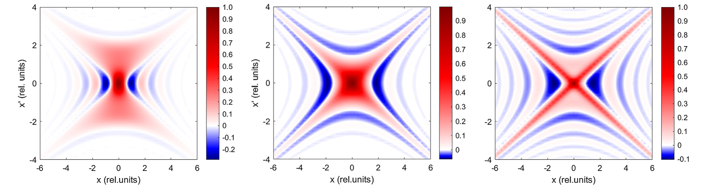
*图 1　不同失谐 $N\Delta\omega/\omega_1=-1$（左）、0（中）和 +1（右）时的亮度分布，各自归一化为 1。*

图 1 给出三种失谐下 $(x-x')$（同样也可视为 $(y-y')$）平面的亮度分布截面。本文所有图中的 $(x,x')$ 均用投影辐射尺寸与发散角的 RMS 值归一化，即表 I 模型 3。亮度明显非高斯，而且不能分离成各相空间坐标的函数乘积，因此任何高斯近似的准确性都必然有限。

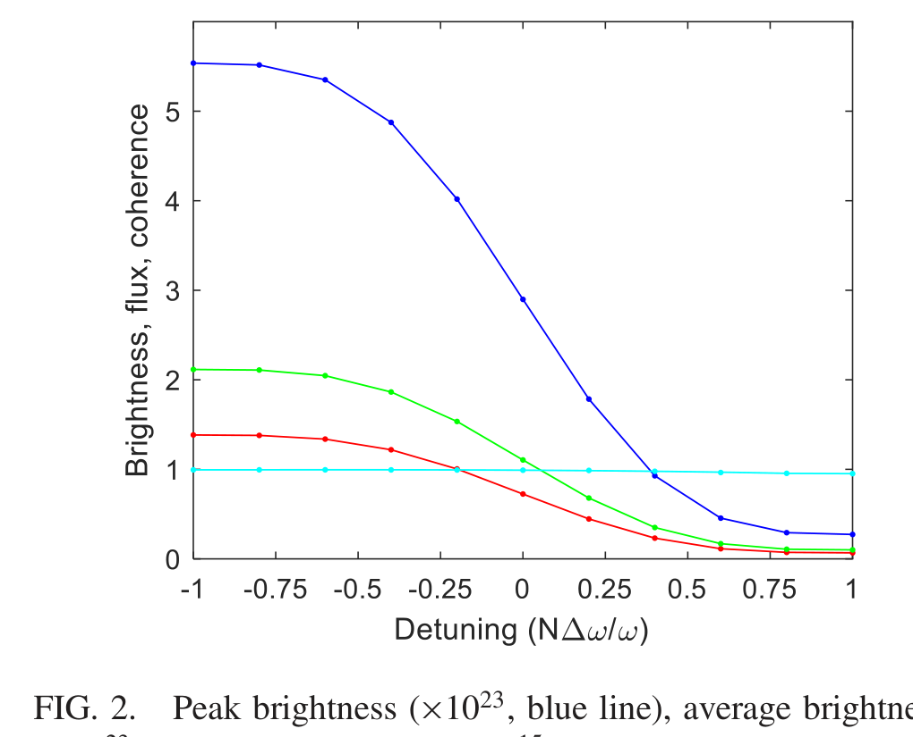
*图 2　峰值亮度（蓝，$\times10^{23}$）、平均亮度（红，$\times10^{23}$）、总通量（绿，$\times10^{15}$）和相干度（青）随失谐变化。*

图 2 显示峰值亮度、平均亮度和总通量随失谐的变化。通量采用光子每秒每 0.1% 带宽，亮度采用通量每 $​\mathrm{mm^2\,mrad^2}$。两条亮度曲线都跟随已知的积分通量—失谐曲线。结果证实式(7)、式(8)，也证实相干度为 1。文献[12]只计算 Wigner 分布的二维投影；由于辐射场不可分离，该做法会使二维投影中的平均亮度和相干度错误。因此，本文始终使用完整四维形式。

要用式(1)和式(3)估计亮度和相干度，就必须定义适当的源尺寸和发散角，但定义方式不止一种。可以取亮度分布的一维中心截面，用具有相同峰值和积分的高斯函数估算尺寸；本文称之为“核心”RMS 值，四维乘积称“核心发射度”。也可以从二维投影的空间与角通量密度出发，拟合具有相同积分和峰值的二维高斯；这种方法只适用于圆对称情形。还可计算沿目标坐标轴的一维、三维投影强度，再拟合一维高斯。真正的高斯亮度分布会使这些方法得到同一宽度，真实波荡器光却不会。

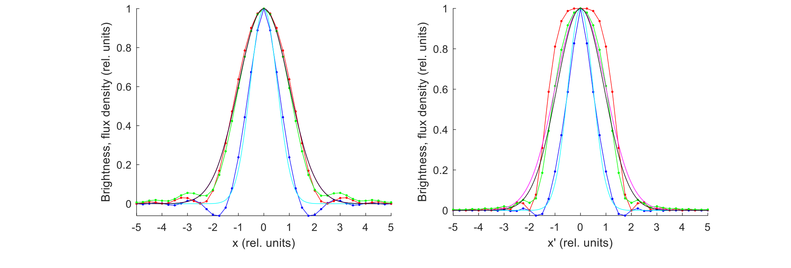
*图 3　空间（左）和角度（右）亮度分布：一维截面（蓝）、二维投影通量密度的截面（红）、完整三维投影（绿）及相应高斯拟合（青、品红、黑）；品红与黑曲线非常接近。*

零失谐时，一维截面被 RMS 约 0.5（相对单位）的高斯很好拟合；两种投影虽然角分布形状不同，却都能由 RMS 约 1.0 的高斯近似。因此核心发射度为 $\lambda/(8\pi)$，而投影给出 $\lambda/(2\pi)$。二者都不符合高斯近似要求的 $\lambda/(4\pi)$。换言之，能让式(1)和式(3)给出正确亮度与相干度的相空间宽度，位于一维截面和二维/三维投影结果之间。不过三种定义的 beta 都接近相对单位 1，即 $\beta_R=L/\pi$。因此，作者认定表 I 模型 4 最适合描述零失谐下的基本单电子辐射；下文所称“高斯近似”均默认该模型。

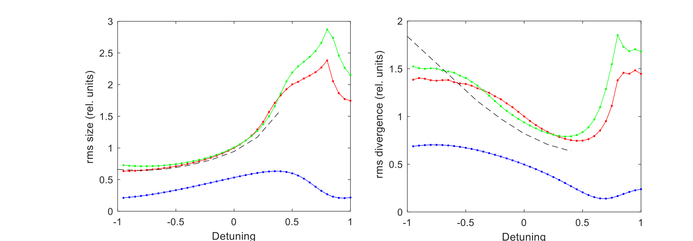
*图 4　由一维截面（蓝）、二维投影（红）和完整三维投影（绿）得到的 RMS 束斑尺寸（左）和发散角（右）随失谐变化；黑色虚线来自文献[18]。*

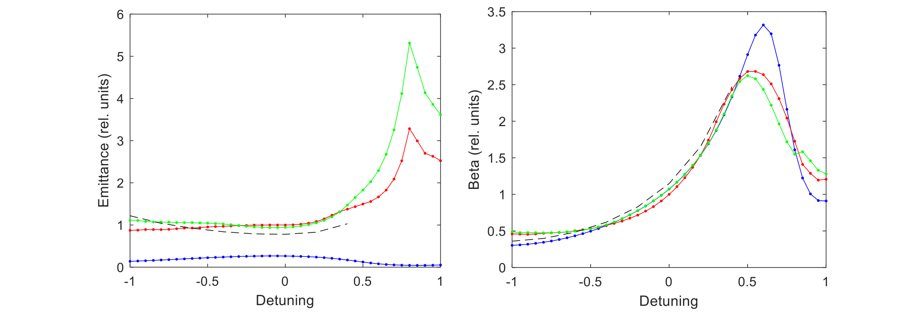
*图 5　把图 4 数据表示为相对发射度（左）和 beta（右）。*

图 4 考察相空间宽度随失谐的变化。投影轮廓的 RMS 值与文献[18]大体一致，但角发散角有差异，因为角分布强烈非高斯，而文献[18]采用了不同的等效 RMS 定义。图 5 显示相同数据对应的发射度与 beta。向负失谐方向，发射度大体保持不变，但不是高斯近似要求的相对值 0.5；正失谐时，发射度和 beta 快速增加。在这里，强度降低且相空间分布振荡更强，数值积分对积分范围等参数更加敏感。

总之，波荡器辐射的亮度分布复杂，不能由高斯函数乘积很好表示。即使零失谐，为匹配高斯近似所需的相空间宽度也不对应任何显然的宽度定义；正失谐时偏差更大。尽管如此，式(1)和式(3)简便且广泛使用，后文继续检验加入能散与发射度后它们可用到什么程度，并把重点放在零失谐。

## V. 电子束能散的影响

能散可通过对能量分布积分加入亮度函数：

$$
\mathcal B(x,x',y,y')=\int \mathcal B(x,x',y,y';\delta)P(\delta)d\delta,\tag{11}
$$

其中 $\delta=\Delta E/E$，并假设其概率分布为高斯：

$$
P(\delta)=\frac{1}{\sqrt{2\pi}\sigma_E}
\exp\left(-\frac{\delta^2}{2\sigma_E^2}\right).
$$

从式(10)可直接看出能量偏差的作用可能很大。表 II 波荡器若有典型的 0.1% RMS 能散，RMS 失谐达到 0.44；结合图 4、图 5，这一数值不可忽略。

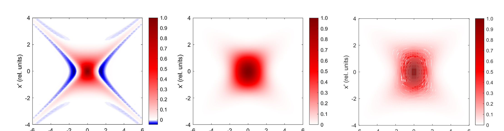
*图 6　亮度分布。左：$\sigma_E=0.001,\varepsilon_x=\varepsilon_y=0$；中：$\sigma_E=0,\varepsilon_x=\varepsilon_y=10$ pm、$\beta_x=\beta_y=2$；右：同时取 $\sigma_E=0.001$ 和 10 pm 发射度。各图分别归一化为 1。*

图 6 左图表明，0.1% 能散显著“抹平”亮度分布，沿 $x'$ 方向尤其明显。

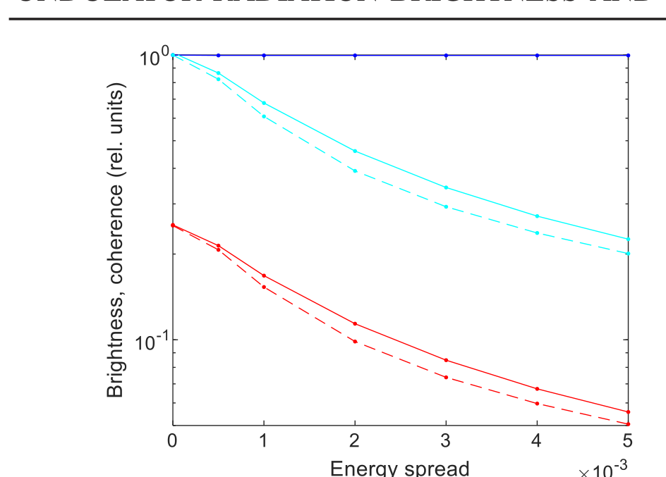
*图 7　零失谐时峰值亮度（蓝）、平均亮度（红）和相干度（青）随能散变化；亮度归一化到零能散的峰值。虚线为使用式(14)、式(15)的高斯近似。*

图 7 显示中心亮度恒定。这是因为非零能散时式(7)仍成立，且对称性保证零失谐处通量也恒定。相反，由式(6)连接的平均亮度与相干度均随能散显著下降。这与文献[4]一致：能散不影响峰值亮度，却降低离轴相干性。

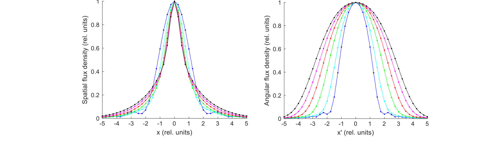
*图 8　RMS 能散从 0（蓝）到 0.005（黑）、步长 0.001 时，沿 $x$（左）和 $x'$（右）轴的三维投影分布。*

图 8 显示，能散增大时源发散角明显增大；空间分布更复杂，中心变窄而尾部变宽，使有效 RMS 值难以确定。

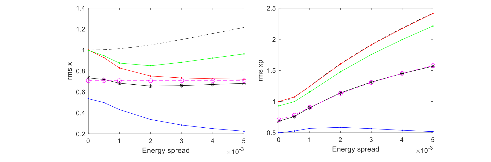
*图 9　由一维截面（蓝）、二维投影（红）和完整三维投影（绿）得到的 RMS 尺寸（左）与发散角（右）随能散变化。黑虚线为式(12)，黑星为式(13)拟合，品红圆为式(14)。*

文献[19]给出角宽和空间宽相对单电子值的放大因子 $Q_a,Q_s$：

$$
\sigma_{R'}=Q_a\sigma_{R0'},\qquad \sigma_R=Q_s\sigma_{R0},\tag{12}
$$

$$
Q_a=\left[
\frac{2x^2}{-1+e^{-2x^2}+\sqrt{2\pi}\,x\,\mathrm{erf}(\sqrt2x)}
\right]^{1/2},
\qquad
Q_s=[Q_a(x/4)]^{2/3},
$$

其中 $x=2\pi nN\sigma_E$，$\sigma_{R0'}=\sqrt{\lambda/(2L)}$，且为方便起见取 $\sigma_{R0}=[\lambda/(2\pi)]/\sigma_{R0'}$；作者从文献[19]的 $Q_s$ 表达式中移除了一个因子 2。

在角平面中，核心 RMS 值约保持在相对单位 0.5，而投影值显著增加。二维投影的 RMS 与 $Q_a$ 重合，因为定义方法相同；三维投影略有不同。空间维度中，各 RMS 值起初都下降，随后彼此分离；$Q_s$ 与这些值差异较大，且没有反映能散初增时空间尺寸缩小的现象。

接下来寻找能与高斯近似匹配的有效尺寸和发散角。由于峰值亮度与能散无关，不能使用式(1)，故用式(3)定义

$$
(\sigma_R\sigma_{R'})_{\mathrm{fit}}=\frac{\lambda}{4\pi\sqrt\zeta}.\tag{13}
$$

图 9 同时给出由式(13)及三维投影 beta 导出的 RMS 值。它们仍处于核心宽度与投影宽度之间，并可由下式很好近似：

$$
\sigma_R\simeq\frac{\sigma_{R0}}{\sqrt2},\qquad
\sigma_{R'}\simeq\frac{\sigma_{R0'}}{\sqrt2}(1+1.41x^2)^{0.19}.\tag{14}
$$

有效发散角表达式来自数值拟合；有效尺寸在 10% 内恒定，所以未进一步拟合。把这些值代入式(3)，相干度与数值结果在约 12% 内一致。由式(6)，平均亮度也可近似为

$$
\mathcal B_{\mathrm{av}}=\frac{F/4}{4\pi^2\Sigma_x\Sigma_{x'}\Sigma_y\Sigma_{y'}}.\tag{15}
$$

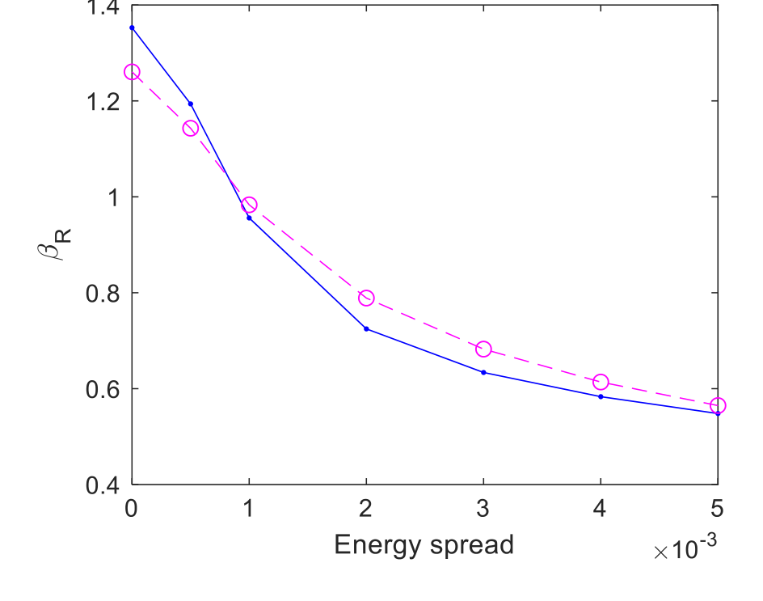
*图 10　由三维投影得到的辐射 beta 随 RMS 能散变化；蓝线为计算，品红线为式(16)。*

图 10 表明，能散显著降低辐射 beta；根据式(14)，在 10% 内可写为

$$
\beta_R=\frac{\sigma_R}{\sigma_{R'}}
\simeq\frac{L/\pi}{(1+1.41x^2)^{0.19}}.\tag{16}
$$

总之，能散显著增大投影角宽，并以“核心变窄、宽尾增强”的复杂方式改变空间分布。尽管如此，峰值亮度不变。这个表面矛盾源于投影相空间宽度并不能很好指示峰值亮度。另一方面，平均亮度及总体相干度会被能散显著降低；式(14)为有效辐射源参数提供了一个简单经验模型，可在高斯近似中复现这一影响。

## VI. 电子束发射度的影响

为加入电子束发射度，本文采用 Kim[6] 的“加法定理”，将亮度函数与电子束密度分布卷积。假设电子束在各相空间坐标上是不相关的高斯分布，则

$$
\begin{aligned}
\mathcal B(x,x',y,y')={}&\iiiint
\mathcal B(x-x_0,x'-x_0',y-y_0,y'-y_0')\\
&\times P(x_0)P(x_0')P(y_0)P(y_0')
\,dx_0\,dx_0'\,dy_0\,dy_0',
\end{aligned}\tag{17}
$$

其中对 $z=x,x',y,y'$，$P(z)=\exp[-z^2/(2\sigma_z^2)]/(\sqrt{2\pi}\sigma_z)$。概念上很简单，但完整四维亮度分布及总体相干度计算非常耗时。图 6 中图显示，即使 10 pm 这样较小的发射度也会显著改变亮度分布。

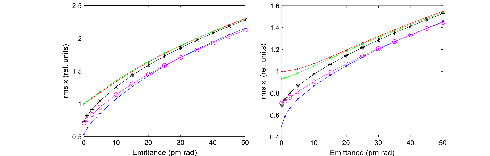
*图 11　在 $\varepsilon_x=\varepsilon_y,\beta_x=\beta_y=2$ 时，RMS 尺寸（左）和发散角（右）随发射度变化；蓝、红、绿分别来自一维截面、二维投影和完整三维投影，黑星为式(13)拟合，品红为高斯近似。*

零发射度时，拟合值位于核心值与投影值之间；随着发射度增加，它们接近投影值。高斯近似在发射度增加时会低估有效尺寸与发散角，但由于大电子发射度极限下所有曲线必须收敛，它们的相对差异会变小，高斯近似对宽度的最大误差约 10%。

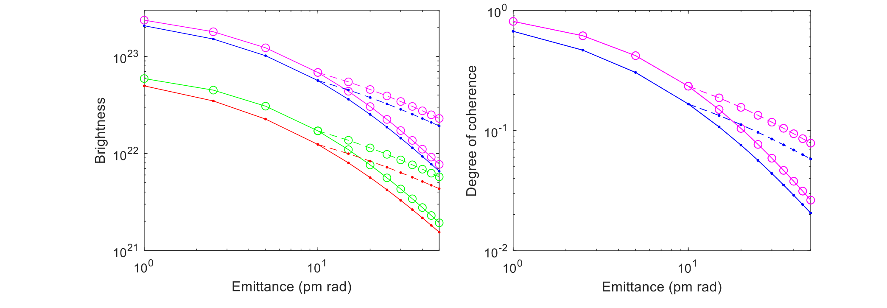
*图 12　左：峰值亮度（蓝）和平均亮度（红）；右：相干度（蓝）随发射度变化。实线为 $\varepsilon_x=\varepsilon_y$，虚线为 $\varepsilon_y=10$ pm，两者均取 $\beta_x=\beta_y=2$。品红为式(1)、式(3)，绿色为式(15)。*

图 12 在零能散下比较等发射度双平面，以及垂直发射度固定为 10 pm 的情况。两种情况下，高斯近似都紧随完整计算的趋势。它在极低和很高发射度两端误差最小，中间区域误差可达 40%。峰值和平均亮度都能得到较好趋势，是因为式(8)在零发射度与大发射度极限均成立，在中间区也大致保持在 15% 以内。

## VII. 电子束发射度与能散的联合作用

现在先按式(11)加入能散，再对不同发射度执行式(17)卷积。图 6 右图显示：10 pm 发射度基础上增加 0.1% 能散，会对亮度分布产生较小但清楚可见的附加影响。

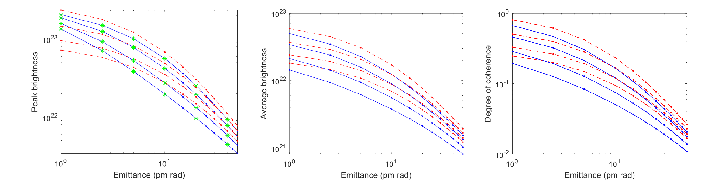
*图 13　在 $\varepsilon_x=\varepsilon_y,\beta_x=\beta_y=2$ 时，不同 RMS 能散 0、0.001、0.002、0.003 下的峰值亮度（左）、平均亮度（中）和相干度（右）随发射度变化。蓝线为数值结果，红线为高斯近似，绿星为 SPECTRA 峰值亮度。*

图 13 表明，发射度高于约 10 pm 时，所有曲线趋势相似；越接近衍射极限，同样幅度的发射度下降带来的亮度和相干性相对增益越小。低于该点后，计算所得峰值亮度——与 SPECTRA[20]一致——开始偏离，并趋向一个与能散无关的共同极限，正如第五节所示。

高斯近似对三种量给出形状完全相同的曲线。总体上它能合理跟随数据，例外是非零能散且发射度低于约 10 pm 时的峰值亮度。对平均亮度和相干度，高斯近似在 10 pm 以上的准确性其实略差于峰值亮度，且能散越大越差。在能散不超过 0.3% 时，最大误差小于因子 2。

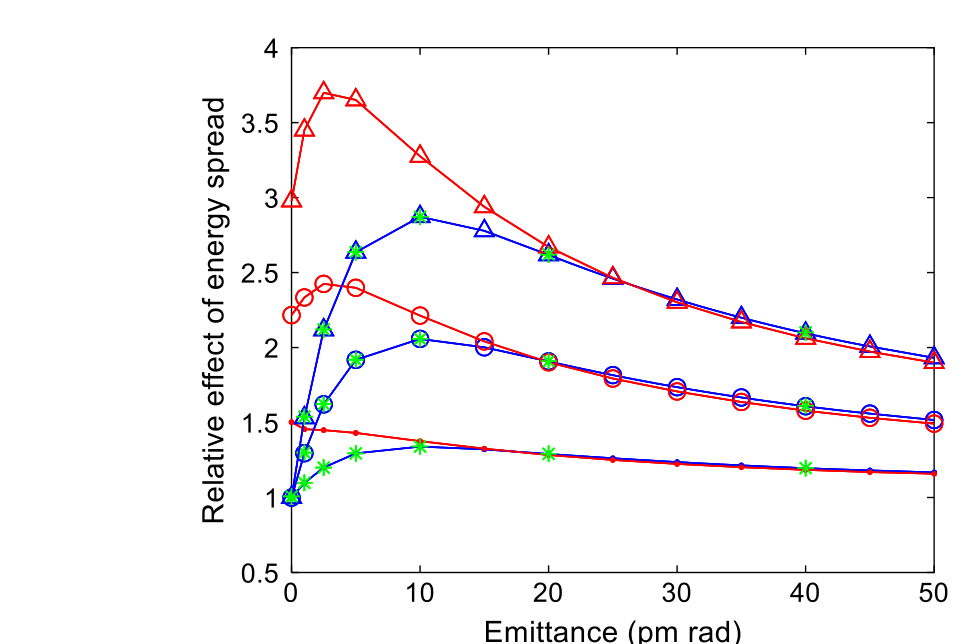
*图 14　能散对峰值亮度（蓝）和相干度（红）的相对影响随发射度变化；点、圆、三角分别代表 0.1%、0.2%、0.3%，绿星为 SPECTRA 峰值亮度。*

图 14 更详细地显示：随着发射度减小，能散对峰值亮度和相干度的影响都增加；但低于约 10–20 pm 后，两者行为分叉。峰值亮度的相对影响向零发射度时回到 1，即没有影响；相干度所受影响却继续增大，直到极小发射度时才根据能散大小略有回落。

较大发射度下亮度与相干度曲线符合良好，说明二者密切相关。作者以峰值亮度构造相干度近似：

$$
\zeta_{\mathrm{approx}}=
\frac{\mathcal B_0}{\mathcal B_0|_{\varepsilon_x=\varepsilon_y=\sigma_E=0}}.\tag{18}
$$

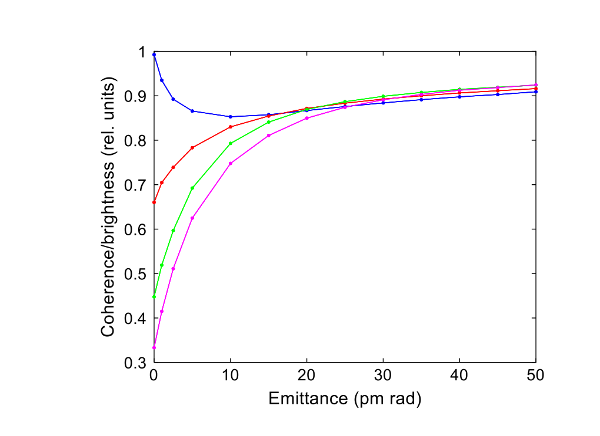
*图 15　总体相干度与式(18)近似之比随发射度变化；蓝、红、绿、品红分别为 0、0.1%、0.2%、0.3% RMS 能散。*

只要发射度不太小，式(18)在该示例中可把相干度估计到约 10% 以内。它比完整四维计算容易得多，也比高斯近似更准确，并避开了如何选择高斯公式中辐射参数的困难。

## VIII. 相空间匹配

众所周知，要优化亮度和相干度，就必须通过正确选择电子束 beta，使电子束相空间与光子相空间适当匹配[5]。近期文献[3]强调了这一点对衍射极限储存环的重要性。

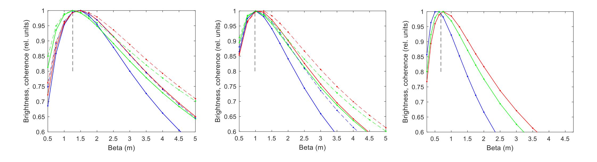
*图 16　峰值亮度（蓝）和相干度（红）随电子束 beta 的相对变化。左、中、右分别为 RMS 能散 0、0.1%、0.3%；实线为 $\varepsilon_x=\varepsilon_y=10$ pm，左、中图虚线为 $\varepsilon_x=50$ pm、$\varepsilon_y=10$ pm 且 $\beta_x=\beta_y$。绿线为高斯近似，竖虚线来自式(16)。*

图 16 表明，随着能散增加，使亮度和相干度最大的最佳 beta 明显下降，与图 10 一致，并接近式(16)给出的高斯近似峰值。零能散时略有差异：完整计算的最大值约在 1.5 m，而高斯近似峰值在 $\beta_{x,y}=L/\pi=1.26$ m；不过这只对亮度和相干度数值产生很小影响。

总体而言，高斯近似能很好指示最佳 beta 以及对 beta 的敏感性；后者随能散增加而明显增强。水平发射度较大的曲线比双平面低发射度曲线略宽，但这些结果仍强调：在低发射度区，必须在波荡器处提供相对较低的 beta，才能优化辐射亮度和相干度。

## IX. 结论

本文以 PETRA IV 一类 6 GeV、低发射度、接近衍射极限的 X 射线源为例，采用 Wigner 表述和常用高斯近似，研究电子束能散与发射度对波荡器辐射亮度和相干度的影响。

图 13 清楚表明，发射度降低时，衍射极限只被缓慢接近。即使达到通常认为的衍射极限发射度 $\varepsilon=\lambda/(4\pi)$——10 keV 光子对应 10 pm——总体谱相干度也只有 17%；要达到 50%，两个平面都需约 2.5 pm，这超出了当时所设想机器的能力。

能散进一步影响亮度和相干度。在当前关注的发射度范围内，发射度越低，能散的相对影响越大。例如，两个平面均为 10 pm 时，典型 0.1% RMS 能散会使基波辐射的相干度再降低 1.4 倍，从 17% 降到 12%。这不算巨大，但能散效应还依赖谐波数：0.3% 能散在同一光子能量下等效于三次谐波的 0.1% 能散，此时相干度在本例中降低 3.3 倍至 5%。因此，使用高次谐波的低发射度、低能量机器必须特别关注能散。

本文结果证实文献[4]的观察：零发射度时能散不影响峰值亮度。文献[4]还发现轴上相干性不退化、离轴相干性退化，这与本文总体相干度下降一致。然而，文献[4]所谓“不存在能散主导区；发射度下降时，能散对相干性和亮度的影响也下降”的说法会产生误导。除轴上与离轴相干性的区别外，图 14 清楚显示：在达到极低发射度前，发射度越低，能散对峰值亮度和相干度的影响越大；到极低发射度时，至少就总体相干度而言，确实存在“能散主导区”。这也提出一个值得进一步研究的问题：与总体相干度或平均亮度相比，峰值亮度是否仍是有用的性能指标？

尽管 Wigner 亮度分布远非高斯，只要为辐射项选取适当数值，简单高斯近似仍能给出与复杂计算相似的趋势，在本文参数范围内准确到因子 2。它也能很好地指示优化亮度和相干度的电子束 beta，以及结果对 beta 的敏感性。

过去人们对高斯近似应使用何种辐射尺寸和发散角存在很大不确定性。本文表明，它们不是许多作者采用的投影宽度，而应处在亮度分布的截面宽度与投影宽度之间；零能散时，相应量由表 I 模型 4 给出。先前基于投影强度分布推导的能散效应表达式[19]，因此也不是估算亮度和相干度的最适选择。

至少在离衍射极限足够远的区域，本文还提出一种基于峰值亮度的相干度估计式(18)。它比完整计算容易得多，也避开了高斯近似中选择适当辐射参数的困难。

## 参考文献

1. D. Einfeld, M. Plesko, and J. Schaper, “First multi-bend achromat lattice consideration,” *J. Synchrotron Radiat.* **21**, 856 (2014).
2. M. Eriksson et al., “Commissioning of the MAX IV light source,” in *Proceedings of IPAC2016*, Busan, Korea, p. 11 (2016).
3. L. Liu and H. Wesfahl, Jr., “Towards diffraction limited storage ring based light sources,” in *Proceedings of IPAC2017*, Copenhagen, p. 1203 (2017).
4. G. Geloni et al., “Effects of energy spread on brightness and coherence of undulator sources,” *J. Synchrotron Radiat.* **25**, 1335 (2018).
5. S. Krinsky, “Undulators as sources of synchrotron radiation,” *IEEE Trans. Nucl. Sci.* **30**, 3078 (1983).
6. K.-J. Kim, “Brightness, coherence and propagation characteristics of synchrotron radiation,” *Nucl. Instrum. Methods Phys. Res. A* **246**, 71 (1986); see also *X-ray Data Booklet* (2009), Sec. II.1.
7. R. Coisson and R. P. Walker, “Phase space distribution of brilliance of undulator sources,” *Proc. SPIE* **582**, 24 (1986).
8. K.-J. Kim, “Brightness and coherence of radiation from undulators and high-gain free electron lasers,” in *Proceedings of the 1987 Particle Accelerator Conference*, p. 194.
9. R. P. Walker, “Insertion Devices: Undulators and Wigglers,” in *CERN Accelerator School on Synchrotron Radiation and Free Electron Lasers* (1998), p. 129.
10. P. Elleaume, in *Undulators, Wigglers, and Their Applications*, Chap. 3 (Taylor & Francis, 2003).
11. R. R. Lindberg and K.-J. Kim, “Compact representations of partially coherent undulator radiation suitable for wave propagation,” *Phys. Rev. ST Accel. Beams* **18**, 090702 (2015).
12. I. V. Bazarov, “Synchrotron radiation representation in phase space,” *Phys. Rev. ST Accel. Beams* **15**, 050703 (2012).
13. T. Tanaka, “Numerical methods for characterization of synchrotron radiation based on the Wigner function method,” *Phys. Rev. ST Accel. Beams* **17**, 060702 (2014).
14. G. Geloni, V. Kocharyan, and E. Saldin, “Brightness of synchrotron radiation from undulators and bending magnets,” *J. Synchrotron Radiat.* **22**, 288 (2015).
15. R. P. Walker, “Interference effects in undulator and wiggler radiation sources,” *Nucl. Instrum. Methods Phys. Res. A* **335**, 328 (1993).
16. M. Tischer，私人通信。
17. C. G. Schroer et al., “PETRA IV: the ultralow-emittance source project at DESY,” *J. Synchrotron Radiat.* **25**, 1277 (2018).
18. R. Coisson, “Effective phase space widths of undulator radiation,” *Opt. Eng.* **27**, 250 (1988).
19. T. Tanaka and H. Kitamura, “Universal function for the brilliance of undulator radiation considering the energy spread effect,” *J. Synchrotron Radiat.* **16**, 380 (2009).
20. T. Tanaka and H. Kitamura, “SPECTRA: a synchrotron radiation calculation code,” *J. Synchrotron Radiat.* **8**, 1221 (2001).
