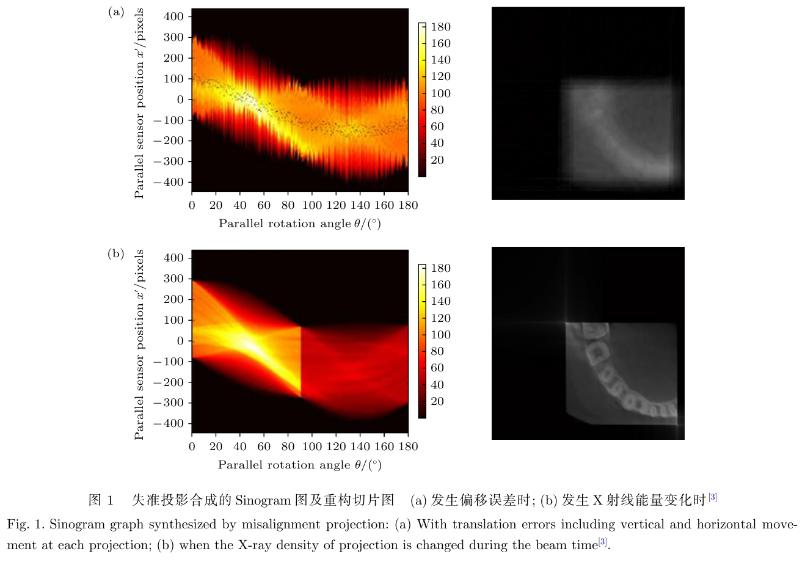
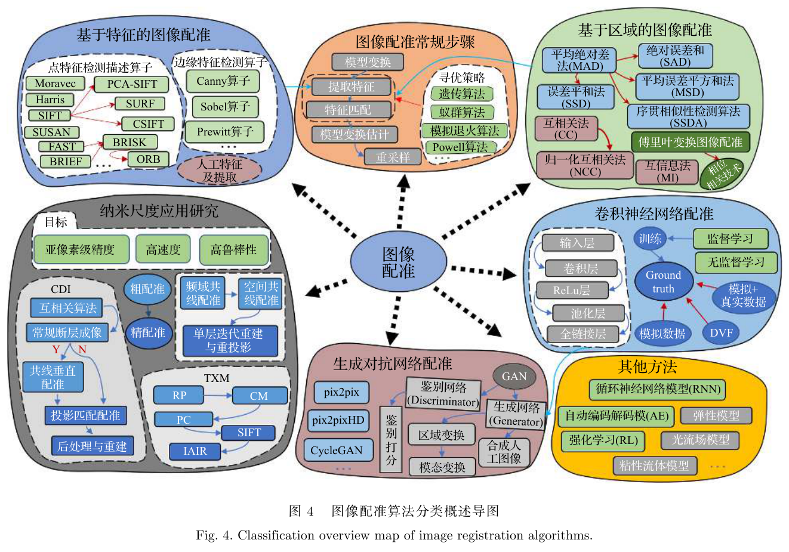
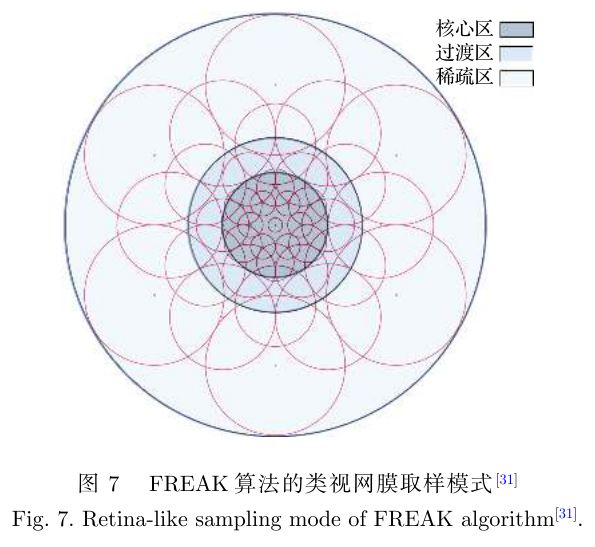
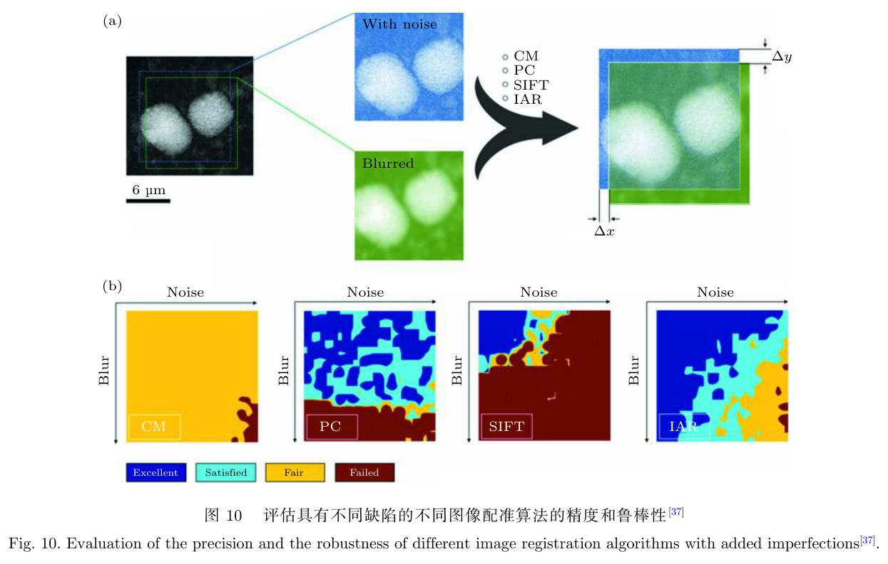
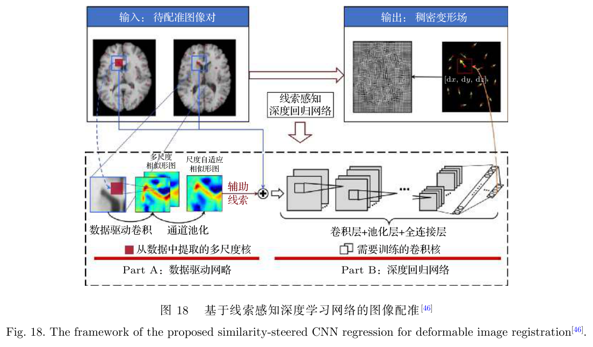
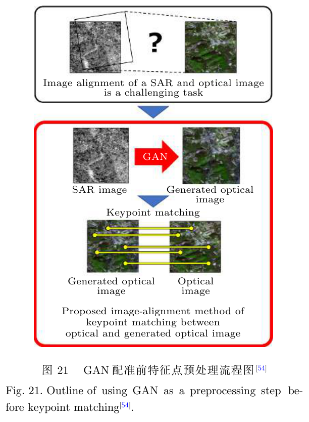
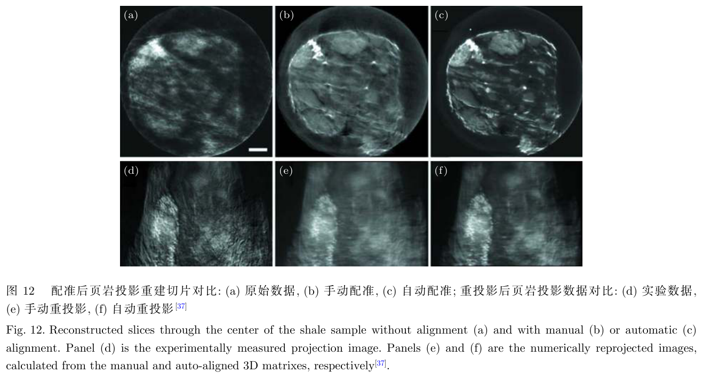
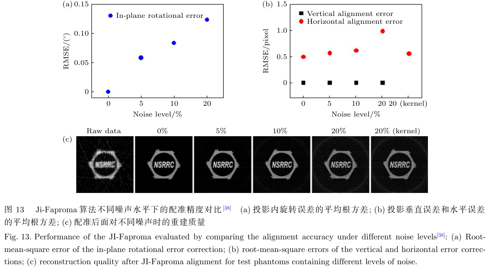

---
tags:
  - papers/X-ray-imaging
  - papers/nano-CT
  - papers/image-registration
aliases:
  - "Image alignment for synchrotron radiation based X-ray nano-CT"
date: 2021
doi: 10.7498/aps.70.20210156
---

# 同步辐射纳米 CT 图像配准方法研究

## 核心信息

- 标题: 同步辐射纳米 CT 图像配准方法研究
- 标题翻译: Image alignment for synchrotron radiation based X-ray nano-CT
- 作者: 苏博、陶芬、李可、杜国浩、张玲、李中亮、邓彪、谢红兰、肖体乔
- 机构: 中国科学院上海应用物理研究所；中国科学院大学；中国科学院上海高等研究院上海光源中心
- 发表时间: 2021
- 发表渠道: 物理学报，70(16)，160704
- DOI: 10.7498/aps.70.20210156
- 论文链接: https://doi.org/10.7498/aps.70.20210156
- 论文类型: 同步辐射纳米 CT 图像配准叙述性综述

## 原文摘要翻译

基于同步辐射的 X 射线纳米成像是无损研究物质内部纳米尺度结构的重要工具。本文总结图像配准技术在纳米 CT 成像中的研究与应用，并按研究发展阶段进行分类分析。首先，作者根据图像配准论文的发表情况分析未来研究方向；其次，基于经典图像配准理论，归纳这些算法在纳米成像中的前沿应用，并从近期特征检测研究中筛选适合纳米尺度图像配准的算子，为具体应用和优化提供参考；最后，文章介绍基于深度学习的前沿配准方法，讨论其在纳米成像中的适用性与潜力，并结合不同神经网络特点展望未来方向和挑战。

## 创新点

1. 从纳米 CT 的实际误差链出发，把机械在线校准、经典图像配准、迭代重投影和深度学习放进同一技术谱系，而不是把配准视为孤立的软件步骤。
2. 以“区域强度—局部特征—粗到精联合—学习模型”组织算法，明确各类方法在噪声、旋转、尺度、模态和计算量上的假设差异。
3. 针对纳米投影低信噪、缺少稳定特征的特点，对 `ORB`、`FREAK`、`BRISK`、`SURF`、`SIFT` 等算子的速度和模糊鲁棒性作出面向应用的归纳。
4. 较早指出纳米 CT 深度学习配准面临的三项核心问题：缺少真值、真实固定噪声导致域偏移，以及模型精度尚未超过成熟的联合配准流程。

## 一句话总结

这篇上海光源团队综述把纳米 CT 配准定义为“机械稳定性、图像坐标校正和重建一致性”共同约束的系统工程，并主张粗到精联合方法；它没有在统一数据集上提出或验证一个新的上海光源算法基准。

## 研究问题

理想断层扫描假设不同角度的投影只发生已知旋转。实际系统还受到样品台抖动、旋转中心偏移、热膨胀、束流强度变化和探测器响应不一致影响，从而产生平移、旋转和衬度误差。在低分辨 CT 中可忽略的小偏差，到几十纳米尺度会变成正弦图曲线断裂、衬度不连续、条纹和重影，甚至使三维结构无法正确重建。

硬件可以提高刚度、避开共振并利用干涉仪或可见光跟踪漂移，但长时间全角扫描中把运动持续控制在几十纳米仍然困难。软件配准因此不是可选美化，而是纳米 CT 从投影到可信三维体的必要校正环节。

*图 1｜人为加入位置误差或 X 射线强度变化后，正弦图出现断裂和衬度不连续，并传播为重建伪影。*

配准任务的本质是把不同时间、角度、景深、模态或探测器获得的图像映射到同一坐标系。困难在于这些变化可能同时发生：全局强度法速度快却怕衬度与非刚性变化，特征法能处理旋转和尺度却可能在低信噪投影中找不到稳定点，深度模型则依赖训练分布和真实性验证。

## 数据与任务定义

### 综述证据范围

作者使用图像配准、深度学习、CT、卷积神经网络、生成对抗网络、互相关和互信息等关键词查询多个来源。

外文来源包括谷歌学术、科睿唯安引文数据库与爱思唯尔文摘索引。

索引来源另包括 SCI、EI、PubMed 和 CSCD 等。

中文来源包括超星发现与中文核心等。

文章没有给出完整检索式、检索日期、去重流程、纳入排除标准或偏倚评价，因此属于叙述性综述而非系统综述。不同算法的结果来自不同装置、样品、噪声设定和指标，不能直接组成公平排名。

### 配准对象与验收层级

综述覆盖单模态与多模态、刚性与非刚性、自动与人工配准，重点是同步辐射纳米尺度二维投影及其三维重建。配准至少有四个验收层级：

1. 图像坐标层：平移、旋转和变形场残差。
2. 投影几何层：相邻角度连续性、旋转中心和正弦图平滑性。
3. 三维重建层：伪影、分辨率、衬度和结构一致性。
4. 工程层：运行时间、人工交互、失败率及长扫描稳定性。

“亚像素配准”只描述图像坐标误差，不能自动证明亚像素尺度的物理结构真实。

## 方法主线

### 方法谱系

*图 4｜综述给出的配准算法分类总览，连接经典区域法、特征法、纳米成像应用与深度学习路线。*

基于区域的方法直接比较灰度或频域信息。平均绝对差、误差平方和、互相关和快速归一化互相关适合衬度变化较小的单模态图像；互信息适合多模态；傅里叶相位相关速度快、平移估计精度高。它们利用全局信息，面对强噪声、大旋转、尺度变化、局部形变或能量相关衬度变化时容易失效。

基于特征的方法先检测点、边缘或轮廓，再描述、匹配并估计空间变换。综述归纳的速度次序大致为 `ORB`、`FREAK`、`BRISK`、`SURF`、`SIFT`；在严重模糊情形下，`BRISK` 表现更突出。

该结论来自被引比较研究，不是本文在纳米 CT 统一基准上的新实验。

*图 7｜`FREAK` 的类视网膜采样：中心高密度、外围低密度，以较紧凑描述兼顾细节和范围。*

### 机制流程

1. **输入与几何预校正**：输入为原始角度投影及扫描几何；操作是估计旋转中心、去除明显坏帧并用反投影或共线条件校正大尺度系统误差；输出为消除主要偏移的投影栈。
2. **快速粗配准**：输入为预校正投影；操作是用质心、互相关或相位相关估计帧间平移；输出为进入精配准捕获范围的连续角度序列。
3. **局部精配准与重建反馈**：输入为粗配准结果；操作是用特征匹配、强度优化或迭代“重建—重投影—再配准”修正残余平移和旋转；输出为亚像素级坐标残差与更新后的三维体。
4. **端到端验收**：输入为最终投影与重建；操作是同时检查正弦图连续性、投影残差、三维分辨率、失败帧和运行时间；输出为带质量标记的重建结果，而不是只有一张更锐的切片。

*图 10｜被引研究对多种配准法施加模糊和噪声，显示不存在对所有缺陷都占优的单一算法。*

### 深度学习路线

卷积网络可以直接从图像对回归形变场，无监督模型可用图像相似性和形变正则化避开显式真值；生成对抗网络既可生成配准结果，也可先把低信噪图像转换为特征更明显的图像，再交给经典匹配器。

*图 18｜被引线索感知卷积回归网络从图像对与辅助线索生成稠密形变场；该图来自通用形变配准研究。*

*图 21｜被引遥感工作先用生成对抗网络强化跨模态特征，再进行关键点匹配；综述把它视为纳米低信噪投影的潜在预处理思路。*

这两幅图展示的是综述引用的通用或跨领域方法，不是上海光源已在纳米 CT 上完成的独立深度学习实验。

## 关键结果

### 上海光源直接相关工作

综述引用上海光源程甲一等的软 X 射线谱学显微实验站工作：可见光显微镜记录样品旋转漂移，算法预测轨迹，再通过机械在线校正，将漂移控制在约 `1 µm`。作者明确认为其鲁棒性、外推性和精度仍需提高。该结果展示软硬件闭环思路，但 `1 µm` 不能写成纳米 CT 的几十纳米稳定性已经达标。

本文自身的直接产出主要是方法分类、文献归纳与需求定义，没有新的 `BL18B` 数据集、统一代码基准或三维配准实验。

### 被引国内外成果

| 被引工作 | 装置/机构归属 | 综述提炼的结果 | 不能外推为 |
|---|---|---|---|
| `MR-PMA` | 瑞士保罗谢勒研究所相关相干衍射工作 | 粗配准与精配准组合；在最高 `32` 倍降采样、含噪模拟集上展示亚像素配准 | 上海光源自有算法 |
| 迭代联合序列 | 斯坦福同步辐射光源与东华大学等 | 依次结合反投影、质心、相位相关、`SIFT` 与强度自动配准 | 所有样品上的绝对最佳序列 |
| `JI-Faproma` | 中国台湾光源 | 在多档噪声下处理面内旋转、水平与垂直误差；总时间最多减少 `4` 个数量级 | 统一硬件下对全部方法的加速比 |
| 几何矩抖动校正 | 中国科学院高能物理研究所 | 无需金颗粒标记，改善小球藻重建的结构、衬度与实验成本 | 上海光源实测结果 |

`MR-PMA` 的压力测试包含欠采样、`161` 个噪点和额外 `10%` 高斯噪声，但这些是特定模拟设定。综述所称“亚像素、高鲁棒、高速度”是跨文献归纳，不是作者在同一盲测集上的验收结论。

*图 12｜被引联合序列对页岩的原始、手动和自动配准重建及重投影比较；实验并非上海光源独有数据。*

*图 13｜中国台湾光源 `JI-Faproma` 在不同噪声下的旋转、平移误差和重建结果，是外部被引证据。*

### 研究趋势

作者统计到 2020 年深度学习配准论文约占全部配准研究的四分之一；在深度学习配准内部，正文称卷积网络约占 `55%`，生成对抗网络约占 `13%`，自动编码与强化学习约占 `6%` 和 `7%`。这些数字用于观察趋势，但论文没有公开可复现的检索数据表，不能作为精确文献计量结果。

## 深度分析

### 配准为何必须混合

纳米 CT 的误差源违反不同算法的基本假设：束强变化破坏灰度恒常，随机抖动不能由固定旋转中心解释，低信噪使关键点消失，局部形变又超出全局刚体模型。联合流程的价值不是简单堆算法，而是把每种方法限制在其可信工作区间：物理传感器约束低频漂移，快速相关法消除大偏移，局部特征或强度优化修残差，重投影反馈用断层几何排除不一致解。

学习模型最合理的近期角色是特征增强、初始化和失败检测，而非无条件替换经典配准。若训练数据缺少真实固定噪声、新材料和新成像条件，网络可能输出视觉平滑但几何错误的形变场。物理约束和不确定度输出应成为模型上线门槛。

### 图像精度与结构真实性

配准可以使正弦图更平滑，也可能通过过度优化把真实形貌变化“校正”掉。验收不能只看相似度或亚像素位移，还应检查：

- 重投影与原始测量的一致性。
- 独立标准样或标记点上的几何误差。
- 三维频率壳相关、边缘扩展或调制传递结果。
- 人工与自动方法差异、失败帧和置信区间。
- 跨样品、跨实验日、跨线站的域外表现。

### 在上海光源技术谱系中的位置

这篇论文的价值是建立需求和语言体系：它解释为何 `BL18B` 等纳米三维成像平台不能只依赖高精度机械，也不能只选择一个离线算法。上海光源在文中明确可归属的实证是早期软 X 射线在线校正约 `1 µm`；其余大量纳米配准结果属于 PSI、SSRL、台湾光源和高能所等被引工作。因而本文应被视为后续 2022/2024 配准研究的知识框架，而非那些原始实验成果的替代。

## 局限

1. 综述没有完整检索式、检索日期、去重、纳入排除和质量评价，文献覆盖与趋势数字不可独立复现。
2. 不同论文的样品、装置、噪声、位移范围、硬件和指标不同，亚像素精度与加速倍数不能横向直接排名。
3. 许多深度学习证据来自医学和遥感，不是同步辐射纳米 CT 的真实域外盲测。
4. 论文没有统一的真实纳米 CT 基准、公开代码、失败率或时间/显存成本表。
5. 文中不同装置成果易被误归为上海光源；必须逐条保留原始机构归属。
6. `1 µm` 在线校正尚未达到几十纳米稳定性目标，不能作为纳米 CT 机械闭环完成验收。
7. 亚像素坐标误差不等于亚像素物理结构真实性，综述没有统一三维分辨率与结构保真验证。
8. 截至 2021 年，作者明确认为深度学习精度尚未优于成熟联合配准，且真值、固定噪声和真实性验证仍未解决。

## 我的笔记

- 最优先建设的不是再选一个算法，而是一套公开、冻结的 `BL18B` 配准盲测：含刚性漂移、随机抖动、旋转中心误差、能量变化、低信噪和缺特征样本。
- 每次验收同时报告二维配准残差、重投影一致性、三维频率壳相关、失败率和端到端时间；切片视觉改善只作辅助。
- 推荐“传感器与机械反馈—快速粗配准—物理约束精配准—学习型初始化/失败检测”的分层架构。
- 深度模型训练/测试应按完整扫描和独立样品隔离，并设置域外拒识；无置信度的自动形变场不应直接进入定量重建。
- 综述中的外部算法适合形成基线矩阵，但所有性能数字必须回到原文条件，不能当作 SSRF 已实现指标。

## 引用

- 苏博等（2021）. 同步辐射纳米 CT 图像配准方法研究. 物理学报，70(16)，160704. DOI: 10.7498/aps.70.20210156.
- Odstrčil, M. et al. (2019). Optics Express, 27, 36637.
- Yu, H. et al. (2018). Journal of Synchrotron Radiation, 25, 1819.
- Wang, C.-C. (2020). Scientific Reports, 10, 7330.
