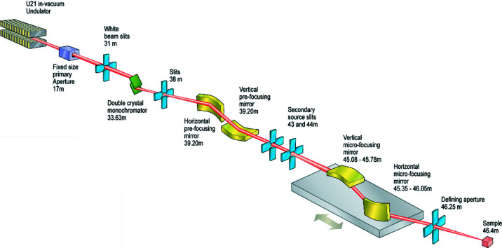
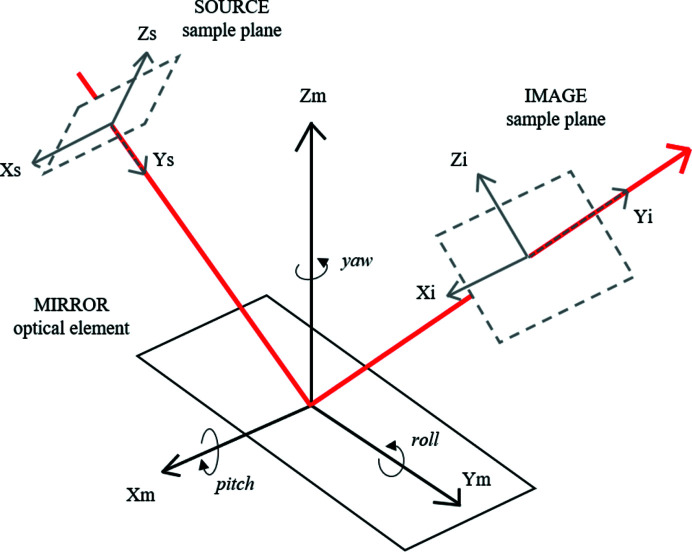
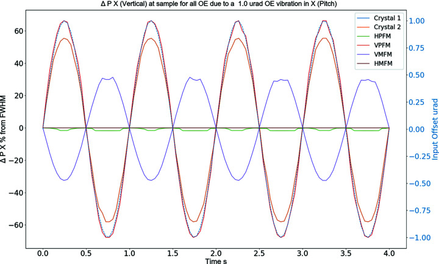
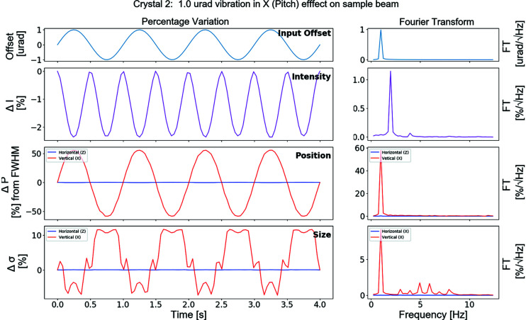
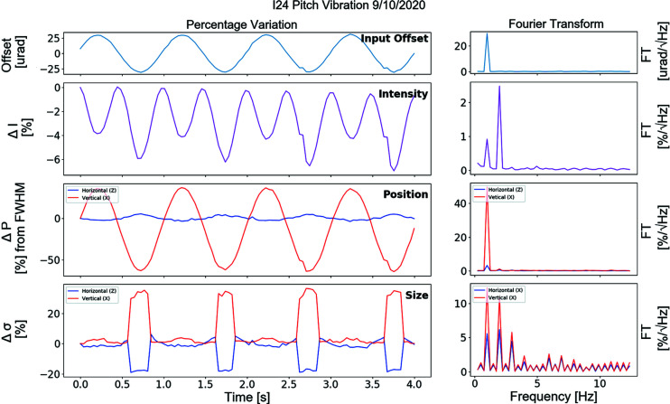

---
tags:
  - papers/synchrotron
  - papers/beamline-optics
  - papers/OASYS-SHADOW
  - papers/vibration-analysis
aliases:
  - OASYS SHADOW光学振动伪动态建模
  - Houghton 2021深读
  - 同步辐射光束线伪动态振动仿真
date: 2021-08-12
doi: 10.1107/S1600577521007013
---

# OASYS/SHADOW 光学振动伪动态建模：从静态光线追迹序列到样品点稳定性

## 核心信息

- 标题: Modelling the effects of optical vibrations on photon beam parameters using ray-tracing software
- 标题翻译: 使用光线追迹软件模拟光学元件振动对光子束参数的影响
- 作者: C. Houghton, C. Bloomer, L. Alianelli
- 机构: Diamond Light Source Ltd, United Kingdom
- 发表时间: 2021
- 发表渠道: Journal of Synchrotron Radiation, 28, 1357–1363
- DOI: 10.1107/S1600577521007013
- 论文链接: https://doi.org/10.1107/S1600577521007013
- 数据 / 资源: I24微聚焦大分子晶体学光束线实验数据与文中完整仿真流程
- 论文类型: 同步辐射光束线计算方法与实验验证

## 原文摘要翻译

Diamond Light Source 开发了一种方法，用于模拟光学组件发生运动时在光束线样品点观测到的光束性质。该方法采用一系列静态光线追迹仿真，模拟光学元件动态运动对光束稳定性的影响。使用 OASYS 中的 SHADOW3 完成多次迭代光线追迹并将结果拼接起来，从而能够模拟一条伪动态光束线。随着以更高频率工作的光束线探测器日益普及，光束稳定性变得至关重要。同步辐射储存环升级为低发射度晶格后，为保持光束亮度，需要进一步提高光束线稳定性。通过模拟束斑尺寸和位置的变化，可以估计不同组件运动对稳定性的影响。本文结果主要关注光学元件的物理振动建模。多个光束参数可以依次分析，无需人工输入。本文介绍仿真代码并给出初步结果。该方法可用于光束线设计和运行阶段，识别可能在样品点光束性质中引入较大误差的光学元件。

## 创新点

1. **用静态追迹序列近似动态振动。** 作者没有重写一个连续时间求解器，而是复用 OASYS 导出的 SHADOW3 Python 模型，在每一步改变元件角度或位置，再把各步样品点结果按时间顺序拼接。这是门槛很低、最直接的“伪动态”实现。
2. **把六自由度扫描自动化。** 每个光学元件可分别施加弧矢、子午、法向三种平移和俯仰、滚转、偏航三种转动，既支持线性扫描，也支持正弦扰动，从而把手工调参变为批量灵敏度分析。
3. **用任务尺度归一化光束稳定性。** 束位不只以微米报告，而是除以名义束斑 FWHM；束斑尺寸和强度也相对于未扰动状态表示为百分比，使不同尺度光束线的振动后果可直接比较。
4. **把时域仿真扩展到频域诊断。** 将每个扫描步视为时间采样点后，作者对束位、束斑尺寸和强度执行傅里叶分析，能够显示非线性光学响应产生的倍频与高次谐波。
5. **用真实 I24 光束线验证频率结构。** 对 DCM 第二晶体施加正弦俯仰扫描，实测得到与仿真一致的 2 Hz 强度主峰和垂直方向占优趋势；作者同时明确承认幅值预测没有定量吻合。

## 一句话总结

这篇论文最有价值的不是一个高保真“动态仿真器”，而是一条可直接复现的筛查链：把 OASYS/SHADOW3 静态模型导出为 Python，在循环中向单个光学元件注入正弦角度或位移序列，逐步记录样品点束位、束斑和强度，再用相对 FWHM 指标与傅里叶谱识别最敏感元件；I24 实验支持其定性排序与倍频机制，但不支持把结果不经校准地当作定量振动容差。

## 研究问题

低发射度光源把电子源做得更亮、更小，也同步收紧了光束线光学元件的稳定性预算。此时，只优化电子束轨道还不够：晶体、长反射镜、狭缝和聚焦系统的机械运动会在 X 射线传播途中重新引入束位、束斑尺寸和强度变化。

传统做法往往等到用户实验已经受到影响后，再安装反馈、机械隔振或无源阻尼。论文试图回答一个更前置的问题：能否在设计或调试阶段，利用已有 OASYS 光路模型快速扫描每个光学元件的运动自由度，判断哪个元件对样品点稳定性最敏感，并识别输入振动在光束参数中产生的基频、倍频与高次谐波？

它解决的是“风险排序与机制筛查”，不是结构有限元、控制系统设计或纳米尺度相干波动光学的完整联合仿真。

## 数据与任务定义

### I24 光束线与被测元件

验证对象是英国钻石光源的 I24 微聚焦大分子晶体学光束线。模型依次包含 Si(111) 双晶单色器两块晶体、第一套 KB 预聚焦系统和第二套 KB 微聚焦系统：

| 缩写 | 光学元件 | 主要作用 |
|---|---|---|
| Crystal 1 / 2 | 双晶单色器第一、第二晶体 | 选择 12.4 keV 光子并影响通量与出射方向 |
| HPFM | 水平预聚焦镜 | 水平预聚焦，参与形成虚拟源 |
| VPFM | 垂直预聚焦镜 | 垂直预聚焦，参与形成虚拟源 |
| VMFM | 垂直微聚焦镜 | 样品点垂直方向最终聚焦 |
| HMFM | 水平微聚焦镜 | 样品点水平方向最终聚焦 |

> [!figure] Figure 2
> 
> **原文图注翻译**：Diamond Light Source 微聚焦大分子晶体学光束线 I24 的示意图。
> **阅读要点**：两级 KB 系统之间设有二次光源狭缝；最终微聚焦镜靠近样品点，但上游预聚焦镜和 DCM 对样品点束位仍可能更敏感。
> 建议位置：数据与任务定义／I24 光束线与被测元件
> 放置原因：该图给出六个被扫描光学元件在完整光路中的位置，是理解灵敏度排序的结构依据。
> 当前状态：已核对 PMC 开放数据原图、出版 PDF 图号和图注，三者一致。

### 输入、输出与名义工况

| 项目 | 论文设置 |
|---|---|
| 光子能量 | 12.4 keV |
| 源发散角 | 水平 25.62 µrad；垂直 4.48 µrad |
| 名义样品点束斑 FWHM | 水平 5.7 µm；垂直 3.3 µm |
| 单次小扰动 | 1.0 µrad 正弦俯仰振动 |
| 仿真频率 | 1 Hz |
| 扰动自由度 | 三平移加三转动；本文结果重点展示俯仰 |
| 样品点输出 | 强度、水平/垂直束位、水平/垂直束斑尺寸 |
| 单步计算量 | 1,000,000 条光线约需 60 s |

论文中的 SHADOW 坐标约定是 $x$ 为垂直方向、$z$ 为水平方向，与部分光束线常用记号不同。

> [!figure] Figure 1
> 
> **原文图注翻译**：SHADOW 为描述反射镜运动而使用的参考坐标系，定义来自 SHADOW 文档。
> **阅读要点**：代码并非只改变俯仰角；同一接口原则上能遍历三个方向的偏移以及俯仰、滚转、偏航。
> 建议位置：数据与任务定义／输入、输出与名义工况
> 放置原因：该图明确 SHADOW 的源面、镜面和像面坐标以及三种角运动，避免误读水平与垂直方向。
> 当前状态：已核对 PMC 开放数据原图、出版 PDF 图号和图注，三者一致。

### 实验对照

实测阶段对 DCM 第二晶体施加 ±30 µrad 正弦俯仰扫描。强度由样品点上游 0.16 m 的 X 射线束位置监测器测量；样品点的荧光屏相机图像以二维高斯拟合得到束位、质心和束斑尺寸。实验与仿真的输入振幅不同，因此合理比较目标是响应方向和频率结构，而不是绝对幅值。

## 方法主线

### 机制流程

1. **输入：建立名义光路并选择扰动对象。** 在 OASYS 图形界面中完成光束线建模，纳入狭缝、晶体、反射镜及可用的面形信息，再导出 SHADOW3 Python 脚本；选定一个元件及一个平移或转动自由度。
2. **操作：把振动离散为参数序列。** 在自建 Python 接口中生成线性扫描或正弦角度/位置序列，并在每个步长把一个参数值写入对应光学元件；论文主实验使用 1 Hz、1 µrad 正弦俯仰序列。
3. **操作：逐步静态追迹并计算相对指标。** 每个参数点都重新生成高斯随机光线并完成一次独立静态追迹，记录样品点强度、束位和束斑 FWHM，再相对于未扰动零点归一化。
4. **输出去向：排序敏感元件并分析频谱。** 拼接各步静态结果，汇总各元件响应的均方根百分比以形成灵敏度排序；将步号映射为时间，执行傅里叶变换，输出基频、倍频和高次谐波，为机械容差、隔振和反馈优先级提供输入。

### 这为什么叫“伪动态”

每一个时间点本质上仍是稳态光线追迹，所谓“动态”来自参数序列与结果拼接。模型没有求解元件质量、刚度、阻尼、共振模态或执行器带宽，也没有保存相邻时间步之间的机械状态。其隐含关系可以写成：

$$
y_k=\mathcal{R}\!\left(q_k;\,\theta_{\mathrm{beamline}}\right),
$$

其中 $q_k$ 是第 $k$ 步人为指定的元件位姿，$\mathcal{R}$ 是一次 SHADOW3 静态追迹，$y_k$ 是样品点光束参数。只有当 $q_k$ 被解释为某个振动波形的离散采样时，$\{y_k\}$ 才成为伪时间序列。

### 归一化指标

论文用未扰动状态 $0$ 作为基准。以垂直束位和强度为例：

$$
\Delta P_x[\%]=\frac{x_i-x_0}{\sigma_{0x}}\times100,
$$

$$
\Delta I[\%]=\frac{I_i-I_0}{I_0}\times100.
$$

束位分母是初始束斑 FWHM，而不是初始束位；因此 $\Delta P_x=100\%$ 表示束心移动了一个名义垂直 FWHM。束斑变化则用 $(\sigma_i-\sigma_0)/\sigma_0$，水平和垂直方向分别计算。

这种指标直接对应实验危害：相同 10 µm 位移对 1 mm 宽束斑影响很小，对 1 µm 级聚焦束却足以让样品完全离开照明区域。原文举例中的“10 µm 相对 1 µm 为 10,000%”存在算术笔误，依照其公式应为 1,000%；这不影响后续表格和曲线所采用的定义。

### 实际实现骨架

论文没有公开完整代码，但其最小实现逻辑很清楚：外层遍历光学元件，中层遍历所选自由度，内层遍历振动波形的时间与偏移量；每一步先设置失调量，再运行 SHADOW3，提取相对于名义光束的样品点指标，最后保存均方根响应和傅里叶谱。

复现时需要固定或记录随机种子，并单独评估蒙特卡洛噪声底；否则每步重新随机生成光线可能把采样噪声误识别为高频响应。

## 关键结果

### 元件灵敏度排序

表 1 是论文的核心筛查结果。所有元件都施加相同的 1 µrad 俯仰振动，表中为样品点响应的均方根百分比：

| 光学元件 | 强度 $\Delta I$ | 水平尺寸 $\Delta\sigma_z$ | 垂直尺寸 $\Delta\sigma_x$ | 水平束位 $\Delta P_z$ | 垂直束位 $\Delta P_x$ |
|---|---:|---:|---:|---:|---:|
| DCM 晶体 1 | 1.70 | 0.14 | 8.34 | 0.21 | 41.08 |
| DCM 晶体 2 | 1.70 | 0.05 | 8.27 | 0.21 | 41.08 |
| HPFM | 0.21 | 0.78 | 0.42 | 18.66 | 1.20 |
| VPFM | 0.07 | 0.00 | 7.99 | 0.05 | 47.86 |
| VMFM | 0.00 | 0.00 | 0.14 | 0.00 | 22.98 |
| HMFM | 0.00 | 0.14 | 0.00 | 9.62 | 0.00 |

结论不是“离样品最近的镜一定最重要”。对垂直束位，VPFM 的响应最大，两个 DCM 晶体次之；对强度，两块 DCM 晶体最大。不同输出指标对应不同关键元件，因此机械预算不能只按一个总排名分配。

> [!figure] Figure 3
> 
> **原文图注翻译**：各光学元件俯仰振动引起的样品点垂直束位百分比变化。
> **阅读要点**：统一小扰动把每条曲线转化为近似灵敏度；VPFM 与两块 DCM 晶体的垂直束位响应明显占优。
> 建议位置：关键结果／元件灵敏度排序
> 放置原因：该图直接比较六个元件在相同俯仰输入下的垂直束位响应，是元件优先级判断的主证据。
> 当前状态：已核对 PMC 开放数据原图、出版 PDF 图号和图注，三者一致。

### DCM 的倍频响应

对 DCM 第二晶体施加 1 Hz、1 µrad 俯仰振动后，样品点强度的主峰出现在 2 Hz，并伴随较小的 4 Hz 谐波。1 µrad 振动还造成约 20% 的垂直束斑尺寸变化和约 100% 初始 FWHM 的垂直峰峰位移，显著超过论文引用的“束位和束斑变化均小于束斑尺寸 10%”的光束线稳定性规格。

> [!figure] Figure 4
> 
> **原文图注翻译**：DCM 第二晶体的仿真结果；左列为时间序列，右列为频率序列。
> **阅读要点**：角度输入保持 1 Hz，但强度因摇摆曲线的非线性变成以 2 Hz 为主；垂直束位主要保留 1 Hz，束斑尺寸则出现明显非正弦波形和多阶频率成分。
> 建议位置：关键结果／DCM 的倍频响应
> 放置原因：该图同时展示输入、强度、束位和束斑的时域与频域响应，是解释二倍频机制的核心图。
> 当前状态：已核对 PMC 开放数据原图、出版 PDF 图号和图注，三者一致。

### 实验只验证到“定性一致”

I24 实验采用 ±30 µrad，而非 1 µrad。实测强度同样在 2 Hz 出现大峰，束位和束斑尺寸也都呈现垂直影响大于水平影响的趋势。这支持了“晶体摇摆曲线会把基频角度振动转换为倍频通量波动”的机制判断。

> [!figure] Figure 5
> 
> **原文图注翻译**：DCM 第二晶体发生 ±30 µrad 角度变化时的实验数据。原出版图注把角度单位误写为 µm，正文和图轴显示应为 µrad。
> **阅读要点**：实测水平通道存在仿真没有预测到的变化，束斑谱也含更多高频成分，说明单自由度理想模型遗漏了耦合和表面缺陷。
> 建议位置：关键结果／实验只验证到“定性一致”
> 放置原因：该图是论文唯一的光束线实测频谱对照，直接界定仿真得到验证的部分与失配部分。
> 当前状态：已核对 PMC 开放数据原图和出版 PDF；图注单位按正文与图轴纠正为 µrad。

实验没有支持定量幅值预测：各束参量的百分比变化均与仿真不一致；当仿真直接使用 ±30 µrad 时，模型强度下降高达 96%，作者认为大角度区的模拟不准确。因此，论文真正证明的是定性筛查能力和频率机制，而不是无校准的振动容差计算精度。

## 深度分析

### 为什么 1 Hz 角度振动会产生 2 Hz 强度

如果晶体名义角度位于摇摆曲线峰值，可在峰值附近把反射强度写成偶函数的二阶近似：

$$
I(\theta_0+\delta\theta)\approx I_0-a\,\delta\theta^2.
$$

令角度扰动为

$$
\delta\theta=\alpha\sin(2\pi\nu\tau),
$$

则

$$
\delta\theta^2=\frac{\alpha^2}{2}\left[1-\cos(4\pi\nu\tau)\right].
$$

因此强度的首要交流项出现在 $2f$，而不是 $f$。更高阶非线性、孔径截断和非理想光束会产生 $4f$ 等谐波。如果扫描中心偏离摇摆曲线峰值，一阶项重新出现，强度谱就会同时含有 $f$ 和 $2f$。论文实验恰好观察到这种混合频率，并将其归因于起始角度没有完全位于峰值。

### 频率可以替换，幅值却不能随意外推

作者假设在固定振幅下，样品点的几何光学响应与输入频率无关，因此把 1 Hz 结果解释为可迁移到其他频率。这只在“元件位姿波形已经给定，光学传播相对机械运动近似瞬时”的条件下成立。实际机械系统的振幅和相位由频率相关传递函数决定：共振附近，同一外部激励会产生完全不同的元件位姿；曝光积分还会把高频束位变化表现为焦斑模糊，而低频变化表现为逐帧漂移。

更完整的工程链应为：

$$
\text{环境激励谱}\rightarrow\text{结构传递函数}\rightarrow
\text{元件六自由度位姿谱}\rightarrow\text{光学响应}\rightarrow
\text{探测器积分与实验质量}.
$$

本文只覆盖其中“元件位姿到光束参数”的静态映射，并以人工正弦波代替上游机械链。

### 单变量扫描可视为局部灵敏度矩阵

在小扰动区，样品点输出 $\mathbf y$ 对元件位姿 $\mathbf q$ 可近似写成

$$
\Delta\mathbf y\approx\mathbf J\Delta\mathbf q,
$$

其中 $\mathbf J$ 是数值灵敏度矩阵。论文逐元件、逐自由度扫描实际上是在估计 $\mathbf J$ 的各列。这个解释使方法的用途更清晰：

- 选择需要更高刚度、隔振或位置监测的元件；
- 将样品点稳定性规格反算为单元件位姿容差；
- 判断传感器和执行器应覆盖哪些方向；
- 为后续多元件优化或反馈控制提供初始模型。

但当扰动进入摇摆曲线边缘、光阑截断或光束丢失区时，线性近似会失效，必须保留完整非线性扫描而不能按 1 µrad 结果比例放大。

### 对 OASYS 当前工作流的实际含义

作者完成工作后，OASYS 已加入 Scanning Loops，可直接完成简单一维参数扫描。因此今天复现论文时，自建 Python 接口的不可替代部分不再是“让一个参数循环变化”，而是：批量遍历元件与自由度、注入真实或合成振动波形、统一提取样品点指标、管理随机性、计算均方根和频谱，并把结果汇总为机械稳定性报告。

这也是论文作为“最直接方法”的价值：不要求先搭建结构有限元和波动光学联合平台，只要已有可运行的 OASYS/SHADOW 光路，就能先得到风险优先级。

## 局限

1. **不是连续时间动力学。** 各步是彼此独立的稳态光线追迹，没有质量、刚度、阻尼、共振和执行器频响。
2. **自由度被独立处理。** 同一元件的平移—转动耦合、多元件同步或异步振动均未进入本文结果。
3. **几何光学边界明显。** 模型没有包含狭缝处的波动传播和衍射，对纳米聚焦及高相干光束尤其需要谨慎。
4. **模型保真度不足。** 孔径、晶体热凸起、镜面缺陷和真实面形描述不完整，导致水平方向与高频束斑变化不匹配。
5. **实验与仿真振幅不同。** 1 µrad 仿真无法与 ±30 µrad 实验进行严格定量对照；大振幅仿真又进入明显非线性和低可信区。
6. **结果只在单一光束线验证。** I24 的灵敏度排序不应直接迁移到其他能量、孔径、焦距和相干条件。
7. **复现材料不完整。** 论文描述了算法逻辑，却没有提供代码、扫描步数、时间采样率、随机种子和原始数据仓库。
8. **样品实验质量没有闭环验证。** 输出止于束位、束斑和强度，没有量化衍射数据质量、成像分辨率或重建误差。

## 我的笔记

### 对 SSRF 纳米 CT 的直接用法

最适合的第一阶段不是一次性模拟“所有真实振动”，而是先构建执行器—样品面灵敏度数据库：

1. 在名义能量、物距、像距、狭缝和聚焦模式下建立基准光束。
2. 对 DCM 两晶体、反射镜俯仰/偏航、KB 镜位姿和关键狭缝逐项施加小扰动。
3. 同时输出样品面通量、束心、水平/垂直 FWHM、发散角和相干相关代理量。
4. 用一个 FWHM、一个探测器像素和目标空间分辨率三种尺度归一化束位。
5. 将数值灵敏度与实测小步扫描校准，筛出需加入实测振动谱的前几项。
6. 最后才把加速度计、位移传感器或束位监测器测得的功率谱与相位关系注入多元件仿真。

### 建议的最低可复现配置

- 固定光线随机种子，并用不同种子重复计算噪声底；
- 明确时间长度、采样频率和窗函数，避免频谱泄漏；
- 使用同一小振幅分别做正负静态步进，检查局部线性与对称性；
- 在摇摆曲线、孔径边缘和焦深范围内增加振幅扫描，确定线性失效点；
- 把每个元件的位姿输入、光束输出和模型版本保存为结构化数据；
- 用同振幅、同中心点的线站实验校准，而不是只比较不同振幅曲线的外形。

### 最值得追问的问题

- 每一步重新随机生成光线时，蒙特卡洛噪声在高频谱中占多大比例？
- 如果 DCM、预聚焦镜和微聚焦镜按实测相位同时振动，单元件排序是否仍成立？
- 加入部分相干传播和探测器曝光积分后，束位漂移、焦斑扩展和相干性损失如何重新分配？
- 如何把灵敏度矩阵转化为“元件振动幅值—样品点稳定性”的可审计容差预算？
- 机械振动引起的束流变化最终会使纳米 CT 投影配准、空间分辨率和重建伪影恶化多少？

## 引用

Houghton, C.; Bloomer, C.; Alianelli, L. Modelling the effects of optical vibrations on photon beam parameters using ray-tracing software. *Journal of Synchrotron Radiation* **2021**, *28*, 1357–1363. https://doi.org/10.1107/S1600577521007013
