---
tags:
  - papers/synchrotron-radiation
  - papers/XFEL
  - teaching/accelerator-physics
aliases:
  - "同步辐射与 X-FEL 用户科普"
  - "SR and X-FELs explained"
date: 2021-03-29
doi: 10.1107/S1600577521003325
---

# Synchrotron radiation and X-ray free-electron lasers (X-FELs) explained to all users, active and potential

## 核心信息

- 标题: Synchrotron radiation and X-ray free-electron lasers (X-FELs) explained to all users, active and potential
- 标题翻译: 面向所有现有与潜在用户解释同步辐射和 X 射线自由电子激光
- 作者: Yeukuang Hwu（胡宇光）, Giorgio Margaritondo
- 机构: 台湾中央研究院物理研究所；国立成功大学工程科学系；国立清华大学脑科学研究中心；洛桑联邦理工学院基础科学学院
- 发表时间: 2021-03-29（接收）；2021 年刊出
- 发表渠道: Journal of Synchrotron Radiation, 28, 1014–1029
- DOI: 10.1107/S1600577521003325
- 论文链接: [DOI](https://doi.org/10.1107/S1600577521003325)
- 论文类型: 教学型综述 / 同步辐射与 X-FEL 科普

## 原文摘要翻译

半个世纪以来，同步辐射已经发展为一项遍布全球、涉及数万名研究人员的庞大事业。最初几乎所有用户都是物理学家；如今，用户来自化学、材料科学、生命科学、医学研究、生态学、文化遗产等许多领域。这带来一个挑战：如何在不要求读者具备深厚理论物理背景的情况下解释同步辐射光源。本文提出一种创新的讲解方法，只使用各科学领域研究者通常都掌握的基础概念来应对这一挑战。

## 总结：物理基础、X-FEL 原理与智能控制启发

### 阅读前需要的最小物理知识

不必先学完整的加速器物理，但需要把下列五组概念连起来：

| 物理知识 | 最少需要理解的内容 | 在因果链中的作用 |
|---|---|---|
| Lorentz 力与加速电荷辐射 | $\mathbf F=q(\mathbf E+\mathbf v\times\mathbf B)$；磁场主要改变电子方向，横向加速度使电子辐射 | 解释“为什么周期磁场能产生光” |
| 狭义相对论 | $\gamma=(1-v^2/c^2)^{-1/2}$、Lorentz 收缩、Doppler 频移和前向束射 | 解释“为什么厘米磁周期能对应埃级 X 射线” |
| 波、相位与干涉 | $c=\lambda\nu$、同相场振幅相加、强度 $I\propto E^2$ | 解释窄带波荡器辐射和微束团的协调辐射 |
| 相空间、发射度与亮度 | $b\propto F/(\Sigma\Omega)$；源尺寸 $\Sigma$ 和发散立体角 $\Omega$ 不能只看其中一个 | 解释小电子束、低发散为何提高亮度和可用横向相干份额 |
| 反馈与指数增长 | 当前光场改变电子分布，新的电子分布又增强光场 | 解释 X-FEL 的单程高增益以及最终饱和 |

其中最容易混淆的是：电子“速度快”本身不会辐射，真正的起点是电子受到横向加速度；高亮度也不自动等于完全相干，横向相干、纵向相干、峰值亮度和平均亮度必须分别判断。

### 从周期磁场到 X-FEL 指数放大

全文最重要的因果链是：

**周期磁场让高速电子左右摆动 → 加速电荷发出电磁波 → 相对论把厘米级磁周期“映射”为埃级辐射波长，并把光压向前方 → 电子束越小、发散越窄，亮度和可用相干光越高 → 在 X-FEL 中，已有辐射反过来把电子排成波长尺度的微束团 → 同相辐射形成正反馈并指数放大。**

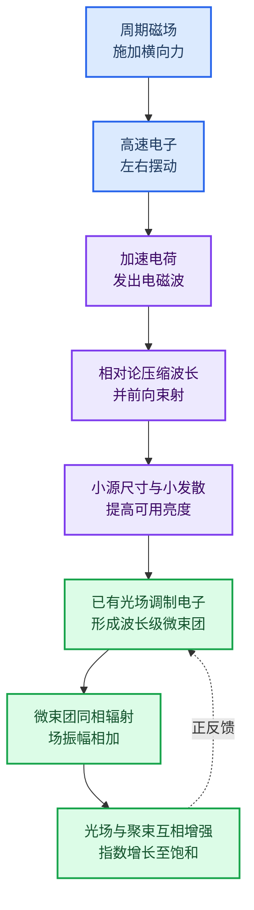

1. 直线加速器或储存环把电子加速到 $v\approx c$。电子通过交替极性的周期磁场时，横向 Lorentz 力方向不断反转，所以轨迹左右摆动；持续改变方向就是加速运动，因而产生电磁辐射。
2. 波荡器磁周期 $P$ 通常为厘米量级，但近轴基波满足

   $$
   \lambda\simeq\frac{P}{2\gamma^2}\left(1+\frac{K^2}{2}\right).
   $$

   两次相对论变换共同给出约 $2\gamma^2$ 的波长压缩，同时把辐射集中到约 $1/\gamma$ 的前向角锥，因此可制造的厘米磁结构能够产生埃级 X 射线。
3. 多个磁周期发出的波在特定方向同相叠加，形成较窄的波荡器谱。若电子束横截面更小、发散更窄且通量不降低，$F/(\Sigma\Omega)$ 增大，亮度提高；同一波长下，可用横向相干份额通常也随 $\lambda^2/(\Sigma\Omega)$ 增大。
4. 普通同步辐射中，束团内电子在辐射波长尺度上近似随机，电场大多不能完全同相相加。X-FEL 使用单程高品质电子束和很长的波荡器，让先产生的微弱辐射持续与后续电子相互作用。
5. 辐射场与电子横向速度共同产生纵向摆动力。不同相位的电子先被加速或减速，形成能量调制；随后快电子追上慢电子，能量调制转化为间距约一个辐射波长的密度调制，即微束团。
6. 一个微束团内的电子近似同相发光，电场振幅先相加，再由 $I\propto E^2$ 转成远强于随机发射的辐射。增强的光场又造成更强的微束团化，于是形成正反馈：

   $$
   I(z)=I_0\exp\left(\frac{z}{L_G}\right).
   $$

   增长不会无限继续；当电子已充分聚束，并因向光场传能而降低能量、偏离共振条件时，输出进入饱和。

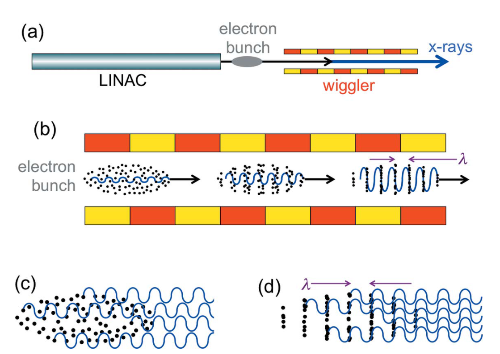
*论文图 9：X-FEL 的基本装置，以及电子从随机分布到微束团、从非相干发射到协调发射的转变。*

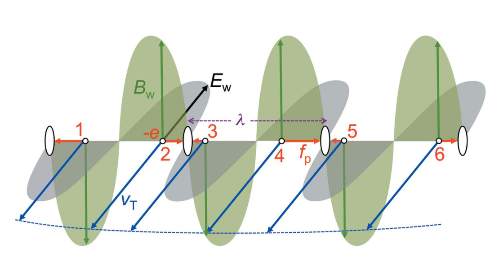
*论文图 10：已有光场对不同相位电子施加方向不同的纵向摆动力，使能量调制逐步转化为波长尺度的密度调制。*

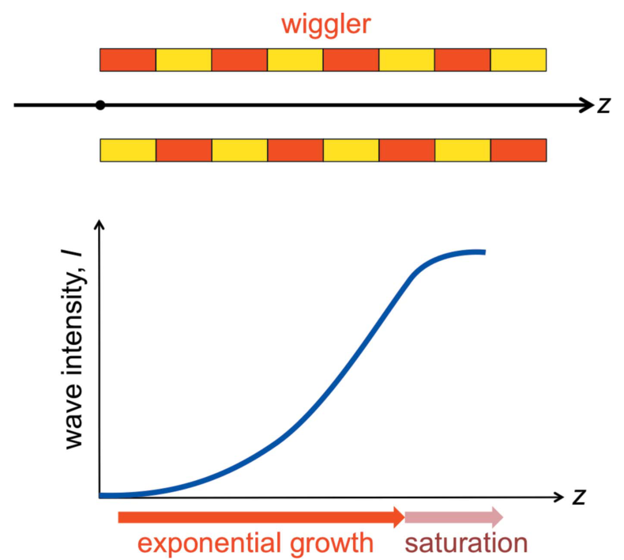
*论文图 11：X-FEL 沿波荡器依次经历初始区、指数增益区和饱和区。*

### 对 AI 加速器预警与自动调参的启发

> [!note] 证据边界
> 以下是从论文物理链条推导出的工程启发，不是本文作者提出或验证的方案，也不主张方法创新。目标是把成熟的异常检测、预测和受约束优化用于加速器运行。

AI 不应只学习“某个旋钮对应多少光强”，而应围绕物理链建立可观测、可诊断、可回退的闭环：

| 物理目标 | 优先监测量 | 可预警的问题 | 可在安全边界内建议或调整的量 |
|---|---|---|---|
| 保持电子能量与到达时间 | 射频幅相、束流到达时间、能谱、束团电荷 | 射频漂移、时序漂移、能量抖动 | 射频幅相、时序设定、压缩器设定 |
| 保持小束斑与低发散 | BPM 轨道、束斑尺寸、发射度、Twiss 参数、磁铁温度 | 轨道慢漂、聚焦失配、耦合增大 | 校正磁铁、四极磁铁、插入件前馈 |
| 保持波荡器共振与增益 | 电子能量/能散、峰值电流、波荡器间隙与相位、光子能谱和脉冲能量 | 失谐、增益长度变大、段间相位误差 | 波荡器间隙/锥度、相移器、束流匹配参数 |
| 保持样品面相干亮度 | 光束位置、指向、焦斑、能谱、波前、脉冲能量及逐脉冲涨落 | 光束漂移、光学热漂、相干代理量恶化 | 光束轨道、单色器/聚焦元件、种子时序与频率 |
| 保护机器和样品 | 束流损失、真空、温度、联锁、剂量估计 | 损失上升、真空异常、热负荷越限 | 降流、停止优化、回退到最近安全工作点 |

这里的关键是优化**样品面可用相干亮度和稳定性**，而不是单独最大化源端通量。相干性未必能逐脉冲直接测量，可先用发射度、能散、波前、谱宽和指向稳定性等代理量在线估计，再定期用真实相干测量校准模型。

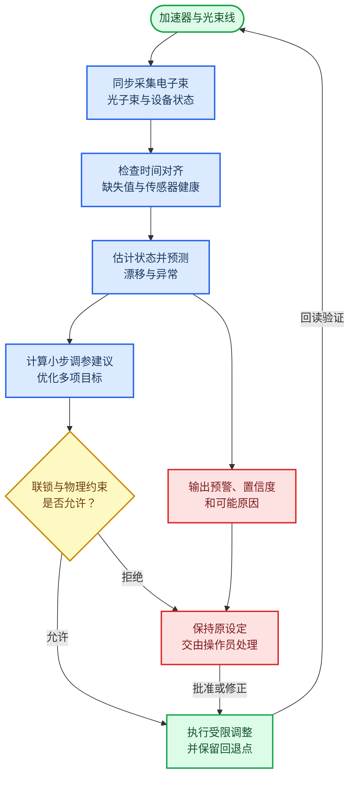

建议按风险逐级上线：先用历史运行与故障前数据训练模型并做离线回放；再以“影子模式”只给预警、不改变机器；随后让系统给出带置信度和原因的调参建议，由操作员批准；最后只对已验证、变化率受限且可立即回退的少量变量开放闭环。硬件联锁、束流损失保护和设备极限始终保持独立，不能由 AI 替代。

## 研究问题

### 为什么用户不能只把光源当作“魔法箱”

X 射线波长与化学键尺度相当，光子能量又覆盖价电子和芯电子的结合能，因此既能解析结构，也能选择性探测成键电子；硬 X 射线还可深入固体内部。可用户若只接收一束“可用的 X 射线”，往往不会主动选择偏振、脉冲结构、带宽和相干份额，也难以判断不同光源模式的代价。作者要回答的是：用最少的力学、电磁学、相对论和不确定性原理，能否让材料、化学、生命科学和医学用户建立足够可靠的光源直觉？

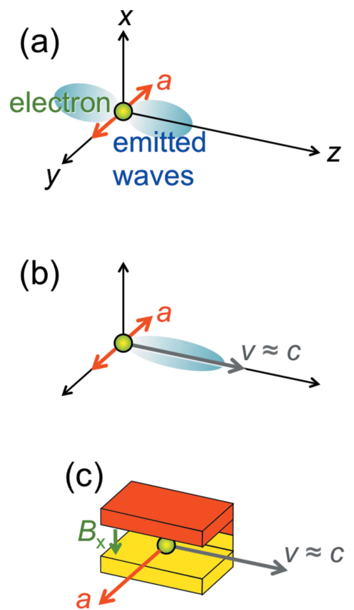
*论文原图编号：Figure 1。横向加速度产生沿纵向传播的电磁辐射；叠加接近光速的纵向运动后，相对论效应把可制造尺度的磁结构转换为 X 射线源。*

### 两类先进光源要解释什么

文章先解释储存环同步辐射：电子被注入、加速并以束团形式循环，弯转磁铁、波荡器和摆动器分别出光；随后解释 X-FEL：直线加速器产生一次通过的高品质电子束，长波荡器内形成微束团和高增益。其定位不是设施性能盘点，新实验报告也不在目标范围；它是一套“从基础物理到用户可观察性质”的教学模型。

## 数据与任务定义

### 综述范围

本文纳入的是同步辐射和 X-FEL 的基础机制、亮度、偏振、纵向/横向相干性、时间结构与代表性应用。证据形式包括十三幅直观示意图、数量级例子、理想化推导和历史文献。正文重直觉，附录补足五处推导；它没有系统检索与筛选流程，因此更准确的类型是**教学型叙述综述**，而非系统综述。

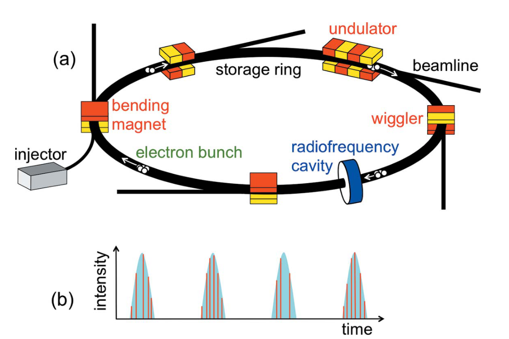
*论文原图编号：Figure 2。储存环、注入器、射频腔和三类磁源的关系，以及电子束团每次经过光源时产生的周期性 X 射线脉冲。*

### 最小物理工具箱

作者只要求五类预备知识：功、功率和 Lorentz 力；电磁波的横向电场与磁场；波长和频率；狭义相对论的两个公设；位置—动量不确定性。最关键的边界是：磁场对电子施加的 Lorentz 力与速度垂直，本身不做功，因此波荡器主要改变运动方向，而不是直接提高电子总能量。

## 方法主线

### 机制流程

1. **输入与横向加速：** 加速器提供 $v\approx c$ 的电子束，弯转磁铁或周期磁场施加横向 Lorentz 力，电子的横向加速度产生电磁辐射。
2. **相对论压缩与束射：** 电子本征系看到的磁周期因 Lorentz 收缩变为 $P/\gamma$，反向散射回实验室系又经历约 $2\gamma$ 的多普勒缩短；辐射同时被压进约 $1/\gamma$ 的前向角锥。
3. **周期干涉与光源性质：** 弱偏转时，许多周期的长脉冲相干叠加形成窄带波荡器光；强偏转或弯转磁铁产生更短时间结构和宽谱。源面积、发散角和通量共同决定亮度与可相干份额。
4. **微束团与 X-FEL 输出：** 在长波荡器内，已有辐射与横向速度产生纵向摆动力，使电子形成波长尺度微束团；协调辐射反过来加强微束团，输出沿 $z$ 指数增长，最终因完全聚束和电子失谐而饱和。

### 相对论如何把厘米周期变成埃级波长

实验室系的理想周期场可写为

$$
B=B_0\sin\left(\frac{2\pi z}{P}\right).
$$

经 Lorentz 变换后，电子看到一个反向传播、波长为 $P/\gamma$ 的场；再把后向散射光变回实验室系，近轴基波为

$$
\lambda\simeq \frac{P}{2\gamma^2}\left(1+\frac{K^2}{2}\right),\qquad K=\frac{|e|B_0P}{2\pi m_0c}.
$$

这里的 $1+K^2/2$ 来自横向摆动略微降低纵向速度。以 $\gamma\sim4\times10^3$ 为例，非相对论的 0.5 cm 尺度可压缩到约 1.6 Å。改变磁隙从而改变 $B_0$ 与 $K$，即可调谐波长。

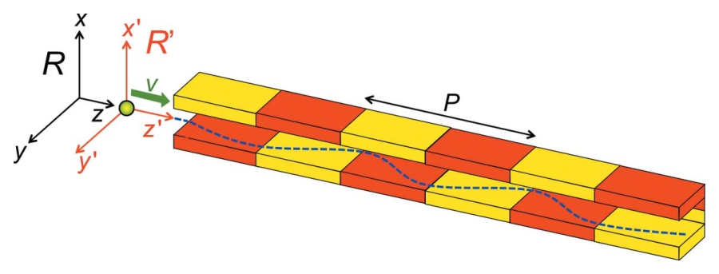
*论文原图编号：Figure 3。实验室系 (R) 与电子共动系 $R'$ 中的波荡器；磁周期 (P) 是 Lorentz 收缩和多普勒推导的几何起点。*

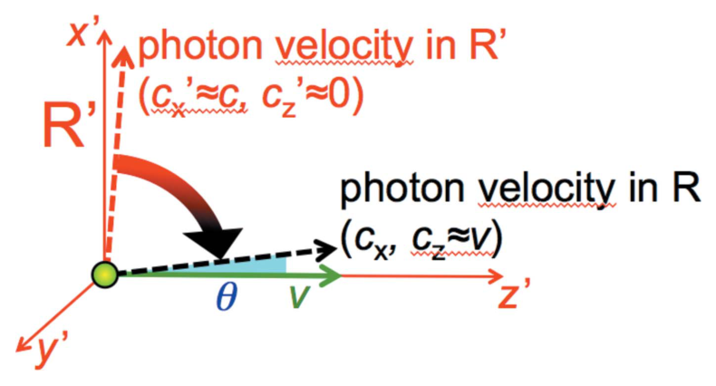
*论文原图编号：Figure 13。共动系近横向发出的光子在实验室系被变换为接近电子前进方向，展示相对论束射的几何本质。*

### 波荡器、摆动器和弯转磁铁

弱偏转的波荡器使狭窄前向光锥在电子通过所有周期时持续照到探测器，等价于较长脉冲，因此 Fourier 关系给出较窄带宽。磁场增强后，光锥反复扫过探测器，形成一串短脉冲和较宽谱，这就是摆动器极限；二者没有绝对尖锐的边界。弯转磁铁的单段轨迹也给出宽谱，实验上常用单色器选择所需波长。
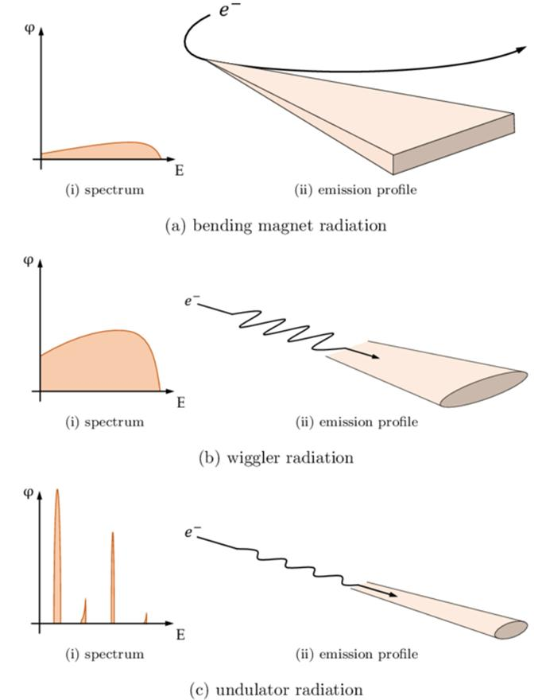
*补充图：弯转磁铁与摆动器产生较宽连续谱，波荡器依靠多周期干涉形成窄带基波及谐波，并把辐射集中在较窄的前向角锥内。*
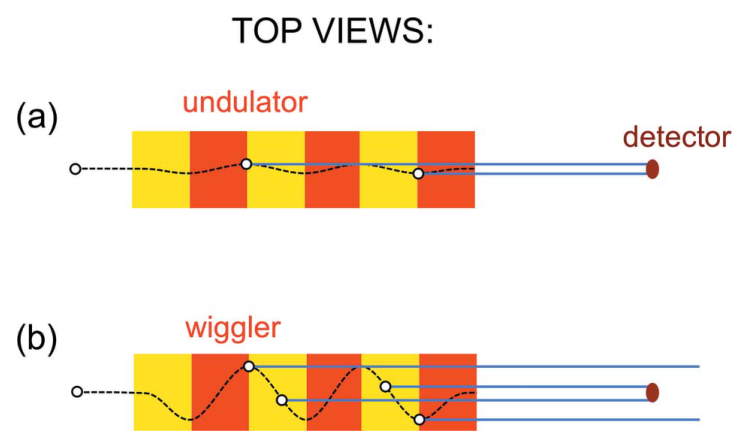
*论文原图编号：Figure 4。波荡器的长时间照射对应窄谱；摆动器的多次短照射对应宽谱，直观连接轨迹、脉冲持续时间和带宽。*

### 亮度、偏振与相干性

作者用

$$
b=C\frac{F}{\Omega\Sigma}
$$

概括亮度：$F$ 为光子通量，$\Omega$ 为发射立体角，$\Sigma$ 为源面积。同步辐射的优势来自真空中的自由电子可承受高辐射功率、加速器可保持很小束流截面、辐射功率随电子能量近似按 $\gamma^4$ 增长，以及相对论束射压缩 $\Omega$。论文称自 20 世纪 70 年代以来 X 射线亮度提高超过 22 个数量级。

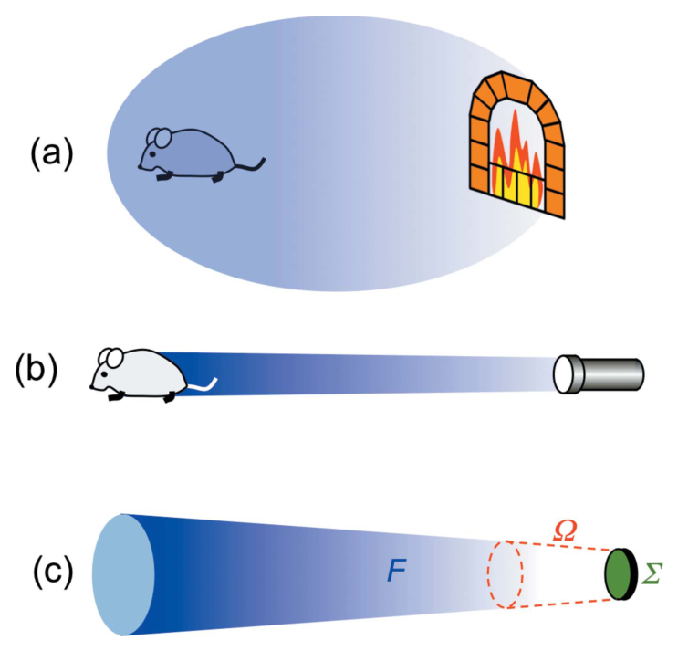
*论文原图编号：Figure 5。壁炉通量虽大却分散，手电筒通量较小也能集中到使用区；下图把通量、源面积和立体角组成亮度。*

平面弯转轨迹或平面波荡器主要产生线偏振；从轨道平面外观察会得到椭圆偏振，但强度受束射角限制，实用的强椭圆偏振通常由专用椭圆波荡器提供。

相干性则从小孔衍射理解。纵向相干要求带宽足够窄，简化条件为 $\Delta\lambda/\lambda<1$；横向相干要求有限源不同点产生的衍射图样不会相互洗掉。文章给出相干功率因子

$$
\frac{\lambda^2}{\Omega\Sigma},
$$

它与亮度共享分母 $\Omega\Sigma$，故在相同波长下，高亮度通常意味着更高的可用横向相干份额。但这仍是用户级相空间直觉，不等同于完整互相干函数。

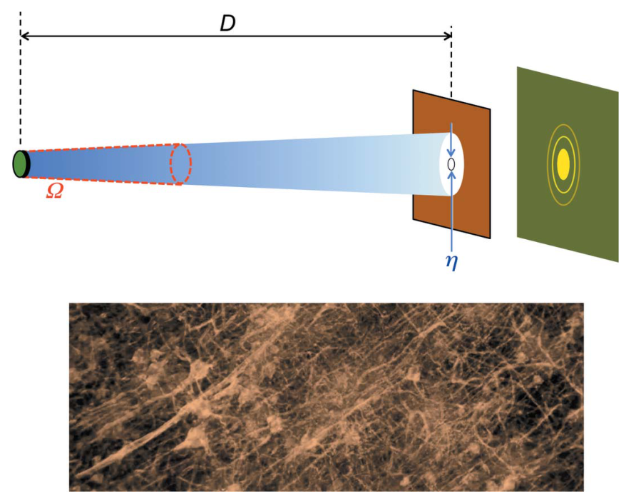
*论文原图编号：Figure 8。源尺寸、传播距离、小孔和发散角共同决定横向相干；下方神经元相衬图示范相干 X 射线成像的实际收益。*

### X-FEL 的微束团与指数增益

电子最初随机分布，先发出的电磁波与波荡器造成的横向速度 $v_T$ 共同产生纵向摆动力

$$
f_p=eB_wv_T.
$$

不同相位的电子被向前或向后推，却都会聚集到间距为 $\lambda$ 的稳定相位区，能量调制因每周期约半波长的滑移转化为密度调制。微束团电子随后协调发光，使强度近似满足

$$
I=I_0\exp\left(\frac{z}{L_G}\right),
\qquad L_G\propto B_0^{-2/3}P^{-1/3}.
$$

辐射增强又强化聚束，形成正反馈。达到完全微束团后，聚束增长变慢；电子把能量交给光场后 $\gamma$ 降低、共振波长漂移，故约在 $22L_G$ 量级进入饱和。

*论文原图编号：Figure 11。电子沿长波荡器前进时，辐射经历初始区、指数增长区和饱和区。*

## 关键结果

### 两类光源的性能轮廓

| 性质 | 储存环同步辐射 | X-FEL |
|---|---|---|
| 电子束 | 束团在环中反复循环 | LINAC 中单程通过 |
| 主要增益 | 高能电子、低发射相空间和多周期干涉 | 微束团驱动的单程相干指数放大 |
| 峰值亮度 | 高 | 可高出 9 个以上数量级 |
| 平均亮度 | 稳定、占空比较高 | 典型仍高 100–1000 倍，但远小于峰值倍率 |
| 脉冲 | 由储存环束团间距和束团长度决定 | 亚飞秒到约 0.1 ps |
| 纵向相干 | 单色器或窄带波荡器改善 | SASE 较宽且涨落；种子方案显著改善 |

X-FEL 的短脉冲可追踪化学反应、激波和水分子解离等飞秒过程。极亮单脉冲还支持“衍射先于破坏”：在样品爆炸前收集散射，用于难以结晶的分子或纳米颗粒。不过文章只称该思想已在选定案例中得到积极检验，没有把它写成对所有样品都成立的无损方案。

### SASE 与种子型 X-FEL

SASE 从电子束散粒噪声产生的随机自发辐射启动，放大后的脉冲波形、谱线和强度会逐脉冲变化，因此纵向相干性有限。种子型方案把形状和频率受控的外来脉冲注入波荡器再放大，可得到窄带和更稳定的时间基准，尤其适合泵浦—探测实验；代价是种子产生、同步与耦合链更复杂。

## 深度分析

### 真正贡献是可迁移的物理直觉

本文没有提出新的光源理论。它的贡献在于把看似分散的性能指标还原为三组共同变量：电子能量 γ 决定波长压缩和束射；波荡器变量 B₀、P、K 决定轨迹、共振和增益；光学量 F、Ω、Σ 同时约束亮度与横向相干。这使用户在面对“换谐波、调磁隙、选偏振、选单色器或选择 X-FEL 模式”时，能预判变量之间不是彼此独立的。

### 亮度与相干性相关，但不能互换

亮度是相空间密度，相干度是场相关性的归一化量。论文的 $\lambda^2/(\Omega\Sigma)$ 很适合建立第一层直觉，却没有纳入电子束发射度、能散、非高斯相空间、光束线孔径和光学像差。尤其靠近衍射极限时，“峰值亮度高”并不保证“总体相干份额高”；Walker 2019 的 Wigner 分析正是对这一科普关系的严格补充。

### 峰值和平均值是实验选择的分水岭

“峰值高九个数量级”和“平均值高 100–1000 倍”描述的是完全不同的实验条件。单粒子成像、非线性过程和飞秒动力学依赖峰值；长时间积分、弱信号谱学和高通量扫描往往更关心平均通量、重复频率与稳定性。只引用峰值亮度会系统性高估 X-FEL 对所有实验的优势。

### 容易被误读的三点

1. $\lambda=P(1+K^2/2)/(2\gamma^2)$ 是近轴、理想平面波荡器的基波近似，不是完整谱模拟器。
2. “达到衍射极限”不表示光束在任意传播面完全相干，也不消除带宽、能散和光学传输损失。
3. “衍射前破坏”是在结构变化前截取信息，不是样品不受破坏，更不保证散射光子数足以完成重建。

## 局限

- 文章为了教学采用单电子、近轴、理想周期场和简化一维增益模型，没有处理三维束流、发射度、能散、空间电荷、磁场误差和完整高次谐波。
- 亮度与相干性的数量级关系是源端直觉，未量化单色器、镜面、有限孔径和样品面传播造成的损失。
- X-FEL 性能数字来自代表性设施与文献，不构成同一光子能量、重复频率和带宽条件下的严格横向比较。
- SASE、种子方案和衍射前破坏的工程成本、失败率、样品消耗与数据处理负担讨论较少。
- 文中的“相干功率因子”有助科普，但不足以替代 Wigner 分布或互相干函数对部分相干光的严格描述。

## 我的笔记

### 可复用的用户提问框架

面对任何先进 X 射线光源，先连续问六个问题：目标光子能量如何由 $\gamma,P,K$ 得到；源端通量是多少；源面积与发散角如何；峰值和平均亮度各是多少；横向与纵向相干分别如何；脉冲长度、重复率和逐脉冲涨落是否适配实验。这样比只比较一个“亮度”数字更不容易选错工作模式。

### 值得继续验证

- 在具体第四代储存环参数下，用 Wigner 方法量化发射度和能散对本文相干功率直觉的修正。
- 在同一光子能量和带宽下，比较 SASE、外种子与自种子的纵向相干度、峰值功率和稳定性。
- 把光束线实际传输效率、单色器带宽与样品面焦斑加入 $F/(\Omega\Sigma)$ 的用户预算。
- 对“衍射前破坏”建立样品尺寸、散射截面、剂量、探测效率和可重建分辨率的联合可行性图。

## 引用

Hwu, Y., & Margaritondo, G. (2021). Synchrotron radiation and X-ray free-electron lasers (X-FELs) explained to all users, active and potential. *Journal of Synchrotron Radiation, 28*, 1014–1029. https://doi.org/10.1107/S1600577521003325

开放许可：CC BY 4.0。本文对应的逐节中文全译见同目录 `2021_Synchrotron_radiation_and_XFELs_explained_全文中文翻译.md`。
