---
tags:
  - translations/synchrotron-radiation
  - translations/XFEL
date: 2021-03-29
doi: 10.1107/S1600577521003325
source_language: en
target_language: zh-CN
---

# 面向所有现有与潜在用户解释同步辐射和 X 射线自由电子激光

> [!note] 译文说明
> 本文档依据英文 PDF 全文逐节翻译，保留原章节、公式编号、附录、图号和参考文献。公式以原 PDF 排印为准；参考文献书目信息保留原文，便于检索。本译文为学习用途的非官方中文译本。

> [!important] 原文与补充说明的边界
> 普通段落仍是论文的完整中文翻译。所有标题含“物理补充”的提示框，以及下面的“大学物理知识速查”一节，是为大学物理基础读者新增的解释，不属于论文原文。它们只负责补背景、拆公式和建立直觉，不改变作者结论。

**原题：** Synchrotron radiation and X-ray free-electron lasers (X-FELs) explained to all users, active and potential  
**作者：** Yeukuang Hwu, Giorgio Margaritondo  
**机构：** 台湾中央研究院物理研究所；国立成功大学工程科学系；国立清华大学脑科学研究中心；洛桑联邦理工学院基础科学学院  
**收稿：** 2020-09-08；**接收：** 2021-03-29  
**期刊：** *Journal of Synchrotron Radiation* 28, 1014–1029 (2021)  
**DOI：** [10.1107/S1600577521003325](https://doi.org/10.1107/S1600577521003325)  
**关键词：** 同步辐射；X-FEL；相对论；摆动力

## 摘要

半个世纪以来，同步辐射已经发展为一项遍布全球、涉及数万名研究人员的庞大事业。最初几乎所有用户都是物理学家；如今，用户来自化学、材料科学、生命科学、医学研究、生态学、文化遗产等许多领域。这带来一个挑战：如何在不要求读者具备深厚理论物理背景的情况下解释同步辐射光源。本文提出一种创新讲解方法，只使用各科学领域研究者通常都掌握的基础概念来应对这一挑战。

## 阅读前补充：大学物理知识速查

### 先记住全文的一条主线

可以先不管推导，只记住下面这条因果链：

**周期磁场让高速电子左右摆动 → 加速电荷发出电磁波 → 相对论把厘米级磁周期“映射”为埃级辐射波长，并把光压向前方 → 电子束越小、发散越窄，亮度和可用相干光越高 → 在 X-FEL 中，已有辐射反过来把电子排成波长尺度的微束团 → 同相辐射形成正反馈并指数放大。**

后文的多数公式只是在分别定量说明这六个箭头。文末“最终总结与工程启发”将用流程图、论文图 9–11 和 AI 控制闭环把这条主线重新串起来。

### 常见量和数量级

| 量 | 含义 | 本文常见尺度 | 阅读时的直觉 |
|---|---|---:|---|
| $\lambda$ | 辐射波长 | 埃至纳米 | 越短，越能分辨小结构，单个光子能量也越高 |
| $P$ | 波荡器磁周期 | 厘米 | 磁铁本身的宏观结构尺度 |
| $\gamma$ | 相对论因子 | 数千至数万 | 衡量电子有多“相对论化”，不是普通速度倍数 |
| $F$ | 光子通量 | 光子数/秒/带宽 | 总共有多少光子 |
| $\Sigma$ | 有效源面积 | 由电子束横截面决定 | 光从多大的区域发出 |
| $\Omega$ | 发射立体角 | 常为毫弧度角锥 | 光束向多少方向散开 |
| $B_0$ | 磁场峰值 | 特斯拉量级 | 磁场让电子摆动的强弱 |
| fs、ps | 飞秒、皮秒 | $10^{-15}$ s、$10^{-12}$ s | 描述超短 X 射线脉冲 |

单位换算中最常用的是 $1\ \text{Å}=10^{-10}\ \mathrm m=0.1\ \mathrm{nm}$。光子能量与波长满足

$$
E_\gamma=h\nu=\frac{hc}{\lambda},
$$

在 X 射线范围可方便地估算为

$$
E_\gamma[\mathrm{keV}]\simeq\frac{12.4}{\lambda[\text{Å}]}.
$$

例如 $1\ \text{Å}$ 对应约 $12.4\ \mathrm{keV}$。注意这里的“光子能量”通常是 keV，而产生它的“电子束能量”通常是 GeV，两者不是同一个量。

### 1. 波、相位与光子

正弦波可以写成 $A\cos\phi$。$A$ 是振幅，$\phi$ 是相位；相位相同的波峰对波峰相加，振幅增强，相位相反则可能抵消。波长 $\lambda$、频率 $\nu$ 和光速满足

$$
c=\lambda\nu.
$$

同一束光也可以用光子描述，每个光子的能量为 $h\nu$。波动图景适合解释干涉、衍射和偏振，光子图景适合解释能量交换和不确定性；它们不是两套互相排斥的理论，而是同一电磁场的两种观察方式。

还有一个容易忽略的平方关系：辐射强度与场振幅的平方成正比，即 $I\propto E^2$。因此电场振幅增大 10 倍，强度会增大 100 倍。

### 2. Lorentz 力、功和辐射

带电粒子在电磁场中受到

$$
\mathbf F=q(\mathbf E+\mathbf v\times\mathbf B).
$$

电场力可以沿速度方向做功并改变粒子能量；磁场力 $q\mathbf v\times\mathbf B$ 永远垂直于瞬时速度，主要改变运动方向而不直接改变速率。就像匀速圆周运动中向心力不改变速率，却持续产生加速度一样，磁铁能让电子转弯并辐射。严格说，电子辐射后损失的能量需要由储存环射频腔补回。

“有速度”本身不会辐射；在经典电动力学中，关键是电荷有加速度。电子质量很小，同样的力可产生更大加速度，所以比质子更适合产生强同步辐射。

### 3. 相对论因子究竟表示什么

$$
\gamma=\frac{1}{\sqrt{1-v^2/c^2}},\qquad E=\gamma m_0c^2.
$$

电子静能为 $m_0c^2\simeq0.511\ \mathrm{MeV}$。因此总能量为 $2\ \mathrm{GeV}$ 的电子有 $\gamma\approx2000/0.511\approx3914$。当电子已非常接近光速时，继续加能主要使 $\gamma$ 增大，速度的数值却只再靠近 $c$ 一点点。高能光源的关键参数因此常写成电子能量或 $\gamma$，而不是“速度是多少”。

高 $\gamma$ 会同时造成三件事：沿运动方向的长度收缩、光的强烈 Doppler 频移，以及辐射集中到约 $1/\gamma$ 的前向小角锥。本文反复出现的短波长、高通量和小发散，都与这三件事有关。

### 4. 干涉、衍射与相干性

干涉要求不同波之间的相位关系能保持稳定。若不同时间发出的波相位稳定，称为纵向或时间相干；若光源不同位置发出的波仍能维持稳定相位关系，称为横向或空间相干。

衍射不是仪器缺陷，而是波通过有限孔径后的必然展开。孔径越小，出射角分布越宽。这可以从 Fourier 变换理解，也可以从位置—动量不确定性理解；两种说法描述的是同一物理限制。

相干性也不是“有或没有”的二元标签。一束光可以横向相干很好、纵向相干较差；SASE 型 X-FEL 正是典型例子。单色器可提高纵向相干性，但会丢弃大量不在目标带宽内的光子。

### 5. 通量、亮度和发射度不是一回事

- **通量**只数光子总数；一盏向四面八方发光的大灯也可以有很高通量。
- **亮度**还要求光来自小源并集中在小角度内，粗略由 $F/(\Sigma\Omega)$ 衡量。
- **发射度**描述电子束或光子束在“位置—角度”相空间中占据的面积。以一个横向平面为例，可粗略想成 $\varepsilon\sim\sigma_x\sigma_{x'}$。发射度越小，束流越容易同时做到“小光斑、低发散”。

因此，提高通量不一定提高相干性；缩小狭缝虽然可能筛出更相干的光，也会降低通量。实际光束线设计总是在通量、能量分辨率、空间相干性、时间分辨率和样品剂量之间权衡。

### 6. 为什么 X-FEL 会出现指数增长

X-FEL 是一个正反馈系统：少量随机辐射对电子施力，使电子出现微小密度起伏；密度起伏让更多电子同相辐射；更强的辐射又进一步整理电子。只要每一轮反馈的增益近似与当前场强或强度成比例，增长就会表现为指数形式。

这和普通激光的受激放大有共同的反馈思想，但 X-FEL 不依赖原子能级中的束缚电子，而是从相对论自由电子束提取能量。电子束既是“增益介质”，也是一次性消耗的能量来源。

## 1. 背景

同步辐射光源和自由电子激光（Margaritondo, 1988, 2002；Winick, 1995；Willmott, 2011；Mobilio et al., 2015；Bordovitsyn, 1999）可以说是爱因斯坦狭义相对论最重要的实际应用（Rafelski, 2017）。它们利用相对论性质，在其他发射体表现不佳的光谱范围内产生电磁辐射，尤其是 X 射线。

向非物理专业读者解释这类光源并不容易。本文提出的方法只需少数基础科学概念。

### 1.1 为什么值得了解

开始之前，必须先回答：读者为什么应对同步辐射光源和 X-FEL 感兴趣？这个问题有两层。第一，X 射线为什么重要？第二，同步辐射或 X-FEL 用户为什么应了解光源如何工作，而不是把它当成一个按需出光的“魔法箱”？

第一个问题的答案很普遍：X 射线的重要性取决于它能探测的自然对象，而探测能力又由 X 射线的两种“尺度”决定——物理尺度即波长，以及光子能量。

X 射线波长与化学键长度处于同一范围。X 射线光子能量又覆盖固体和分子中价电子与芯电子的结合能；这些电子要么直接参与成键，要么受到成键影响。简言之，X 射线是化学键的理想探针，而化学键是绝大多数科学技术研究主题的基础，这就是 X 射线如此重要的原因。

此外，硬 X 射线能深入穿透固体并探测其内部性质，这是医学放射学的基础，也对材料科学、化学、生物学、医学研究、文化遗产等许多领域有用。

再看“魔法箱”观念。遗憾的是，许多用户选择不理解光源，只索取所需辐射。作者认为，这就像花巨资买了一辆法拉利，却因为不懂原理始终只用一挡。许多卓越科研生涯——包括多位诺贝尔奖得主——都得益于超越“魔法箱”层次的先进 X 射线光源知识。本文的目标就是提供这类知识。

### 1.2 阅读前只需知道的少量知识

1. **基础力学。** 能量变化与力所做的功、功率有关。磁场对运动电子施加的 Lorentz 力垂直于速度，因此不做功，也不能改变动能。
2. **电磁波。** 电磁波含有彼此垂直、且都垂直于传播方向的电场 $E_w$ 与磁场 $B_w$，大小满足 $E_w=cB_w$。电荷加速才能发射电磁波，辐射功率与加速度平方成正比。
3. **波函数。** 沿 $z$ 方向传播、波长为 $\lambda$ 的电磁波可写成

$$
B_w=B_0\cos\left[2\pi\left(\frac{z}{\lambda}-\frac{ct}{\lambda}\right)\right],
\qquad
E_w=E_0\cos\left[2\pi\left(\frac{z}{\lambda}-\frac{ct}{\lambda}\right)\right].
$$

其中 $B_0,E_0$ 为场振幅，强度与 $E_w^2$ 成正比，也与 $B_w^2=E_w^2/c^2$ 成正比。
4. **狭义相对论。** 两个公设是：光速在相互匀速运动的参考系中相同；任何实验都不能探测两个参考系之间的匀速相对运动。本文会在需要时介绍 Lorentz 变换、Lorentz 收缩、多普勒频移、相对论束射、相对论质量及纵向相对论质量。
5. **Heisenberg 不确定性原理。** 位置与动量不确定度乘积的最小量级为 Planck 常数。

### 1.3 起点

沿某一纵向方向发射电磁辐射，是由带电粒子在与之垂直的横向方向加速造成的。加速度等于力除以质量，所以同步辐射光源选择质量很小的电子或正电子。

产生 X 射线的困难可以归结为：加速装置似乎需要在与 X 射线波长相当的距离——典型为埃、也就是原子尺度——内改变加速度。这意味着要制造原子尺度的装置，显然不可能。

相对论通过实际上“缩短”波长解决这个困难。于是，发射装置可以按技术上可行的宏观尺度制造；只需让它作用于具有很高能量、沿纵向以接近光速 $c$ 的速度 $v$ 运动的电子。

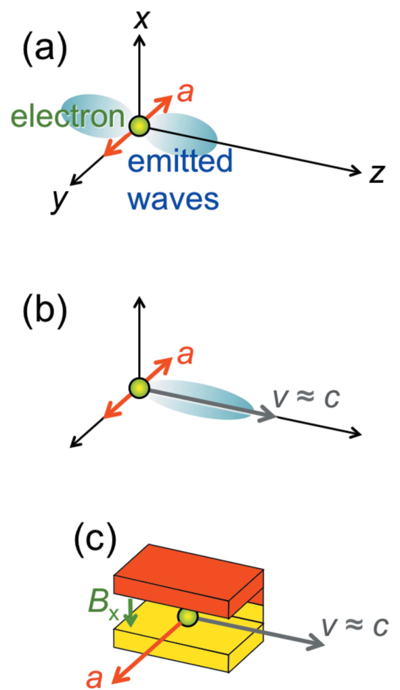
*图 1　(a) 电磁辐射的一般发射机制：电子沿横向 $y$ 加速、沿纵向 $z$ 发射波。(b) 加上接近光速的纵向速度以利用相对论并产生短 X 射线波长。(c) 弯转磁铁的实际实现：横向 $x$ 磁场 $B_x$ 产生沿 $y$ 的 Lorentz 力。*

因此，同步辐射装置包含产生相对论电子的粒子加速器，以及使电子横向加速的宏观装置。该领域早期使用同步加速器，所以得名“同步辐射”；如今加速器通常是储存环，但原名仍普遍使用。

## 2. 波荡器

为了理解同步辐射光源，本文分析一个具体例子：波荡器。它是在纵向周期排列的一系列磁铁，对相对论电子施加 Lorentz 力，使电子在横向轻微振荡，由此产生辐射；波长与波荡器周期 $P$ 有关，但关系并不直观。

使用图 3 中两个参考系：实验室系 $R$，坐标为 $(x,y,z)$；电子共动系 $R'$，坐标为 $(x',y',z')$。$R'$ 沿 $z$ 方向以纵向速度 $v$ 相对 $R$ 运动。

实验室系中的周期磁场写为

$$
B=B_0\sin\left(\frac{2\pi z}{P}\right).\tag{1}
$$

转换到电子系需用 Lorentz 变换：

$$
z=\gamma(z'+vt'),\qquad
t=\gamma\left(t'+\frac{vz'}{c^2}\right),\tag{2}
$$

其中

$$
\gamma=\frac{1}{\sqrt{1-v^2/c^2}}.
$$

第二个式子提醒我们：与经典物理不同，两个参考系测得的时间并不相同。附录 A 说明式(2)为何合理。

把式(2)代入式(1)，得到电子系中的场

$$
B'=B_0\sin\left[2\pi\left(\frac{z'}{\lambda'}+\frac{vt'}{\lambda'}\right)\right],\tag{3}
$$

其中

$$
\lambda'=\frac{P}{\gamma}.\tag{4}
$$

式(3)有两条重要信息：它像一个沿负 $z'$ 方向、以速度 $v$ 传播的波；其波长为 $P/\gamma$。电子确实“看到”波荡器像一列向后运动的周期磁场波。相对论还要求 $R'$ 系中磁场伴随垂直的横向电场，就像电磁波一样。因为电子在 $R'$ 中速度为零，Lorentz 磁力消失；若没有新出现的电场力，就可由此探测两个参考系的相对运动，违反第二公设。电场的出现补偿了这一问题。

波长 $P/\gamma$ 就是 Lorentz 收缩：运动物体沿运动方向缩短 $\gamma$ 倍，波荡器长度及周期也如此。

电子可以把所看到的波荡器“电磁波”向后散射，类似镜子反射光束。这种对波荡器“波”的反向散射就是同步辐射的基本发射机制。

不过，$P/\gamma$ 是电子系中的波长；实验在实验室中进行，而电子又是运动光源，因此波长还要由多普勒频移进一步缩短。对声音，靠近列车的鸣笛频率会上升、波长缩短；电磁波也类似，但相对论使效应非常强。电子系波长再除以约 $2\gamma$（见附录 B），得到

$$
\lambda\simeq\frac{\lambda'}{2\gamma}\simeq\frac{P}{2\gamma^2}.\tag{5}
$$

所以 Lorentz 收缩与多普勒频移合起来，把波荡器波长缩短约 $2\gamma^2$，推进到 X 射线范围。

> [!tip] 物理补充：为什么是 $2\gamma^2$
> 可以把它拆成连续两次“压缩”。第一步，电子看来波荡器周期由 $P$ 变成 $P/\gamma$，贡献一个 $\gamma$；第二步，电子把所见场向前方散射回实验室系，迎面 Doppler 频移再贡献约 $2\gamma$。两者相乘就是约 $2\gamma^2$。例如 $P=2\ \mathrm{cm}$、$\gamma=10^4$ 时，$\lambda\approx10^{-10}\ \mathrm m=1\ \text{Å}$：厘米级磁铁因此可以产生原子尺度波长。

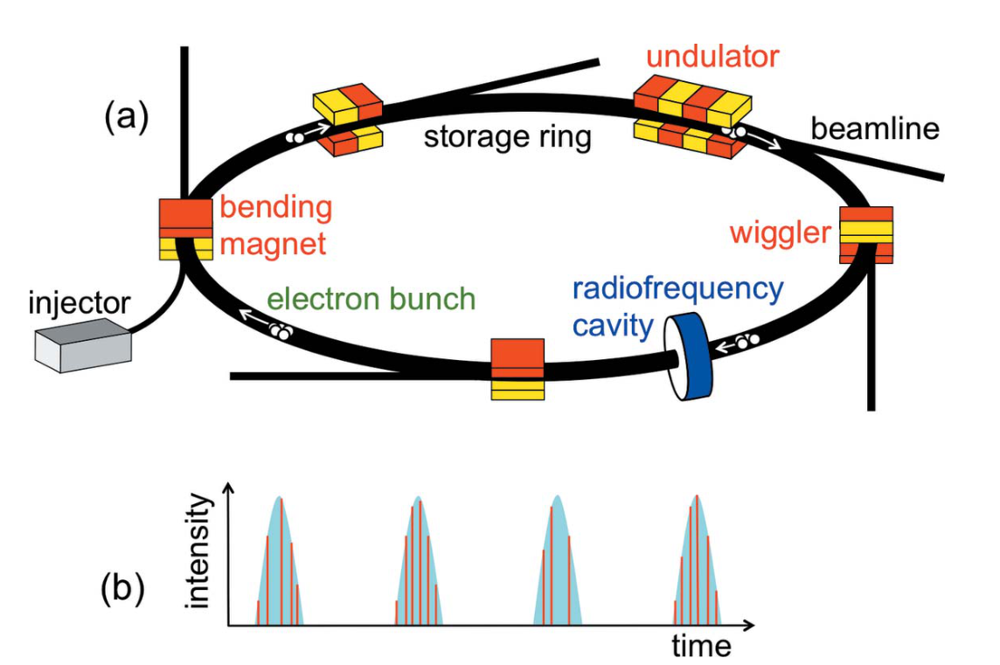
*图 2　(a) 同步辐射装置的一般结构：储存环、电子注入器、射频腔以及带光束线的弯转磁铁、波荡器和摆动器。电子以规则间隔的束团循环。(b) 每个束团经过光源便产生一个辐射脉冲，脉冲中又含单电子造成的微脉冲。*

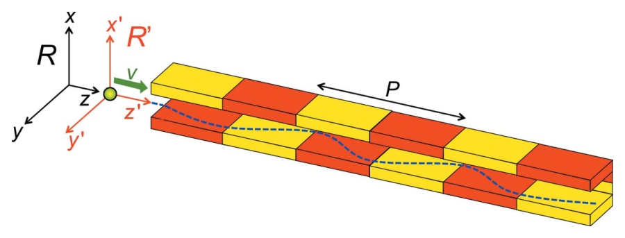
*图 3　纵向周期为 $P$ 的波荡器使电子横向振荡；相对论描述使用实验室/波荡器参考系 $R$ 与电子参考系 $R'$。*

多大的 $2\gamma^2$ 才够？运动电子的相对论质量 $m=\gamma m_0$，由 $E=mc^2$ 可知 $\gamma=E/(m_0c^2)$，也就是用静能量为单位表示的电子总能量。同步辐射电子典型能量为数 GeV，对应数千的 $\gamma$。例如 $\gamma=4\times10^3$（约 2 GeV）可把非相对论 0.5 cm 波长缩短到约 1.6 Å。

> [!tip] 物理补充：高能量不等于“比光慢很多”
> 当 $\gamma\gg1$ 时，$1-v/c\simeq1/(2\gamma^2)$。若 $\gamma=4000$，电子速度只比光速低约三千万分之一。电子不能超过光速；增加的加速器能量主要体现在动量和 $\gamma$ 上，而不是让速度按比例继续增加。

## 3. 波荡器：进一步修正

式(5)中的 $\gamma$ 对应纵向相对论运动，决定 Lorentz 收缩和多普勒频移。波荡器又加入横向振荡。磁 Lorentz 力不做功，所以总动能不变；横向速度 $v_T$ 的出现意味着纵向速度及相应纵向 $\gamma$ 略微减小，辐射波长略微增大。附录 C 得到修正式

$$
\lambda\simeq\frac{P}{2\gamma^2}\left(1+\frac{K^2}{2}\right),\tag{6}
$$

其中 $K$ 是波荡器参数：

$$
K=\frac{|e|B_0P}{2\pi m_0c}.\tag{7}
$$

改变磁场振幅 $B_0$——例如调节磁隙——即可为具体应用调谐波长。

> [!tip] 物理补充：怎样理解波荡器参数 $K$
> $K$ 是无量纲量，可近似理解为电子横向摆动动量相对于纵向相对论尺度的大小，也有 $K\sim\gamma v_T/c$。$K$ 较小时，电子摆角小于或接近自然辐射角 $1/\gamma$，同一观察方向能接收许多周期的相干叠加，谱线较窄；$K$ 很大时，光锥反复扫过观察者，辐射更像宽带摆动器。式(6)中的 $1+K^2/2$ 表明横向摆动越强，平均纵向速度越低，共振波长越长。

式(6)给出中心波长，波荡器还会在其周围发射一段较窄带宽。为什么束流很窄？这是多普勒效应的另一个方面，即相对论像差或“束射”：运动光源的辐射集中在很小的前向角范围，约为 $2/\gamma$，同步辐射中通常为毫弧度量级。电子因此像极端狭窄的手电筒。附录 D 给出推导。

*补充图：弯转磁铁与摆动器产生较宽连续谱，波荡器依靠多周期干涉形成窄带基波及谐波，并把辐射集中在较窄的前向角锥内。*
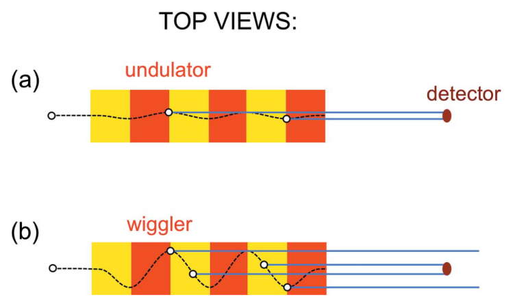
*图 4　波荡器和摆动器带宽的俯视解释。(a) 弱磁场下，准直光束在电子通过整个波荡器期间都照到小探测器，形成长脉冲。(b) 强场摆动器的大振幅使光束反复扫入、扫出探测器，形成多个短脉冲。二者转变没有严格界线，术语有时混用。*

图 4(a)中横向振荡很弱，窄光锥在电子通过整个波荡器期间持续照到探测器，产生长脉冲；Fourier 定理把长脉冲与窄波长带宽联系起来。磁场增强后，电子振荡加大，光锥反复扫入、扫出探测器，形成一串短脉冲；Fourier 定理对应更宽带宽。这样的光源称为摆动器。

> [!tip] 物理补充：为什么“持续时间长”对应“谱线窄”
> 纯粹、无限长的正弦波只有单一频率；把它截成有限时长的波包，就必须叠加一小段不同频率。时间越短，需要的频率范围越宽，粗略满足 $\Delta\nu\,\Delta t\gtrsim1$ 的数量级关系。波荡器中可见的有效振荡周期越多，中心谱线通常越窄；这与相机曝光时间越长、越能分辨接近频率的直觉类似。

除波荡器与摆动器外，还有弯转磁铁。它们让电子沿储存环闭合轨道运动，也通过加速度产生辐射。非相对论电子在恒定磁场中的回旋频率给出 $\lambda=2\pi c/\omega$，且 $\omega=|eB_x|/m_0$，所以

$$
\lambda=\frac{2\pi cm_0}{|eB_x|}.
$$

例如 $B_x=1$ T 得到约 1 cm，只是微波。相对论在电子系引入电场，等效力含 $\gamma B_x$，电子系波长变为

$$
\lambda'=\frac{2\pi cm_0}{|\gamma eB_x|},
$$

再经 $2\gamma$ 多普勒频移，实验室系为

$$
\lambda=\frac{2\pi cm_0}{|2\gamma^2eB_x|}.
$$

同样的 $2\gamma^2$ 因子把波长移入 X 射线区。弯转磁铁的电子“手电筒”只短暂扫过观察方向，对应宽带谱；可用单色器选出所需波长。

> 原文脚注：多普勒效应在爱因斯坦相对论之前半个世纪由 Christian Doppler 发现。作者还叙述了他遭同事 Joseph Petzval 等人猛烈攻击、被维也纳大学解职、后在威尼斯自我流亡期间死于肺结核的悲剧，并强调其成果如今构成同步辐射实验的基础。

## 4. 亮度、偏振、相干性与时间结构

前文说明相对论电子能发出短波长辐射，但这不自动保证得到高质量 X 射线。必须用合适参数评估光源，其中最重要的是亮度或 brilliance，记为 $b$。

### 4.1 亮度

亮度描述把高辐射功率送入使用区域的能力。壁炉可发出很大通量 $F$，但光来自大面积、分散在宽角度范围，不能把很多辐射集中到使用区，所以亮度不高；手电筒或激光笔即使通量有限，也因源面积小、角度窄而亮度高。

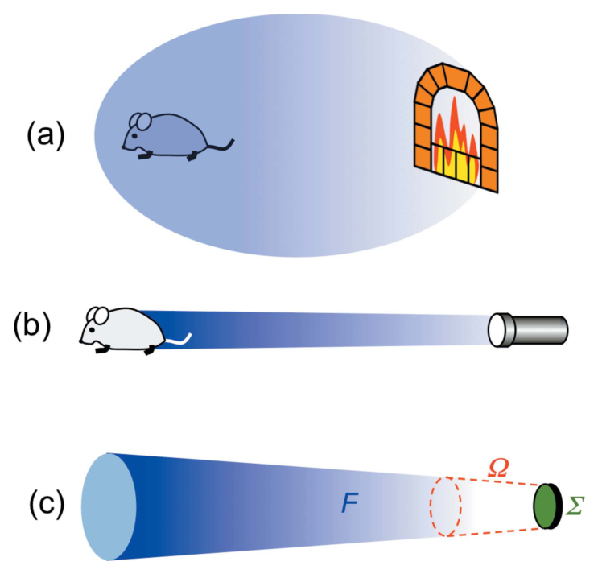
*图 5　亮度概念。(a) 壁炉发射面积大、角度宽，不能把大量辐射送到使用区。(b) 手电筒更有效，亮度高。(c) 用通量 $F$、发射立体角 $\Omega$ 和源面积 $\Sigma$ 定义亮度。*

由此定义

$$
b=C\frac{F}{\Omega\Sigma},\tag{8}
$$

其中 $\Omega$ 是发射立体角，$\Sigma$ 是源面积。自 20 世纪 70 年代以来，同步辐射让 X 射线光源亮度提高了超过 22 个数量级；这一提升甚至比广受称赞的计算机功率增长还多约 15 个数量级。

> [!tip] 物理补充：亮度为何比“总功率”更贴近实验
> 样品和光学元件只接受有限面积、有限角度和有限带宽内的光。若通量相同，把源面积缩小 10 倍、发散立体角再缩小 10 倍，理想化亮度就提高 100 倍。亮度的实际单位通常还带有“每 $0.1\%$ 带宽”，所以比较不同光源时必须确认带宽、时间平均方式和峰值/平均口径一致。

这来自四个因素，其中两个直接来自相对论。

第一，使用加速器真空中的“自由”电子。常规 X 射线源的电子位于固体内，过高辐射功率会损伤固体；自由电子没有这个限制，可承受更高功率。

第二，式(8)中的源尺寸 $\Sigma$ 很小。它不是一个电子的截面，而是储存环内许多略有不同轨迹的电子束横截面。先进加速器技术可把它做得极小。

第三，高通量 $F$ 直接受相对论增强。经典 Larmor 定律中辐射功率与横向加速度平方成正比。由 $R'$ 变到 $R$ 时，纵向运动不改变横向坐标，却把时间缩短 $\gamma$ 倍、把加速度增大 $\gamma^2$、把其平方增大 $\gamma^4$。因此实验室系辐射功率与通量近似随电子能量四次方增长。又因 $\gamma^4=[E/(m_0c^2)]^4$，辐射随静质量四次方反比变化；质量小的电子远比质子等强子容易产生强辐射。

第四，相对论束射减小 $\Omega$。但弯转磁铁只在垂直方向发散很小，水平方向光束会扫过很宽角度。

### 4.2 偏振

偏振是同步辐射另一项重要性质，也最容易解释。电磁波是横向电场和磁场扰动；若每个场只沿一个横向方向扰动，波为线偏振；扰动方向旋转时，波为圆偏振或椭圆偏振。

同步辐射中的扰动由使电子横向加速的磁装置产生。弯转磁铁让电子在水平面沿一段圆弧运动；从水平面看，圆弧像直线，加速度和电场扰动都沿水平方向，所以在水平面探测到线偏振。平面波荡器也产生线偏振。

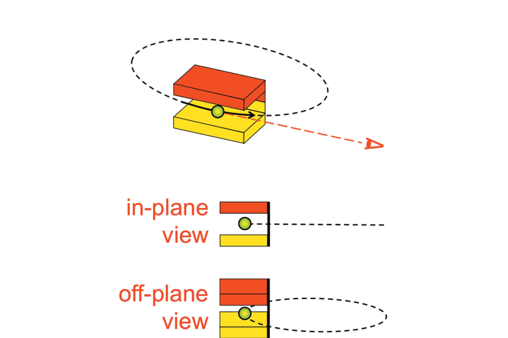
*图 6　同步辐射偏振。上：弯转磁铁使电子沿圆弧运动。中：从水平面看，圆弧像直线，对应线偏振。下：从水平面外观察，轨迹像椭圆，对应椭圆偏振。*

从水平面外的角度观察，弯转磁铁圆轨迹看成椭圆，辐射也为椭圆偏振。不过，这不是得到强椭圆偏振的高效方法，因为相对论束射把光压在窄角范围，离开水平面后强度快速下降。实际应使用专用椭圆波荡器。

### 4.3 相干性

可见光光学已使用相干性数百年；它对 X 射线科学的影响较新、范围也较小，但正在快速扩展。经典物理中，X 射线像可见光一样能产生干涉和衍射；日常生活很少看到这些波动现象，是因为辐射必须具有相干性。

可用直径为 $\eta$ 的圆孔衍射引入这一概念。点状单色源总会在荧光屏上产生亮中央斑与较弱同心环，这就是完全相干。若源发出以 $\lambda$ 为中心、宽度 $\Delta\lambda$ 的波段，每个波长产生一个衍射图样，叠加后可能洗掉条纹；这对应时间或纵向相干性。若源有直径 $\xi$ 的有限面积，各点也产生各自图样，叠加后可能洗掉条纹；若仍能看到条纹，则源具有横向或空间相干性。

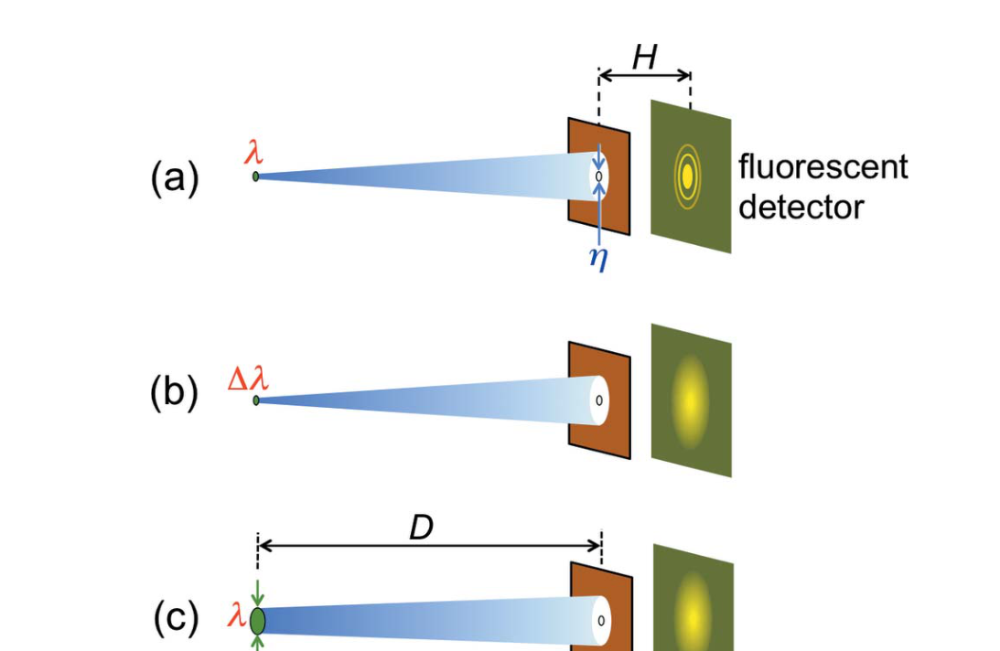
*图 7　用小孔衍射解释相干性。(a) 单色点源总能产生可见条纹。(b) 有限波段可能把条纹洗掉。(c) 有限源面积也可能使条纹消失。*

利用电磁辐射的量子性质可以得到相干条件。量子电动力学把电磁辐射只看作光子；若光子在相关方向上的尺寸大于至少一个波长，其电磁场——更准确地说概率场——就能探测波动结构。光子尺寸由 Heisenberg 位置不确定性决定。

纵向上，动量大小 $p_z=h/\lambda$，带宽导致

$$
\Delta p_z=\left|\frac{\partial(h/\lambda)}{\partial\lambda}\right|\Delta\lambda
=\frac{h\Delta\lambda}{\lambda^2}.
$$

由 $\Delta z\gtrsim h/\Delta p_z$，要使 $\Delta z>\lambda$，需

$$
\frac{\Delta\lambda}{\lambda}<1.\tag{9}
$$

这就是纵向相干的基本条件，而且并不苛刻，所以可见光中波动现象常见。同步辐射中，弯转磁铁和摆动器本来为宽带，需要单色器滤波；波荡器带宽较窄。

> [!tip] 物理补充：相干长度比“是否相干”更实用
> 纵向相干长度可粗略估算为 $l_c\sim\lambda^2/\Delta\lambda=\lambda/(\Delta\lambda/\lambda)$。它表示光沿传播方向走多远后，相位关系才明显失去记忆。若实验中两条光路的程差远小于 $l_c$，仍能看到稳定干涉；程差远大于 $l_c$，条纹会被平均掉。式(9)只是最低限度的数量级条件，高分辨干涉实验往往要求 $\Delta\lambda/\lambda\ll1$。

横向上，小孔图样第一极小的特征尺度近似 $\Delta x\sim\lambda D/\xi$，要让孔径 $\eta$ 解析该尺度，需

$$
\eta<\Delta x=\frac{\lambda D}{\xi}.\tag{10}
$$

用源面积 $\Sigma\simeq\pi\xi^2/4$ 和孔所张立体角 $\Omega\simeq\pi(\eta/2D)^2$ 改写，可得到“相干功率因子”

$$
\frac{\lambda^2}{\Omega\Sigma}.\tag{11}
$$

横向相干源的这一量较大，意味着其辐射能通过小孔而仍产生窄角衍射。式(8)与式(11)共享 $\Omega\Sigma$，所以同一波长下高亮度源也倾向具有更高横向相干性。

> [!tip] 物理补充：亮度高与完全相干并不等价
> 亮度和横向相干性都受“源尺寸 × 发散角”控制，所以通常正相关；但亮度还含通量和带宽定义，相干性则关心场的相关程度。增大一团彼此不相干电子的电流可以提高通量和亮度，却不保证相干份额同比提高。更严谨的分析要用互相干函数或 Wigner 相空间分布，这正是[配套的 Walker 论文译稿](../2019_Undulator_radiation_brightness_and_coherence/2019_Undulator_radiation_brightness_and_coherence_全文中文翻译.md)进一步讨论的问题。

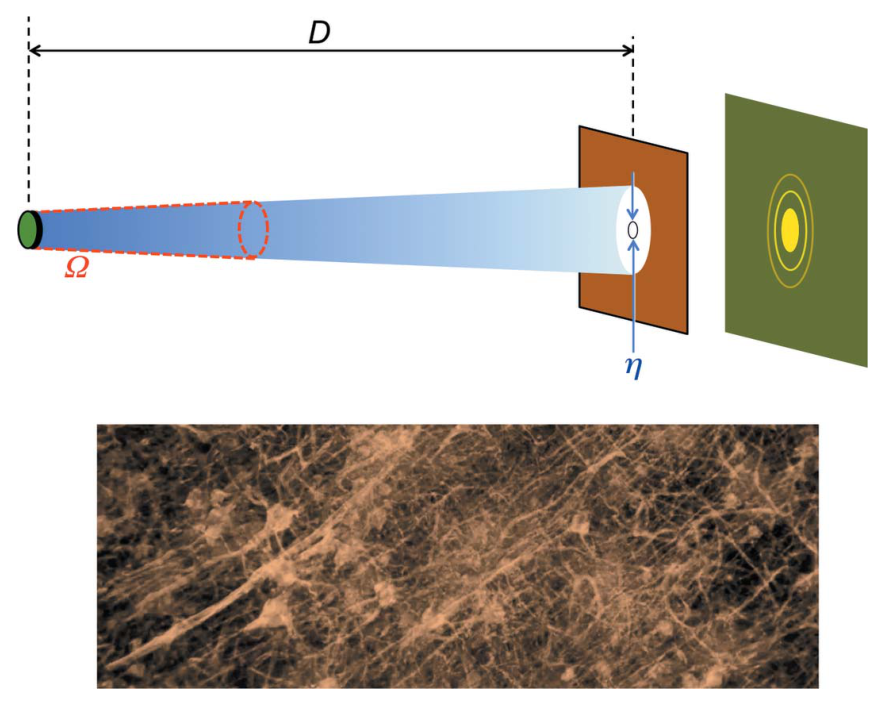
*图 8　上：定义相干功率因子的源面积、距离、小孔与发散角。下：以相干 X 射线相衬得到的神经元网络图像示例。*

那么同步辐射是否纵向或横向相干？纵向相干通常需要式(9)以及单色器滤波；波荡器谱较窄，弯转磁铁和摆动器较宽。横向相干则依赖源面积与角发散，第三代和更新的低发射度光源尤其有利。

### 4.4 时间结构

同步辐射不是连续不变地到达。电子在储存环中以规则间隔的束团循环，每个束团经过弯转磁铁、波荡器或摆动器时发出一个 X 射线脉冲。脉冲间隔由储存环周长、光速及填充的束团数决定；脉冲宽度由电子束团长度决定。

电子经注入器送入储存环，射频腔用振荡电场补偿每圈辐射损失，同时形成纵向势阱，把电子约束成束团。一个脉冲内部还含许多单电子微脉冲。若电子位置随机，这些单电子场大多按强度相加；若在波长尺度上形成有序结构，它们可按场幅协调相加，这正是 X-FEL 的入口。

> [!tip] 物理补充：为何同相辐射会强得惊人
> 若 $N$ 个电子的相位随机，正负场振幅大多互相抵消，平均强度约随 $N$ 增长；若它们同相，场振幅先相加为约 $N$ 倍，而强度是振幅平方，因此理想上可随 $N^2$ 增长。X-FEL 的微束团就是要把原本随机的电子变成能够近似同相辐射的群体。

## 5. 从同步辐射到 X-FEL

X-FEL 的基本结构包括产生相对论电子束的直线加速器（LINAC）和一段很长的波荡器/摆动器。普通波荡器中电子随机分布，发射波相位不相关；X-FEL 的关键是让电子在束团内部形成间距约为 $\lambda$ 的周期“微束团”，于是许多电子发出的波同相叠加并被放大。

*图 9　X-FEL 的主要部件。(a) LINAC 与长波荡器。(b) 电子束沿波荡器前进时，与先前辐射相互作用并逐渐形成波长尺度微束团。(c) 无微束团时辐射不相关；(d) 微束团电子协调发光，产生光学放大。*

### 5.1 微束团

电子进入波荡器后先随机发光。已有辐射的磁场 $B_w$ 与波荡器引起的横向速度 $v_T$ 共同产生纵向 Lorentz 力，其大小等效写成“摆动力”

$$
f_p=eB_wv_T.\tag{12}
$$

该力的方向随电子相对波相位而变：一些电子被向前推，另一些向后推。电子与光波每个波荡器周期产生约半个波长的纵向滑移，因而相位交替；不论初始受力方向如何，电子都被聚集到一系列稳定相位区，间隔为一个辐射波长。这先产生能量调制，再形成密度调制，也就是微束团。

> [!tip] 物理补充：从能量调制到密度调制
> 刚开始电子位置仍近似随机，只是处在不同光波相位的电子被加速或减速，形成周期性的能量差。随后，能量稍高和稍低的电子在纵向运动中产生微小位移，像公路上快车追上慢车那样逐渐聚集，于是能量调制转化为密度调制。这里的“团”不是肉眼可见的一小包，而是叠加在整个电子束团上的埃级周期纹理。

*图 10　摆动力 $f_p$ 的大小等效于波磁场 $B_w$ 与横向速度 $v_T$ 产生的 Lorentz 力。不同相位电子向前或向后移动，最终都聚集成以 $\lambda$ 为周期的微束团。*

由于光相对电子略快，每经过一个波荡器周期会向前滑移约一个辐射波长的一部分；这一“滑移”把场相位连续带给后方电子，是微束团沿束团建立的关键。

### 5.2 光学放大

形成初始微束团后，电子继续被波荡器横向“摇动”，但这时它们协调发光。实验表明，辐射强度 $I$ 沿波荡器距离 $z$ 指数增加：

$$
I=I_0\exp\left(\frac{z}{L_G}\right),\tag{14}
$$

其中 $L_G$ 为增益长度。最终增长会饱和。

> [!tip] 物理补充：怎样读“增益长度”
> 每前进一个 $L_G$，强度乘以 $e\approx2.718$；前进 $10L_G$，理想指数段会放大约 $e^{10}\approx2.2\times10^4$ 倍。因此“增益长度较短”代表装置能在较短波荡器内达到巨大增益。这个规律只适用于尚未饱和的指数区，不能无限外推。

指数增长来自正反馈：微束团电子的协调辐射增强波场，增强的波场又加强微束团，进而加强协调辐射。作者用一个简化估算说明这一点。单电子向波场转移能量的速率为负功率 $eE_wv_T$。因 $\langle v_T^2\rangle=(Kc/\gamma)^2/2$，有 $|v_T|\propto B_0P/\gamma$，而 $|E_w|\propto\sqrt I$，所以

$$
\text{单电子能量转移率}=eE_wv_T\propto\frac{\sqrt I\,B_0P}{\gamma}.\tag{15}
$$

微束团程度可用束内纵向位移 $\Delta z$ 除以最大位移 $\lambda/2\simeq P/(4\gamma^2)$ 估计：

$$
\text{微束团程度}\propto\frac{2\Delta z}{\lambda}
\simeq\frac{4\gamma^2\Delta z}{P}.\tag{16}
$$

纵向 Newton 型方程为

$$
\gamma^3m_0\frac{d^2\Delta z}{dt^2}=f_p=eB_wv_T.\tag{17}
$$

再次使用 $v_T\propto B_0P/\gamma$ 与 $B_w\propto\sqrt I$，并把式(14)代入，可得到 $\Delta z$ 及微束团程度与 $B_0,P,L_G,I$ 的标度。把单电子能量转移率和微束团程度相乘，作者得到强度增长率的标度

$$
\frac{dI}{dt}\propto B_0^2P L_G^2 I,\tag{21}
$$

它与指数解自洽，条件是

$$
L_G\propto B_0^{-2/3}P^{-1/3}.\tag{23}
$$

这一简化结果与更复杂 FEL 理论对关键变量作用的预测一致。

*图 11　电子沿波荡器前进时，短暂初始阶段后波强度指数增长，随后进入饱和。*

增长为何终止？在某一距离后电子已充分微束团化，聚束增长变慢；同时电子把能量交给波场而减速，$\gamma$ 下降、共振波长变化，电子不再向原有放大波有效供能。真实饱和更复杂，还可能出现电子与波之间的能量振荡；但结果仍是光学放大终止。饱和长度典型约为 $22L_G$，因此必须使用很长的波荡器。

### 5.3 一个历史谜题

红外 FEL 在 Madey 1971 年工作后数十年便有基础，X-FEL 却困难得多。表面看来，微束团只需移动约一个波长，X 射线波长更短，似乎反而更容易。

谜题的一部分由纵向相对论质量 $\gamma^3m_0$ 解决。产生 X 射线需要很大的 $\gamma$，所以摆动力实际上要移动纵向上极其“沉重”的电子；即使位移短也很困难。短周期微束团还非常脆弱、易被破坏；单程起振需要很强放大，电子束必须具有极小横截面和极高密度。这些技术要求解释了 X-FEL 实现为何耗时数十年。

> [!warning] 物理补充：“纵向相对论质量”是一种教学说法
> 现代相对论通常把静质量 $m_0$ 保持不变，直接用 $\mathbf F=d\mathbf p/dt$ 和 $\mathbf p=\gamma m_0\mathbf v$ 描述动力学。沿运动方向微小改变速度时，$d p_\parallel/dv_\parallel=\gamma^3m_0$，所以纵向加速度对同样的力极不敏感。论文把这一响应系数称为“纵向相对论质量”，直觉上可理解为“纵向很难推动”，但并不是电子的静质量真的变成了 $\gamma^3m_0$。

它们也解释了两件事：普通同步辐射装置的波荡器和摆动器不满足这些条件，所以不会自动变成 FEL；X-FEL 使用 LINAC 而非储存环。储存环电子束横截面由略有差异的电子轨迹形成，电子绕环时随机发射同步辐射光子，轨迹会不断受影响。电子束在 LINAC 中只通过一次，没有先前同步辐射发射历史，更容易获得 X-FEL 所需的小截面与高密度。

### 5.4 X-FEL 的非凡性质

X-FEL 的首要特征是光学放大带来的高亮度，但必须区分平均亮度与峰值亮度。发射由短脉冲组成，每个脉冲对应一个电子束团穿过波荡器；脉冲峰值极高，脉冲之间却有较长“死时间”，所以平均亮度低得多。

> [!tip] 物理补充：峰值和平均值可相差多少
> 粗略地说，平均量约等于峰值乘以占空比，而占空比约为“单脉冲持续时间 × 每秒脉冲数”。例如每秒 $10^3$ 个、每个 $10\ \mathrm{fs}$ 的脉冲，其时间占空比只有约 $10^{-11}$。真实比较还要计入单脉冲形状、带宽与机器填充模式，但这个估算足以说明：峰值亮度极高不代表样品每秒接收的总光子数按同样倍数增加。

亮度提高不能超越“衍射极限”。图 12 用粗暴的小孔法解释：让大源辐射通过屏上的小孔，小孔可成为小面积源，却浪费大量辐射；孔越小，衍射造成的角发散 $\theta$ 越大，横向相干性不能无限提高。

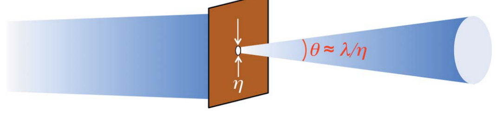
*图 12　衍射极限：用小孔获得小面积源时，衍射增大角发散 $\theta$，从而把式(11)的相干功率因子限制在约 1。*

孔径 $\eta$ 给出光子横向位置不确定度，横向动量不确定度约为 $(h/\lambda)\theta$。由 Heisenberg 原理，$\eta(h/\lambda)\theta\sim h$，所以 $\lambda/(\eta\theta)\sim1$。又因 $\Omega\sim\theta^2,\Sigma\sim\eta^2$，相干功率因子 $\lambda^2/(\Omega\Sigma)$ 的自然最大量级为 1。这是技术改进无法突破的自然极限，并通过式(8)的几何因子限制亮度。

> [!tip] 物理补充：衍射极限限制的是相空间，不是“光斑不能更小”
> 单独把光斑做小并不违反衍射极限，代价是角发散增大；单独把发散压小也可以，代价是光斑增大。极限约束的是二者乘积，即一束单模相干光占据的最小横向相空间面积。不同文献可能把一维 RMS 发射度写成 $\lambda/(4\pi)$ 或使用其他宽度约定，常数因子会随定义变化，但“尺寸与发散不能同时任意小”的物理内容不变。

许多先进同步辐射光源已在部分谱段接近这一极限；X-FEL 更进一步，以光学放大大幅提高通量。达到衍射极限并有效放大的 X-FEL，峰值亮度可超过同步辐射九个或更多数量级；平均亮度“仅”高 100–1000 倍，但仍是巨大提升。

原则上还可通过改善电子束几何等参数提高 X-FEL 峰值亮度；然而微束团密度极高时，前文忽略的电子—电子相互作用会限制放大。

另一重要性质是时间结构。单程起振所需电子束团极短，典型脉冲持续时间从亚飞秒到约 0.1 ps，可研究同等时间尺度的动力学。例如快速化学反应；约 $10^2$ fs 内，固体中的激波传播距离可与一个原子相当；水分子解离约需 10 fs。

最具吸引力的应用之一，是用一次超短、超亮脉冲确定大分子和纳米颗粒结构。传统 X 射线晶体学同时收集周期晶格中许多分子的信息，以抵消单分子辐射损伤；但获得晶体往往困难或不可能。X-FEL 可对单个分子进行衍射。极端脉冲能量会使分子爆炸，但若脉冲比爆炸过程短，就可把信息外推到初始结构。这一可能性已在一些案例中得到积极检验；最终影响尚待未来判断，原则上可能非常巨大，并影响药物开发等应用。

### 5.5 种子型 X-FEL

X-FEL 是否相干？横向相干性答案显然是肯定的，因为 X-FEL 达到衍射极限。纵向相干性更复杂，它要求较窄波长带宽。

5.1、5.2 节描述的机制称为自放大自发辐射（SASE）。它从电子进入波荡器时的随机自发辐射启动，放大后产生随时间变化、逐脉冲线形不同的脉冲；Fourier 定理对应宽频率和波长带宽。

> [!tip] 物理补充：SASE 为什么每个脉冲都不完全一样
> SASE 的种子是电子离散性产生的散粒噪声；每个电子束团的微观随机排列不同，最先被放大的频率和相位成分也会不同。因此它可以有很好的横向相干性和极高峰值亮度，却通常具有多个纵向时间/频率尖峰。外部种子或自种子方案提供更确定的初始波形，主要改善纵向相干性和光谱稳定性；外部种子还可提供较明确的时间基准。

为了得到窄带，可用外部光源产生形状明确的脉冲，并把它注入波荡器中放大，这称为 X-FEL“种子”。种子型 X-FEL 多年只存在于理论，后来陆续实现并获得高纵向相干性。这对时间分辨实验尤其重要，因为 X-FEL 脉冲可提供分析快速过程的“起始”时刻。

## 6. 结束语

X-FEL 的当前发展除了实际应用，还打开了与 X 射线量子本性有关的新基础问题。

如前所述，在量子电动力学中，电磁辐射的光子性与波动性不是两种并存的实体；只有光子是真实的。那么干涉和衍射等波动现象从何而来？它们必须由涉及光子的相互作用产生。

设想以条纹观察衍射或干涉，并把光子通量降到装置中平均任一时刻只有一个光子。条纹仍会由许多光子事件累积而成。这表明造成波动现象的不是不同光子之间相互作用，而是每个光子与自身相互作用——Dirac 很早就认识到这一点。

光子自相互作用对应量子电动力学的一阶过程。在可见光学中，亮度足够高时还可探测高阶相互作用，并用于新实验技术。X 射线过去因光源亮度不足而做不到；新种子型 X-FEL 正在改变这一局面。X 射线高阶量子电动力学现象开始变得可探测，既有基础意义，也有实际意义；这是 X 射线科学令人兴奋的新篇章。

## 7. 教学说明

本文专门面向教学，作者基于自身经验提出以下建议：

1. 不建议扩大数学形式体系；实践表明，本文使用的数学层级已能被多数专业学生掌握。
2. 同样建议把相对论概念限制在文章前半部分引入的范围内。
3. 应展示实验结果实例，最好来自教师自己的研究，并优先选择最引人注目的结果；成像技术常是很好的选择。
4. 可以加入少量历史说明，但应限制在领域最相关的里程碑。可引用以下成果：
   - 同步辐射理论的最初建立（Iwanenko & Pomeranchuk, 1944；Schwinger, 1946, 1949）；
   - 同步辐射首次实验探测（Elder et al., 1947；Pollock, 1983）；
   - 同步辐射谱和其他性质的早期测量（Tomboulian & Hartman, 1956；Balzarotti et al., 1970）；
   - 同步辐射的早期使用（Codling, 1997；Madden & Codling, 1963；Sagawa et al., 1966；Sasaki, 1997, 2016；Cauchois et al., 1963；Balzarotti et al., 1974；Savoia, 1988；Perlman et al., 1974；Kulipanov & Skrinsky, 1988；Kulipanov et al., 2016；Hartman, 1988；Winick & Doniach, 1980；Bathow et al., 1966；Haensel et al., 1966；Steinmann & Skibowski, 1966）；
   - 从寄生使用过渡到专用同步辐射光源（Lynch et al., 2015；Miyahara et al., 1976）；
   - 插入件的引入（Winick et al., 1981；Halbach, 1986）；
   - 自由电子激光的最初建议（Madey, 1971）；
   - X-FEL 理论（Bonifacio et al., 1984, 1994；Pellegrini, 2012）；
   - 第一台硬 X 射线自由电子激光的实现（Emma et al., 2010）。

> [!note] 物理补充：附录怎样读最省力
> 第一次阅读可以先跳过全部附录，只要掌握正文中的 $\lambda\simeq P/(2\gamma^2)$、$K$、$F/(\Omega\Sigma)$、相干性和微束团反馈即可。需要追问“为什么又出现一个 $\gamma$”时读附录 B；需要理解窄角束射时读附录 D；想核对 $1+K^2/2$ 和 $\gamma^3m_0$ 时读附录 C；想追踪摆动力来源时再读附录 E。附录 A 主要说明为什么经典速度相加必须改成相对论速度相加。

## 附录 A：Lorentz 变换的理由

经典物理中的坐标变换只是 $z=z'+vt$。但两边除以 $t$ 后得到 $z/t=z'/t+v$，即物体在两参考系中的速度相差 $v$。若对象是光，就得到 $c=c'+v$，与相对论第一公设冲突，也与电磁学在所有参考系中给出 $c\simeq3\times10^8\ \mathrm{m\,s^{-1}}$ 的预测和大量实验相冲突。

式(2)解决了问题。第一式除以第二式：

$$
\frac{z}{t}=\frac{z'+vt'}{t'+(v/c^2)z'}
=\frac{z'/t'+v}{1+(v/c^2)(z'/t')}.
$$

若 $z'/t'=c$，则

$$
\frac{z}{t}=\frac{c+v}{1+(v/c^2)c}=c,
$$

与光速不变性一致。

> [!tip] 物理补充：式子真正改动了什么
> 经典速度相加是 $u=u'+v$；相对论速度相加则为 $u=(u'+v)/(1+u'v/c^2)$。低速时 $u'v/c^2$ 极小，分母近似 1，自动回到经典结果；若 $u'=c$，分母恰好保证结果仍为 $c$。因此相对论不是把经典力学全部推翻，而是在接近光速时加入不可忽略的修正。

## 附录 B：多普勒频移

波函数的相位在 $R$ 和 $R'$ 中不能不同，否则波动现象的变化会暴露参考系之间的匀速相对运动，违反第二公设。考虑传播方向，两个参考系中后向散射波的相位分别为

$$
2\pi\left(\frac{z}{\lambda}-\frac{ct}{\lambda}\right),
\qquad
2\pi\left(\frac{z'}{\lambda'}-\frac{ct'}{\lambda'}\right).
$$

把式(2)代入第一个相位，并令它与第二个相位相等，得到

$$
\lambda'=\gamma\lambda(1+v/c),
$$

所以

$$
\lambda=\lambda'\sqrt{\frac{1-v/c}{1+v/c}}
=\frac{\lambda'}{\gamma(1+v/c)}
\simeq\frac{\lambda'}{2\gamma},
$$

即式(5)。

## 附录 C：电子在波荡器中怎样运动

正文最初只考虑纵向电子速度与波荡器磁场共同产生的横向 Lorentz 力，它造成横向振荡速度 $v_T$。完整图景还包括影响 $v_T$ 与纵向速度 $v_L$ 的其他作用：波荡器磁场与 $v_T$ 还会产生纵向 Lorentz 力并改变 $v_L$，以保持总动能不变；电子也受已发射波的电场和磁场作用；电子之间还有相互作用。

这里忽略只在极高束团密度下重要的电子—电子作用，也暂不考虑波场力，后者在 FEL 讨论中再引入；但必须考虑波荡器与 $v_T$ 造成的纵向 Lorentz 力。

用 Newton 型方程描述各方向。横向动量 $p_T=\gamma m_0v_T$，所以

$$
f_T=\frac{dp_T}{dt}=\gamma m_0\frac{dv_T}{dt},
$$

横向相对论质量为 $\gamma m_0$。纵向动量 $p_L=\gamma m_0v_L$，而 $\gamma$ 也由纵向速度决定。求导可得

$$
f_L=\frac{dp_L}{dt}=\gamma^3m_0\frac{dv_L}{dt},
$$

所以纵向相对论质量为 $\gamma^3m_0$。

第一近似中 $v_T\ll v_L\simeq c$，横向方程为

$$
\gamma m_0\frac{dv_T}{dt}
\simeq e cB_0\sin\left(\frac{2\pi ct}{P}\right),
$$

其解为

$$
v_T\simeq-\frac{Kc}{\gamma}\cos\left(\frac{2\pi ct}{P}\right).
$$

因 $\langle\cos^2\rangle=1/2$，有 $\langle v_T^2\rangle=K^2c^2/(2\gamma^2)$。

波荡器磁场与 $v_T$ 产生的纵向力满足

$$
f_L=ev_TB=\gamma^3m_0\frac{dv_L}{dt}.
$$

积分后，考虑电子带负电，可写成

$$
v_L=\text{常数}-\frac{v_T^2}{2\gamma^2c}.
$$

这里“常数”是电子在波荡器外、$v_T=0$ 时的纵向速度 $v$。因此 $v_L$ 不仅小于 $v$，还轻微振荡；RMS 平均约为 $v-K^2c/(4\gamma^4)$。把该平均速度代入决定式(5)的 $1/\gamma^2=1-v^2/c^2$，得到近似修正

$$
\frac{1}{\gamma_L^2}\simeq\frac{1}{\gamma^2}\left(1+\frac{K^2}{2}\right),
$$

从而得到式(6)、式(7)。

## 附录 D：多普勒“束射”

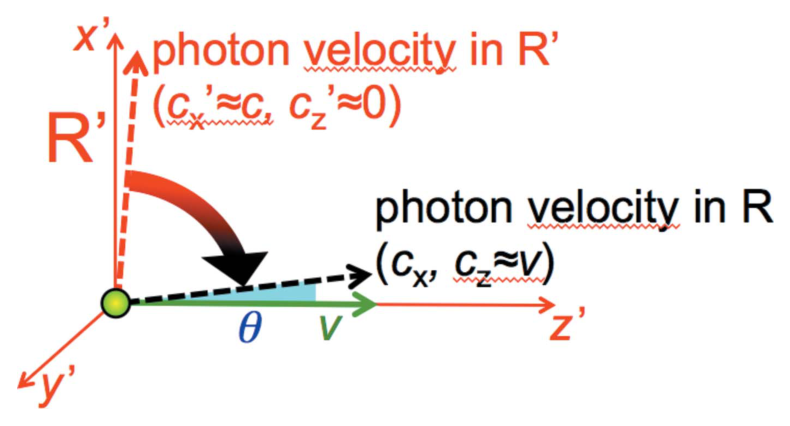
*图 13　相对论束射分析：电子系中近横向的光子速度，经参考系变换后在实验室系中接近纵向。*

设速度 $v\simeq c$ 的电子在自身参考系 $R'$ 中近横向 $x'$ 发出光子。光子纵向速度分量近似为零，横向分量近似为 $c$。在实验室系 $R$ 中，光源运动把光子速度“投影”到前方；因 $c$ 在两个参考系中相同，速度矢量只旋转而模长不变。

若实验室系中光子纵向分量几乎全来自光源运动，即 $c_z\simeq v$，光子与 $z$ 轴夹角为 $\theta\simeq c_x/c_z\simeq c_x/v$。又因 $c^2=c_x^2+c_z^2\simeq c_x^2+v^2$，所以

$$
\theta\simeq\frac{c_x}{v}
\simeq\frac{\sqrt{c^2-v^2}}{c}
=\sqrt{1-v^2/c^2}\simeq\frac{1}{\gamma}.
$$

因此总发射角范围 $2\theta$ 的确约为 $2/\gamma$。

> [!tip] 物理补充：把 $1/\gamma$ 换成可感知的角度
> 若 $\gamma=4000$，半角 $1/\gamma=2.5\times10^{-4}\ \mathrm{rad}=0.25\ \mathrm{mrad}$，在 10 m 远处对应约 2.5 mm 的横向尺度。这个极小角锥说明同步辐射为什么天然高度定向，也说明光束线对位置和角度稳定性为何非常敏感。

## 附录 E：摆动力

附录 C 已得

$$
v_L=\text{常数}-\frac{v_T^2}{2\gamma^2c},
\qquad
\frac{dv_L}{dv_T}\simeq-\frac{v_T}{\gamma^2c}.
$$

波电场大小为 $E_w$，它按横向 Newton 型定律轻微改变 $v_T$：

$$
dv_T=\frac{eE_w}{\gamma m_0}dt.
$$

这个变化也改变 $v_L$：

$$
dv_L=\frac{dv_L}{dv_T}dv_T
\simeq-\frac{v_T}{\gamma^2c}\frac{eE_w}{\gamma m_0}dt.
$$

乘以纵向相对论质量 $\gamma^3m_0$，得到纵向力的大小 $e v_TE_w/c$。又因电磁波满足 $E_w/c=B_w$，所以

$$
|f_p|=|eB_wv_T|,
$$

这就证明了式(12)的摆动力，它作用在纵向相对论质量 $\gamma^3m_0$ 上。

## 物理补充：一页复习卡

| 问题 | 最短答案 |
|---|---|
| 为什么高速电子会发光？ | 不是因为“快”，而是磁场使它横向加速；加速电荷辐射。 |
| 厘米级波荡器为什么能产生埃级 X 射线？ | Lorentz 收缩与 Doppler 频移合计给出约 $2\gamma^2$ 的波长压缩。 |
| 为什么用电子而不用质子？ | 电子质量小，同样的力产生更大加速度，辐射效率高得多。 |
| $K$ 控制什么？ | 控制横向摆动强度，并通过 $1+K^2/2$ 改变共振波长和谱形。 |
| 通量与亮度有什么区别？ | 通量只数光子；亮度还要求小源、小发散，并限定带宽。 |
| 相干性是什么意思？ | 不同时间或空间位置的场保持可预测的相位关系，从而能稳定干涉。 |
| 为什么小孔不能无限提高相干性？ | 孔越小，衍射角越大；尺寸与发散的乘积受波动/不确定性限制。 |
| 微束团是什么？ | 电子束内间隔约一个辐射波长的周期性密度调制，不是宏观束团。 |
| X-FEL 为什么指数放大？ | 辐射整理电子，整理后的电子同相辐射出更强的场，形成正反馈。 |
| 为什么会饱和？ | 电子充分聚束并失去能量后偏离原共振条件，不能继续高效供能。 |
| SASE 的主要代价是什么？ | 从随机散粒噪声起振，脉冲谱和时间结构有随机性，纵向相干性有限。 |
| 峰值亮度能代表平均实验通量吗？ | 不能；还必须结合重复频率、脉宽、填充模式和带宽计算平均量。 |

如果只能记住三个公式，优先记住

$$
\lambda\simeq\frac{P}{2\gamma^2}\left(1+\frac{K^2}{2}\right),
\qquad
b\propto\frac{F}{\Omega\Sigma},
\qquad
I=I_0e^{z/L_G}.
$$

它们分别概括了“波长从哪里来”“光源质量怎样衡量”和“X-FEL 为什么能放大”。

## 最终总结与工程启发

### 第一步：先具备五组物理知识

1. **Lorentz 力与加速电荷辐射：** 磁场力 $q\mathbf v\times\mathbf B$ 主要改变电子运动方向；方向持续改变就是横向加速，加速电荷会发出电磁波。
2. **狭义相对论：** 高能电子的 $\gamma\gg1$，Lorentz 收缩和 Doppler 频移共同压缩辐射波长，相对论像差又把光压进约 $1/\gamma$ 的前向角锥。
3. **波、相位和干涉：** 场的相位决定不同电子的辐射是相加还是抵消；强度满足 $I\propto E^2$，所以许多电子同相时会得到远强于随机相位的辐射。
4. **相空间、发射度、亮度与相干性：** $b\propto F/(\Sigma\Omega)$；高通量只有同时来自小源和小发散，才形成高亮度。同一波长下，小的 $\Sigma\Omega$ 通常也带来更大的横向相干份额，但高亮度不等于完全相干。
5. **反馈与指数增长：** 辐射场改变电子能量和位置，改变后的电子分布又增强辐射场；这种相互增强是 X-FEL 指数增益的核心。

### 第二步：把同步辐射和 X-FEL 连成一条因果链

**周期磁场让高速电子左右摆动 → 加速电荷发出电磁波 → 相对论把厘米级磁周期“映射”为埃级辐射波长，并把光压向前方 → 电子束越小、发散越窄，亮度和可用相干光越高 → 在 X-FEL 中，已有辐射反过来把电子排成波长尺度的微束团 → 同相辐射形成正反馈并指数放大。**

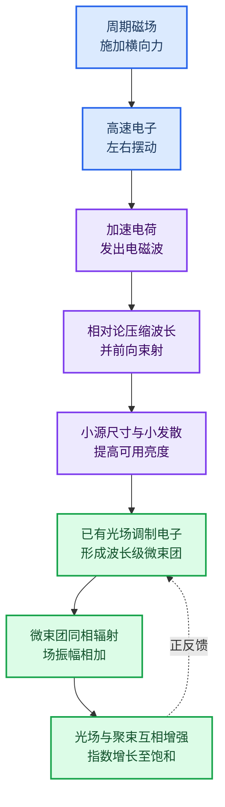

近轴波荡器基波

$$
\lambda\simeq\frac{P}{2\gamma^2}\left(1+\frac{K^2}{2}\right)
$$

定量解释了“厘米磁周期如何映射为埃级 X 射线”。小电子束和小发散减小 $\Sigma\Omega$，使更多光子集中在可用相空间内。到了 X-FEL，先产生的微弱辐射通过摆动力使电子先形成能量调制，再转成间距约为 $\lambda$ 的密度调制；微束团同相发光，增强的光场又进一步加强微束团，因而在未饱和区满足

$$
I(z)=I_0\exp\left(\frac{z}{L_G}\right).
$$

当电子充分聚束，并因向光场传能而降低能量、偏离原共振条件时，放大进入饱和。

*图 9：X-FEL 的装置与核心机制；电子沿长波荡器前进时从随机分布逐渐形成波长尺度微束团。*

*图 10：光场与横向摆动共同产生纵向摆动力，使能量调制逐步转化为密度调制。*

*图 11：微束团和协调辐射相互增强，输出经历初始区、指数增益区和饱和区。*

### 第三步：由物理链条得到 AI 监控与自动调参启发

> [!note] 边界说明
> 以下内容是面向加速器运行的延伸思考，不属于论文原文，也不把方法新颖性作为目标。AI 的角色是更早发现漂移、更快定位原因，并在硬件联锁与物理约束内辅助或执行小步调参。

AI 系统应同时读取设备、电子束和光子束三层信号，并把它们对齐到同一时间轴：

| 层级 | 监测信号 | 主要用途 | 可调对象示例 |
|---|---|---|---|
| 设备层 | 射频幅相、磁铁电流与温度、真空、冷却、联锁状态 | 发现慢漂、部件退化和故障前兆 | 射频设定、磁铁电流、降额运行 |
| 电子束层 | BPM 轨道、束团电荷、到达时间、能量/能散、束斑、发射度、峰值电流 | 判断是否仍满足小束斑、低发散、低能散和高峰值电流 | 校正磁铁、四极磁铁、压缩器、束流匹配 |
| 光子束层 | 光束位置和指向、脉冲能量、光谱、焦斑、波前、逐脉冲涨落 | 直接评价样品面可用亮度、相干代理量和稳定性 | 波荡器间隙/锥度、相移器、单色器、种子时序 |

预警模型可学习“正常工作点附近的多变量关系”，识别单传感器尚未越限但整体状态已偏离的早期异常，并给出置信度、贡献最大的信号和预计到达限值的时间。自动调参则应使用带物理约束的代理模型或模型预测控制：只在已验证的旋钮范围和变化率内，寻找能够同时提高样品面亮度、相干代理量和稳定性，并压低束流损失、热负荷与动作幅度的设定。

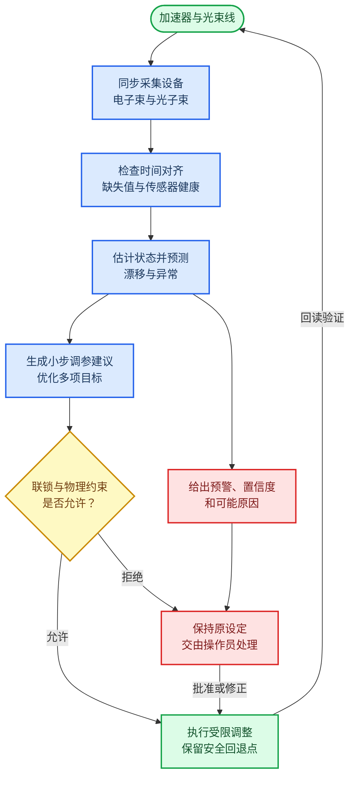

上线顺序应从低风险到高风险：先用历史运行和故障前数据做离线回放；再以影子模式只预警、不动机器；随后由 AI 给出带原因和置信度的调参建议，交给操作员确认；最后只对少量、已验证、变化率受限且可立即回退的变量开放自动闭环。机器保护联锁、束流损失保护和设备硬极限必须始终独立于 AI。

最后需要强调：若目标是高相干、高亮度的“可用光”，评价点应尽量放在样品面，而不仅是源端。相干性难以逐脉冲直接测量时，可用电子束发射度与能散、光子谱宽、波前、焦斑和指向稳定性作为在线代理量，再定期用真实相干测量校准，避免模型只把源端通量推高，却牺牲频谱、相干性、稳定性或样品安全。

## 资助信息

作者感谢以下资助：EPFL；台湾科技部 MOST 107-2119-M-001-047；MOST 106-0210-01-15-02；以及 MOST 107-2119-M-001-047。

## 参考文献

以下书目信息按原文保留；作者、年份、期刊/书名与卷页均完整列出。

- Allaria, E., Appio, R., Badano, L., Barletta, W. A., Bassanese, S., Biedron, S. G., Borga, A., Busetto, E., Castronovo, D., Cinquegrana, P., Cleva, S., Cocco, D., Cornacchia, M., Craievich, P., Cudin, I., D’Auria, G., Dal Forno, M., Danailov, M. B., De Monte, R., De Ninno, G., Delgiusto, P., Demidovich, A., Di Mitri, S., Diviacco, B., Fabris, A., Fabris, R., Fawley, W., Ferianis, M., Ferrari, E., Ferry, S., Froehlich, L., Furlan, P., Gaio, G., Gelmetti, F., Giannessi, L., Giannini, M., Gobessi, R., Ivanov, R., Karantzoulis, E., Lonza, M., Lutman, A., Mahieu, B., Milloch, M., Milton, S. V., Musardo, M., Nikolov, I., Noe, S., Parmigiani, F., Penco, G., Petronio, M., Pivetta, L., Predonzani, M., Rossi, F., Rumiz, L., Salom, A., Scafuri, C., Serpico, C., Sigalotti, P., Spampinati, S., Spezzani, C., Svandrlik, M., Svetina, C., Tazzari, S., Trovo, M., Umer, R., Vascotto, A., Veronese, M., Visintini, R., Zaccaria, M., Zangrando, D. & Zangrando, M. (2012). *Nature Photonics* **6**, 699.
- Amann, J., Berg, W., Blank, V., Decker, F. J., Ding, Y., Emma, P., Feng, Y., Frisch, J., Fritz, D., Hastings, J., Huang, Z., Krzywinski, J., Lindberg, R., Loos, H., Lutman, A., Nuhn, H. D., Ratner, D., Rzepiela, J., Shu, D., Shvyd’ko, Yu., Spampinati, S., Stoupin, S., Terentyev, S., Trakhtenberg, E., Walz, D., Welch, J., Wu, J., Zholents, A. & Zhu, D. (2012). *Nature Photonics* **6**, 693–698.
- Balzarotti, A., Bianconi, A., Burattini, E. & Strinati, G. (1974). *Solid State Communications* **15**, 1431–1434.
- Balzarotti, A., Piacentini, M. & Grandolfo, M. (1970). *Lettere al Nuovo Cimento* **3**, 15–18.
- Bathow, G., Freytag, E. & Haensel, R. (1966). *Journal of Applied Physics* **37**, 3449–3454.
- Bonifacio, R., De Salvo, L., Pierini, P., Piovella, N. & Pellegrini, C. (1994). *Physical Review Letters* **73**, 70–73.
- Bonifacio, R., Pellegrini, C. & Narducci, L. M. (1984). *Optics Communications* **50**, 373–378.
- Bordovitsyn, V. A. (1999). *Synchrotron Radiation Theory and its Development*. Springer.
- Brau, C. A. (1990). *Free-Electron Lasers*. Academic Press.
- Cauchois, Y., Bonnelle, C. & Missoni, G. (1963). *CR Acad. Sci. Paris* **257**, 409–412.
- Chin, A. L., Yang, S. M., Chen, H. H., Li, M. T., Lee, T. T., Chen, Y. J., Lee, T. K., Petibois, C., Cai, X., Low, C. M., Tan, F. C. K., Teo, A., Tok, E. S., Ong, E. B. L., Lin, Y. Y., Lin, I. J., Tseng, Y. C., Chen, N. Y., Shih, C. T., Lim, J. H., Lim, J., Je, J. H., Kohmura, Y., Ishikawa, T., Margaritondo, G., Chiang, A. S. & Hwu, Y. (2020). *Chinese Journal of Physics* **65**, 24–32.
- Codling, K. (1997). *Journal of Synchrotron Radiation* **4**, 316–333.
- Dattoli, G., Renieri, A. & Torre, A. (1995). *Lectures in Free-Electron Laser Theory and Related Topics*. World Scientific.
- Dirac, P. A. M. (1958). *Quantum Mechanics*. Oxford University Press.
- Elder, F. R., Gurewitsch, A. M., Langmuir, R. V. & Pollock, H. C. (1947). *Physical Review* **71**, 829–830.
- Emma, C., Lutman, A., Guetg, M. W., Krzywinski, J., Marinelli, A., Wu, J. & Pellegrini, C. (2017). *Applied Physics Letters* **110**, 154101.
- Emma, P., Akre, R., Arthur, J., Bionta, R., Bostedt, C., Bozek, J., Brachmann, A., Bucksbaum, P., Coffee, R., Decker, F. J., Ding, Y., Dowell, D., Edstrom, S., Feng, Y., Frisch, J., Gilevich, S., Hastings, J., Hays, G., Hering, Ph., Huang, Z., Iverson, R., Loos, H., Messerschmidt, M., Miahnahri, A., Moeller, S., Nuhn, H.-D., Pile, G., Ratner, D., Rzepiela, J., Schultz, D., Smith, T., Stefan, P., Tompkins, H., Turner, J., Welch, J., White, W., Wu, J., Yocky, G. & Galayda, J. (2010). *Nature Photonics* **4**, 641–647.
- Feldhaus, J., Saldin, E. L., Schneider, J. R., Schneidmiller, E. A. & Yurkov, M. V. (1997). *Optics Communications* **140**, 341–352.
- Haensel, R., Kunz, C. & Sonntag, B. (1966). *Physics Letters* **25A**, 205–206.
- Halbach, C. (1986). *Nuclear Instruments and Methods in Physics Research A* **246**, 77–81.
- Hartman, P. L. (1988). *Synchrotron Radiation News* **1**(4), 28–30.
- Hwu, Y., Hsieh, H. H., Lu, M. J., Tsai, W. L., Lin, H. M., Goh, W. C., Lai, B., Je, J. H., Kim, C. K., Noh, D. Y., Youn, H. S., Tromba, G. & Margaritondo, G. (1999). *Journal of Applied Physics* **86**, 4613–4618.
- Inoue, I., Osaka, T., Hara, T., Tanaka, T., Inagaki, T., Fukui, T., Goto, S., Inubushi, Y., Kimura, H., Kinjo, R., Ohashi, H., Togawa, K., Tono, K., Yamaga, M., Tanaka, H., Ishikawa, T. & Yabashi, M. (2019). *Nature Photonics* **13**, 319–322.
- Iwanenko, D. & Pomeranchuk, I. (1944). *Physical Review* **65**, 343.
- Ishikawa, T., Aoyagi, H., Asaka, T., Asano, Y., Azumi, N., Bizen, T., Ego, H., Fukami, K., Fukui, T., Furukawa, Y., Goto, S., Hanaki, H., Hara, T., Hasegawa, T., Hatsui, T., Higashiya, A., Hirono, T., Hosoda, N., Ishii, M., Inagaki, T., Inubushi, Y., Itoga, T., Joti, Y., Kago, M., Kameshima, T., Kimura, H., Kirihara, Y., Kiyomichi, A., Kobayashi, T., Kondo, C., Kudo, T., Maesaka, H., Maréchal, X. M., Masuda, T., Matsubara, S., Matsumoto, T., Matsushita, T., Matsui, S., Nagasono, M., Nariyama, N., Ohashi, H., Ohata, T., Ohshima, T., Ono, S., Otake, Y., Saji, C., Sakurai, T., Sato, T., Sawada, K., Seike, T., Shirasawa, K., Sugimoto, T., Suzuki, S., Takahashi, S., Takebe, H., Takeshita, K., Tamasaku, K., Tanaka, H., Tanaka, R., Tanaka, T., Togashi, T., Togawa, K., Tokuhisa, A., Tomizawa, H., Tono, K., Wu, S., Yabashi, M., Yamaga, M., Yamashita, A., Yanagida, K., Zhang, C., Shintake, T., Kitamura, H. & Kumagai, N. (2012). *Nature Photonics* **6**, 540–544.
- Kondratenko, A. M. & Saldin, E. L. (1980). *Particle Accelerators* **10**, 207–216.
- Kulipanov, G. N., Mezentsev, N. A. & Pindyurin, V. F. (2016). *Journal of Structural Chemistry* **57**, 1277–1287.
- Kulipanov, G. N. & Skrinsky, A. N. (1988). *Synchrotron Radiation News* **1**(3), 32–33.
- Lynch, D. W., Plummer, W., Himpsel, F., Chiang, T. C., Margaritondo, G. & Lapeyre, G. (2015). *Synchrotron Radiation News* **28**(4), 20–23.
- Madden, R. P. & Codling, K. (1963). *Physical Review Letters* **10**, 516–518.
- Madey, J. (1971). *Journal of Applied Physics* **42**, 1906–1913.
- Margaritondo, G. (1988). *Introduction to Synchrotron Radiation*. Oxford University Press.
- Margaritondo, G. (2002). *Elements of Synchrotron Light for Biology, Chemistry, and Medical Research*. Oxford University Press.
- Margaritondo, G. (2018). *Journal of Synchrotron Radiation* **25**, 1271–1276.
- Margaritondo, G., Hwu, Y. & Je, J. H. (2004). *Rivista del Nuovo Cimento* **27**, 1–40.
- Margaritondo, G., Hwu, Y. & Je, J.-H. (2008). *Sensors* **8**, 8378.
- Margaritondo, G. & Ribic, P. R. (2011). *Journal of Synchrotron Radiation* **18**, 101–108.
- Miyahara, T., Kitamura, H., Sato, S., Watanbe, M., Mitani, S., Ishiguro, E., Fukushima, T., Ishii, T., Yamaguchi, S., Endo, M., Iguchi, Y., Tsujikawa, H., Sugiura, T., Katayama, T., Yamakawa, T., Yamaguchi, S. & Sasaki, T. (1976). *Particle Accelerators* **7**, 163–175.
- Mobilio, S., Boscherini, F. & Meneghini, C. (2015). *Synchrotron Radiation Basics, Methods and Applications*. Springer.
- Munro, P. R. T. (2017). *Contemporary Physics* **58**, 140–159.
- Nolte, D. (2020). *Physics Today* **73**, 30–35.
- Pellegrini, C. (2012). *European Physical Journal H* **37**, 659–708.
- Perlman, M. L., Watson, R. E. & Rowe, E. M. (1974). *Physics Today* **27**, 30–37.
- Pollock, H. C. (1983). *American Journal of Physics* **51**, 278–280.
- Rafelski, J. (2017). *Relativity Matters*. Springer.
- Ribic, P. R. & Margaritondo, G. (2012a). *Physica Status Solidi B* **249**, 1210–1217.
- Ribic, P. R. & Margaritondo, G. (2012b). *Journal of Physics D* **45**, 213001.
- Sagawa, T., Iguchi, Y., Sasanuma, M., Nasu, T., Yamaguchi, S., Fujiwara, S., Nakamura, M., Ejiri, A., Masuoka, T., Sasaki, T. & Oshio, T. (1966). *Journal of the Physical Society of Japan* **21**, 2587–2598.
- Saldin, E. L., Schneidmiller, E. A., Shvyd’ko, Yu. V. & Yurkov, M. V. (2001). *Nuclear Instruments and Methods in Physics Research A* **475**, 357–362.
- Sasaki, T. (1997). *Journal of Synchrotron Radiation* **4**, 359–365.
- Sasaki, T. (2016). *Synchrotron Radiation News* **29**(2), 31–32.
- Savoia, A. (1988). *Synchrotron Radiation News* **1**(3), 10–13.
- Schwinger, J. (1946). *Physical Review* **70**, 798.
- Schwinger, J. (1949). *Physical Review* **75**, 1912–1925.
- Stampanoni, M., Menzel, A., Watts, B., Mader, K. S. & Bunk, O. (2014). *Chimia* **68**, 66–72.
- Steinmann, W. & Skibowski, M. (1966). *Physical Review Letters* **16**, 989–990.
- Stöhr, J. (2019). *Synchrotron Radiation News* **32**(4), 48–51.
- Togashi, T., Takahashi, E. J., Midorikawa, K., Aoyama, M., Yamakawa, K., Sato, T., Iwasaki, A., Owada, S., Okino, T., Yamanouchi, K., Kannari, F., Yagishita, A., Nakano, H., Couprie, M. E., Fukami, K., Hatsui, T., Hara, T., Kameshima, T., Kitamura, H., Kumagai, N., Matsubara, S., Nagasono, M., Ohashi, H., Ohshima, T., Otake, Y., Shintake, T., Tamasaku, K., Tanaka, H., Tanaka, T., Togawa, K., Tomizawa, H., Watanabe, T., Yabashi, M. & Ishikawa, T. (2011). *Optics Express* **19**, 317–324.
- Tomboulian, D. H. & Hartman, P. L. (1956). *Physical Review* **102**, 1423–1447.
- Weon, B. M., Je, J. H., Hwu, Y. & Margaritondo, G. (2006). *International Journal of Nanotechnology* **3**, 280–297.
- Willmott, P. (2011). *An Introduction to Synchrotron Radiation: Techniques and Applications*. Wiley.
- Winick, H. (1995). *Synchrotron Radiation Sources: A Primer*. World Scientific.
- Winick, H., Brown, G. K., Halbach, K. & Harris, J. (1981). *Physics Today* **34**, 50–63.
- Winick, H. & Doniach, S. (1980). *Synchrotron Radiation Research*. Plenum Press.
