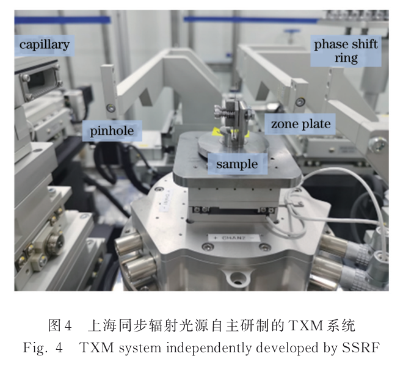
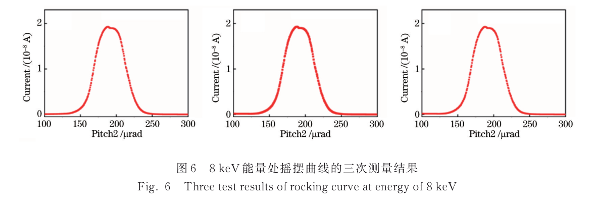
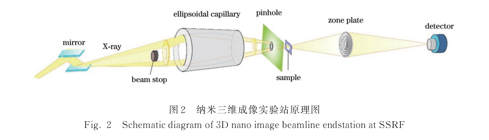

---
tags:
  - papers/X-ray-nano-imaging
  - facilities/SSRF
aliases:
  - "SSRF BL18B commissioning 2022"
  - "3D Nano Image Beamline at SSRF"
date: 2022
doi: 10.3788/AOS202242.2334001
---

# 上海同步辐射光源纳米三维成像线站设计、研发及调试

## 核心信息

- 标题: 上海同步辐射光源纳米三维成像线站设计、研发及调试
- 标题翻译: Design, Development and Commissioning of 3D Nano Image Beamline at Shanghai Synchrotron Radiation Facility
- 作者: 陶芬, 张玲, 苏博, 高若阳, 杜国浩, 邓彪, 谢红兰, 肖体乔
- 机构: 中国科学院上海高等研究院上海光源科学中心；中国科学院上海应用物理研究所；中国科学院大学
- 发表时间: 2022-12
- 发表渠道: 光学学报, 42(23), 2334001
- DOI: 10.3788/AOS202242.2334001
- 论文链接: [DOI](https://doi.org/10.3788/AOS202242.2334001)
- 论文类型: 同步辐射光束线 / 仪器系统方法论文

## 原文摘要翻译

全场透射 X 射线显微镜具有纳米尺度空间分辨、原位、无损三维成像等优点，已广泛用于多个研究领域。纳米三维成像线站是上海同步辐射光源二期工程的一部分，面向前沿科学问题和国家战略需求，主要实验方法为全场透射显微成像和纳米计算机断层扫描，能量范围为 5–14 千电子伏，空间分辨率设计目标为 20 纳米。该线站采用弯转磁铁光源，光束线由柱面准直镜、双晶单色器和超环面聚焦镜构成；实验站采用自主设计并整体集成的全场显微系统，其中单毛细管聚光器、机械系统以及纳米断层控制与数据采集软件均为自主研发。上海光源纳米三维成像线站 BL18B 于 2021 年完成调试和性能测试，实现了 20 纳米分辨率的透射显微成像。作者称，这是国际上首条基于弯转磁铁光源实现 20 纳米成像分辨率的此类线站。全部测试结果均达到线站设计目标，并计划于 2022 年向用户开放。

## 创新点

1. **在弯转磁铁光源上完成 20 纳米级专用全场成像线站。** 设计不是孤立优化物镜，而是把准直、单色、次级光源、单毛细管聚光和波带片接受角作为相空间链整体匹配。
2. **突破了若干关键子系统的自主研制。** 团队历时四年多解决单毛细管拉制成形、参数检测和成品率问题，并自主完成高稳定机械、精密运动控制以及纳米 CT 控制和采集软件。
3. **以高效率椭球单毛细管形成空心锥斜入射。** 该设计兼顾弯铁源下的样品通量、均匀照明和零级光抑制，使 25 纳米最外环宽波带片按 \(0.61\Delta r\) 关系支持约 20 纳米级二维成像。
4. **建立了四项可追溯的带光验收链。** Ti/Au 标准箔、单色器摇摆曲线、样品点电离室和西门子星功率谱分别验证能区、能量分辨率、通量和二维空间分辨率。

## 一句话总结

本文证明 BL18B 已从 2016 年的大视场二维原型推进到 5–14 千电子伏、19.6 纳米二维分辨率的专用线站，并完成四项核心工程验收；但它仍未给出完整 CT 数据、三维分辨率、扫描时间和剂量，不能把 19.6 纳米直接写成 nano-CT 三维分辨率。

## 研究问题

### 弯铁源上的 20 纳米挑战

弯转磁铁的亮度条件与许多采用插入件的国际纳米成像线站不同。若只更换更细外环的波带片，样品面通量、入射数值孔径、单色性和系统稳定性未必能同时满足。本文要回答的是：能否通过高效率反射聚光与光束线—实验站相空间匹配，让弯铁源仍然支持用户可用的 20 纳米级全场成像。

### 从“能成像”到“可验收线站”

专用用户线站不能只展示一张靶标图。论文把目标拆成四项：

1. 单色器能量能否覆盖 5–14 千电子伏。
2. 8 千电子伏时单色性是否优于 \(5\times10^{-4}\)。
3. 300 毫安条件下样品处通量是否达到 \(5\times10^9\) 光子/秒。
4. 8 千电子伏二维成像是否达到 20 纳米。

这使得“光源—光学—实验站—探测”的故障可以分层定位，也为后续用户开放提供比单一分辨率数字更完整的基础。

## 数据与任务定义

### 四类标准样品和测量协议

| 验收任务 | 测量对象与仪器 | 论文协议 | 输出 |
|---|---|---|---|
| 能量范围 | 高纯 Ti、Au 箔；前后电离室 | 扫描 Ti K 边与 Au L1 边 | 下限 4.966 千电子伏、上限 14.353 千电子伏附近是否可达 |
| 能量分辨率 | 双晶单色器二晶；电离室 | 8 千电子伏，调节二晶俯仰角，摇摆曲线重复三次 | 半峰全宽及 \(\Delta E/E\) |
| 样品处通量 | 样品点空气电离室 | 8 千电子伏、实测束流 200 毫安，再换算到 300 毫安 | 光子/秒 |
| 二维空间分辨率 | Carl Zeiss X30-30-2 星条靶 | 8 千电子伏、单幅曝光 60 秒，二维傅里叶功率谱分析 | 截止频率和对应半周期分辨率 |

### 本文任务的边界

论文题名和线站用途包含“纳米三维成像”，机械系统也含旋转与定心基础，但本文验收数据没有给出角度投影数、重建体或三维参考样品。因此，任务定义应写成“光束线参数与二维全场显微性能调试”，三维 nano-CT 是已建设的平台能力方向，不是本篇完成的独立三维性能验证。

## 方法主线

### 机制流程

1. **输入与单色化：** 弯铁白光先送入位于 20.2 米处的柱面准直镜，再由 23 米处的硅（111）双晶单色器选择 5–14 千电子伏单色光。
2. **次级光源形成：** 26 米处超环面镜把光束聚焦到 39 米处的次级光源和四刀狭缝，生成与实验站接受相空间相匹配的输入。
3. **样品照明与放大：** 椭球单毛细管把次级光源成像到样品点并生成空心锥；样品出射场送入 25 纳米最外环宽、125 微米直径的波带片，形成斜入射全场放大像。
4. **探测与输出：** 相移环可用于相衬，放大像由成像探测器采集；二维投影可直接用于显微成像，也为旋转采集和纳米 CT 重建提供输入。

*论文原图编号：Fig. 4。上海光源自主集成的全场透射 X 射线显微系统实物，是上述聚光、样品、物镜、探测与运动链已完成工程集成的直接证据。*

### 光束线相空间设计

光束线采用“准直镜—双晶单色器—超环面镜—次级光源”的布局。8 千电子伏时，作者用光线追迹估算弯铁源在 0.1% 带宽内通量为 \(5.7\times10^{12}\) 光子/秒，经过传输后次级光源约为 \(2.6\times10^{11}\) 光子/秒。模拟同时纳入镜面误差、第一晶热变形、反射率、铍窗吸收、空气衰减以及椭球镜数值孔径匹配，而不是只做理想几何追迹。

准直镜和单色器还做了热分析：水冷后计算最高温度分别约 30.3 摄氏度和 36.7 摄氏度，相关最大变形约 12.3 微米和 0.84 微米。它们说明设计者已把热载荷纳入光斑和通量预算，但论文没有进一步给出水冷状态下的长期实测漂移。

### 椭球聚光与斜入射波带片

单毛细管内壁是旋转椭球反射面，次级光源位于一焦点，样品位于另一焦点。掠入射全反射既提升样品点通量密度，又使出射数值孔径匹配波带片的环状照明。轴上光阑去除中心直透分量，形成空心锥，从而降低零级背景。

正入射的瑞利关系为

$$
\delta_{\mathrm{normal}}=1.22\Delta r ,
$$

空心锥斜入射则按论文采用

$$
\delta_{\mathrm{inclined}}=0.61\Delta r .
$$

对 \(\Delta r=25\) 纳米，后者给出约 15.3 纳米的理想几何值，为 20 纳米级系统指标留出一定误差预算；它不是本文实测分辨率。论文明确写明波带片由 Applied Nanotools 制备，所以“自主研发”应限定在单毛细管、机械和控制采集软件等文中点名的子系统。

> [!figure] Fig. 3 旋转椭球单毛细管聚光原理
> 建议位置：方法主线
> 放置原因：该图直接连接次级光源、椭球两焦点、空心锥和样品照明，是理解弯铁源下高效率聚光的关键。
> 当前状态：保留占位；人工复核发现候选顶部混入期刊页眉和前置正文，不能作为独立原图插入。

### 调试计算

由布拉格关系，能量分辨率近似为

$$
\frac{\Delta E}{E}\approx\Delta\theta\cot\theta ,
$$

其中 \(\Delta\theta\) 由入射垂直发散与晶体 Darwin 宽共同决定，实验上用摇摆曲线半峰全宽表征。样品点光通量按

$$
N=\frac{I_0\varepsilon_0}{eE\eta},\qquad
\eta=1-\exp(-\mu x)
$$

由电离室电流换算，其中空气平均电离能取 34.4 电子伏。二维分辨率则由图像二维傅里叶功率谱的径向积分得到；截止频率 \(f_c=25.5~\mu\text{m}^{-1}\) 时，半周期分辨率

$$
\delta_{\mathrm{PSD}}=\frac{1}{2f_c}=19.6~\text{nm}.
$$

## 关键结果

### 设计值、模拟值与实测值

| 指标 | 设计目标 | 模拟/测试条件 | 实测结果 | 解释 |
|---|---:|---|---:|---|
| 能量范围 | 5–14 千电子伏 | Ti K 边、Au L1 边标准箔 | 5–14 千电子伏可达 | 达标 |
| 能量分辨率（8 千电子伏） | \(5.0\times10^{-4}\) | 模拟 \(1.3\times10^{-4}\)；摇摆曲线三次 | \((1.83\pm0.01)\times10^{-4}\) | 优于设计，三次结果接近 |
| 样品处通量 | \(5\times10^9\) 光子/秒 | 8 千电子伏；200 毫安实测后换算到 300 毫安 | \(1.64\times10^{10}\) 光子/秒 | 约为设计值 3.28 倍，必须保留电流换算条件 |
| 二维空间分辨率 | 20 纳米 | 8 千电子伏；星条靶；60 秒曝光；功率谱 | 19.6 纳米 | 达标，但不是三维分辨率 |

*论文原图编号：Fig. 6。8 千电子伏下三次单色器摇摆曲线，三次半峰全宽为 46.92、46.92 和 46.35 微弧度，是能量分辨率重复性主张的直接证据。*

### 二维分辨率证据

星条靶最小标称结构为 30 纳米，论文称相邻明暗条纹能够清晰分辨。功率谱曲线在每微米 25.5 周期处截止，按半周期得到 19.6 纳米。该指标比“肉眼看见 30 纳米条纹”更接近频域验收，但论文没有给出不同视场位置、不同日期和不同能量下的重复 PSD，也没有给出三维频率壳相关。

> [!figure] Fig. 7 星条靶与功率谱分辨率结果
> 建议位置：关键结果
> 放置原因：这是 19.6 纳米二维分辨率主张的原始靶标与频域证据，应与设计值—实测值表联合阅读。
> 当前状态：保留占位；人工复核发现候选上半部混入期刊页眉、推导公式和大段正文，无法作为整洁独立图插入。

### 自主研制的准确边界

已明确自主研制的是单毛细管椭球聚光元件、全场显微机械系统、纳米 CT 控制及数据采集软件。论文同时明确 FZP 来自商业供应商；准直镜、单色器、探测器等也没有逐项给出国产化来源。因此，本文支持“关键子系统自主研制并完成整站集成”，不支持“所有光学、探测和机械部件百分之百国产”。

## 深度分析

### 为什么弯铁源路线能够成立

核心不在于弯铁源本身亮度突然等同插入件，而在于减少从源到样品的相空间和传输损失：柱面镜控制发散，超环面镜建立次级光源，高效率椭球单毛细管把其数值孔径匹配到波带片，空心锥同时抑制零级背景并利用斜入射提升频率收集。样品通量超过设计值约 3.28 倍，说明这条传输链至少在 8 千电子伏单点上形成了有效裕量。

*论文原图编号：Fig. 2。BL18B 实验站的单毛细管、光阑、样品台、波带片、相移环和探测器链路，适合用于检查整站能力由哪些子系统共同形成。*

### 相比 2016 原型完成了什么跃迁

[[2016_Full-field_X-ray_nano-imaging_system_SSRF|2016 年 BL13W1 原型]]以 BOE 整形器在 8–10 千电子伏实现 100 纳米 / 50 微米视场，重点是验证用户导向的二维显微系统。BL18B 则成为 5–14 千电子伏专用线站，聚光路线改为高效率椭球单毛细管，FZP 外环从 70 纳米缩小到 25 纳米，并加入专用机械和纳米 CT 控制采集软件。两篇合读可见，上海光源的技术主线是“原型光学验证→关键部件自主化→专用线站工程验收”，而三维科研性能仍需后续应用论文补齐。

### 工程验收不等于科研能力全验收

四项指标证明线站“出光正确、足够单色、样品通量充足、二维像能到 20 纳米级”。用户真正做 nano-CT 还要经过旋转轴对心、投影配准、漂移校正、环伪影控制、重建和三维分辨率评估。本文的证据止步于四项工程指标，后半链路尚未覆盖，因而不能从题名中的“纳米三维成像线站”倒推其三维分辨率同为 19.6 纳米。

### “国际首条”的证据强度

作者将 BL18B 定位为国际首条基于弯铁源实现 20 纳米成像分辨率的线站，并列举了同期国际和国内设施。本文的 19.6 纳米二维测试支持“达到 20 纳米”部分，但没有展示系统检索、统一能量/靶标/曝光协议或第三方复核。因此，在路线评估中可保留为“作者的优先权声明”，不宜扩写成所有性能维度均为世界第一。

## 局限

1. **二维—三维证据断层。** 没有完整角度序列、重建体、已知三维纳米结构或 FSC/3D-MTF，19.6 纳米只对应二维功率谱。
2. **时间和剂量未闭环。** 达到分辨率靶结果的单幅曝光为 60 秒；若直接扩展到数百角度，总时间和辐射损伤可能成为瓶颈。
3. **长期稳定性不足。** 能量分辨率只做三次短期重复，通量和分辨率主要在 8 千电子伏单点测试；没有全能区、完整用户班次或跨月稳定统计。
4. **通量含换算。** \(1.64\times10^{10}\) 光子/秒不是在 300 毫安直接读取，而是由 200 毫安测量线性换算，并依赖空气吸收和电离效率模型。
5. **真实样品和用户绩效缺失。** 本文以标准箔和靶标为主，未展示材料、生物或能源样品的三维结果，也没有用户机时可用率。
6. **自主化与优先权口径需收紧。** 商业 FZP 仍是核心物镜，“国际首条”也缺少统一协议下的外部比对。

## 我的笔记

### 可复用的线站验收矩阵

这篇论文适合作为“建设期验收”的基线模板：每个指标都应同时记录设计值、模拟值、直接实测值、测量对象、束流电流、狭缝、能量、重复次数和换算公式。后续若要升级为“用户 nano-CT 验收”，建议再增加六列：完整扫描时间、投影数、剂量、旋转漂移、三维分辨率、真实样品重复性。

### 下一步最关键的问题

1. 19.6 纳米二维模式下，以已知纳米孔结构或频率壳相关测得的各向同性三维分辨率是多少？
2. 在 5–14 千电子伏全能区和典型八小时用户班次内，束斑位置、能量、通量和放大倍率如何漂移？
3. 完整 180° CT 达到目标分辨率需要多少投影、曝光和剂量；低剂量或稀疏角重建能把时间缩短多少？
4. 商业波带片和探测器对升级到更高能量、更大视场及供应链自主可控形成何种约束？

## 引用

- 陶芬, 张玲, 苏博, 等. “上海同步辐射光源纳米三维成像线站设计、研发及调试.” *光学学报* 42(23), 2334001 (2022). [DOI](https://doi.org/10.3788/AOS202242.2334001)
- [[2016_Full-field_X-ray_nano-imaging_system_SSRF|Feng et al., Full-field X-ray nano-imaging system designed and constructed at SSRF (2016)]]
- 陶芬, 王玉丹, 任玉琦, 等. “X 射线纳米成像单毛细管椭球镜的设计与检测.” *光学学报* 37(10), 1034002 (2017).
- Ge, M. Y., Coburn, D. S., Nazaretski, E., et al. “One-minute nano-tomography using hard X-ray full-field transmission microscope.” *Applied Physics Letters* 113(8), 083109 (2018).
