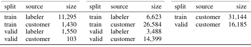
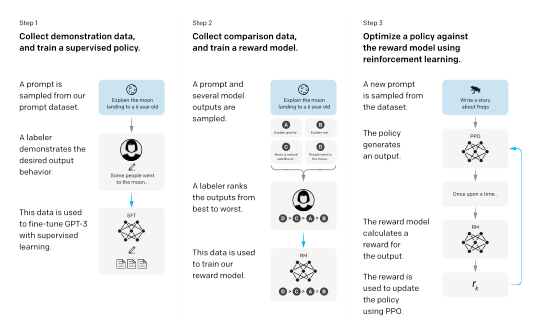
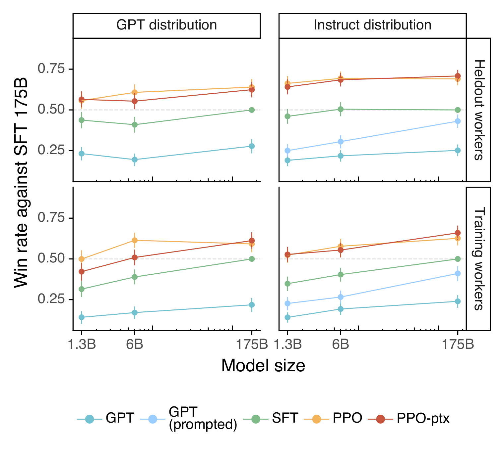

# InstructGPT：SFT 的技术源流与现代 LLM 对齐标准流程

## 核心信息

- 标题: Training language models to follow instructions with human feedback
- 标题翻译: 用人类反馈训练语言模型遵循指令
- 作者: Long Ouyang、Jeff Wu、Xu Jiang、Diogo Almeida 等 20 人
- 机构: OpenAI Alignment Team
- 发表时间: 2022-03-04
- 发表渠道: arXiv（cs.CL / cs.AI / cs.LG）
- DOI: [10.48550/arXiv.2203.02155](https://doi.org/10.48550/arXiv.2203.02155)
- arXiv: [2203.02155](https://arxiv.org/abs/2203.02155)
- 论文链接: [摘要页](https://arxiv.org/abs/2203.02155) · [PDF](https://arxiv.org/pdf/2203.02155)
- 代码 / 项目: 论文未提供完整训练代码；OpenAI 后来公开了模型卡与部分相关说明
- 数据 / 资源: SFT、RM 与 PPO 数据均未完整公开，来自标注者编写提示及早期 OpenAI API 用户提示
- 论文类型: AI 方法论文 / 大语言模型后训练与对齐

## 原文摘要翻译

仅仅把语言模型做得更大，并不会自然使其更善于遵循用户意图。例如，大语言模型可能生成不真实、有毒或对用户没有帮助的输出，也就是说，模型并未与用户对齐。本文展示了一条使语言模型在广泛任务上与用户意图对齐的途径：利用人类反馈进行微调。

作者从标注者编写的提示和通过 OpenAI API 提交的提示出发，收集标注者对理想模型行为的示范数据，并用监督学习微调 GPT-3。随后，作者收集模型输出的排序数据，并利用人类反馈强化学习进一步微调这个监督模型。由此得到的模型称为 InstructGPT。

在人类评估中，参数量仅为 1.3B 的 InstructGPT 输出优于 175B GPT-3，尽管前者参数少约两个数量级。InstructGPT 在真实性和减少有毒输出方面也有改善，同时在公开 NLP 数据集上的性能退化较小。模型仍会犯一些简单错误，但结果表明，利用人类反馈微调是使语言模型与人类意图对齐的一条有希望的路线。

## 创新点

1. 将真实 API 用户提示、人工高质量示范和偏好排序统一到一个面向通用语言任务的后训练方案中，而不再局限于摘要、情感控制等单任务。
2. 把整个训练方法明确拆成 **监督微调（SFT）→ 奖励模型（RM）→ PPO 强化学习** 三阶段，并使 “SFT” 成为现代 LLM 对齐流程的标准术语。
3. 引入 PPO-ptx：在 PPO 更新中混入预训练分布的似然梯度，以缓解对齐造成的公共 NLP 能力回退，即所谓 alignment tax。
4. 用真实用户分布上的人类偏好、真实性、幻觉、毒性、偏见与公共任务能力进行多维评价，并显式讨论“究竟与谁的偏好对齐”。

## 一句话总结

InstructGPT 不是监督微调算法的发明论文，但它把“人工示范上的监督微调”正式命名为 SFT，并将其固定为现代 LLM 的 SFT→RM→PPO 对齐标准流程的第一阶段。

## 研究问题

预训练语言模型优化的是互联网文本上的下一词预测：

\[
\max_\theta \sum_t \log p_\theta(x_t\mid x_{<t}),
\]

而用户真正期望的是模型有帮助、诚实且无害。二者不是同一个目标：更强的网页续写器未必更愿意服从指令，也未必在事实不确定时承认不知道。

论文试图回答三个相互关联的问题：

1. 能否用少量人工示范把通用 GPT-3 先变成一个可控的指令跟随模型？
2. 能否把人类难以写成规则的偏好转成奖励，再进一步优化模型行为？
3. 这种对齐是否会牺牲原有语言能力，若会，怎样控制代价？

这里的“对齐”并非抽象地对齐全体人类价值，而是对齐到研究者制定的规则、受雇标注者的示范与偏好，以及当时 API 用户提示的分布。

## 数据与任务定义

三阶段使用三套功能不同的数据，而不是把同一数据集重复训练三次：

| 阶段 | 数据内容 | 训练提示规模 | 标签作用 |
|---|---|---:|---|
| SFT | 提示 + 标注者撰写的理想回答 | 约 13k | 直接示范目标行为 |
| RM | 提示 + 4–9 个模型回答的人工排序 | 约 33k 个提示 | 学习人类更喜欢哪个回答 |
| PPO | 新的 API 提示 | 31,144 | 不需要人工回答，RM 提供奖励 |

SFT 训练集的精确组成是 11,295 个标注者编写提示与 1,430 个客户提示；验证集另含 1,550 个标注者提示和 1,429 个客户提示（PDF 表格抽取中末位数可能因排版断行，正文只给出约数）。RM 训练集包括 6,623 个标注者提示和 26,584 个客户提示。PPO 训练集全部来自客户，共 31,144 个提示。

*表 6：SFT、RM 与 PPO 数据规模。原图只包含表体，表头顺序从左到右分别对应 SFT、RM、PPO。*

任务覆盖生成、问答、对话、摘要、抽取等真实用户用法。提示绝大多数为英语；代码和非英语数据只占很小比例，因此论文对这些领域的泛化主要属于探索性结果。

## 方法主线

*图 2：InstructGPT 三阶段方法。第一阶段用人工示范训练 SFT，第二阶段由人工排序训练 RM，第三阶段用 RM 奖励通过 PPO 更新策略。*

### 1. Supervised Fine-Tuning（SFT）

给定提示 \(x\) 与标注者示范回答 \(y=(y_1,\ldots,y_T)\)，SFT 本质上仍是教师强制下的最大似然训练：

\[
\mathcal{L}_{\mathrm{SFT}}(\theta)
=-\sum_{t=1}^{T}\log p_\theta(y_t\mid x,y_{<t}).
\]

#### 1.1 从自回归语言模型推导 SFT 目标

预训练后的 GPT-3 已经定义了一个自回归条件分布。给定提示 $x$，回答序列的联合概率按照概率链式法则分解为

\[
p_\theta(y\mid x)
=\prod_{t=1}^{T}p_\theta(y_t\mid x,y_{<t}).
\]

记 $h_t=(x,y_{<t})$ 为生成第 $t$ 个回答词元时的完整上下文。人工示范数据集可以写成

\[
\mathcal D_{\mathrm{SFT}}
=\{(x^{(i)},y^{(i)})\}_{i=1}^{N}.
\]

最大似然估计希望模型给所有人工示范赋予尽可能高的概率：

\[
\theta_{\mathrm{SFT}}
=\arg\max_\theta
\frac{1}{N}\sum_{i=1}^{N}
\log p_\theta(y^{(i)}\mid x^{(i)}).
\]

代入自回归分解，并利用“乘积的对数等于对数之和”，得到

\[
\begin{aligned}
\theta_{\mathrm{SFT}}
&=\arg\max_\theta
\frac{1}{N}\sum_{i=1}^{N}\sum_{t=1}^{T_i}
\log p_\theta
\!\left(y_t^{(i)}\mid x^{(i)},y_{<t}^{(i)}\right),\\
\mathcal L_{\mathrm{SFT}}(\theta)
&=-\frac{1}{N}\sum_{i=1}^{N}\sum_{t=1}^{T_i}
\log p_\theta
\!\left(y_t^{(i)}\mid x^{(i)},y_{<t}^{(i)}\right).
\end{aligned}
\]

这就是序列上的负对数似然，也等价于逐词元交叉熵之和。训练第 $t$ 个位置时，模型看到的前缀是数据中的真实前缀 $y_{<t}^{(i)}$，而不是模型自己刚刚采样的前缀，这就是**教师强制**。

把提示 $x$ 视为给定条件时，标准做法是只对回答词元计算损失；提示词元负责提供上下文，不要求模型把提示本身再预测一遍。需要区分数学建模和论文披露：以上是条件似然的标准实现方式；原文没有展开训练代码中的损失掩码配置，所以不能据此推断具体屏蔽了哪些位置。

#### 1.2 单个词元的梯度究竟做了什么

设模型在某个位置输出词表的未归一化分数 $z_{t,k}$，经 softmax 得到概率

\[
p_\theta(k\mid h_t)
=\frac{\exp z_{t,k}}
{\sum_{v\in\mathcal V}\exp z_{t,v}}.
\]

该位置的真实目标词元为 $y_t$，损失为 $\ell_t=-\log p_\theta(y_t\mid h_t)$。对词表中任意词元 $k$ 的未归一化分数求导：

\[
\frac{\partial\ell_t}{\partial z_{t,k}}
=p_\theta(k\mid h_t)-\mathbf 1[k=y_t].
\]

因此梯度下降会产生两个直接效果：

- 对真实词元 $k=y_t$，导数为 $p(y_t\mid h_t)-1<0$，更新会提高它的未归一化分数；
- 对其他词元，导数为 $p(k\mid h_t)>0$，更新会相对压低它们的未归一化分数。

经过大量示范样本后，模型逐渐把“用户提出某类请求时，标注者通常怎样回答”编码进条件分布。SFT 并不是写入一套显式规则，而是在参数空间中重新分配各回答序列的概率质量。

#### 1.3 为什么称为“微调”而不是重新训练

优化不是从随机参数开始，而是从预训练参数 $\theta_0$ 出发：

\[
\theta_{\mathrm{SFT}}
=\theta_0+\Delta\theta_{\mathrm{demo}}.
\]

预训练已经提供语言知识、事实关联和广泛任务能力；约 13k 条高质量示范主要改变模型的默认行为模式，例如直接回答、遵循格式、承认不确定性以及采用助手式表达。由于数据远少于预训练语料，学习率、训练轮次和正则化必须控制参数漂移，否则容易过拟合示范集或损伤原有能力。

它没有引入新的优化原理；“监督”强调样本含有期望输出标签，“微调”强调从预训练 GPT-3 权重继续训练。论文使用 1.3B、6B、175B 三种模型，SFT 训练 16 轮，采用余弦学习率衰减和 0.2 残差丢弃率。

一个容易被忽略的细节是：SFT 模型在 1 个 epoch 后验证交叉熵已经过拟合，但继续训练仍能提高奖励模型分数和人类偏好。最终检查点按 RM 在验证集上的得分选择，而不是单纯按 SFT 验证损失选择。这说明“更像参考答案”与“人更喜欢最终生成行为”并非完全相同的目标。

SFT 在流程中有四重角色：

- 独立的监督学习基线；
- 奖励模型的初始化来源；
- PPO 策略的初始化来源；
- PPO 中限制策略漂移的 KL 参考策略 \(\pi_{\mathrm{SFT}}\)。

### 2. Reward Modeling（RM）

对同一提示的多个回答进行排序。若 \(y_w\) 胜过 \(y_l\)，奖励模型 \(r_\phi\) 通过 Bradley–Terry 式目标学习：

\[
\mathcal{L}_{\mathrm{RM}}(\phi)
=-\mathbb{E}\left[\log\sigma\big(r_\phi(x,y_w)-r_\phi(x,y_l)\big)\right].
\]

#### 2.1 为什么需要单独训练奖励模型

SFT 要求标注者为每个提示写出完整的理想回答，成本高，而且一个提示往往存在许多同样合理的答案。相比之下，人通常更容易判断“回答甲和回答乙哪个更好”。RM 的任务就是从这些比较中学习一个潜在效用函数

\[
r_\phi(x,y)\in\mathbb R,
\]

使分数越高的回答越符合标注者偏好。这个分数不是客观真理，而是对特定标注协议和标注者群体偏好的统计近似。

#### 2.2 从 Bradley–Terry 假设推导成对偏好损失

假设回答 $y$ 的潜在效用是 $r_\phi(x,y)$。Bradley–Terry 模型把回答 $y_w$ 胜过 $y_l$ 的概率定义为

\[
\begin{aligned}
P_\phi(y_w\succ y_l\mid x)
&=\frac{\exp r_\phi(x,y_w)}
{\exp r_\phi(x,y_w)+\exp r_\phi(x,y_l)}\\
&=\frac{1}
{1+\exp[-(r_\phi(x,y_w)-r_\phi(x,y_l))]}\\
&=\sigma\!\left(r_\phi(x,y_w)-r_\phi(x,y_l)\right).
\end{aligned}
\]

训练数据已经告诉我们 $y_w$ 是胜者，所以对观测到的偏好做最大似然估计：

\[
\phi^*
=\arg\max_\phi
\mathbb E_{(x,y_w,y_l)\sim\mathcal D_{\mathrm{RM}}}
\log P_\phi(y_w\succ y_l\mid x).
\]

取负号变为最小化问题，就得到论文中的 RM 损失：

\[
\mathcal L_{\mathrm{RM}}(\phi)
=-\mathbb E
\log\sigma(\Delta r_\phi),
\qquad
\Delta r_\phi
=r_\phi(x,y_w)-r_\phi(x,y_l).
\]

若对同一提示采样 $K$ 个回答并得到完整排序，就能构造最多 $\binom K2$ 个胜负对。论文把同一提示产生的所有成对损失放入同一批次，并用 $\binom K2$ 归一化，避免拥有更多比较对的提示获得不成比例的权重。

#### 2.3 梯度为什么会拉开胜者和败者的分数

对单个偏好对，令 $\ell=-\log\sigma(\Delta r)$，则

\[
\frac{\partial\ell}{\partial\Delta r}
=\sigma(\Delta r)-1.
\]

进一步得到

\[
\frac{\partial\ell}{\partial r_w}
=\sigma(\Delta r)-1<0,
\qquad
\frac{\partial\ell}{\partial r_l}
=1-\sigma(\Delta r)>0.
\]

梯度下降因而提高胜者分数、降低败者分数。当模型已经确信胜者明显更好时，奖励差远大于零，逻辑函数趋近于 1，梯度自然趋近于零。

损失只依赖分数差 $r_w-r_l$，所以给同一提示下所有回答同时加上常数不会改变偏好概率；RM 学到的是相对排序尺度，而不是具有天然物理单位的绝对奖励。其输出一旦交给 PPO，就成为可被策略优化的代理目标，因此 RM 的偏差也可能被策略放大，形成奖励投机。

RM 把难以写成显式规则的“回答质量”压缩成一个标量。论文统一使用 6B RM，因为 175B RM 训练不稳定且作为价值函数成本过高。

### 3. PPO 与 PPO-ptx

PPO 策略最大化 RM 奖励，同时以 SFT 策略作 KL 锚点：

\[
R(x,y)=r_\phi(x,y)-\beta\log\frac{\pi_{\mathrm{RL}}(y\mid x)}{\pi_{\mathrm{SFT}}(y\mid x)}.
\]

#### 3.1 从无约束奖励最大化开始

有了固定的 RM 后，最直接的想法是训练策略 $\pi_\theta$，使其生成回答的期望奖励最大：

\[
J_{\mathrm{reward}}(\theta)
=\mathbb E_{x\sim\mathcal D_{\mathrm{PPO}}}
\mathbb E_{y\sim\pi_\theta(\cdot\mid x)}
[r_\phi(x,y)].
\]

问题在于 RM 只是有限偏好数据上学到的近似函数。若无限制地最大化它，策略可能找到 RM 的漏洞，生成高分但对人并不好的回答；策略也可能远离 SFT 已经建立的流畅、可控分布。

#### 3.2 从约束优化推导 KL 惩罚

更稳妥的目标是：在提高奖励的同时，要求新策略不要离固定的 SFT 策略太远。可以写成约束优化：

\[
\begin{aligned}
\max_\theta\quad
&\mathbb E_{x,y\sim\pi_\theta}[r_\phi(x,y)]\\
\text{s.t.}\quad
&\mathbb E_{x}\left[D_{\mathrm{KL}}
\!\left(\pi_\theta(\cdot\mid x)
\,\|\,\pi_{\mathrm{SFT}}(\cdot\mid x)\right)\right]
\le\varepsilon.
\end{aligned}
\]

用拉格朗日乘子 $\beta>0$ 把约束移入目标：

\[
J_{\mathrm{KL}}(\theta)
=\mathbb E[r_\phi(x,y)]
-\beta\,
\mathbb E_xD_{\mathrm{KL}}
\!\left(\pi_\theta\|\pi_{\mathrm{SFT}}\right).
\]

根据 KL 散度的定义，

\[
D_{\mathrm{KL}}(\pi_\theta\|\pi_{\mathrm{SFT}})
=\mathbb E_{y\sim\pi_\theta}
\left[
\log\frac{\pi_\theta(y\mid x)}
{\pi_{\mathrm{SFT}}(y\mid x)}
\right].
\]

于是约束目标可以写成对采样回答的期望：

\[
J_{\mathrm{KL}}(\theta)
=\mathbb E_{x,,y\sim\pi_\theta}
\left[
r_\phi(x,y)
-\beta\log
\frac{\pi_\theta(y\mid x)}
{\pi_{\mathrm{SFT}}(y\mid x)}
\right].
\]

方括号中的量正是前面写出的 KL 修正奖励。$\beta$ 越大，策略越保守；$\beta$ 越小，策略越敢于偏离 SFT 去追求 RM 高分。论文实现中取 $\beta=0.02$。

由于语言模型是自回归的，整段回答的对数概率比还能逐词元分解：

\[
\log\frac{\pi_\theta(y\mid x)}
{\pi_{\mathrm{SFT}}(y\mid x)}
=\sum_{t=1}^{T}
\log\frac{
\pi_\theta(y_t\mid x,y_{<t})}
{\pi_{\mathrm{SFT}}(y_t\mid x,y_{<t})}.
\]

所以工程上可以在每个生成词元处计算相对 SFT 的对数概率惩罚，再与回答末尾的 RM 分数合成整条轨迹的回报。

#### 3.3 从期望奖励得到策略梯度

对离散回答无法直接对采样操作求导，因此使用对数导数技巧：

\[
\nabla_\theta\pi_\theta(y\mid x)
=\pi_\theta(y\mid x)
\nabla_\theta\log\pi_\theta(y\mid x).
\]

若把 KL 修正后的轨迹回报记为 $R(x,y)$，基础 REINFORCE 梯度可写成

\[
\nabla_\theta J(\theta)
=\mathbb E_{x,y\sim\pi_\theta}
\left[
R(x,y)\,
\nabla_\theta\log\pi_\theta(y\mid x)
\right].
\]

这里的 KL 修正回报含有 $\log\pi_\theta$，看似还应对回报本身求导。把离散回答展开求和可得

\[
\begin{aligned}
\nabla_\theta J
={}&\sum_y\nabla_\theta\pi_\theta(y\mid x)
\left[r_\phi(x,y)-\beta\log
\frac{\pi_\theta(y\mid x)}{\pi_{\mathrm{SFT}}(y\mid x)}\right]\\
&-\beta\sum_y\pi_\theta(y\mid x)
\nabla_\theta\log\pi_\theta(y\mid x).
\end{aligned}
\]

第二行之所以为零，是因为概率总和恒为 1：

\[
-\beta\nabla_\theta\sum_y\pi_\theta(y\mid x)
=-\beta\nabla_\theta 1=0.
\]

因此最终仍得到“KL 修正回报乘以对数概率梯度”的形式。

减去一个不依赖当前采样动作的基线 $V_\psi(h_t)$ 不会改变梯度期望，却能降低方差。于是每个词元使用优势估计

\[
A_t=G_t-V_\psi(h_t),
\]

其中 $G_t$ 是从位置 $t$ 到回答结束的 KL 修正回报。InstructGPT 使用一个价值函数估计该基线，并从 RM 权重初始化价值函数。

#### 3.4 为什么还需要 PPO

上式要求样本来自当前策略，但一次梯度更新后，收集数据的策略已经变成旧策略 $\pi_{\theta_{\mathrm{old}}}$。通过重要性采样比率

\[
\rho_t(\theta)
=\frac{\pi_\theta(y_t\mid h_t)}
{\pi_{\theta_{\mathrm{old}}}(y_t\mid h_t)},
\]

可以用旧策略采到的数据近似评估新策略更新。未加限制的代理目标为 $\mathbb E[\rho_tA_t]$，但若 $\rho_t$ 偏离 1 太多，估计会不稳定，并可能让一次更新把策略推得过远。PPO 使用裁剪目标：

\[
L_{\mathrm{PPO}}^{\mathrm{clip}}(\theta)
=\mathbb E_t\left[
\min\!\left(
\rho_t(\theta)A_t,
\operatorname{clip}
(\rho_t(\theta),1-\epsilon,1+\epsilon)A_t
\right)
\right].
\]

当优势为正时，PPO 不允许通过把该词元概率提高得过多来继续获得代理收益；当优势为负时，也限制概率下降过猛。论文使用的裁剪比例为 $\epsilon=0.2$。

这里有两个容易混淆但作用不同的“参考策略”：

- **固定的 $\pi_{\mathrm{SFT}}$**：出现在 KL 奖励中，约束整个 RL 训练过程不要偏离人工示范形成的行为分布；
- **周期更新的 $\pi_{\theta_{\mathrm{old}}}$**：用于采样、计算重要性比率和 PPO 裁剪，只约束当前这一轮更新不要跨得太远。

前者是长期行为锚点，后者是局部数值稳定器。PPO 裁剪不能替代 SFT-KL，SFT-KL 也不能替代 PPO 的小步更新控制。

#### 3.5 从 PPO 推导 PPO-ptx

即使策略没有明显远离 SFT，它仍可能在 RL 提示分布上发生灾难性遗忘，导致 SQuAD、DROP、HellaSwag、翻译等原有能力下降。作者因此在 RL 目标外重新加入预训练语言模型目标：

\[
\begin{aligned}
J_{\mathrm{PPO\text{-}ptx}}(\theta)
=&\;
\mathbb E_{x,,y\sim\pi_\theta}
\left[
r_\phi(x,y)
-\beta\log
\frac{\pi_\theta(y\mid x)}
{\pi_{\mathrm{SFT}}(y\mid x)}
\right]\\
&+\gamma\,
\mathbb E_{z\sim\mathcal D_{\mathrm{pretrain}}}
[\log\pi_\theta(z)].
\end{aligned}
\]

其梯度是两类梯度的加权和：

\[
\nabla_\theta J_{\mathrm{PPO\text{-}ptx}}
=\nabla_\theta J_{\mathrm{RLHF}}
+\gamma\,
\nabla_\theta
\mathbb E_{z\sim\mathcal D_{\mathrm{pretrain}}}
[\log\pi_\theta(z)].
\]

第一项把模型推向更受人偏好的回答，第二项继续提醒模型保持对原始文本分布的建模能力。

预训练项与 KL 项并不等价：KL 只要求模型接近某个固定 SFT 输出分布；预训练项则在真实预训练样本上直接恢复下一词元预测梯度。论文每个 RL 小批次配合约 8 倍数量的预训练样本，并用 $\gamma=27.8$ 调节预训练梯度强度。若该系数为零，就退化为不含预训练混合的 PPO。

KL 项防止策略为了钻奖励模型漏洞而偏离 SFT 行为太远；PPO 裁剪限制单轮更新幅度；预训练混合项则对抗能力遗忘。三者分别处理**目标偏移、优化不稳定和能力回退**，不能简单视为同一种正则化。

### 机制流程

1. 人工示范给出“应该怎样回答”；最大似然 SFT 把这些示范序列的条件概率提高，得到初始策略 $\pi_{\mathrm{SFT}}$。
2. 标注者比较同一提示的多个回答；Bradley–Terry 最大似然把成对排序变成标量奖励函数 $r_\phi(x,y)$。
3. PPO 用 RM 分数构造策略梯度，以固定 SFT 策略作 KL 锚点，并以旧策略的重要性比率和裁剪机制控制单轮更新幅度。
4. PPO-ptx 把 RLHF 梯度与预训练下一词元预测梯度相加，在保持偏好收益的同时减少原有能力退化。

## 关键结果

### 人类偏好

- 175B InstructGPT 相对 175B GPT-3 的直接偏好胜率为 **85 ± 3%**。
- 相对加了 few-shot 指令前缀的 175B GPT-3，胜率仍为 **71 ± 4%**。
- 1.3B InstructGPT 也能胜过 175B GPT-3，说明在真实提示分布上，后训练带来的行为适配收益可以超过 100 倍参数差距。
- SFT 本身已经明显改善 GPT-3，但 PPO/PPO-ptx 通常进一步提高偏好胜率。

*图 3：不同模型在 GPT 与 Instruct 提示分布上的胜率，基线为 175B SFT；误差线为 95% 置信区间。*

### 真实性、幻觉、毒性与偏见

- TruthfulQA 上，InstructGPT 生成既真实又有信息量的回答的比例总体高于 GPT-3；但 1.3B PPO-ptx 是例外，略逊于同规模 GPT-3。
- 在摘要、闭域问答等不应引入外部事实的任务中，幻觉率从 GPT-3 的约 **41%** 降到 InstructGPT 的约 **21%**。
- 在明确要求礼貌的提示下，有毒输出约减少 **25%**。
- Winogender 和 CrowS-Pairs 上没有显著偏见改善，因此“更少有毒”不能等同于“更少偏见”。

### 能力回退与成本

纯 PPO 会降低多个公开 NLP 基准的表现；混入预训练梯度的 PPO-ptx 能显著缓解这些回退，同时基本保留人类偏好收益。

作者按千万亿次浮点运算天（PF-days）报告计算量：175B SFT 约为 **4.9**，175B PPO-ptx 约为 60，而 GPT-3 预训练约为 3,640。这个比较说明后训练计算量相对预训练较小，但未计入全部标注、实验失败和研发组织成本。

## 深度分析

### SFT 最早是怎么提出来的？

严格答案是：**没有一篇论文“发明”了 Supervised Fine-Tuning。** 它是迁移学习中的描述性名称，指预训练后在有标签数据上继续做监督学习。若不限定大语言模型，追问“最早提出论文”会落入错误前提，因为监督学习、参数迁移和微调分别有更早且分散的技术谱系。

对现代 LLM 语境，更合理的谱系是：

| 时间 | 文献 | 在谱系中的位置 |
|---|---|---|
| 2018 | [ULMFiT](https://arxiv.org/abs/1801.06146)；[BERT](https://arxiv.org/abs/1810.04805) | 确立“预训练语言模型 → 下游有标签任务微调”的通用范式，但不是今天的通用助手 SFT |
| 2019 | [Fine-Tuning Language Models from Human Preferences](https://arxiv.org/abs/1909.08593) | 在语言模型论文中已明确写出 “supervised fine-tuning baselines”，并实验“监督微调后再做人类偏好 RL”；这是 InstructGPT 的直接先驱 |
| 2020 | [Learning to summarize from human feedback](https://arxiv.org/abs/2009.01325) | 从监督摘要模型初始化策略与 RM，并用 \(\pi_{\mathrm{SFT}}\) 作 KL 参考，技术结构进一步接近 InstructGPT |
| 2021 | [FLAN](https://arxiv.org/abs/2109.01652) 与 T0 | 把多任务、自然语言指令上的监督训练明确命名为 instruction tuning，强调对未见任务的零样本泛化 |
| 2022 | [InstructGPT](https://arxiv.org/abs/2203.02155) | 首次以图示和术语把通用助手流程清晰固定为 **SFT → RM → PPO**，使 SFT 缩写成为 LLM 后训练标准话语 |

因此，若问题是“现代 LLM 中 SFT 的规范性提出文献是哪篇”，应引用 **Ouyang 等，2022（InstructGPT）**。

若问题是“语言模型与人类偏好强化学习结合的更早直接先驱”，应同时引用 **Ziegler 等，2019** 和 **Stiennon 等，2020**。把 InstructGPT 写成“监督微调算法的首次提出”是不准确的。

### SFT 与 instruction tuning 是否相同？

二者高度重叠但侧重点不同：

- **SFT** 强调训练机制：预训练模型在有标签输入—输出对上继续监督训练。
- **Instruction tuning** 强调数据和目标：样本被组织为自然语言指令及其响应，追求指令跟随和跨任务泛化。

现代聊天模型的 instruction tuning 通常通过 SFT 实现，因此工程语境常把二者近似等同；但一个分类器在标签数据上的微调属于 SFT，却未必是 instruction tuning。

### 论文真正证明了什么？

论文强有力地证明：在作者收集的真实 API 提示分布、给定标注规范与模型族中，SFT 打底并叠加偏好优化能显著改善可用性，而且后训练收益可超过单纯扩大参数量。

它没有证明：SFT 必然是所有后训练算法不可省略的阶段；PPO 是最优偏好优化方法；40 名左右标注者的偏好等于全体人类价值；英语分布上的结果能无条件推广到其他语言和文化。

## 局限

1. **提出史边界**：论文没有声称发明监督微调；把它当作 SFT 的绝对起点是后来的二手叙述造成的简化。
2. **缺少完整阶段消融**：最终 InstructGPT 是 PPO-ptx，许多结论反映 SFT、RM、PPO 和预训练混合的联合效果，不能全部归因于 SFT。
3. **对齐对象有限**：标注者主要来自美国和东南亚、以英语为主，标注规范由 OpenAI 研究者制定；标注者之间的一致率约 73%，偏好并非客观真值。
4. **分布限制**：训练和主评估都来自早期 API 用户，存在产品用户自选择与时间切片偏差。
5. **安全改进不完整**：偏见指标未显著改善，模型仍可能执行潜在有害指令、接受错误前提或编造事实。
6. **复现性有限**：GPT-3 权重、真实用户提示、完整标注数据和训练基础设施均未公开，外部团队无法严格复现。
7. **评价耦合**：SFT 检查点按 RM 分数选择，使监督阶段的模型选择已经依赖后续偏好模型，阶段效果并非完全独立。

## 我的笔记

### 对研究与工程最可复用的结论

- 先把 SFT 当作“行为初始化”而不是“再训练一次语言模型”。高质量示范决定模型默认语气、格式、拒答边界和任务先验。
- 不要只按词元级验证损失挑 SFT 检查点。本文出现“交叉熵过拟合但人类偏好继续上升”，说明至少需要一个序列级或任务级选择指标。
- 若 SFT 后继续做偏好优化，必须监控原能力回退，并明确 KL 参考模型、预训练混合比例与通用基准。
- 报告最终模型时应分别列出 SFT、偏好数据和 RL/直接偏好优化的增量收益，否则很容易把联合流程的效果错误归给单一阶段。

### 建议的复现实验

在一个可公开模型上固定提示集合和人工预算，比较四组：基础模型、SFT、SFT+DPO、SFT+PPO。

所有组使用同一人类评价协议，同时测指令胜率、事实性、拒答、分布外泛化与预训练能力回退。关键消融包括示范质量、示范数量、仅响应词元计算损失与全序列损失、SFT 训练轮次、KL 系数及是否混入预训练数据。

### 仍值得追问

- 为什么人类偏好最优点晚于 SFT 验证损失最优点？这是序列概率校准、长度偏好，还是 RM 本身偏差造成的？
- 在高质量合成示范占主导的今天，SFT 学到的是人类意图还是教师模型风格？
- 如果直接从 base 模型做 DPO/RL，SFT 的必要性会随模型规模和任务可验证性怎样变化？
- 多文化标注者对“helpful、honest、harmless”的冲突排序如何进入训练目标？

## 引用

### 主论文

Ouyang, L., Wu, J., Jiang, X., et al. (2022). *Training language models to follow instructions with human feedback*. arXiv:2203.02155. https://arxiv.org/abs/2203.02155

### 技术源流文献

- Howard, J., & Ruder, S. (2018). *Universal Language Model Fine-tuning for Text Classification*. https://arxiv.org/abs/1801.06146
- Devlin, J., Chang, M.-W., Lee, K., & Toutanova, K. (2018). *BERT: Pre-training of Deep Bidirectional Transformers for Language Understanding*. https://arxiv.org/abs/1810.04805
- Ziegler, D. M., Stiennon, N., Wu, J., et al. (2019). *Fine-Tuning Language Models from Human Preferences*. https://arxiv.org/abs/1909.08593
- Stiennon, N., Ouyang, L., Wu, J., et al. (2020). *Learning to summarize from human feedback*. https://arxiv.org/abs/2009.01325
- Wei, J., Bosma, M., Zhao, V. Y., et al. (2021). *Finetuned Language Models Are Zero-Shot Learners*. https://arxiv.org/abs/2109.01652
