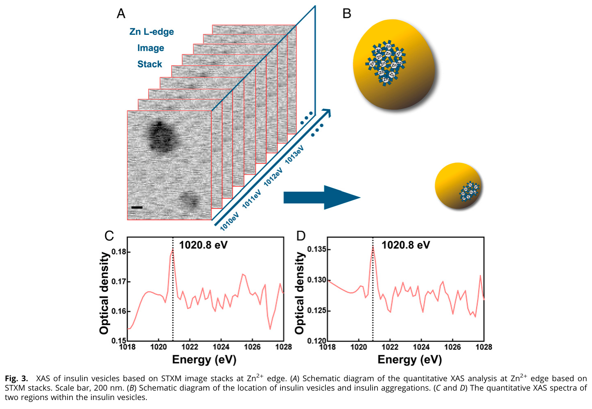
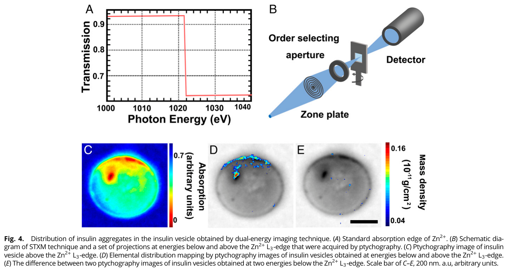
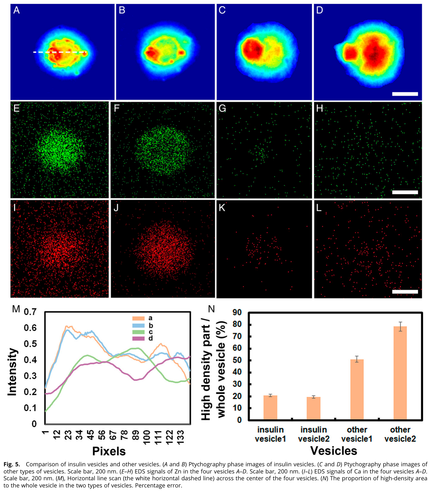
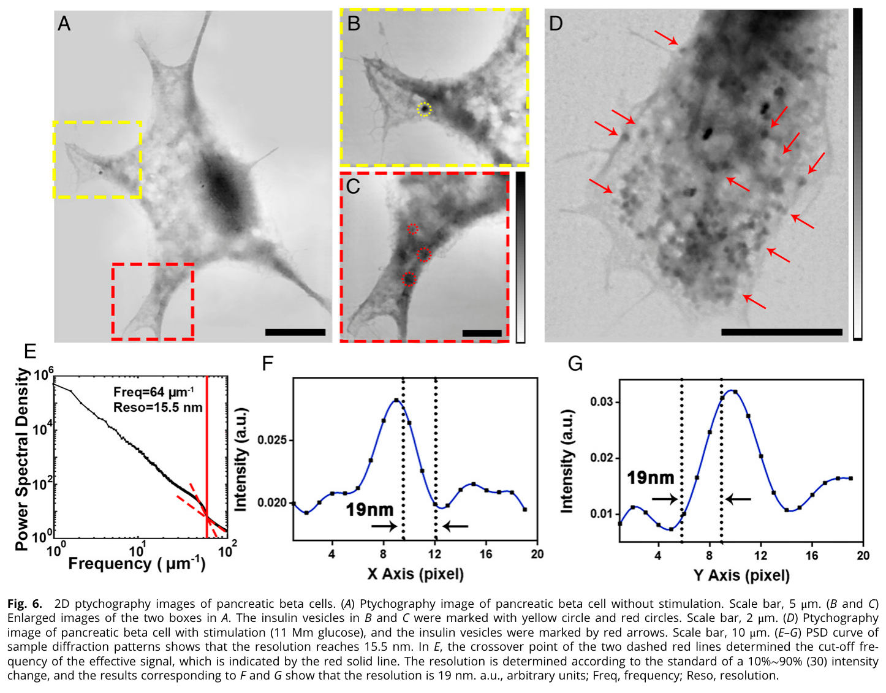
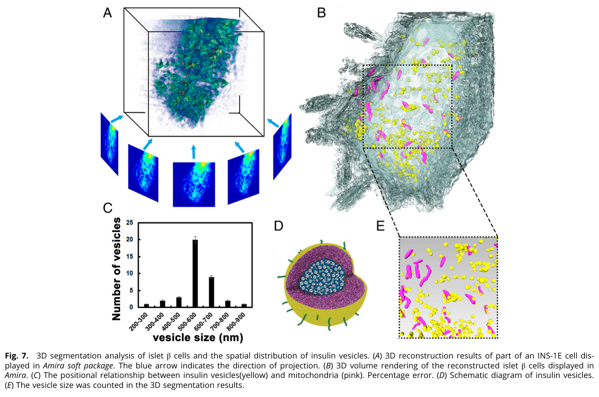
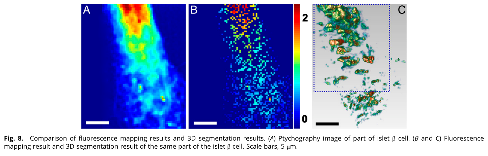
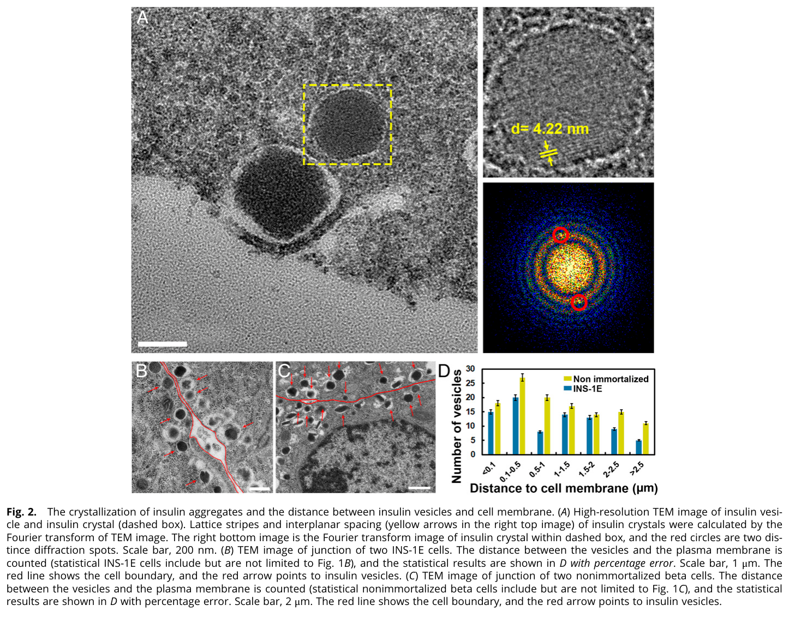

---
tags:
  - papers/上海光源纳米CT
  - papers/软X射线相干衍射
  - papers/纳米生物成像
aliases:
  - "Insulin-vesicle PXCT"
  - "BL08U1A soft-X-ray PXCT"
date: 2022-08-03
doi: 10.1073/pnas.2202695119
---

# Quantitative, in situ visualization of intracellular insulin vesicles in pancreatic beta cells

## 核心信息

- 标题: Quantitative, in situ visualization of intracellular insulin vesicles in pancreatic beta cells
- 标题翻译: 胰腺β细胞内胰岛素囊泡的定量原位可视化
- 作者: Amin Guo, Jianhua Zhang, Bo He, Angdi Li, Tianxiao Sun, Weimin Li, Jian Wang, Renzhong Tai, Yan Liu, Zhen Qian, Jiadong Fan, Andrej Sali, Raymond C. Stevens, Huaidong Jiang
- 机构: 上海科技大学、加拿大光源、亥姆霍兹柏林材料与能源中心、上海同步辐射光源、加州大学旧金山分校、南加州大学
- 发表时间: 2022-08-03
- 发表渠道: Proceedings of the National Academy of Sciences, 119(32), e2202695119
- DOI: 10.1073/pnas.2202695119
- 论文链接: https://pmc.ncbi.nlm.nih.gov/articles/PMC9371705/
- 数据 / 资源: https://data.mendeley.com/datasets/wzp4s6m2r6/1
- 论文类型: 多模态实验生物成像与软X射线有限角PXCT应用

## 原文摘要翻译

表征锌离子、胰岛素和胰岛素囊泡之间的关系，对研究胰腺β细胞至关重要。然而，锌离子的精确含量以及胰岛素在胰岛素囊泡内的具体位置仍不清楚，这妨碍了对胰岛素分泌过程和血糖失调相关疾病的深入理解。本文使用X射线扫描相干衍射成像技术，即叠层相干衍射成像，证明锌离子与胰岛素在单个细胞外胰岛素囊泡和胰腺β细胞内共定位。作者还利用电子显微镜和能量色散谱成像分析了胰岛素囊泡中的锌、钙元素含量。结果表明，锌离子的存在是区分胰岛素囊泡与胰腺β细胞内其他囊泡的重要特征，并且锌含量与胰岛素囊泡尺寸成正比。利用双能衬度X射线显微术和扫描透射X射线显微图像堆栈，作者观察到胰岛素聚集在细胞外胰岛素囊泡内偏离中心的位置。此外，通过结合X射线叠层相干衍射成像与等倾斜断层算法，三维展示了胰岛素囊泡在胰腺β细胞内的空间分布及其与其他细胞器的共定位。该研究提出了一种明确描述细胞内胰岛素位置并进行定量分析的方法，对糖尿病及其他血糖疾病研究具有重要意义。

## 创新点

1. **把元素、形貌和三维空间关系连成一条多模态证据链。** 电子显微能谱负责锌、钙含量，扫描透射X射线谱栈负责锌吸收边确认，谱学叠层成像负责低含量锌的高衬度定位，有限角PXCT负责细胞内囊泡三维分布。
2. **用相位衬度绕开低锌含量的吸收灵敏度瓶颈。** 囊泡内锌约占 `1%`，常规吸收双能成像难以稳定检测；作者先用叠层相干衍射重建高信噪比相位，再经Kramers–Kronig变换得到吸收图，最后在锌 `L3` 边上下作差。
3. **在上海光源完成明确的软X射线PXCT实证。** `BL08U1A` 以 `700 eV` 对细胞边缘小区域采集 `22` 个相位投影，并以等倾斜断层算法重建；这是上海光源软X射线三维叠层断层的直接论文证据。
4. **主动报告二维和三维分辨率的差异。** 二维叠层成像线剖面约 `19 nm`，三维重建为横向 `22.8 nm`、轴向 `64.6 nm`；作者把轴向退化归因于投影角度过少，而没有把二维数字直接等同于三维能力。

## 一句话总结

这篇论文用多设施、多模态数据证明锌可辅助识别胰岛素囊泡，并在上海光源 `BL08U1A` 以 `22` 个有限角相位投影完成约 `1.48×6.2×0.9 µm³` 小区域的软X射线PXCT；它证明了应用级三维叠层断层可行性，但不等于整细胞、大视场、全角度或 `19 nm` 各向同性三维成像。

## 研究问题

### 生物学问题

胰岛素在β细胞内合成、结晶、储存并通过囊泡运输和分泌。锌离子参与六聚体胰岛素晶体形成，钙离子参与触发胞吐，但单靠囊泡形貌或密度难以可靠区分成熟胰岛素囊泡与其他囊泡。研究需要回答三个层级的问题：锌含量是否随囊泡尺寸变化；胰岛素聚集位于单个囊泡的何处；这些囊泡在β细胞三维空间中如何分布并接近其他细胞器。

### 成像问题

电子显微能谱可以测元素，却依赖分离囊泡或薄切片；荧光成像需要探针；常规软X吸收双能对约 `1%` 锌信号灵敏度不足。叠层相干衍射具有高相位衬度和高二维分辨率，但要形成三维体，还需多角度稳定采集与断层重建。论文因此把任务拆成“元素确认—二维谱学定位—二维整细胞成像—有限角三维重建”四个相互校验的子任务。

## 数据与任务定义

### 样品与模态

样品包括永生化 `INS-1E` β细胞、非永生化小鼠β细胞和 `Min6` 细胞；囊泡经超速离心分离，完整细胞则固定于 `30 nm` 氮化硅膜并逐级脱水。题名中的“原位”是指在细胞和囊泡结构语境内定位，不是活细胞实时成像。

| 子任务 | 主要数据与设施 | 输出 |
|---|---|---|
| 元素含量 | 扫描/透射电子显微能谱；`22`个INS-1E囊泡、`25`个非永生化β细胞囊泡及`24`个Min6囊泡 | 锌、钙含量与囊泡尺寸关系 |
| 锌谱确认 | 加拿大光源 `101D-1` 扫描透射谱栈，锌边附近细能量步进 | 囊泡内两个区域的X射线吸收谱 |
| 谱学叠层成像 | 锌 `L3` 边 `1018–1028 eV` 共 `20` 个能点 | 约 `20.8 nm` 的相位图、变换后吸收图和双能锌分布 |
| 整细胞二维叠层成像 | 加拿大光源与上海光源均参与叠层实验，具体图组未全部逐一绑定设施 | 像素 `6.05 nm`，功率谱边界 `15.5 nm`，线剖面约 `19 nm` |
| 三维PXCT | 上海光源 `BL08U1A`，`700 eV`，`22` 个投影，角度 `-45°` 至 `+69.44°` | 小区域三维相位体、囊泡与线粒体分割 |

*论文原图编号：Fig. 3。锌`L`边扫描透射图像堆栈和两个囊泡区域的吸收谱；`1020.8 eV`峰为后续能量选择提供依据。*

### 三维数据的准确边界

三维感兴趣区约为 `1.48×6.2×0.9 µm³`，只覆盖细胞边缘的一小部分。每个角度使用直径约 `3 µm` 的探针和 `600 nm` 步长，线性重叠约 `80%`，收集约 `400` 幅衍射图。该数据集是有限角、小区域验证，而不是完整β细胞的全视场断层。

## 方法主线

### 叠层相干衍射与相位重建

在第 $j$ 个重叠扫描位置，远场衍射强度可概括为

$$
I_j(\mathbf q)=
\left|
\mathcal F\left\{
P(\mathbf r-\mathbf r_j)O(\mathbf r)
\right\}
\right|^2 ,
$$

其中 $P$ 为探针、$O$ 为样品复透射函数。相邻扫描区域高度重叠，使同一结构被多个衍射图重复约束；扩展叠层迭代引擎联合恢复相位投影。论文用

$$
d=\frac{\lambda}{2\sin\theta}
$$

计算二维重建像素尺寸，得到 `6.05 nm`；像素尺寸只是采样尺度，真正二维分辨率还需功率谱和实空间线剖面评价。

### 机制流程

1. **输入—重叠相干扫描。** 对完整细胞或囊泡逐点扫描并记录远场衍射；谱学任务跨锌边采集 `20` 个能点，三维任务在 `BL08U1A` 采集 `22` 个有限角相位投影。
2. **操作—相位恢复与谱学转换。** 用扩展叠层迭代引擎恢复高信噪比相位图；对谱学相位结果执行Kramers–Kronig变换，输出可用于吸收边分析的吸收投影。
3. **操作—元素差分或等倾斜断层。** 谱学支线对锌边下、边上吸收图作差，输出锌富集区域；三维支线将`22`个等倾斜角相位投影送入伪极坐标傅里叶空间与实空间约束迭代，输出有限角相位体。
4. **输出—分割与跨模态解释。** 用 `Amira` 分割胰岛素囊泡和线粒体，并与电子显微能谱、荧光锌图、二维叠层图共同分析囊泡尺寸、位置和元素标志。

*论文原图编号：Fig. 4。锌吸收边、成像示意、Kramers–Kronig变换后的吸收图及边上/边下差分；两幅边下图相减是阴性核查。*

### 等倾斜断层能做什么

等倾斜角与伪极坐标傅里叶网格配套，迭代过程中利用已测相位投影和实空间约束，减轻少投影插值误差及有限角伪影。这里的“减轻”不能理解为补回全部缺失方向：实际角度只覆盖约 `114.44°`，轴向分辨率明显退化就是缺失傅里叶信息仍然存在的证据。

## 关键结果

### 元素与囊泡身份

电子显微能谱显示锌信号与分离囊泡位置一致，锌含量随囊泡尺寸增加，而钙含量与尺寸没有明显相关性。这个“钙负结果”很重要：论文没有把所有分泌相关元素都解释成尺寸标志。相位图还显示，单靠密度和形貌时，胰岛素囊泡与其他囊泡存在重叠；加入锌证据后，区分才更有依据。

> [!figure] Fig. 1 锌、钙含量与囊泡尺寸统计
> 建议位置：关键结果
> 放置原因：该图承载锌随尺寸增加而钙无明显相关性的元素统计，是论文生物学标志物主张的直接证据。
> 当前状态：保留占位；自动门禁与人工复核均确认候选只包含双栏正文，没有提取到Fig. 1图体，属于图像身份错配。

*论文原图编号：Fig. 5。胰岛素囊泡与其他囊泡的相位、锌/钙能谱及密度比例比较；形貌和密度相近，元素信息承担关键判别作用。*

### 二维分辨率不是三维分辨率

| 层级 | 数值 | 评价方法 | 正确解释 |
|---|---:|---|---|
| 二维重建像素 | `6.05 nm` | 波长与最大衍射角 | 数值采样，不是空间分辨率 |
| 二维最高频率 | `15.5 nm` | 功率谱密度截止 | 表示衍射信号延伸范围，易受信噪比影响 |
| 二维实空间 | `19 nm` | 两方向`10%–90%`线剖面 | 论文的二维实证分辨率 |
| 三维横向 | `22.8 nm` | 三方向线剖面 | 垂直光轴的重建分辨率 |
| 三维轴向 | `64.6 nm` | 光轴方向线剖面 | 少角度导致的方向性退化 |

*论文原图编号：Fig. 6。未刺激和高糖刺激细胞的二维相位图，以及功率谱和两个方向线剖面；`15.5 nm`与`19 nm`对应不同评价口径。*

### 有限角PXCT实证

`BL08U1A` 在 `700 eV` 下采集 `22` 个相位投影，经等倾斜断层重建后，作者可辨认单个胰岛素囊泡并分割其与线粒体的空间关系。一个完整囊泡约跨 `5–10` 个厚度约 `50 nm` 的切片，得到约 `200–500 nm` 的尺度估计；尺寸统计的峰值区间则主要落在 `500–600 nm`。两种数字来自不同估计方式，不能简单视为完全一致。

*论文原图编号：Fig. 7。有限角PXCT投影、体重建、胰岛素囊泡与线粒体分割及囊泡尺寸统计；这是上海光源软X射线三维叠层断层的核心实证图。*

### 跨模态一致性

同一区域的叠层相位图、锌荧光分布和三维分割投影呈现大体相近的空间模式，为“锌可指示胰岛素囊泡”增加了独立模态证据。但比较的是荧光图与三维体的投影，而不是逐体素三维元素共定位。

*论文原图编号：Fig. 8。同一区域的叠层相位、锌荧光和三维分割投影比较；支持总体空间一致性，但不构成三维逐体素元素验证。*

## 深度分析

### 中央证据链

元素能谱首先建立“锌与胰岛素囊泡相关”；扫描透射谱栈在 `1020.8 eV` 给出锌边峰；谱学叠层相位经吸收变换和双能差分，把锌富集定位到单个囊泡的偏心区域；`BL08U1A` 有限角PXCT再给出囊泡在细胞边缘小区域中的三维位置。链条中的每一步回答不同问题，不能用其中任一二维结果替代三维元素断层。

*论文原图编号：Fig. 2。胰岛素晶体晶格与囊泡—细胞膜距离统计；它提供生物结构背景，但不是PXCT分辨率或三维元素成像的证据。*

### 为什么相位路线能看见低含量锌

软X射线下，生物样品的相位截面通常远大于吸收截面，叠层相位图因而能以更高信噪比保留囊泡内部结构。Kramers–Kronig变换把跨能量相位变化转为吸收响应，锌边上下差分再增强元素选择性。作者还用两个随机边下能量作差作为阴性核查，避免把普通能量漂移直接解释为锌信号。这一证据支持特定囊泡内的相对定位，但文中没有给出标准样标定后的绝对三维锌浓度。

### 上海光源能力定位

这篇论文纠正了“上海光源没有公开三维叠层断层实证”的过度概括：方法部分明确写出三维数据在 `BL08U1A` 获取。不过，实证只有 `22` 个有限角和一个约微米尺度小区域，且二维谱学、荧光和部分叠层数据来自加拿大光源或跨设施合作。正确定位应是“软X射线PXCT应用证明”，而不是成熟的大视场、高通量或硬X射线用户线能力。

### 生物解释的边界

论文观察到高糖刺激样品含有更多可见胰岛素囊泡，并据此联系分泌过程；然而比较来自固定后的不同细胞，不是同一活细胞的时间序列。三维结果还显示囊泡与线粒体邻近，但空间相邻本身不能证明线粒体直接调控该囊泡的合成或分泌。最稳健的生物结论是锌、囊泡形貌和空间位置存在可测关联，而不是完整分泌机制已经被解析。

## 局限

1. **三维视场很小。** 约 `1.48×6.2×0.9 µm³` 的区域远小于完整β细胞；论文的整细胞二维图不能替代整细胞三维体。
2. **角度与投影数严重受限。** `22` 个角度仅覆盖 `-45°` 到 `+69.44°`，轴向分辨率退化至 `64.6 nm`；等倾斜迭代只能缓解，不能恢复全部缺失信息。
3. **二维`19 nm`不能写成三维指标。** 三维实证应报告`22.8/22.8/64.6 nm`及其方向，而不是只引用最佳二维线剖面。
4. **分辨率评价较局部。** 三维数字来自选定结构的方向性线剖面，尚缺少全体积傅里叶壳相关、重复数据或标准样多次测量。
5. **样品不是活细胞。** 细胞经过戊二醛固定和逐级脱水；题名“原位”不等于生理条件下实时观察，制样仍可能改变囊泡尺寸与相对位置。
6. **囊泡识别依赖组合证据。** 作者自己指出密度和形貌不足以区分囊泡；锌是有力标志，但不同细胞区室的锌背景、检测阈值和跨模态配准仍会影响特异性。
7. **钙分析没有形成可用标志。** 钙含量与囊泡尺寸没有明显相关性，作者把更深入的钙成像留给未来高分辨硬X射线方法。
8. **跨设施数据链增加系统误差。** 扫描透射谱栈、二维叠层、荧光和三维PXCT分布于不同设施与样品流程，空间一致性不等于同一体素、同一状态下的严格共定位。

## 我的笔记

### 对上海光源路线的启示

- 软X射线PXCT的下一验收点应是完整角覆盖、更多投影、三维傅里叶壳相关、重复性和公开端到端时间，而不是继续只追求二维最高频率。
- 从小区域扩展到 `10–20 µm` 细胞尺度时，衍射图数量、剂量、数据吞吐和位置稳定性会急剧上升，应优先建设自动对焦、漂移监测、在线相位恢复与感兴趣区调度。
- 软X射线谱学叠层成像可与 `BL18B` 硬X射线三维XANES形成元素、化学态和穿透深度互补，但两束线需要共同标准样、统一分辨率口径和跨能量/跨模态配准基准。
- 任何“`20 nm` 三维”路线都应同时给出横向与轴向数字；本论文的公开结果说明少角度下轴向性能是首要短板。

### 复现与扩展问题

1. 将投影数从`22`提高到`100`以上并扩大角度覆盖后，三维傅里叶壳相关能否稳定进入`15–20 nm`区间？
2. 在相同剂量预算下，投影数、每角扫描点数、相位信噪比和EST误差之间的最优分配是什么？
3. 从单个小区域扩展到完整β细胞时，端到端采集、重建和分割需要多少时间与存储？
4. 对已知锌浓度标准囊泡进行盲测，元素检测限、质量误差和假阳性率分别是多少？
5. 低温或水合环境能否在抑制制样变形的同时维持足够相位信噪比？

## 引用

- Guo et al., 2022. Quantitative, in situ visualization of intracellular insulin vesicles in pancreatic beta cells. DOI: 10.1073/pnas.2202695119.
- Miao et al., 2005. Equally sloped tomography with oversampling reconstruction. DOI: 10.1103/PhysRevB.72.052103.
- Maiden and Rodenburg, 2009. An improved ptychographical phase retrieval algorithm. DOI: 10.1016/j.ultramic.2009.05.012.
- Thibault and Menzel, 2013. Reconstructing state mixtures from diffraction measurements. DOI: 10.1038/nature11806.
- 开放数据：`https://data.mendeley.com/datasets/wzp4s6m2r6/1`
- 本地PDF：`02_支撑文献PDF/2022_Quantitative_in_situ_visualization_insulin_vesicles_BL08U1A_PXCT.pdf`
