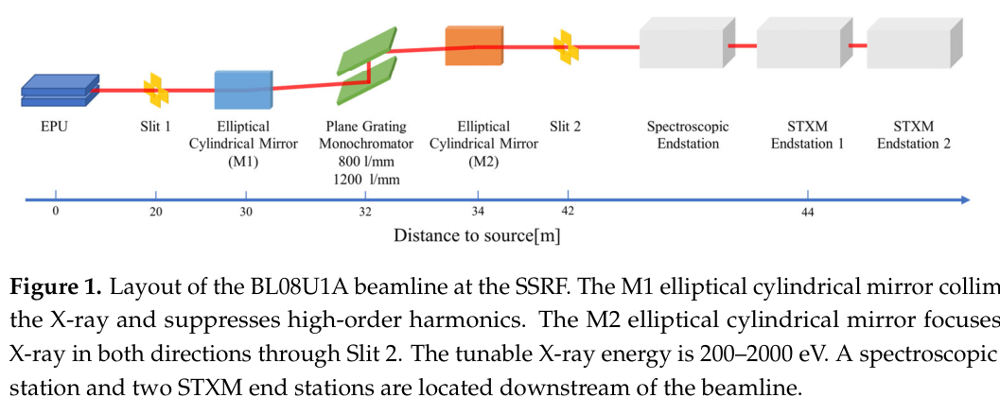
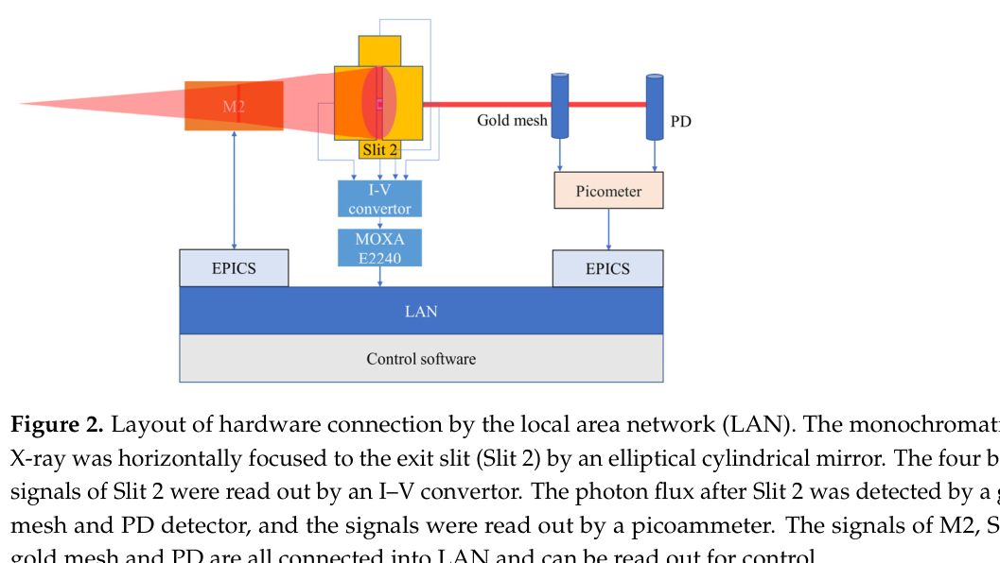
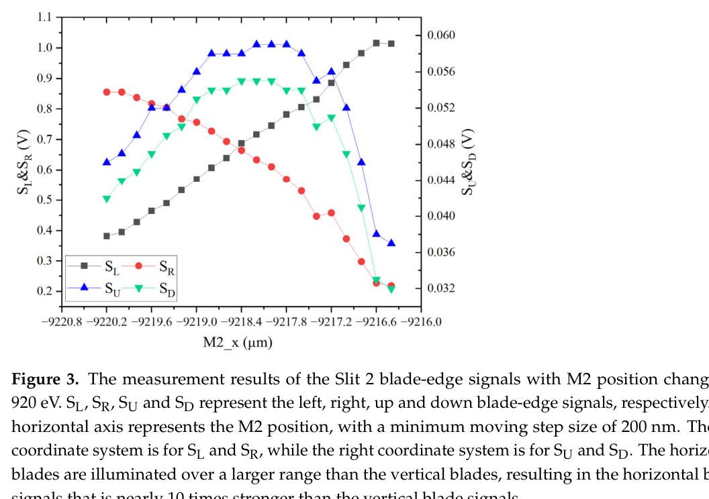
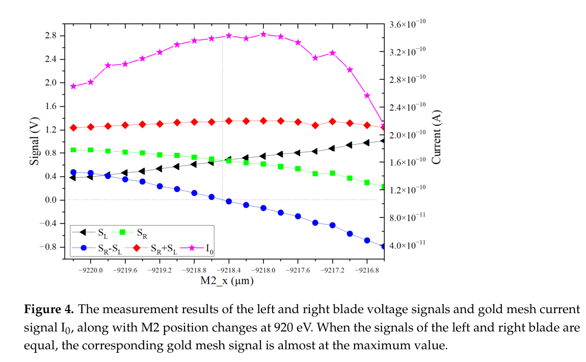
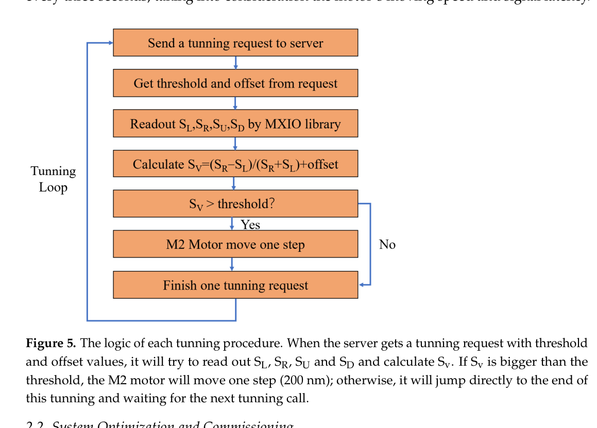
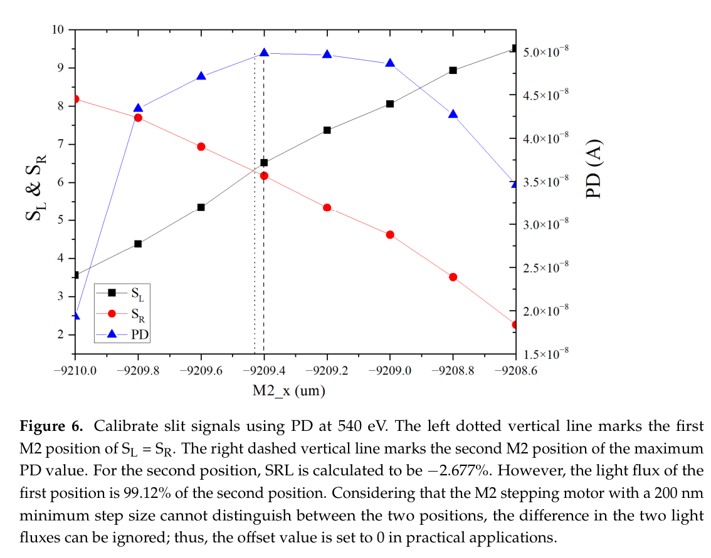
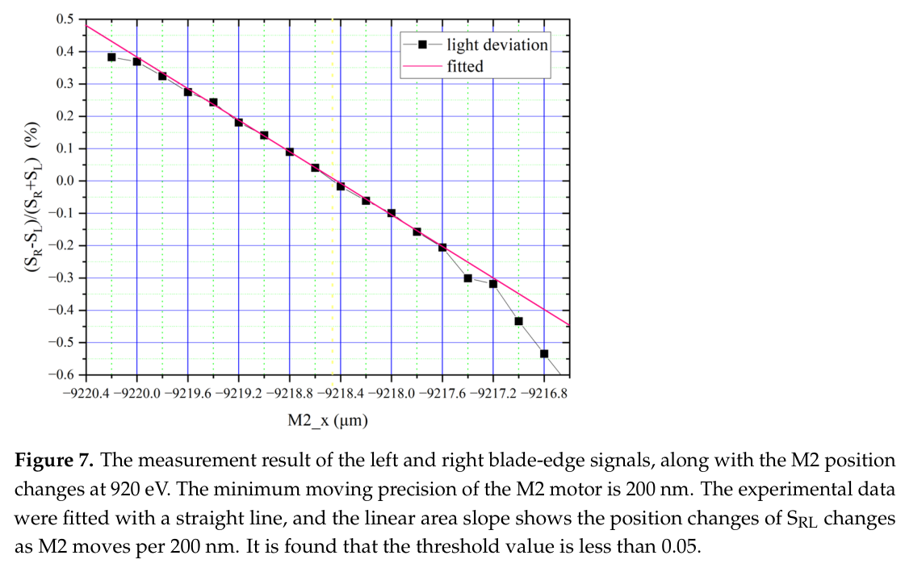
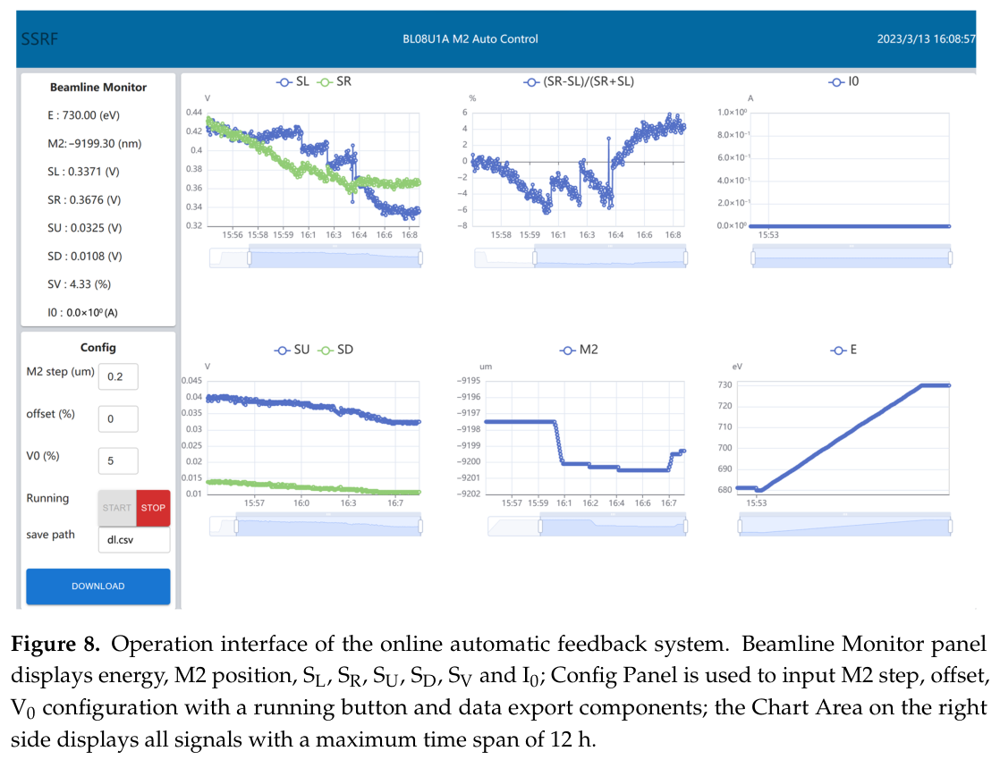
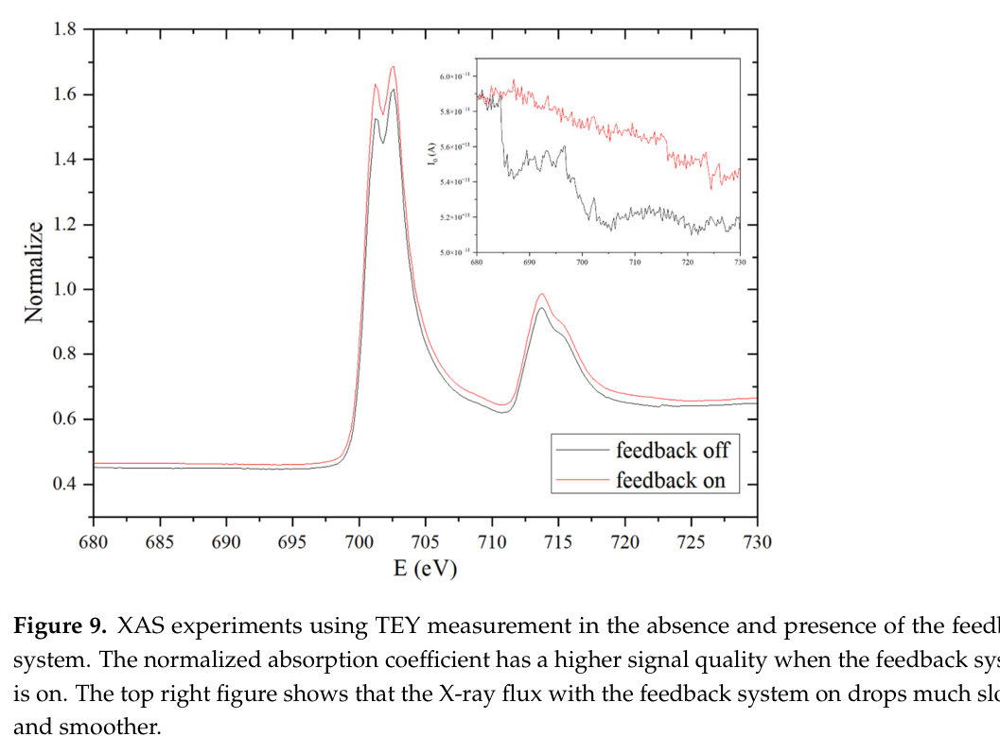

---
tags:
  - papers/synchrotron
  - papers/beamline-automation
  - papers/xas
aliases:
  - BL08U1A X射线通量自动反馈系统全文翻译
  - 上海光源BL08U1A在线反馈
date: 2023-04-27
doi: 10.3390/app13095456
source_pdf: /home/zhenyu/PaperReading/详细调研/03_BL08U1A_2023_automatic_flux_feedback.pdf
translation_date: 2026-07-29
---

# 上海同步辐射光源 BL08U1A 软 X 射线谱学显微线站的 X 射线通量自动反馈系统

> 原文：Chi Zhang, Haigang Liu, Chunpeng Wang, Zhi Guo, Xiangzhi Zhang, Zijian Xu, Xiangjun Zhen, Yong Wang, Renzhong Tai. *Automatic Feedback System for X-ray Flux at BL08U1A Soft X-ray Spectromicroscopy Beamline of Shanghai Synchrotron Radiation Facility*. Applied Sciences, 2023, 13, 5456.
>
> 本文档依据用户提供的论文 PDF 逐节翻译。公式、图表编号和参考文献序号与原文一致；参考文献著录保留原文语言。

## 作者与机构

作者：张驰、刘海岗、王春鹏、郭智、张祥志、徐子健、甄湘军、王勇、邰仁忠。

机构：

1. 中国科学院上海高等研究院上海同步辐射光源，上海 201210；
2. 中国科学院上海应用物理研究所，上海 201204；
3. 上海科技大学物质科学与技术学院，上海 201210。

收稿日期：2023 年 3 月 23 日；修回日期：2023 年 4 月 23 日；接受日期：2023 年 4 月 25 日；发表日期：2023 年 4 月 27 日。

## 摘要

上海同步辐射光源 BL08U1A 软 X 射线谱学显微线站已经成功安装并调试了一套在线自动反馈系统。该系统通过测量出口狭缝刀口信号实时监测入射 X 射线束，并自动调节椭圆柱面镜参数，从而完成光束校准并维持样品处的最优 X 射线通量。本文全面介绍系统的硬件组成、系统实现、反馈逻辑、功能与软件设计、系统优化与调试，以及系统支持下的在线实验结果。实验结果表明，该在线自动反馈系统能够在 X 射线吸收谱实验中有效维持最优 X 射线束通量。该系统的成功实施可为未来同步辐射装置各类线站中类似系统的设计、建设与优化提供有价值的技术支持。

关键词：同步辐射；线站自动化；X 射线吸收谱；在线反馈

## 1. 引言

上海同步辐射光源（SSRF）是 2009 年建成的先进第三代同步辐射光源。其组成包括一台 150 MeV 电子直线加速器、一台将电子能量提升到 3.5 GeV 的增强器、一座 3.5 GeV 电子储存环，以及覆盖多个学科的数十条光束线和实验站。2016 年，上海光源启动了规模最大的后续线站建设工程——上海光源二期线站工程，预计于 2023 年 7 月完成。除由中国石化投资建设的三条线站外，到 2025 年上海光源预计将有 35 条光束线、50 个实验站投入运行。这将显著扩展上海光源的实验能力，使其时间、空间、能量和动量分辨率接近第三代同步辐射光源的极限 [1]。

提供高质量 X 射线是同步辐射光源最不可替代的优势。同步辐射 X 射线具有高亮度、能量范围宽且可连续调谐、高准直度、高偏振度和窄脉冲等特点。对大多数同步辐射科学研究而言，高 X 射线通量是最重要的优势之一，因为它能够带来更好的空间、能量和时间分辨率，以及更高的实验效率。高通量也是衡量衍射极限储存环光源和自由电子激光器发展的代表性指标。相应地，维持最优 X 射线通量对于同步辐射线站运行和获得高质量实验结果至关重要。

然而，线站全天连续运行、服务不同实验时，大量实验条件会发生变化，从而以不同程度扰动实验站最终获得的 X 射线通量。例如，不同用户和实验可能需要调整线站反射镜位置、波荡器或其他插入件间隙，以及单色器和光栅参数，以获得所需 X 射线能量，这些调整都可能降低光通量。以 BL08U1A 实测结果为例，铁元素 XAFS 的能量范围约为 690–740 eV，735 eV 处的 X 射线通量比 690 eV 处的最大通量低约 22%。插入件升级、电子束轨道不稳定和储存环注入也会影响光束通量 [2]。多数同步辐射光源每日运行 24 h，光学元件的热胀冷缩和昼夜温度循环 [3] 还会导致光子束漂移。有时电子束流不稳定，运行人员不得不扩大出口狭缝以提高成像实验中的 X 射线通量，代价是降低空间分辨率。因此，在实验开始前和实验进行过程中自动维持最优 X 射线通量非常重要。

为自动校准光束位置并维持最大通量，许多线站开发了包括轨道校正和光学校正在内的稳定系统。轨道校正系统 [4–8] 通常采用束流位置监测器（BPM）[9] 和校正磁铁，将电子束限制在工作位置。光学校正系统通常采用垂直或水平平面镜、单色器 [10,11] 和探测器稳定并最大化光通量。两类系统均可实现为前馈或反馈控制。

前馈校正依赖线站物理模型，或者依赖针对每个插入件间隙预先记录的光束性质与线站设定之间的关系 [12]。先进光子源的 GM/CA 大分子晶体学线站会在特定条件下执行垂直和水平扫描以重新对中光束 [13]。但是，建立这种记录耗时很长，而光源机时有限，设备漂移后不能频繁重新标定。因此，前馈算法的偏差会随时间增加，需要反馈系统补偿。国家同步辐射光源 II 的 FMX 微聚焦大分子晶体学线站实现了三个光束位置校正反馈环 [3]；卡尔斯鲁厄理工学院同步辐射装置的 XAS 线站考虑了若干自动任务 [14]；澳大利亚同步辐射装置 MX2 大分子晶体学线站则用 YAG 晶体和 CCD 相机记录光束，并以此反馈移动聚焦镜 [15]。尽管反馈系统已被广泛使用，公开文献很少给出被控设备、算法和反馈结果等实现细节。

本文介绍一套用于上海光源 BL08U1A 线站的全自动在线反馈系统，可在实验前和实验中优化 X 射线通量。该线站提供约 200–2000 eV 的光子束。当出口狭缝 Slit 2 的水平和垂直尺寸分别设为 50 µm 和 20 µm 时，在 244 eV 和 401 eV 的能量分辨本领分别为 16,000 和 12,700。当 Slit 2 水平和垂直尺寸均为 50 µm、能量为 244 eV 且 $E/\Delta E=6440$ 时，出口狭缝下游的光子通量约为 $5\times10^{11}$ photons/s。

光子通量下降可能来自光子能量调整、椭圆偏振波荡器间隙变化，以及热负载分布不均匀造成的反射镜变形。在 XAS 和长时间成像实验中，运行人员必须频繁手动调整反射镜位置和出口狭缝尺寸，以获得更高 X 射线通量和更好的实验质量。使用本文的反馈系统，可以根据出口狭缝刀口信号同时计算反馈量，自动调整椭圆柱面镜的水平位置，从而维持光子通量稳定。本文将详细介绍硬件组成、系统实现、反馈逻辑、功能与软件设计、系统优化与调试，以及系统支持下的在线实验结果。BL08U1A 的 XAS 实验结果表明，该系统能够满足稳定、自动调节光通量的需求。

## 2. 材料与方法

### 2.1 系统设计

#### 2.1.1 上海光源 BL08U1A 线站布局

BL08U1A 是一条能量范围约为 250–2000 eV 的软 X 射线谱学显微线站 [16,17]，其布局见图 1。椭圆偏振波荡器用于产生软 X 射线光子。狭缝 Slit 1 位于波荡器下游 20 m 处，用于保证水平和垂直方向的接收角均处于 $\pm0.04$ mrad 以内。椭圆柱面镜 M1 位于波荡器下游 30 m 处，用于准直光子束并抑制高次谐波；其水冷结构负责吸收热负载。位于 32 m 处的平面光栅单色器由两块镀金光栅组成：800 line/mm 光栅覆盖 250–750 eV，1200 line/mm 光栅覆盖 275–2000 eV。最后一个光学元件是椭圆柱面镜 M2，用于在 Slit 2 处同时沿水平和垂直方向聚焦光子束。

BL08U1A 于 2009 年开始运行，当时配置了扫描透射 X 射线显微镜（STXM）实验站，即图 1 中的实验站 1。2014 年首先安装了独立原位谱学实验站，并于 2018 年升级 [18]；2019 年安装了先进的叠层成像—STXM 实验站，即图 1 中的实验站 2。这三个实验站已广泛用于环境科学 [19,20]、物理学 [21]、化学、材料和能源科学 [22,23] 研究。

> **图 1（原文图注翻译）**：上海光源 BL08U1A 线站布局。椭圆柱面镜 M1 准直 X 射线并抑制高次谐波；椭圆柱面镜 M2 在两个方向聚焦 X 射线，使其通过 Slit 2。X 射线能量可在 200–2000 eV 范围调谐。线站下游布置一个谱学实验站和两个 STXM 实验站。

BL08U1A 支持多种实验方法，包括 STXM [24,25]、纳米 CT [26–28]、叠层成像 [29,30] 等成像方法，以及总电子产额（TEY）、X 射线磁圆二色性（XMCD）、X 射线磁线二色性（XMLD）和 X 射线激发光学发光（XEOL）等 XAS 方法 [31,32]。XAS 需要测量入射 X 射线通量以进行数据归一化；所有 XAS 和成像方法都需要高且稳定的入射光通量，以提高信噪比。

实验前，BL08U1A 运行人员通常需要手动调整 M2 位置以获得最优通量。但实验过程中无法实时观察通量变化并进行校正，这可能降低数据质量，甚至导致长时间成像实验失败。因此，需要开发一套自动反馈系统，使线站自动对准并维持最优 X 射线通量，从而提高实验效率和结果质量。

#### 2.1.2 硬件组成

自动反馈系统的硬件主要包括：椭圆柱面镜 M2、由四个刀片构成的线站出口狭缝 Slit 2、上海光源研制的电流—电压转换器、MOXA ioLogik E2240 控制器、皮安表、谱学实验站中的金网，以及 STXM 实验站中的光电二极管探测器。

Slit 2 作为线站的二次光源，是控制下游至各实验站光路中 X 射线能量分辨率和相干性的关键器件。Slit 2 由四个可独立运动的刀片组成，可调整狭缝尺寸和形状，如图 2 所示。沿光束入射方向观察，左右刀片位于上下刀片之前。上游单色器光栅水平放置，产生垂直条状 X 射线束并照射 Slit 2。垂直放置的 M2 会使 Slit 2 上的光斑沿水平方向移动。

实验中 Slit 2 的尺寸通常为数十微米，刀口电流与刀片受到入射 X 射线照射的面积成正比，因此水平方向的刀口电流一般大于垂直方向。为实现高精度读出，上海光源控制组研制的 8 通道电流—电压转换器负责把电流信号转换为电压信号；MOXA ioLogik E2240 控制器负责采集信号并切换量程。当入射 X 射线束中心偏离 Slit 2 中心时，左右刀口电流不相等，可将这一差异作为自动反馈系统的参考指标。

> **图 2（原文图注翻译）**：基于局域网的硬件连接布局。单色后的 X 射线经椭圆柱面镜沿水平方向聚焦到出口狭缝 Slit 2。Slit 2 四个刀片的信号由电流—电压转换器读出；Slit 2 后的光子通量由金网和光电二极管检测，信号由皮安表读出。M2、Slit 2、金网和光电二极管的信号均接入局域网，可供控制系统读取。

谱学实验站的金网和 STXM 实验站的光电二极管用于直接测量 X 射线束强度，二者信号均通过皮安表读出。全部数字信号和硬件控制接口接入局域网，由控制软件统一管理。软件可读取 Slit 2 刀口电压、金网电流、光电二极管电流以及 M2 电机信号，并按照合适的逻辑控制 M2 位置，从而维持样品处最优 X 射线通量。

#### 2.1.3 反馈逻辑

自动反馈系统的优化以前提条件为：光路中的全部线站设备已经完成光学对准，椭圆偏振波荡器间隙和平面光栅单色器角度已经选定。图 3 展示了 M2 位置变化时四个刀口电压信号的变化。此时入射 X 射线能量为 920 eV，Slit 2 尺寸为 $50\,\mu\text{m}\times50\,\mu\text{m}$。$S_L$、$S_R$、$S_U$ 和 $S_D$ 分别代表左、右、上、下刀口信号。

水平信号的变化量比垂直信号高约一个数量级，说明光斑在水平方向的偏移远大于垂直方向。因此，反馈系统只考虑水平偏移，并用水平方向刀口信号评估 Slit 2 下游光路中 X 射线束的位置。

> **图 3（原文图注翻译）**：920 eV 下，Slit 2 四个刀口信号随 M2 位置变化的测量结果。横轴为 M2 位置，最小步长为 200 nm；左纵轴对应 $S_L$ 和 $S_R$，右纵轴对应 $S_U$ 和 $S_D$。水平刀片受光范围更大，因此水平方向刀口信号约为垂直方向的 10 倍。

图 4 表明，金网电流随 M2 位置变化而达到最优值。M2 位置参数较小时，右刀口信号大于左刀口信号，说明 Slit 2 处 X 射线束向右偏。随着 M2 位置增加，左右刀口信号差减小。在某一 M2 位置，左右信号相等，同时金网信号接近最大值。因此定义第一条反馈判据：

$$
S_{RL}=\frac{S_R-S_L}{S_R+S_L}.
\tag{1}
$$

若 $S_{RL}>0$，应增加 M2 位置参数，使左右刀口信号差减小；若 $S_{RL}<0$，则应减小 M2 位置参数，同样使信号差减小。

> **图 4（原文图注翻译）**：920 eV 下，左右刀口电压及金网电流 $I_0$ 随 M2 位置变化的测量结果。当左右刀口信号相等时，对应的金网信号接近最大值。

#### 2.1.4 功能与软件设计

M2 电机位置、金网电流和光电二极管电流可通过实验物理与工业控制系统（EPICS）[33] 访问。EPICS 是广泛用于大型科学装置控制的开源分布式软件框架，可通过网络访问和控制设备。它提供标准化、可扩展的接口，使不同设备和控制系统协同工作，并提供 Channel Access、Database Access、Alarm Handler 和 Archive Engine 等工具与库，便于系统开发和管理。MOXA ioLogik E2240 采集的 $S_L$ 和 $S_R$ 电压信号则通过厂商提供的 MXIO 库读取。

自动反馈系统软件采用浏览器/服务器架构，后端使用 Flask，前端使用 React。Flask 是用 Python 编写的轻量级微型 Web 框架，提供 URL 路由、模板渲染和扩展支持；React 是用于构建用户界面的开源 JavaScript 库，通过虚拟 DOM 提高渲染效率，并支持服务端渲染和移动端开发。

由于谱学实验站和 STXM 实验站的控制软件分别运行于不同计算机，浏览器/服务器架构更便于跨计算机、跨控制系统操作。用户可直接从浏览器以 CSV 格式下载全部信号。服务器启动后，所有信号均按秒记录并存入本地 SQLite 数据库，以保证数据安全存储并便于后续分析。

实现反馈逻辑时，系统加入阈值限制，避免 M2 在最优位置附近振荡，并降低电机回程差的影响；同时为 $S_{RL}$ 增加偏置量，以校正因金网结构和受光位置造成的通量测量偏差。相关改进和测试见 2.2 节。为避免自动调光程序运行异常，系统还配置报警输出。当 $S_V$ 超过 30% 时，错误信号被激活并发送给成像或 XAS 实验站。

图 5 给出一次调节循环的过程。用户可在浏览器界面中设置 M2 步长、偏置量和阈值 $V_0$，并启动反馈。系统启动后，服务器收到包含上述参数的反馈请求，立即读取全部信号并检查阈值。若 $S_V>V_0$，M2 按相应方向移动一步，完成一次反馈请求。只要系统保持开启，该过程每 3 s 重复一次，以兼顾电机运动速度和信号延迟。

> **图 5（原文图注翻译）**：一次调节过程的逻辑。服务器收到包含阈值和偏置量的请求后，读取 $S_L$、$S_R$、$S_U$、$S_D$ 并计算 $S_V$。若 $S_V$ 大于阈值，M2 电机移动一步（200 nm）；否则结束本次调节并等待下一次调用。

### 2.2 系统优化与调试

#### 2.2.1 X 射线通量校准

如图 4 所示，Slit 2 下游光路的最大 X 射线通量并不与左右刀口电压差的最小值严格重合。原因是金网信号会受到网格结构和受光位置影响，未必准确代表样品位置的 X 射线通量。因此，研究人员在 STXM 实验站安装光电二极管，直接测量 X 射线强度，用于判断 $S_{RL}=0$ 时通量与最大通量的差别；若差别足够大，则用偏置量校准 $S_{RL}$。

在 540、700 和 920 eV 下进行了多次校准实验。最大光电二极管通量对应的 $S_{RL}$ 偏置量分别为 $-2.677\%$、$-9.356\%$ 和 $-13.5\%$。偏置量设为零时，三个能量下 $S_{RL}=0$ 对应通量分别为最大光电二极管通量的 99.12%、96.88% 和 98.50%，最大偏差小于 3%。因此，虽然为精确对齐最大值所计算的偏置量可能超过 10%，但 $S_{RL}=0$ 时样品处通量已经非常接近最大值，实际自动反馈中把偏置量设为零。

> **图 6（原文图注翻译）**：在 540 eV 下使用光电二极管校准狭缝信号。左侧点划线表示第一次出现 $S_L=S_R$ 的 M2 位置，右侧虚线表示光电二极管达到最大值的第二个 M2 位置。第二个位置对应 $S_{RL}=-2.677\%$，但第一个位置的通量已达到第二个位置的 99.12%。考虑 M2 步进电机最小步长为 200 nm，不能可靠区分两个位置，实际应用中忽略两者通量差并把偏置量设为 0。

#### 2.2.2 阈值限制

在 BL08U1A 实验过程中，M2 是影响 Slit 2 处光束中心位置的主要反射镜，由最小运动精度为 200 nm 的步进电机驱动。运动时还必须考虑电机回程差。为防止 M2 因回程差在最优位置附近来回振荡，定义阈值量：

$$
S_V=\left|\frac{S_R-S_L}{S_R+S_L}+\mathrm{offset}\right|.
\tag{2}
$$

其中 $\mathrm{offset}$ 是依据金网最优信号确定的校正值。需要通过测试选取合适的阈值 $V_0$，使反馈仅在 $S_V>V_0$ 时启动。

图 7 给出入射能量为 920 eV 时，M2 以 200 nm 步进运动过程中 $S_{RL}$ 的变化。实验前采集 $(S_R-S_L)/(S_R+S_L)$ 随 M2 位置变化的数据并进行线性拟合。拟合直线斜率表示 M2 移动 1000 nm 后归一化差分量的百分比变化，将斜率乘以 0.2 即得到每移动 200 nm 的变化。在最优 M2 位置附近的中心线性区，单步相对变化约为 0.0475。

研究人员还系统测试了 BL08U1A 的整个能量范围，并计算不同能量下的阈值。实际实验为简化操作统一取 $V_0=0.05$，自动反馈运行良好。

> **图 7（原文图注翻译）**：920 eV 下，左右刀口信号随 M2 位置变化的测量结果。M2 最小运动精度为 200 nm。对实验数据进行直线拟合，中心线性区斜率反映 M2 每移动 200 nm 时 $S_{RL}$ 的变化。结果表明阈值小于 0.05。

**表 1　不同入射 X 射线能量对应的最小阈值**

| 能量（eV） | 300 | 460 | 700 | 920 | 1200 | 1500 | 1800 |
|---:|---:|---:|---:|---:|---:|---:|---:|
| $V_0$ | 0.0399 | 0.0467 | 0.0353 | 0.0475 | 0.0453 | 0.0431 | 0.0448 |

## 3. 结果

### 3.1 最优光通量调节

在线自动反馈系统的浏览器界面见图 8。左上角“Beamline Monitor”面板显示能量 $E$、M2、$S_L$、$S_R$、$S_U$、$S_D$、$S_V$ 和 $I_0$ 的当前读数；左下角“Config”面板可设置 M2 步长、偏置量和 $V_0$，并提供运行按钮和数据导出功能；右侧主体为曲线显示区，最多显示 12 h 数据。每张图的横轴设有滑块，便于观察更短时间尺度。曲线区和监视面板中的信号每秒由服务器更新一次。

研究人员在 690–730 eV 能量扫描中进行了约 15 min 自动反馈测试。M2 步长设为 0.2 µm，偏置量为 0，阈值为 0.05。能量变化、M2 位置和计算得到的 $(S_R-S_L)/(S_R+S_L)$ 均被实时记录。能量变化过程中，$S_{RL}$ 逐渐降至 $-0.05$，随后 M2 开始逐步运动，使 $S_{RL}$ 回升。整个测试中 $S_{RL}$ 保持在 $\pm0.05$ 之间，说明自动反馈工作正常。

> **图 8（原文图注翻译）**：在线自动反馈系统操作界面。Beamline Monitor 显示能量、M2 位置、$S_L$、$S_R$、$S_U$、$S_D$、$S_V$ 和 $I_0$；Config 面板用于输入 M2 步长、偏置量和 $V_0$，并提供运行与数据导出功能；右侧曲线区显示最长 12 h 的全部信号。

### 3.2 XAS 调节

XAS 是同步辐射装置中广泛用于材料、化学和生物研究的实验技术 [34]。本文的 XAS 实验采用总电子产额测量，即在能量变化过程中测量样品对 X 射线的吸收。实验同时记录样品前后的 X 射线强度，并通过归一化得到吸收系数。吸收谱可提供样品电子和原子结构信息，包括氧化态、配位数和键长。

图 9 比较了在线自动反馈开启与关闭时，铁样品架的归一化吸收谱。每条谱的数据采集约需 10 min。关闭反馈时，能量扫描过程中由金网测得的样品前入射强度快速下降；开启反馈后，强度下降明显减慢且更加平滑。开启反馈所得归一化吸收系数在整个能量范围内具有更高信号质量。

研究人员对 724–730 eV 范围内的数据计算信噪比，此处反馈系统已经优化 M2 位置。无反馈数据的信噪比为 55.390 dB，有反馈数据为 57.351 dB，提高接近 2 dB。结果表明，通过在实验过程中维持稳定入射强度，反馈系统可改善 XAS 数据质量，使结果更加准确、可靠。

> **图 9（原文图注翻译）**：关闭和开启反馈系统时的 TEY-XAS 实验。开启反馈后，归一化吸收系数具有更高信号质量。右上角子图表明，开启反馈时 X 射线通量下降更慢、更平滑。

## 4. 讨论

在线自动反馈系统通过监测 Slit 2 四个刀口电压并实时调整 M2 电机，已被证明能够让 BL08U1A 的 XAS 实验在较长时间内保持接近最优 X 射线通量。系统显著提高数据质量，且不会打断用户实验，因此已经在线运行并为 BL08U1A 用户提供支持。

对 BL08U1A 而言，M2 是线站运行和用户实验期间调整频率最高的核心光学元件，优化逻辑相对简单、清晰。但在其他线站中，影响最大 X 射线通量的光学元件和控制参数可能更加复杂、多样，参数优化空间会显著扩大。若不同光学器件和控制参数之间相互耦合，自动反馈系统开发会更加困难，同时也更有价值。

复杂线站自动反馈系统的开发理念应与本文一致：把所有影响 X 射线通量的设备和控制参数纳入统一框架，依靠资深线站科学家的经验，或者采用人工智能与机器学习算法，在高维参数空间内快速完成优化。以深度神经网络为代表的人工智能方法在线优化复杂线站具有很大应用潜力，预计未来数年仍将持续出现突破。

本文对硬件组成、系统实现、反馈逻辑、功能与软件设计、系统优化和调试的详细展示，可为未来不同同步辐射装置线站开展类似研究提供参考。

## 作者贡献

概念设计：刘海岗、王春鹏、张祥志；数据整理：张驰、徐子健；形式分析：张驰、刘海岗；经费获取：刘海岗、王春鹏；实验调查：郭智；方法：张驰、刘海岗；项目管理：邰仁忠；资源：张祥志、甄湘军；软件：张驰；监督：王勇、邰仁忠；验证：郭智；可视化：刘海岗；初稿撰写：张驰；审阅与编辑：王春鹏。所有作者均已阅读并同意论文发表版本。

## 经费、数据与利益声明

本研究得到国家重点研发计划（2022YFA1603703、2021YFA1600802）、国家自然科学基金（12175297、U2032126）以及中国科学院青年创新促进会（2022290）资助。

机构审查声明：不适用。知情同意声明：不适用。

数据可获得性：反馈程序源代码请联系 wangcp@sari.ac.cn；图中测试数据请联系 liuhg@sari.ac.cn。

利益冲突：作者声明不存在利益冲突。

## 参考文献

参考文献共 34 条，著录信息和编号保持原论文不变，详见原 PDF 第 12–13 页。本文翻译正文中的引用序号与原文参考文献一一对应。

