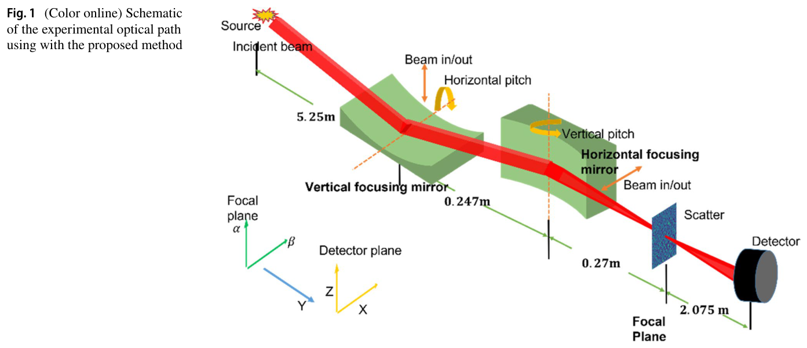
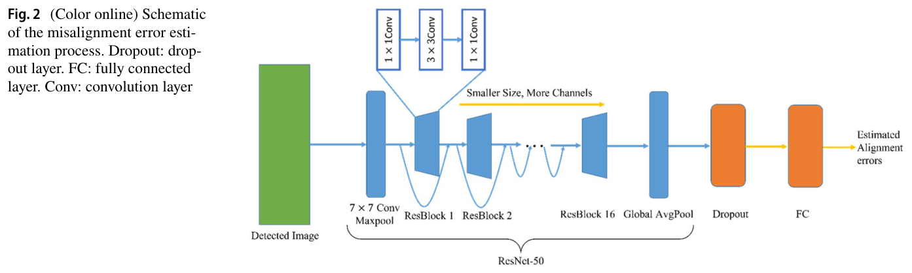
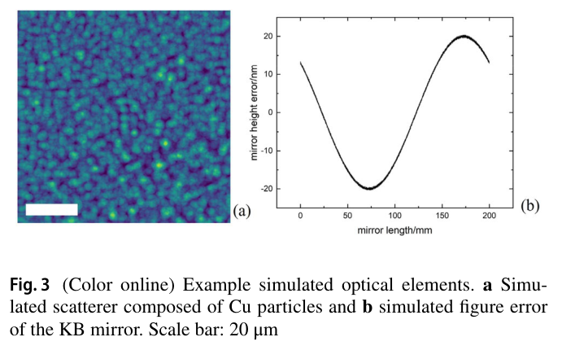
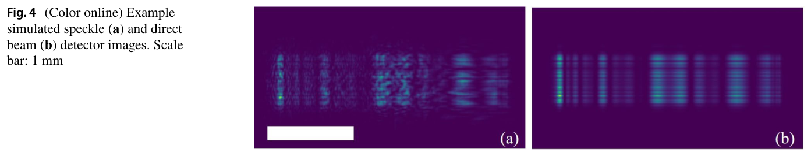
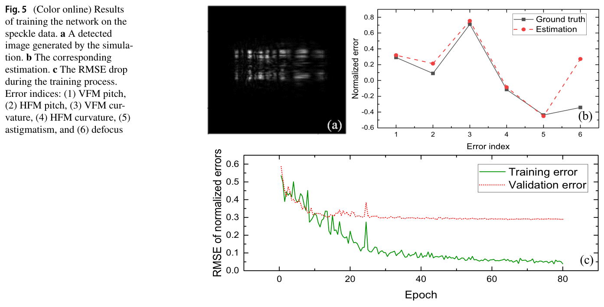
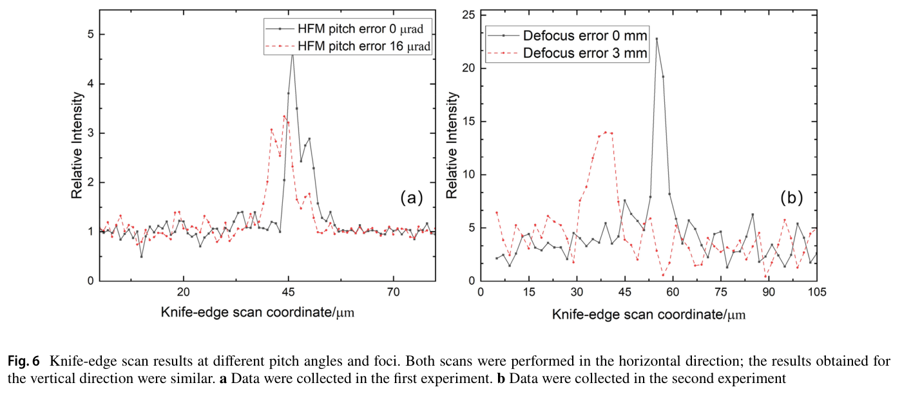
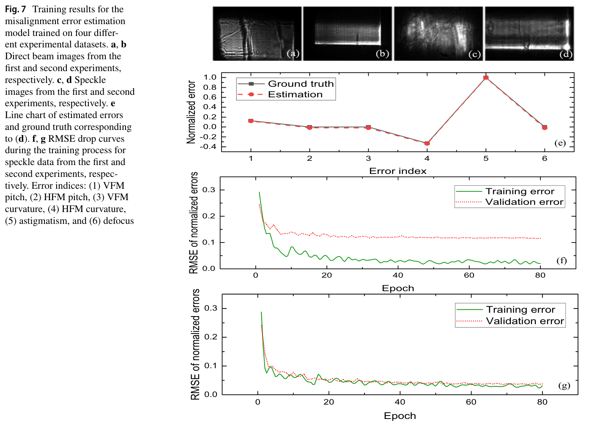
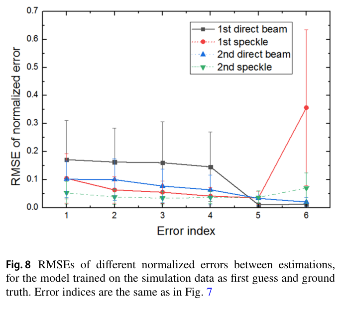
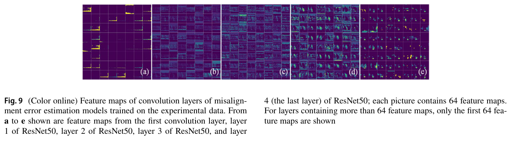
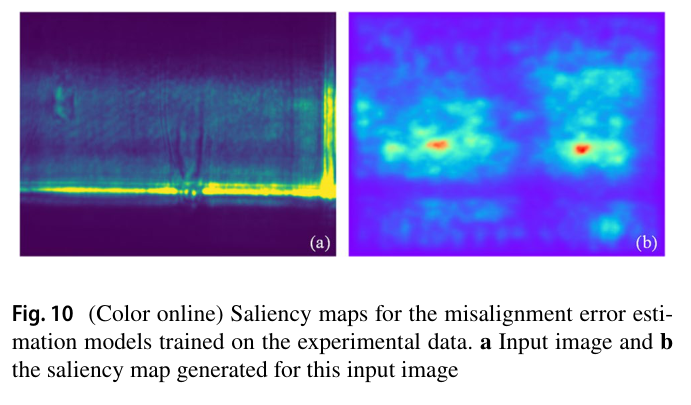

---
tags:
  - papers/synchrotron
  - papers/deep-learning
  - papers/x-ray-optics
aliases:
  - BL15U KB镜失调深度学习估计全文翻译
  - KB镜单曝光自动对准
date: 2023-07-09
doi: 10.1007/s41365-023-01282-4
source_pdf: /home/zhenyu/PaperReading/详细调研/06_BL15U_2023_CNN_KB_alignment.pdf
translation_date: 2026-07-29
---

# 用深度学习估计 Kirkpatrick–Baez 反射镜的对准误差

> 原文：Jia-Nan Xie, Hui Jiang, Ai-Guo Li, Na-Xi Tian, Shuai Yan, Dong-Xu Liang, Jun Hu. *Deep learning for estimation of Kirkpatrick–Baez mirror alignment errors*. Nuclear Science and Techniques, 2023, 34:122.
>
> 用户提供的 PDF 是 ChinaXiv 生成的英文机器翻译版，正文完整，但原文件以“见原论文”的占位形式省略了图像，并丢失了部分表格内容。本译文完整翻译该 PDF 中实际包含的正文、公式和图表引用；缺失图表不自行臆造。

## 作者与机构

作者：谢佳楠、姜慧、李爱国、田纳西、闫帅、梁东旭、胡军。

机构：

1. 中国科学院上海高等研究院上海同步辐射光源，上海 201204；
2. 上海科技大学，上海 201210；
3. 中国科学院上海应用物理研究所，上海 201800；
4. 中国科学院大学，北京 100049。

通信作者：姜慧（jiangh@sari.ac.cn）、李爱国（liag@sari.ac.cn）。

## 摘要

本文提出一种面向同步辐射应用、基于深度学习的 Kirkpatrick–Baez（KB）反射镜自动对准方法。研究人员使用聚焦系统的仿真和实验成像数据训练卷积神经网络。与直接从直束图像学习不同，本文引入散射体调制 X 射线并产生散斑，以增强图像特征。验证集上的最小归一化均方根误差为 4%。与依赖电机扫描和分析仪器的传统对准方法相比，该方法简化了光路，并通过单次曝光实验估计对准误差。单次失调误差估计仅耗时 0.13 s，明显快于传统方法。论文还使用实验数据展示了束流质量和预训练的影响。该方法表现出较强鲁棒性，能够处理具有复杂或动态波前误差的高精度聚焦系统，为未来同步辐射线站的智能控制提供了重要基础。

关键词：深度学习；同步辐射；光学对准

## 1. 引言

同步辐射微聚焦和纳米聚焦 X 射线已广泛用于能源、材料和生命科学中的材料微结构研究。对于相干光源，焦斑越小，相干通量越高，重建图像的分辨率也越高。为满足 X 射线聚焦系统的高性能要求，需要实现无像差聚焦和理想波前。

Kirkpatrick–Baez 反射镜对是一种典型 X 射线聚焦系统，由两块相互垂直、表面为椭圆形或抛物线形的反射镜组成。为获得理想焦斑，除了要求反射镜具有高精度面形外，还必须把两块 KB 镜准确放置在光轴上。

传统 KB 镜对准主要依赖反复试调。刀口扫描是测量焦斑尺寸最简单的方法，但每次扫描只能提供一维强度剖面。Hartmann 波前传感器可通过一次曝光直接获得二维波前信息，但设备昂贵且空间分辨率相对较低。光栅剪切干涉法也能获得二维波前信息，但要求干涉仪准确对准，并要求光栅接近完美制造。

近年来，研究人员开发了基于数字图像相关的近场散斑跟踪方法，用于提取波前信息，并系统研究了扩散片颗粒尺寸和相关子区尺寸等因素。还有研究提出基于散斑扫描的方法，直接获得俯仰角误差信息，但扫描耗时，获得的对准信息仅限于俯仰角和波前曲率。另一种相干 X 射线散斑分析方法利用散斑尺寸与焦斑尺寸的反比关系，通过单次曝光获得对准误差信息，不过为降低噪声仍需要额外数次曝光。

深度学习的快速发展已经扩展到光学系统。已有研究通过预调制增加探测图像中的有效像素，训练卷积神经网络估计波前像差的 Zernike 系数；也有研究采用深度残差波前学习，扩展基于 Lyot 的低阶波前传感器可用范围。除直接使用图像外，还有方法提取点扩散函数的 Tchebichef 矩，并输入多个神经网络。在望远镜领域，卷积神经网络可根据点扩散函数图像给出 Zernike 系数初值，再进行迭代细化；在显微系统中，深度学习已用于自动聚焦和去噪。

在 X 射线领域，神经网络已被用于大分子晶体学衍射图筛选、晶体结构分类、断层成像去噪和 Bragg 峰分析。机器学习也已用于加速器诊断和调节。然而，深度学习在 X 射线光学对准与计量中的应用仍然不足。

本文提出一种基于深度学习、通过单次曝光估计 KB 镜对准误差的方法。研究人员以探测图像作为卷积神经网络输入，直接回归对准误差。为提高学习效果，在焦平面放置薄散射体，对直束进行调制并在探测器平面产生散斑，因为这些散斑能够携带焦平面波前误差信息。研究首先使用仿真数据训练网络，再用实验数据微调，并讨论束流质量和仿真预训练对失调估计的影响。

## 2. 方法

### 2.1 散射调制与成像物理

如原论文图 1 所示，在焦平面放置薄散射体，使探测器上的直束图像产生散斑。散射体相当于训练卷积神经网络之前的物理预调制器。研究同时使用直束图和散斑调制图训练网络，以比较两类输入的性能。

> **图 1（原文图注翻译）**：本文方法采用的实验光路示意图。入射 X 射线依次经过垂直与水平聚焦镜，在焦平面形成焦点；焦平面可放置散射体，探测器记录直束或散斑调制后的图像。

对于窄带入射光波 $u(P,t)$，互强度定义为

$$
J_i(P_1,P_2)=\left\langle u(P_1,t)u^*(P_2,t)\right\rangle .
$$

光波通过复透射函数为 $t(P)$ 的薄散射体后，出射互强度为

$$
J_t(P_1,P_2)=t(P_1)t^*(P_2)J_i(P_1,P_2).
$$

互强度从散射体表面 $S_1$ 传播至探测器表面 $S_2$ 时，可写成对 $P_1$ 和 $P_2$ 的传播积分。式中 $\lambda$ 为窄带光束中心波长，$r_i$ 为 $P_i$ 与探测器点 $Q_i$ 之间的距离，$\chi(\theta_i)$ 为位置 $P_i$ 处的倾斜因子。探测器只能测量强度，因此在探测面上考虑

$$
I(Q)=J(Q,Q).
$$

令 $(x,y)$ 为探测器平面的坐标，$(\alpha,\beta)$ 为散射体平面的坐标，并假设入射场满足 Schell 模型：

$$
J_i(\alpha_1,\beta_1,\alpha_2,\beta_2)
=A(\alpha_1,\beta_1)A(\alpha_2,\beta_2)
\mu(\alpha_1-\alpha_2,\beta_1-\beta_2).
$$

在 Fresnel 近似下，探测强度可表示为散射体透射函数、入射振幅、空间相干度和传播相位的四维积分。该式说明散射体会扰动探测强度；深度学习可从有散射和无散射图像中学习由散射体引入、且与波前状态相关的散斑差异。

### 2.2 卷积神经网络

深度学习通过反向传播和梯度下降优化人工神经网络参数。典型神经网络包含多层神经元，每层接收前一层输出并将处理结果传给下一层，最后一层输出预测。损失函数刻画预测与真值之差，其梯度从输出层开始反向传播。

单层的前向传播可写为

$$
z=\varphi(w^\mathrm{T}x+b),
$$

其中 $x$ 为输入，$w$ 和 $b$ 分别为权重和偏置，$\varphi$ 为激活函数，$z$ 为该层输出。反向传播依据链式法则计算 $\partial L/\partial x$、$\partial L/\partial w$ 和 $\partial L/\partial b$。

卷积神经网络利用局部连接、参数共享和池化结构，比普通多层全连接网络更适合图像处理：它能利用像素的二维拓扑结构，同时具有一定平移不变性和更高计算效率。

本文采用 ResNet50 作为主干网络。ResNet50 在多种视觉任务上表现良好，也是常用视觉主干。研究人员在主干后增加丢弃率为 0.2 的 dropout 层以缓解过拟合，并增加全连接层完成多参数回归。

> **图 2（原文图注翻译）**：失调误差估计流程示意图。探测图像经卷积、最大池化与 ResNet50 提取特征，随后通过全局平均池化、dropout 和全连接层输出对准误差。

## 3. 仿真结果

### 3.1 失调自由度与光学仿真

考虑 KB 镜不同对准误差的灵敏度，研究集中估计六个主要自由度：

1. 垂直聚焦镜俯仰角；
2. 水平聚焦镜俯仰角；
3. 垂直聚焦镜曲率；
4. 水平聚焦镜曲率；
5. 像散；
6. 离焦。

研究目标是在实验环境中实现微米级聚焦。原论文图 3 展示了仿真的光学元件，包括由铜颗粒构成的散射体和 KB 镜面形误差。

> **图 3（原文图注翻译）**：仿真光学元件示例。（a）由铜颗粒构成的仿真散射体；（b）KB 镜的仿真面形误差。标尺为 20 µm。

首先通过仿真验证方法可行性。光路布局和 10 keV 光子能量与 BL15U 实验相同。为降低计算复杂度，研究分别对水平和垂直聚焦进行一维仿真，再通过剪切与矩阵乘法组合形成二维焦场，最后传播到探测器平面。

光源用一组点源模拟，各点源相位从预设范围的均匀分布中随机采样。根据光源产生的衍射条纹和 Gauss–Schell 模型中条纹对比度与相干长度的关系，在 1000 次重复仿真平均后，源位置的横向相干长度测得为：水平方向小于 3 µm，垂直方向约 42 µm。

薄散射体由五层随机分布的 500 nm 铜颗粒构成。颗粒尺寸服从高斯分布，均值 500 nm，标准差为均值的 0.25。

KB 镜切向面形用椭圆曲线叠加随机高、低频误差模拟。高频面形误差服从高斯分布，均方根 0.2 nm、峰谷值 1 nm；低频误差采用完整周期正弦函数，峰谷值 30 nm，初始相位随机。中低频面形误差会在远场图像中产生相干条纹，与更低频的对准误差表现不同。

为避免固定面形使对准误差估计产生偏差，仿真中不固定反射镜面形。每生成一种面形，重复仿真 10 次，然后重新生成面形。水平聚焦镜和垂直聚焦镜长度均为 200 mm，与实验 KB 镜一致。无对准误差时，水平和垂直方向理想焦斑尺寸均约为 1 µm。

六类主要失调参数的容差依据 Marechal 判据和 Strehl 比估计。Strehl 比在随机均匀采样源场的 100 次仿真上取平均。为提高可靠性和鲁棒性，仿真还把其他自由度偏差作为实验噪声加入，包括探测器位置误差、滚转角误差和光束进出轴误差，即反射镜在切向平面偏离光轴的距离。

滚转角未作为预测目标，原因有二：一维组合仿真不能完整模拟光束和反射镜的二维相互作用，使焦斑对滚转角不敏感；实验平台也不能调节两块反射镜之间的滚转角。若未来需要估计垂直度误差，可在最后全连接层输出中增加一个维度。

### 3.2 数据生成和训练设置

依据原论文图 1 的光路生成 8000 个机器学习样本。由于采用一维 KB 聚焦仿真，水平和垂直传播解耦；二维焦场由矩阵乘法组合，因此不同方向像素之间存在明显相关性。失调参数从均匀分布中随机采样。待估计误差范围被设为可使焦斑扩大至约 10 µm；作为噪声加入的误差范围则被限制到不会显著改变焦斑尺寸。

网络采用 Adam 优化器，因为其通常比随机梯度下降收敛更快。训练参数为：

- 初始学习率：$10^{-4}$；
- 每个 epoch 的学习率衰减因子：0.978；
- 批量大小：10；
- 训练轮数：80；
- 图像噪声：加入信噪比 50 dB 的高斯噪声；
- 目标归一化：失调误差缩放到 $[-1,1]$；
- 损失函数：均方误差；
- 框架：PyTorch；
- 硬件：NVIDIA A100，显存 40 GB。

归一化可避免梯度爆炸和不同失调量纲造成的损失权重失衡。研究分别使用三类数据训练：散斑图、直束图，以及将二者放在不同通道中的组合图。

> **图 4（原文图注翻译）**：仿真探测图像示例。（a）散斑图；（b）直束图。标尺为 1 mm。

### 3.3 仿真训练结果

测试集上，组合输入、散斑输入和直束输入的失调误差均方根误差分别为：

| 输入数据 | 测试集 RMSE | 训练集 RMSE |
|---|---:|---:|
| 散斑图 + 直束图 | $0.271\pm0.126$ | 0.050 |
| 散斑图 | $0.265\pm0.122$ | 0.045 |
| 直束图 | $0.273\pm0.126$ | 0.047 |

散斑数据取得最佳结果。把散斑和直束合并并未同时利用两者优势，表现反而与仅使用直束图接近。

训练早期即出现过拟合。训练 RMSE 持续下降至 0.045，而验证 RMSE 在约第 10 个 epoch 后下降缓慢，在约 0.3 附近停止并小幅振荡。主要原因是入射束状态和反射镜面形的随机性会强烈影响探测图像：即使失调参数相同，不同入射束和面形也会生成差异很大的图像。增加数据量，或者固定入射束相位和面形，可以缓解该问题，但后者会降低模型对真实变化的鲁棒性。

> **图 5（原文图注翻译）**：使用散斑数据训练网络的结果。（a）仿真生成的探测图像；（b）对应的六项失调估计与真值；（c）训练过程中的 RMSE 变化。误差编号 1–6 依次对应垂直聚焦镜俯仰、水平聚焦镜俯仰、垂直聚焦镜曲率、水平聚焦镜曲率、像散和离焦。

六类参数中，像散和离焦是总误差的主要贡献项。相对于较大的焦深，这两个参数的变化范围较小，因此探测图像对其变化灵敏度较低。

与估计 Zernike 波前系数的方法相比，本文方法直接输出 KB 镜失调信息，不需要先从探测强度推算波前振幅和相位，再由 Zernike 系数反推出失调。端到端模型缩短了计算链，减少了中间反演误差。

## 4. 实验结果与讨论

### 4.1 BL15U 实验装置

实验在上海光源 BL15U 线站进行，光子能量为 10 keV。为提高相干性，二次光源孔径设为 $200\times30\,\mu\text{m}^2$；孔径处相干长度为水平方向 4.25 µm、垂直方向 66.55 µm。

可弯曲 KB 镜的有效长度为 200 mm，采用硅基底并在线站预对准。沿光轴方向的斜率误差小于 0.5 µrad，Pt/Rh 镀层表面粗糙度约为 0.3 nm RMS。每块镜面两端的上下方配置弯曲杆以施加弯曲力，另有两根固定杆用于支撑和稳定；执行器通过弯曲机构调整曲率。

焦点处放置薄砂纸作为散射体。焦点下游 2075 mm 处放置由 Optique Peter 显微物镜系统和 Hamamatsu CMOS 相机组成的探测器。探测器像素尺寸 1.625 µm，分辨率 $2048\times2048$。输入网络前，从光束中心裁剪图像以减少无信息背景，再下采样到 $500\times500$。刀口扫描获得的最小焦斑位置被定义为零误差对准位置。

Shadow VUI 光线追迹计算得到理论焦斑约为 $1.1\times1.6\,\mu\text{m}$（水平×垂直）。但受上游光学元件退化、实验噪声和刀口振动影响，实测焦斑两个方向均约为 4 µm，明显大于仿真焦斑。

> **图 6（原文图注翻译）**：不同俯仰角和焦点位置下的刀口扫描结果。图中为水平方向扫描，垂直方向结果相似。（a）第一次实验；（b）第二次实验。

### 4.2 仿真预训练和实验微调

仿真数据训练的网络被用作实验训练的初始模型。为评估仿真对实验误差估计的帮助，研究人员比较了不同微调策略：冻结 ResNet50 全部卷积层，只训练后端回归部分；解冻 ResNet50 最后一个卷积块；以及训练全部网络。

由于仿真模型存在局限，实验与仿真在光源和光学特性上也存在环境差异，直接把仿真网络用于实验图像会产生较大估计误差。因此必须用实验数据微调。

实验训练仍采用 $10^{-4}$ 学习率、批量大小 10、80 个 epoch，并在 40 GB A100 上运行。每个 epoch 平均少于 1 s。训练过程中选择验证集 RMSE 最低的模型。验证时，一次失调估计平均耗时 0.13 s。

### 4.3 两次实验和束流质量影响

研究在两种束流质量条件下重复实验，获得两套数据，共采集 1762 幅图像及其对应对准参数。参数按规则网格采样，数据按 8:2 划分训练集和验证集。

第一次实验图像中的条纹明显多于第二次，说明铍窗对光束造成较强相位调制。误差在输入网络前进行归一化。两次实验均取得良好结果，最佳归一化 RMSE 约为 4%。

对直束数据而言，焦点处没有样品提供离焦信息，因此离焦误差项被设为零。BL15U 中水平和垂直聚焦镜之间的距离固定，因此实验中的像散误差也固定。

实验图像与仿真图像的特征不同，必须训练卷积层才能提高精度；解冻最后一个卷积块就能明显改善表现。全网络训练时，第一组实验数据仍有显著过拟合，第二组数据的过拟合较弱。说明束流质量显著影响神经网络泛化能力。强相位调制虽引入更多纹理，却也使网络难以分辨真正与失调相关的特征，容易混淆不同焦点状态，需要更多数据缓解。

> **图 7（原文图注翻译）**：四类实验数据上的失调估计训练结果。（a、b）两次实验的直束图；（c、d）两次实验的散斑图；（e）图（d）对应的估计值与真值；（f、g）两次实验散斑数据的训练 RMSE 曲线。误差编号与图 5 相同。

俯仰角和曲率比离焦更敏感，因为它们会引起图像内部结构发生更明显变化，网络更容易提取。仿真通过随机生成镜面形貌降低面形误差对失调估计的影响；实验针对固定光路和固定 KB 镜训练，给定反射镜的面形在实验期间基本不变，因此未将其单独作为变化因素。现场元件引起的附加面形误差，可能在模型输出的曲率和俯仰角补偿中被部分抵消。

按未归一化物理误差比较，第一组较差束流质量数据训练的模型反而可能优于第二组。这表明深度学习有能力克服部分条纹噪声，但也可能来自归一化范围差异：误差范围越大，网格参数间隔越大；很小的归一化误差也会转换成较大的物理误差。实验选择的误差范围仍远未达到网络分辨率极限，缩小范围后网络可能仍能提供准确的归一化估计，因此有望实现更高物理精度。

> **图 8（原文图注翻译）**：以仿真预训练模型为初始值时，各失调参数估计值与真值之间的归一化 RMSE；误差编号与图 7 相同。

考虑过拟合问题，作者认为更大的实验数据集可能进一步改善性能。研究还尝试不使用仿真预训练、直接从实验数据训练网络。训练足够长时间后，最终性能可与预训练网络相当；但预训练能显著缩短训练过程。因此，仿真预训练的主要收益是收敛速度，而不是已被证明的更高最终精度。

### 4.4 特征图与显著性分析

为理解网络如何估计 KB 镜失调，研究人员提取了不同层的特征图。第一卷积层从输入图像提取信息并标准化特征图形式，主要关注高强度区域。ResNet 第一阶段提取纹理信息，区分中心光束周围的散斑和束斑内部不同纹理；第二阶段进一步提取纹理；第三阶段汇总局部与全局特征；最后卷积层具有更大感受野，提取高度抽象、粗粒度的结构信息，而不再保留细小纹理。

> **图 9（原文图注翻译）**：实验数据训练的失调估计模型在不同卷积层的特征图。（a–e）依次为首个卷积层以及 ResNet50 第 1–4 层；每幅展示 64 张特征图，通道数超过 64 时仅显示前 64 张。

显著性图显示，网络同时利用中心探测光束和周围散斑的信息，并主动避开光束下边缘和右边缘的饱和区域，因为这些区域不含有效信息。对性能可靠的模型而言，特征图和显著性图可用于追踪网络捕获了哪些特征、如何处理这些特征，并帮助判断模型是否学习了与光学机制相关的关系，而不是通过数据捷径完成拟合。进一步分析模型的特征处理和注意区域，有望建立输入图像现象与潜在光学因素之间的联系。

> **图 10（原文图注翻译）**：实验数据训练的失调估计模型显著性图。（a）输入图像；（b）该输入图像对应的显著性图。

## 5. 结论

本文提出一种基于机器学习的 KB 镜对准误差估计方法。探测器采集直束图和散斑调制图，由卷积神经网络估计失调参数。研究通过仿真预测不同失调和散射条件下的探测图像，生成深度学习训练数据；随后在实验中验证方法，并评估束流质量影响。两次实验均获得良好估计精度，表明方法具有一定重复性和可用性。

该方法基于一次曝光即可快速、较准确地估计对准误差，即使束流含有噪声也能工作。相较现有方法，其速度更快、鲁棒性更强，最佳平均归一化 RMSE 约为 4%，单次估计耗时 0.13 s。类似思路还可用于其他基于机器学习的光束诊断任务。

研究通过结合仿真、多次实验和可视化分析，尝试建立可靠、可信、可追溯的深度学习光学计量方法。但网络误差估计高度依赖线站布局和标定精度。光路改变后，网络无法保持已经学习的失调—传播关系，估计会变得不准确。不同光路需要分别训练网络，消耗大量数据和时间。

未来工作将优化光源模型，并阐明反射镜面形误差在光束传播中的作用。更准确的物理模型有望提高估计精度。进一步应用还需要提升机器学习光学任务的鲁棒性、可靠性和泛化能力。该框架原则上可用于需要光学元件对准的多类成像系统。随着神经网络分析能力和自适应光学技术发展，作者希望该方法最终摆脱对特定场景的依赖，从更通用的光束生成机制中学习，避免针对不同光路反复训练，并推动线站走向全智能控制。

## 经费与致谢

本研究得到国家重点研发计划（2021YFA1601000）、国家自然科学基金（12175294）和上海市自然科学基金（21ZR1471500）资助。

作者感谢 13HB 线站的傅亚男和杜国浩协助测试聚焦系统并验证本文方法。

## 参考文献

参考文献著录保持原论文不变，详见用户提供 PDF 第 11–14 页。本文正文引用逻辑与原论文一致。

