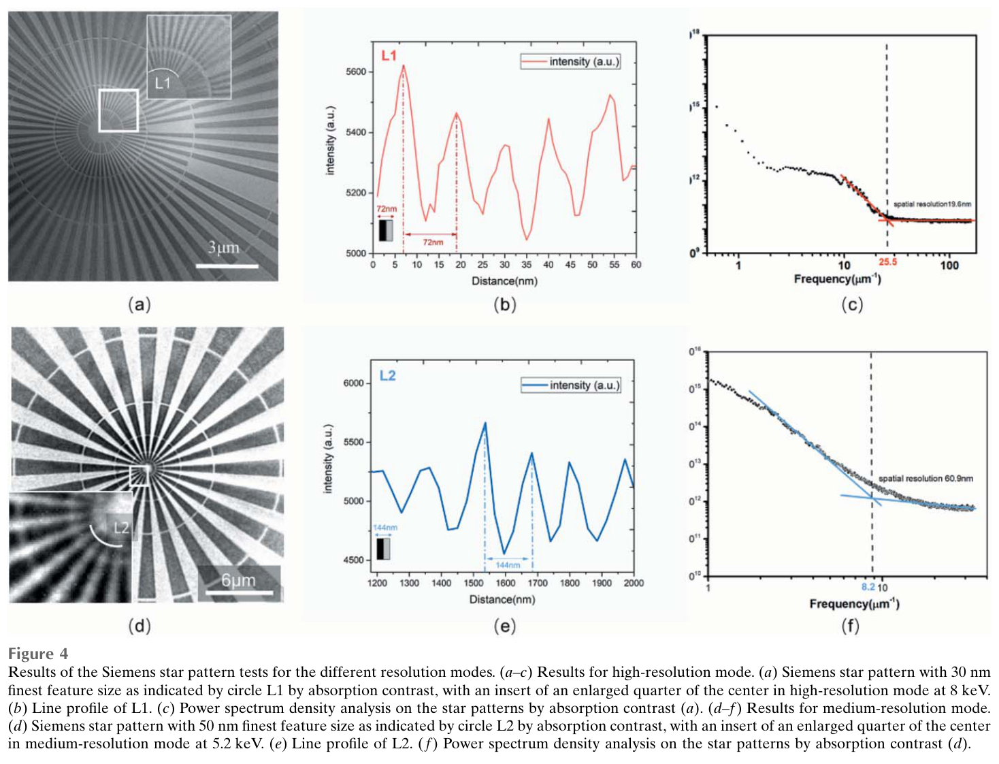
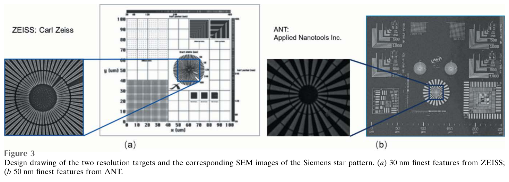
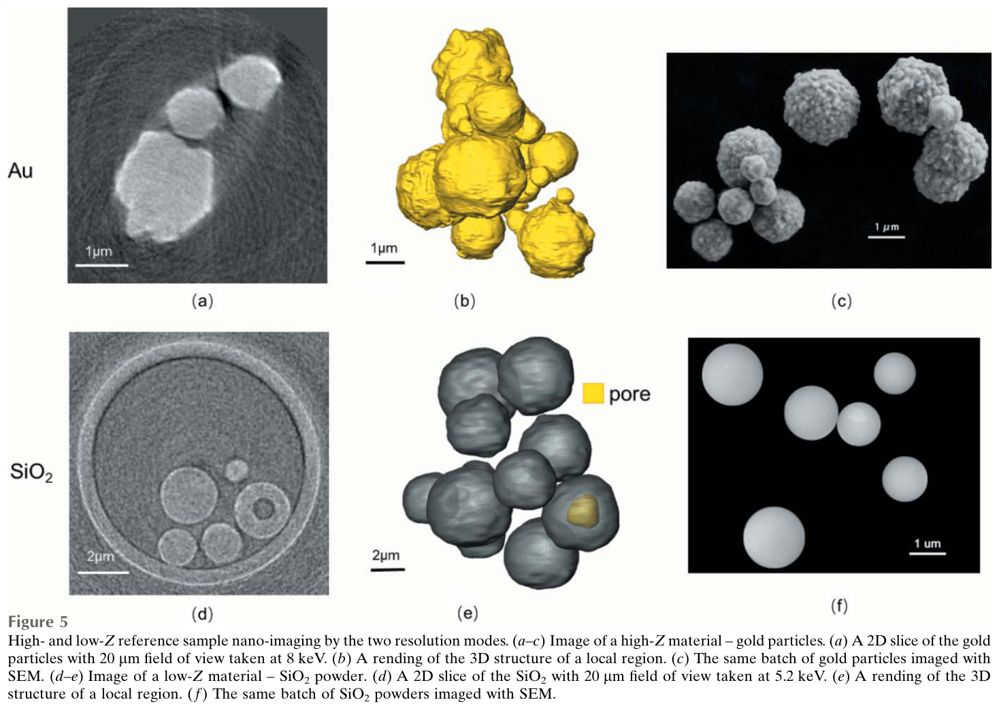
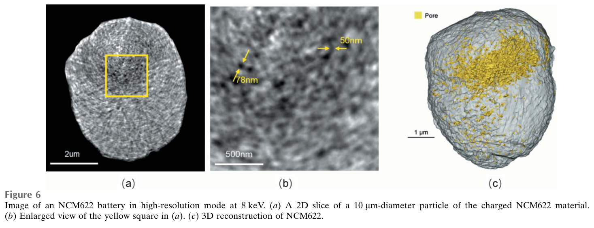

---
tags:
  - papers/X-ray-nano-tomography
  - facilities/SSRF
aliases:
  - "SSRF dual-mode nano-CT 2023"
  - "Full-field hard X-ray nano-tomography at SSRF"
date: 2023
doi: 10.1107/S1600577523003168
---

# Full-field hard X-ray nano-tomography at SSRF

## 核心信息

- 标题: Full-field hard X-ray nano-tomography at SSRF
- 标题翻译: 上海光源全场硬 X 射线纳米断层成像
- 作者: Fen Tao, Jun Wang, Guohao Du, Bo Su, Ling Zhang, Chen Hou, Biao Deng, Tiqiao Xiao
- 机构: 中国科学院上海高等研究院上海同步辐射光源；中国科学院上海应用物理研究所；中国科学院大学
- 发表时间: 2023
- 发表渠道: Journal of Synchrotron Radiation, 30, 815–821
- DOI: 10.1107/S1600577523003168
- 论文链接: [DOI](https://doi.org/10.1107/S1600577523003168)
- 论文类型: 双模式全场硬 X 射线 nano-CT 系统与应用验证论文

## 原文摘要翻译

上海同步辐射光源 BL18B 线站研制并完成调试了一套自主设计的透射 X 射线显微仪器。BL18B 是一条新建的 5–14 千电子伏硬 X 射线弯转磁铁线站，透射显微成像空间分辨率优于 20 纳米。系统具有两种分辨率模式：一种采用面向高分辨率的闪烁体—透镜耦合相机，另一种采用面向中等分辨率的 X 射线科学级互补金属氧化物半导体相机。本文用两种模式展示了高原子序数材料样品（如金颗粒和电池颗粒）及低原子序数材料样品（如二氧化硅粉末）的全场硬 X 射线纳米断层成像，并称三维分辨率达到亚 50 纳米至 100 纳米。这些结果表明，该系统能够以纳米尺度空间分辨率对多类科学样品开展三维无损表征。

## 创新点

1. **把极限分辨率和实验效率拆成两个可切换工作点。** 高分辨模式使用 25 纳米外环 FZP 与闪烁体—光学透镜耦合探测链；中分辨模式使用 40 纳米外环 FZP 与直接 X 射线相机，使用户可按样品、能量和时间预算选择，而非默认追求最小二维线宽。
2. **首次在该线站把二维调试推进到真实三维样品演示。** 论文分别用高 \(Z\) 金颗粒、低 \(Z\) 二氧化硅颗粒和电池正极二次颗粒验证三维重建、内部孔洞识别与裂纹分割。
3. **中分辨模式兼顾低能低 \(Z\) 成像和分钟级采集。** 在 8 千电子伏时可将单投影曝光降到 0.3 秒、完整 CT 降到约 1–2 分钟；在 5.2 千电子伏时用 5 秒曝光即可对约 13% 吸收的二氧化硅成像。
4. **从形貌展示走向初步三维定量。** 对 NCM622 单颗粒内部裂纹网络进行灰度分割，报告裂纹体积、颗粒体积和 2.5% 孔隙率，建立了能源材料应用入口。

## 一句话总结

BL18B 在本文中真正完成了“双模式二维计量＋高/低 \(Z\) 样品三维重建＋电池裂纹初步定量”的跨越，但 19.6/60.9 纳米是二维靶标分辨率，10/29 纳米是有效像素，摘要所称亚 50–100 纳米三维分辨率缺少独立的频率壳相关（FSC）或三维调制传递函数（3D-MTF）验收。

## 研究问题

### 从二维验收到三维应用

2022 年调试论文已经证明线站能区、单色性、通量和二维 20 纳米指标达标，但用户真正需要的是：样品能否旋转采集、投影能否稳定重建、低 \(Z\) 内部结构能否在合理曝光下显现、定量结果能否对应真实形貌。本文以三类样品回答“系统是否已具备可用 nano-CT 链路”，而不再只回答“靶标是否可分辨”。

### 分辨率、低能效率与时间的冲突

更小的 FZP 外环和更细物方采样能够扩展空间频率，却会牺牲光子利用率、视场和扫描速度；在 5–6 千电子伏，空气吸收和闪烁体—光学耦合探测效率又使高分辨模式不可用。论文的第二个问题因此是：是否能以中分辨模式主动让出部分二维分辨率，换取低能低 \(Z\) 对比、分钟级 CT 和更低剂量潜力。

## 数据与任务定义

### 三层验证任务

| 层次 | 样品 | 目的 | 主要证据 |
|---|---|---|---|
| 二维计量 | 30 纳米半节距 ZEISS 金 Siemens 星；50 纳米半节距 ANT 金 Siemens 星 | 分别标定高、中分辨模式 | 线剖面、径向功率谱截止频率、视场 |
| 三维参考样品 | 0.5–3 微米金颗粒；二氧化硅粉末 | 验证高 \(Z\) 高分辨与低 \(Z\) 低能重建可靠性 | 重建切片、三维渲染、同批样品 SEM 形貌 |
| 初始科学应用 | 充电态 NCM622 正极二次颗粒 | 识别和量化内部裂纹 | 180 幅投影、阈值分割、裂纹体积与孔隙率 |

三个任务的评价口径不同：Siemens 星是二维频域计量；金和二氧化硅是三维可重建性演示；NCM622 是单颗粒定量案例。不能用其中一个层次的数字替代另一个层次。

### 三维采集协议

| 样品与模式 | 能量 | 有效像素 | 角度与投影 | 单投影曝光 | 论文给出的结果 |
|---|---:|---:|---|---:|---|
| 金颗粒，高分辨 | 8 千电子伏 | 10 纳米 | 0–180°，1° 步进，共 180 幅 | 5 秒 | 总采集约 20 分钟；粗糙表面与颗粒形貌可见 |
| 二氧化硅，中分辨 | 5.2 千电子伏 | 29 纳米 | 0–180° 等角，共 180 幅 | 5 秒 | 玻璃管壁和约 0.8 微米内部孔洞可见 |
| NCM622，高分辨 | 8 千电子伏 | 文中该实验未单列 | 0–180°，共 180 幅 | 5 秒 | 中心起裂、向外分叉的裂纹网络及体积定量 |

中分辨模式“0.3 秒/幅、1–2 分钟/套”是 8 千电子伏下的能力描述；二氧化硅低能实验实际使用 5 秒/幅，二者不能合并为同一实验条件。

## 方法主线

### 机制流程

1. **输入与照明：** 5–14 千电子伏单色 X 射线经 BL18B 光束线送入椭球单毛细管，生成约 15 微米聚焦光斑和带中央挡块的空心锥照明。
2. **旋转投影与模式选择：** 样品固定在低跳动气浮旋转台并由二维位移台定心；根据目标分辨率、能量和速度，切换 25/40 纳米外环 FZP 以及相应探测器。
3. **放大采集：** FZP 将每个角度的透射投影放大到高分辨闪烁体—透镜相机或中分辨直接 X 射线相机，低真空管降低长光路空气衰减。
4. **输出与分析：** 角度序列经过配准和断层重建得到三维体；参考样品在 Avizo 中渲染，NCM622 进一步按灰度阈值分割为颗粒骨架与内部裂纹网络。

### 两个 FZP—探测器工作点

| 参数 | 高分辨模式 | 中分辨模式 |
|---|---:|---:|
| FZP 最外环 / 焦距（8 千电子伏） | 25 纳米 / 20.2 毫米 | 40 纳米 / 25.8 毫米 |
| 探测链 | 100 微米厚 LUAG 闪烁体、2×/4×/10×物镜、水冷相机 | Hamamatsu 直接光纤耦合 X 射线相机 |
| 几何放大倍率 | 约 500–1030 倍 | 约 145–185 倍 |
| 物方有效像素 | 约 6–13 纳米 | 约 30 纳米 |
| Siemens 星二维分辨率 | 19.6 纳米 | 60.9 纳米 |
| 靶标视场宽度 | 约 13 微米 | 约 20 微米 |
| 典型时间能力 | 3–10 秒/幅；CT 至少 20–30 分钟 | 8 千电子伏可达 0.3 秒/幅；CT 约 1–2 分钟 |
| 低能成像 | 5–6 千电子伏不可用 | 5.2 千电子伏、5 秒/幅可用于低 \(Z\) 样品 |

这里最重要的关系不是“像素越小等于分辨率越高”，而是像素、FZP 传递频率、信噪比、机械稳定和角度采样共同决定可恢复结构。论文用二维径向功率谱对 FZP—探测器组合做了可观测分辨率验收。

### 二维频域分辨率

径向功率谱截止频率 \(f_c\) 与半周期分辨率的关系为

$$
\delta_{\mathrm{2D}}=\frac{1}{2f_c}.
$$

高分辨模式在 8 千电子伏、30 秒曝光下得到 \(f_c=25.5~\mu\text{m}^{-1}\)，对应 19.6 纳米；中分辨模式在 5.2 千电子伏、10 秒曝光下得到 \(f_c=8.2~\mu\text{m}^{-1}\)，对应 60.9 纳米。

### 重建和裂纹分割

论文给出了投影数、角度和曝光，但没有说明具体断层重建算法、滤波器和正则化参数。三维形貌在 Avizo Fire 中渲染；NCM622 内部低灰度区域按阈值分割为裂纹。由此得到的孔隙率为

$$
\phi=\frac{V_{\mathrm{crack}}}{V_{\mathrm{particle}}}
=\frac{1.9}{75.4}\approx2.5\%.
$$

该计算本身清楚，但误差取决于配准、重建伪影和阈值选取，正文没有给出阈值敏感性或重复分割者差异。

## 关键结果

### 两种模式的二维计量

*论文原图编号：Figure 4。高分辨与中分辨模式的 Siemens 星图像、线剖面和径向功率谱，直接支撑 19.6 纳米与 60.9 纳米二维吸收成像分辨率。*

高分辨模式在较小的 13 微米视场和 30 秒靶标曝光下得到 19.6 纳米；中分辨模式以 20 微米视场和 10 秒曝光得到 60.9 纳米。两者分别证明“双模式可达到的二维工作点”，不是同一能量、同一探测器和同一剂量下的严格公平比较。

### 高、低原子序数参考样品

金颗粒在 8 千电子伏下估算吸收为 33%–70%，高分辨模式重建出 0.5–3 微米颗粒及约 0.3–1 微米表面起伏。二氧化硅在 5.2 千电子伏下、2 微米颗粒估算吸收约 13%，中分辨模式无需额外对比增强算法即可显示玻璃管壁和约 0.8 微米内部空腔。两组形貌与同批样品 SEM 定性相符，证明了高/低 \(Z\) 三维成像可行性。

### NCM622 裂纹定量

充电态颗粒的重建切片显示内部纳米尺度低密度区，三维分割后裂纹从颗粒中心起始并向外分叉。论文报告裂纹体积 1.9 立方微米、颗粒体积 75.4 立方微米、孔隙率 2.5%。这证明系统可以从“看见裂纹”推进到单颗粒体积分数估计，但还不能据此建立循环寿命或材料体系的统计规律。

## 深度分析

### 双模式的价值是形成 Pareto 前沿

高分辨模式不是在所有任务上都更优：它在 5–6 千电子伏受到空气衰减和探测效率限制，完整 CT 至少 20–30 分钟。中分辨模式放宽到 60.9 纳米二维分辨率，却获得更大视场、低能低 \(Z\) 可用性以及 8 千电子伏下约十倍以上的速度收益。对辐射敏感、需要动态过程或大批量颗粒统计的任务，中分辨模式可能提供更高科学产出。

*论文原图编号：Figure 3。两种 Siemens 星的设计与 SEM 实测形貌；它说明双模式使用了不同厚度和半节距的校准靶，不能忽略靶标本身对吸收与截止频率的影响。*

### 三维演示证据已经成立，但三维计量尚未闭环

*论文原图编号：Figure 5。金颗粒和二氧化硅的重建切片、三维渲染及同批 SEM 对照，证明高、低 \(Z\) 样品都能形成可解释的三维体。*

论文确实展示了三维切片、表面渲染和内部孔洞，因此“能做三维 nano-CT”不是未来设想。问题在于摘要的“亚 50 纳米至 100 纳米三维分辨率”没有对应 FSC、3D-MTF、边缘扩展或已知三维标准结构。SEM 也只是同批颗粒的形貌对照，不是同一颗粒、同一坐标的逐体素真值。最稳妥的表述是：三维纳米结构演示成立，严格的三维分辨率数值尚未独立验收。

### 180 幅投影的角度采样压力

经典均匀角采样的粗略量级可写为

$$
N_\theta\gtrsim\frac{\pi D}{2d},
$$

其中 \(D\) 为重建对象直径，\(d\) 为目标分辨率。若对象直径为 6 微米、目标为 50 纳米，估算约需 188 个角度，与本文 180 幅接近；若试图在 13–20 微米全视场范围内兑现 20–50 纳米各向同性分辨率，则所需角度会明显增加。这不是对本文重建失效的直接证明，因为实际对象尺寸、稀疏性和算法都会改变要求，但说明“细像素＋180 幅”不能自动推出同等三维分辨率。

### 电池应用从展示到计量还差什么

*论文原图编号：Figure 6。NCM622 切片、50/78 纳米局部孔隙标注和三维裂纹网络，展示单颗粒内部裂纹的空间定位与体积分数计算。*

单颗粒 2.5% 孔隙率是有价值的能力示范，但分割阈值、环伪影、有限角重建和噪声都会改变细裂纹连通性与体积。要把它升级为材料结论，需要同一状态多颗粒统计、不同循环状态对照、阈值敏感性、重复重建和不确定度区间。

### 相对 2022 工程调试的增量

[[2022_Design_development_commissioning_BL18B|2022 年 BL18B 调试论文]]完成“能区—单色性—通量—二维分辨率”验收；本文进一步完成“旋转采集—三维重建—低 \(Z\) 条件—裂纹分割”演示。这是从建成线站到科研应用的实质跨越，也是上海光源 nano-CT 路线中第一篇需要作为三维成果而非仅硬件成果阅读的论文。

## 局限

1. **缺少独立三维分辨率计量。** 摘要给出亚 50–100 纳米三维表述，但正文没有 FSC、3D-MTF 或三维标准样品验收。
2. **角度采样偏少且算法信息不全。** 三类样品均使用 180 幅投影；重建算法、配准流程、滤波和正则化参数没有展开，难以复现实验质量。
3. **高分辨模式速度与低能效率受限。** CT 至少 20–30 分钟，且论文明确称 5–6 千电子伏成像不可行。
4. **剂量与辐射损伤未量化。** 两种模式的速度差被讨论，但数据中不含样品吸收剂量或重复扫描前后变化。
5. **SEM 对照不是空间配准真值。** 使用同批样品只能支持形貌量级一致，不能量化重建偏差。
6. **NCM622 结论来自单颗粒。** 孔隙率没有置信区间，阈值敏感性和颗粒间差异未知。
7. **模式对比不是同条件实验。** 两种靶标厚度、能量、曝光和探测链均不同，无法把结果差异完全归因于 FZP 或探测器中的某一项。

## 我的笔记

### 应统一使用的 nano-CT 性能表

后续论文或路线验收必须把以下九项放在同一行：能量、样品材料/厚度、FZP、有效像素、二维 MTF/PSD、三维 FSC/3D-MTF、视场、投影数与曝光、总时间与剂量。本文已经覆盖大半字段，最关键缺口是三维分辨率和剂量。

### 下一步优先实验

1. 用同一三维纳米标准样品分别测试两种模式的 FSC、方向依赖分辨率和重复扫描一致性。
2. 在相同吸收剂量预算下比较两种模式的三维对比噪声比（CNR）、分辨率和总时间，绘制真实 Pareto 前沿。
3. 将投影数从 180 系统增加，观察 50–100 纳米裂纹体积和连通性何时收敛。
4. 对 NCM622 做多颗粒、不同循环状态和盲法阈值分割，报告孔隙率置信区间。
5. 对低 \(Z\) 样品加入 Zernike 相衬或相位恢复，检验能否在更高能量或更低剂量下保持重建质量。

## 引用

- Tao, F., Wang, J., Du, G., et al. “Full-field hard X-ray nano-tomography at SSRF.” *Journal of Synchrotron Radiation* 30, 815–821 (2023). [DOI](https://doi.org/10.1107/S1600577523003168)
- [[2022_Design_development_commissioning_BL18B|Tao et al., 上海同步辐射光源纳米三维成像线站设计、研发及调试 (2022)]]
- Ge, M. Y., Coburn, D. S., Nazaretski, E., et al. “One-minute nano-tomography using hard X-ray full-field transmission microscope.” *Applied Physics Letters* 113, 083109 (2018).
- Jiang, Z., Li, J., Yang, Y., et al. *Nature Communications* 11, 2310 (2020).（论文用作电池裂纹表征背景）
