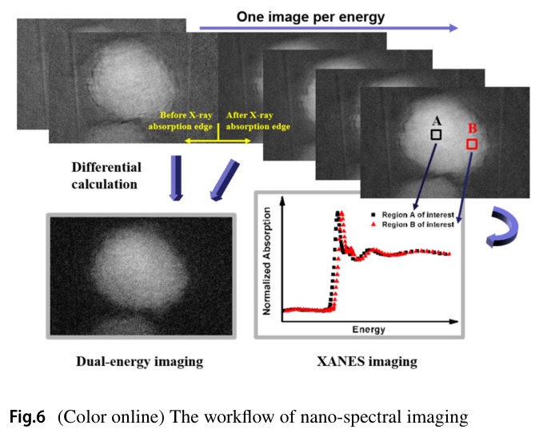
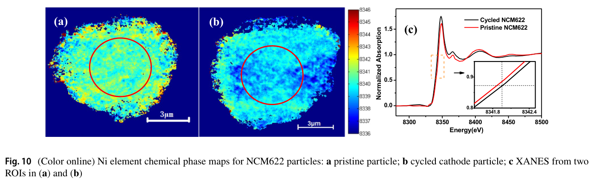

---
tags:
  - papers/X-ray-nano-tomography
  - facilities/SSRF
aliases:
  - "SSRF BL18B platform 2023"
  - "The 3D nanoimaging beamline at SSRF"
date: 2023-12-12
doi: 10.1007/s41365-023-01347-4
---

# The 3D nanoimaging beamline at SSRF

## 核心信息

- 标题: The 3D nanoimaging beamline at SSRF
- 标题翻译: 上海光源三维纳米成像光束线
- 作者: Ling Zhang, Fen Tao, Jun Wang, Ruo-Yang Gao, Bo Su, Guo-Hao Du, Ai-Guo Li, Ti-Qiao Xiao, Biao Deng
- 机构: 中国科学院上海高等研究院上海同步辐射光源
- 发表时间: 2023-12-12
- 发表渠道: Nuclear Science and Techniques, 34, 201
- DOI: 10.1007/s41365-023-01347-4
- 论文链接: [DOI](https://doi.org/10.1007/s41365-023-01347-4)
- 数据 / 资源: [Science Data Bank 开放数据](https://doi.org/10.57760/sciencedb.13606)
- 论文类型: 三维纳米成像光束线与多模态平台论文

## 原文摘要翻译

全场透射 X 射线显微镜是一种具有纳米尺度空间分辨率的强大无损三维成像方法，已在世界多数同步辐射装置中得到应用。上海同步辐射光源 BL18B 三维纳米成像线站建设了一套自主设计的全场透射显微系统。该线站工作于 5–14 千电子伏，可实现 20 纳米空间分辨率成像。本文详细介绍了光束线的表征结果，并展示了透射显微、纳米计算机断层成像和纳米谱学成像的性能。

## 创新点

1. **把光源、光学、终端、控制和重建写成一条完整平台链。** 论文不仅重复 20 纳米指标，而是交代弯铁、CM/DCM/TM、次级光源、单毛细管、双 FZP、双探测器、EPICS 控制和后处理如何共同支持用户实验。
2. **用 shaker 补偿照明相空间不匹配。** 单毛细管产生空心锥；其下方快速扫描机构扩展样品照明角，使垂直发射度不足时仍能更充分填充 FZP 数值孔径。
3. **将无标记 CT 配准和重建软件纳入线站能力。** 基于特征图的自动投影配准、AduRecon、抖动校正、相位恢复和环伪影抑制形成从角度序列到三维体的自主数据链。
4. **把能量—焦距联动嵌入 XANES 采集控制。** 软件根据两个清晰能点插值各能量处 FZP 位置，同步驱动单色器、物镜和样品进出，并用 TXM-Wizard 完成倍率、配准、参考和归一化校正。
5. **提供可复核的开放数据与明确升级项。** 作者公开了线站实验数据，并在结论中点名束斑位置反馈和 FZP 角度电机，给出了可直接转化为工程任务的短板。

## 一句话总结

这篇论文的核心增量是把 BL18B 从“达到 20 纳米二维指标、可以做 nano-CT”提升为“TXM—无标记 CT—二维 XANES—统一控制—自主重建—开放数据”的一体化用户平台；其中 30 纳米/像素仍是 CT 采样间隔，不是经独立方法证明的三维分辨率。

## 研究问题

### 如何把设备集合变成用户平台

纳米成像实验不仅需要足够亮和单色的光，还需要稳定样品照明、可切换探测、旋转定心、自动采集、投影配准、伪影校正和可复用软件。任一环节失配都会使 20 纳米物镜潜力无法转化为用户数据。本文试图回答：BL18B 的各层是否已经形成可重复执行的完整工作流。

### 如何联合表征结构与化学态

常规 TXM 和 CT 给出形貌与内部孔裂纹，XANES 给出吸收边随空间的变化。要把二者联合起来，能量扫描时必须补偿 FZP 焦距和放大倍率变化，还要为每个能点采样参考图并校正漂移。因此，多模态能力的难点不仅在谱线拟合，也在运动控制、参考采集和图像配准。

## 数据与任务定义

### 四项调试与应用任务

| 任务 | 对象与条件 | 输出 | 正确证据层级 |
|---|---|---|---|
| 二维 TXM 分辨率 | 30 纳米 Siemens 星；8 千电子伏；30 秒 | 功率谱截止每微米 25 周期，对应 20 纳米 | 二维吸收成像分辨率 |
| 低能生物样品稳定性观察 | 脱水兔骨；5.5 千电子伏；相隔一小时两幅图 | 外观未见明显变化；样品点通量约 \(1.26\times10^{10}\) 光子/秒 | 定性图像观察，不是剂量学安全证明 |
| 无标记 nano-CT | 50 次循环 NCM622；8.6 千电子伏；180 幅；1 秒/幅 | 约 6 分钟数据集、三维裂纹和 30 纳米/像素图像 | CT 流程与采样结果，不是 30 纳米三维分辨率 |
| 二维 TXM-XANES | 原始与 50 次循环 NCM622；Ni K 边 8.2–8.6 千电子伏 | 逐像素谱、吸收边伪彩图和内外区域差异 | 相对边位空间映射，不是绝对价态计量 |

### 平台输入输出

输入包括单色光能量、样品类型、目标视场/分辨率、角度序列或能量序列，以及两能点焦距标定。输出分别是二维投影、三维重建体、双能元素差分图或逐像素 XANES 谱。控制系统要把这些参数编排为自动运动和采集序列，后处理软件再把原始图像转化为可解释的结构或化学态分布。

## 方法主线

### 机制流程

1. **输入与相空间整形：** 3.5 吉电子伏、1.27 特斯拉弯铁产生 X 射线；CM 准直并抑制高次谐波，硅（111）DCM 选择能量，TM 把光束送到 39 米处的次级光源狭缝。
2. **终端照明与模式选择：** 单毛细管将次级光源成像到样品并形成空心锥，shaker 扩展照明角；100/150 微米针孔滤除未聚焦直透光，样品由高精度位移和气浮转台定位。
3. **放大、旋转或能量扫描：** 25/40 纳米外环 FZP 与双探测器生成二维投影；CT 模式旋转样品，XANES 模式则联动单色器、FZP 焦距和样品进出以获得样品图及参考图。
4. **输出与计算：** EPICS 和自研界面完成自动采集；CT 数据经特征图配准与 AduRecon 重建，谱学图像经 TXM-Wizard 做倍率、错位、参考和归一化校正，输出三维结构或逐像素吸收谱。

### 光源到次级光源

线站接受角为 0.4 毫弧度×0.22 毫弧度。8 千电子伏时，作者估算源亮度为 \(6.48\times10^{15}\) 光子/秒/0.1% 带宽/平方毫米/平方毫弧度，总通量为 \(1.19\times10^{13}\) 光子/秒/0.1% 带宽。柱面准直镜、双晶单色器和超环面聚焦镜分别位于距源 20.2、23、26 米处，超环面镜将光束聚焦到 39 米的次级光源狭缝，标称焦斑约 100 微米×290 微米。

该光路被分成“源到次级源”的横纵近独立相空间段和“次级源到探测器”的轴对称显微段。设计目标不是最大化某一个镜面通量，而是在能量分辨率、高次谐波抑制和单毛细管接受效率之间保持匹配。本文给出的设计样品通量为 \(1.3\times10^{10}\) 光子/秒，设计能量分辨率为 \(2\times10^{-4}\)。

> [!figure] Fig. 2 BL18B 光束线总体布局
> 建议位置：方法主线
> 放置原因：该图连接弯铁、CM、DCM、TM、次级光源、单毛细管、样品和探测器，是理解两段相空间设计的总图。
> 当前状态：保留占位；人工复核发现候选仅含页眉、题注和布局图最上缘，主体被严重截断。

### TXM 终端与深度约束

单毛细管距 SSA 约 2 米，带上游 beam stop 以形成空心锥。系统使用两套铱 FZP：最外环 25/40 纳米、直径 125/150 微米、结构厚度分别大于 0.7/0.9 微米；器件来自 XRnanotech。双探测器均为 \(2048\times2048\)，物理像素 6.5 微米，其中高分辨探测器含闪烁体、2×/4×/10×光学物镜并可沿 1.3 米导轨移动。

样品厚度需落在 FZP 景深内。论文采用

$$
\mathrm{DOF}=\pm\frac{\lambda}{2\mathrm{NA}^2}
=\pm\frac{2(\Delta r)^2}{\lambda},
$$

其中 \(\lambda\) 为波长、\(\mathrm{NA}\) 为数值孔径、\(\Delta r\) 为 FZP 最外环宽。粉末被吹附到拉伸玻璃毛细管，块体样品则可用聚焦离子束切割后固定在针尖，以减小超出景深造成的失焦。

> [!figure] Fig. 3 TXM 终端实物与部件标注
> 建议位置：方法主线
> 放置原因：该图原本同时标出单毛细管、针孔、样品、FZP、两套探测器、在线望远镜和真空管，是检查终端链完整性的关键视觉。
> 当前状态：保留占位；人工复核发现候选只剩实物照片下缘、题注和右栏正文，无法辨识完整部件。

### 自动 CT 数据链

样品在气浮台上旋转后，角度投影先进入基于生成特征图的自动配准算法，再由 AduRecon 处理。论文列出的处理能力包括数据抖动校正、相位恢复和环伪影抑制。“无标记”表示配准不依赖额外放置的标记颗粒，并不表示无需旋转轴校准、图像质检或异常投影处理。

### 纳米谱学与能量—焦距联动

双能成像只在目标吸收边前后各采一幅图，差分突出目标元素；XANES 则在能量轴上采集图像堆栈。后者的处理顺序是：多幅平均降低振动噪声，参考图校正，低能图像倍率和错位校正，逐像素生成并归一化吸收谱，再确定吸收边位置。

*论文原图编号：Fig. 6。双能差分与逐能点 XANES 成像的工作流，展示从能量序列、ROI 到元素分布和吸收谱的两条输出路径。*

FZP 焦距随能量近似线性变化。用户先在两个能点取得清晰图像，软件据其 FZP 坐标、扫描范围和步长插值每个能点的位置；采集时单色器与 FZP 联动，样品进出以分别获得投影和参考。这个控制闭环是谱学图像能否可靠配准的基础。

## 关键结果

### 光束线与二维 TXM

| 指标 | 条件 | 结果 | 边界 |
|---|---|---:|---|
| 工作能区 | 线站 | 5–14 千电子伏 | 平台范围 |
| 源通量 | 8 千电子伏、0.1% 带宽 | \(1.19\times10^{13}\) 光子/秒 | 估算源端值，不是样品值 |
| 样品点通量 | 5.5 千电子伏 | \(1.26\times10^{10}\) 光子/秒 | 与 8 千电子伏设计值能量不同 |
| 二维分辨率 | 8 千电子伏、30 秒、Siemens 星 PSD | 20 纳米 | 二维投影，不是 CT 三维分辨率 |

值得注意的是，2022 调试论文用 \(5\times10^{-4}\) 作为 8 千电子伏 FZP 成像的能量分辨率设计门槛，本篇把设计值写为 \(2\times10^{-4}\)，并明确把更高单色性与谱学成像需求联系起来。两者可能代表不同验收层级或规格版本，路线汇总时应保留来源，而不是静默合并。

### 六分钟无标记 nano-CT

50 次循环 NCM622 在 8.6 千电子伏下采集 180 幅投影，每幅曝光 1 秒，完整数据约 6 分钟。AduRecon 重建显示颗粒内部有延伸裂纹，论文称图像为 30 纳米/像素。180 秒纯曝光和约 360 秒总时间之间的差额包含转动、读出及其他流程开销，但文章没有进一步拆分。

### 二维 Ni K 边谱学

原始颗粒的 Ni 吸收边空间分布较均匀；50 次循环颗粒内部区域的吸收边低于外部区域，中心 ROI 的谱线也显示两颗粒边位差异。这证明系统能够形成逐像素相对边位图，但没有标准价态样品、绝对能量误差或配位拟合，不能把伪彩图直接解释为精确 Ni 价态。

### 兔骨辐射稳定性观察

脱水兔骨在 5.5 千电子伏、样品点约 \(1.26\times10^{10}\) 光子/秒下，相隔一小时的两幅吸收图未见明显外观变化。该结果说明实验期间没有出现肉眼可见的大尺度形貌破坏；由于剂量、重复样本和化学/力学指标缺失，它不能证明生物样品“无辐射损伤”。

## 深度分析

### 论文的真正贡献是平台地图

[[2022_Design_development_commissioning_BL18B|2022 年调试论文]]回答四项工程指标是否达标，[[2023_Full-field_hard_X-ray_nano-tomography_SSRF|同年 JSR 论文]]更详细地展示双模式高/低 \(Z\) 三维数据。本文的新增价值是把光束线、终端、无标记配准、AduRecon、EPICS、谱学采集和开放数据组合成同一平台说明书。因此，它不应被重复计作又一次“20 纳米纪录”，而应被标为“用户系统与多模态能力节点”。

### 30 纳米/像素不是三维分辨率

> [!figure] Fig. 9 循环 NCM622 的三维重建与切片
> 建议位置：深度分析
> 放置原因：该图是六分钟无标记 CT 的主要结构证据，可用于检查裂纹是否在三维体和切片中同时成立。
> 当前状态：保留占位；当前候选未通过视觉质量门，无法稳定恢复为可独立解释的完整原图。

像素给出采样间隔，二维 PSD 给出平面内可传递频率，而三维分辨率还受角度数、旋转误差、配准、信噪比和重建算法影响。本文没有 FSC、3D-MTF 或三维标准结构，因此只能说六分钟流程生成了 30 纳米/像素的重建图，不能说已证明 30 纳米各向同性三维分辨率。

### 控制层决定谱学地图是否可信

*论文原图编号：Fig. 10。原始与 50 次循环 NCM622 的 Ni K 边伪彩分布和中心 ROI 谱线，展示 8.2–8.6 千电子伏扫描得到的空间边位差异。*

能量扫描会同时改变波长、FZP 焦距、几何放大率和束斑位置。若只在后处理中配准而不在采集层跟焦，样品细节可能随能量失焦，产生伪边位。BL18B 将两点焦距标定、逐能点物镜运动、参考图和样品进出纳入同一自动程序，这是本文最值得复用的谱学工程思想。其剩余风险是束斑反馈尚待升级，能量漂移和位置漂移仍可能耦合到化学相图。

### 作者提出的升级项也是现状证据

结论明确提出升级 X 射线束斑位置反馈/校正，并为 FZP 增加角度调节电机。它们说明当前平台的已知短板集中在长时和能量扫描稳定性、物镜对准与可重复聚焦。短期路线应直接把“升级前后束斑漂移、配准残差、PSD 和边位误差”设为对照验收，而不能只完成硬件安装。

### 开放数据提高了可验证性

论文在 Science Data Bank 提供数据集 DOI `10.57760/sciencedb.13606`。这使外部团队有机会复核配准、重建和谱学图，而不仅依赖论文截图。后续若补充原始暗场/平场、能量标定、运动日志和处理参数，开放数据可进一步成为算法基准。

## 局限

1. **三维计量仍缺位。** nano-CT 示例只有 180 幅与 30 纳米/像素，没有独立三维分辨率、方向各向异性或重复扫描统计。
2. **六分钟时间未拆账。** 纯曝光约三分钟，总采集约六分钟，但旋转、读出、平场/暗场和参考图开销没有逐项记录。
3. **兔骨损伤证据仅为定性。** 两幅图“无明显变化”不包含吸收剂量、样本重复、化学损伤或力学功能指标。
4. **XANES 缺少绝对标定。** 没有价态标准、能量漂移不确定度、边位拟合误差或三维谱学结果。
5. **软件模块缺少同数据集对照。** AduRecon 和自动配准没有与替代算法比较重建分辨率、配准残差或运算时间。
6. **自主设计不等于全器件自主。** FZP 来自 XRnanotech，探测器和多类运动部件也有外部供应商。
7. **未来升级暴露稳定性短板。** 束斑反馈和 FZP 角度电机尚待补齐，长时谱学扫描的系统误差需重点评估。

## 我的笔记

### 平台应按六层验收

1. **光源/光学：** 通量、单色性、束斑位置和高次谐波。
2. **终端：** 照明均匀性、FZP 对准、旋转跳动和热/振动漂移。
3. **控制：** 运动同步、参考采集、异常恢复和日志完整性。
4. **重建：** 配准残差、3D 分辨率、伪影和计算时间。
5. **谱学：** 能量标定、跟焦误差、标准价态与误差传播。
6. **数据开放：** 原始数据、元数据、处理参数和可执行基准。

### 最优先的后续实验

1. 束斑反馈升级前后，在八小时班次和完整 XANES 扫描中测量位置漂移、PSD、配准残差与 Ni K 边误差。
2. 用同一 NCM622 数据做 FSC 或已知结构三维分辨率测试，明确 30 纳米/像素对应的真实三维能力。
3. 把六分钟 CT 分解为曝光、转动、读出、平场/暗场和软件开销，并报告剂量。
4. 为兔骨增加吸收剂量、重复样本和化学/力学损伤指标。
5. 用 Ni 标准化合物校准伪彩边位，报告绝对能量和价态误差。

## 引用

- Zhang, L., Tao, F., Wang, J., et al. “The 3D nanoimaging beamline at SSRF.” *Nuclear Science and Techniques* 34, 201 (2023). [DOI](https://doi.org/10.1007/s41365-023-01347-4)
- [[2022_Design_development_commissioning_BL18B|Tao et al., 上海同步辐射光源纳米三维成像线站设计、研发及调试 (2022)]]
- [[2023_Full-field_hard_X-ray_nano-tomography_SSRF|Tao et al., Full-field hard X-ray nano-tomography at SSRF (2023)]]
- Su, B., Gao, R.-Y., Tao, F., et al. “Dual U-Net based feature map algorithm for automatic projection alignment of synchrotron nano-CT.” *Nuclear Instruments and Methods in Physics Research A* 1040, 167242 (2022). [DOI](https://doi.org/10.1016/j.nima.2022.167242)
- [Science Data Bank: BL18B study data](https://doi.org/10.57760/sciencedb.13606)
