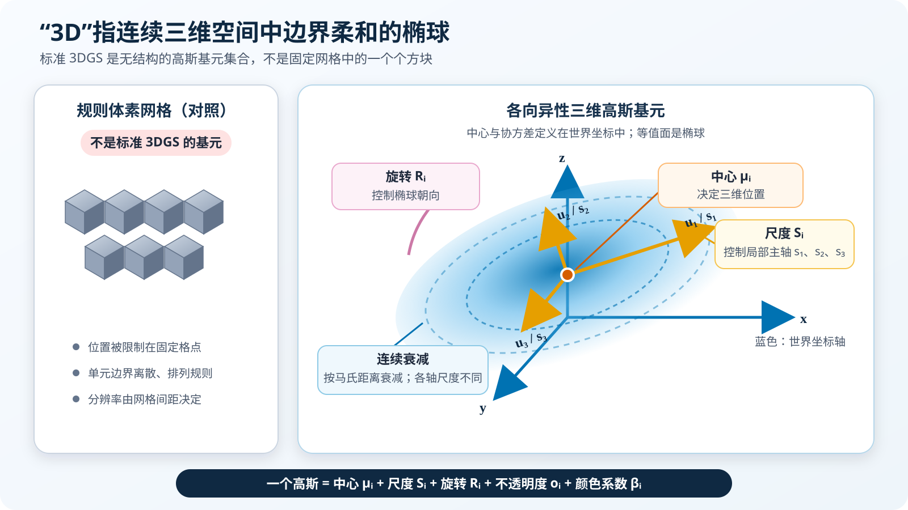
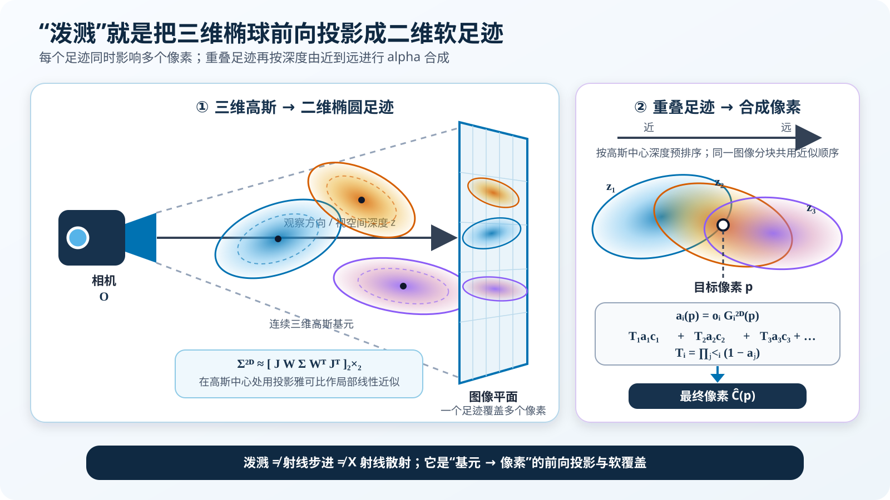
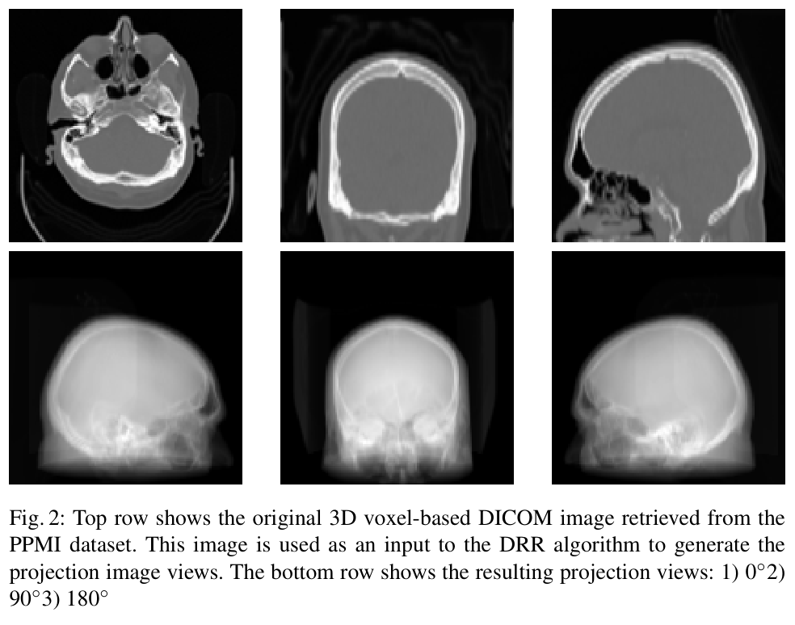
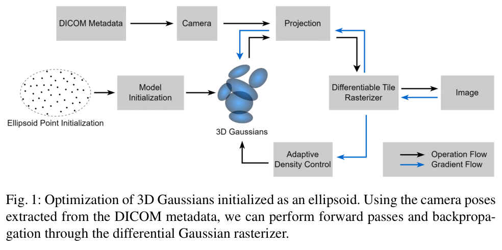
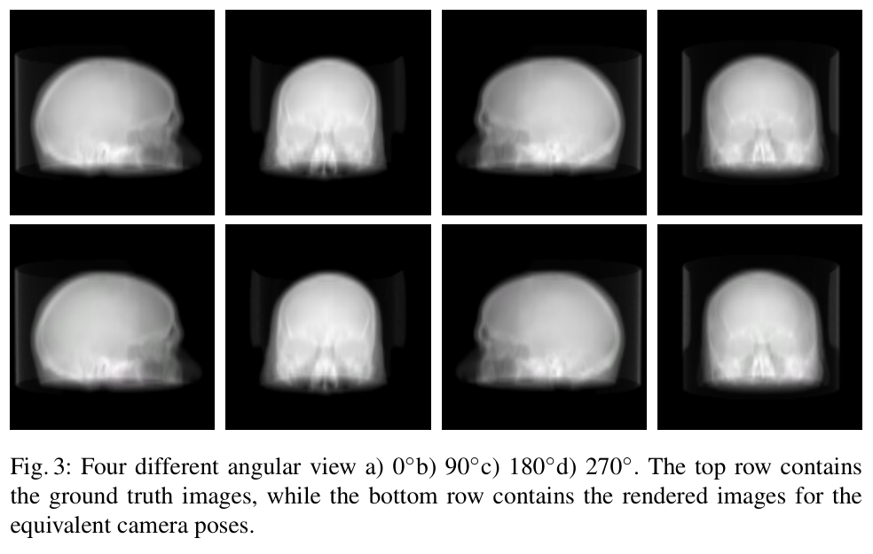
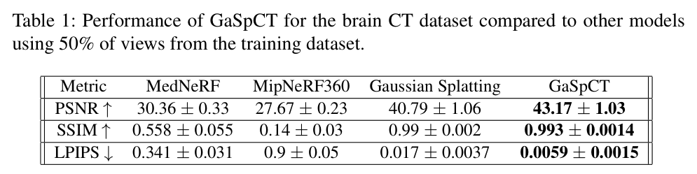
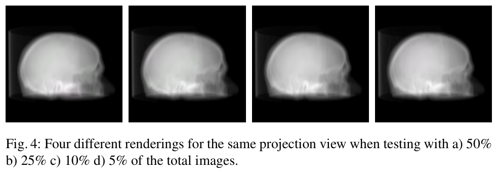
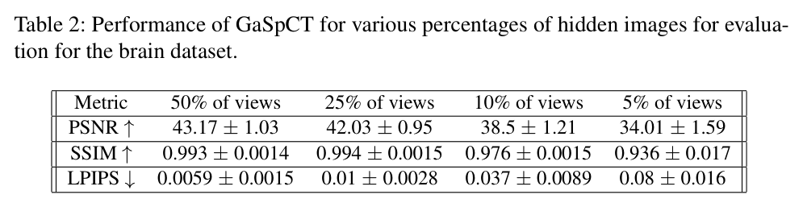

---
tags:
  - papers/CT
  - papers/medical-imaging
  - papers/3D-vision
aliases:
  - "GaSpCT"
  - "Gaussian Splatting for Novel CT Projection View Synthesis"
date: 2024-04-04
doi: 10.48550/arXiv.2404.03126
arxiv_id: 2404.03126
---

# GaSpCT：用于新颖 CT 投影视图合成的高斯泼溅

## 核心信息

- 标题: GaSpCT: Gaussian Splatting for Novel CT Projection View Synthesis
- 标题翻译: GaSpCT：用于新颖 CT 投影视图合成的高斯泼溅
- 作者: Emmanouil Nikolakakis、Utkarsh Gupta、Jonathan Vengosh、Justin Bui、Razvan Marinescu
- 机构: 加利福尼亚大学圣克鲁兹分校电气与计算机工程系、计算机科学与工程系
- 发表时间: 2024-04-04
- 发表渠道: arXiv 预印本
- DOI: 10.48550/arXiv.2404.03126
- arXiv: 2404.03126
- 论文链接: https://arxiv.org/abs/2404.03126
- 数据 / 资源: PPMI 去标识脑部 CT；Plastimatch 生成数字重建放射影像
- 论文类型: 医学成像人工智能方法论文

## 背景知识：怎样理解 3D Gaussian Splatting

> [!important] 先纠正一个容易混淆的术语
> 演示文稿中的“3D 高斯体素”是便于讲解的宽松说法。标准 `3DGS` 的基本单元不是固定网格中的体素，而是散布在连续三维空间、数量可增减的**各向异性高斯基元**。`GaSpCT` 也直接优化这种高斯集合；本文所对照的 `R²-Gaussian` 等后续 CT 方法才额外提供“把连续高斯场按需采样成规则体素块”的可微体素化器。

### “3D”指什么：一个边界柔和的三维椭球

第 $i$ 个高斯基元可写成

$$
G_i(\mathbf{x})=
\exp\!\left[-\frac{1}{2}
(\mathbf{x}-\boldsymbol{\mu}_i)^\mathsf{T}
\boldsymbol{\Sigma}_i^{-1}
(\mathbf{x}-\boldsymbol{\mu}_i)\right],
\qquad \mathbf{x},\boldsymbol{\mu}_i\in\mathbb{R}^3.
$$

其中，中心 $\boldsymbol{\mu}_i$ 决定它在三维世界中的位置；相同函数值的等值面是椭球。协方差通常参数化为

$$
\boldsymbol{\Sigma}_i
=\mathbf{R}_i\mathbf{S}_i\mathbf{S}_i^\mathsf{T}\mathbf{R}_i^\mathsf{T},
$$

对角尺度矩阵 $\mathbf{S}_i$ 控制椭球三条主轴的长短，旋转矩阵 $\mathbf{R}_i$ 控制朝向。每个高斯还带有不透明度 $o_i$ 和颜色参数。因此，“3D”指的是**位置、大小和朝向都定义在三维坐标中，并可从任意相机方向投影**，而不是“一个三维像素”。

| 参数 | 直观作用 |
|---|---|
| $\boldsymbol{\mu}_i$ | 把高斯移动到合适的三维位置 |
| $\mathbf{S}_i,\mathbf{R}_i$ | 改变椭球的大小、扁长程度和朝向 |
| $o_i$ | 调整该基元对图像的可见贡献 |
| 球谐系数 $\boldsymbol{\beta}_i$ | 描述颜色随观察方向的平滑变化 |

*背景图甲（自绘示意）。左侧规则体素拥有固定格点和离散单元；右侧高斯由中心 $\boldsymbol\mu_i$、尺度 $\mathbf S_i$ 和旋转 $\mathbf R_i$ 定义，权重随马氏距离连续衰减。图中的椭圆是三维椭球的二维示意，不表示硬材料边界。依据原始 3DGS 论文第 4 页式（4）—（6）。*

### “泼溅”指什么：把三维椭球印到二维像素上

“泼溅”（splatting）可理解为“盖软印章”：渲染器不是沿每条射线密集采样，而是把每个三维高斯**向前投影**为图像平面上的二维椭圆高斯足迹，并把它的贡献散布到足迹覆盖的多个像素；它既不是液体飞溅，也不是 X 射线散射。若 $\mathbf{W}$ 是世界到相机的变换，$\mathbf{J}$ 是透视投影在高斯中心处的雅可比矩阵，则屏幕空间协方差近似为

$$
\boldsymbol{\Sigma}^{2D}_i
=\left[
\mathbf{J}\mathbf{W}\boldsymbol{\Sigma}_i
\mathbf{W}^{\mathsf T}\mathbf{J}^{\mathsf T}
\right]_{2\times2}.
$$

高斯按深度排序后，由前向后进行 alpha 合成：

$$
\begin{aligned}
\widehat{\mathbf C}(\mathbf p)
&=\sum_i T_i(\mathbf p)a_i(\mathbf p)\mathbf c_i(\mathbf d),\\
a_i(\mathbf p)&=o_iG_i^{2D}(\mathbf p),\\
T_i(\mathbf p)&=\prod_{j<i}\left[1-a_j(\mathbf p)\right].
\end{aligned}
$$

$a_i$ 表示第 $i$ 个高斯在像素 $\mathbf p$ 处的有效覆盖率，$T_i$ 表示光到达它之前尚未被前方高斯遮挡的比例。靠近椭圆中心、较不透明且位于前方的高斯通常贡献更大。这就是“高斯”与“泼溅”合起来生成一幅图像的过程。（依据原始 3DGS 论文第 3–6 页及 PPT 第 7–13、16 页。）

*背景图乙（自绘示意）。左侧把三维高斯通过相机投到图像平面，每个高斯形成跨越多个像素的二维软足迹；右侧展示同一像素处的重叠足迹如何按视空间深度由近到远合成。它不是沿射线密集采样，也不是 X 射线散射。依据原始 3DGS 论文第 3 页式（3）、第 4 页式（5）及第 6 页的光栅化流程。*

### 颜色和纹理如何由球谐函数近似

经典 3DGS 没有三角网格上的固定 `UV` 纹理图。每个高斯分别保存红、绿、蓝三组球谐系数，并根据单位观察方向 $\mathbf d$ 计算该方向下的颜色：

$$
\mathbf c_i(\mathbf d)=
\sum_{\ell=0}^{L}\sum_{m=-\ell}^{\ell}
\boldsymbol{\beta}_{i,\ell m}Y_\ell^m(\mathbf d).
$$

这些球面基函数是预先确定的，训练时只需学习展开系数。零阶项给出与方向无关的基础色，更高频带逐渐表达随视角平滑变化的亮度或高光。空间纹理主要来自**大量相邻高斯具有不同位置、尺度和基础色**；球谐函数主要补充视角依赖外观，并不能等同于完整材质模型。

原始 3DGS 常用 $\ell=0,1,2,3$ 共四个频带，即最高次数为 `3`、每个颜色通道 `16` 个基函数；演示文稿所写“最高 4 阶”应理解为“四个频带”。`GaSpCT` 正文没有明确报告自己采用的球谐次数。（依据原始 3DGS 论文第 4、8 页及演示文稿第 14–15 页。）

*背景图丙（自绘示意）。左侧说明空间纹理主要由许多位置、尺度和基础色不同的高斯共同拼出；右侧固定同一个高斯的几何，只改变观察方向，球谐展开给出平滑变化的颜色。底部四个频带共含 $1+3+5+7=16$ 个基函数，所以是“最高次数 3”，不是“最高 4 阶”。依据原始 3DGS 论文第 4、8 页。*

### 为什么二维误差能反向传播到三维高斯

对连续参数而言，前向计算链是

$$
(\boldsymbol\mu,\mathbf S,\mathbf R,o,\boldsymbol\beta)
\longrightarrow \text{二维投影}
\longrightarrow G^{2D}
\longrightarrow \text{alpha 合成}
\longrightarrow \widehat{\mathbf I}
\longrightarrow \mathcal L.
$$

高斯指数、协方差变换、球谐函数和 alpha 合成都有可计算的导数，所以梯度可沿相反方向更新颜色系数、不透明度、中心、尺度和旋转。`GaSpCT` 的梯度正是从二维投影损失穿过可微高斯光栅化器返回这些属性，**并没有先经过一个三维体素重建结果**。需要注意，深度排序、可见性裁剪以及 `clone/split/prune` 等增删高斯的密度控制属于离散或启发式步骤；可微的是固定当前集合后从高斯参数到像素值的主链路。（依据原始 3DGS 论文第 5–6、13–14 页及 `GaSpCT` 第 3–4 页。）

### 何时才真正出现“可微体素化”

`R²-Gaussian` 为 CT 重建额外定义了连续辐射密度场，去掉视角相关的彩色球谐系数，改用标量中心密度 $\rho_i$；它可在体素中心 $\mathbf x_v$ 查询

$$
V(\mathbf x_v)=\sum_i \rho_i
\exp\!\left[-\frac12(\mathbf x_v-\mathbf p_i)^\mathsf T
\boldsymbol\Sigma_i^{-1}(\mathbf x_v-\mathbf p_i)\right].
$$

体素块上的三维全变分损失可通过求和与高斯函数反传到中心密度 $\rho_i$、位置和协方差；体素网格在这里是**按需采样结果和正则化载体**，高斯集合仍是被优化的主表示。它的投影器也不再使用自然图像的遮挡式 alpha 合成，而是对高斯沿 X 射线积分后在探测器平面上累加。

与之不同，`GaSpCT` 的 DICOM 体只是生成训练用 `DRR` 的数字模体，训练目标仍是二维投影外观。因而本文学到的“颜色”和“不透明度”应理解为拟合灰度投影的表示参数，不能直接当作经过标定的 X 射线线性衰减系数或真实材料纹理。（依据 `R²-Gaussian` 第 4–7 页及 `GaSpCT` 第 3–5 页。）

*背景图丁（自绘示意）。深灰箭头表示前向计算，蓝色箭头表示连续梯度。上路中，本文的二维投影误差直接经固定排序下的高斯光栅化返回高斯参数；下路中，`R²-Gaussian` 同时使用 X 射线投影损失和临时 $32^3$ 体素块上的三维全变分正则。依据 `GaSpCT` 第 3–4 页及 `R²-Gaussian` 第 4–7 页。*

排序、候选筛选以及高斯的克隆、分裂和剪枝都是离散决策，不属于蓝色梯度链；体素块也不是主优化表示。

## 原文摘要翻译

作者提出 `GaSpCT`，这是一种用于为计算机断层成像扫描生成新投影视图的新颖视图合成与三维场景表示方法。作者对高斯泼溅框架进行改造，使其能够在不依赖运动恢复结构方法的情况下，仅根据有限数量的二维图像投影完成 CT 新颖视图合成，从而减少总扫描时长以及患者在扫描过程中接受的辐射剂量。作者针对这一用途调整损失函数，采用两个促进稀疏性的正则项——`Beta` 损失和全变分损失——强化背景与前景的区分；并利用关于视野内脑部预期位置的均匀先验分布，在三维空间中初始化高斯位置。作者使用帕金森病进展标志物计划数据集中的脑部 CT 扫描评估模型，表明渲染的新视图与模拟扫描的原始投影视图高度一致，而且优于其他隐式三维场景表示方法。实验还观察到，与基于神经网络的稀疏视角 CT 图像重建合成相比，训练时间有所缩短。最后，与等效体素网格图像表示相比，高斯泼溅表示的内存需求降低了 `17%`。

## 创新点

1. **把高斯泼溅从自然场景外观建模迁移到 CT 投影域。** 论文不直接预测重建体，而是针对单个患者拟合一个可从任意已知角度渲染二维放射投影的三维高斯场，为稀疏角度采集提供投影补全路线。
2. **用扫描几何替代自然图像中的运动恢复结构。** 作者从 `DICOM` 元数据取得视野、探测器尺寸和源—探测器/患者距离，构造相机内外参，避开 CT 投影平滑、少边缘而导致的特征匹配失败。这是方法能够落到受控成像系统上的关键工程改造。
3. **引入脑部形状先验和 CT 专用正则。** 初始高斯点限制在预期脑区的椭球内；`Beta` 项促使不透明度向前景/背景两端分化，全变分项抑制相邻像素突变。它们共同利用了脑部投影“大面积空背景、目标平滑且低频”的结构。
4. **在同一框架下比较视角稀疏程度与拟合成本。** 论文报告从 `50%` 到 `5%` 可见投影时的质量退化，并给出单例训练时间、参数量和多边形文件大小，使该路线的速度—质量—存储权衡初步可见。

## 一句话总结

`GaSpCT` 证明了“已知 CT 扫描几何＋脑形初始化＋显式三维高斯”可以在模拟脑部投影上快速完成同一患者的未见角度插值；它尚未证明合成投影能够改善真实稀疏视角 CT 的三维重建质量或实际降低患者剂量。

## 研究问题

### 从少采投影到补齐投影

减少 CT 角度采样数能缩短扫描并降低累计曝光，但稀疏投影会使传统反演中的角度信息不足，最终常表现为条纹和结构扭曲。现有学习方法大致有两类：一类在重建图像域去噪或去伪影，另一类在正弦图/投影域插值。本文选择第三种表述：为每次扫描建立一个可渲染三维表示，再从没有采集的角度合成二维投影。

这一定义非常重要。模型学习的是

$$
\theta \longmapsto \widehat{P}_{\theta},
$$

即模型依据观察角度生成对应投影图像；该研究并不直接求解三维衰减系数体，也未评价把合成视角送入重建算法后所得的三维体质量。

### 为什么不能照搬自然图像的 SfM

原始高斯泼溅通常先用运动恢复结构（SfM）从多视角照片估计相机位姿和稀疏点云。CT 投影不是有丰富纹理和角点的自然图像：放射密度沿射线路径积分后变化平缓，稳定特征很少，`SfM` 难以建立对应关系。但 CT 是受控成像系统，相机/射线源轨迹本来就由设备几何和元数据规定。因此，本文把“从图像猜相机”改成“从设备先验写出相机”，思路比强行改良特征匹配更直接。

## 数据与任务定义

### 数据生成

作者从 `PPMI` 取得 `20` 名不同受试者的去标识三维脑部 CT，每个体数据作为一个数字模体输入 `Plastimatch`。软件依据 `DICOM` 中的视野、患者和扫描仪参数模拟扫描，为每例生成：

| 项目 | 设置 |
|---|---:|
| 受试者数 | `20` |
| 每例投影数 | `360` |
| 角度间隔 | `1°` |
| 单幅尺寸 | $128\times128$ |
| 全部投影总数 | `7200` |

这些图像是数字重建放射影像（DRR），而非扫描仪直接测得的原始投影。

*论文原图编号：Fig. 2。上排展示 PPMI 三维 DICOM 体数据的三个正交切面，下排展示 Plastimatch 生成的 0°、90°、180° 投影；它清楚说明实验真值来自“已有重建体再正向投影”。*

### 输入、输出与划分

每名受试者独立训练一个 `GaSpCT`，而不是用 `20` 人训练一个可直接处理新患者的共享网络。在主比较中，每例 `360` 幅投影取 `180` 幅作为训练视图，其余 `180` 幅作为未见角度测试视图。按论文关于图 4 和表 2 的表述，可见投影比例还被减为 `25%`、`10%` 和 `5%`，分别相当于每例约 `90`、`36` 和 `18` 幅输入；测试目标仍是被隐藏角度的投影。

输入包括二维投影及其由 `DICOM` 推导的相机位姿，输出是给定新位姿下的二维投影。监督信号是同一 `DRR` 角度序列中留出的真值图像。评价指标包括：

- 峰值信噪比（`PSNR`），越大越好。
- 结构相似性指数（`SSIM`），越大越好。
- 基于 `VGG` 的学习感知图像块相似度（`LPIPS`），越小越好。

### 任务边界

这套划分主要测量**同一患者、同一模拟扫描几何中的角度插值能力**。它不测量跨患者泛化，也不测量从真实稀疏投影重建三维体的能力。训练/测试投影还共享同一个上游三维模体和同一数字投影器，因而物理分布差异远小于真实设备、不同扫描协议或患者运动造成的差异。

## 方法主线

### 机制流程

1. **输入与几何构造。** 输入为一例脑部 `DRR` 序列及其 `DICOM` 元数据；模型根据视野、探测器尺寸、源—探测器距离和源—患者距离，计算每个角度的相机内外参与笛卡尔位姿，输出确定的训练相机集合。
2. **场景初始化。** 在预期脑部占据的三维椭球内均匀放置初始点，并把每个点参数化为带位置、协方差、颜色和不透明度的三维高斯；输出一个不依赖 `SfM` 特征点的初始高斯场。
3. **可微渲染与优化。** 采样训练位姿和对应真值投影，经可微高斯光栅化器生成二维图像；计算重建、结构相似、稀疏与平滑损失并反向传播，同时通过自适应密度控制调整高斯集合，输出针对该病例优化后的显式三维表示。
4. **未见角度渲染。** 给优化后的高斯场输入未参与训练的相机位姿，直接光栅化得到新投影；这些图像与隐藏的 `DRR` 真值比较，输出各角度的质量指标。

*论文原图编号：Fig. 1。黑色箭头表示从 DICOM 几何、椭球初始化到投影渲染的操作流，蓝色箭头表示损失梯度经可微光栅化器和密度控制返回三维高斯；这是理解整篇方法最关键的流程图。*

### 三维高斯表示改了什么

论文保留原始高斯泼溅的核心：用显式三维高斯集合表示场景，每个高斯按文中说法包含 `38` 个描述位置、协方差、颜色和不透明度的参数；根据相机位姿把三维高斯投影并混合到二维图像，再由图像误差优化高斯参数。真正面向 CT 的改动有三处：

- 不再让 `SfM` 估计相机和初始化点云，而由 `DICOM` 几何与椭球先验提供；
- 针对黑背景与平滑脑部投影加入 `Beta` 和全变分正则；
- 针对单个扫描执行快速、患者特异的场景优化，而非训练跨患者预测网络。

### 训练目标

原始高斯泼溅使用像素误差与结构相似性误差：

$$
\mathcal{L}_{\mathrm{Original}}
=(1-\lambda)\mathcal{L}_1
+\lambda\mathcal{L}_{\mathrm{D\text{-}SSIM}}.
$$

`GaSpCT` 增加两项：

$$
\begin{aligned}
\mathcal{L}_{\mathrm{TV}}
&=\lambda_{\mathrm{TV}}\sum_{i,j}^{N,M}
\left(|p_{i+1,j}-p_{i,j}|+|p_{i,j+1}-p_{i,j}|\right),\\
\mathcal{L}_{\mathrm{beta}}
&=\frac{1}{P}\sum_p
\left[\log I_{\alpha}(p)+\log\left(1-I_{\alpha}(p)\right)\right],\\
\mathcal{L}_{\mathrm{Final}}
&=\lambda_1\mathcal{L}_1
+\lambda_{\mathrm{D\text{-}SSIM}}\mathcal{L}_{\mathrm{D\text{-}SSIM}}
+\lambda_{\mathrm{beta}}\mathcal{L}_{\mathrm{beta}}
+\lambda_{\mathrm{TV}}\mathcal{L}_{\mathrm{TV}}.
\end{aligned}
$$

工程上，像素绝对误差项和结构相似项负责逐像素及结构保真，全变分项压制局部振荡，`Beta` 项促使不透明度离开中间灰区并趋向前景或背景。

这里有两个复现时必须回查代码的符号问题。其一，原文称式（3）为“负对数似然”，但公式没有写前导负号。其二，式（2）已经在 $\mathcal{L}_{\mathrm{TV}}$ 内乘了 $\lambda_{\mathrm{TV}}$，式（4）又乘一次同名权重。论文没有解释这是实际的二次加权还是排版记号不一致。

### 关键实现细节

- 系统：`Ubuntu 20.04`；硬件：单张 `NVIDIA RTX A4000 16 GB`。
- 每例训练 `20K` 次迭代；作者依据损失曲线经验选择该停止点。
- 相机在世界坐标中心周围按 `1°` 极角步进，方位角固定为 `0`。
- 针孔相机只是对实际 CT 探测器几何的近似；作者把更符合弯曲正交探测平面的相机列为后续工作。
- 论文没有给出各损失权重、椭球长短轴、初始高斯数、密度控制阈值或完整相机换算公式，复现仍依赖未在正文中展开的实现。

## 关键结果

### 主结果与基线

*论文原图编号：Fig. 3。0°、90°、180°、270° 四个角度的真值与渲染结果在视觉上接近，说明模型在同一模拟扫描轨迹内能够插值未见投影。*

*论文原图编号：Table 1。在使用 50% 视图的设置下，GaSpCT 与 MedNeRF、MipNeRF360 及补入已知相机位姿的原始 Gaussian Splatting 比较。*

| 方法 | PSNR ↑ | SSIM ↑ | LPIPS ↓ |
|---|---:|---:|---:|
| `MedNeRF` | $30.36\pm0.33$ | $0.558\pm0.055$ | $0.341\pm0.031$ |
| `MipNeRF360` | $27.67\pm0.23$ | $0.14\pm0.03$ | $0.9\pm0.05$ |
| 原始高斯泼溅＋已知位姿 | $40.79\pm1.06$ | $0.990\pm0.002$ | $0.017\pm0.0037$ |
| **GaSpCT** | **$43.17\pm1.03$** | **$0.993\pm0.0014$** | **$0.0059\pm0.0015$** |

最有解释力的比较不是 `GaSpCT` 对 `MedNeRF`，而是它对补入相机位姿后的原始高斯泼溅：同为 `20K` 次迭代时，`PSNR` 提升约 `2.38 dB`，`LPIPS` 从 `0.017` 降到 `0.0059`。这表明整套 CT 定制配方有效，但不能区分收益来自椭球初始化、损失正则还是其他超参数调整。

`MedNeRF` 的任务协议明显不同：它先用多个扫描训练跨病例潜空间，再以新病例单幅 X 射线为条件继续优化；`GaSpCT` 在同一病例可使用多幅投影。作者也承认 `GaSpCT` 占据监督量优势。`MipNeRF360` 在 `80K` 次迭代和每批 `4096` 条射线后仍未正确优化，作者认为更长训练可能改善。因此，表 1 能证明论文实现下的性能排序，却不是严格等预算、等输入的通用方法排名。

### 视角越稀疏时如何退化

*论文原图编号：Fig. 4。同一角度在 50%、25%、10%、5% 输入视图下的渲染外观；可见比例下降后整体轮廓仍在，但单靠视觉小图难以判断细结构或定量衰减是否正确。*

*论文原图编号：Table 2。GaSpCT 在不同可见投影视图比例下的定量结果。*

| 可见投影比例 | 每例约可见视图 | PSNR ↑ | SSIM ↑ | LPIPS ↓ |
|---:|---:|---:|---:|---:|
| `50%` | `180` | $43.17\pm1.03$ | $0.993\pm0.0014$ | $0.0059\pm0.0015$ |
| `25%` | `90` | $42.03\pm0.95$ | $0.994\pm0.0015$ | $0.010\pm0.0028$ |
| `10%` | `36` | $38.50\pm1.21$ | $0.976\pm0.0015$ | $0.037\pm0.0089$ |
| `5%` | `18` | $34.01\pm1.59$ | $0.936\pm0.017$ | $0.080\pm0.016$ |

降到 `5%` 输入后仍有 `34.01 dB` 的 `PSNR`，说明模拟轨迹上的角度插值确实强；同时，相比 `50%` 设置，`PSNR` 下降 `9.16 dB`，`LPIPS` 增大约 `13.6` 倍，不能把“视觉上仍接近”理解为几乎无损。`25%` 的平均 `SSIM` 略高于 `50%`，但差值远小于报告的波动范围，不构成少用视图反而更优的证据。

### 效率与存储

每例模型优化 `4.6\times10^5–6.2\times10^5` 个参数，单张 `RTX A4000` 上训练 `5–10` 分钟，输出 `PLY` 文件为 `27–42 MB`。这支持显式高斯表示适合快速逐病例拟合的主张。摘要还声称其内存需求比等效体素网格少 `17%`，但正文没有给出体素网格分辨率、数据类型、压缩方式或计算表，因此这项存储优势无法独立复核。

### 消融缺口

论文没有分别报告以下设置：仅改相机、仅用椭球、仅加全变分、仅加 `Beta`，或者移除自适应密度控制。表 1 中的原始高斯泼溅与 `GaSpCT` 比较一次改变了多个因素，最多说明组合配方有效，不能证明作者对每个机制的因果解释。

## 深度分析

### 为什么这个方法可能有效

第一，**几何先验把病态的视觉定位问题变成确定的设备标定问题**。在自然场景中相机轨迹未知，`SfM` 是必要前置步骤；在 CT 中源和探测器围绕固定中心运动，位姿本来就应由扫描协议给出。直接使用元数据既稳定，也避免把低纹理投影的特征匹配误差传给高斯优化。

第二，**表示与数据频谱相匹配**。脑部 `DRR` 的主结构平滑、低频，且背景大面积接近零。连续椭球高斯比在整个三维包围盒中随机散点更容易覆盖脑区；全变分抑制高频噪声，`Beta` 项加强前景/背景分离。这能解释为何组合模型比原始高斯泼溅更好，但由于缺少消融，目前只是与结果一致的机制解释，不是被单独验证的因果结论。

第三，**逐病例优化降低了学习难度**。模型无需学习跨人群的解剖分布，只要拟合一个固定患者在一条规则圆周轨迹上的角度函数。训练快、指标高与这一简化是一致的；代价是每个新扫描都要重新优化，而且不能直接宣称跨病例泛化。

### 投影合成不等于 CT 重建

CT 物理模型通常把某角度、某探测器位置的理想投影视为衰减系数沿射线的积分：

$$
P(\theta,s)=\int_{\ell(\theta,s)}\mu(\mathbf r)\,\mathrm d\ell.
$$

本文的数据先有一个已经重建好的三维衰减体，再用 `Plastimatch` 正向生成各角度投影，随后让 `GaSpCT` 学习角度到投影的映射。这是一条“重建体→模拟投影→投影插值”的闭环。它适合验证表示能力，却可能形成逆问题研究中的“逆犯罪”：训练与测试真值都来自同一个理想化正向模型，缺少真实噪声、散射、束硬化、几何漂移和重建体本身的不确定性。

若目标是减少真实扫描角度，至少还需要证明：用真实稀疏投影拟合后，合成投影满足跨角度的物理一致性；真实与合成投影合并后，`FBP`、`SART` 或迭代重建得到的体数据更准确；病灶、低对比度结构和定量衰减值没有因平滑先验而被抹除。本文没有完成这些验证。

### 如何看待基线优势

- 相对原始高斯泼溅，比较最接近公平，但多个改动被捆绑，无法定位贡献。
- 相对 `MedNeRF`，`GaSpCT` 使用更多同病例观测，优势部分来自任务更容易；两者分别代表“患者特异快速拟合”和“跨病例生成先验”，不能只按表中分数判断路线优劣。
- 相对 `MipNeRF360`，显式高斯在本实验中明显更易优化；但基线未收敛且训练预算不同，低分更多说明当前移植不成功，而不是证明所有 `NeRF` 路线不适合 CT。
- 论文使用的 `PSNR`、`SSIM`、`LPIPS` 都是二维外观指标。它们没有约束投影值的绝对物理标定，也不直接等价于三维重建误差或诊断准确性。

### 对同步辐射纳米 CT 的启发

本文最值得迁移的不是脑部椭球，而是“**已知扫描几何替代通用视觉位姿估计**”和“**先在投影域补采样，再验证下游重建**”两点。同步辐射纳米 CT 同样拥有受控转台角度、源—样品—探测器几何和可记录的设备状态，可直接构造投影算子，无需 `SfM`。

但直接套用 `GaSpCT` 会遇到三类差异：

1. 纳米 CT 关注孔隙、裂纹、颗粒界面等高频细节，脑部投影适用的强平滑与椭球先验可能抹掉目标结构。
2. 平行束、锥束、区板放大成像或相位衬度对应不同物理前向模型，不能统一近似为针孔 RGB 相机。
3. 同步辐射数据还会受到平场漂移、环伪影、相位恢复、样品运动和部分相干性影响，二维图像相似并不足以保证投影物理一致。

更合理的研究路线是把高斯表示嵌入已知的 X 射线投影算子，用实测角度和几何作为条件，并同时优化投影误差与重建体一致性；最后以体素误差、结构分辨率、孔隙率/裂纹测量等下游指标评价，而不是只看渲染图像。

### 复现注意点

复现前应从代码或作者补充信息确认：损失项的实际符号和权重、椭球轴长及坐标归一化、初始点数、增密/剪枝阈值、训练视图抽样规则、相机内外参从 `DICOM` 到针孔模型的换算、强度归一化和窗宽窗位。还应固定随机种子，按病例报告均值、标准差和失败率，并保持各基线的输入视图数、迭代预算与停止准则一致。

## 局限

### 数据与物理真实性

- 全部投影由已经重建的 PPMI 脑 CT 通过 `Plastimatch` 模拟，缺少真实原始投影及噪声、散射、束硬化、运动和标定误差。
- 论文把 CT 成像几何近似为针孔相机；作者自己指出真实探测器位于弯曲正交平面，需要专用相机模型。
- 仅覆盖 `20` 例脑部数据，没有病理亚组、异常解剖、不同扫描协议和其他器官的分层结果。

### 方法与复现性

- 每例独立训练，不具备训练一次后直接处理新患者的能力。
- 正文没有给出关键损失权重、椭球参数、完整相机公式和点增密设置；两个损失公式还存在符号/重复权重歧义。
- 没有对椭球初始化、`Beta` 正则、全变分正则和超参数优化做逐项消融，也没有报告不收敛的 `GaSpCT` 病例。

### 评价与外推

- 基线的输入条件和训练预算不等价，`MipNeRF360` 还没有充分收敛。
- 测试是同一病例同一模拟轨迹内的留角，不是跨病例、跨设备或真实测量泛化。
- 只评价二维投影外观，没有重建三维体、定量衰减值、结构分辨率、病灶检出和真实剂量收益。
- “内存降低 `17%`”缺少等效体素网格的定义和计算过程；“降低患者剂量”仍是潜在用途，而不是实验结论。

## 我的笔记

### 最值得复用的思想

在受控科学成像中，设备元数据不是辅助信息，而应成为模型的核心条件。先把几何、角度和成像算子写对，再用学习模型补足未建模部分，通常比把自然图像视觉管线整体迁移过来更可靠。

### 最可疑的假设

论文默认平滑、黑背景的脑部 `DRR` 外观足以代表真实 CT 投影，并用同一重建体生成训练和测试真值。这会显著低估真实正向模型失配。强平滑正则得到的高二维相似度还可能掩盖低对比病灶或细小结构丢失。

### 建议的复现实验

1. 在相同 `20` 例和完全一致的相机/训练预算下，依次比较原始高斯泼溅、仅椭球、仅 `Beta`、仅全变分、两种正则、完整模型。
2. 在 `5%–50%` 可见视图下，把合成投影加入真实投影后执行统一的 `FBP/SART` 重建，报告体素 `RMSE`、三维 `SSIM`、结构分辨率和定量任务误差。
3. 用真实扫描投影或至少加入泊松噪声、散射、束硬化、几何扰动和运动的仿真验证域偏移；将针孔近似与真实锥束/弧形探测器投影器比较。
4. 采用跨病例留一和异常解剖子集，测试椭球先验是否压制病理结构；同时统计训练失败率和重新初始化次数。

### 后续追问

- 能否把 `GaSpCT` 改成满足 X 射线线积分的“物理高斯投影器”，而不是通用图像光栅化器？
- 若先在多病例上预训练高斯属性或初始化器，新病例是否可在几十秒内适配，同时保留患者特异细节？
- 视角选择能否由不确定性主动决定，从而比较“固定均匀少角度”和“信息增益最大化采样”的真实剂量效率？

## 引用

- Nikolakakis, E., Gupta, U., Vengosh, J., Bui, J., & Marinescu, R. (2024). *GaSpCT: Gaussian Splatting for Novel CT Projection View Synthesis*. arXiv:2404.03126.
- Kerbl, B., Kopanas, G., Leimkühler, T., & Drettakis, G. (2023). *3D Gaussian Splatting for Real-Time Radiance Field Rendering*. ACM Transactions on Graphics, 42(4).
- Zha, R., Lin, T. J., Cai, Y., Cao, J., Zhang, Y., & Li, H. (2024). *R²-Gaussian: Rectifying Radiative Gaussian Splatting for Tomographic Reconstruction*. NeurIPS 2024.
- Corona-Figueroa, A. et al. (2022). *MedNeRF: Medical Neural Radiance Fields for Reconstructing 3D-Aware CT-Projections from a Single X-ray*. EMBC 2022.
- Barron, J. T. et al. (2022). *Mip-NeRF 360: Unbounded Anti-Aliased Neural Radiance Fields*. CVPR 2022.
- Gopalakrishnan, V., & Golland, P. (2022). *Fast Auto-Differentiable Digitally Reconstructed Radiographs for Solving Inverse Problems in Intraoperative Imaging*. CLIP Workshop.
