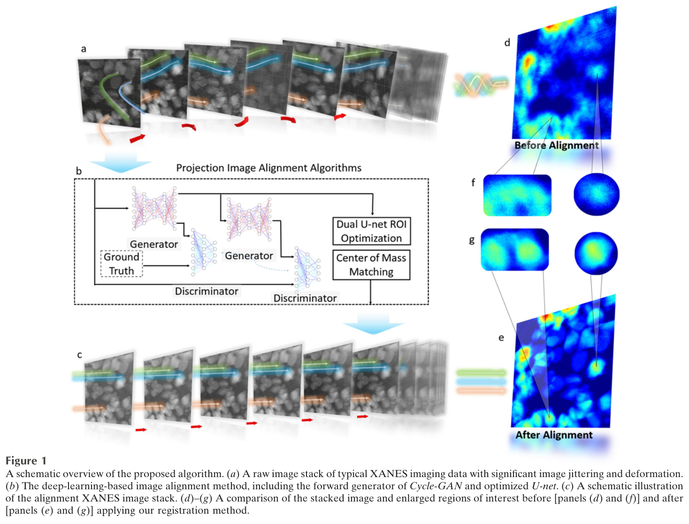
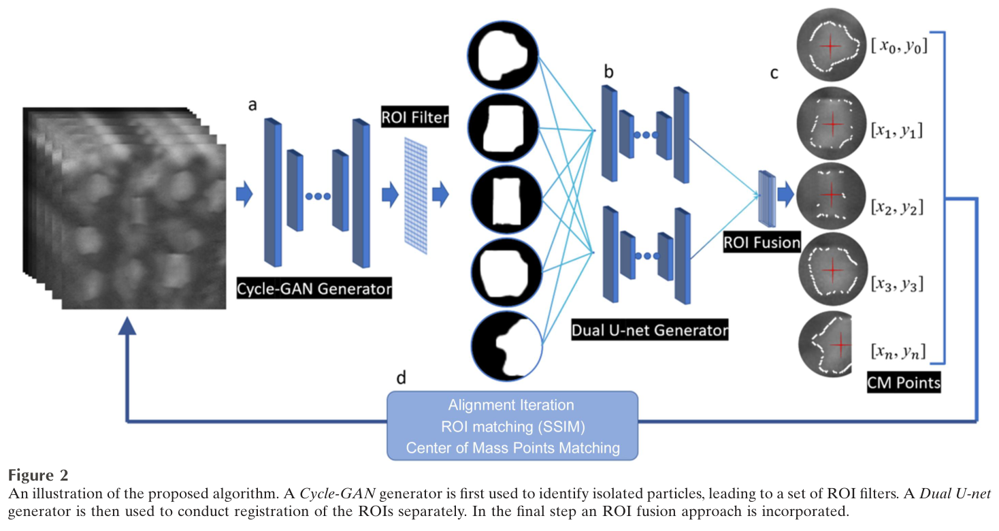
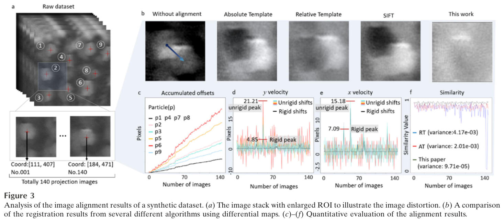
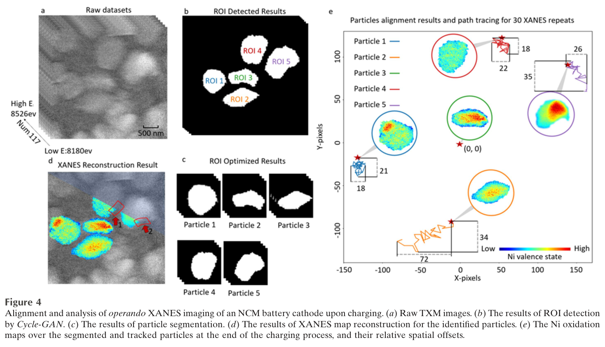

---
tags:
  - papers/X-ray-imaging
  - papers/image-registration
  - papers/battery
aliases:
  - "Image registration for in situ X-ray nano-imaging of a composite battery cathode with deformation"
date: 2024
doi: 10.1107/S1600577524000146
---

# 形变复合电池正极原位 X 射线纳米成像的图像配准

## 核心信息

- 标题: Image registration for in situ X-ray nano-imaging of a composite battery cathode with deformation
- 标题翻译: 形变复合电池正极原位 X 射线纳米成像的图像配准
- 作者: Bo Su、Guannan Qian、Ruoyang Gao、Fen Tao、Ling Zhang、Guohao Du、Biao Deng、Piero Pianetta、Yijin Liu
- 机构: 中国科学院上海应用物理研究所；中国科学院大学；上海光源与中国科学院上海高等研究院；斯坦福同步辐射光源；得克萨斯大学奥斯汀分校
- 发表时间: 2024
- 发表渠道: Journal of Synchrotron Radiation，31，328–335
- DOI: 10.1107/S1600577524000146
- 论文链接: https://doi.org/10.1107/S1600577524000146
- 论文类型: 深度学习图像配准方法与原位 TXM-XANES 应用

## 原文摘要翻译

电池电极在纳米尺度上的结构与化学演化对电池性能具有重要影响。纳米分辨 X 射线显微术已被证明是表征工作状态下电池电极演化的有力工具，能够同时感知其形貌、成分分布和氧化还原异质性。在真实电池中，电极可能在运行过程中发生形变，这给多种实验模态所必需的图像配准带来困难，例如 X 射线吸收近边结构成像。为应对这一挑战，本文开发了一种基于深度学习的自动颗粒识别与跟踪方法。该方法不仅能以较好的稳健性辅助图像配准，也能量化样品形变程度。作者首先用具有已知真值的合成数据验证方法有效性，随后将其用于工作状态锂电池的实验数据，揭示了运行中电池颗粒内部及颗粒之间高度复杂的化学差异。

## 创新点

1. 把一幅复合电极图像拆成多个可独立运动的颗粒区域，避免用单一全局变换强迫所有颗粒共享位移，更符合充放电电极的非刚性、多方向形变。
2. 让 `Cycle-GAN`、双重 `U-Net`、结构相似度和质心矩各司其职，形成“识别—匹配—轮廓优化—局部配准—谱学重建”的自动流水线。
3. 用人为加入刚性位移、非刚性位移、背景变化和噪声的合成数据提供几何真值，再用工作状态 NCM622 电池验证实际可用性，建立了两级证据链。
4. 配准过程同时输出每个颗粒的位置、位移、速度和加速度，使图像校正与电极形变定量共享同一中间表示。

## 一句话总结

该工作把上海光源参与的原位全场 TXM-XANES 从全局刚性配准推进到颗粒级非刚性配准，并在合成数据上取得 `98.32%` 的平均相似度，但它是二维能量扫描图像方法，不是三维纳米 CT 重建成果，也尚未证明形变与氧化还原异质性存在明确相关性。

## 研究问题

全场 XANES 成像需要在约十分钟内连续改变 X 射线能量并采集一组透射图像。光源、光学元件和样品台的漂移会造成全局抖动；与此同时，复合电极在充放电中会发生非刚性、非线性和多方向形变。若不同能点的同一像素不再对应同一物质位置，后续吸收谱和镍氧化态图会混入空间错位伪影。

传统模板、相关性或特征配准通常估计整幅图像的共同变换。这个假设对复合电极过强：一个颗粒可能向右上移动，另一个颗粒只轻微随机抖动。能量扫描还会连续改变亮度、对比度和背景，使依赖亮度恒常性的光流法失效。本文因此选择一个更窄但可执行的假设：视场中存在若干彼此分离、可识别且在单次扫描内大体保持形状的活性颗粒，可以逐颗粒建立局部坐标系。

需要特别限定的是，论文处理的是二维透射显微 XANES 能量栈。引言提及断层成像的扩展潜力，不代表本文采集了角度投影、执行了三维重建或验证了三维空间分辨率。

## 数据与任务定义

### 实验对象与采集

正极由单层单晶 `LiNi₀.₆Co₀.₂Mn₀.₂O₂`（NCM622）颗粒构成，电池先在 `2.7–4.25 V` 间进行两次形成循环，再以 `0.1 C` 充电并同步表征。数据来自斯坦福同步辐射光源 `6-2C` 与上海光源 `BL18B` 的协作实验数据池；论文没有把所有展示结果逐一映射到唯一线站，因此不应把图 4 的全部结果单独归功于任一装置。

全数据包括 `6435` 幅投影图，其中 `286` 幅用于模型训练，其余用于验证和电极充电过程分析。每次镍 K 边 XANES 扫描覆盖 `143` 个能点，共采集 `54` 次扫描。原图为 `1000 × 1000` 像素，为避开视场边缘照明不足造成的伪影，实际处理区域裁为 `460 × 460` 像素。全场 TXM 的标称视场约 `20 µm × 20 µm`，能区为 `5–14 keV`，相对能量分辨率约 `2 × 10⁻⁴`。

### 两级验证任务

合成数据包含九个分离颗粒，并人为叠加全局刚性偏移、颗粒间随机相对位移、背景变化和噪声，从而可以与已知真值比较。真实任务则是在工作状态 NCM622 电极中识别并跟踪五个颗粒，独立校正其能量栈，再重建镍氧化态分布。

这两级数据证明的内容不同：合成数据可以评价几何恢复；真实数据只能说明方法可运行并产生物理上可解释的 XANES 图，因为真实形变没有独立几何真值。

## 方法主线

### 机制流程

1. **输入与颗粒检出**：输入为不同能量和时刻的原始 TXM 图像；操作是用 `Cycle-GAN` 的前向生成器识别多个孤立颗粒并生成各自感兴趣区域掩膜；输出为每帧的候选颗粒区域。
2. **身份匹配与轮廓优化**：输入为跨帧候选区域；操作是以结构相似度匹配同一颗粒，再用双重 `U-Net` 去噪、去背景并提取单颗粒轮廓；输出为带稳定身份的二值轮廓。双重 `U-Net` 的每个网络含四层下采样、四层上采样、`18` 个 `3 × 3` 特征卷积层和一个全连接层。
3. **局部配准与形变量化**：输入为逐颗粒轮廓及其像素强度；操作是计算零阶、一级矩与质心，把每个区域平移到共同质心，同时保留质心随帧变化的轨迹；输出为独立对齐的区域栈以及位移、速度和加速度。
4. **区域融合与谱学重建**：输入为各颗粒对齐后的能量栈；操作是融合区域并调用既有 XANES 分析软件拟合镍 K 边；输出为颗粒级镍氧化态图和可与形变轨迹并列分析的化学指标。

*图 1｜从原始抖动、形变的 XANES 图像栈到颗粒检出、独立配准和重建的总体流程。*

### 相似度与质心

相邻能点图像的结构相似度写为

$$
\operatorname{SSIM}(x,y)=l(x,y)c(x,y)s(x,y),
$$

其中三项分别描述亮度、对比度与结构相似性。这里的 `SSIM` 同时用于颗粒身份粗匹配和配准效果评价，但能量变化本来就会改变真实吸收强度，因此高相似度不是谱学无偏的充分条件。

对于轮廓内强度 $I(x,y)$，零阶矩和一级矩为

$$
M_{00}=\sum_x\sum_y I(x,y),\qquad M_{10}=\sum_x\sum_y xI(x,y),\qquad M_{01}=\sum_x\sum_y yI(x,y).
$$

质心坐标为

$$
X_c=\frac{M_{10}}{M_{00}},\qquad Y_c=\frac{M_{01}}{M_{00}}.
$$

质心对能量引起的局部灰度变化相对稳健，前提是轮廓分割稳定且颗粒内部强度分布没有严重偏置。若颗粒开裂、接触、出入视场或轮廓随能量系统变化，这个前提就会破裂。

*图 2｜`Cycle-GAN` 生成颗粒区域，双重 `U-Net` 优化轮廓，各区域独立配准后再融合。*

## 关键结果

### 合成真值验证

| 结果 | 报告值 | 证据边界 |
|---|---:|---|
| 识别颗粒数 | `9` | 是特定合成场景中的彼此分离颗粒 |
| 平均相似度 | `98.32%` | 文中针对展示颗粒的平均相似度，不是所有真实数据的绝对几何精度 |
| 非刚性/刚性峰值比，竖直方向 | `4.37` 倍 | 说明全局变换无法代表各颗粒运动 |
| 非刚性/刚性峰值比，水平方向 | `2.14` 倍 | 来自合成位移设定与恢复结果 |
| 运行时间 | `<10 s` | `100` 幅、`460 × 460`、每幅九颗粒；硬件为 Xeon W-2245 与 Quadro 5000 |

绝对模板、相对模板和尺度不变特征变换在差分图中留下明显双边阴影；光流法因能量扫描造成的亮度、对比度和背景连续变化而失败。所提方法对粒子 2 的差分残差和相似度方差明显更小。不过，正文把合成栈写为 `143` 幅，而图中标注为 `140` 个能点，内部数量口径并不完全一致。

*图 3｜合成 XANES 数据上的方法比较、差分图与逐颗粒运动量化；这是几何真值层的主证据。*

### 工作状态电池

方法在真实 NCM622 数据中识别并独立配准五个颗粒。最终充电后的镍氧化态图显示明显颗粒内与颗粒间差异：颗粒 1 和 5 呈现偏离几何中心的高氧化核心，颗粒 2 和 3 呈收缩核样式，颗粒 4 的镍氧化态较低，作者推测其可能因失去接触而部分失活。

以颗粒 3 为空间参考，颗粒 2 缓慢向右上漂移，其余颗粒的运动更随机且幅度较小。最重要的负结果是：作者在这组数据中**没有观察到电极形变与颗粒氧化还原异质性的明显相关性**，并明确要求更多实验观测和高通量数据整理后再判断。

*图 4｜工作状态 NCM 正极的原始图、颗粒区域、配准后镍氧化态图及五颗粒运动；图中并未建立形变—氧化还原因果关系。*

## 深度分析

### 为什么局部坐标系有效

本文的关键不是深度网络本身，而是把配准对象从“整幅电极”改成“保持身份的单颗粒”。只要颗粒本体在一次能量扫描内近似刚性，电极级非刚性形变就能被分解为多个局部平移。这一建模选择把原来不可由单一变换描述的问题，转化为多个简单、可解释且易并行的配准问题。

`Cycle-GAN` 适合利用不成对训练图像学习“原图—掩膜”域转换，减少逐像素标注负担；双重 `U-Net` 再针对单目标区域去背景和修轮廓；质心计算则提供可解释的几何量。深度学习在此主要负责从复杂背景中稳定产生轮廓，最终变换不是不可解释的端到端黑箱。

### 证据链还缺什么

`98.32%` 的相似度说明合成图像在该指标上高度一致，却不能回答配准误差会把镍边位置或拟合价态偏移多少。一个更完整的验证应同时报告：

- 已知真值下的质心误差、轮廓交并比和身份切换率。
- 能量栈配准前后的谱线残差、边位误差和氧化态不确定度。
- 颗粒接触、分裂、遮挡、离开视场时的失败检测与置信度。
- 跨材料、跨线站和跨成像条件的盲测性能。

### 对上海光源纳米 CT 的位置

这项工作对上海光源的直接贡献是原位纳米谱学图像的数据处理能力：它能缓解 `BL18B` 一类全场显微系统在长时间能量扫描中的漂移与样品形变，并把运动轨迹变成可分析量。其算法思想也可迁移到断层投影中的局部追踪，但本文没有验证角度维配准、投影一致性或三维重建；因此应归入“纳米成像与谱学计算支撑”，而不是已完成的纳米 CT 核心能力。

## 局限

1. 方法依赖颗粒彼此分离、可检测且在扫描中大体保持结构；接触、开裂、合并、消失或新生颗粒可能引起轮廓失败和身份切换。
2. 训练数据主要来自 NCM、钨针和金颗粒等有限域，跨材料、跨厚度、跨背景与跨线站泛化没有系统盲测。
3. 真实工作状态数据没有独立几何真值；视觉改善和可解释 XANES 图不能替代绝对配准误差测量。
4. 原始 `1000 × 1000` 图像被裁到 `460 × 460`，照明不足的边缘区域没有纳入能力评价。
5. `SSIM` 受真实能量相关吸收变化影响，单一相似度不能证明谱学量无偏；论文没有把配准残差传播到镍边位置和价态误差。
6. 正文与图 3 对合成能量栈数量存在 `143` 与 `140` 的报告差异。
7. 五个颗粒不足以建立统计关系；论文明确未发现形变与氧化还原异质性的明显相关性。
8. 本文是二维 TXM-XANES 配准，不包含断层角度采集、三维重建和三维空间分辨率验证。

## 我的笔记

- 最值得复用的是“局部身份—局部坐标—谱学输出”的结构，可把配准误差、颗粒形变和谱学不确定度放在同一数据模型中。
- 下一版验收不应只看图像更锐或 `SSIM` 更高，应同时设几何误差、价态偏差和失败检测三类门槛。
- 对纳米 CT 的可迁移方向是：在相邻角度和能量间联合追踪颗粒，但必须加投影几何约束，不能直接把二维质心平移复制到断层数据。
- 建议建立接触颗粒、开裂颗粒、多相颗粒与跨束线数据集，并按整次扫描或整颗电池划分训练/测试，防止相邻帧泄漏。
- 形变—氧化还原耦合目前只是研究假设。只有扩大颗粒数、重复电池数并预注册统计分析，才可能从展示图走向机制结论。

## 引用

- Su, B. et al. (2024). Image registration for in situ X-ray nano-imaging of a composite battery cathode with deformation. Journal of Synchrotron Radiation, 31, 328–335. DOI: 10.1107/S1600577524000146.
- Su, B. et al. (2022). Image registration in X-ray nano-computed tomography. Journal of Synchrotron Radiation.
- Tao, F. et al. (2023). The 3D nanoimaging beamline at SSRF. Journal of Synchrotron Radiation, 30, 815–821.
