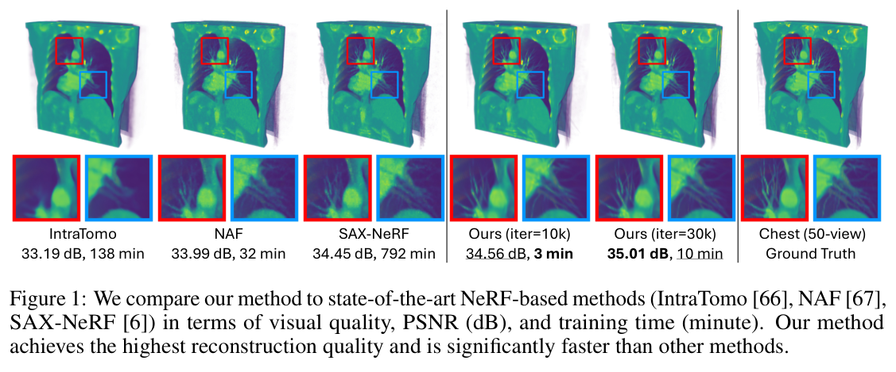
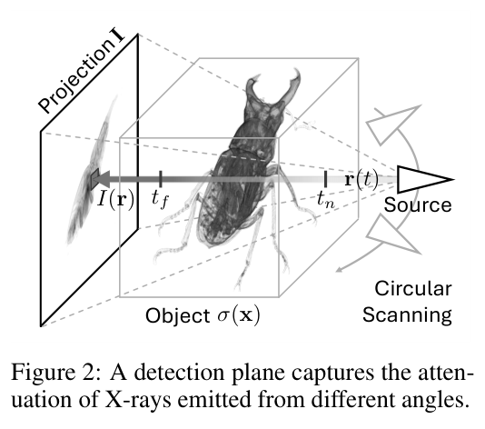
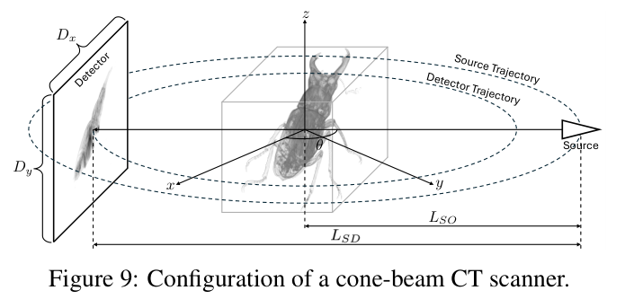
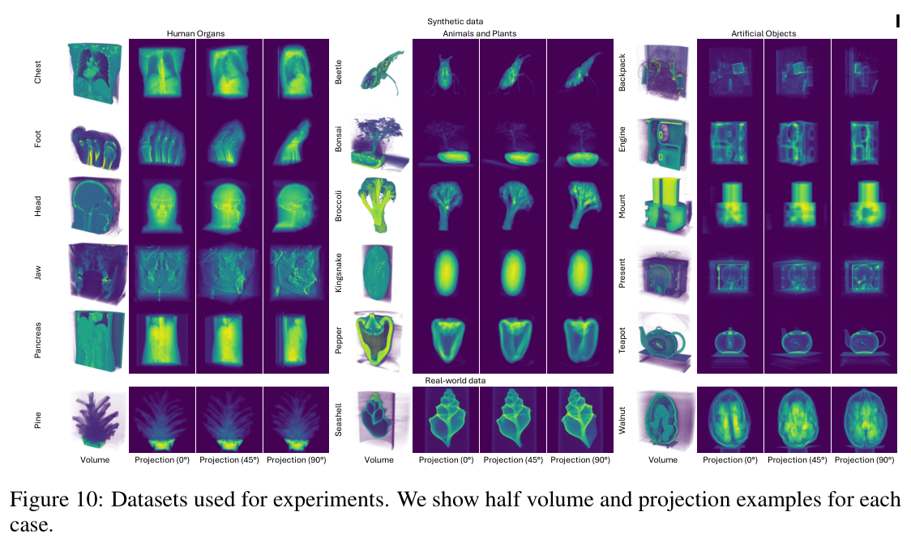
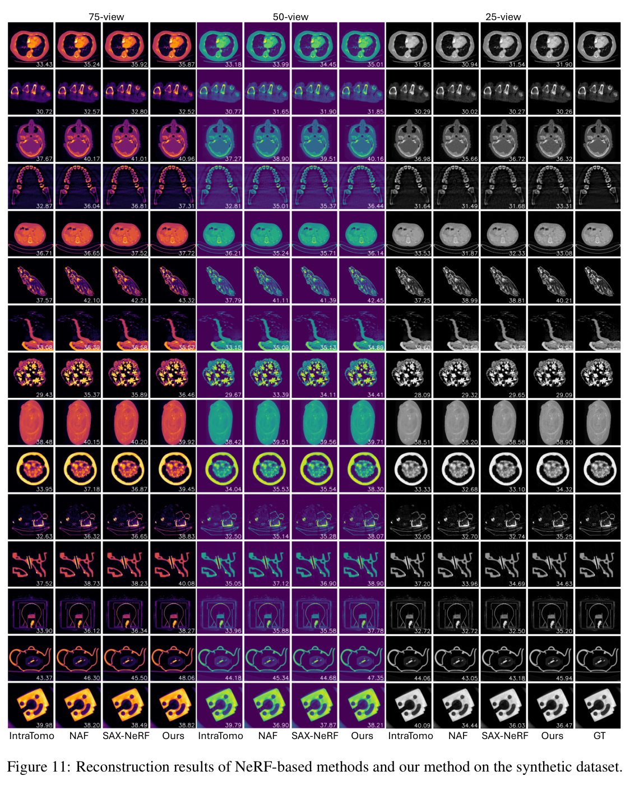
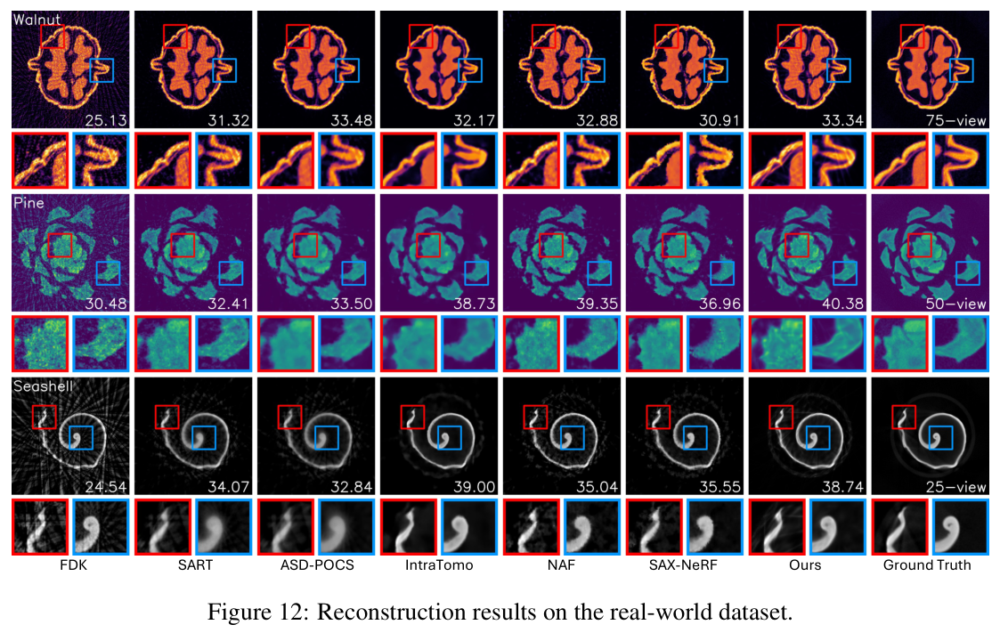
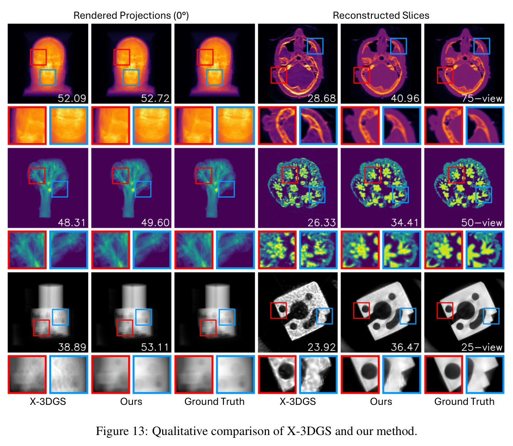
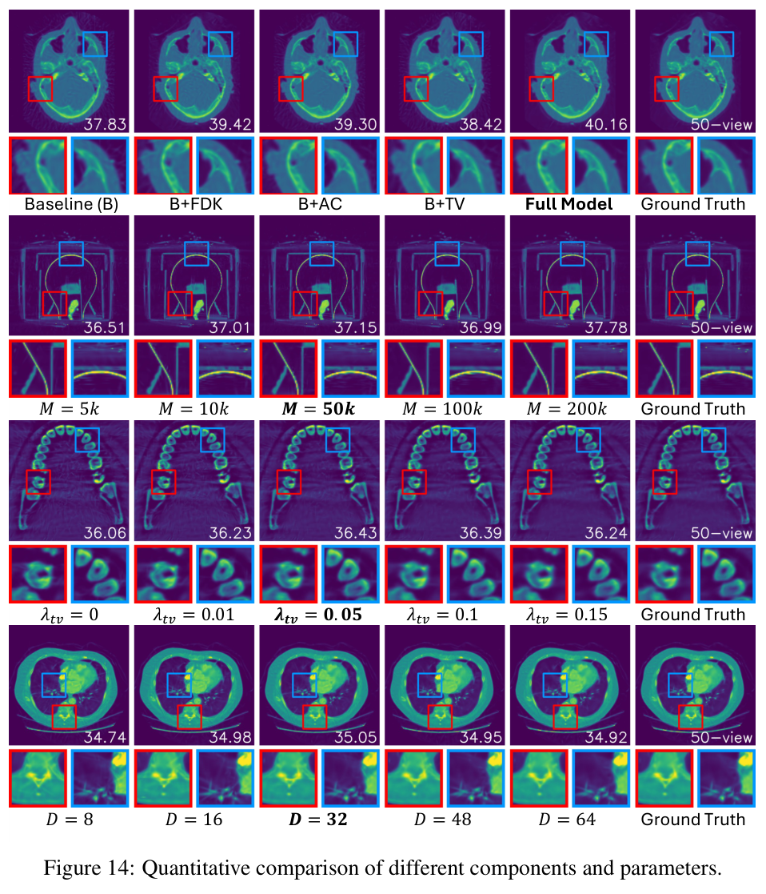
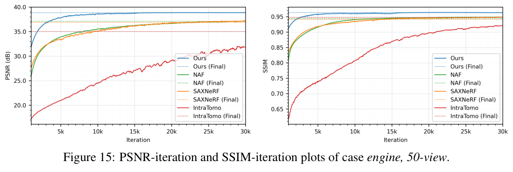
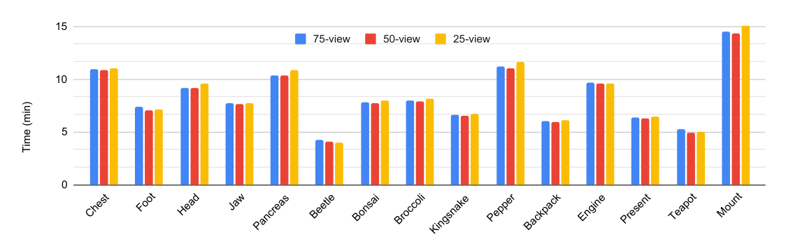

---
tags:
  - papers/computed-tomography
  - translations
aliases:
  - "R2-Gaussian 中文全文"
date: 2024
doi: 10.52202/079017-1427
arxiv_id: 2405.20693
---

# R²-Gaussian：面向断层重建的辐射高斯溅射校正——全文中文翻译

- 原题：R²-Gaussian: Rectifying Radiative Gaussian Splatting for Tomographic Reconstruction
- 作者：Ruyi Zha、Tao Jun Lin、Yuanhao Cai、Jiwen Cao、Yanhao Zhang、Hongdong Li
- 机构：澳大利亚国立大学；约翰斯·霍普金斯大学；悉尼科技大学机器人研究所
- 会议：第 38 届神经信息处理系统大会（NeurIPS 2024）
- DOI：https://doi.org/10.52202/079017-1427
- arXiv：https://arxiv.org/abs/2405.20693
- 项目与代码：https://github.com/Ruyi-Zha/r2_gaussian

> 翻译说明：本文按用户提供 PDF 的 28 页内容顺序完整翻译正文、附录 A–F 和 NeurIPS Paper Checklist。公式、图号、表号与参考文献编号均与原文一致；参考文献的作者、题名和出版信息按学术惯例保留原文。

## 摘要

三维高斯溅射（3D Gaussian Splatting，3DGS）在图像渲染和表面重建方面已经展现出很有前景的结果。然而，它在 X 射线计算机断层成像等体重建任务中的潜力仍缺乏充分探索。本文提出 R²-Gaussian，这是首个基于 3DGS 的稀疏视角断层重建框架。通过仔细推导 X 射线光栅化函数，我们发现标准 3DGS 公式中一个此前未知的积分偏差，它会妨碍准确的体数据恢复。为解决这一问题，我们通过重新分解从三维高斯到二维高斯的投影，提出一种新的校正技术。

新方法包含三项关键创新：（1）引入为该任务定制的高斯核；（2）将光栅化扩展到 X 射线成像；（3）开发基于 CUDA 的可微体素化器。在合成数据集和真实世界数据集上的实验表明，本方法在精度和效率上都优于当前先进方法。尤其是，它可以在 4 分钟内给出高质量结果，比基于 NeRF 的方法快 12 倍，同时速度与传统算法相当。代码和模型已在项目主页公开。

## 1 引言

计算机断层成像（CT）是一项用于无损检查物体内部结构的重要成像技术。由于 X 射线能够穿透固体物质，大多数 CT 系统都采用 X 射线作为成像源 [20]。在 CT 扫描过程中，X 射线设备从多个角度采集二维投影，用以测量射线穿过材料时的衰减。断层重建是 CT 的核心，其目标是由这些投影恢复物体的三维密度场。

这一任务具有两方面挑战。第一，X 射线辐射对人体有害，因此难以采集足够多且无噪声的投影，使重建成为一个复杂的病态问题。第二，医学诊断等时间敏感型应用要求算法迅速输出结果。

现有断层重建方法往往面临重建质量不够理想或处理速度过慢的问题。传统 CT 算法 [13, 2, 55] 可以在数分钟内输出结果，但会引入严重伪影。监督学习方法 [32, 33, 10, 35] 通过学习语义先验取得了不错的效果，却难以处理分布外物体。近年来，神经辐射场（NeRF）[43] 被用于断层重建，并在逐病例重建中表现良好 [67, 66, 48, 6, 54]。然而，由于体渲染需要采样大量点，这些方法非常耗时，通常超过 30 分钟。

*图 1：从视觉质量、PSNR（dB）和训练时间（分钟）三个方面，将本文方法与先进的 NeRF 方法 IntraTomo [66]、NAF [67] 和 SAX-NeRF [6] 进行比较。本文方法获得最高重建质量，并且明显更快。*

三维高斯溅射（3DGS）[23] 借助高度并行化的光栅化实现图像渲染，已在新视角合成 [64, 38, 31] 和表面重建 [16, 18, 65] 中同时超越 NeRF 的质量与效率。然而，将 3DGS 用于 X 射线断层成像等体重建任务的尝试仍然有限，效果也不理想。一些同期工作 [7, 14] 以经验方式修改 3DGS 以合成新的 X 射线视角，但它们只把 3DGS 当作传统断层重建算法的数据增强工具。此前还没有基于 3DGS、能够直接完成 CT 重建的方法。

本文揭示了 3DGS 内在存在的一种积分偏差。这种偏差对图像渲染几乎没有影响，却会严重妨碍体重建。更具体地说，第 4.2.1 节将说明：标准 3DGS 在把三维高斯核溅射到二维图像平面时，忽略了一个与协方差有关的缩放因子，从而使从不同视角查询得到的体属性不一致。除积分偏差外，将 3DGS 用于断层成像还面临自然光成像与 X 射线成像之间的差异，以及缺乏从高斯核中有效查询体数据的方法等挑战。

我们提出 R²-Gaussian（Rectified Radiative Gaussians，校正辐射高斯），将 3DGS 扩展到稀疏视角断层重建。R²-Gaussian 通过三项重要改进构建无偏训练流程。第一，我们提出一种新的辐射高斯核，以中心密度、位置和协方差为参数来表示局部密度场。高斯参数由解析方法 FDK [13] 初始化，再利用光度损失优化。第二，我们校正 3DGS 光栅化器以支持 X 射线成像：推导新的 X 射线渲染函数，并消除积分偏差，从而准确恢复密度。第三，我们开发基于 CUDA 的可微体素化器，它不仅能从高斯集合中提取三维体数据，还能在训练过程中施加基于体素的正则化。

我们在合成数据集和真实世界数据集上评估 R²-Gaussian。大量实验表明，本方法在 4 分钟内即可超过当前先进方法，这比最快的 NeRF 方案 NAF [67] 快 12 倍，且与传统算法速度相当；约 15 分钟即可收敛到最优结果，PSNR 比此前先进方法提高约 0.6 dB。图 1 给出了直观比较。

本文贡献概括如下：

1. 发现 3DGS 中一个此前未知、会阻碍体重建的积分偏差。
2. 通过引入新型高斯核、把光栅化扩展至 X 射线成像并开发可微体素化器，提出首个基于 3DGS 的断层重建框架。
3. 在重建质量和训练速度方面显著优于先进方法，体现了实际应用价值。

## 2 相关工作

### 2.1 断层重建

计算机断层成像广泛用于医学 [17, 22]、生物学 [12, 39, 24] 和工业 [11] 等领域的无损检测。传统扇束 CT 使用一维投影阵列逐层重建切片，再组成三维体数据。近年来，锥束扫描仪凭借快速扫描和高分辨率得到广泛应用 [52]，由此产生对三维断层重建的需求，即直接由二维投影图像恢复三维体数据。

本文关注三维稀疏视角重建：为降低辐射暴露，采集的投影少于 100 幅。传统算法主要分为解析法和迭代法。滤波反投影（FBP）及其三维变体 FDK [13] 等解析方法通过求解 Radon 变换及其逆变换 [46]，可在不到 1 秒内得到结果；但在稀疏视角场景中会产生严重条纹伪影。迭代方法 [2, 55, 40, 51] 把断层重建表示成最大后验问题，并使用正则项迭代最小化能量函数。它们能够有效抑制伪影，但通常耗时数分钟，并会损失结构细节。

深度学习方法可分为监督学习和自监督学习两类。监督方法从 CT 数据集中学习语义先验，再用训练好的网络补全投影 [3, 15]、对体数据去噪 [10, 28, 35, 37] 或直接输出重建结果 [19, 63, 1, 32, 33]。这类方法在与训练集相似的病例上效果很好，但用于未见数据时泛化能力较差。为克服这一限制，一些研究 [67, 66, 48, 6, 54] 以自监督方式处理断层重建。受 NeRF [43] 启发，它们使用坐标网络表示密度场，并以光度损失进行逐病例优化。NeRF 方法虽然效果较好，但体渲染需要大量点采样，因此通常耗时超过 30 分钟。本文方法也属于自监督学习范畴，但显著加快训练并提高重建质量。

### 2.2 三维高斯溅射

3DGS [23] 依靠高度并行化的光栅化加速图像渲染，其使用一组可训练的高斯形基元表示物体。在 RGB 任务中，3DGS 已成功用于表面重建 [16, 18, 65]、动态场景建模 [60, 34, 61]、人体化身 [36, 30, 27] 和三维生成 [57, 62, 9] 等。

一些同期工作把 3DGS 扩展到 X 射线成像。X-Gaussian [7] 修改 3DGS 以合成新视角 X 射线投影；Gao 等人 [14] 进一步考虑了会引入噪声的复杂物理效应。尽管这些方法能生成可信的二维 X 射线投影，却无法直接从训练后的高斯中提取三维密度体。它们需要先用 3DGS 扩充投影，再使用 FDK 等传统算法进行 CT 重建，既不高效也不理想。Li 等人 [29] 以定制高斯核表示密度场，但用现有 CT 模拟器替代了高效光栅化。相比之下，本文方法既能从高斯光栅化 X 射线投影，也能把高斯体素化为密度体。

## 3 预备知识

### 3.1 X 射线成像

*图 2：探测平面记录从不同角度发射的 X 射线经过物体后的衰减。*

如图 2 所示，一幅投影 $\mathbf I\in\mathbb R^{H\times W}$ 测量 X 射线穿过材料时的衰减。对于初始强度为 $I_0$、路径边界为 $t_n$ 和 $t_f$ 的射线

$$
\mathbf r(t)=\mathbf o+t\mathbf d\in\mathbb R^3,
$$

Beer–Lambert 定律 [20] 给出的原始像素值为

$$
I'(\mathbf r)=I_0\exp\left[-\int_{t_n}^{t_f}\sigma(\mathbf r(t))\,dt\right].
$$

其中，$\sigma(\mathbf x)$ 是位置 $\mathbf x\in\mathbb R^3$ 处的各向同性密度，在物理上也称衰减系数。为方便计算，断层成像通常将原始数据变换到对数空间：

$$
I(\mathbf r)=\log I_0-\log I'(\mathbf r)
=\int_{t_n}^{t_f}\sigma(\mathbf r(t))\,dt. \tag{1}
$$

因此，每个像素 $I(\mathbf r)$ 表示射线路径上的密度积分。除非另有说明，本文都使用对数投影作为输入。断层重建的目标，是利用从 $N$ 个不同角度采集的 X 射线投影 $\{\mathbf I_i\}_{i=1,\ldots,N}$，估计 $\sigma(\mathbf x)$ 的三维分布，并输出离散体数据。真实投影还包含康普顿散射等轻微的各向异性物理效应。与既有工作 [13, 2, 55, 67] 一样，本文不显式建模这些效应，而在重建时把它们视作噪声。

### 3.2 三维高斯溅射

3DGS [23] 用一组三维高斯核 $\mathbb G^3=\{G_i^3\}_{i=1,\ldots,M}$ 表示场景，每个核由位置、协方差、颜色和不透明度参数化。光栅化器 $\mathcal R$ 从这些高斯渲染 RGB 图像 $\mathbf I_{\mathrm{rgb}}\in\mathbb R^{H\times W\times3}$：

$$
\mathbf I_{\mathrm{rgb}}
=\mathcal R(\mathbb G^3)
=\mathcal C\circ\mathcal P\circ\mathcal T(\mathbb G^3). \tag{2}
$$

其中，$\mathcal T$、$\mathcal P$ 和 $\mathcal C$ 分别表示变换、投影和合成模块。首先，$\mathcal T$ 把三维高斯变换到射线空间，使观察射线与坐标轴对齐，以提高计算效率。随后把变换后的三维高斯投影到图像平面，得到 $\mathbb G^2=\mathcal P(\mathbb G^3)$。投影后的二维高斯保留三维高斯的不透明度和颜色，但从位置和协方差中删除第三维。最后，通过 alpha 混合 [45] 合成这些二维高斯，得到 $\mathbf I_{\mathrm{rgb}}=\mathcal C(\mathbb G^2)$。光栅化器可微，因此能够利用光度损失优化高斯核参数。3DGS 用运动恢复结构（SfM）点初始化稀疏高斯，并在训练中使用自适应控制策略动态增加高斯数量。

## 4 方法

本节先在第 4.1 节提出辐射高斯这一新的物体表示，再在第 4.2 节把 3DGS 适配到断层重建。具体而言，第 4.2.1 节推导新的光栅化函数并分析标准 3DGS 的积分偏差；第 4.2.2 节开发用于恢复体数据的可微体素化器；第 4.2.3 节说明优化策略。

### 4.1 使用辐射高斯表示物体

*图 3：使用一组辐射高斯表示被扫描物体；利用真实 X 射线投影优化这些高斯，最终通过体素化恢复密度体。*

如图 3 所示，本文用一组可学习三维核 $\mathbb G^3=\{G_i^3\}_{i=1,\ldots,M}$ 表示目标物体，并称其为辐射高斯。每个核 $G_i^3$ 定义一个局部高斯形密度场：

$$
G_i^3(\mathbf x\mid\rho_i,\mathbf p_i,\mathbf\Sigma_i)
=\rho_i\exp\left[
-\frac12(\mathbf x-\mathbf p_i)^\top
\mathbf\Sigma_i^{-1}
(\mathbf x-\mathbf p_i)
\right]. \tag{3}
$$

其中，$\rho_i$、$\mathbf p_i\in\mathbb R^3$ 和 $\mathbf\Sigma_i\in\mathbb R^{3\times3}$ 是可学习参数，分别表示中心密度、位置和协方差。为便于优化，沿用 [23] 的做法，将协方差矩阵进一步分解为旋转矩阵 $\mathbf R_i$ 和尺度矩阵 $\mathbf S_i$：

$$
\mathbf\Sigma_i
=\mathbf R_i\mathbf S_i\mathbf S_i^\top\mathbf R_i^\top.
$$

位置 $\mathbf x$ 处的总密度由所有核的密度贡献相加得到：

$$
\sigma(\mathbf x)
=\sum_{i=1}^{M}
G_i^3(\mathbf x\mid\rho_i,\mathbf p_i,\mathbf\Sigma_i). \tag{4}
$$

与标准 3DGS 相比，该高斯核取消了视角相关颜色，因为式（1）表明 X 射线衰减只取决于各向同性密度。更重要的是，式（4）为辐射高斯定义了密度查询函数，使其既可用于二维图像渲染，又可用于三维体重建。相比之下，3DGS 的不透明度是为 RGB 渲染经验设计的，因此难以从高斯中提取网格等三维模型 [16, 8, 65]。同期工作 [29] 也研究了基于高斯核的表示，但只使用简化的各向同性高斯；本文采用一般高斯分布，在复杂结构建模上更灵活、更精确。

#### 初始化

3DGS 使用 SfM 点初始化高斯，但这不适用于体断层重建。本文改用解析算法所得的初步结果初始化辐射高斯。具体地，先在不到 1 秒内使用 FDK [13] 重建一个低质量体数据；再以密度阈值 $\tau$ 排除空白空间，从剩余区域随机抽取 $M$ 个点作为核的位置。沿用 [23] 的做法，以最近邻距离设置高斯尺度，并假设初始旋转为零。中心密度从 FDK 体中查询，并用经验系数 $k$ 缩小，以补偿多个高斯核重叠造成的密度叠加。

### 4.2 训练辐射高斯

*图 4：R²-Gaussian 的训练流程。（a）总体训练流程；（b）用于渲染投影的 X 射线光栅化器；（c）用于恢复体数据的密度体素化器；（d）修改后的自适应控制。*

训练流程如图 4 所示。首先由 FDK 体初始化辐射高斯；然后光栅化投影以计算光度损失，并体素化小尺寸密度体以施加三维正则化；训练中通过自适应控制增加高斯数量，提高表示能力。训练结束后，将高斯体素化为目标尺寸的密度体用于评估。

#### 4.2.1 X 射线光栅化

本节推导 X 射线光栅化器 $\mathcal R$。如第 3.1 节所述，投影像素值是对应射线路径上的密度积分。将式（4）代入式（1）可得：

$$
\begin{aligned}
I_r(\mathbf r)
&=\int\sum_{i=1}^{M}
G_i^3(\mathbf r(t)\mid\rho_i,\mathbf p_i,\mathbf\Sigma_i)\,dt\\
&=\sum_{i=1}^{M}\int
G_i^3(\mathbf r(t)\mid\rho_i,\mathbf p_i,\mathbf\Sigma_i)\,dt.
\end{aligned} \tag{5}
$$

其中 $I_r(\mathbf r)$ 是渲染像素值。这说明可以分别对每个三维高斯积分，从而光栅化 X 射线投影。式（1）中的 $t_n$ 和 $t_f$ 在此被省略，因为假设所有高斯都位于目标空间内部。

##### 变换

锥束 X 射线扫描仪可用与针孔相机类似的模型描述，因此本文沿用 [69]，把高斯从世界空间变换到射线空间。在射线空间中，观察射线与第三坐标轴平行，便于解析积分。由于射线空间不是笛卡尔空间，对式（5）采用局部仿射变换：

$$
I_r(\mathbf r)\approx
\sum_{i=1}^{M}
\int
G_i^3\!\left(
\tilde{\mathbf x}\mid
\rho_i,
\underbrace{\phi(\mathbf p_i)}_{\tilde{\mathbf p}_i},
\underbrace{\mathbf J_i\mathbf W\mathbf\Sigma_i
\mathbf W^\top\mathbf J_i^\top}_{\tilde{\mathbf\Sigma}_i}
\right)\,dx_2. \tag{6}
$$

其中，$\tilde{\mathbf x}=[x_0,x_1,x_2]^\top$ 是射线空间中的点；$\tilde{\mathbf p}_i\in\mathbb R^3$ 是通过投影映射 $\phi$ 得到的新高斯位置；$\tilde{\mathbf\Sigma}_i\in\mathbb R^{3\times3}$ 是由局部近似矩阵 $\mathbf J_i$ 和观察变换矩阵 $\mathbf W$ 控制的新协方差。附录 A 说明如何由扫描仪参数确定 $\phi$、$\mathbf J_i$ 和 $\mathbf W$。

##### 投影与合成

归一化三维高斯分布有一个重要性质：沿任一坐标轴积分，会得到归一化二维高斯分布。把式（3）代入式（6）可得：

$$
\begin{aligned}
I_r(\mathbf r)
&\approx\sum_{i=1}^{M}
\rho_i(2\pi)^{3/2}|\tilde{\mathbf\Sigma}_i|^{1/2}
\int
\frac{\exp\!\left[-\frac12
(\tilde{\mathbf x}-\tilde{\mathbf p}_i)^\top
\tilde{\mathbf\Sigma}_i^{-1}
(\tilde{\mathbf x}-\tilde{\mathbf p}_i)\right]}
{(2\pi)^{3/2}|\tilde{\mathbf\Sigma}_i|^{1/2}}
\,dx_2\\
&=\sum_{i=1}^{M}
\rho_i(2\pi)^{3/2}|\tilde{\mathbf\Sigma}_i|^{1/2}
\frac{\exp\!\left[-\frac12
(\hat{\mathbf x}-\hat{\mathbf p}_i)^\top
\hat{\mathbf\Sigma}_i^{-1}
(\hat{\mathbf x}-\hat{\mathbf p}_i)\right]}
{2\pi|\hat{\mathbf\Sigma}_i|^{1/2}}\\
&=\sum_{i=1}^{M}
G_i^2\!\left(
\hat{\mathbf x}\,\middle|\,
\underbrace{\sqrt{\frac{2\pi|\tilde{\mathbf\Sigma}_i|}
{|\hat{\mathbf\Sigma}_i|}}\rho_i}_{\hat\rho_i},
\hat{\mathbf p}_i,
\hat{\mathbf\Sigma}_i
\right).
\end{aligned} \tag{7}
$$

其中，$\hat{\mathbf x}\in\mathbb R^2$、$\hat{\mathbf p}_i\in\mathbb R^2$ 和 $\hat{\mathbf\Sigma}_i\in\mathbb R^{2\times2}$，均由对应的三维量 $\tilde{\mathbf x}$、$\tilde{\mathbf p}_i$ 和 $\tilde{\mathbf\Sigma}_i$ 删除第三行与第三列得到。式（7）说明，与自然光成像中的 alpha 合成不同，X 射线投影只需将二维高斯直接相加即可渲染。

##### 积分偏差

*图 5：3DGS 中的密度不一致问题。对同一高斯从不同方向投影时，若忽略与协方差有关的缩放因子，就无法由二维积分密度唯一恢复三维中心密度。*

在投影过程中，本文二维高斯与原始 3DGS 的关键差异是中心密度（在 3DGS 中对应不透明度）$\hat\rho_i$。根据式（7），本文用协方差相关因子

$$
\mu_i=\sqrt{\frac{2\pi|\tilde{\mathbf\Sigma}_i|}
{|\hat{\mathbf\Sigma}_i|}}
$$

缩放密度，即 $\hat\rho_i=\mu_i\rho_i$，而标准 3DGS 没有这一因子。这意味着 3DGS 实际学习的是二维图像平面上的积分密度，而不是三维空间中的真实密度。该积分偏差虽然对图像渲染影响很小，却会造成严重的密度恢复不一致。

图 5 用简化的二维到一维投影说明这种不一致。若试图用 $\rho_i=\hat\rho_i/\mu_j$ 恢复三维中心密度 $\rho_i$，不同观察方向对应的 $\mu_j$ 会给出不同结果。这违背了 $\rho_i$ 的各向同性，导致无法确定正确密度。本文则把真实三维密度赋给高斯核，再正向计算二维投影，从根本上解决该问题。这个想法在概念上简单，但实现需要大量工程工作，包括用 CUDA 重新编写全部反向传播过程。

#### 4.2.2 密度体素化

本文开发体素化器 $\mathcal V$，从辐射高斯中高效查询密度体 $\mathbf V\in\mathbb R^{X\times Y\times Z}$：

$$
\mathbf V=\mathcal V(\mathbb G^3).
$$

受 RGB 任务中体素化器 [57] 的启发，首先将目标空间划分成多个 $8\times8\times8$ 的三维块；随后剔除与块不相交的高斯，只保留以 99% 置信范围与该块相交的高斯。在每个三维块内，依据式（4）并行累加邻近高斯的贡献，从而计算各体素值。体素化器及其反向传播均用 CUDA 实现，因此可用于可微优化。该设计不仅使查询速度超过 100 FPS，还允许使用三维先验正则化辐射高斯。

#### 4.2.3 优化

本文使用随机梯度下降优化辐射高斯。除光度 $L_1$ 损失 $\mathcal L_1$ 和 D-SSIM 损失 $\mathcal L_{\mathrm{ssim}}$ [59] 外，还加入三维总变分（TV）正则项 $\mathcal L_{\mathrm{tv}}$ [49]，作为断层重建的均匀性先验。每次训练迭代随机查询一个与目标输出体素间距相同的小密度体 $\mathbf V_{\mathrm{tv}}\in\mathbb R^{D\times D\times D}$，并最小化其总变分。总损失为：

$$
\mathcal L_{\mathrm{total}}
=\mathcal L_1(\mathbf I_r,\mathbf I_m)
+\lambda_{\mathrm{ssim}}\mathcal L_{\mathrm{ssim}}(\mathbf I_r,\mathbf I_m)
+\lambda_{\mathrm{tv}}\mathcal L_{\mathrm{tv}}(\mathbf V_{\mathrm{tv}}). \tag{8}
$$

其中，$\mathbf I_r$、$\mathbf I_m$、$\lambda_{\mathrm{ssim}}$ 和 $\lambda_{\mathrm{tv}}$ 分别表示渲染投影、实测投影、D-SSIM 权重和 TV 权重。

训练中采用自适应控制增强物体表示：删除空高斯，对损失梯度大的高斯进行克隆或分裂。考虑到人体器官等对象含有大范围均匀区域，不裁剪尺寸较大的高斯。在增加高斯时，将原高斯和复制高斯的密度都减半，以缓解新高斯加入时性能突然下降的问题，从而稳定训练。

## 5 实验

### 5.1 实验设置

#### 数据集

实验同时使用合成数据和真实世界数据。合成数据集收集 15 个真实 CT 体，涵盖生物体和人工物体，再用断层成像工具箱 TIGRE [5] 合成 X 射线投影，并加入康普顿散射和电子噪声。真实世界实验使用 FIPS 数据集 [56] 中的 3 个样例，每个样例有 721 幅真实投影。由于没有真实体数据作为真值，作者用全部视角通过 FDK [13] 生成伪真值，再下采样视角进行稀疏视角实验。合成和真实数据均设置 75、50 和 25 视角三种条件。更多细节见附录 B。

#### 实现细节

R²-Gaussian 使用 PyTorch [44] 与 CUDA [50] 实现，以 Adam [25] 优化器训练 30,000 次迭代。位置、密度、尺度和旋转的初始学习率分别为 0.0002、0.01、0.005 和 0.001，并以指数方式衰减到各自初始值的 0.1 倍。损失权重为 $\lambda_{\mathrm{ssim}}=0.25$、$\lambda_{\mathrm{tv}}=0.05$。初始化 $M=50,000$ 个高斯，密度阈值 $\tau=0.05$，密度缩放项 $k=0.15$。TV 小体尺寸设为 $D=32$。自适应控制从第 500 次迭代运行到第 15,000 次迭代，梯度阈值为 0.00005。

所有方法均在单张 RTX 3090 GPU 上运行。重建质量使用 PSNR 和 SSIM [59] 评估：PSNR 在三维体上计算；SSIM 分别在轴向、冠状面和矢状面的二维切片上计算后取平均。运行时间用于衡量效率。

### 5.2 结果与评估

为保证公平，实验不比较需要外部训练数据的方法，只比较仅使用任意物体二维投影的方法。基线包括三种传统方法 FDK [13]、SART [2] 和 ASD-POCS [55]，以及三种先进 NeRF 方法 IntraTomo [66]、NAF [67] 和 SAX-NeRF [6]。

**表 1：稀疏视角断层重建的定量结果。箭头表示指标越大或越小越好；FDK 为即时计算，原文未报告其时间。**

| 数据 | 方法 | 75 视角 PSNR | 75 视角 SSIM | 75 视角时间 | 50 视角 PSNR | 50 视角 SSIM | 50 视角时间 | 25 视角 PSNR | 25 视角 SSIM | 25 视角时间 |
|---|---|---:|---:|---:|---:|---:|---:|---:|---:|---:|
| 合成 | FDK | 28.63 | 0.497 | — | 26.50 | 0.422 | — | 22.99 | 0.317 | — |
| 合成 | SART | 36.06 | 0.897 | 4分41秒 | 34.37 | 0.875 | 3分36秒 | 31.14 | 0.825 | 1分47秒 |
| 合成 | ASD-POCS | 36.64 | 0.940 | 2分25秒 | 34.34 | 0.914 | 1分52秒 | 30.48 | 0.847 | 56秒 |
| 合成 | IntraTomo | 35.42 | 0.924 | 2时7分 | 35.25 | 0.923 | 2时9分 | 34.68 | 0.914 | 2时19分 |
| 合成 | NAF | 37.84 | 0.945 | 30分43秒 | 36.65 | 0.932 | 32分4秒 | 33.91 | 0.893 | 31分1秒 |
| 合成 | SAX-NeRF | 38.07 | 0.950 | 13时5分 | 36.86 | 0.938 | 13时5分 | 34.33 | 0.905 | 13时3分 |
| 合成 | 本文（10k） | 38.29 | 0.954 | 2分38秒 | 37.63 | 0.949 | 2分35秒 | 35.08 | 0.922 | 2分35秒 |
| 合成 | 本文（30k） | 38.88 | 0.959 | 8分21秒 | 37.98 | 0.952 | 8分14秒 | 35.19 | 0.923 | 8分28秒 |
| 真实 | FDK | 30.03 | 0.535 | — | 27.38 | 0.449 | — | 23.30 | 0.335 | — |
| 真实 | SART | 34.42 | 0.845 | 5分11秒 | 33.61 | 0.827 | 3分28秒 | 31.52 | 0.790 | 1分47秒 |
| 真实 | ASD-POCS | 36.33 | 0.868 | 2分43秒 | 34.58 | 0.861 | 1分49秒 | 31.32 | 0.810 | 56秒 |
| 真实 | IntraTomo | 36.79 | 0.858 | 2时25分 | 36.99 | 0.854 | 2时19分 | 35.85 | 0.835 | 2时18分 |
| 真实 | NAF | 38.58 | 0.848 | 51分28秒 | 36.44 | 0.818 | 51分31秒 | 32.92 | 0.772 | 51分24秒 |
| 真实 | SAX-NeRF | 34.93 | 0.854 | 13时21分 | 34.89 | 0.840 | 13时23分 | 33.49 | 0.793 | 13时25分 |
| 真实 | 本文（10k） | 38.10 | 0.872 | 3分39秒 | 37.52 | 0.866 | 3分37秒 | 35.10 | 0.840 | 3分23秒 |
| 真实 | 本文（30k） | 39.40 | 0.875 | 14分16秒 | 38.24 | 0.864 | 13分52秒 | 34.83 | 0.833 | 12分56秒 |

R²-Gaussian 在全部合成实验和大多数真实实验中取得最佳性能。具体而言，在合成数据上，本文方法的 PSNR 比 SAX-NeRF 高 0.93 dB；在真实数据上，比 IntraTomo 高 0.95 dB。值得注意的是，本文方法的 50 视角结果已经与其他方法的 75 视角结果相当。

效率方面，本文方法约 15 分钟收敛到最优结果，比最快的 NeRF 方法 NAF 快 3.7 倍；不到 4 分钟即可超过其他方法，甚至快于传统算法 SART。

*图 6：不同方法的彩色切片示例，每幅图右下角给出 PSNR（dB）。前三行来自合成数据集，最后一行来自真实数据集。本文方法能够恢复更多细节并抑制伪影。*

图 6 显示，FDK 和 SART 会产生条纹伪影；ASD-POCS 与 IntraTomo 会模糊结构细节；NAF 与 SAX-NeRF 优于其他基线，但含有椒盐噪声。相比之下，本文方法既能恢复尖锐细节，例如辣椒的胚珠，也能在胸部肌肉等均匀区域保持良好平滑性。

### 5.3 消融研究

#### 积分偏差

为验证第 4.2.1 节所述积分偏差的影响，作者构建了 X 射线版 3DGS（X-3DGS）：使用 X 射线渲染，但保留有偏的三维到二维高斯投影；体数据仍由第 4.2.2 节的相同体素化器提取。体素化前，将每个高斯的学习密度除以所有训练视角缩放因子 $\mu$ 的平均值。

**表 2：X-3DGS 与本文方法在合成数据集上的定量比较。**

| 指标 | 75 视角 X-3DGS | 75 视角本文 | 50 视角 X-3DGS | 50 视角本文 | 25 视角 X-3DGS | 25 视角本文 |
|---|---:|---:|---:|---:|---:|---:|
| 二维 PSNR ↑ | 49.97 | 50.54 | 47.26 | 49.70 | 39.84 | 46.28 |
| 二维 SSIM ↑ | 0.987 | 0.986 | 0.984 | 0.986 | 0.967 | 0.982 |
| 三维 PSNR ↑ | 23.40 | 38.86 | 21.24 | 37.98 | 14.07 | 35.17 |
| 三维 SSIM ↑ | 0.660 | 0.959 | 0.562 | 0.952 | 0.408 | 0.923 |

校正积分偏差同时提升二维渲染（PSNR 平均提高 3.15 dB）和三维重建（PSNR 平均提高 17.77 dB）。X-3DGS 虽然能渲染合理的二维投影，但三维重建质量显著较差，并且从不同视角查询的切片存在明显差异。二维拟合较好而三维重建很差，说明 X-3DGS 即使拟合了图像，也没有准确建模密度场。本文方法学习的是真实、视角无关的密度，因而消除了不一致并得到无偏物体表示。

*图 7：X-3DGS 与本文方法的结果，每幅图标注 PSNR（dB）。图中给出从三个观察角度查询的 X-3DGS 切片。X-3DGS 虽能生成可信的 X 射线投影，但重建体缺乏视角一致性且质量较差。*

#### 组件分析与参数分析

作者分析 FDK 初始化（Init.）、修改后的自适应控制（AC）和总变分正则化（Reg.）的作用。基线模型移除这三项组件，并用随机生成的高斯初始化。实验均在 50 视角条件下进行，评估 PSNR、SSIM、训练时间和高斯数量。

**表 3：组件与超参数消融结果；粗体行为原文采用的完整模型或默认设置。**

| 设置 | PSNR ↑ | SSIM ↑ | 时间 ↓ | 高斯数 |
|---|---:|---:|---:|---:|
| 基线 B | 36.47 | 0.934 | 4分57秒 | 50k |
| B + FDK 初始化 | 37.37 | 0.944 | 5分29秒 | 50k |
| B + 自适应控制 | 37.33 | 0.942 | 7分33秒 | 70k |
| B + TV 正则 | 36.79 | 0.943 | 6分30秒 | 50k |
| **完整模型** | **37.98** | **0.952** | **8分37秒** | **68k** |
| $M=5k$ | 37.44 | 0.946 | 9分18秒 | 32k |
| $M=10k$ | 37.56 | 0.948 | 8分59秒 | 35k |
| **$M=50k$** | **37.98** | **0.952** | **8分14秒** | **68k** |
| $M=100k$ | 38.03 | 0.953 | 9分4秒 | 112k |
| $M=200k$ | 37.82 | 0.949 | 9分54秒 | 206k |
| $\lambda_{\mathrm{tv}}=0$ | 37.66 | 0.948 | 7分9秒 | 68k |
| $\lambda_{\mathrm{tv}}=0.01$ | 37.88 | 0.950 | 8分21秒 | 68k |
| **$\lambda_{\mathrm{tv}}=0.05$** | **37.98** | **0.952** | **8分14秒** | **68k** |
| $\lambda_{\mathrm{tv}}=0.1$ | 37.73 | 0.951 | 8分11秒 | 68k |
| $\lambda_{\mathrm{tv}}=0.15$ | 37.40 | 0.949 | 8分27秒 | 69k |
| $D=8$ | 37.74 | 0.949 | 7分56秒 | 68k |
| $D=16$ | 37.94 | 0.950 | 8分18秒 | 68k |
| **$D=32$** | **37.98** | **0.952** | **8分14秒** | **68k** |
| $D=48$ | 37.90 | 0.951 | 9分34秒 | 67k |
| $D=64$ | 37.82 | 0.949 | 11分35秒 | 67k |

FDK 初始化使 PSNR 提高 0.9 dB。自适应控制通过增加高斯数量提高质量，但也延长训练。TV 正则化通过减少伪影、促进平滑提高 SSIM。完整模型相较基线将 PSNR 提高 1.51 dB、SSIM 提高 0.018，同时训练时间保持在 9 分钟以内。

关于参数，初始化 50k 个高斯在质量与效率之间取得良好平衡。$\lambda_{\mathrm{tv}}=0.05$ 能改善重建，但更大的权重会导致性能下降。随着 TV 小体尺寸 $D$ 增大，训练时间增加；性能在 $D=32$ 时达到峰值。

#### 收敛分析

*图 8：基于 NeRF 的方法与 R²-Gaussian 在不同迭代次数下的重建结果。*

无论是否采用 FDK 初始化，R²-Gaussian 都显著快于 NeRF 方法收敛：到第 500 次迭代时已呈现清晰细节，而其他方法仍有伪影和模糊。FDK 初始化在训练前提供粗略结构，进一步加快收敛并提高质量。最终，本文方法在 9 分钟内达到 38.90 dB 的最高 PSNR，同时在性能和效率上优于其他方法。

## 6 讨论与结论

### 6.1 讨论

R²-Gaussian 继承了 3DGS 的一些局限，包括不同模态的训练时间不一致、极端稀疏视角条件下会出现针状伪影，以及在其他断层成像任务上的外推能力欠佳。此外，本文尚未考虑扫描几何标定误差，以及康普顿散射等各向异性物理效应。附录 E 给出更详细讨论。尽管存在这些局限，本文方法较高的重建性能和较快速度使其在医学诊断、工业检测等真实应用中具有价值。

### 6.2 结论

本文提出 R²-Gaussian，一种面向稀疏视角断层重建、基于 3DGS 的新框架。作者识别并校正了标准 3DGS 中此前被忽视的积分偏差，该偏差会妨碍准确密度恢复。为使 3DGS 适用于断层成像，本文还引入新型高斯核，推导 X 射线光栅化函数，并开发可微体素化器。

R²-Gaussian 在重建质量和训练速度上均超过当前先进方法，显示出用于真实应用的潜力。作者进一步推测，新发现的积分偏差可能普遍存在于所有 3DGS 相关研究中，因此本文校正方法可能不只适用于 CT，也可能惠及其他任务。

## 致谢

本研究部分得到澳大利亚研究理事会 ARC Discovery Grant（项目编号 DP220100800）的资助。

## 参考文献

参考文献 [1]–[69] 的作者、英文题名、期刊或会议、页码与链接按原文保留，见下文。

[1] Jonas Adler and Ozan Öktem. Learned primal-dual reconstruction. IEEE Transactions on Medical Imaging, 37(6):1322–1332, 2018.

[2] Anders H. Andersen and Avinash C. Kak. Simultaneous algebraic reconstruction technique (SART): a superior implementation of the ART algorithm. Ultrasonic Imaging, 6(1):81–94, 1984.

[3] Rushil Anirudh, Hyojin Kim, Jayaraman J. Thiagarajan, K. Aditya Mohan, Kyle Champley, and Timo Bremer. Lose the views: Limited angle CT reconstruction via implicit sinogram completion. CVPR, 6343–6352, 2018.

[4] Samuel G. Armato III et al. The Lung Image Database Consortium (LIDC) and Image Database Resource Initiative (IDRI): a completed reference database of lung nodules on CT scans. Medical Physics, 38(2):915–931, 2011.

[5] Ander Biguri, Manjit Dosanjh, Steven Hancock, and Manuchehr Soleimani. TIGRE: a MATLAB-GPU toolbox for CBCT image reconstruction. Biomedical Physics & Engineering Express, 2(5):055010, 2016.

[6] Yuanhao Cai, Jiahao Wang, Alan Yuille, Zongwei Zhou, and Angtian Wang. Structure-aware sparse-view X-ray 3D reconstruction. CVPR, 2024.

[7] Yuanhao Cai et al. Radiative Gaussian splatting for efficient X-ray novel view synthesis. ECCV, 283–299, 2025.

[8] Hanlin Chen, Chen Li, and Gim Hee Lee. NeuSG: Neural implicit surface reconstruction with 3D Gaussian splatting guidance. arXiv:2312.00846, 2023.

[9] Zilong Chen, Feng Wang, and Huaping Liu. Text-to-3D using Gaussian splatting. CVPR, 2024.

[10] Hyungjin Chung et al. Solving 3D inverse problems using pre-trained 2D diffusion models. CVPR, 22542–22551, 2023.

[11] Leonardo De Chiffre et al. Industrial applications of computed tomography. CIRP Annals, 63(2):655–677, 2014.

[12] Philip C. J. Donoghue et al. Synchrotron X-ray tomographic microscopy of fossil embryos. Nature, 442(7103):680–683, 2006.

[13] Lee A. Feldkamp, Lloyd C. Davis, and James W. Kress. Practical cone-beam algorithm. JOSA A, 1(6):612–619, 1984.

[14] Zhongpai Gao et al. DDGS-CT: Direction-disentangled Gaussian splatting for realistic volume rendering. arXiv:2406.02518, 2024.

[15] Muhammad Usman Ghani and W. Clem Karl. Deep learning-based sinogram completion for low-dose CT. IEEE IVMSP, 1–5, 2018.

[16] Antoine Guédon and Vincent Lepetit. SuGaR: Surface-aligned Gaussian splatting for efficient 3D mesh reconstruction and high-quality mesh rendering. CVPR, 2024.

[17] Godfrey N. Hounsfield. Computed medical imaging. Science, 210(4465):22–28, 1980.

[18] Binbin Huang et al. 2D Gaussian splatting for geometrically accurate radiance fields. SIGGRAPH Conference Papers, 2024. DOI: 10.1145/3641519.3657428.

[19] Kyong Hwan Jin et al. Deep convolutional neural network for inverse problems in imaging. IEEE Transactions on Image Processing, 26(9):4509–4522, 2017.

[20] Avinash C. Kak and Malcolm Slaney. Principles of Computerized Tomographic Imaging. SIAM, 2001.

[21] Emma Kamutta, Sofia Mäkinen, and Alexander Meaney. Cone-Beam Computed Tomography Dataset of a Seashell, August 2022. https://doi.org/10.5281/zenodo.6983008.

[22] Shigehiko Katsuragawa and Kunio Doi. Computer-aided diagnosis in chest radiography. Computerized Medical Imaging and Graphics, 31(4–5):212–223, 2007.

[23] Bernhard Kerbl, Georgios Kopanas, Thomas Leimkühler, and George Drettakis. 3D Gaussian splatting for real-time radiance field rendering. ACM Transactions on Graphics, 42(4):1–14, 2023.

[24] Timo Kiljunen et al. Dental cone beam CT: A review. Physica Medica, 31(8):844–860, 2015.

[25] Diederik Kingma and Jimmy Ba. Adam: A method for stochastic optimization. ICLR, 2015.

[26] Pavol Klacansky. Open SciVis datasets, December 2017. https://klacansky.com/open-scivis-datasets/.

[27] Muhammed Kocabas et al. HUGS: Human Gaussian splatting. CVPR, 2024. https://arxiv.org/abs/2311.17910.

[28] Suhyeon Lee et al. Improving 3D imaging with pre-trained perpendicular 2D diffusion models. ICCV, 10710–10720, 2023.

[29] Yingtai Li, Xueming Fu, Shang Zhao, Ruiyang Jin, and S. Kevin Zhou. Sparse-view CT reconstruction with 3D Gaussian volumetric representation. arXiv:2312.15676, 2023.

[30] Zhe Li, Zerong Zheng, Lizhen Wang, and Yebin Liu. Animatable Gaussians: Learning pose-dependent Gaussian maps for high-fidelity human avatar modeling. CVPR, 2024.

[31] Zhihao Liang, Qi Zhang, Ying Feng, Ying Shan, and Kui Jia. GS-IR: 3D Gaussian splatting for inverse rendering. CVPR, 2024.

[32] Yiqun Lin, Zhongjin Luo, Wei Zhao, and Xiaomeng Li. Learning deep intensity field for extremely sparse-view CBCT reconstruction. MICCAI, 13–23, 2023.

[33] Yiqun Lin et al. C²RV: Cross-regional and cross-view learning for sparse-view CBCT reconstruction. CVPR, 11205–11214, 2024.

[34] Youtian Lin, Zuozhuo Dai, Siyu Zhu, and Yao Yao. Gaussian-Flow: 4D reconstruction with dynamic 3D Gaussian particle. CVPR, 2024.

[35] Jiaming Liu et al. DOLCE: A model-based probabilistic diffusion framework for limited-angle CT reconstruction. ICCV, 10498–10508, 2023.

[36] Xian Liu et al. HumanGaussian: Text-driven 3D human generation with Gaussian splatting. CVPR, 2024.

[37] Zhengchun Liu et al. TomoGAN: low-dose synchrotron X-ray tomography with generative adversarial networks: discussion. JOSA A, 37(3):422–434, 2020.

[38] Tao Lu et al. Scaffold-GS: Structured 3D Gaussians for view-adaptive rendering. CVPR, 2024.

[39] Vladan Lučić, Friedrich Förster, and Wolfgang Baumeister. Structural studies by electron tomography: from cells to molecules. Annual Review of Biochemistry, 74:833–865, 2005.

[40] Stephen H. Manglos et al. Transmission maximum-likelihood reconstruction with ordered subsets for cone beam CT. Physics in Medicine & Biology, 40(7):1225, 1995.

[41] Alexander Meaney. Cone-Beam Computed Tomography Dataset of a Pine Cone, August 2022. https://doi.org/10.5281/zenodo.6985407.

[42] Alexander Meaney. Cone-beam computed tomography dataset of a walnut, August 2022. https://doi.org/10.5281/zenodo.6986012.

[43] Ben Mildenhall et al. NeRF: Representing scenes as neural radiance fields for view synthesis. ECCV, 2020.

[44] Adam Paszke et al. PyTorch: An imperative style, high-performance deep learning library. NeurIPS, 32, 2019.

[45] Thomas Porter and Tom Duff. Compositing digital images. SIGGRAPH, 253–259, 1984.

[46] Johann Radon. On the determination of functions from their integral values along certain manifolds. IEEE Transactions on Medical Imaging, 5(4):170–176, 1986.

[47] Holger Roth et al. Data from Pancreas-CT, 2016. https://www.cancerimagingarchive.net/collection/pancreas-ct/.

[48] Darius Rückert, Yuanhao Wang, Rui Li, Ramzi Idoughi, and Wolfgang Heidrich. NeAT: Neural adaptive tomography. ACM Transactions on Graphics, 41(4):1–13, 2022.

[49] Leonid I. Rudin, Stanley Osher, and Emad Fatemi. Nonlinear total variation based noise removal algorithms. Physica D, 60(1–4):259–268, 1992.

[50] Jason Sanders and Edward Kandrot. CUDA by Example: An Introduction to General-Purpose GPU Programming. Addison-Wesley Professional, 2010.

[51] Ken Sauer and Charles Bouman. A local update strategy for iterative reconstruction from projections. IEEE Transactions on Signal Processing, 41(2):534–548, 1993.

[52] William C. Scarfe, Allan G. Farman, Predag Sukovic, et al. Clinical applications of cone-beam computed tomography in dental practice. Journal of the Canadian Dental Association, 72(1):75, 2006.

[53] Johannes L. Schonberger and Jan-Michael Frahm. Structure-from-motion revisited. CVPR, 4104–4113, 2016.

[54] Liyue Shen, John Pauly, and Lei Xing. NeRP: Implicit neural representation learning with prior embedding for sparsely sampled image reconstruction. IEEE Transactions on Neural Networks and Learning Systems, 2022.

[55] Emil Y. Sidky and Xiaochuan Pan. Image reconstruction in circular cone-beam computed tomography by constrained, total-variation minimization. Physics in Medicine & Biology, 53(17):4777, 2008.

[56] The Finnish Inverse Problems Society. X-ray tomographic datasets, 2024. https://fips.fi/category/open-datasets/x-ray-tomographic-datasets/.

[57] Jiaxiang Tang et al. DreamGaussian: Generative Gaussian splatting for efficient 3D content creation. ICLR, 2024. https://openreview.net/forum?id=UyNXMqnN3c.

[58] Pieter Verboven et al. www.x-plant.org—the CT database of plant organs. 6th Symposium on X-ray Computed Tomography, Leuven, Belgium, 2022.

[59] Zhou Wang, Alan C. Bovik, Hamid R. Sheikh, and Eero P. Simoncelli. Image quality assessment: from error visibility to structural similarity. IEEE Transactions on Image Processing, 13(4):600–612, 2004.

[60] Guanjun Wu et al. 4D Gaussian splatting for real-time dynamic scene rendering. CVPR, 2024.

[61] Ziyi Yang et al. Deformable 3D Gaussians for high-fidelity monocular dynamic scene reconstruction. CVPR, 2024.

[62] Taoran Yi et al. GaussianDreamer: Fast generation from text to 3D Gaussians by bridging 2D and 3D diffusion models. CVPR, 2024.

[63] Xingde Ying et al. X2CT-GAN: reconstructing CT from biplanar X-rays with generative adversarial networks. CVPR, 10619–10628, 2019.

[64] Zehao Yu, Anpei Chen, Binbin Huang, Torsten Sattler, and Andreas Geiger. Mip-Splatting: Alias-free 3D Gaussian splatting. CVPR, 2024.

[65] Zehao Yu, Torsten Sattler, and Andreas Geiger. Gaussian opacity fields: Efficient high-quality compact surface reconstruction in unbounded scenes. arXiv:2404.10772, 2024.

[66] Guangming Zang, Ramzi Idoughi, Rui Li, Peter Wonka, and Wolfgang Heidrich. IntraTomo: self-supervised learning-based tomography via sinogram synthesis and prediction. ICCV, 1960–1970, 2021.

[67] Ruyi Zha, Yanhao Zhang, and Hongdong Li. NAF: Neural attenuation fields for sparse-view CBCT reconstruction. MICCAI, 442–452, 2022.

[68] Zheng Zhang, Wenbo Hu, Yixing Lao, Tong He, and Hengshuang Zhao. Pixel-GS: Density control with pixel-aware gradient for 3D Gaussian splatting. arXiv:2403.15530, 2024.

[69] Matthias Zwicker, Hanspeter Pfister, Jeroen Van Baar, and Markus Gross. EWA splatting. IEEE Transactions on Visualization and Computer Graphics, 8(3):223–238, 2002.

## 附录 A：X 射线光栅化中的变换模块

锥束 CT 扫描仪的配置如图 9 所示。X 射线源和探测器平面绕 $z$ 轴旋转，与针孔相机模型相似。因此，扫描仪的视场角可写为：

$$
\operatorname{FOV}_x
=2\arctan\left(\frac{D_x}{2L_{\mathrm{SD}}}\right),\qquad
\operatorname{FOV}_y
=2\arctan\left(\frac{D_y}{2L_{\mathrm{SD}}}\right). \tag{9}
$$

其中，$(D_x,D_y)$ 是探测器平面的物理尺寸，$L_{\mathrm{SD}}$ 是射线源到探测器的距离。随后沿用 [23]，用视场角确定投影映射 $\phi$。

为得到射线空间中的高斯，首先将其从世界空间变换到扫描仪空间。扫描仪空间的原点位于 X 射线源，$z$ 轴指向投影中心。从世界空间到扫描仪空间的变换矩阵 $\mathbf T$ 为：

$$
\mathbf T=
\begin{bmatrix}
\mathbf W & \mathbf t\\
0 & 1
\end{bmatrix},
\quad
\mathbf W=
\begin{bmatrix}
-\sin\theta & \cos\theta & 0\\
0 & 0 & -1\\
-\cos\theta & -\sin\theta & 0
\end{bmatrix},
\quad
\mathbf t=
\begin{bmatrix}
0\\
0\\
L_{\mathrm{SO}}
\end{bmatrix}. \tag{10}
$$

其中，$\theta$ 为旋转角，$L_{\mathrm{SO}}$ 是射线源到物体的距离。随后对每个高斯应用局部近似，其仿射近似的雅可比矩阵 $\mathbf J_i$ 与 [69] 的式（29）相同。最终，射线空间中新高斯的位置和协方差为：

$$
\tilde{\mathbf p}_i=\phi(\mathbf p_i),\qquad
\tilde{\mathbf\Sigma}_i
=\mathbf J_i\mathbf W\mathbf\Sigma_i
\mathbf W^\top\mathbf J_i^\top. \tag{11}
$$

*图 9：锥束 CT 扫描仪的几何配置。*

## 附录 B：数据集细节

### B.1 合成数据

实验覆盖多种模态，代表医学诊断、生物研究和工业检测等主要 CT 应用。合成数据集包含 15 个样例，分为三类：

- 人体器官：胸部、足部、头部、下颌和胰腺；
- 动植物：甲虫、盆景、西兰花、王蛇和辣椒；
- 人工物体：背包、发动机、礼物盒、茶壶和安装件。

胸部与胰腺扫描分别来自 LIDC-IDRI [4] 和 Pancreas-CT [47]；西兰花和辣椒来自 X-Plant [58]；其余数据来自 SciVis [26]。沿用 [67, 6] 的预处理，将原始密度归一化到 $[0,1]$，并把体数据尺寸调整为 $256\times256\times256$。随后使用 TIGRE [5] 在 $0^\circ\sim360^\circ$ 范围内生成 $512\times512$ 投影。

作者加入两类噪声：均值为 0、标准差为 10 的高斯噪声，用来模拟探测器电子噪声；参数 $\lambda=10^5$ 的泊松噪声，用来模拟光子散射噪声。所有体数据及投影示例见图 10。

### B.2 真实世界数据

真实数据使用公开的二维 X 射线投影数据集 FIPS [56]，包含松果 [41]、贝壳 [21] 和核桃 [42] 三个对象。每个对象都有 721 幅覆盖 $0^\circ$–$360^\circ$ 的投影。预处理时把二维投影缩放为 $560\times560$，并归一化到 $[0,1]$。

由于没有真实体数据作为真值，作者使用全部视角通过 FDK 生成伪真值，再分别下采样为 75、50 和 25 视角用于稀疏视角实验。目标体尺寸为 $256\times256\times256$。

*图 10：实验使用的数据集。每个样例展示半体数据以及多个角度的投影。*

## 附录 C：基线方法的实现细节

为保证公平，实验不比较需要外部训练数据的方法，只考虑仅使用任意对象二维投影的方法。传统算法 FDK、SART 和 ASD-POCS 通过 GPU 加速断层工具箱 TIGRE [5] 运行；神经方法选择三种先进的基于 NeRF 的断层重建方法。

IntraTomo 使用大型多层感知机表示密度场；NAF 通过哈希编码加速训练；SAX-NeRF 使用基于线段的 Transformer 得到高质量结果。NAF 与 SAX-NeRF 使用官方代码和默认超参数；IntraTomo 的实现来自 NAF 代码仓库。NeRF 方法统一训练 150,000 次迭代，这是 NAF 与 SAX-NeRF 的默认设置。所有方法均在单张 RTX 3090 GPU 上运行。

## 附录 D：更多定性结果

### D.1 主要结果

图 11 和图 12 展示更多重建结果。FDK 与 SART 产生明显条纹伪影；ASD-POCS 和 IntraTomo 会模糊结构细节；基于 NeRF 的方法优于传统方法，但出现椒盐噪声。相比之下，本文方法能恢复清晰细节，同时在均匀区域保持平滑。

*图 11：基于 NeRF 的方法与本文方法在合成数据集上的重建结果。*

*图 12：真实世界数据集上的重建结果。*

### D.2 积分偏差

图 13 给出 X-3DGS 与本文方法的更多定性比较。本文方法在二维渲染和三维重建两方面都优于 X-3DGS。

*图 13：X-3DGS 与本文方法的定性比较。*

### D.3 组件与参数

图 14 对不同组件和参数进行视觉比较。新引入的组件能够改善重建质量，本文采用的参数设置也给出最佳表现。

*图 14：不同组件和参数设置的比较。*

### D.4 收敛分析

图 15 给出 PSNR 和 SSIM 随迭代次数变化的曲线。本文方法显著快于 NeRF 方法收敛，并在仅 3,000 次迭代后超过它们。

*图 15：发动机样例在 50 视角条件下的 PSNR–迭代次数和 SSIM–迭代次数曲线。*

## 附录 E：局限性的进一步讨论

### E.1 训练时间随对象变化

图 16 给出全部合成样例的训练时间。不同样例耗时不同，主要原因是使用的高斯核数量不同。对于胸部、胰腺和安装件等具有大面积均匀区域的对象，本文方法耗时更长；对于甲虫、背包和礼物盒等结构稀疏的对象，耗时更短。

*图 16：合成数据集中各对象的训练时间。*

### E.2 针状伪影

尽管本文方法取得最高重建质量，但仍会产生针状伪影，尤其是在 25 视角条件下，如图 17 所示。这表明部分高斯可能过拟合特定 X 射线。类似伪影也出现在标准 3DGS 中 [68]。

*图 17：当投影图像数量不足时，基于 3DGS 的方法容易产生针状伪影；每幅图右下角给出 PSNR（dB）。*

### E.3 外推能力

本文主要研究稀疏视角 CT（SVCT），同时还在有限角 CT（LACT）上测试 R²-Gaussian。LACT 的扫描范围小于 $180^\circ$。SVCT 主要考验方法在已扫描角度之间的插值能力，而 LACT 更考验外推能力，即估计扫描范围之外的未见区域。实验分别在 $0^\circ\sim150^\circ$、$0^\circ\sim120^\circ$ 和 $0^\circ\sim90^\circ$ 范围内生成 100 幅投影。

**表 4：有限角断层重建的定量结果。**

| 方法 | 0°–150° PSNR | 0°–150° SSIM | 0°–150° 时间 | 0°–120° PSNR | 0°–120° SSIM | 0°–120° 时间 | 0°–90° PSNR | 0°–90° SSIM | 0°–90° 时间 |
|---|---:|---:|---:|---:|---:|---:|---:|---:|---:|
| FDK | 26.83 | 0.570 | — | 24.00 | 0.566 | — | 21.22 | 0.547 | — |
| SART | 33.34 | 0.883 | 7分9秒 | 30.21 | 0.847 | 7分8秒 | 26.71 | 0.795 | 7分59秒 |
| ASD-POCS | 33.16 | 0.913 | 3分41秒 | 29.76 | 0.875 | 3分39秒 | 26.34 | 0.812 | 4分8秒 |
| NAF | 36.29 | 0.940 | 27分18秒 | 33.35 | 0.922 | 27分6秒 | 29.89 | 0.884 | 27分25秒 |
| 本文 | 36.12 | 0.948 | 9分3秒 | 32.68 | 0.923 | 8分36秒 | 29.21 | 0.886 | 8分28秒 |

结果显示，本文方法的 PSNR 略低于 NeRF 方法 NAF，但 SSIM 略高。图 18 表明，本文方法能在已扫描区域恢复更多细节，却会在未观测区域产生模糊伪影。

*图 18：有限角场景下的重建结果；每幅图右下角给出 PSNR（原图图注误写为 PNSR）。*

作者把性能下降归因于网络与高斯核的不同特性。对于一条射线的梯度，NeRF 会更新整个网络，而 3DGS 只单独优化与该射线相交的高斯核。因此，NeRF 具有更强的全局感知和一致性；3DGS 更偏向局部表示，外推能力较弱。

### E.4 标定误差

在真实应用中，标定误差会影响重建质量。例如，式（1）需要参考图像 $I_0$ 表示无物体时的照明分布；该参考图可能含有边缘强度下降和其他照明不均匀伪影。此外，受热膨胀和机械振动影响，扫描过程中扫描仪内参和外参可能发生变化。处理这些实际问题是作者未来工作的重点。

### E.5 各向异性效应

与现有 CT 重建方法一样，本文采用 X 射线成像的各向同性假设。然而在真实世界中，康普顿散射等 X 射线输运效应具有各向异性。本文不显式建模这些效应，而把它们视作 X 射线投影上的噪声。这是 CT 重建中必要的简化，但可能降低新视角 X 射线合成的准确性。有关使用 3DGS 进行 X 射线新视角合成的方法，可参见 [7, 14]。

## 附录 F：更广泛的影响

### F.1 对真实应用的影响

计算机断层成像是医学、生物学和工业等领域广泛使用的重要成像技术。R²-Gaussian 具有较好的重建性能和较快的收敛速度，因此有望用于医学诊断、工业检测等真实应用。

### F.2 对研究共同体的影响

本文发现当前流行的 3DGS 中一个此前未知的积分偏差问题。作者推测该问题可能普遍存在于所有 3DGS 相关工作中。因此，本文的校正技术可能适用于更广泛的实践领域，不限于断层重建，也可能用于磁共振成像（MRI）重建和基于体表示的表面重建等任务。

## NeurIPS 论文检查表

> 以下完整翻译 PDF 中作者填写的每项“问题—回答—理由”，并逐条翻译大会提供的通用指南；其中指南属于 NeurIPS 模板内容，并非作者新增的实验结论。

### 1. 论文主张

**问题：** 摘要和引言中的主要主张是否准确反映了论文的贡献与适用范围？

**回答：** 是。

**理由：** 我们在摘要和引言中明确说明，论文的贡献和范围是发现 3DGS 的积分偏差问题，并提出一种基于 3DGS 的新型断层重建框架。我们在第 4 节详细讨论相关主张，并在第 5 节加以验证。

**指南：**

- 回答“不适用”表示摘要和引言不包含论文提出的主张。
- 摘要和引言应清楚陈述论文主张，包括贡献、重要假设和局限。对本问题回答“否”或“不适用”通常不会得到审稿人的积极评价。
- 论文主张应与理论和实验结果一致，并反映这些结果能够推广到其他场景的程度。
- 可以将尚未实现的理想目标作为研究动机，但必须明确说明论文并未达到这些目标。

### 2. 局限性

**问题：** 论文是否讨论了作者所开展工作的局限？

**回答：** 是。

**理由：** 我们在第 6 节讨论了局限，并在附录 E 中给出更多定量和定性分析。

**指南：**

- 回答“不适用”表示论文没有局限；回答“否”则表示论文存在局限，但没有在文中讨论。
- 鼓励作者在论文中设置独立的“局限性”章节。
- 论文应指出所有强假设，以及结果对违反这些假设的情况是否稳健，例如独立性假设、无噪声环境、模型设定正确，或只在局部成立的渐近近似。作者应反思这些假设在实践中如何被破坏，以及由此产生的影响。
- 作者应反思论文主张的范围，例如方法是否只在少量数据集或少数次运行上测试。经验结果通常依赖一些隐含假设，应将这些假设明确表达出来。
- 作者应反思影响方法性能的因素。例如，人脸识别算法可能在分辨率低或光照不足时表现较差；语音转文本系统若无法处理专业术语，便不能可靠地为在线课程生成字幕。
- 作者应讨论所提算法的计算效率，以及其如何随数据集规模扩展。
- 如适用，作者还应讨论其方法在隐私和公平性方面可能存在的局限。
- 作者可能担心坦诚讨论局限会成为拒稿理由，但更糟的情况是审稿人发现论文没有承认的局限。作者应作出最佳判断，并认识到个体对透明度的支持有助于形成维护研究共同体诚信的规范。审稿人将被明确要求，不应因为作者如实讨论局限而进行惩罚。

### 3. 理论假设与证明

**问题：** 对每一项理论结果，论文是否给出了完整的假设集合和完整且正确的证明？

**回答：** 是。

**理由：** 我们在第 4.2.1 节和附录 A 中，在明确假设下仔细推导 X 射线光栅化函数，并对公式进行编号。

**指南：**

- 回答“不适用”表示论文不包含理论结果。
- 所有定理、公式和证明都应编号并交叉引用。
- 任何定理所需的全部假设都应在定理陈述中清楚说明或引用。
- 证明可以放在正文或补充材料中；如果放在补充材料中，鼓励作者在正文提供简短证明思路以帮助理解。
- 反过来，正文中的非形式化证明应由附录或补充材料中的形式化证明加以补充。
- 证明所依赖的定理和引理应得到恰当引用。

### 4. 实验结果的可复现性

**问题：** 无论是否提供代码和数据，论文是否充分披露了复现主要实验结果所需的全部信息，至少覆盖会影响主要主张或结论的内容？

**回答：** 是。

**理由：** 本工作以 3DGS 框架为基础，关键修改已在第 4 节中清楚描述。我们在第 5.1 节给出所有超参数和训练策略等实现细节，还在补充材料中附带代码，以支持复现。

**指南：**

- 回答“不适用”表示论文不包含实验。
- 如果论文包含实验，对本问题回答“否”通常不会得到审稿人的积极评价。无论是否提供代码和数据，使论文可复现都很重要。
- 如果贡献是新数据集或模型，作者应说明为使结果可复现或可验证所采取的步骤。
- 可复现性可以根据贡献类型以不同方式实现。例如，如果贡献是新架构，完整描述架构可能已足够；如果贡献是特定模型及其实证评估，则可能需要让其他研究者能用同一数据集复现实验，或者提供模型访问方式。
- 一般而言，发布代码和数据通常是实现可复现性的好方法；也可以提供足够详细的复现说明、托管模型的访问方式、模型检查点，或与具体研究相适应的其他途径。
- NeurIPS 不强制要求发布代码，但要求所有投稿提供合理的复现途径；具体方式取决于贡献性质：
  - 如果主要贡献是新算法，论文应清楚说明如何复现该算法。
  - 如果主要贡献是新模型架构，论文应清楚、完整地描述架构。
  - 如果主要贡献是新模型，例如大型语言模型，则应提供访问模型以复现结果的途径，或者提供复现模型的方法，例如开源数据集或数据构建说明。
  - 大会承认某些情形下复现可能很困难，作者可以说明其特定的复现方式。对于闭源模型，访问可能受到一定限制，例如只对注册用户开放，但仍应让其他研究人员存在某种复现或验证路径。

### 5. 数据与代码的开放访问

**问题：** 论文是否按照补充材料中的说明开放数据与代码，并提供足够指令以忠实复现主要实验结果？

**回答：** 是。

**理由：** 我们将在论文接收后发布数据和代码；提交时已在补充材料中附带代码，以便复现实验结果。

**指南：**

- 回答“不适用”表示论文不包含需要代码的实验。
- 详情参见 NeurIPS 代码和数据提交指南：https://nips.cc/public/guides/CodeSubmissionPolicy。
- 大会鼓励发布代码和数据，但理解在某些情况下无法做到，因此回答“否”可以接受。论文不能仅因未提供代码而被拒，除非发布代码本身是贡献的核心，例如新的开源基准。
- 复现说明应包含运行所需的准确命令和环境，详见 NeurIPS 代码和数据提交指南。
- 作者应提供数据访问与准备说明，包括如何获得原始数据、预处理数据、中间数据和生成数据等。
- 作者应提供能够复现新方法和基线全部实验结果的脚本。如果只能复现部分实验，应说明哪些实验被省略以及原因。
- 投稿阶段为保持匿名，作者应在适用时发布匿名版本。
- 建议尽可能在附加到论文的补充材料中提供信息，但也允许给出数据和代码链接。

### 6. 实验设置与细节

**问题：** 论文是否说明理解结果及复现实验所需的全部训练与测试细节，例如数据划分、超参数、参数选择方式和优化器类型？

**回答：** 是。

**理由：** 我们在第 5.1 节说明全部训练和测试细节，包括数据集设置、超参数和优化器类型，并在第 5.3 节分析超参数。

**指南：**

- 回答“不适用”表示论文不包含实验。
- 正文中的实验设置应达到理解实验结果所需的详细程度。
- 完整细节可以放在代码、附录或补充材料中。

### 7. 实验统计显著性

**问题：** 论文是否报告了定义适当且计算正确的误差条，或其他适合说明实验统计显著性的信息？

**回答：** 否。

**理由：** 尽管本文方法和基线方法都包含一些随机操作，但这些操作对最终结果的影响非常有限，因此我们没有报告误差条。此外，基线方法的原论文也未提供误差条供参考。

**指南：**

- 回答“不适用”表示论文不包含实验。
- 如果至少对支撑主要主张的实验提供了误差条、置信区间或统计显著性检验，作者应回答“是”。
- 应清楚说明误差条所反映的变异来源，例如训练/测试划分、初始化、某个参数的随机抽样，或给定实验条件下完整运行之间的差异。
- 应解释误差条的计算方法，例如闭式公式、调用某个库函数或自助法。
- 应说明计算所依赖的假设，例如误差服从正态分布。
- 应明确误差条表示标准差还是均值标准误。
- 可以报告 1 倍标准差的误差条，但必须说明。若误差正态性未经验证，作者最好报告 2 倍标准差，而不要直接称其为 96% 置信区间。
- 对于非对称分布，应避免在表格或图中绘制会超出有效取值范围的对称误差条，例如得到负误差率。
- 如果表格或图中给出误差条，正文应说明其计算方式并引用相应图表。

### 8. 实验计算资源

**问题：** 对每项实验，论文是否提供了足够的计算资源信息，包括计算设备类型、内存和执行时间，以便复现？

**回答：** 是。

**理由：** 我们在第 5.1 节和附录 C 中清楚说明了本文方法和基线方法的计算资源。

**指南：**

- 回答“不适用”表示论文不包含实验。
- 论文应说明使用的 CPU 或 GPU 等计算设备类型、内部集群或云服务商，以及相关内存和存储信息。
- 论文应说明每次独立实验运行所需的计算量，并估算实验总计算量。
- 论文应披露完整研究项目是否使用了比报告实验更多的计算资源，例如未纳入论文的预实验或失败实验。

### 9. 道德规范

**问题：** 论文中的研究在各方面是否都符合 NeurIPS 道德规范（https://neurips.cc/public/EthicsGuidelines）？

**回答：** 是。

**理由：** 我们的研究严格遵守 NeurIPS 道德规范，并确保投稿匿名。

**指南：**

- 回答“不适用”表示作者没有审阅 NeurIPS 道德规范。
- 如果作者回答“否”，应解释需要偏离规范的特殊情况。
- 作者应确保保持匿名，例如考虑所在司法辖区的法律或法规带来的特殊要求。

### 10. 更广泛的影响

**问题：** 论文是否同时讨论了该工作潜在的正面和负面社会影响？

**回答：** 是。

**理由：** 我们在第 6 节简要介绍潜在社会影响，并在附录 F 中详细讨论。

**指南：**

- 回答“不适用”表示所开展的工作没有社会影响。
- 如果作者回答“不适用”或“否”，应解释为什么工作没有社会影响，或为什么论文未讨论社会影响。
- 负面社会影响的例子包括潜在恶意或非预期用途，例如虚假信息、生成虚假身份和监控；公平性问题，例如技术部署后可能对特定群体产生不公平决策；以及隐私和安全问题。
- 大会理解许多论文属于基础研究，与具体应用乃至部署并无直接联系。但如果存在通往负面应用的直接路径，作者应予以指出。例如，提升生成模型质量可能被用于生成深度伪造和传播虚假信息；但对于一种通用神经网络优化算法，无需特意指出它可能让训练深度伪造模型更快。
- 作者应考虑三类危害：技术按预期使用且功能正常时的危害；技术按预期使用但输出错误时的危害；以及故意或无意滥用造成的危害。
- 如果存在负面社会影响，作者还可讨论缓解策略，例如限制模型发布、在提供攻击方法时同时提供防御、建立滥用监控机制、监测系统如何随反馈持续学习，或提高机器学习的效率和可访问性。

### 11. 安全保障措施

**问题：** 对于具有高滥用风险的数据或模型，例如预训练语言模型、图像生成器或网络抓取数据集，论文是否说明了为负责任发布而采取的保障措施？

**回答：** 不适用。

**理由：** 本文不存在此类风险。

**指南：**

- 回答“不适用”表示论文不存在这类风险。
- 对于高滥用风险或双重用途模型，应配套必要保障措施以实现受控使用，例如要求用户遵守使用规范、限制访问，或实施安全过滤器。
- 从互联网抓取的数据集可能含有安全风险。作者应说明如何避免发布不安全图像。
- 大会承认有效保障措施具有挑战性，且许多论文不需要这类措施，但仍鼓励作者在适用时尽最大努力考虑。

### 12. 既有资产的许可证

**问题：** 论文所使用的代码、数据和模型等资产，其创建者或原所有者是否得到恰当署名，许可证和使用条款是否得到明确说明与遵守？

**回答：** 是。

**理由：** 我们在论文和代码中恰当引用了原始代码与数据集，并在补充材料中的代码旁说明许可证与使用条款。

**指南：**

- 回答“不适用”表示论文没有使用既有资产。
- 作者应引用生成相应代码包或数据集的原始论文。
- 作者应说明所使用资产的版本，并在可能时提供网址。
- 每项资产都应注明许可证名称，例如 CC-BY 4.0。
- 对从特定网站抓取的数据，应提供该网站的版权与服务条款。
- 如果发布资产，应在软件包中提供许可证、版权信息和使用条款。Papers with Code 的数据集页面为部分常用数据集整理了许可证，其许可指南可帮助确定数据集许可证。
- 如果重新打包既有数据集，应同时注明原始许可证和衍生资产的许可证；若许可证发生变化也应说明。
- 如果网上没有这些信息，鼓励作者联系资产创建者。

### 13. 新资产

**问题：** 论文新引入的资产是否得到充分说明，相关文档是否与资产一同提供？

**回答：** 是。

**理由：** 我们在补充材料中随代码提供了详细的 README 文件，其中说明训练、许可证等信息。

**指南：**

- 回答“不适用”表示论文没有发布新资产。
- 研究者应使用结构化模板，随投稿说明数据集、代码或模型的细节，包括训练、许可证和局限等。
- 论文应讨论是否以及如何获得资产所涉及人员的同意。
- 投稿阶段应记得对资产进行匿名处理；可以提供匿名网址或匿名压缩文件。

### 14. 众包与人类受试者研究

**问题：** 对于众包实验和人类受试者研究，论文是否提供了给参与者的完整说明文本、适用时的截图，以及报酬细节？

**回答：** 不适用。

**理由：** 本工作不涉及众包，也不涉及人类受试者研究。

**指南：**

- 回答“不适用”表示论文不涉及众包或人类受试者。
- 可以把这些信息放在补充材料中；但如果论文的主要贡献涉及人类受试者，则应尽可能在正文中给出相关细节。
- 根据 NeurIPS 道德规范，参与数据采集、整理或其他劳动的工作人员，其报酬至少应达到数据采集所在国家的最低工资标准。

### 15. 机构审查委员会批准或等效审批

**问题：** 论文是否说明研究参与者可能承担的风险、是否向参与者披露这些风险，以及是否取得机构审查委员会（IRB）批准或所在国家要求的等效审批？

**回答：** 不适用。

**理由：** 本工作不涉及众包，也不涉及人类受试者研究。

**指南：**

- 回答“不适用”表示论文不涉及众包或人类受试者。
- 依研究所在国家而定，任何涉及人类受试者的研究都可能需要 IRB 或等效审批。若已取得批准，应在论文中清楚说明。
- 大会承认不同机构和地区的流程可能存在很大差异，并期望作者遵守所在机构的规范与指南。

