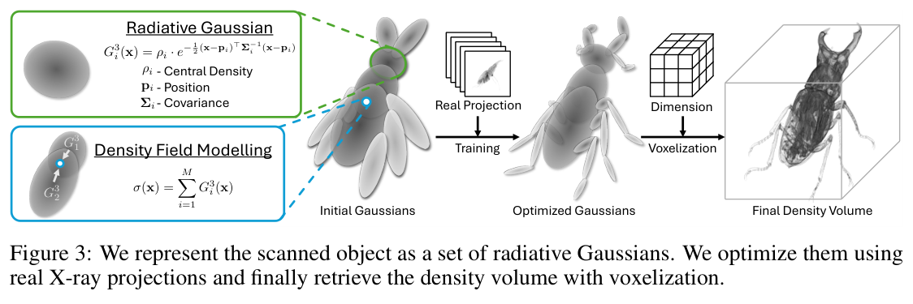
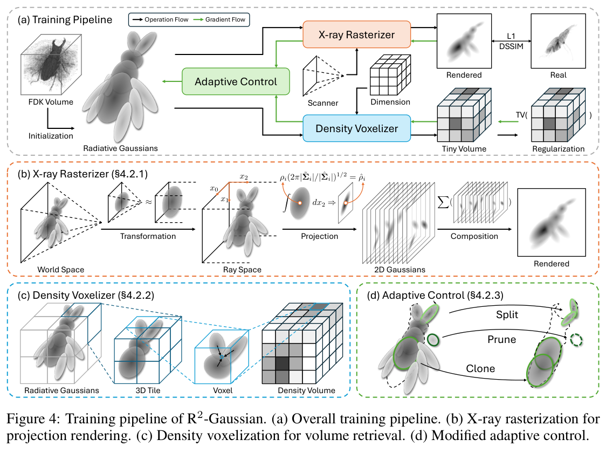
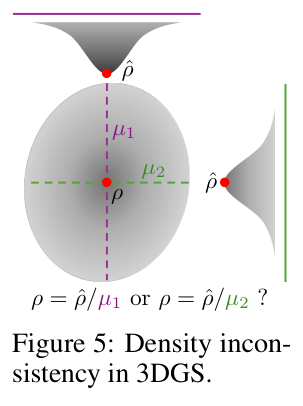
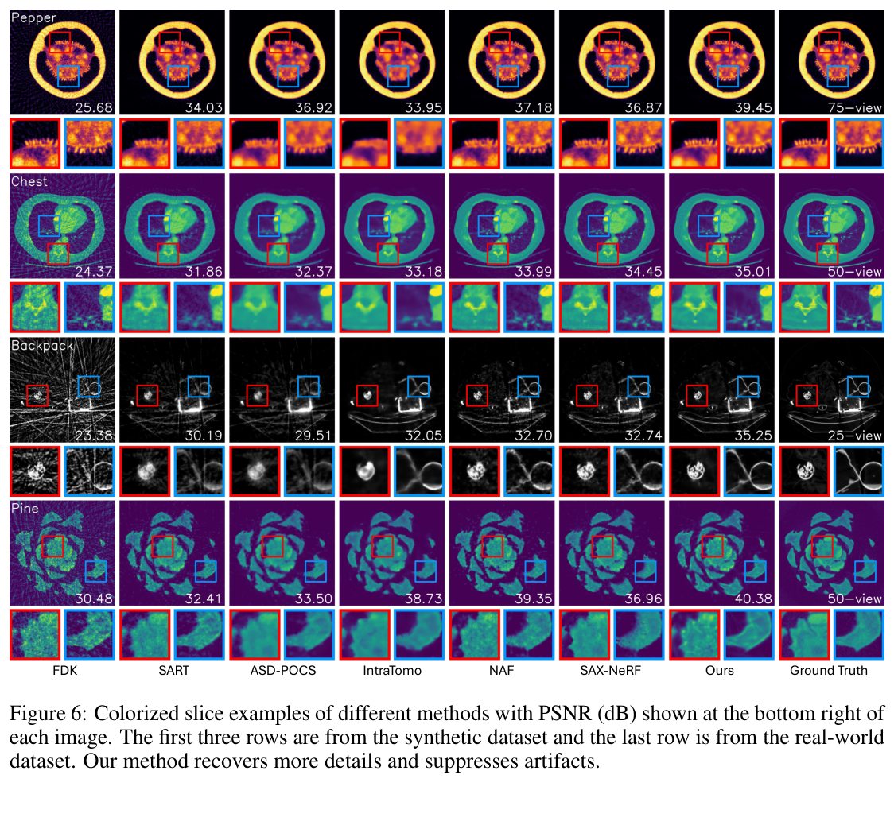
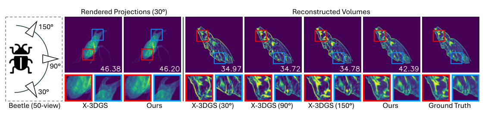
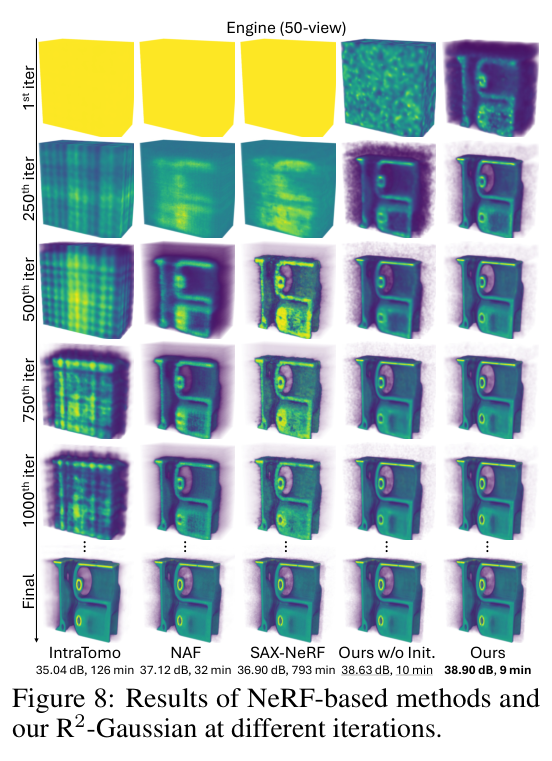
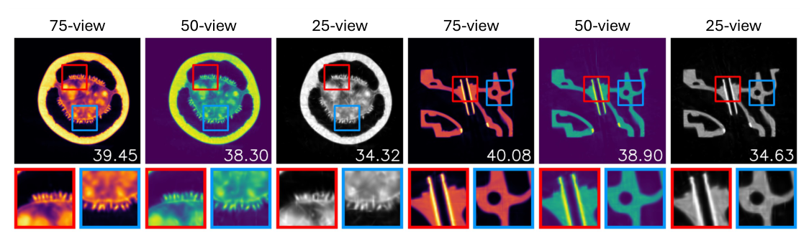
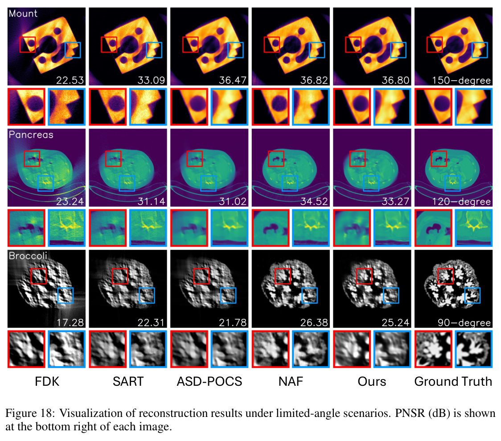

---
tags:
  - papers/computed-tomography
  - papers/3D-Gaussian-splatting
aliases:
  - "R2-Gaussian"
  - "Rectified Radiative Gaussians"
date: 2024
doi: 10.52202/079017-1427
arxiv_id: 2405.20693
---

# R²-Gaussian：面向断层重建的辐射高斯溅射校正

## 核心信息

- 标题: R²-Gaussian: Rectifying Radiative Gaussian Splatting for Tomographic Reconstruction
- 标题翻译: R²-Gaussian：面向断层重建的辐射高斯溅射校正
- 作者: Ruyi Zha、Tao Jun Lin、Yuanhao Cai、Jiwen Cao、Yanhao Zhang、Hongdong Li
- 机构: 澳大利亚国立大学；约翰斯·霍普金斯大学；悉尼科技大学机器人研究所
- 发表时间: 2024
- 发表渠道: NeurIPS 2024
- DOI: 10.52202/079017-1427
- arXiv: 2405.20693
- 论文链接: https://arxiv.org/abs/2405.20693
- 代码 / 项目: https://github.com/Ruyi-Zha/r2_gaussian
- 数据 / 资源: FIPS、LIDC-IDRI、Pancreas-CT、X-Plant、Open SciVis、TIGRE
- 论文类型: 稀疏视角 CT 重建方法；可微物理渲染与三维高斯溅射

## 原文摘要翻译

三维高斯溅射在图像渲染和表面重建方面已展现出很有前景的结果，但它在 X 射线计算机断层成像等体重建任务中的潜力仍缺乏充分探索。本文提出 R²-Gaussian，这是首个基于三维高斯溅射的稀疏视角断层重建框架。通过仔细推导 X 射线光栅化函数，作者发现标准三维高斯溅射公式中一个此前未知的积分偏差，它会妨碍准确恢复体数据。为解决这一问题，作者通过重新分解从三维高斯到二维高斯的投影，提出一种新的校正技术。

新方法包含三项关键创新：引入为该任务定制的高斯核；将光栅化扩展到 X 射线成像；开发基于 CUDA 的可微体素化器。在合成数据集和真实世界数据集上的实验表明，本方法在精度和效率上都优于当前先进方法。尤其是，它能在 4 分钟内给出高质量结果，比基于 NeRF 的方法快 12 倍，同时速度与传统算法相当。代码和模型可从项目主页获得。

## 创新点

1. **发现并形式化三维高斯溅射的积分偏差。** 标准方法把三维高斯投影成二维高斯时直接继承不透明度，却忽略了视角和协方差共同决定的路径积分尺度。对普通图像渲染，这个自由度可以被外观参数吸收；对 CT 密度反演，它会使同一高斯从不同方向恢复出不同三维密度。
2. **用“辐射高斯”表示可查询的物理密度场。** 每个高斯不再携带视角相关颜色与经验不透明度，而以中心衰减密度、位置和完整各向异性协方差定义局部密度。这样，同一组基元既能产生二维 X 射线投影，也能查询三维体素。
3. **重写适用于对数 X 射线投影的可微光栅化器。** 论文利用 Beer–Lambert 模型在对数域中的可加性，把沿射线的三维高斯积分解析地改写为二维高斯求和，避免自然光渲染中的 alpha 合成和 NeRF 的密集点采样。
4. **把体素化器纳入训练闭环。** CUDA 体素化器以三维块剔除和并行累加实现超过 100 FPS 的体查询；因为它可微，训练时可以直接在小体数据上施加总变分先验，而不只是训练结束后导出体数据。

## 一句话总结

这篇论文真正重要的贡献不是“把 3DGS 换到 CT 上”，而是指出二维投影可拟合并不等于三维物理量可恢复，并通过保持高斯路径积分尺度、可加衰减物理和三维密度查询的一致性，得到一个分钟级的逐病例稀疏视角重建器。

## 研究问题

### 稀疏视角 CT 的质量—速度矛盾

CT 投影的采集数量受辐射剂量、扫描时间和机械稳定性限制。少于 100 个视角时，解析法 FDK 很快，却出现严重条纹；SART、ASD-POCS 等迭代法能抑制部分伪影，但容易损失细节；监督网络依赖跨病例训练集，对分布外对象不稳；NeRF 类逐病例方法不需要外部训练数据，但沿每条射线采样大量点，通常耗时半小时到十余小时。

作者选择的是逐病例自监督路线：输入某一被扫描对象的稀疏投影和已知扫描几何，用可微前向模型反复渲染投影，以测量投影监督该对象自身的三维表示。这里没有传统意义上的训练集—测试集划分，也不是训练一次后对新病例直接前向推理；每个新对象仍需要重新优化数分钟。

### 为什么标准 3DGS 不能直接拿来重建 CT

标准 3DGS 的目标是生成视觉正确的 RGB 图像。高斯的不透明度可以和颜色、协方差、重叠关系共同吸收投影尺度误差，只要最终像素看起来正确即可。CT 的目标不同：它要恢复视角无关、具有物理含义的三维衰减系数。若从不同视角拟合同一对象得到的高斯密度不能统一，二维投影即使很逼真，三维体也不可信。

论文因此把问题重新表述为：如何让显式高斯基元在三维密度查询、二维路径积分和多视角投影监督之间保持同一物理量定义，同时保留高斯光栅化的并行效率。

## 数据与任务定义

### 前向模型和输出

一条射线可以写为：

$$
\mathbf r(t)=\mathbf o+t\mathbf d.
$$

原始强度服从 Beer–Lambert 定律。取对数后，像素就是沿路径的衰减密度积分：

$$
I(\mathbf r)=\log I_0-\log I'(\mathbf r)
=\int_{t_n}^{t_f}\sigma(\mathbf r(t))\,dt.
$$

输入是 $N$ 个角度的对数投影及锥束扫描几何，输出是离散三维衰减体。作者不显式建模康普顿散射等各向异性输运，而把它们视作投影噪声。

### 合成与真实数据

| 数据部分 | 对象与规模 | 投影和预处理 | 真值 |
|---|---|---|---|
| 合成数据 | 15 个真实 CT 体；人体器官、动植物、人工物体各 5 个；体尺寸 $256^3$ | TIGRE 生成 $512^2$、覆盖 $0^\circ$–$360^\circ$ 的投影；加入高斯电子噪声和泊松光子噪声 | 原始完整体 |
| 真实数据 | FIPS 的松果、贝壳、核桃；每个对象 721 幅投影 | 投影缩放为 $560^2$ 并归一化；下采样为 75、50、25 视角 | 使用全部 721 视角做 FDK 得到的伪真值 |

合成数据中的 15 个对象并不是用于训练一个跨病例模型，而是 15 个彼此独立的优化与评估实例。真实数据的 PSNR 和 SSIM 也不是相对于直接测得的真实密度，而是相对于全视角 FDK 参考体；因此它们反映“对该参考重建的接近程度”，不能等价为绝对密度精度。

### 指标与比较对象

PSNR 在完整三维体上计算；SSIM 分别在轴向、冠状面和矢状面切片上计算后取平均。

强基线包括三类传统方法 `FDK`、`SART`、`ASD-POCS`，以及逐病例神经方法 `IntraTomo`、`NAF`、`SAX-NeRF`。作者刻意不比较需要外部训练数据的监督模型。

## 方法主线

*论文原图编号：Figure 3。被扫描对象由辐射高斯集合表示，经真实投影监督优化后再体素化成最终密度体；该图明确了方法的输入、显式表示和输出。*

### 机制流程

*论文原图编号：Figure 4。R²-Gaussian 的完整训练流程，包括 FDK 初始化、X 射线光栅化、可微体素化、三维正则和修改后的自适应控制。*

1. **由解析重建建立初始显式表示。** 输入稀疏投影和扫描几何，先在不到 1 秒内用 FDK 得到粗体；以阈值 $\tau=0.05$ 去除空区，抽取 $M=50{,}000$ 个位置，按最近邻距离设尺度、设初始旋转为零，并把查询密度乘经验系数 $k=0.15$。输出是初始辐射高斯集合。
2. **用无偏 X 射线光栅化器生成预测投影。** 将高斯从世界空间局部仿射变换到射线空间，沿射线轴解析积分成二维高斯，并用协方差缩放因子校正中心密度；所有二维高斯直接相加形成对数投影。输出送入 $L_1$ 与 D-SSIM 光度损失。
3. **以可微体素化施加三维约束。** 每次迭代随机查询一个 $32^3$ 小体，在体素空间计算总变分损失；梯度经 CUDA 体素化器反传到高斯参数。输出返回优化器，同时自适应控制在第 500–15,000 次迭代间克隆、分裂或删除高斯。
4. **导出目标体数据。** Adam 共优化 30,000 次迭代；训练结束后，将最终高斯集合体素化为 $256^3$ 密度体，用于定量评估和下游分析。

### 辐射高斯不是普通不透明度基元

第 $i$ 个辐射高斯定义局部密度：

$$
\begin{aligned}
G_i^3(\mathbf x)&=\rho_i\exp\left[-\frac12(\mathbf x-\mathbf p_i)^\top
\mathbf\Sigma_i^{-1}
(\mathbf x-\mathbf p_i)\right],\\
\sigma(\mathbf x)
&=\sum_{i=1}^{M}G_i^3(\mathbf x).
\end{aligned}
$$

$\rho_i$ 是中心衰减密度，$\mathbf p_i$ 是位置，$\mathbf\Sigma_i$ 是完整协方差；协方差再分解为旋转与尺度以便优化。这里的“辐射”不是说模型显式模拟了散射、荧光或完整辐射输运，而是表示这些高斯服务于 X 射线衰减成像。它仍建立在标量、各向同性衰减假设上。

### 积分偏差从何而来

*论文原图编号：Figure 5。简化的二维到一维投影说明，同一高斯从不同方向积分具有不同路径尺度；若沿用二维不透明度，就无法唯一恢复三维中心密度。*

三维高斯变换到射线空间后，记协方差为 $\tilde{\mathbf\Sigma}_i$；删除射线方向对应的行列，得到图像平面协方差 $\hat{\mathbf\Sigma}_i$。沿射线积分时，二维高斯中心幅值必须为：

$$
\hat\rho_i=\mu_i\rho_i,\qquad
\mu_i=
\sqrt{\frac{2\pi|\tilde{\mathbf\Sigma}_i|}
{|\hat{\mathbf\Sigma}_i|}}.
$$

$\mu_i$ 本质上编码该高斯沿当前射线方向的有效路径长度。标准 3DGS 直接让二维高斯继承三维不透明度，相当于把 $\hat\rho_i$ 当成自由的“投影幅值”。若再尝试用 $\rho_i=\hat\rho_i/\mu_j$ 反求三维密度，不同视角 $j$ 的 $\mu_j$ 会给出不同答案。R²-Gaussian 则把 $\rho_i$ 固定为视角无关三维密度，每次前向投影都显式计算 $\mu_i$，因此二维拟合和三维查询使用同一物理量。

### X 射线光栅化器

光栅化器不是硬件探测器，而是可微的数值前向投影器。其关键步骤是：

- 将锥束几何近似为针孔模型，把观察射线在射线空间中对齐到第三坐标轴；
- 对每个三维高斯沿该轴解析积分，得到二维高斯；
- 与自然光成像不同，对数衰减满足线性可加，因此直接求和，不使用前后遮挡式 alpha 混合；
- 用 CUDA 同时实现前向与反向传播，使位置、密度、尺度和旋转都能由投影误差更新。

这也是速度优势的根源：NeRF 对每条射线进行大量空间点采样和网络求值，R²-Gaussian 则把连续积分化为高斯参数的解析投影和高度并行的瓦片光栅化。

### 可微体素化器

目标空间先划分为 $8\times8\times8$ 三维块；只保留其 99% 置信椭球与当前块相交的高斯；再在块内并行累加邻近高斯对各体素的贡献。该剔除策略避免每个体素遍历全部高斯，使体查询速度超过 100 FPS。

更重要的是，可微体素化器把二维投影监督与三维先验接到同一参数集合上。若只有光栅化器，模型可能只追求投影拟合；加入小体 TV 正则后，可以直接惩罚三维密度中的局部振荡。

### 优化目标与自适应控制

总损失为：

$$
\mathcal L_{\mathrm{total}}
=\mathcal L_1(\mathbf I_r,\mathbf I_m)
+0.25\,\mathcal L_{\mathrm{ssim}}(\mathbf I_r,\mathbf I_m)
+0.05\,\mathcal L_{\mathrm{tv}}(\mathbf V_{\mathrm{tv}}).
$$

位置、密度、尺度和旋转的初始学习率分别为 0.0002、0.01、0.005 和 0.001，并指数衰减到初始值的 0.1 倍。自适应控制删除空高斯，对高梯度高斯进行克隆或分裂；考虑到器官具有大面积均匀区域，不删除尺寸大的高斯。新增高斯时将原高斯和复制高斯的密度都减半，以减少基元数量突然变化造成的性能震荡。

## 关键结果

### 主结果与强基线

下表选取最能比较质量—时间权衡的 50 视角结果。传统法和神经法的时间口径都是论文报告的单病例运行时间；FDK 因不到 1 秒而未列时间。

| 方法 | 合成 PSNR / SSIM | 合成时间 | 真实 PSNR / SSIM | 真实时间 |
|---|---:|---:|---:|---:|
| FDK | 26.50 / 0.422 | 即时 | 27.38 / 0.449 | 即时 |
| SART | 34.37 / 0.875 | 3分36秒 | 33.61 / 0.827 | 3分28秒 |
| ASD-POCS | 34.34 / 0.914 | 1分52秒 | 34.58 / 0.861 | 1分49秒 |
| IntraTomo | 35.25 / 0.923 | 2时9分 | 36.99 / 0.854 | 2时19分 |
| NAF | 36.65 / 0.932 | 32分4秒 | 36.44 / 0.818 | 51分31秒 |
| SAX-NeRF | 36.86 / 0.938 | 13时5分 | 34.89 / 0.840 | 13时23分 |
| R²-Gaussian，10k | 37.63 / 0.949 | 2分35秒 | 37.52 / 0.866 | 3分37秒 |
| R²-Gaussian，30k | **37.98 / 0.952** | 8分14秒 | **38.24 / 0.864** | 13分52秒 |

在 50 视角合成数据上，`10k` 迭代只需 `2分35秒`，已经比所有强基线更高；相对 `NAF` 的 `32分4秒` 约快 `12.4` 倍，这就是摘要“4 分钟、12 倍加速”的主要量级来源。

`30k` 迭代继续把合成 PSNR 提至 `37.98 dB`。跨全部视角平均，论文报告相对 `SAX-NeRF` 在合成数据上提高 `0.93 dB`，相对 `IntraTomo` 在真实数据上提高 `0.95 dB`。

*论文原图编号：Figure 6。传统法、NeRF 法与 R²-Gaussian 的典型切片比较；条纹、过度平滑、椒盐噪声和局部细节恢复的差异比单一平均分更直观。*

定性结果与数值大体一致：`FDK` 和 `SART` 有条纹，`ASD-POCS` 和 `IntraTomo` 过度平滑，`NAF` 与 `SAX-NeRF` 含椒盐噪声。

`R²-Gaussian` 能同时保留辣椒胚珠等细节和胸部肌肉等均匀区的平滑性。

### 积分偏差对照真正说明了什么

作者构造 X-3DGS：保留有偏的三维到二维投影，但使用相同 X 射线合成和相同体素化器。体素化前只能用所有训练视角平均缩放因子补偿密度。

| 视角数 | X-3DGS 二维 PSNR | 本文二维 PSNR | X-3DGS 三维 PSNR | 本文三维 PSNR |
|---:|---:|---:|---:|---:|
| 75 | 49.97 | 50.54 | 23.40 | 38.86 |
| 50 | 47.26 | 49.70 | 21.24 | 37.98 |
| 25 | 39.84 | 46.28 | 14.07 | 35.17 |

三种设置平均来看，校正使二维 PSNR 提高 3.15 dB，却使三维 PSNR 提高 17.77 dB。这个不对称结果是整篇论文最有说服力的证据：X-3DGS 可以把二维投影拟合得很好，三维体却严重错误；因此该校正解决的是三维物理量的可辨识性，而不只是让渲染图更漂亮。

*论文原图编号：Figure 7。X-3DGS 从不同查询方向得到彼此不一致的三维切片，而 R²-Gaussian 在相似二维拟合下恢复出视角一致的体数据。*

### 组件消融与参数退化

| 设置 | PSNR | SSIM | 时间 | 高斯数 | 主要含义 |
|---|---:|---:|---:|---:|---|
| 随机初始化基线 | 36.47 | 0.934 | 4分57秒 | 50k | 无 FDK、无自适应控制、无 TV |
| 加 FDK 初始化 | 37.37 | 0.944 | 5分29秒 | 50k | PSNR 提高 0.90 dB |
| 加自适应控制 | 37.33 | 0.942 | 7分33秒 | 70k | 质量提高，但基元与时间增加 |
| 加 TV 正则 | 36.79 | 0.943 | 6分30秒 | 50k | 对 SSIM 和平滑性更有帮助 |
| 完整模型 | **37.98** | **0.952** | 8分37秒 | 68k | 相对基线提高 1.51 dB、0.018 SSIM |
| $M=200k$ | 37.82 | 0.949 | 9分54秒 | 206k | 更多初始高斯并不继续改善性能 |
| $\lambda_{\mathrm{tv}}=0.15$ | 37.40 | 0.949 | 8分27秒 | 69k | 过强平滑损害细节 |
| $D=64$ | 37.82 | 0.949 | 11分35秒 | 67k | 更大 TV 小体更慢且性能下降 |

这些结果说明完整模型不是单一模块带来的偶然增益，但也没有做完整的全因子交互实验。最稳妥的解释是：FDK 主要提供正确初始结构，自适应控制提高局部表示容量，TV 主要压制三维振荡；三者作用不同且存在质量—时间权衡。

### 收敛速度与过拟合信号

*论文原图编号：Figure 8。R²-Gaussian 在数百次迭代内形成清晰结构，FDK 初始化进一步加速；NeRF 基线在相同早期阶段仍明显模糊。*

图 8 支持“显式高斯加 FDK 初始化带来快速早期收敛”。发动机 50 视角样例中，本文 9 分钟达到 38.90 dB；NAF 32 分钟为 37.12 dB，SAX-NeRF 793 分钟为 36.90 dB。

但更长训练并非处处更好。真实数据 25 视角时，10k 迭代为 35.10 dB / 0.840，30k 迭代反而降至 34.83 dB / 0.833。这是一个重要负面信号：当观测更稀疏且参考体本身是伪真值时，增加迭代可能放大对有限投影的过拟合。

### 有限角外推

| 扫描范围 | NAF PSNR / SSIM | 本文 PSNR / SSIM | NAF 时间 | 本文时间 |
|---|---:|---:|---:|---:|
| $0^\circ$–$150^\circ$ | 36.29 / 0.940 | 36.12 / **0.948** | 27分18秒 | 9分3秒 |
| $0^\circ$–$120^\circ$ | 33.35 / 0.922 | 32.68 / **0.923** | 27分6秒 | 8分36秒 |
| $0^\circ$–$90^\circ$ | 29.89 / 0.884 | 29.21 / **0.886** | 27分25秒 | 8分28秒 |

本文在三个有限角设置中的 PSNR 都略低于 NAF，尽管 SSIM 略高。这说明它在稀疏但覆盖完整圆周的插值任务上很强，却没有证明对缺失整段角度的外推同样占优。

## 深度分析

### 真正贡献：保持物理量，而不是只换表示

高斯溅射早于 3DGS 就是一种成熟的信号重建和渲染思想。R²-Gaussian 的新意不在“用高斯表示连续体”本身，而在于明确区分三种量：

1. 三维空间中的中心密度 $\rho_i$。
2. 某观察方向上的路径积分尺度 $\mu_i$。
3. 图像平面上的二维积分幅值 $\hat\rho_i$。

标准 3DGS 把第二、第三项折叠到经验不透明度中；本文把三者重新拆开。对于定量成像，这相当于进行一次量纲和守恒关系审计：前向投影使用什么物理量，逆问题输出就必须能回到同一个物理量。这个思想可迁移到相位、散射、浓度或材料参数反演，而不只适用于 CT。

### 为什么偏差在图像渲染中隐蔽、在体重建中致命

从单一视角看，只要调节二维幅值，错误的三维参数也可以生成正确像素；多视角图像损失并不会自动保证内部表示具有正确物理意义。标准 3DGS 的目标函数只关心每幅图的重投影，因而可能落在“所有二维图都像，但三维密度随查询方向改变”的等价解上。

CT 则要求同一 $\sigma(\mathbf x)$ 同时解释所有射线路径积分。协方差决定高斯沿不同方向的有效厚度，遗漏 $\mu_i$ 就相当于把厚度变化误认为密度变化。表 2 中二维分数与三维分数的巨大分离正是这种不可辨识性的实验表现。

### 速度来源与局部性代价是同一枚硬币

R²-Gaussian 快，是因为每条射线不再查询一个全局网络，而只处理与像素瓦片相交的显式高斯；体素查询也只累加与三维块相交的核。这种局部稀疏更新非常适合 CUDA 并行。

同一局部性也解释了两个失败模式。观测极少时，某些高斯只被少量方向约束，容易沿射线拉成长针；缺失整段角度时，未被射线穿过的区域无法通过一个全局网络的参数共享得到充分更新。NeRF 的每条射线梯度会改变整个网络，速度慢但具备更强全局耦合；显式高斯则相反。

### FDK 初始化意味着这是一种混合重建器

论文常把方法表述为首个基于 3DGS 的直接断层重建框架，但工程上更准确的描述是“解析重建初始化 + 显式高斯可微细化”。FDK 不只是无关紧要的起点：它负责确定非空区域、初始位置、尺度和密度，消融中单独贡献 0.90 dB，并使模型在第 1 次迭代前就具有粗结构。

这不是缺点，反而是值得复用的系统设计：让可靠而快速的物理算法提供低频结构，让可学习显式表示补偿稀疏视角伪影和高频细节。但在比较“纯 3DGS”与其他方法时，应把这份解析先验算入性能来源。

### 论文证明了什么，没有证明什么

论文直接证明的是：在给定锥束几何、数据规模、噪声模型和单张 RTX 3090 的逐病例协议下，正确处理高斯路径积分能显著改善三维密度恢复，并使光栅化优化快于所选 NeRF 基线。

论文没有证明：

- R²-Gaussian 是一次训练、任意病例直接推理的通用模型；
- 真实数据指标等于绝对物理密度精度，因为真值是全视角 FDK；
- 方法在临床诊断、同步辐射相位衬度、材料定量或超高分辨率体数据上仍保持同样优势；
- 积分偏差对所有只做 RGB 新视角合成的 3DGS 方法都构成实际问题；
- 有限角、几何失配、束硬化和强散射条件下仍优于全局网络表示。

### 对同步辐射纳米 CT 的启示

迁移到同步辐射线站时，最值得借鉴的是“显式基元 + 可微物理前向模型 + 粗重建初始化”，而不是直接照搬锥束矩阵。通常需要进一步替换：

- 将实验室锥束几何改为平行束或近似平行束传播；
- 若使用传播相位衬度，将 Beer–Lambert 投影改为复透射函数与 Fresnel 传播；
- 把暗场、平场、旋转中心漂移、探测器点扩散函数和角度误差加入可微前向模型；
- 用真实模体、全角高质量迭代重建或独立测量建立参考，而不是仅用 FDK 伪真值；
- 对 $2048^3$ 量级体数据评估高斯数量、显存、体素化吞吐和分块策略，因为论文只验证到 $256^3$。

## 局限

### 证据和评测边界

- 真实部分只有 3 个 FIPS 对象，真值由全部视角 FDK 生成，无法评估相对真实密度的偏差。
- 多次随机初始化、误差条、置信区间和统计显著性均不在论文评测协议中；NeurIPS 检查表对此明确回答“否”。
- 15 个合成体和 3 个真实体都是逐病例优化实例，不足以证明跨扫描仪、跨模态或跨分辨率泛化。
- 运行时间只在单张 RTX 3090 和 $256^3$ 输出上报告，缺少随投影分辨率、体素数和高斯数量增长的显存及复杂度曲线。

### 表示和优化边界

*论文原图编号：Figure 17。25 视角下出现沿射线方向的针状伪影，说明局部高斯可以过拟合不足的投影约束。*

极稀疏视角会产生针状伪影；初始化过多高斯、过强 TV 或过大 TV 小体都可能让质量下降并增加耗时。正文对密度非负性、停止条件、随机种子敏感性和高斯数量上限也缺少系统分析。

*论文原图编号：Figure 18。有限角任务中，R²-Gaussian 在已扫描区域细节较好，但未观测区域更模糊，显示其外推能力弱于具有全局参数共享的 NAF。*

有限角结果说明该方法更擅长完整角域内的稀疏插值，而非缺失大段角度时的外推。作者用“局部高斯更新”解释这一现象很合理，但没有通过改变全局耦合、初始化或正则化的干预实验完全验证因果机制。

### 真实设备物理边界

模型假设各向同性、单能量衰减，没有显式处理康普顿散射、束硬化、相位衬度和多材料能谱。参考平场 $I_0$ 的不均匀、热漂移、机械振动、内外参变化和旋转中心误差也未联合优化。对同步辐射纳米 CT，这些误差可能比网络或高斯表示本身更早成为性能瓶颈。

## 我的笔记

### 最值得复用的设计原则

1. **先审计投影算子是否保持目标物理量。** 只比较二维重投影损失不足以证明三维结果可信，应同时做多视角一致性和三维查询测试。
2. **粗物理解与可学习细化结合。** 对上海光源纳米 CT，可用 FBP、SIRT 或现有快速重建提供低频初值，再由显式基元优化相位、密度或结构细节。
3. **让三维导出过程可微。** 一旦体素化能够反传，就能加入 TV、非负性、材料稀疏性、分段常数或多尺度先验。
4. **把失败模式纳入采集决策。** 针状伪影和有限角模糊可以反过来驱动下一角度选择，而不是只在重建后被动接受。

### 建议的复现实验

- 先复现 50 视角合成“发动机”样例，逐一验证二维 PSNR、三维 PSNR、10k/30k 时间和高斯数量。
- 构造单个各向异性高斯，数值积分多个方向，与含或不含 $\mu_i$ 的解析投影比较，直接验证积分偏差。
- 用同一随机种子运行随机初始化、FDK 初始化、TV 和自适应控制消融，并至少重复 5 次报告方差。
- 对 25 视角和有限角设置记录高斯尺度方向分布，检验针状伪影是否确实对应沿射线拉长的协方差。
- 在同步辐射平行束数据上先固定几何，只替换前向投影；随后逐步加入旋转中心、平场和相位传播参数，避免一次性把所有域差异混在一起。

### 后续问题

- 物理上是否强制 $\rho_i\ge 0$，若没有，负密度如何影响投影拟合与体数据解释？
- 能否将全局低频隐式网络与局部高斯结合，在不显著牺牲速度的情况下改善有限角外推？
- 高斯协方差、密度和视角覆盖能否形成每体素不确定度，并用于主动选择下一投影角度？
- 在 $1024^3$ 或 $2048^3$ 纳米 CT 体上，块剔除、显存和反向传播如何扩展？
- 当显式建模相位、散射、束硬化和标定参数时，积分偏差校正带来的增益还剩多少？

## 引用

- [[02_深读总结_GaSpCT|GaSpCT：基于高斯溅射的 CT 投影合成]]
- [[2023_Full-field_hard_X-ray_nano-tomography_SSRF|上海光源硬 X 射线全场纳米 CT]]
- Kerbl et al. (2023). 3D Gaussian Splatting for Real-Time Radiance Field Rendering.
- Zha et al. (2022). NAF: Neural Attenuation Fields for Sparse-View CBCT Reconstruction.
- Zang et al. (2021). IntraTomo: Self-Supervised Learning-Based Tomography via Sinogram Synthesis and Prediction.
