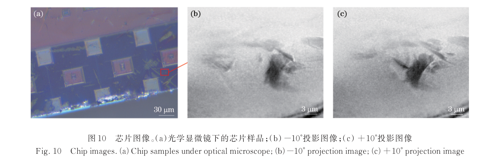
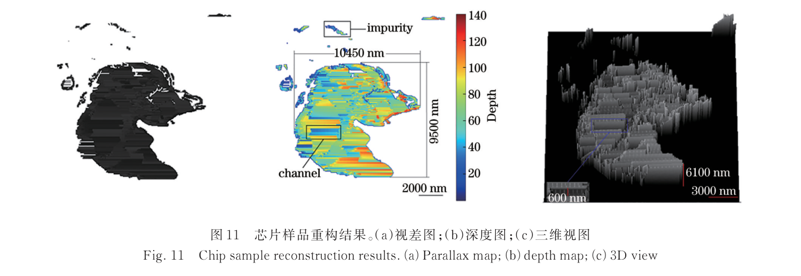

---
tags:
  - papers/上海光源纳米CT
  - papers/硬X射线全场显微
  - papers/立体成像
aliases:
  - "SSRF BL18B X-ray stereo imaging"
  - "芯片双角X射线立体成像"
date: 2024-07-01
doi: 10.3788/AOS240575
---

# X射线纳米分辨立体成像及其在芯片表征中的应用

## 核心信息

- 标题: X射线纳米分辨立体成像及其在芯片表征中的应用
- 标题翻译: X-Ray Nano-Resolution Stereo Imaging and Its Application in Chip Characterization
- 作者: 刘聪、王飞翔、陶芬、杜国浩、张玲、汪俊、邓彪
- 机构: 上海大学微电子学院；中国科学院上海高等研究院上海光源中心
- 发表时间: 2024-07（第44卷第13期）
- 发表渠道: 光学学报，44(13)，1334002
- DOI: 10.3788/AOS240575
- 论文类型: 上海光源`BL18B`硬X射线全场显微与双目视差结合的方法及芯片应用论文；证据属于两角度快速深度估计，不是计算机断层成像

## 原文摘要翻译

在芯片制造技术持续发展的背景下，对纳米量级检测的需求也随之急剧增加。然而，传统的光学、电镜和X射线检测技术都存在一定的局限性。本文提出了一种快速、无损、纳米分辨的立体成像技术。该技术基于上海光源纳米三维成像线站（`BL18B`）的透射X射线显微镜，结合双目立体视觉原理构建X射线纳米分辨立体成像系统，通过归一化互相关匹配算法获得标准样品分辨率靶的线条宽度、长度及深度等信息。仿真结果和分辨靶实验所得深度信息与实际深度之间的归一化标准差分别为 `1.441×10^-2` 和 `8.11×10^-4`，验证了该方法获取样品深度信息的准确性。同时，作者利用该方法实现对芯片样品的精确检测，为芯片检测提供一种新的纳米分辨无损解决方案。

## 创新点

1. **把双目立体视觉移植到同步辐射全场纳米显微镜。** 实验不采集CT所需的大量角度，而是从两个可透射角度取得投影，以归一化互相关匹配同名像素，再通过旋转几何恢复深度。
2. **针对扁平芯片的不可透射角度约束设计工作流。** 两视角可以避开芯片在大倾角下路径过长、吸收过强的问题，并把采集量压缩到两幅投影，适合作为快速局部筛查。
3. **形成“仿真—标准靶—真实芯片”的三级验证。** 连续变深螺旋丝检查算法，`600 nm`厚分辨靶检查物理深度恢复，硅基芯片案例检查实际结构定位。
4. **显式测量角差的恢复率—误差权衡。** 在`16°–24°`范围内，`18°`误差最小但恢复率最低，`20°`获得最高恢复率和较小误差；论文据此选择折中角度，而不是只优化单一指标。

## 一句话总结

该工作在上海光源`BL18B`用两幅硬X射线全场投影、局部归一化互相关和视差几何恢复扁平芯片局部结构的深度，证明了快速“2.5D”立体筛查可行；`50 nm`只是有效像素尺寸，论文没有建立深度分辨率或各向同性三维分辨率，因此结果不能并入nano-CT性能指标。

## 研究问题

### 为什么需要CT之外的深度通道

常规X射线全场显微图是沿传播方向积分的二维投影，不能直接给出结构的前后位置。多角度CT可以反演三维衰减体，但扁平芯片在某些倾角下等效厚度骤增，X射线难以穿透；叠层断层又需要大量扫描位置和投影，采集与重建时间较长。论文要解决的是：能否只选两个仍可透射的角度，从可匹配纹理的视差中快速估算深度。

### 任务的准确表述

这里的“三维重构”是把二维投影中的可匹配像素附上深度坐标，形成深度图和表面式三维显示。两幅投影不足以唯一反演完整三维衰减系数；沿射线重叠、遮挡、弱纹理及只在单一视角出现的结构都可能缺失。因此，这是一种X射线立体成像或“2.5D”深度估计，不是少角度CT，更不是完整nano-CT。

## 数据与任务定义

### 束线和成像尺度

`BL18B`单色光覆盖`5–14 keV`，线站总体介绍给出最高空间分辨率可达`20 nm`。本文实验使用直径`100 µm`、最外环宽度`40 nm`的波带片，工作能区为`8.1–9 keV`。

在`8.2 keV`时，焦距为`26.45 mm`，物距`26.65 mm`，像距`3464.5 mm`，放大倍数约`130`。

探测器物理像素`6.5 µm`对应样品面有效像素`50 nm`。这些是系统设置和采样尺度，不是本方法独立测得的深度分辨率。

### 三组验证任务

| 任务 | 输入与设置 | 评价输出 |
|---|---|---|
| 模拟螺旋丝 | 直径`100`像素、深度连续变化的线状物；两幅模拟投影 | 深度图、端点连续性、恢复曲线与标准曲线的归一化标准差 |
| 分辨靶 | `600 nm`厚靶；`8.2 keV`；`800 ms`曝光；采集角度`±15°` | `16°/18°/20°/22°/24°`角差下的恢复率与归一化平方差，约`600 nm`沟槽深度及SEM形貌对照 |
| 硅基芯片 | `8.3 keV`；`2 s`曝光；采集角度`±23°`，实际重建采用`±10°`投影 | 局部结构长、宽、高，约`600 nm`类沟道和杂质位置 |

*论文原图编号：Fig. 10。芯片样品的光学显微图和`-10°/+10°`两幅X射线投影；重建实际使用的是角差`20°`的双视角数据。*

### 数据边界

论文展示一个分辨靶区域和一个芯片局部结构，视场只有十几个微米。公开材料止于论文图表，原始双角投影、完整参数文件和实现代码没有随文形成可下载数据包；因此当前证据更接近方法原型验证，而非大样本缺陷检测基准。

## 方法主线

### 光路与双视角等价关系

`BL18B`全场透射显微系统依次包含束流阻挡器、单毛细管椭球聚焦镜、针孔、样品旋转台、菲涅耳波带片和探测器。实验实际使用单束X射线，在旋转前后采集两幅投影；几何上等价于两束夹角为$\theta$的平行光同时观察同一物体。

> [!figure] Fig. 1 BL18B纳米成像系统光路
> 建议位置：方法主线
> 放置原因：该图标出聚光、样品旋转、波带片放大和探测器的完整光路，是理解数据来源的直接图示。
> 当前状态：保留占位；人工复核发现候选同时混入期刊页眉、章节标题和两栏正文，属于页面内容污染。

> [!figure] Fig. 2 双视角投影几何
> 建议位置：方法主线
> 放置原因：该图说明“两束夹角为$\theta$的X射线”与样品旋转获取双投影的立体视觉抽象。
> 当前状态：保留占位；图体和中文图注完整，但底边残留被截断的英文图注半句，为避免残片进入成品而拒绝插入。

### 归一化互相关匹配

先进行背景消减、去噪和锐化，再在左图每个像素$p$周围取`3×3`窗口，并沿右图同一水平线搜索位移$d$。归一化互相关为

$$
N_{\mathrm{cc}}(p,d)=
\frac{
\sum_{(x,y)\in W_p}
\left[I_1(x,y)-\bar I_1(p_x,p_y)\right]
\left[I_2(x+d,y)-\bar I_2(p_x+d,p_y)\right]
}{
\sqrt{
\sum_{(x,y)\in W_p}
\left[I_1(x,y)-\bar I_1(p_x,p_y)\right]^2
\sum_{(x,y)\in W_p}
\left[I_2(x+d,y)-\bar I_2(p_x+d,p_y)\right]^2
}
}.
$$

$N_{\mathrm{cc}}$位于$[-1,1]$，选择相关性最大的候选作为对应点，横坐标差即视差。归一化减弱整体灰度与对比度变化的影响，但它仍要求局部窗口有可区分纹理；重复图样或近乎均匀区域会产生多解。

### 视差到深度

绕垂直于投影平面的轴旋转$\theta$时，论文采用的二维坐标关系为

$$
\begin{bmatrix}
x_2\\
y_2
\end{bmatrix}
=
\begin{bmatrix}
\cos\theta & \sin\theta\\
-\sin\theta & \cos\theta
\end{bmatrix}
\begin{bmatrix}
x_1\\
y_1
\end{bmatrix}.
$$

令$d=x_2-x_1$，可得待恢复深度

$$
y_1=
\frac{d}{\sin\theta}
+x_1\tan\left(\frac{\theta}{2}\right).
$$

第一项把视差换算为深度，第二项补偿旋转时横向坐标对深度的贡献。$\theta$过小时，$\sin\theta$较小且视差不足，单像素误差会被放大；$\theta$过大时，对应纹理形变、遮挡和吸收差异增加，匹配率又会下降。

> [!figure] Fig. 3 旋转坐标与视差—深度关系
> 建议位置：方法主线
> 放置原因：该图直接对应旋转矩阵、视差$d$和深度$y_1$，是公式的几何解释。
> 当前状态：保留占位；目标图体及中文图注完整，但底边有英文图注半句残片，按视觉门禁拒绝插入且不编辑原图。

### 机制流程

1. **输入—选择两个可透射视角。** 根据扁平样品外形和感兴趣区选择角度，采集旋转前后两幅TXM投影；输出送入图像预处理。
2. **操作—标准化并搜索同名窗口。** 对投影做背景、噪声和锐度处理，以`3×3`局部窗口计算归一化互相关；每个左图像素输出最可信的右图对应位置。
3. **操作—形成视差并执行几何换算。** 计算横向坐标差$d$，与已知角差$\theta$及$x_1$代入旋转公式；输出可匹配像素的深度图。
4. **输出—附着二维灰度并显示结构。** 把深度值与原投影坐标、灰度组合，生成三维表面显示和尺寸读数；结果进入分辨靶核查或芯片局部测量，而不是进入CT体素反演。

## 关键结果

### 仿真验证

模拟螺旋丝的标准最大深度变化为`100`像素，恢复结果最小值`23`、最大值`125`，深度差`102`；最左侧上下端点深度分别为`73`和`74`，与俯视图连续性一致。恢复曲线与标准曲线的归一化标准差为`1.441×10^-2`。这证明算法在理想、可控纹理下能跟踪连续深度变化，但仿真没有覆盖真实X射线噪声、遮挡和材料衰减差异。

### 分辨靶的角度权衡

| 投影角差 | 标准像素数 | 恢复像素数 | 恢复率 | 相对标准视差的归一化平方差 |
|---:|---:|---:|---:|---:|
| `16°` | `47013` | `35950` | `76.46%` | `8.13×10^-4` |
| `18°` | `46875` | `35586` | `75.91%` | `8.01×10^-4` |
| `20°` | `47130` | `37342` | `79.23%` | `8.11×10^-4` |
| `22°` | `47238` | `37364` | `79.09%` | `8.31×10^-4` |
| `24°` | `47475` | `37207` | `78.37%` | `8.20×10^-4` |

`18°`的误差最小，但恢复率也是最低；`20°`获得最高恢复率，误差仍接近最小值，所以作者把它选作综合最优角差。摘要把`8.11×10^-4`统称为“归一化标准差”，而方法正文明确该列由OpenCV的归一化平方差函数计算；引用该数字时应采用表格定义，不能把它当作深度分辨率或标准差。

分辨靶中心圆直径`20`像素，对应`1 µm`，与`50 nm/像素`的采样尺度相符。去除倾斜背景后，沟槽深度约`600 nm`，与靶的名义厚度一致；三维表面显示与SEM图的沟槽及断裂形貌定性一致。这里缺少同一区域逐点深度误差分布，故“约`600 nm`恢复”比“纳米级深度精度”更符合证据强度。

> [!figure] Fig. 9 分辨靶深度、三维显示与SEM对照
> 建议位置：关键结果
> 放置原因：该图把深度图、立体显示与独立SEM形貌并列，是标准靶物理实验的核心证据。
> 当前状态：保留占位；图体完整但顶部保留整条期刊页眉，按独立裁图门禁拒绝插入。

### 芯片案例

论文以`±10°`投影重建一个芯片局部不规则结构，给出约`10450×9500×6100 nm³`的长、宽、高；内部辨认出一条约`600 nm`宽的类沟道及周边微小杂质。上述数字描述被测结构尺寸，不是系统分辨率；案例也没有展示`14–28 nm`制程节点缺陷的实证检测。

*论文原图编号：Fig. 11。芯片局部的视差图、深度图和三维表面显示；`10450×9500×6100 nm³`是结构包围尺寸，`600 nm`标注对应类沟道宽度。*

## 深度分析

### 中央证据链

证据首先在完全已知的螺旋丝仿真中验证“视差可恢复连续深度”；随后用已知厚度的分辨靶验证深度量级，并用SEM检查表面形貌；最后把相同角差和算法迁移到真实芯片。三级链条足以支持“两个TXM投影可以估算可匹配结构的局部深度”，但没有形成“对任意芯片内部给出完整定量三维体”的证据。

### 为什么两幅图快，却不是CT

若只比较曝光帧数，两幅投影显然少于典型CT的数百至数千幅投影，因此采集时间和辐射剂量具有下降潜力。论文没有给出同一样品CT与立体法的端到端时间、吸收剂量和重建成本对照；尤其NCC要对大量窗口逐一计算相关系数，算法端并不必然实时。

CT通过多角度投影约束每个体素的衰减或相位，立体法则依赖两个投影中可识别结构的一一对应。X射线投影本身是沿射线路径积分，同一像素可包含多个深度结构；当对应关系不唯一时，两视角几何没有足够方程分离所有体素。因此其优势是快速深度提示，代价是体数据不完备、遮挡区域不可恢复、定量密度缺失。

### `50 nm`与“纳米分辨”的边界

| 指标 | 论文数值 | 能证明什么 | 不能证明什么 |
|---|---:|---|---|
| `BL18B`线站最高空间分辨率 | `20 nm` | 束线总体能力介绍 | 本文双角实验达到`20 nm` |
| 样品面有效像素 | `50 nm` | 本文图像采样间隔 | 独立实测横向分辨率 |
| 两像素可区分描述 | 约`100 nm`特征尺度 | 作者采用的经验采样判断 | 深度分辨率或各向同性分辨率 |
| 分辨靶厚度/沟槽深度 | 约`600 nm` | 深度量级恢复正确 | `50 nm`深度精度 |
| 芯片类沟道宽度 | 约`600 nm` | 案例中可识别的结构 | 先进制程纳米缺陷检出限 |

因此，这篇论文应进入上海光源“快速立体筛查与nano-CT互补能力”清单，而不应进入“公开nano-CT三维空间分辨率纪录”清单。

### `20°`不是通用最优值

测试只覆盖同一扁平分辨靶的五个角差。小角度的视差灵敏度不足，大角度的纹理形变、遮挡与吸收差异更强，最优点必然随样品厚度、材料、表面纹理和目标尺寸移动。论文将分辨靶得到的`20°`直接用于形状相似的芯片，是合理的工程起点，不是跨样品普适规律。

## 局限

1. **两投影的信息量不完备。** 方法只能恢复可匹配特征的深度图，不能输出CT式完整三维衰减体、遮挡后结构或各向同性体素分辨率。
2. **深度分辨率没有被独立标定。** `50 nm`是有效像素，标准靶只验证约`600 nm`厚度恢复；缺少多级台阶、重复测量及深度调制传递函数。
3. **样品和视场范围窄。** 实验限于扁平分辨靶和单个硅基芯片局部，视场只有十几个微米，大样品需拼接多次局部成像。
4. **局部NCC对纹理和噪声敏感。** `3×3`窗口在弱纹理、重复线条、局部形变或遮挡处容易误匹配、漏匹配；提高窗口尺寸又会牺牲细小结构的空间定位。
5. **计算成本未闭环。** 局部搜索要计算大量窗口相关系数，论文也指出其速度不占优势；“两帧快速采集”不等于完整流程实时。
6. **最佳角度依赖样品。** `20°`来自`16°–24°`内单一分辨靶的恢复率—误差折中，对更厚、更复杂或吸收更强的芯片需要重新标定。
7. **误差指标口径不统一。** 摘要称`8.11×10^-4`为归一化标准差，表格实际定义为归一化平方差；结果还缺少深度偏差、置信区间、失败像素分布和重复性。
8. **真实芯片缺少三维真值。** 芯片案例给出结构尺寸和三维显示，却没有同一区域截面SEM、完整nano-CT或已知台阶作为深度真值。
9. **低剂量和动态成像仍是前景。** 论文没有给出吸收剂量、同样品CT时间对照或时间序列实验；“降低辐射损伤、支持动态”目前是由两投影采集量推导的潜力。
10. **先进制程外推过强。** 实证特征主要为微米级整体结构和约`600 nm`沟道，不能据此宣称已具备数十纳米制程缺陷的可靠检出能力。

## 我的笔记

### 对上海光源纳米CT路线的启示

- 将该方法定位为`BL18B`完整nano-CT之前的快速预检：先用两个视角找出高风险区域、估计深度和选择CT旋转中心，再对少数感兴趣区执行多角度高分辨扫描。
- 下一阶段的首要任务不是继续引用`50 nm`像素，而是建立双角深度计量：多级纳米台阶、同一区域nano-CT真值、深度偏差—厚度—角差曲线及置信度图。
- 在短帧采集优势之外，必须公开端到端时间、窗口搜索量、GPU/CPU资源和失败像素比例，才能判断是否适合在线芯片筛查。
- 多角度融合可以保持远少于CT的投影数，同时减少遮挡和弱纹理盲区；但每增加一个角度都应明确换来了多少恢复率、深度误差改善和剂量成本。
- 学习型匹配适合作为后续工具，却必须带失败检测和域外置信度，不能把平滑完整的网络输出当作真实结构。

### 复现与扩展问题

1. 对同一分辨靶和芯片区域同时采集双角数据与完整nano-CT，深度均方误差、结构尺寸偏差和漏检率分别是多少？
2. 在厚度、材料、纹理强度、角差和剂量五个轴上，恢复率与深度误差的Pareto前沿如何变化？
3. 用`3–9`个稀疏角度融合时，能否在保持低剂量的同时显著补回遮挡区，并输出像素级置信度？
4. 对`100–600 nm`多级台阶进行盲测，双角法的深度检出限、线性范围和重复性可否形成可验收指标？
5. 从十几微米局部扩大到芯片多视场拼接时，旋转中心误差、跨视场配准和累计深度漂移如何控制？
6. 在固定总剂量下，增加角度数量和提高单帧信噪比之间的最优分配是什么？

## 引用

- 刘聪、王飞翔、陶芬、杜国浩、张玲、汪俊、邓彪，2024。X射线纳米分辨立体成像及其在芯片表征中的应用。DOI: 10.3788/AOS240575.
- Tao et al., 2023. Full-field hard X-ray nano-tomography at SSRF. DOI: 10.1107/S1600577523004005.
- Zhang et al., 2023. The 3D nanoimaging beamline at SSRF. DOI: 10.1007/s41365-023-01359-2.
- Hoshino et al., 2011. Development of an X-ray real-time stereo imaging technique using synchrotron radiation. DOI: 10.1107/S0909049511014179.
- Shang and Blumensath, 2023. Stereo X-ray tomography. DOI: 10.1109/TNS.2023.3284016.
- 本地PDF：`02_支撑文献PDF/2024_X-ray_nano-resolution_stereo_imaging_chip.pdf`
