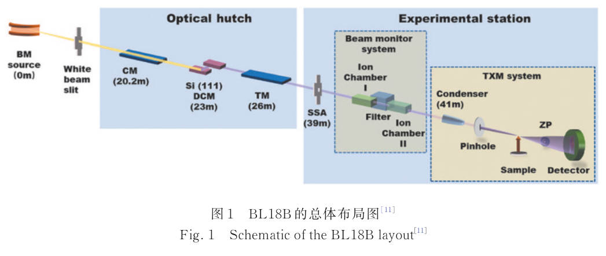
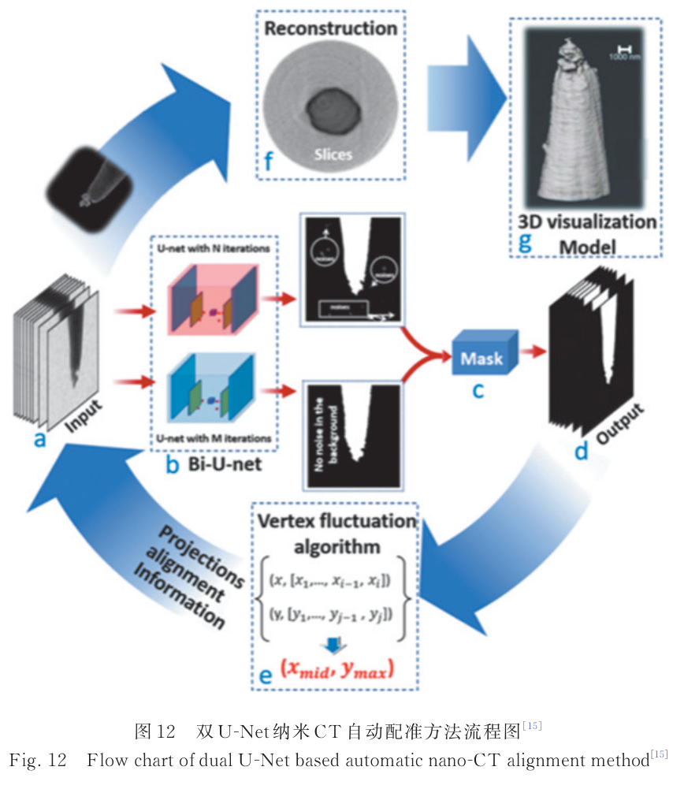

---
tags:
  - papers/X-ray-nano-tomography
  - facilities/SSRF
aliases:
  - "BL18B methodology review 2025"
  - "Progress in Methodologies and Applications of the 3D Nanoimaging Beamline at Shanghai Synchrotron Radiation Facility"
date: 2025-10-20
doi: 10.3788/LOP251906
---

# 上海光源纳米三维成像线站方法学及应用研究进展（特邀）

## 核心信息

- 标题: 上海光源纳米三维成像线站方法学及应用研究进展（特邀）
- 标题翻译: Progress in Methodologies and Applications of the 3D Nanoimaging Beamline at Shanghai Synchrotron Radiation Facility (Invited)
- 作者: 陶芬，张玲，汪俊，杜国浩，邓彪，肖体乔
- 机构: 中国科学院上海应用物理研究所；中国科学院上海高等研究院上海光源中心；中国科学院大学
- 发表时间: 2025-10-20（网络首发；2025 年 12 月刊出）
- 发表渠道: 《激光与光电子学进展》62(24)，2434013
- DOI: 10.3788/LOP251906
- 论文链接: [DOI](https://doi.org/10.3788/LOP251906)
- 论文类型: 特邀叙述性综述（非系统综述）

## 原文摘要翻译

原摘要为中文，以下为保持原意的规范化转写：上海光源纳米三维成像线站是我国首条自主研制的专用全场透射 X 射线显微成像线站，也是作者所称国际首条依托弯铁光源实现 20 纳米空间分辨率的硬 X 射线成像线站，工作能区为 5–14 千电子伏。光束线采用柱面准直镜、双晶单色器和超环面聚焦镜，实验站配置自主研制的单毛细管椭球聚焦镜、高稳定机械系统、高效率探测系统以及控制与数据采集软件，可开展全场透射显微成像、全场纳米 CT、X 射线纳米谱学成像和定量双能减影成像。自 2023 年开放以来，线站已支持 170 余项用户课题，覆盖能源材料、半导体器件和光学元件等方向，并成为国内同步辐射纳米尺度表征的重要平台。

## 创新点

1. **以平台演进而非单个指标组织十年工作。** 综述把 2016 年自主 TXM 原型、2022 年 BL18B 调试、2023 年平台化论文，以及随后发展的谱学、元素定量和用户应用串成一条 2016–2025 年能力链。
2. **建立“结构—化学态—元素含量”的方法谱系。** 常规 TXM/nano-CT、二维与三维 XANES、概念性的 TXM-EXAFS、定量 K 边减影 CT 被放进同一框架，显示线站目标已从结构观察扩展到化学信息。
3. **把数据处理算法视为线站能力的一部分。** 双 U-Net 投影自动配准、面向形变谱学序列的生成式配准，以及融合 Transformer 与卷积网络的稀疏角重建共同瞄准长时谱学扫描中的漂移和效率瓶颈。
4. **给出真实用户规模和跨领域案例。** 截至 2025 年 7 月中旬的近 170 项课题、超过 5000 小时用户机时，以及 MXene、电池厚电极和含能材料案例，使平台评价不再只依赖调试靶标。
5. **暴露下一阶段的能力边界。** 综述将透射/荧光吸收谱、荧光成像和化学—晶体—电子态多模态协同列为未来方向，反向说明这些能力尚未进入稳定用户服务。

## 一句话总结

这篇特邀综述最有价值的地方是提供 BL18B 从国产 20 纳米二维 TXM 到结构、谱学、元素定量、AI 处理和用户服务的一体化能力地图；但它是团队自述型非系统综述，二维分辨率、有效像素和三维分辨率不能互换，定位性首创主张与各方法成熟度仍需统一协议和外部证据复核。

## 研究问题

### 线站能力如何从设备指标扩展到方法平台

早期工作解决“能否用自主系统获得 20 纳米级二维图像”，本综述进一步追问：光束线、单毛细管照明、双探测链、稳定机械、自动控制、CT 重建和能量扫描能否共同支持结构与化学信息的常规实验。它把技术进展分为硬件基础、结构成像、纳米谱学、元素定量和智能处理五层。

### 哪些能力已经成为用户服务

论文同时列出靶标测试、团队方法论文、合作用户案例和累计机时。真正需要判断的不是“是否出现过一张结果图”，而是每项能力属于验收指标、有限样品验证、单次科学示范、用户常规模式，还是仍处于概念与研发阶段。

### 如何解释平台成果的归属

BL18B 提供光束、成像、控制和数据处理，用户团队提出材料问题、制备样品并完成科学解释。综述中的 MXene、电池和含能材料发现应归因于线站与用户团队协同完成，不能全部折算为线站团队的方法学原创。

## 数据与任务定义

### 综述的证据单元

这不是一个单一数据集上的实验论文。其证据主要由四类材料组成：

| 证据单元 | 典型内容 | 可支持的判断 | 主要边界 |
|---|---|---|---|
| 线站与终端论文 | 光学布局、单毛细管、双探测链、控制软件 | 平台设计和调试能力 | 指标年份与测试协议并不完全统一 |
| 方法论文 | CT 配准、XANES、KES-CT、稀疏角谱学 | 方法在特定数据上的可行性 | 缺少统一外部基准和生产级失败统计 |
| 用户论文 | MXene、电池、厚电极、Al-Li 粉末 | 平台能够服务真实科学问题 | 科学贡献由用户与线站共同形成 |
| 运营统计 | 近 170 项课题、超过 5000 小时 | 已形成开放运行规模 | 不能直接推出成功率、开机率或影响力 |

### 综述任务与非系统性边界

作者按硬件、方法学和代表性应用叙述平台进展，而不是按预先注册的检索式、纳入排除标准和偏倚评价汇总全球证据。因此，它适合回答“BL18B 团队如何理解自身能力演进”，不适合直接回答“哪条国际线站性能最好”或“某种算法在全部场景下是否优于基线”。

### 需要区分的计量对象

- **二维 TXM 分辨率：** Siemens 星等靶标在单幅投影中的频率响应，综述引用 \(19.5\pm0.1\) 纳米结果。
- **有效像素：** 探测链几何放大后的采样间隔，高分辨与中分辨模式分别约 6.5 纳米和 30 纳米。
- **三维空间分辨率：** 还受角度采样、旋转轴、配准、信噪比、算法和各向异性影响，需要 FSC、三维 MTF 或标准三维结构独立评估。
- **谱学空间/能量精度：** 除几何分辨率外，还依赖能量标定、跟焦、倍率补偿、逐能点配准和谱线拟合误差。
- **元素含量误差：** KES-CT 的相对误差只在相应元素、标样、基体和测量条件下成立，不能由单个 \(R^2\) 外推为通用定量能力。

## 方法主线

### 机制流程

1. **构造稳定、可调能的照明：** 弯铁光经柱面准直镜、硅（111）双晶单色器和超环面聚焦镜，在次级光源后由单毛细管整形成空心锥照明；二维快速摆动用于提高角度填充和视场均匀性。
2. **选择结构成像工作点：** 高分辨透镜耦合链以约 6.5 纳米有效像素换取 20 纳米级二维细节，中分辨光纤耦合链以约 30 纳米有效像素换取 7–10 倍探测效率；旋转投影进入 nano-CT 重建。
3. **从结构扩展到化学信息：** 逐能量 TXM 形成二维或三维 XANES；K 边前后两组 CT 经吸收系数差分和标样校准得到元素含量；TXM-EXAFS 被提出为进一步提取局域配位信息的路线。
4. **用算法压低漂移与时间成本：** 特征图配准修正投影错位，形变谱学序列采用生成式图像转换、双 U-Net 和局部非刚性配准，稀疏角三维 XANES 用时空混合网络抑制欠采样伪影。

> [!figure] Fig. 5 不同成像方法的协同框架
> 建议位置：方法主线
> 放置原因：原图把常规结构成像、谱学成像、元素定量和算法处理放在同一框架中，是理解本文分类轴的总览。
> 当前状态：保留占位；人工复核确认图体和题注基本完整，但顶部含显著期刊运行页眉，不满足独立插图的洁净度要求。

### 光束线、照明与稳定机械

柱面准直镜、双晶单色器和超环面聚焦镜距光源约 20.2、23 和 26 米，后者把 8 千电子伏光束聚焦为约 100 微米（水平）×290 微米（垂直）的次级光源。单毛细管椭球镜把该次级源耦合到样品，水平/垂直方向分别以 20/30 赫兹、20 微米幅度摆动时，作者报告成像视场约扩大一倍且照明更均匀。

显微终端安装在约 4 米×1.5 米稳定平台上，通过 EPICS 与自研界面编排运动、能量和采集。这里的工程关键不是单个元件的标称精度，而是长时能量扫描中束斑、样品、FZP、旋转轴和探测器的相对稳定性。

### 双探测链形成两个工作点

| 工作模式 | 光学与采样 | 文中能力口径 | 更适合的任务 |
|---|---|---|---|
| 高分辨透镜耦合 | 约 1000 倍总放大；6.5 纳米有效像素 | 20 纳米级二维分辨率 | 静态高分辨结构、局部谱学 |
| 中分辨光纤耦合 | 约 216 倍总放大；30 纳米有效像素；效率高 7–10 倍 | 硬件段约 80 纳米，方法段小于 70 纳米 | 快速扫描、较低剂量和较大视场 |

中分辨模式的两种分辨率表述可能来自不同样品、能量、判据或稿件版本。此处保留原文内部差异，不把两者平均成一个虚假的确定值。

### nano-CT 与景深约束

对于最外环宽度为 \(\Delta r\) 的 FZP，焦深近似为

$$
\mathrm{DOF}\approx\frac{2(\Delta r)^2}{\lambda}.
$$

在 8 千电子伏、30 纳米分辨率条件下，综述给出的焦深约 23 微米，因此样品直径通常控制在 20 微米以内。粉末可附着在拉细玻璃毛细管上，块体则可经聚焦离子束切割后固定。典型采集从 0° 到 180°、步长 1°；投影经自动对齐、伪影处理和 AduRecon 重建。该协议是代表性工作流，不应被理解为全部样品的固定最优参数。

### XANES、EXAFS 与 K 边减影

二维 XANES 在每个能量点采一幅 TXM 图像，获得逐像素吸收边位置，但厚度方向的不同化学相被投影叠加。三维 XANES 在多个能点分别执行 CT，可消除深度混叠，却把扫描时间、剂量和漂移风险成倍放大。

TXM-EXAFS 的设想是把逐像素吸收谱延伸到边后振荡区，经背景扣除、归一化和傅里叶分析映射局域配位。综述主要描述这条方法链及其潜力，缺少可独立验收的 BL18B 标准样品数据，因而应标为概念/研发能力。

KES-CT 在目标元素 K 边上下分别重建线性吸收系数体：

$$
\Delta\mu=\mu(E_+)-\mu(E_-).
$$

若用已知含量标样建立 \(\Delta\mu\) 或归一化灰度与元素含量的校准关系，输出就从“哪里存在该元素”推进到“含量是多少”。能量漂移、两能点倍率差、配准误差和基体吸收都会进入最终不确定度。

### 配准与稀疏角三维谱学

常规纳米 CT 的双 U-Net 方法先从投影生成特征图，再从顶点波动信息估计平移量。

动态 XANES 序列还会出现真实形变，作者采用 CycleGAN、双 U-Net 与局部非刚性配准的组合。

稀疏角三维 XANES 只在少数特征能量采全角度，其余能点减少投影，再用融合视觉转换器与卷积网络的 STC-UNet 去除欠采样伪影。三类算法分别处理刚性错位、形变和时间成本，不能混写成同一个“AI 重建”指标。

## 关键结果

### 平台指标

| 指标 | 综述中的结果 | 正确解释 |
|---|---:|---|
| 工作能区 | 5–14 千电子伏 | 线站可调能范围 |
| 二维 TXM 分辨率 | \(19.5\pm0.1\) 纳米 | 二维靶标结果，不是三维 CT 分辨率 |
| 高分辨有效像素 | 6.5 纳米 | 采样间隔，不等于光学分辨率 |
| 中分辨有效像素 | 30 纳米 | 采样间隔；对应分辨率口径有小于 70/约 80 纳米差异 |
| 中分辨探测效率 | 高分辨模式的 7–10 倍 | 模式间相对结果，仍需能量和剂量条件 |
| 单毛细管摆动 | 视场约扩大一倍 | 特定频率、幅度与调试条件下的照明改善 |

> [!figure] Fig. 6 高分辨与中分辨模式的透射成像结果
> 建议位置：关键结果
> 放置原因：六个面板同时展示靶标图、线剖面和功率谱，是判断双工作点真实成像能力的主要视觉证据。
> 当前状态：保留占位；人工复核确认面板可读，但中英文长题注在底部被截断，无法作为完整原图直接物化。

国际比较表列出 SSRF、APS、NSLS-II、SSRL 和 BSRF 的代表性分辨率约为 19.9、40–50、30、30 和 30 纳米。由于样品、能量、测试年份、判据以及二维/三维口径并未统一，这张表能说明 BL18B 所处的技术区间，却不足以形成严格排名。

### KES-CT 与稀疏谱学的定量结果

- Cu/Ni 体系的归一化灰度与 K 边前后线性吸收系数差具有 \(R^2>0.98\) 的线性关系。
- Cu 标样的含量相对误差为 2.95%，NCM811 中 Ni 含量的平均相对误差为 2.42%。
- 稀疏角三维 XANES 在 NCM811 示例中把扫描时间由 10 小时缩短至 1 小时，并保留作者关注的关键谱学特征。

这些数字支持“在相应样品上可行”，尚不足以证明跨元素、跨基体和跨线站的普适性。尤其是 \(R^2\) 主要反映拟合线性，不能替代校准偏差、重复性、检出限和完整不确定度预算。

### 运营规模与用户成果

截至 2025 年 7 月中旬，作者报告线站自 2023 年验收开放以来累计完成近 170 项课题、提供超过 5000 小时用户机时。代表性应用为：

| 用户科学问题 | BL18B 提供的证据 | 主要结果 | 归因边界 |
|---|---|---|---|
| 有序交联 MXene 薄膜 | 纳米 CT 三维孔隙与循环拉伸裂纹 | 孔隙率由 \((16.5\pm0.6)\%\) 降至 \((4.26\pm0.33)\%\)，裂纹扩展受抑 | 材料策略来自用户团队，线站提供结构定量 |
| PEO 基高压固态电池 | 原位 Ni 谱学 TXM | 锁定 4.3–4.8 伏失效区；改性后 Ni 边偏移约 1.5 电子伏且荷电更均匀 | 机理解释依赖电化学与谱学联合证据 |
| 高负载厚电极 | 微米 CT 加约 50 纳米谱学成像 | 厚电极孔隙更小、路径更复杂；集流体侧出现 Co³⁺ 富集，边位较隔膜侧低约 1.5 电子伏 | 属跨尺度合作成果，不是单一 nano-CT 方法证明 |
| Al-5Li@HTPB 粉末 | 5 千电子伏、180 幅、每幅 10 秒、滤波反投影 | 观察到均匀致密 HTPB 包覆层 | 单案例展示，分辨率和重复性需回到原始论文判断 |

## 深度分析

### 真正的护城河是系统集成

*论文原图编号：Fig. 1。BL18B 从弯铁源、光学棚到实验站 TXM 的总体布局，显示源、光学整形、次级源和终端之间的系统关系。*

单独看 20 纳米二维指标，国际上已有多条硬 X 射线 TXM 线站；BL18B 更难复制的价值在于把弯铁源条件下的光学整形、单毛细管、稳定机械、双探测工作点、EPICS 控制、AduRecon、谱学联动和用户开放组合成一条自主可维护链。平台竞争力应以端到端可用性衡量，而不是只用一次靶标测试衡量。

### 能力成熟度矩阵

| 能力 | 当前证据 | 建议成熟度 | 升级为下一等级所需证据 |
|---|---|---|---|
| 二维 TXM | 19.5 纳米靶标与多年论文 | 已验收/用户常规 | 跨能量、跨班次重复性 |
| 标准 nano-CT | 多类用户三维案例与重建链 | 用户常规 | FSC/三维 MTF、剂量和失败率 |
| 高/中分辨双模式 | 双探测器靶标与效率对照 | 已验收 | 统一小于 70/约 80 纳米口径 |
| 二维 XANES | 电池用户案例 | 已示范并进入用户实验 | 标样、边位误差与跨日漂移 |
| 三维 XANES | NCM 等示例 | 科研示范 | 全流程时间、剂量、重复性和外部样品 |
| KES-CT 定量 | Cu/Ni 校准与小于 3% 示例 | 有限元素验证 | 多元素、多基体、检出限和不确定度预算 |
| 双 U-Net 自动配准 | 方法论文与流程图 | 算法验证 | 在线残差监控、异常回退和生产统计 |
| 稀疏角三维 XANES | 10 倍加速的 NCM811 示例 | 科研示范 | 强基线、外部数据、谱线偏差和失败检测 |
| TXM-EXAFS | 方法链与应用设想 | 概念/研发 | 标准样品、空间/能量精度及可重复拟合 |
| 荧光与多模态协同 | 展望任务 | 规划中 | 设备联调、标准样品和用户验收 |

这张矩阵避免把“文章提及”“做过一次”和“可稳定服务”视为同一成熟度。短期最重要的不是再增加能力名词，而是给现有能力补齐统一验收定义。

### AI 的价值与生产化缺口

*论文原图编号：Fig. 12。双 U-Net 纳米 CT 投影自动配准流程，展示特征图、掩膜、顶点波动、平移校正、重建和三维输出之间的关系。*

双 U-Net 的直接价值是把机械漂移转化为可估计的特征位移；稀疏角网络的直接价值是把昂贵的投影采集替换为计算先验。二者也会引入新的失效模式：低对比样品可能缺乏稳定特征，网络可能抹除真实小结构，未知化学态可能被训练分布拉回常见谱线。上线验收需要把配准残差、结构保真、谱边位误差、置信度和失败回退同时纳入，而不能只报告重建图更平滑或时间减少十倍。

### 定量谱学的核心是误差预算

> [!figure] Fig. 10 Cu 组 KES-CT 切片灰度与校准分析
> 建议位置：深度分析
> 放置原因：原图把切片、灰度分布和线性拟合连接起来，可用于核查从双能差分到定量含量的证据链。
> 当前状态：保留占位；人工复核发现候选是整页截图，混入大量方法正文、期刊页眉且题注不完整。

KES-CT 从定性双能差分跨到定量，关键不只是拟合斜率，而是把能量偏差、入射光归一化、两能点倍率和位置错配、CT 伪影、基体吸收、标样浓度与重复扫描误差逐级传播到元素含量。现有 Cu/Ni 数字是很好的起点，但更合理的验收目标应写成“元素—基体—能量—浓度范围—置信区间”的多维规格。

### 用户规模不能替代用户质量指标

近 170 项课题和超过 5000 小时证明平台确实被使用，却无法单独说明实验成功率。运营评价至少还需要开机率、计划完成率、可用三维数据率、重扫率、从采集到交付的周转时间、用户自助比例，以及由平台数据支撑的论文/专利。只有这些指标与累计机时共同出现，才能判断线站是否从“可开放”进入“高质量常规服务”。

### 与国内外平台比较应使用同一计量协议

综述中的国际表混合不同年代和判据，适合作为设施清单，不适合排位。

更可信的比较应让上海、北京和海外代表线站在相同能量、视场、样品、剂量和总时间下，分别报告二维 MTF、三维 FSC、体素尺寸、体数据吞吐、漂移、谱边位误差与开放可用性。

作者所称“国际首条”等定位性表述也应通过外部设施资料和统一定义复核。

## 局限

1. **属于团队自述型非系统综述。** 文章缺少检索策略、纳入排除流程和偏倚评价，且大量引用来自作者团队，适合做平台史料，不等同于独立技术评估。
2. **关键性能口径没有完全统一。** 中分辨模式同时出现小于 70 纳米与约 80 纳米；国际比较又混合不同测试协议，需要回溯原始论文。
3. **二维、像素和三维指标易被混淆。** 19.5 纳米是二维 TXM 结果，6.5/30 纳米是有效像素，用户三维案例缺少统一 FSC 或三维 MTF。
4. **谱学计量链仍不完整。** 二维/三维 XANES 的能量误差、跟焦残差、剂量、重复性和绝对价态标准尚未形成统一表格。
5. **KES-CT 的验证域较窄。** 小于 3% 的结果来自 Cu/Ni 示例，跨元素、复杂基体、浓度边界、检出限及完整不确定度仍需系统验证。
6. **AI 结果缺少统一独立评测。** 综述缺少共同数据集、强基线、误差条、跨线站泛化、失败样例和在线回退指标。
7. **TXM-EXAFS 主要处于概念层。** 方法链被清楚描述，但当前证据不足以把它列为成熟用户模式。
8. **运营统计偏重规模。** 累计课题和机时之外，提案通过率、开机率、成功数据率、重扫率、交付周期和成果归因仍是空白。
9. **部分首创与领先表述需要外部复核。** 自述型综述中的定位性主张不宜直接作为跨设施排名依据。

## 我的笔记

### 最值得复用的成果框架

后续汇总上海光源纳米 CT 时，宜把成果分为四层，而不是按论文篇数累加：

1. **工程底座：** 自研光学、单毛细管、机械、控制与双探测链。
2. **计量能力：** 二维分辨率、三维分辨率、通量、稳定性、剂量和时间。
3. **方法能力：** CT、XANES、KES-CT、配准与稀疏重建的成熟度。
4. **用户价值：** 真实科学问题、成功数据率、成果转化和开放服务效率。

### 近期应先完成的验收

1. 用同一三维标准样品，在高/中分辨模式下报告 FSC、各向异性、剂量、视场和体数据/分钟，并解决小于 70/约 80 纳米的口径冲突。
2. 建立八小时与完整能量扫描的束斑、旋转轴、倍率、跟焦和能量漂移日志，给出配准前后残差。
3. 为 KES-CT 建立至少三种元素、多个基体和浓度梯度的盲测，输出检出限、偏差、重复性和不确定度预算。
4. 为 AI 模块建立冻结测试集和外部数据集，要求结构保真、谱边位误差、置信度与失败回退同时通过。
5. 把运营看板从“课题数/机时”扩展为开机率、成功数据率、重扫率、交付周期、用户自助率和论文/专利转化。

### 仍需追问

- 中分辨模式的小于 70 纳米与约 80 纳米分别采用什么能量、靶标和分辨率判据？
- 170 项课题中，获得可分析三维或谱学数据的比例是多少，重扫的主要原因是什么？
- 稀疏角三维 XANES 对未知化学态、低信噪和真实小结构的最坏误差是多少？
- KES-CT 小于 3% 的误差在元素、基体和浓度变化后能否保持？
- TXM-EXAFS、荧光吸收谱和荧光成像分别何时达到标准样品与首批用户验收？

## 引用

- 陶芬，张玲，汪俊，等. “上海光源纳米三维成像线站方法学及应用研究进展（特邀）.” *激光与光电子学进展* 62(24), 2434013 (2025). [DOI](https://doi.org/10.3788/LOP251906)
- [[2016_Full-field_X-ray_nano-imaging_system_SSRF|Zhang et al., Full-field X-ray nano-imaging system at SSRF (2016)]]
- [[2022_Design_development_commissioning_BL18B|陶芬等，上海同步辐射光源纳米三维成像线站设计、研发及调试 (2022)]]
- [[2023_Full-field_hard_X-ray_nano-tomography_SSRF|Tao et al., Full-field hard X-ray nano-tomography at SSRF (2023)]]
- [[2023_The_3D_nanoimaging_beamline_at_SSRF|Zhang et al., The 3D nanoimaging beamline at SSRF (2023)]]
- Su, B., Gao, R.-Y., Tao, F., et al. “Dual U-Net based feature map algorithm for automatic projection alignment of synchrotron nano-CT.” *Nuclear Instruments and Methods in Physics Research A* 1040, 167242 (2022). [DOI](https://doi.org/10.1016/j.nima.2022.167242)
