---
tags:
  - papers/multimodal
  - papers/GUI-agent
  - papers/computer-use
aliases:
  - "Qwen-CUA 全文中文翻译"
  - "Qwen-CUA Chinese Translation"
date: 2026-08-03
arxiv_id: "2608.02352"
source_pdf: "2026_Qwen-CUA_native_computer_use.pdf"
translation_date: 2026-08-31
---

# Qwen-CUA：面向（几乎）一切任务的原生计算机使用

> 原文：Qwen Team & Xlang Lab. *Qwen-CUA: Native Computer Use for (almost) Everything*. arXiv:2608.02352, 2026。
>
> 本文档按照原 PDF 的顺序完整翻译标题页、摘要、正文、公式、图注、表格、算法、附录、作者贡献与参考文献。模型名、数据集名、指标名、代码标识和参考文献书目信息保留原文；所有编号均与 PDF 一致。论文 PDF 共 24 页。

## 作者与机构

- 团队：**Qwen Team 与 Xlang Lab**。
- 核心贡献者：Shuai Bai、Tianyi Bai\*、Sicheng Fan、Chang Gao、Jian Guan、Feng Hu、Mianqiu Huang、Xingyang Huang、Yizhen Jiang、Yuheng Jing、Dehui Kong、Ning Li、Dayiheng Liu、Shixuan Liu\*、Zheng Liu、Dunjie Lu、Que Shen、Bowen Wang\*、Junli Wang\*、Chencan Wu、Rui Xie、Tianbao Xie\*、Zhihui Xie、Haiyang Xu、An Yang、Tao Yu、Wenzhen Yuan、Xi Zhang、Zhenru Zhang、Mingkang Zhu、Zhaoqing Zhu。
- 其他贡献者：Yizhong Cao、Kai Dang、Binyuan Hui\*、Kaixin Li\*、Junyang Lin\*、Haiquan Wang、Zekun Wang、Yiheng Xu\*、Fan Yan、Mengqi Yuan、Danyang Zhang\*、Jiajun Zhang、Zhipeng Zhang\*、Fan Zhou\*、Fan Zhou。
- 星号表示已离开 Qwen Team 的贡献者；原文未进一步列出个人分工。

## 摘要

原生计算机使用为智能体提供了一条通用途径，使其能够通过与人类相同的界面操作几乎任何软件。然而，要兑现这一前景，仅有视觉定位还不够：智能体必须维持长时程状态，获取大量成本高昂的交互经验，并从稀疏但能够可靠验证的结果中学习。我们提出 Qwen-CUA——一种以 397B-A17B Qwen 混合专家模型为骨干的原生计算机使用智能体。它只观察屏幕截图，并通过键盘和鼠标事件执行动作，不依赖 DOM 树、无障碍元数据或特定任务 API。它的智能体脚手架把活动视觉历史扩展到 20 张截图，并以固定大小的块折叠更早的截图，在保留近期视觉证据的同时维持可复用的提示词前缀。为扩大训练规模，我们构建了一个可使用近 100,000 个 vCPU、支持数万个并发环境的云端轨迹采样集群，构造约 40,000 个可验证任务，并在日常软件与专业软件中收集个性化长时程工作流。我们使用可验证奖励和长时程轨迹切片来优化完整轨迹，并通过多轮迭代训练发展模型：每一轮所得策略都用于刷新监督数据混合并校准强化学习任务分布。在八个计算机使用基准上，Qwen-CUA 始终优于 Qwen3.7，并与领先闭源系统保持竞争力：在 OSWorld-Verified 上达到 86.2，在 OSWorld 2.0 上的二元完成率／部分完成率达到 18.5／48.4。把同一套方案扩展到总参数超过一万亿的模型后得到 Qwen-CUA-Max，其相应分数进一步提高到 87.6 和 21.2／53.3。相较于 Qwen3.7，Qwen-CUA 还把 RedTeamCUA 的攻击成功率从 36.6 降到 16.4。效率分析、内部浏览器部署，以及将原生交互与 Bash 结合的实验，进一步刻画了它的实际行为。这些结果表明，原生计算机使用可以成为一种能力覆盖广泛的基础；而可扩展、可验证的交互与混合工具使用，是使其在实践中真正有效的关键。

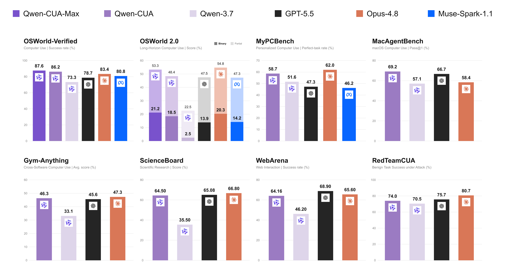

*图 1（原文图注翻译）：八个计算机使用基准上的主要结果。OSWorld 2.0 同时报告二元完成率（深色）和部分完成率（浅色），RedTeamCUA 报告遭受攻击时的良性任务成功率。其余各面板均显示单一分数。数值越高越好。*

## 1. 引言

智能体通过三类广义接口作用于数字世界：代码、API，以及为人类设计的图形界面。基础模型在前两类接口上已经表现出很强的能力，能够编写程序并组合软件工具。然而，大量数字工作仍处于这些能力覆盖范围之外：桌面应用、遗留系统、动态网站、专业工具和个性化工作流，往往只通过视觉界面暴露功能。原生计算机使用填补了这一缺口。通过感知像素并产生键盘与鼠标事件，智能体无需专门集成就能像人一样操作同一套软件，从而解锁过去主要依赖人类直接交互才能完成的工作流。

这种面向人的接口带来了独特的学习挑战。GUI 状态是部分可观测且无法被机器直接读取的；动作需要落到像素坐标上；错误会在长工作流中累积；证据则分布在整段截图历史中。现有基准已覆盖开放式 Web 与操作系统任务（Zhou 等，2023；Xie 等，2024），但每次轨迹采样都需要一个有状态环境和真实的交互时间，而可靠监督往往直到最终状态才出现。智能体还必须泛化到个性化桌面、专业软件、模拟用户以及具有对抗性的屏幕内容（Jang 等，2026；Q. Sun 等，2025a；Aggarwal、Neubig 与 Welleck，2026；Liao 等，2025）。因此，进步要求同步扩大环境规模、可验证任务规模和轨迹吞吐量，并解决如何从长时程多模态轨迹中学习的问题。

我们提出 **Qwen-CUA**：一个针对原生计算机使用进行端到端训练的 Qwen 模型。它仅接收截图并输出键盘与鼠标动作，不使用 DOM 树、无障碍元数据、Shell 访问或任务专用 API。这个最小接口无需改变即可迁移到浏览器和桌面应用。为支持长时程操作，Qwen-CUA 保留 20 张活动截图，并以每 10 张为一块折叠更早的截图，从而限制视觉上下文规模，同时维持提示词前缀稳定，以提高 KV 缓存复用率。

为了大规模生成可验证交互，我们在阿里云弹性计算服务（ECS）上构建了轨迹采样集群，可使用近 100,000 个 vCPU 和数万个并发环境。环境池把可控的模拟 Web 服务与日常、长尾和专业桌面应用结合起来。我们构造了约 40,000 个可验证任务，涵盖环境操作、模拟用户交互，以及通过“可验证阶段状态串联”构造的长时程工作流。来自个性化桌面和专业软件的人类轨迹提供互补监督，并通过与动作对齐的逐步推理得到增强。

Qwen-CUA 使用可执行的结果奖励进行优化，其设计建立在 CUA-Gym 的可扩展环境与任务方案之上（B. Wang、Lu 等，2026a）。软自适应策略优化（Soft Adaptive Policy Optimization，SAPO；Gao 等，2025）稳定长推理—动作序列上的更新，而轨迹切片则在富含图像的历史中保留回合级奖励。训练按轮次迭代：每轮所得模型会暴露尚未解决的 SFT 查询和薄弱领域，据此为下一轮安排教师重新采样、新的人类轨迹、定向数据收集以及 RL 任务校准。

在原生键盘—鼠标计算机使用协议下，Qwen-CUA 在八个基准的任务指标上都优于 Qwen3.7。它在 OSWorld-Verified 上获得 86.2，而 Qwen3.7、GPT-5.5 和 Claude Opus 4.8 分别为 73.3、78.7 和 83.4；在 OSWorld 2.0 上，它把二元／部分完成率从 2.5／22.5 提升到 18.5／48.4。把 397B-A17B 模型扩大到总参数超过一万亿后得到 **Qwen-CUA-Max**，相应成绩进一步增至 87.6 和 21.2／53.3。相较于 Qwen3.7，Qwen-CUA 在提高任务成功率的同时，还把 RedTeamCUA 的攻击成功率从 36.6 降至 16.4。

效率扫描表明，这些提升并不能简单归因于更冗长的推理。一个内部 Chrome 部署展示了自然发生的浏览器工作流，并在会产生实际后果的动作前要求用户确认；MyPCBench 实验则表明，把原生交互与 Bash 结合能够显著缩短轨迹。总体而言，这些研究支持把原生计算机使用视为一种通用视觉基础，并与专门工具组合以提高执行效率。

本文的主要贡献如下：

1. 提出一个只使用截图的 Qwen-CUA 模型，采用原生键盘—鼠标控制和高效的长时程视觉上下文管理；它在全部八个计算机使用基准上优于 Qwen3.7，并在 OSWorld-Verified 上达到 86.2。
2. 将可验证经验扩大到近 100,000 个 vCPU、40,000 个可验证任务、多样且可控的环境，以及个性化专家工作流。
3. 在八个基准上全面评估 Qwen-CUA，并通过分析说明：性能提升并非源于更啰嗦的推理；RedTeamCUA 攻击成功率由 36.6 降至 16.4；把原生交互与 Bash 结合会缩短轨迹。同一方案扩展到万亿参数级 Qwen-CUA-Max 后，OSWorld-Verified 和 OSWorld 2.0 又分别提高到 87.6 和 21.2／53.3。

## 2. 智能体实现

沿用近期基于截图的计算机使用智能体路线（Xie 等，2024；Xu 等，2024；Qin 等，2025；X. Wang 等，2025b），Qwen-CUA 把最小化的原生计算机使用接口、扩展后的视觉历史容量，以及面向长时程交互的轻量上下文管理结合起来。

### 2.1 原生计算机使用接口

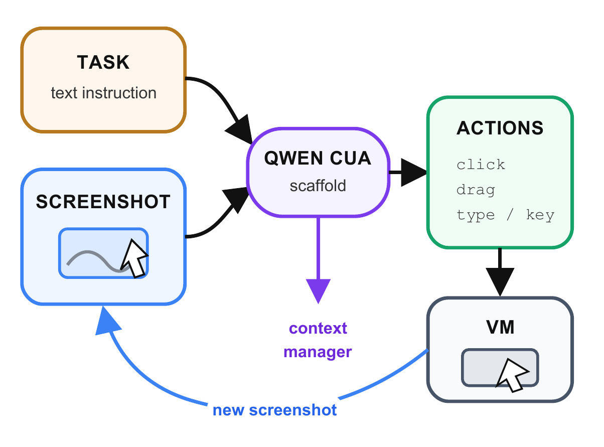

*图 2（原文图注翻译）：原生计算机使用循环。*

> 译者注：图中任务文本和当前截图输入 Qwen-CUA 脚手架；智能体向虚拟机输出点击、拖动、输入与按键等动作；环境返回新截图，上下文管理器维护历史。

Qwen-CUA 围绕原生计算机使用接口实现。在每一步，智能体只观察当前桌面状态的一张截图，并从键盘—鼠标动作空间中输出一个动作。该接口刻意避开任务专用 API、无障碍树、DOM 访问和应用层捷径，因为这些手段会暴露屏幕像素之外的隐藏状态。模型改为通过原生输入事件控制计算机。这使智能体接口接近人类使用桌面计算机的方式：感知是视觉的，执行则落到键盘和鼠标操作上（图 2）。完整动作模式见附录 A。

### 2.2 长时程上下文管理

长时程计算机使用会产生图像密集型历史，其视觉成本随每次交互不断增长。保留全部截图最终会超过实际可用的上下文预算，而传统滑动窗口又可能丢弃解释后续推理和动作所必需的早期状态。

**扩大视觉历史。** 只使用截图的交互要求模型在任务推进时保留较早的界面状态。Qwen-CUA 把每轮活动视觉历史扩大到 20 张截图，延续了连续几代 Qwen 不断增加视觉上下文容量的趋势（Bai 等，2025）。更大的历史帮助智能体追踪进度，并在长工作流中重新查看早期视觉证据（图 3a）。

**分块折叠截图。** Qwen-CUA 在交互历史上维护一个已折叠前缀边界，并允许最多 20 张活动截图。一旦活动视觉历史超过这一预算，边界就一次向前移动 10 步。边界之前的截图被替换为固定文本占位符，对应的推理和动作仍留在对话中；最近截图则保留原始视觉形式。该过程是确定性的，不需要额外的摘要模型。

**训练期轨迹切片。** 强化学习复用相同的折叠算子。系统通过不断前移已折叠前缀边界，把完整回合渲染为多个受上下文长度约束的切片；每个切片继承终止奖励，并且只有活动的模型生成 token 参与损失。这既为后期决策保留监督，也让训练和推理保持一致，无需另行生成摘要。

**收益。** 该设计限制视觉 token 的增长，同时保留近期像素和较早动作。由于边界每 10 步才前移一次，第 21–30 步只是在同一请求前缀之后追加内容，而不是每次调用都重写前缀，因此提高了 KV 缓存复用率。这遵循 Anthropic 计算机使用指南中的缓存感知批量裁剪原则（Anthropic，2026b）。图 3b 借鉴 CUA-Gym 的切片视图（B. Wang、Lu 等，2026a）；附录 B 给出精确过程。

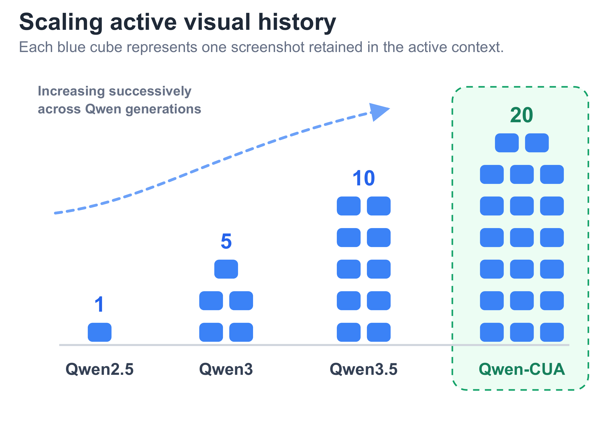

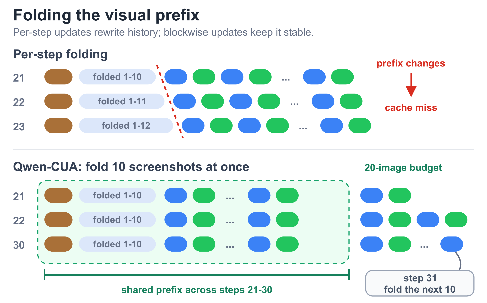

*图 3（原文图注翻译）：长时程上下文管理。（a）活动视觉历史扩大到 20 张截图。（b）分块折叠保留一个可复用前缀，并同样用于强化学习轨迹切片。*

## 3. 扩大智能体训练规模

扩大计算机使用智能体的规模，不仅意味着增加模型容量，还必须同时扩大支撑智能体学习的交互环境、任务多样性、结果监督和经验收集。为此，Qwen-CUA 的方案覆盖轨迹采样基础设施、计算机使用数据、可验证强化学习和迭代式智能体训练。大规模云基础设施把多样软件环境中的任务执行转化为持续的轨迹来源，可执行评估器则把环境状态转移变成可靠的结果反馈。在每轮迭代中，所得模型用于识别未解决查询和薄弱领域；这些诊断会在训练下一模型之前，同时刷新监督数据混合和 RL 任务分布。图 4 汇总了训练资源扩展以及各开发检查点上对应的性能。

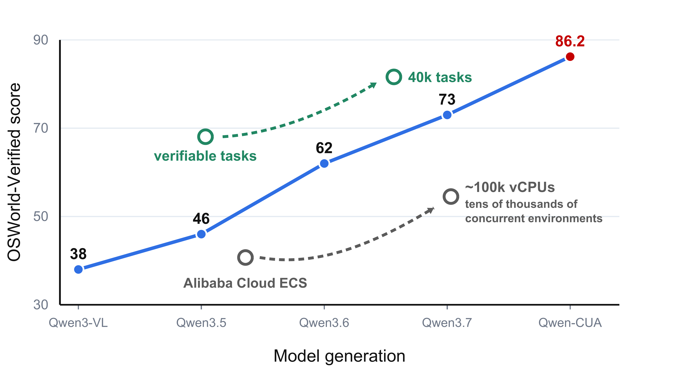

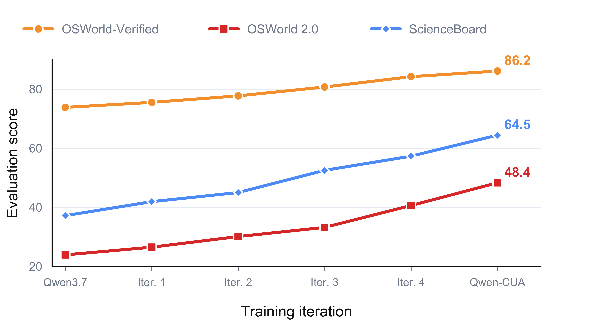

*图 4（原文图注翻译）：扩大并迭代计算机使用训练。（a）性能随模型、任务和基础设施规模增长。（b）连续开发检查点上的评估分数；每轮之间都会刷新 SFT 数据和 RL 任务。*

### 3.1 可扩展的计算机使用基础设施

大规模计算机使用训练需要大量相互隔离且有状态的桌面环境（Xue 等，2026；H. Wang 等，2025a；B. Wang、Lu 等，2026a）。我们在阿里云弹性计算服务（ECS；Alibaba Cloud，2026）上构建轨迹采样基础设施，可使用近 100,000 个 vCPU，并能支持数万个并发计算机使用环境。该基础设施把环境创建与重置、任务分发、智能体—环境交互、结果验证和轨迹记录并行化。由此可获得大规模经验收集和强化学习所需的交互吞吐量，并能跨越多种软件环境持续生成新轨迹。NanoRollout 等相关系统（J. Wang 等，2026c）通过共享轨迹采样服务，将智能体运行框架、环境运行时和训练后端解耦，也说明环境侧执行必须能够独立于模型训练扩展。

### 3.2 扩大计算机使用数据规模

扩大计算机使用训练并不只是收集更多轨迹。每个训练样本都必须落在可执行环境中，与结果能够被可靠验证的任务配对，并由高质量示范补充那些仅靠轨迹采样很难发现的行为。因此，我们沿三个互补维度扩展 Qwen-CUA 训练数据：多样且可控的软件环境、基于状态的可验证任务，以及个性化长时程轨迹。

#### 3.2.1 可扩展环境

**合成环境。** 计算机使用经验的多样性最终受底层环境广度限制。为了扩大可控 Web 覆盖，我们沿用近期可验证环境合成工作（Cao 等，2026；Zhang 等，2026；Y. Wu 等，2026b；B. Wang、Lu 等，2026a），开发自包含的模拟 Web 服务：它们保留常用产品的交互流程，同时允许以编程方式控制状态。统一接口支持注入、检查和重置任务专用状态，并实现会话隔离；因此，同一应用可实例化大量可复现任务并承载并发轨迹采样，而不会在回合之间互相干扰。

**广泛的应用覆盖。** 我们还把环境池从常见办公应用扩展到创意、科学、工程和其他专业软件，其中包括专用和长尾桌面应用。沿着 Gym-Anything 探索的环境扩展方向（Aggarwal、Neubig 与 Welleck，2026），每个应用都安装并配置在沙箱化桌面环境中，并填充真实的文件、制品和应用专用状态。可控 Web 模拟环境与广泛桌面覆盖相结合，在可扩展状态验证与高保真交互之间取得平衡，使日常与专业工作流都能用于经验收集。

#### 3.2.2 可验证任务合成

**环境交互任务。** 第一类任务教智能体理解并操作特定环境。基于近期可验证任务合成系统（B. Wang、Lu 等，2026a；Lv 等，2026），我们从应用专用功能分类体系和常见使用场景中采样任务，覆盖各环境的界面元素、操作和状态转移。每个任务都把自然语言目标与可复现初始状态、可执行评估器配对，并依据参考结果和智能体轨迹进行审核，以去除含糊、不可行或验证薄弱的样本。

**用户交互任务。** 第二类任务要求执行过程中与用户交互。许多真实请求会遗漏必要信息，或包含无法仅从环境中解决的约束。遵循 OSWorld 2.0 的模拟用户设置（Yuan 等，2026），我们构造了一类任务：用户模拟器持有边界明确的任务专用知识，并且仅在智能体请求澄清时作答。这些任务训练模型识别缺失证据、提出有针对性的问题，并把回应纳入后续行动，而不是依据无支持假设继续操作。完成度仍由最终环境状态决定，因此，向用户提问只有在促成正确结果时才有价值。

**长时程任务。** 第三类任务面向复杂工作流，要求智能体在应用、文件和服务之间反复切换，同时维持连贯的任务状态。我们构造包含消息、既往记录和应用专用制品的丰富初始状态，再把每条工作流组织成彼此依赖的阶段，而不是简单拼接无关子任务。每个阶段都有可验证完成状态；验证通过后，该状态可以序列化并用作下一阶段的初始状态。这种“阶段—状态串联”让复杂工作流更容易以增量方式生成和审核，同时仍保留完整串联工作流，供端到端轨迹采样和长时程训练使用。

#### 3.2.3 个性化工作流

**人类轨迹收集。** 可验证任务提供可扩展的结果反馈，但许多真实工作流植根于用户自己的文件、历史、偏好和应用状态。因此，我们借鉴 OpenCUA 等大规模人类计算机使用示范收集工作（X. Wang 等，2025b），在个性化桌面环境中收集轨迹；标注者完成真实的端到端工作流，而不是孤立的界面操作。这些示范会自然产生更长的轨迹，包含更多交互步骤、跨应用交接、错误恢复和最终状态验证。收集范围同时覆盖日常个人工作流以及 CAD、Blender 等专业软件中的专门任务；后者所需领域知识很难仅从稀疏结果反馈中自行发现。

**推理增强。** 原始示范记录任务、截图观察、原生键盘—鼠标动作及所得环境状态。由于标注者不会在每一步都提供详细推理，我们使用模型辅助的思维链补全：以前序轨迹、当前观察和标注动作为条件，重建逐步理由。生成的理由会根据观察状态和示范行为做一致性筛选。这样便得到与动作对齐的监督，用于长个性化工作流中的任务分解、进度跟踪、恢复和验证。

### 3.3 计算机使用强化学习

我们在完整计算机使用轨迹上，使用带可验证奖励的强化学习（RLVR）优化 Qwen-CUA。沿用近期 GUI 智能体强化学习系统（C. Yang 等，2025a；H. Wang 等，2025a；B. Wang、Lu 等，2026a；Huang 等，2026；Lv 等，2026），每个训练样本由任务指令 $t$、可复现初始环境状态 $s$ 和可执行奖励函数 $r$ 定义。给定 $(t,s)$，当前策略采样一组 $G$ 条交互轨迹 $\{\zeta_1,\ldots,\zeta_G\}$。每条轨迹终止后，评估器检查所得环境状态，并分配结果奖励 $r_i=r(s,\zeta_i)\in[0,1]$。这种基于状态的监督可以在适当情况下给予部分分数，也能认可多种不同但有效的交互路径，而不需要参考动作序列。

图 5 展示 397B-A17B 混合专家 Qwen-CUA 在最后一轮训练的强化学习阶段中的学习动态。在训练任务上，由于每个批次混合了异质任务和随机轨迹，单个检查点的方差很大；平滑分数从早期约 0.49 的低点恢复并升至约 0.64，表明即使在线轨迹采样带来噪声，优化仍在稳定推进。在一个经过筛选、覆盖多个应用领域的留出任务混合上，分数从 RL 前的 0.734 升至检查点 40（第 800 次更新）的峰值 0.770，因此我们选择该检查点用于后续评估。完整训练仍继续到预定的 1,000 次更新预算；检查点 50 达到 0.762。相邻检查点编号之间相隔 20 次外层批更新。

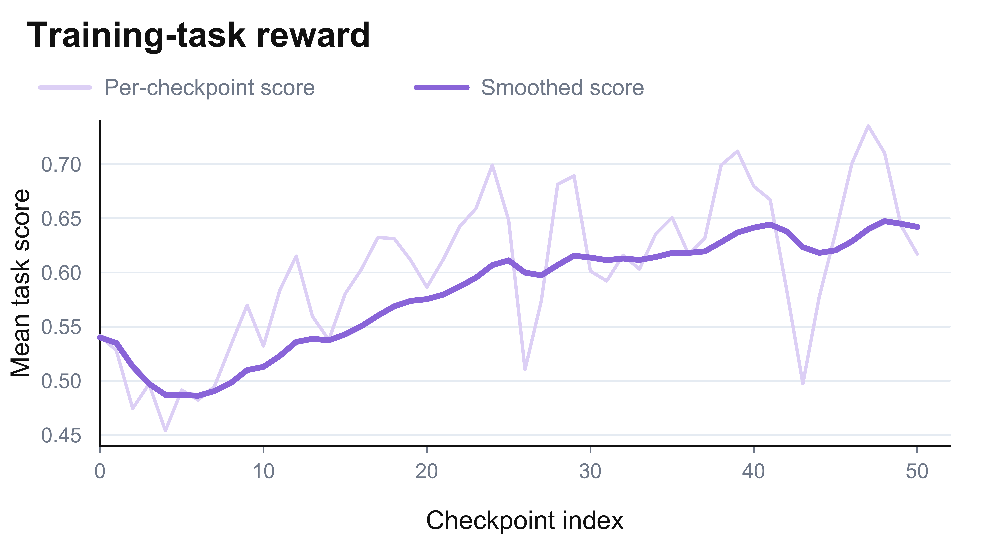

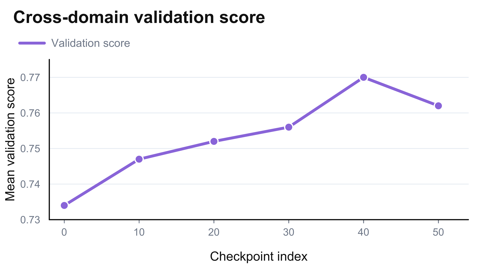

*图 5（原文图注翻译）：最后一轮训练中的计算机使用强化学习曲线。（a）浅色曲线报告各检查点训练分数，紫色曲线为平滑趋势；（b）从 RL 前基线开始，报告经过筛选的跨领域验证集分数，并选择检查点 40。相邻检查点编号之间相隔 20 次外层批更新。*

**软自适应策略优化。** 我们使用软自适应策略优化（SAPO；Gao 等，2025）根据这些轨迹更新策略。由于奖励只评价终止状态，轨迹内所有活动 token 共享同一个组相对优势 $\hat A_i$，每个模型生成 token 则具有 token 级重要性比率 $\rho_{i,u}$：

$$
\hat{A}_i = \frac{r_i-\bar r}{\sigma_r+\delta},
\qquad
\rho_{i,u}(\theta)=
\frac{\pi_\theta(y_{i,u}\mid h_{i,u})}
     {\pi_{\theta_{\mathrm{old}}}(y_{i,u}\mid h_{i,u})}.
$$

其中，$\bar r$ 和 $\sigma_r$ 分别是组内奖励 $\{r_1,\dots,r_G\}$ 的均值和标准差，$\delta$ 是用于数值稳定的小正数，$y_{i,u}$ 是第 $i$ 条轨迹的第 $u$ 个活动 token，$h_{i,u}$ 是其上下文（任务、之前的交互历史，以及折叠后仍可见的截图）。SAPO 不把 $\rho_{i,u}$ 截断在固定区间内，而是让该比率通过一个平滑、由温度控制的门函数：近似同策略的 token 几乎不受影响，而明显离策略的 token 被连续衰减。门温度是不对称的，负优势更新比正优势更新衰减更快；我们发现，这对本文的长多模态轨迹和混合专家骨干十分重要。梯度只通过模型生成的推理和工具调用 token 传播；任务指令、截图和环境响应只作为上下文，不纳入损失。完整目标见附录 C.2。

> [!note] 译者补充：SAPO 相比 GRPO 改变了什么？
>
> **1. GRPO 的基本原理。** 组相对策略优化（Group Relative Policy Optimization，GRPO）可以看成一种不训练价值模型（critic）的 PPO 式策略优化方法。对同一个任务，用旧策略 $\pi_{\theta_{\mathrm{old}}}$ 采样 $G$ 条轨迹，获得奖励 $r_1,\ldots,r_G$，再用组内均值和标准差构造相对优势
> $$
> \hat A_i=\frac{r_i-\bar r}{\sigma_r+\delta}.
> $$
> 奖励高于同组平均值的轨迹具有正优势，低于平均值的轨迹具有负优势；由于组均值本身充当基线，GRPO 不需要额外学习一个价值网络。对于轨迹 $i$ 的活动 token $u$，定义重要性比率
> $$
> \rho_{i,u}(\theta)=
> \frac{\pi_\theta(y_{i,u}\mid h_{i,u})}
>      {\pi_{\theta_{\mathrm{old}}}(y_{i,u}\mid h_{i,u})}.
> $$
> 忽略不同实现中可选的参考策略 KL 正则项，一个典型的 token 级 GRPO 代理目标为
> $$
> \mathcal J_{\mathrm{GRPO}}(\theta)
> =\mathbb E\!\left[
> \frac{1}{G}\sum_{i=1}^{G}
> \frac{1}{|\mathcal M_i|}\sum_{u\in\mathcal M_i}
> \min\!\left(
> \rho_{i,u}\hat A_i,
> \operatorname{clip}(\rho_{i,u},1-\epsilon,1+\epsilon)\hat A_i
> \right)
> \right].
> $$
> 这里的硬裁剪限制策略一次更新离旧策略过远。具体而言：当 $\hat A_i>0$ 且 $\rho_{i,u}>1+\epsilon$ 时，继续提高该 token 概率不再产生策略梯度；当 $\hat A_i<0$ 且 $\rho_{i,u}<1-\epsilon$ 时，继续降低其概率也不再产生策略梯度。裁剪边界内则保留普通重要性加权策略梯度。换言之，GRPO 的“组相对”解决优势基线和免 critic 问题，PPO 式 `clip` 则负责约束策略更新幅度。
>
> **2. SAPO 保留组相对优势，但用软门替代硬裁剪。** 本文中的 SAPO 仍使用同一个 $\hat A_i$ 和同一个 token 级比率 $\rho_{i,u}$；因此，它与 GRPO 的主要差别不在奖励归一化或信用分配，而在如何处理离策略 token。SAPO 定义
> $$
> f_\tau(\rho)=\frac{4}{\tau}\,
> \sigma\!\left(\tau(\rho-1)\right),
> \qquad
> \tau=
> \begin{cases}
> \tau_{\mathrm{pos}}, & \hat A_i>0,\\
> \tau_{\mathrm{neg}}, & \hat A_i\le 0,
> \end{cases}
> $$
> 并用 $f_\tau(\rho_{i,u})\hat A_i$ 代替 GRPO 中的裁剪代理项。其梯度可写为
> $$
> \nabla_\theta\mathcal J_{\mathrm{SAPO}}
> \propto
> w_\tau(\rho_{i,u})\,
> \rho_{i,u}\hat A_i\,
> \nabla_\theta\log\pi_\theta(y_{i,u}\mid h_{i,u}),
> $$
> 其中
> $$
> w_\tau(\rho)=4p(1-p),
> \qquad
> p=\sigma\!\left(\tau(\rho-1)\right).
> $$
> 在同策略点 $\rho=1$，有 $p=1/2$、$w_\tau(1)=1$，所以 SAPO 与未裁剪策略梯度局部一致；随着 $\rho$ 偏离 1，有效权重连续衰减。它不会像 GRPO 那样在 $1\pm\epsilon$ 处突然把相应方向的梯度变成零，而是形成平滑的软信赖域。
>
> **3. 公式层面的核心差异。** 若忽略 KL 项并只看策略梯度，GRPO 的有效门可以概括为分段常数
> $$
> m_{\mathrm{GRPO}}(\rho,\hat A)=
> \begin{cases}
> 0, & \hat A>0\ \text{且}\ \rho>1+\epsilon,\\
> 0, & \hat A<0\ \text{且}\ \rho<1-\epsilon,\\
> 1, & \text{其他情况},
> \end{cases}
> $$
> 而 SAPO 使用连续门 $m_{\mathrm{SAPO}}=w_\tau(\rho)$。此外，标准 GRPO 通常用同一组裁剪阈值 $1\pm\epsilon$；SAPO 则通过 $\tau_{\mathrm{pos}}$ 与 $\tau_{\mathrm{neg}}$ 显式区分正、负优势。本文设置 $\tau_{\mathrm{neg}}>\tau_{\mathrm{pos}}$，使负优势 token 偏离旧策略后衰减得更快，因为压低一个已采样 token 会把概率质量分散给大量替代 token，在长轨迹和混合专家模型中更容易引起不稳定。
>
> 因而可以把两者的关系概括为：**SAPO 保留了 GRPO 的“同任务多轨迹采样、组内标准化优势、无需 critic”框架，但把 PPO/GRPO 的硬裁剪更新改造成了平滑且正负不对称的软门更新。** 典型 GRPO 还常加入相对参考策略的 KL 正则；本文附录 C.2 展示的 SAPO 目标没有显式写出该项，但这属于本文目标和具体实现的差别，不是 SAPO 与所有 GRPO 实现之间必然存在的定义性差异。

**训练—推理一致性与奖励复用。** RL 使用与推理阶段相同的确定性折叠历史表示（第 2.2 节）。因此，一个只在终点获得奖励的回合可以产生多个上下文受限的优化单元，让不同交互阶段的活动 token 获得梯度，而不必引入人工设计的逐步奖励。附录 C 给出完整目标、轨迹采样构造、优化配置和分布式训练设置。

### 3.4 迭代式智能体训练

Qwen-CUA 经过多轮训练迭代开发，建立在使用新收集经验反复改进计算机使用智能体的既有工作之上（Z. Sun 等，2025b；Xue 等，2026；H. Wang 等，2025a）。这些迭代并不是在固定数据集上重复完全相同的配方。相反，每一轮所得模型都用于识别下一处可学习边界，并在下一轮开始前刷新监督数据和 RL 任务。图 4b 报告连续开发检查点上的性能。

**刷新监督数据。** 我们首先分析当前模型失败的 SFT 查询及其在各应用领域的表现。更新后的教师策略为模型仍无法解决的查询重新生成示范；新收集的人类轨迹被纳入；额外数据则定向补充薄弱领域。经过质量筛选后，这些来源构成新的 SFT 数据混合。我们使用该混合训练一个全新模型：每一轮 SFT 都从同一个中期训练检查点初始化，而不是继续微调上一轮智能体检查点。因此，改进通过经过整理的数据传递，而非继承优化漂移。

**校准强化学习任务。** 随后使用所得 SFT 模型重新校准可验证 RL 查询池。对每个候选查询，我们执行八次试采样，只保留至少一次成功但又并非八次全部成功的任务。这会去除当前仍不可达的任务和已经饱和的任务，使在线优化集中于能产生有效结果差异的任务。随后在选定任务分布上运行 SAPO，得到下一轮模型。附录 C.1 给出选择规则。因此，图 5 只报告这个过程中的最后一轮 RL，而图 4b 则把相应开发检查点连接起来以便紧凑展示。由于教师策略、SFT 数据混合、领域覆盖和 RL 任务分布都会在轮次之间变化，图中斜率不应被解释为受控的收敛曲线或缩放规律。

## 4. 实验

我们从三个互补视角评估 Qwen-CUA：标准化智能体基准、真实世界计算机使用任务部署，以及把原生计算机使用与命令行工具结合起来的混合交互。

### 4.1 智能体评估

**设置。** 所有评估均采用纯计算机使用设置：每个模型只观察截图，并且只能通过键盘和鼠标动作与环境交互，不能访问 DOM 树、无障碍元数据、Shell 命令或任务专用 API。可获得的详细评估设置见附录 D。

**计算机使用任务。** 评估套件覆盖相互补充的计算机使用场景。OSWorld-Verified（Xie 等，2024；XLANG Lab，2025）评估广泛的日常桌面工作流，横跨真实 Web 和桌面应用、文件输入／输出及多应用交互；WebArena（Zhou 等，2023）则隔离在功能完整网站上的真实 Web 工作流。OSWorld 2.0（Yuan 等，2026）面向来自日常和专业场景的长时程端到端工作流，同时报告严格任务完成和部分进度。MyPCBench（Jang 等，2026）评估个性化跨应用工作流，它们建立在同一连贯用户的文件、账户和历史之上。ScienceBoard（Q. Sun 等，2025a）聚焦使用专业科研软件的真实科学工作流；与 Gym-Anything 一同提出的 CUA-World（Aggarwal、Neubig 与 Welleck，2026）则强调跨 200 多个应用和多种职业领域的广度。MacAgentBench（Fu 等，2026）加入横跨 25 个应用的真实 macOS 任务，使用确定性规则评估和细粒度多检查点评分。最后，RedTeamCUA（Liao 等，2025）在 Web—OS 混合环境中同时评估任务效用和对间接提示注入的鲁棒性。

在这一多样化套件上，Qwen-CUA 表现强且稳定。它在每个能力基准上都优于 Qwen3.7，在 OSWorld-Verified、OSWorld 2.0、ScienceBoard 和 Gym-Anything 上的增益尤其明显。Qwen-CUA 在个性化、科学、Web 和长时程工作流上也与 GPT-5.5、Claude Opus 4.8 保持竞争力，并在 OSWorld-Verified 与 MacAgentBench 上取得最高分。这说明其提升并不局限于单一应用家族或交互模式，而是扩展到日常、专业、个性化、科学和 macOS 计算机使用。

#### 表 1：主要结果

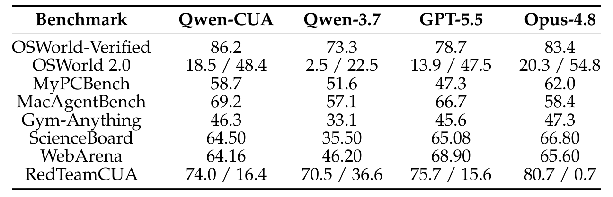

| 基准 | Qwen-CUA | Qwen-3.7 | GPT-5.5 | Opus-4.8 |
|---|---:|---:|---:|---:|
| OSWorld-Verified | 86.2 | 73.3 | 78.7 | 83.4 |
| OSWorld 2.0 | 18.5 / 48.4 | 2.5 / 22.5 | 13.9 / 47.5 | 20.3 / 54.8 |
| MyPCBench | 58.7 | 51.6 | 47.3 | 62.0 |
| MacAgentBench | 69.2 | 57.1 | 66.7 | 58.4 |
| Gym-Anything | 46.3 | 33.1 | 45.6 | 47.3 |
| ScienceBoard | 64.50 | 35.50 | 65.08 | 66.80 |
| WebArena | 64.16 | 46.20 | 68.90 | 65.60 |
| RedTeamCUA | 74.0 / 16.4 | 70.5 / 36.6 | 75.7 / 15.6 | 80.7 / 0.7 |

*表 1（原文表注翻译）：主要结果。OSWorld 2.0 报告二元完成率／部分完成率；RedTeamCUA 报告任务成功率／攻击成功率（ASR）。*

**效率。** 计算机使用中的智能体效率包含两个互补维度。token 效率衡量完成任务需要多少模型生成推理；交互效率衡量智能体通过连续轮次推进环境的简洁程度。前者主要影响推理成本和延迟；后者反映轨迹长度，但也取决于智能体接口如何封装底层动作。

我们用每任务输出 token 数衡量 token 效率。图 6a 表明，Qwen-CUA 使用 3,605.8 个 token 在 OSWorld-Verified 上达到 86.2；Claude Opus 4.8 在相近预算下为 80.0，使用 21.8K token 时为 83.3。该比较说明，Qwen-CUA 在 OSWorld-Verified 上的增益并非仅由更冗长的推理造成（Xie 等，2024）。

交互效率更难直接比较。在 OSWorld 2.0 上，Qwen-CUA 平均每个任务使用 218.9 个模型轮次，附录 D.2 将其报告为外层步骤；GPT-5.5 和 Claude Opus 4.8 分别为 83.5 和 105.7。然而，两个闭源接口都能在一个轮次中批量发出多个动作，而 Qwen-CUA 每轮只发出一个原生动作。因此，轮次差异把轨迹长度与串行执行混在了一起，并不是归一化后的底层动作效率指标（OpenAI，2026b；Anthropic，2026c）。

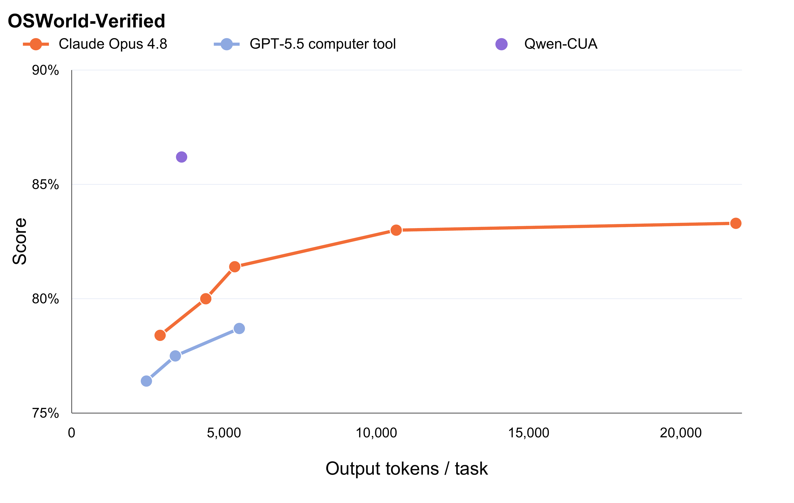

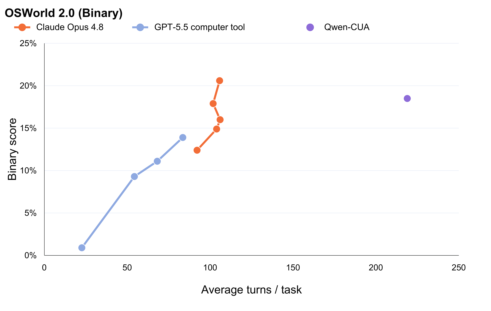

*图 6（原文图注翻译）：智能体效率的两个维度。（a）OSWorld-Verified 上的 token 效率，以每任务输出 token 数衡量；（b）OSWorld 2.0 上的交互效率，以每任务智能体轮次数衡量。轮次数依赖接口，因为 GPT-5.5 和 Claude Opus 4.8 每轮可发出多个动作，而 Qwen-CUA 每轮只发出一个。*

**安全性。** 计算机使用智能体必须把用户意图与环境中显示的不可信指令区分开来。我们用 RedTeamCUA（Liao 等，2025）评估这种风险；该基准在 ownCloud、Rocket.Chat 和 Reddit 上的 Web—OS 混合任务中向智能体暴露间接提示注入。基准同时报告良性任务成功率和攻击成功率（ASR），因而能够区分“鲁棒性提高”和“通用任务能力下降”。

#### 表 2：RedTeamCUA 分平台结果

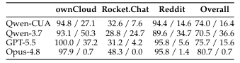

| 模型 | ownCloud | Rocket.Chat | Reddit | 总体 |
|---|---:|---:|---:|---:|
| Qwen-CUA | 94.8 / 27.1 | 32.6 / 7.6 | 94.4 / 14.6 | 74.0 / 16.4 |
| Qwen-3.7 | 93.1 / 50.3 | 28.8 / 24.7 | 89.6 / 34.7 | 70.5 / 36.6 |
| GPT-5.5 | 100.0 / 37.2 | 31.2 / 4.2 | 95.8 / 5.6 | 75.7 / 15.6 |
| Opus-4.8 | 97.9 / 0.7 | 48.3 / 0.0 | 95.8 / 1.4 | 80.7 / 0.7 |

*表 2（原文表注翻译）：RedTeamCUA 分平台结果，数值为任务成功率／攻击成功率（%）。*

相较于 Qwen3.7，Qwen-CUA 同时改善两个指标：任务成功率由 70.5 升到 74.0，ASR 由 36.6 降到 16.4，下降 20.2 个百分点。表 2 显示，这种降低在三个平台上都一致出现。

其总体成绩 74.0／16.4 接近 GPT-5.5 的 75.7／15.6，而 Claude Opus 4.8 在两个指标上都最强。仍有 16.4 的 ASR 表明残余风险存在；解读 Rocket.Chat 时还必须同时考虑任务成功率，因为执行失败也可能在没有稳健拒绝的情况下降低 ASR。因此，RedTeamCUA 证明的是对间接提示注入的抵抗有所改善，而不是已经具备部署安全保证。

### 4.2 真实世界部署

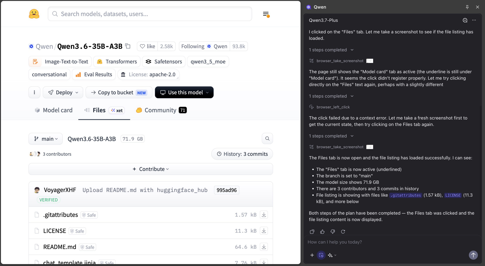

*图 7（原文图注翻译）：Qwen for Chrome 部署。*

> 译者注：图中内部 Chrome 扩展在侧边栏向用户展示智能体轨迹，并通过截图及原生鼠标—键盘动作操作当前页面。

为了在受控基准之外检验 Qwen-CUA，我们为日常浏览器工作流开发了一个内部 Chrome 扩展。它运行在 Chrome 侧边栏中（图 7），通过截图和原生鼠标—键盘动作操作活动页面，同时向用户暴露自己的轨迹。这样，模型可以直接用于自然发生的网站和任务。

这类部署也会暴露标准化评估遗漏的能力边界，包括陌生布局、动态网站状态、交互失败恢复，以及需要用户介入的情况。附录 E 展示一个端到端案例：智能体通过浏览器购买并配置云虚拟机，并在具有实际后果的操作前请求用户确认。

### 4.3 与命令行结合

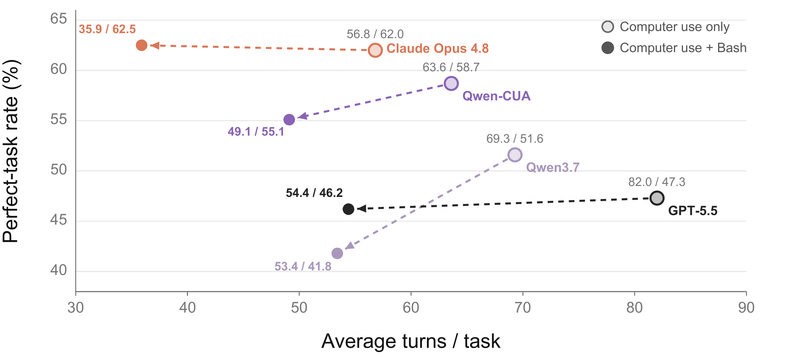

*图 8（原文图注翻译）：使用与不使用 Bash 时的 MyPCBench 指标。*

> 译者注：图中空心点表示仅计算机使用，实心点表示计算机使用加 Bash；横轴为平均每任务轮数，纵轴为完整任务率。

原生键盘—鼠标交互能够广泛覆盖图形界面，而命令行工具能够更直接地表达文件和系统操作。因此，我们在两个设置下评估相同的 MyPCBench 任务（Jang 等，2026）：仅使用计算机，以及在计算机使用基础上增加 Bash 工具。在混合设置中，模型可以把适合的操作路由到 Bash，同时为必须使用图形界面的任务保留视觉交互。

图 8 表明，加入 Bash 会一致缩短两个 Qwen 模型的交互轨迹：Qwen3.7 的平均轮数由 69.3 降至 53.4，Qwen-CUA 由 63.6 降至 49.1。然而，它们的任务表现也分别由 51.6 降至 41.8、由 58.7 降至 55.1。这个权衡说明，当前 Qwen 模型尚未完全学会何时在原生计算机使用和命令行执行之间切换：对合适操作而言，Bash 提供更短路径；但不必要或时机不当的切换会降低任务完成度。我们主要把这视为优化缺口，而非混合接口本身的局限。如果策略能够可靠地把每项操作路由到适当模态，就有可能把计算机使用的通用性和视觉落地能力，与命令行工具的速度和精度结合起来，达到比任一单独接口更优的能力—效率前沿。轮数的大幅下降也为联合训练、异质轨迹收集和显式工具路由监督留下很大空间，使系统有望在保持效率增益的同时恢复性能。因此，我们看好混合智能体，认为它是构建能力更强、效率更高的通用系统的有前景方向。

### 4.4 扩大模型容量

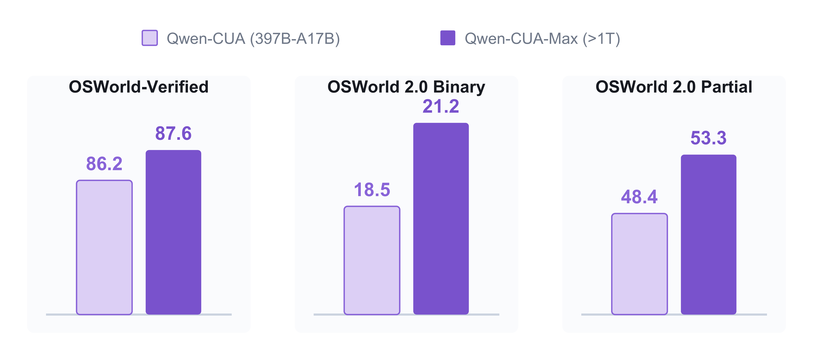

*图 9（原文图注翻译）：将 Qwen-CUA 扩展到 Qwen-CUA-Max。*

> 译者注：图中比较 397B-A17B 与总参数超过一万亿的模型在 OSWorld-Verified、OSWorld 2.0 二元完成率和部分完成率上的成绩。

Qwen-CUA 建立在 397B-A17B 混合专家模型之上。为了检验智能体训练方案能否继续从额外模型容量中获益，我们把它应用到总参数超过一万亿的模型，并将其称为 **Qwen-CUA-Max**。两个模型使用相同的原生计算机使用接口和评估协议。

如图 9 所示，Qwen-CUA-Max 把 OSWorld-Verified 从 86.2 提高到 87.6。在 OSWorld 2.0 上，二元完成率由 18.5 升至 21.2，部分完成率由 48.4 升至 53.3。持续一致的增益——包括部分完成率提高 4.9 个百分点——说明 Qwen-CUA 训练方案仍能随模型容量扩大而提升，并改善对困难长时程工作流的推进程度。

## 5. 相关工作

**原生计算机使用智能体。** 计算机使用研究逐步从使用结构化界面表示的智能体，转向感知截图并预测落地 GUI 动作的模型。早期视觉路线强调 GUI 定位和屏幕理解（Cheng 等，2024；Gou 等，2024；Z. Wu 等，2024），后来的原生智能体则越来越多地把感知、推理和动作统一到一个策略中（Xu 等，2024；Qin 等，2025；H. Wang 等，2025a；X. Wang 等，2025b；Bai 等，2025）。Qwen-CUA 沿用这条原生视觉路线：它不接收 DOM 或无障碍元数据，通过键盘和鼠标事件行动，同时把该设置扩展到更长视觉历史和大规模智能体后训练。

**可扩展的计算机使用数据与环境。** 人类示范和自动重建轨迹可提供跨应用的广泛监督（X. Wang 等，2025b；Xu 等，2025；Lu 等，2025；Xie 等，2025；Fan、Wan 等，2026b）。但对强化学习而言，每个任务还必须具有可复现初始状态和可靠结果信号。近期工作探索了基于模型的评估器、合成 Web 应用，以及可编程控制的桌面环境以获得这类信号（C. Yang 等，2025a；Cao 等，2026；Zhang 等，2026；Y. Wu 等，2026b；B. Wang、Lu 等，2026a；Fan、Shi 等，2026a；Lv 等，2026）。可扩展轨迹采样基础设施还把环境执行与评估、蒸馏和强化学习客户端分开（J. Wang 等，2026c）。Qwen-CUA 把可控 Web 服务与广泛桌面应用覆盖结合起来，并把可扩展可验证任务同来自个性化及专业工作流的人类示范配对。

**强化学习与迭代训练。** 近期计算机使用智能体采用在线或多轮强化学习来改善落地动作预测和长时程执行（Xia 与 Luo，2025；H. Wang 等，2025a；C. Yang 等，2025a；Huang 等，2026；Lv 等，2026）。另一类工作研究反复收集、筛选并从自身经验中学习的智能体（Z. Sun 等，2025b；Xue 等，2026）。Qwen-CUA 采用可执行的最终状态奖励、软门控策略优化，以及在模型代际之间刷新监督数据并校准 RL 任务的迭代流程。附录 F 更广泛地讨论计算机使用基础、训练数据、环境、基准和安全评估方面的相关工作。

## 6. 结论、局限与未来工作

我们提出了 Qwen-CUA：一个通过截图感知界面、通过原生键盘和鼠标事件行动的计算机使用智能体。横跨日常、专业、科学、Web、个性化和安全导向基准的结果支持一个简单论点：原生计算机使用是一种足够通用的接口，能够与几乎任何人类可访问的软件交互。与任务专用 API 不同，该接口无需依赖特权环境状态即可跨应用迁移；真实世界浏览器部署进一步表明，同一策略能够在基准沙箱之外运行。结合可扩展环境、可验证任务、强化学习和迭代式智能体训练，这一通用接口为智能体完成越来越广泛、越来越长时程的数字工作流提供了一条路径。

不过，通用并不等于最优。基于像素的观察、反复模型推理和串行底层动作会带来显著延迟及交互成本；当任务可以直接用代码、Shell 命令或结构化 API 表达时，视觉操作也很低效。加入 Bash 的实验已经展示更短轨迹，但如何在不损失任务表现的情况下可靠路由工具仍是开放问题。因此，我们不把原生计算机使用视为唯一动作接口，而把它视为混合智能体的通用落地层和兜底层。未来系统应将其与 Codex、Claude Code 等编码和命令行智能体（OpenAI，2026a；Anthropic，2026a）结合，并配合通用规划、记忆和专门工具。这样的智能体可以用代码完成精确、高吞吐操作，在结构化工具可用时调用工具，而在必须操作视觉或封闭界面时使用原生计算机，从而同时接近人类计算机使用的覆盖范围与程序化执行的效率。

## 作者

星号（\*）表示已离开 Qwen Team 的贡献者。

**核心贡献者：** Shuai Bai、Tianyi Bai\*、Sicheng Fan、Chang Gao、Jian Guan、Feng Hu、Mianqiu Huang、Xingyang Huang、Yizhen Jiang、Yuheng Jing、Dehui Kong、Ning Li、Dayiheng Liu、Shixuan Liu\*、Zheng Liu、Dunjie Lu、Que Shen、Bowen Wang\*、Junli Wang\*、Chencan Wu、Rui Xie、Tianbao Xie\*、Zhihui Xie、Haiyang Xu、An Yang、Tao Yu、Wenzhen Yuan、Xi Zhang、Zhenru Zhang、Mingkang Zhu、Zhaoqing Zhu。

**贡献者：** Yizhong Cao、Kai Dang、Binyuan Hui\*、Kaixin Li\*、Junyang Lin\*、Haiquan Wang、Zekun Wang、Yiheng Xu\*、Fan Yan、Mengqi Yuan、Danyang Zhang\*、Jiajun Zhang、Zhipeng Zhang\*、Fan Zhou\*、Fan Zhou。

## 附录 A：原生计算机使用动作空间

Qwen-CUA 接收截图作为视觉观察，并根据原生计算机使用模式预测动作。交互动作落到键盘和鼠标事件上；此外还有少量控制动作，用于等待 UI 更新、请求另一张截图、终止一个回合，或在任务无法自主继续时向用户询问信息。

| 类别 | 动作 | 说明 |
|---|---|---|
| 键盘 | `key` | 按下一个按键或组合键。 |
| 键盘 | `key_down`、`key_up` | 按住或释放一个按键。 |
| 键盘 | `type` | 通过键盘输入文本。 |
| 鼠标 | `mouse_move` | 把光标移动到一个屏幕坐标。 |
| 鼠标 | `left_click` | 单击鼠标左键。 |
| 鼠标 | `right_click` | 单击鼠标右键。 |
| 鼠标 | `middle_click` | 单击鼠标中键。 |
| 鼠标 | `double_click`、`triple_click` | 执行重复左键单击交互。 |
| 鼠标 | `left_click_drag` | 把光标拖动到目标坐标。 |
| 鼠标 | `left_mouse_down`、`left_mouse_up` | 按下或释放鼠标左键。 |
| 鼠标 | `scroll`、`hscroll` | 执行垂直或水平滚动。 |
| 控制 | `screenshot` | 请求更新后的截图观察。 |
| 控制 | `wait` | 等待 UI 更新。 |
| 控制 | `terminate` | 以成功或失败状态结束任务。 |
| 控制 | `call_user` | 向用户询问信息或请求确认。 |

## 附录 B：启发式上下文切片与压缩

Qwen-CUA 持续保存截图历史，并维护已折叠前缀长度 $k$。已折叠前缀内的截图被渲染为紧凑占位符，之后的截图仍作为视觉观察可用。在当前设置中，视觉预算为 $B=20$ 张截图，每次压缩把已折叠前缀向前推进 $S=10$ 张截图。

### 算法 1：截图历史切片与压缩

**输入：** 截图 $x_{1:T}$、已折叠前缀长度 $k$、图像预算 $B=20$、切片大小 $S=10$。

```text
1  while T - k > B do
2      k ← k + S
3  end while
4  k ← min(k, T)
5  for i = 1 to T do
6      if i ≤ k then
7          将 x_i 渲染为紧凑文本占位符
8      else
9          将 x_i 渲染为截图
10     end if
11 end for
12 return 更新后的已折叠前缀长度 k 和渲染后的历史
```

## 附录 C：计算机使用强化学习细节

本附录具体说明第 3.3 节描述的强化学习阶段。它只覆盖如何从在线计算机使用轨迹优化策略；监督数据构造和外层迭代训练过程已在第 3.4 节另行讨论。

### C.1 RLVR 表述与轨迹采样收集

RL 训练集由可验证三元组 $(t,s,r)$ 组成。其中，$t$ 是自然语言任务指令，$s$ 是可复现初始环境状态，$r$ 是一个可执行评估器，它把轨迹产生的状态映射到 $[0,1]$ 内的标量奖励。当部分完成有意义时，评估器把任务分解为可独立检查的准则；具有严格完成语义的任务使用二元奖励。奖励根据最终环境状态计算，而不是根据动作是否与某条参考动作序列一致来计算。

每次 RL 运行前，我们都依据当前 SFT 策略校准候选查询池。对于候选查询 $q$，令 $c(q)$ 表示八次独立试采样轨迹中成功的数量。保留集合为

$$
\mathcal{Q}_{\mathrm{RL}}=\{q\mid 0<c(q)<8\}.
$$

这会排除当前策略从未解决的查询，以及已经能够稳定解决的查询。这种轮次级校准选择 RL 任务池；下述分组轨迹采样过程则为每次策略更新独立采样实际使用的轨迹。

对于每个抽取出的三元组，轨迹采样服务在隔离环境中恢复 $s$，并从行为策略 $\pi_{\theta_{\mathrm{old}}}$ 采样 $N_{\mathrm{over}}=20$ 条轨迹。当智能体发出 `terminate` 或达到交互预算时，轨迹终止。没有产生有效策略轨迹或有效终止状态的采样会被移除，例如发生无法恢复的超时或格式错误的工具调用。前 $G=16$ 条有效轨迹构成优化组。我们不依据奖励方差筛掉组：如果所有轨迹获得相同奖励，均值中心化会产生零优势，该组便不贡献策略梯度。

> [!note] 译者补充：为什么同奖励组会“自动失活”，而不必预先筛除？
>
> 这里使用的是**组内相对优势**，而不是把绝对奖励直接当作策略梯度的权重。对同一任务采样的 $G$ 条轨迹，先计算组内均值 $\bar r$ 和标准差 $\sigma_r$，再令
> $$
> \hat A_i=\frac{r_i-\bar r}{\sigma_r+\delta}.
> $$
> 如果该组所有轨迹的奖励都等于同一个常数 $c$，那么 $\bar r=c$、$\sigma_r=0$，而每条轨迹的分子都是 $r_i-\bar r=c-c=0$。虽然分母中的小常数 $\delta$ 可以防止数值上的除零，但 $0/\delta$ 仍然严格等于零，因此组内所有轨迹都有 $\hat A_i=0$。
>
> 后面的 SAPO 目标及其梯度都与 $\hat A_i$ 成正比。于是，在本文给出的策略目标中，这一组的每个 token 梯度权重都为零：轨迹仍完成了采样、奖励计算和日志记录，但不会推动策略参数更新。这就是“该组不贡献策略梯度”的确切含义，并不意味着系统在进入优化器之前必须显式删除它。
>
> 可以用二元奖励的三个小例子理解：
>
> - 奖励为 $[1,1,1,1]$：四条轨迹全部成功，但组内没有“哪种行为更好”的差异，所有优势均为零。
> - 奖励为 $[0,0,0,0]$：四条轨迹全部失败，同样没有可用于比较的差异，所有优势也均为零。
> - 奖励为 $[1,1,0,0]$：此时 $\bar r=0.5$、$\sigma_r=0.5$；忽略很小的 $\delta$，两条成功轨迹的优势约为 $+1$，两条失败轨迹约为 $-1$。优化才会提高成功轨迹中动作的概率，并压低失败轨迹中动作的概率。
>
> 因而，这类方法实际学习的是：**面对同一个任务和初始状态，哪些采样行为相对其他行为带来了更高回报**。一组“全成功”只能说明当前策略对该次采样很稳定，一组“全失败”只能说明该次采样没有找到解；二者都没有提供组内行为优劣的对照信息。即使共同奖励是某个非零的部分分数，例如 $[0.7,0.7,0.7,0.7]$，均值中心化后仍然全部为零，因为算法关心的是组内差异，而不是共同的绝对奖励水平。
>
> 不按奖励方差预先筛组还有三点作用：第一，零方差组本来就会被公式精确置零，额外过滤在数学上是冗余的；第二，不需要人为设定“方差多小才算无信息”的阈值，避免把奖励差异很小但真实存在的组误删；第三，保持数据管线简单，避免基于本批次结果再次选择样本而引入额外的选择规则。代价是零方差组仍会消耗 rollout 和奖励评估计算，只是不会消耗有效的策略学习信号。
>
> 这与上一段的任务池校准并不矛盾。$0<c(q)<8$ 是在一次 RL 运行开始前，用当前 SFT 策略的八次试采样判断一个任务是否总体上“既非不可能、也非已经完全掌握”；而这里讨论的是训练过程中某一次具体抽样得到的 16 条轨迹。即使某个任务在校准时既有成功也有失败，某个训练批次仍可能偶然出现全成功或全失败；策略更新后，任务难度相对当前策略也会继续变化。前者决定任务是否进入候选池，后者决定这个具体轨迹组当次是否产生梯度。

### 算法 2：分组计算机使用 RL 更新

**输入：** 任务批次 $\mathcal{B}$、行为策略 $\pi_{\theta_{\mathrm{old}}}$、组大小 $G$、过采样大小 $N_{\mathrm{over}}$。

```text
1  for all (t, s, r) ∈ 𝓑 do
2      从 π_{θ_old}(·|t,s) 采样最多 N_over 条完整轨迹
3      丢弃无效轨迹并保留前 G 条
4      for all 保留的 ζ_i do
5          在所得状态上执行 r，得到 r_i ∈ [0,1]
6      end for
7      Â_i ← (r_i - r̄)/(σ_r + δ)
8      为每条 ζ_i 构造上下文受限切片及策略 token 损失掩码
9  end for
10 在全部活动策略 token 上最大化带软门控的 SAPO 目标
```

### C.2 SAPO 目标

我们用软自适应策略优化（SAPO；Gao 等，2025）优化策略。考虑为一个任务保留的 $G$ 条轨迹 $\{\zeta_1,\ldots,\zeta_G\}$ 及其终止奖励 $\{r_1,\ldots,r_G\}$。SAPO 在组内归一化奖励，同一条轨迹的每个 token 都继承相同优势：

$$
\hat{A}_i = \frac{r_i-\bar{r}}{\sigma_r+\delta},
\qquad
\bar{r}=\frac{1}{G}\sum_{j=1}^{G}r_j,
\qquad
\sigma_r=\sqrt{\frac{1}{G}\sum_{j=1}^{G}(r_j-\bar r)^2}.
$$

其中 $\delta>0$ 是防止除零的小常数。如果 $G$ 个奖励完全相同，每条轨迹的分子都为零，该组不会产生梯度。

> [!note] 译者补充：如何理解“每个 token 都继承相同优势”？
>
> 这里的奖励是**整条轨迹的终止奖励**：评估器查看任务结束时的环境状态，为轨迹 $\zeta_i$ 给出一个标量 $r_i$，但不会指出“第 37 个 token 是正确点击的关键”“第 82 个 token 是无关推理”。组内归一化后得到的 $\hat A_i$ 仍然只是轨迹级标量。因此训练时把它广播到该轨迹的所有活动策略 token：
> $$
> \hat A_{i,u}\equiv \hat A_i,
> \qquad u\in\mathcal M_i.
> $$
> 也就是说，同一轨迹中的推理 token、动作描述 token 和工具调用 token 使用相同的优势符号与数值。若该轨迹相对组内其他轨迹更好，$\hat A_i>0$，其全部活动 token 都获得正向学习信号；若相对更差，$\hat A_i<0$，其全部活动 token 都获得负向学习信号；若 $\hat A_i=0$，这些 token 都不产生策略梯度。任务文本、历史观察和截图只是生成条件，并非策略在当前轨迹中采样出的动作，所以它们会被损失掩码排除，不“继承”该优势。
>
> 这种写法可以从轨迹概率的分解直接看出。忽略环境转移中与参数 $\theta$ 无关的部分，一条轨迹中策略所生成内容的概率可写成
> $$
> \pi_\theta(\zeta_i\mid t,s)
> =\prod_{u\in\mathcal M_i}
> \pi_\theta(y_{i,u}\mid h_{i,u}).
> $$
> 对数概率把乘积变成求和，因此轨迹级策略梯度为
> $$
> \hat A_i\nabla_\theta\log\pi_\theta(\zeta_i\mid t,s)
> =\sum_{u\in\mathcal M_i}
> \hat A_i\nabla_\theta
> \log\pi_\theta(y_{i,u}\mid h_{i,u}).
> $$
> 右侧的每一项自然带有同一个 $\hat A_i$。这相当于把最终成败作为一次蒙特卡洛回报，归因给通往该终止状态的整条策略生成序列，而没有另外训练一个逐状态价值函数去估计每一步自己的优势。
>
> 例如，一条成功轨迹可能依次生成“分析界面 → 点击菜单 → 输入关键词 → 点击确认”。如果它的组内优势为 $+1.2$，上述四段策略输出中的所有活动 token 都乘以 $+1.2$；模型会整体提高在各自上下文中再次生成这些 token 的倾向。若另一条失败轨迹的优势为 $-0.8$，其活动 token 则都乘以 $-0.8$，整体受到抑制。
>
> 需要注意，**优势相同不等于每个 token 的最终梯度完全相同**。每个 token 面对的上下文 $h_{i,u}$、当前概率、重要性比率 $\rho_{i,u}$、SAPO 门权重 $w_{i,u}$ 以及对参数的对数概率梯度都不同。相同的只是共同乘上的轨迹级信用信号 $\hat A_i$。论文又用 $1/|\mathcal M_i|$ 对每条轨迹的活动 token 求平均，避免较长轨迹仅凭 token 更多就占据更大的总权重；这仍然不是逐 token 的精细信用分配。
>
> 这种设计适合计算机使用任务，因为“最终是否完成任务”通常容易由可执行评估器验证，而为每一次观察、推理和点击设计可靠的稠密奖励非常困难。代价是信用分配较粗：成功轨迹中的多余甚至不良步骤也可能被一并强化，失败轨迹中原本正确的早期步骤也可能被一并压低；轨迹越长、偶然成功越多，这种噪声通常越明显。组内多轨迹比较可以提供相对基线并降低一部分方差，但不能从根本上判断究竟是哪一个 token 导致了最终成败。

令 $\mathcal M_i$ 表示 $\zeta_i$ 的活动 token，也就是由策略发出的推理 token 和计算机使用工具调用 token；只用于条件生成的任务、历史和观察 token 不在其中。对于 $u\in\mathcal M_i$，令 $y_{i,u}$ 为发出的 token，$h_{i,u}$ 为其上下文（任务指令、之前的交互历史，以及折叠后可见的截图）。当前策略 $\pi_\theta$ 与行为策略 $\pi_{\theta_{\mathrm{old}}}$ 之间的 token 级重要性比率为

$$
\rho_{i,u}(\theta)=
\frac{\pi_\theta(y_{i,u}\mid h_{i,u})}
     {\pi_{\theta_{\mathrm{old}}}(y_{i,u}\mid h_{i,u})}.
$$

SAPO 使该比率通过一个以同策略点 $\rho_{i,u}=1$ 为中心的有界门函数：

$$
f_{i,u}(x)=\frac{4}{\tau_{i,u}}\,
\sigma\!\left(\tau_{i,u}(x-1)\right),
\qquad
\tau_{i,u}=
\begin{cases}
\tau_{\mathrm{pos}}, & \hat A_i>0,\\
\tau_{\mathrm{neg}}, & \hat A_i\le 0.
\end{cases}
$$

其中，$\sigma(x)=1/(1+e^{-x})$ 是 Logistic 函数，$\tau_{i,u}$ 是门温度；它根据轨迹优势的符号，从常数 $\tau_{\mathrm{pos}}$ 与 $\tau_{\mathrm{neg}}$ 中选取。前置系数 $4/\tau_{i,u}$ 把 $\rho_{i,u}=1$ 处的门斜率固定下来，因此同策略 token 无论温度如何，都恢复为未截断更新。策略最大化

$$
\begin{aligned}
\mathcal{J}_{\mathrm{SAPO}}(\theta)
=\mathbb{E}_{\substack{(t,s,r)\sim\mathcal D,\\
\{\zeta_i\}_{i=1}^{G}\sim
\pi_{\theta_{\mathrm{old}}}(\cdot\mid t,s)}}\Bigg[
\frac{1}{G}\sum_{i=1}^{G}
\frac{1}{|\mathcal{M}_i|}\sum_{u\in\mathcal{M}_i}
f_{i,u}\!\left(\rho_{i,u}(\theta)\right)\hat A_i
\Bigg].
\end{aligned}
$$

其中，$(t,s,r)$ 是从训练分布 $\mathcal D$ 抽取的任务三元组，轨迹由 $\pi_{\theta_{\mathrm{old}}}$ 采样，$|\mathcal M_i|$ 依据每条轨迹的活动 token 数对其归一化。利用
$\nabla_\theta\rho_{i,u}=\rho_{i,u}\nabla_\theta\log\pi_\theta(y_{i,u}\mid h_{i,u})$，梯度为

$$
\begin{aligned}
\nabla_\theta\mathcal{J}_{\mathrm{SAPO}}(\theta)
&=\mathbb{E}\Bigg[
\frac{1}{G}\sum_{i=1}^{G}
\frac{1}{|\mathcal{M}_i|}\sum_{u\in\mathcal{M}_i}
w_{i,u}(\theta)\,\rho_{i,u}(\theta)\cdot
\nabla_\theta\log\pi_\theta(y_{i,u}\mid h_{i,u})\,\hat A_i
\Bigg].
\end{aligned}
$$

有效梯度权重为

$$
w_{i,u}(\theta)=4\,p_{i,u}(\theta)\bigl(1-p_{i,u}(\theta)\bigr),
\qquad
p_{i,u}(\theta)=\sigma\!\left(\tau_{i,u}(\rho_{i,u}(\theta)-1)\right).
$$

当 $\rho_{i,u}=1$ 时，权重 $w_{i,u}=1$；随着 token 偏离行为策略，它会平滑衰减至零，因此更新表现为软信赖域，而不是硬截断。我们设置 $\tau_{\mathrm{neg}}>\tau_{\mathrm{pos}}$，使非正优势 token 衰减得更快：这类更新会同时提高许多替代 token 的概率，是更容易造成不稳定的方向。报告设置中，$\tau_{\mathrm{pos}}=1.0$、$\tau_{\mathrm{neg}}=1.05$；每个收集批次只执行一次优化器遍历，以限制轨迹采样和更新之间的离策略漂移。

### C.3 长时程轨迹构造

计算机使用轨迹把文本与高分辨率截图交错在一起，可能在观察到终止奖励前就超过训练上下文。我们每隔 10 对交互轮次执行一次确定性训练期切片。每个切片保留系统前缀和任务前缀。折叠前缀中的截图替换为固定的 `<image collapsed>` 占位符，而近期截图、推理和动作仍保留原始多模态形式。逐步前移折叠边界会创建多个上下文受限视图，它们的并集覆盖完整轨迹。

每个切片都获得其父回合的完整奖励。我们不跨轮次分解或折扣终止奖励，因为它评价的是最终环境状态，而不是某个单独动作。对折叠前缀、任务指令、用户或用户模拟器消息、截图和环境响应，损失掩码均为 `False`；只有活动响应部分中模型生成的推理与工具调用 token 的掩码为 `True`。无法获得行为策略对数概率的片段也会被掩盖，防止使用陈旧或不完整的轨迹记录更新。虽然这没有创造逐步信用分配，但一个长回合可以贡献多个优化样本，其中的活动 token 覆盖交互不同阶段。因此，切片在保留可执行结果奖励语义的同时，更密集地复用了稀疏回合级反馈。

训练期切片复用附录 B 的推理期折叠算子。折叠的截图跨度及保留的文本、视觉字段以相同格式序列化，从而保证训练—推理一致。训练在 144K token 限制下枚举多个上下文受限视图；推理则在 20 张图像预算下在线前移边界。两阶段只在调度和预算上不同，折叠历史表示本身相同。

### C.4 优化配置

表 3 报告用于强化学习训练 397B-A17B Qwen-CUA 的配置。外层批包含 128 个任务提示，因此在轨迹切片前最多有 $128\times16=2{,}048$ 条有效轨迹。由于一条长轨迹可能产生多个切片，优化样本数可以更大。

#### 表 3：397B-A17B Qwen-CUA 强化学习配置

| 配置 | 数值 | 说明 |
|---|---:|---|
| 组大小 $G$ | 16 | 每个任务组使用的有效轨迹数。 |
| 过采样 | 20 | 筛除无效轨迹前采样的候选轨迹数。 |
| 外层批大小 | 128 个提示 | 每次更新收集的任务组数。 |
| 小批大小 | 32 个提示 | 内层梯度累积单元。 |
| 优化器 | AdamW | $\beta_1=0.9$，$\beta_2=0.999$，$\epsilon_{\mathrm{Adam}}=10^{-8}$。 |
| 学习率 | $1\times10^{-6}$ | 常数调度，无预热。 |
| 权重衰减 | 0.01 | 应用于非偏置、非归一化参数。 |
| SAPO $\tau_{\mathrm{pos}}$ | 1.0 | 正优势的软门温度。 |
| SAPO $\tau_{\mathrm{neg}}$ | 1.05 | 非正优势的软门温度。 |
| 优化轮数 | 1 | 对每个收集批次执行一次优化器遍历。 |
| 总更新次数 | 1,000 | 一次完整 RL 运行的外层批更新数。 |
| 轨迹采样温度 | 1.0 | 训练轨迹的采样温度。 |
| 最大轮数 | 100 | 训练期间每个回合的交互预算。 |
| 最大响应 | 2,048 token | 每轮模型输出上限。 |
| 最大上下文 | 144K token | 切片后的硬上下文预算。 |
| 最大初始提示 | 8K token | 任务及固定前缀预算。 |
| 切片间隔 | 10 对轮次 | 折叠边界前移频率。 |

*表 3（原文表注翻译）：397B-A17B Qwen-CUA 模型的强化学习配置。*

> 译者注：该表位于 PDF 第 17 页；因其为普通文本表格，本译文将全部单元格完整重排为 Markdown。

### C.5 分布式训练与环境轨迹采样

397B-A17B Qwen-CUA 配置在 64 个八卡节点上使用 512 块 NVIDIA H200 SXM GPU。遵循 `verl` 的解耦 RL 架构（verl Project，2024），我们分配 32 个节点用于训练，32 个节点用于轨迹采样。训练使用 $TP=2$、$EP=8$、$CP=4$、$PP=8$；轨迹采样服务使用 $TP=8$、数据并行副本、SGLang（SGLang Project，2024）以及优化的注意力后端。异步调度层使用 2.35 的比率，并把策略版本偏差限制为最多四个优化步骤。完整的 1,000 次更新约需五天，相当于约 61,440 H200 GPU 小时。

环境执行与模型推理解耦，并路由到第 3.1 节环境池中的隔离 ECS 工作节点。该配置保持最多 2,000 个环境活动，平均利用率高于 75%。对每条轨迹，路由器恢复任务快照，流式传输截图和原生动作，在终止后调用评估器并重置工作节点。隔离可防止状态泄漏，也允许同一任务组的多条轨迹并行执行。

## 附录 D：基准评估细节

本附录报告 Qwen-CUA 的各基准专用评估设置，以及可获得的详细比较结果。除非另有说明，Qwen-CUA 使用第 2 节描述的仅截图原生计算机使用接口与智能体脚手架，不访问 DOM、无障碍树、Shell 或任务专用 API。多数对比模型分数取自相应基准或模型提供方发布的官方报告。对于我们自行复现的结果，Qwen3.7 使用非思考模式，GPT-5.5 使用 `xhigh` 推理强度，Claude Opus 4.8 使用 `max` 推理设置。

### D.1 OSWorld-Verified

我们按照官方评估设置，在包含 360 个任务的 OSWorld-Verified 套件上评估 Qwen-CUA（Xie 等，2024；XLANG Lab，2025），步数上限为 100。智能体只观察截图，并通过第 2 节脚手架执行原生键盘和鼠标动作。我们使用基准提供的任务状态和可执行评估器，不修改其成功判据。Qwen-CUA 对 360 个任务中的 359 个生成了完整评估记录，总分为 86.2。

#### 表 4：Qwen-CUA 在 OSWorld-Verified 上的分领域结果

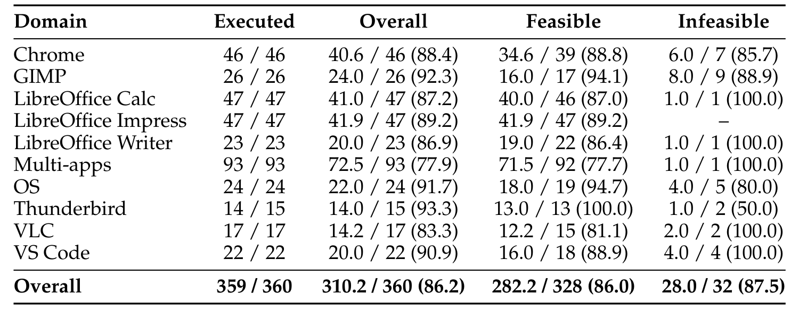

| 领域 | 已执行 | 总体 | 可行任务 | 不可行任务 |
|---|---:|---:|---:|---:|
| Chrome | 46 / 46 | 40.6 / 46 (88.4) | 34.6 / 39 (88.8) | 6.0 / 7 (85.7) |
| GIMP | 26 / 26 | 24.0 / 26 (92.3) | 16.0 / 17 (94.1) | 8.0 / 9 (88.9) |
| LibreOffice Calc | 47 / 47 | 41.0 / 47 (87.2) | 40.0 / 46 (87.0) | 1.0 / 1 (100.0) |
| LibreOffice Impress | 47 / 47 | 41.9 / 47 (89.2) | 41.9 / 47 (89.2) | — |
| LibreOffice Writer | 23 / 23 | 20.0 / 23 (86.9) | 19.0 / 22 (86.4) | 1.0 / 1 (100.0) |
| 多应用 | 93 / 93 | 72.5 / 93 (77.9) | 71.5 / 92 (77.7) | 1.0 / 1 (100.0) |
| 操作系统 | 24 / 24 | 22.0 / 24 (91.7) | 18.0 / 19 (94.7) | 4.0 / 5 (80.0) |
| Thunderbird | 14 / 15 | 14.0 / 15 (93.3) | 13.0 / 13 (100.0) | 1.0 / 2 (50.0) |
| VLC | 17 / 17 | 14.2 / 17 (83.3) | 12.2 / 15 (81.1) | 2.0 / 2 (100.0) |
| VS Code | 22 / 22 | 20.0 / 22 (90.9) | 16.0 / 18 (88.9) | 4.0 / 4 (100.0) |
| **总体** | **359 / 360** | **310.2 / 360 (86.2)** | **282.2 / 328 (86.0)** | **28.0 / 32 (87.5)** |

*表 4（原文表注翻译）：Qwen-CUA 在 OSWorld-Verified 上按领域划分的结果。每个分数按“所得分／任务数（比例，%）”报告。*

在全部任务上，Qwen-CUA 平均每任务使用 14.2 个外层步骤、执行 18.8 个动作、输出 3,605.8 个 token，每步输出 253.3 个 token。若只统计分数非零的轨迹，相应数值为 13.0 个外层步骤、15.9 个动作、每任务 3,162.9 个输出 token，以及每步 242.9 个输出 token。

### D.2 OSWorld 2.0

OSWorld 2.0（Yuan 等，2026）同时报告二元完成率与部分完成率：前者要求严格的端到端任务成功，后者对经过验证的中间进度给分。Qwen-CUA 的二元完成率为 18.5，部分完成率为 48.4。总参数超过一万亿的 Qwen-CUA-Max 相应达到 21.2 和 53.3。

#### 表 5：Qwen-CUA 在 OSWorld 2.0 上的结果

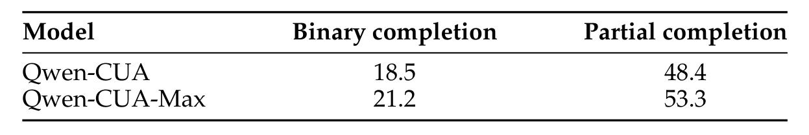

| 模型 | 二元完成率 | 部分完成率 |
|---|---:|---:|
| Qwen-CUA | 18.5 | 48.4 |
| Qwen-CUA-Max | 21.2 | 53.3 |

*表 5（原文表注翻译）：Qwen-CUA 在 OSWorld 2.0 上的结果（%）。*

表 6 记录相应的交互和生成统计。我们分别报告全部任务的平均值，以及获得非零分轨迹子集上的平均值。

#### 表 6：OSWorld 2.0 上的交互与生成统计

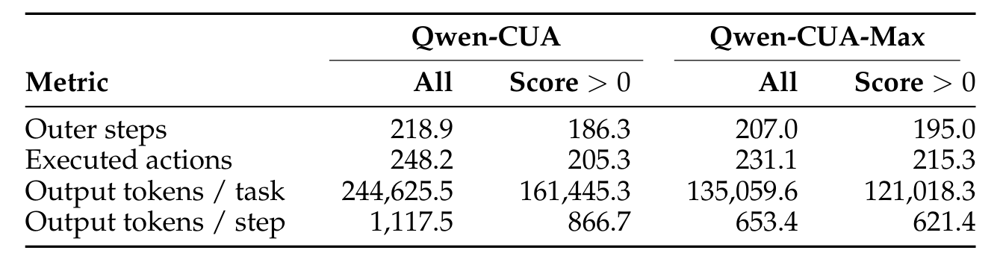

| 指标 | Qwen-CUA：全部 | Qwen-CUA：分数 > 0 | Qwen-CUA-Max：全部 | Qwen-CUA-Max：分数 > 0 |
|---|---:|---:|---:|---:|
| 外层步骤 | 218.9 | 186.3 | 207.0 | 195.0 |
| 已执行动作 | 248.2 | 205.3 | 231.1 | 215.3 |
| 每任务输出 token | 244,625.5 | 161,445.3 | 135,059.6 | 121,018.3 |
| 每步输出 token | 1,117.5 | 866.7 | 653.4 | 621.4 |

*表 6（原文表注翻译）：OSWorld 2.0 上的交互和生成统计。*

### D.3 MyPCBench

MyPCBench（Jang 等，2026）在 Ubuntu 桌面上评估个性化工作流；该桌面包含 17 个模拟真实世界 Web 应用、LibreOffice、用户文件，以及连贯的跨应用历史。我们在仅计算机使用设置下，对完整的 184 个任务评估 Qwen-CUA。每个任务都从基准快照开始；模型接收 $1280\times800$ 截图，只能通过原生键盘和鼠标事件行动，轮数上限为 200，不提供 Bash 工具。其余部分保留基准原有的任务初始化和基于评分细则的评估器。

MyPCBench 报告两个互补指标。评分细则分数对每个任务已满足准则的加权比例取平均，因此会认可部分完成。更严格的完整任务率只在一个任务的所有评分准则都通过时才计为成功。Qwen-CUA 的总体评分细则分数为 84.3，完整任务率为 58.7。表 7 给出 Qwen-CUA 与对比模型的细粒度任务切片结果。

#### 表 7：MyPCBench 分任务切片结果

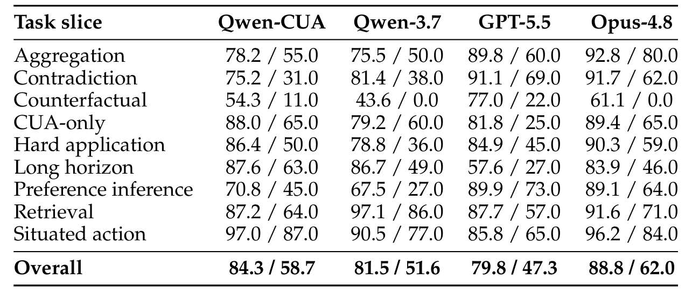

| 任务切片 | Qwen-CUA | Qwen-3.7 | GPT-5.5 | Opus-4.8 |
|---|---:|---:|---:|---:|
| 聚合 | 78.2 / 55.0 | 75.5 / 50.0 | 89.8 / 60.0 | 92.8 / 80.0 |
| 矛盾 | 75.2 / 31.0 | 81.4 / 38.0 | 91.1 / 69.0 | 91.7 / 62.0 |
| 反事实 | 54.3 / 11.0 | 43.6 / 0.0 | 77.0 / 22.0 | 61.1 / 0.0 |
| 仅 CUA | 88.0 / 65.0 | 79.2 / 60.0 | 81.8 / 25.0 | 89.4 / 65.0 |
| 困难应用 | 86.4 / 50.0 | 78.8 / 36.0 | 84.9 / 45.0 | 90.3 / 59.0 |
| 长时程 | 87.6 / 63.0 | 86.7 / 49.0 | 57.6 / 27.0 | 83.9 / 46.0 |
| 偏好推断 | 70.8 / 45.0 | 67.5 / 27.0 | 89.9 / 73.0 | 89.1 / 64.0 |
| 检索 | 87.2 / 64.0 | 97.1 / 86.0 | 87.7 / 57.0 | 91.6 / 71.0 |
| 情境动作 | 97.0 / 87.0 | 90.5 / 77.0 | 85.8 / 65.0 | 96.2 / 84.0 |
| **总体** | **84.3 / 58.7** | **81.5 / 51.6** | **79.8 / 47.3** | **88.8 / 62.0** |

*表 7（原文表注翻译）：MyPCBench 按任务切片划分的结果，按“评分细则分数／完整任务率（%）”报告。Qwen-CUA 使用 200 轮上限。*

### D.4 MacAgentBench

MacAgentBench（Fu 等，2026）在横跨 25 个应用的真实 macOS 任务上评估原生计算机使用。为了支持这种规模的评估，我们配置了由 30 台 Mac mini 组成的集群，把它们作为裸机执行后端，而不是虚拟化桌面实例。Qwen-CUA 被分发到这些物理机器上，通过截图观察和键盘—鼠标动作与原生 macOS 应用交互，同时保留基准原生任务初始化与评分协议。在该设置下，Qwen-CUA 的 Pass@1 为 69.2。

表 8 遵循基准的六个官方任务类别。Qwen-CUA 在多媒体类别上最强，其次是生产力和系统类别；较低的多应用分数反映跨应用工作流更为困难。

#### 表 8：MacAgentBench 六个官方任务类别的结果

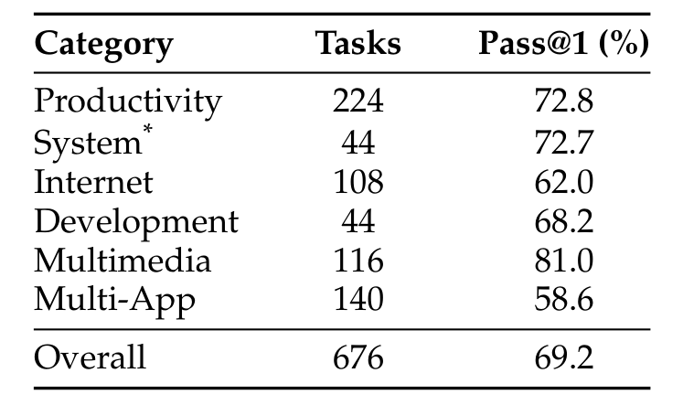

| 类别 | 任务数 | Pass@1（%） |
|---|---:|---:|
| 生产力 | 224 | 72.8 |
| 系统\* | 44 | 72.7 |
| 互联网 | 108 | 62.0 |
| 开发 | 44 | 68.2 |
| 多媒体 | 116 | 81.0 |
| 多应用 | 140 | 58.6 |
| 总体 | 676 | 69.2 |

*表 8（原文表注翻译）：Qwen-CUA 在 MacAgentBench 六个官方任务类别上的结果。带星号的系统类别结果包含受影响的 `clock` 任务。*

系统类别包含 12 个 `clock` 任务，官方评估器将它们全部记为零分。然而，人工检查记录轨迹后发现，请求的交互似乎已经正确完成，这更像是评估失败，而不是已经确认的能力失败。由于差异尚未解决，我们保留官方 0.0% 应用结果，以及由此得到的类别分和 69.2 总分，不做人工修正。

### D.5 Gym-Anything

Gym-Anything（Aggarwal、Neubig 与 Welleck，2026）在大量独立打包的软件环境上评估计算机使用智能体。我们的评估覆盖 97 个可运行环境中的 1,295 个测试任务。每项任务由可执行环境验证器或 VLM 裁判给出 0–100 的连续分数，基准分数为所有任务的平均值。在严格清洁重跑协议下，Qwen-CUA 得到 46.3；Qwen3.7、GPT-5.5 和 Claude Opus 4.8 分别为 33.1、45.6 和 47.3。

所有模型都观察 $1600\times900$ 截图，步数上限为 150。表 9 记录其余推理设置。对于需要视觉判断的任务，我们使用 Claude Sonnet 4.6 作为 VLM 验证器。如本附录开头所述，主比较中 Qwen3.7 运行于非思考模式，GPT-5.5 使用 `xhigh` 推理强度，Claude Opus 4.8 使用 `max` 设置；环境级诊断还保留一个 `medium` 配置。

#### 表 9：Gym-Anything 推理配置

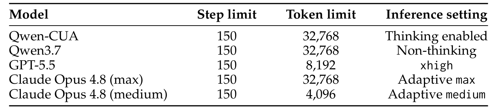

| 模型 | 步数上限 | token 上限 | 推理设置 |
|---|---:|---:|---|
| Qwen-CUA | 150 | 32,768 | 开启思考 |
| Qwen3.7 | 150 | 32,768 | 非思考 |
| GPT-5.5 | 150 | 8,192 | `xhigh` |
| Claude Opus 4.8（max） | 150 | 32,768 | 自适应 `max` |
| Claude Opus 4.8（medium） | 150 | 4,096 | 自适应 `medium` |

*表 9（原文表注翻译）：Gym-Anything 推理配置。*

在解释总体表现前，我们还审核环境可用性。诊断报告列出 100 个未进入已完成运行的环境：22 个需要 Windows 虚拟机镜像，7 个需要 Android 或 AVD 镜像，另有 71 个 Linux 环境因设置不完整或失败而不可用。随后修复了其中 15 个 Linux 设置，等待纳入未来评估清单。

#### 表 10：Gym-Anything 运行的环境覆盖

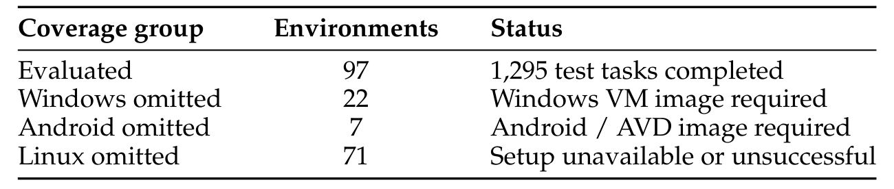

| 覆盖组 | 环境数 | 状态 |
|---|---:|---|
| 已评估 | 97 | 已完成 1,295 个测试任务 |
| 省略 Windows | 22 | 需要 Windows 虚拟机镜像 |
| 省略 Android | 7 | 需要 Android／AVD 镜像 |
| 省略 Linux | 71 | 设置不可用或不成功 |

*表 10（原文表注翻译）：Gym-Anything 运行中的环境覆盖。*

在 71 个被省略的 Linux 环境中，最常见原因是启动后服务超时（18 个）、设置过程以非零状态退出（12 个）、容器运行时冲突（9 个）、启动前超时（6 个）和任务前超时（3 个）。其余包括服务就绪失败、运行时异常或环境不可用。对严格清洁诊断视图而言，因设置失败、API 重试耗尽或可识别验证器噪声而失效的运行会被移除，而不是计为智能体失败。

评估报告称运行了 97 个环境，但其提供的环境级导出只包含 96 个具名行。表 11 原样重现导出中可用的全部行，不对缺失环境做插补。破折号表示该模型—环境组合没有可用分数。

#### 表 11：严格清洁 Gym-Anything 分环境分数

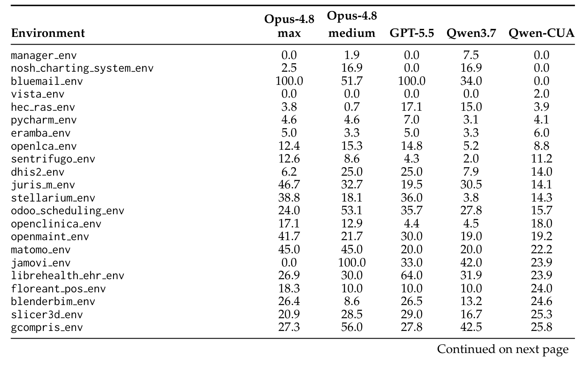

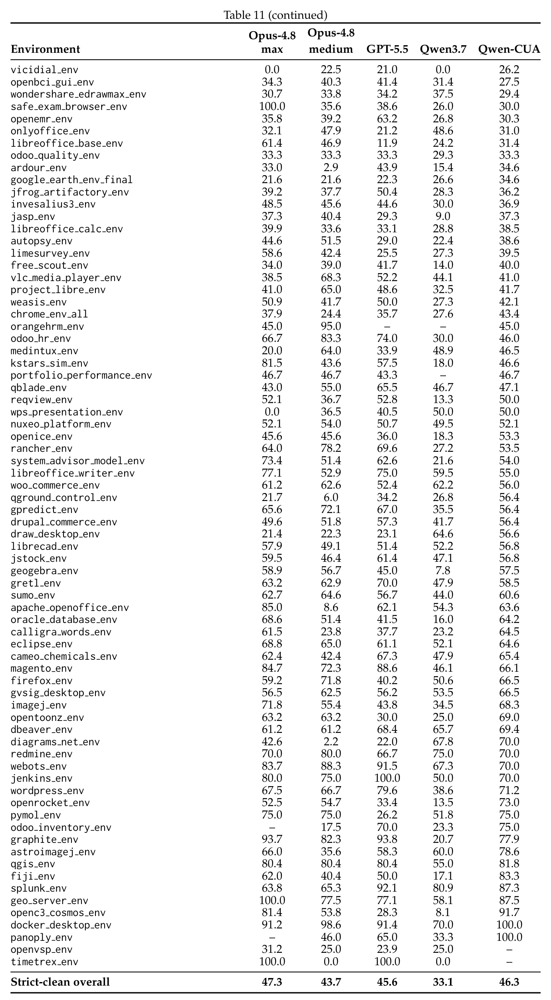

| 环境 | Opus-4.8 max | Opus-4.8 medium | GPT-5.5 | Qwen3.7 | Qwen-CUA |
|---|---:|---:|---:|---:|---:|
| `manager_env` | 0.0 | 1.9 | 0.0 | 7.5 | 0.0 |
| `nosh_charting_system_env` | 2.5 | 16.9 | 0.0 | 16.9 | 0.0 |
| `bluemail_env` | 100.0 | 51.7 | 100.0 | 34.0 | 0.0 |
| `vista_env` | 0.0 | 0.0 | 0.0 | 0.0 | 2.0 |
| `hec_ras_env` | 3.8 | 0.7 | 17.1 | 15.0 | 3.9 |
| `pycharm_env` | 4.6 | 4.6 | 7.0 | 3.1 | 4.1 |
| `eramba_env` | 5.0 | 3.3 | 5.0 | 3.3 | 6.0 |
| `openlca_env` | 12.4 | 15.3 | 14.8 | 5.2 | 8.8 |
| `sentrifugo_env` | 12.6 | 8.6 | 4.3 | 2.0 | 11.2 |
| `dhis2_env` | 6.2 | 25.0 | 25.0 | 7.9 | 14.0 |
| `juris_m_env` | 46.7 | 32.7 | 19.5 | 30.5 | 14.1 |
| `stellarium_env` | 38.8 | 18.1 | 36.0 | 3.8 | 14.3 |
| `odoo_scheduling_env` | 24.0 | 53.1 | 35.7 | 27.8 | 15.7 |
| `openclinica_env` | 17.1 | 12.9 | 4.4 | 4.5 | 18.0 |
| `openmaint_env` | 41.7 | 21.7 | 30.0 | 19.0 | 19.2 |
| `matomo_env` | 45.0 | 45.0 | 20.0 | 20.0 | 22.2 |
| `jamovi_env` | 0.0 | 100.0 | 33.0 | 42.0 | 23.9 |
| `librehealth_ehr_env` | 26.9 | 30.0 | 64.0 | 31.9 | 23.9 |
| `floreant_pos_env` | 18.3 | 10.0 | 10.0 | 10.0 | 24.0 |
| `blenderbim_env` | 26.4 | 8.6 | 26.5 | 13.2 | 24.6 |
| `slicer3d_env` | 20.9 | 28.5 | 29.0 | 16.7 | 25.3 |
| `gcompris_env` | 27.3 | 56.0 | 27.8 | 42.5 | 25.8 |
| `vicidial_env` | 0.0 | 22.5 | 21.0 | 0.0 | 26.2 |
| `openbci_gui_env` | 34.3 | 40.3 | 41.4 | 31.4 | 27.5 |
| `wondershare_edrawmax_env` | 30.7 | 33.8 | 34.2 | 37.5 | 29.4 |
| `safe_exam_browser_env` | 100.0 | 35.6 | 38.6 | 26.0 | 30.0 |
| `openemr_env` | 35.8 | 39.2 | 63.2 | 26.8 | 30.3 |
| `onlyoffice_env` | 32.1 | 47.9 | 21.2 | 48.6 | 31.0 |
| `libreoffice_base_env` | 61.4 | 46.9 | 11.9 | 24.2 | 31.4 |
| `odoo_quality_env` | 33.3 | 33.3 | 33.3 | 29.3 | 33.3 |
| `ardour_env` | 33.0 | 2.9 | 43.9 | 15.4 | 34.6 |
| `google_earth_env_final` | 21.6 | 21.6 | 22.3 | 26.6 | 34.6 |
| `jfrog_artifactory_env` | 39.2 | 37.7 | 50.4 | 28.3 | 36.2 |
| `invesalius3_env` | 48.5 | 45.6 | 44.6 | 30.0 | 36.9 |
| `jasp_env` | 37.3 | 40.4 | 29.3 | 9.0 | 37.3 |
| `libreoffice_calc_env` | 39.9 | 33.6 | 33.1 | 28.8 | 38.5 |
| `autopsy_env` | 44.6 | 51.5 | 29.0 | 22.4 | 38.6 |
| `limesurvey_env` | 58.6 | 42.4 | 25.5 | 27.3 | 39.5 |
| `free_scout_env` | 34.0 | 39.0 | 41.7 | 14.0 | 40.0 |
| `vlc_media_player_env` | 38.5 | 68.3 | 52.2 | 44.1 | 41.0 |
| `project_libre_env` | 41.0 | 65.0 | 48.6 | 32.5 | 41.7 |
| `weasis_env` | 50.9 | 41.7 | 50.0 | 27.3 | 42.1 |
| `chrome_env_all` | 37.9 | 24.4 | 35.7 | 27.6 | 43.4 |
| `orangehrm_env` | 45.0 | 95.0 | — | — | 45.0 |
| `odoo_hr_env` | 66.7 | 83.3 | 74.0 | 30.0 | 46.0 |
| `medintux_env` | 20.0 | 64.0 | 33.9 | 48.9 | 46.5 |
| `kstars_sim_env` | 81.5 | 43.6 | 57.5 | 18.0 | 46.6 |
| `portfolio_performance_env` | 46.7 | 46.7 | 43.3 | — | 46.7 |
| `qblade_env` | 43.0 | 55.0 | 65.5 | 46.7 | 47.1 |
| `reqview_env` | 52.1 | 36.7 | 52.8 | 13.3 | 50.0 |
| `wps_presentation_env` | 0.0 | 36.5 | 40.5 | 50.0 | 50.0 |
| `nuxeo_platform_env` | 52.1 | 54.0 | 50.7 | 49.5 | 52.1 |
| `openice_env` | 45.6 | 45.6 | 36.0 | 18.3 | 53.3 |
| `rancher_env` | 64.0 | 78.2 | 69.6 | 27.2 | 53.5 |
| `system_advisor_model_env` | 73.4 | 51.4 | 62.6 | 21.6 | 54.0 |
| `libreoffice_writer_env` | 77.1 | 52.9 | 75.0 | 59.5 | 55.0 |
| `woo_commerce_env` | 61.2 | 62.6 | 52.4 | 62.2 | 56.0 |
| `qground_control_env` | 21.7 | 6.0 | 34.2 | 26.8 | 56.4 |
| `gpredict_env` | 65.6 | 72.1 | 67.0 | 35.5 | 56.4 |
| `drupal_commerce_env` | 49.6 | 51.8 | 57.3 | 41.7 | 56.4 |
| `draw_desktop_env` | 21.4 | 22.3 | 23.1 | 64.6 | 56.6 |
| `librecad_env` | 57.9 | 49.1 | 51.4 | 52.2 | 56.8 |
| `jstock_env` | 59.5 | 46.4 | 61.4 | 47.1 | 56.8 |
| `geogebra_env` | 58.9 | 56.7 | 45.0 | 7.8 | 57.5 |
| `gretl_env` | 63.2 | 62.9 | 70.0 | 47.9 | 58.5 |
| `sumo_env` | 62.7 | 64.6 | 56.7 | 44.0 | 60.6 |
| `apache_openoffice_env` | 85.0 | 8.6 | 62.1 | 54.3 | 63.6 |
| `oracle_database_env` | 68.6 | 51.4 | 41.5 | 16.0 | 64.2 |
| `calligra_words_env` | 61.5 | 23.8 | 37.7 | 23.2 | 64.5 |
| `eclipse_env` | 68.8 | 65.0 | 61.1 | 52.1 | 64.6 |
| `cameo_chemicals_env` | 62.4 | 42.4 | 67.3 | 47.9 | 65.4 |
| `magento_env` | 84.7 | 72.3 | 88.6 | 46.1 | 66.1 |
| `firefox_env` | 59.2 | 71.8 | 40.2 | 50.6 | 66.5 |
| `gvsig_desktop_env` | 56.5 | 62.5 | 56.2 | 53.5 | 66.5 |
| `imagej_env` | 71.8 | 55.4 | 43.8 | 34.5 | 68.3 |
| `opentoonz_env` | 63.2 | 63.2 | 30.0 | 25.0 | 69.0 |
| `dbeaver_env` | 61.2 | 61.2 | 68.4 | 65.7 | 69.4 |
| `diagrams_net_env` | 42.6 | 2.2 | 22.0 | 67.8 | 70.0 |
| `redmine_env` | 70.0 | 80.0 | 66.7 | 75.0 | 70.0 |
| `webots_env` | 83.7 | 88.3 | 91.5 | 67.3 | 70.0 |
| `jenkins_env` | 80.0 | 75.0 | 100.0 | 50.0 | 70.0 |
| `wordpress_env` | 67.5 | 66.7 | 79.6 | 38.6 | 71.2 |
| `openrocket_env` | 52.5 | 54.7 | 33.4 | 13.5 | 73.0 |
| `pymol_env` | 75.0 | 75.0 | 26.2 | 51.8 | 75.0 |
| `odoo_inventory_env` | — | 17.5 | 70.0 | 23.3 | 75.0 |
| `graphite_env` | 93.7 | 82.3 | 93.8 | 20.7 | 77.9 |
| `astroimagej_env` | 66.0 | 35.6 | 58.3 | 60.0 | 78.6 |
| `qgis_env` | 80.4 | 80.4 | 80.4 | 55.0 | 81.8 |
| `fiji_env` | 62.0 | 40.4 | 50.0 | 17.1 | 83.3 |
| `splunk_env` | 63.8 | 65.3 | 92.1 | 80.9 | 87.3 |
| `geo_server_env` | 100.0 | 77.5 | 77.1 | 58.1 | 87.5 |
| `openc3_cosmos_env` | 81.4 | 53.8 | 28.3 | 8.1 | 91.7 |
| `docker_desktop_env` | 91.2 | 98.6 | 91.4 | 70.0 | 100.0 |
| `panoply_env` | — | 46.0 | 65.0 | 33.3 | 100.0 |
| `openvsp_env` | 31.2 | 25.0 | 23.9 | 25.0 | — |
| `timetrex_env` | 100.0 | 0.0 | 100.0 | 0.0 | — |
| **严格清洁总体** | **47.3** | **43.7** | **45.6** | **33.1** | **46.3** |

*表 11（原文表注翻译）：严格清洁协议下 Gym-Anything 的分环境分数。两个 Opus-4.8 列分别对应自适应 `max` 和 `medium` 配置。*

> 译者注：原表跨 PDF 第 20–21 页；上方保留两个原表图体，下方 Markdown 表完整重排导出中的 96 个具名环境行及总体行。

### D.6 ScienceBoard

ScienceBoard（Q. Sun 等，2025a）在六种专业应用中评估科学计算机使用工作流。使用其 169 个任务的套件和原生评估器，Qwen-CUA 完成 109 个任务（64.50%）。表 12 给出应用级结果。

#### 表 12：ScienceBoard 分应用结果

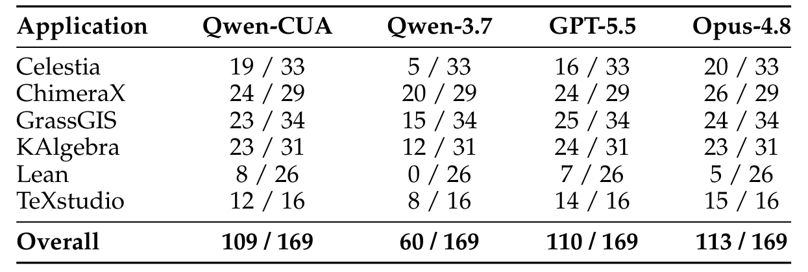

| 应用 | Qwen-CUA | Qwen-3.7 | GPT-5.5 | Opus-4.8 |
|---|---:|---:|---:|---:|
| Celestia | 19 / 33 | 5 / 33 | 16 / 33 | 20 / 33 |
| ChimeraX | 24 / 29 | 20 / 29 | 24 / 29 | 26 / 29 |
| GrassGIS | 23 / 34 | 15 / 34 | 25 / 34 | 24 / 34 |
| KAlgebra | 23 / 31 | 12 / 31 | 24 / 31 | 23 / 31 |
| Lean | 8 / 26 | 0 / 26 | 7 / 26 | 5 / 26 |
| TeXstudio | 12 / 16 | 8 / 16 | 14 / 16 | 15 / 16 |
| **总体** | **109 / 169** | **60 / 169** | **110 / 169** | **113 / 169** |

*表 12（原文表注翻译）：ScienceBoard 按应用划分的结果，按“成功任务数／总任务数”报告。*

### D.7 RedTeamCUA

RedTeamCUA（Liao 等，2025）在 ownCloud、Rocket.Chat 和 Reddit 上的 Web—OS 混合工作流中，评估对间接提示注入的鲁棒性，并同时报告良性任务成功率和攻击成功率（ASR）。

#### 表 13：RedTeamCUA 分平台任务成功率／ASR

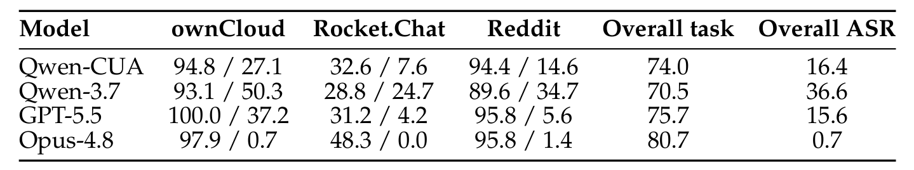

| 模型 | ownCloud | Rocket.Chat | Reddit | 总体任务成功率 | 总体 ASR |
|---|---:|---:|---:|---:|---:|
| Qwen-CUA | 94.8 / 27.1 | 32.6 / 7.6 | 94.4 / 14.6 | 74.0 | 16.4 |
| Qwen-3.7 | 93.1 / 50.3 | 28.8 / 24.7 | 89.6 / 34.7 | 70.5 | 36.6 |
| GPT-5.5 | 100.0 / 37.2 | 31.2 / 4.2 | 95.8 / 5.6 | 75.7 | 15.6 |
| Opus-4.8 | 97.9 / 0.7 | 48.3 / 0.0 | 95.8 / 1.4 | 80.7 | 0.7 |

*表 13（原文表注翻译）：RedTeamCUA 分平台的任务成功率／攻击成功率（%）。*

## 附录 E：Qwen for Chrome 示例

图 10 跟踪内部 Chrome 扩展中的一条真实世界轨迹。给定自然语言请求后，已部署智能体规划并执行多步浏览器交互，同时在会提交修改或产生费用的决策点把控制权留给用户。各画面遵循演示视频的剪辑转场，保留原始浏览器界面和可见智能体轨迹。

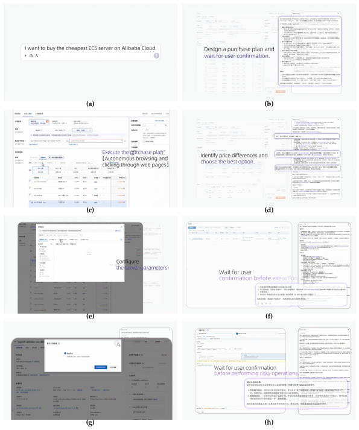

*图 10（原文图注翻译）：一条有代表性的 Qwen for Chrome 轨迹。（a）用户请求购买最便宜的 ECS 服务器。（b）智能体提出购买计划并等待确认。（c–d）它自主浏览网站、比较价格并选择一个选项。（e）它配置服务器。（f）应用配置前，它请求确认。（g）规格更改成功完成。（h）在执行有风险的磁盘扩容操作前，智能体再次暂停。*

## 附录 F：更广泛的计算机使用相关工作

**视觉定位与原生智能体模型。** 从结构化 Web 智能体向通用计算机使用智能体的转变，要求模型理解密集、高分辨率界面，并把语言直接落到屏幕坐标。SeeClick、UGround 和 OS-ATLAS 在 Web、桌面及移动界面上研究这一定位问题（Cheng 等，2024；Gou 等，2024；Z. Wu 等，2024）；CogAgent 和 Ferret-UI 则开发针对 GUI 与屏幕理解的专用视觉语言模型（Hong 等，2023；You 等，2024）。更近期的原生智能体把定位与规划、推理和动作预测结合起来，代表系统包括 AutoGLM、Aguvis、UI-TARS、UI-TARS-2 和 OpenCUA（Liu 等，2024；Xu 等，2024；Qin 等，2025；H. Wang 等，2025a；X. Wang 等，2025b；Bai 等，2025）。Qwen-CUA 属于后一类，采用仅截图观察接口和原生键盘—鼠标控制。

**训练数据、任务与环境。** 计算机使用监督来自人类示范、教程引导重放、无标注交互视频和合成定位样本（X. Wang 等，2025b；Xu 等，2025；Lu 等，2025；Xie 等，2025）。另一条互补路线为在线学习构建可执行环境和可验证任务。ZeroGUI 及相关基于探索的系统用学习得到的评估器扩大任务覆盖，而 GUI-GENESIS、InfiniteWeb 和 AutoWebWorld 合成具有机器可检查结果的可控 Web 环境（C. Yang 等，2025a；Cao 等，2026；Zhang 等，2026；Y. Wu 等，2026b）。Gym-Anything 扩大应用覆盖；CUA-Gym 联合扩展可复用环境、任务状态和可执行奖励函数；SCALECUA 进一步把可验证任务合成与面向能力的采样结合用于在线训练（Aggarwal、Neubig 与 Welleck，2026；B. Wang、Lu 等，2026a；Lv 等，2026）。

**轨迹采样基础设施。** 大规模智能体学习还要求环境编排与 GPU 侧优化解耦。NanoRollout 通过共享轨迹采样服务暴露异质智能体脚手架和环境后端，供评估、轨迹蒸馏和强化学习客户端使用（J. Wang 等，2026c）。这一系统抽象允许轨迹采样工作节点和训练器独立扩展，从而补充云规模环境池。

**强化学习与迭代改进。** GUI-R1 探索面向落地 GUI 动作的规则奖励强化学习，UI-TARS-2 则研究交互 GUI 环境中的多轮强化学习（Xia 与 Luo，2025；H. Wang 等，2025a）。ZeroGUI 强调奖励质量对稳定在线优化的重要性（C. Yang 等，2025a）。EvoCUA-1.5 和 SCALECUA 通过多轮在线优化、自适应数据选择及异步或分段轨迹处理扩展这条路线（Huang 等，2026；Lv 等，2026）。SEAgent 和 EvoCUA 更强调自进化：改进后的策略返回环境、生成新经验，再从选定轨迹中学习（Z. Sun 等，2025b；Xue 等，2026）。这些方向促成了 Qwen-CUA 将基于状态的奖励、长时程轨迹优化，以及监督数据和 RL 任务的迭代刷新结合起来。

**计算机使用评估。** Web 基准从 Mind2Web 的离线示范，发展到 WebArena、VisualWebArena 和 WorkArena 等交互式、可复现环境（Deng 等，2023；Zhou 等，2023；Koh 等，2024；Drouin 等，2024）。桌面评估则通过 OmniACT、OSWorld、OSWorld-Verified、Windows Agent Arena 和 Computer Agent Arena 不断扩展（Kapoor 等，2024；Xie 等，2024；Bonatti 等，2024；XLANG Lab，2025；B. Wang、X. Wang 等，2026b）。后续基准进一步强调业务流程、长时间重复执行、个性化状态、专业工作流，以及长时程跨应用工作（Wornow 等，2024；J. Wu 等，2026a；Jang 等，2026；Q. Sun 等，2025a；Yuan 等，2026）。本文评估通过广泛能力、效率、部署和混合工具分析补充这些视角。

**安全与鲁棒性。** 计算机使用智能体会作用于具有实际后果的状态，因此评估必须把任务能力与安全执行分开。RedTeamCUA 研究 Web—OS 混合环境中的间接提示注入；OS-Harm 覆盖蓄意滥用、提示注入和模型不当行为；RiOSWorld 衡量多模态计算机使用中的操作风险（Liao 等，2025；Kuntz 等，2025；J. Yang 等，2025b）。这些基准支持在具有实际后果的动作前显式确认，并把任务成功率与攻击成功率或其他风险指标共同报告。

## 参考文献

> 按全文翻译规范，以下 55 条书目完整保留原文语言、作者顺序、年份、题名与链接。

1. Aggarwal, Pranjal, Graham Neubig, and Sean Welleck. 2026. “Gym-Anything: Turn Any Software into an Agent Environment.” <https://arxiv.org/abs/2604.06126>.
2. Alibaba Cloud. 2026. “What Is Elastic Compute Service?” *Alibaba Cloud Documentation*. <https://www.alibabacloud.com/help/en/ecs/user-guide/what-is-ecs>. Accessed: 2026-07-30.
3. Anthropic. 2026a. “Claude Code: Overview.” *Claude Code Documentation*. <https://code.claude.com/docs/en/overview>. Accessed: 2026-07-31.
4. Anthropic. 2026b. “Best Practices for Computer and Browser Use with Claude.” *Claude Blog*. <https://claude.com/blog/best-practices-for-computer-and-browser-use-with-claude>. Accessed: 2026-08-01.
5. Anthropic. 2026c. “Computer Use Tool.” *Claude Platform Documentation*. <https://platform.claude.com/docs/en/agents-and-tools/tool-use/computer-use-tool>. Accessed: 2026-07-29.
6. Bai, Shuai, Yuxuan Cai, Ruizhe Chen, Keqin Chen, Xionghui Chen, Zesen Cheng, Lianghao Deng, Wei Ding, Chang Gao, and others. 2025. “Qwen3-VL Technical Report.” <https://arxiv.org/abs/2511.21631>.
7. Bonatti, Rogerio, Dan Zhao, Francesco Bonacci, Dillon Dupont, Sara Abdali, Yinheng Li, and others. 2024. “Windows Agent Arena: Evaluating Multi-Modal OS Agents at Scale.” <https://arxiv.org/abs/2409.08264>.
8. Cao, Yuan, Dezhi Ran, Mengzhou Wu, Yuzhe Guo, Xin Chen, Ang Li, and others. 2026. “GUI-GENESIS: Automated Synthesis of Efficient Environments with Verifiable Rewards for GUI Agent Post-Training.” <https://arxiv.org/abs/2602.14093>.
9. Cheng, Kanzhi, Qiushi Sun, Yougang Chu, Fangzhi Xu, Yantao Li, Jianbing Zhang, and Zhiyong Wu. 2024. “SeeClick: Harnessing GUI Grounding for Advanced Visual GUI Agents.” <https://arxiv.org/abs/2401.10935>.
10. Deng, Xiang, Yu Gu, Boyuan Zheng, Shijie Chen, Samuel Stevens, Boshi Wang, Huan Sun, and Yu Su. 2023. “Mind2Web: Towards a Generalist Agent for the Web.” <https://arxiv.org/abs/2306.06070>.
11. Drouin, Alexandre, Maxime Gasse, Massimo Caccia, Issam H. Laradji, and others. 2024. “WorkArena: How Capable Are Web Agents at Solving Common Knowledge Work Tasks?” <https://arxiv.org/abs/2403.07718>.
12. Fan, Sicheng, Qingyun Shi, Shengze Xu, Shengbo Cai, Tieyong Zeng, Li Ling, Yanyi Shang, and Dehan Kong. 2026a. “WebFactory: Automated Compression of Foundational Language Intelligence into Grounded Web Agents.” <https://arxiv.org/abs/2603.05044>.
13. Fan, Sicheng, Rui Wan, Yifei Leng, Gaoning Liang, Li Ling, Yanyi Shang, and Dehan Kong. 2026b. “WebChain: A Large-Scale Human-Annotated Dataset of Real-World Web Interaction Traces.” <https://arxiv.org/abs/2603.05295>.
14. Fu, Yikun, Bowen Fu, Zhenyu Wu, Shuang Cheng, Xiaowei Sun, Bowen Yang, Zehao Li, et al. 2026. “MacAgentBench: Benchmarking AI Agents on Real-World macOS Desktop.” <https://arxiv.org/abs/2606.22557>.
15. Gao, Chang, Chujie Zheng, Xiong-Hui Chen, Kai Dang, Shixuan Liu, Bowen Yu, An Yang, Shuai Bai, Jingren Zhou, and Junyang Lin. 2025. “Soft Adaptive Policy Optimization.” <https://arxiv.org/abs/2511.20347>.
16. Gou, Boyu, Ruohan Wang, Boyuan Zheng, Yanan Xie, Cheng Chang, Yiheng Shu, Huan Sun, and Yu Su. 2024. “Navigating the Digital World as Humans Do: Universal Visual Grounding for GUI Agents.” <https://arxiv.org/abs/2410.05243>.
17. Hong, Wenyi, Weihan Wang, Qingsong Lv, and others. 2023. “CogAgent: A Visual Language Model for GUI Agents.” <https://arxiv.org/abs/2312.08914>.
18. Huang, Mianqiu, Taofeng Xue, Chong Peng, Jinrui Ding, Sicheng Fan, Jiale Hong, Yufei Gao, et al. 2026. “EvoCUA-1.5: Online Reinforcement Learning for Multi-Turn Computer-Use Agents.” <https://arxiv.org/abs/2607.09773>.
19. Jang, Lawrence Keunho, Andrew Keunwoo Jang, Jing Yu Koh, and Ruslan Salakhutdinov. 2026. “MyPCBench: A Benchmark for Personally Intelligent Computer-Use Agents.” <https://arxiv.org/abs/2606.16748>.
20. Kapoor, Raghav, Yash Parag Butala, Melisa Russak, Jing Yu Koh, Kiran Kamble, Waseem Alshikh, and Ruslan Salakhutdinov. 2024. “OmniACT: A Dataset and Benchmark for Enabling Multimodal Generalist Autonomous Agents for Desktop and Web.” In *European Conference on Computer Vision*. <https://arxiv.org/abs/2402.17553>.
21. Koh, Jing Yu, Robert Lo, Lawrence Jang, Vikram Duvvur, Ming Chong Lim, Po-Yu Huang, Graham Neubig, Shuyan Zhou, Ruslan Salakhutdinov, and Daniel Fried. 2024. “VisualWebArena: Evaluating Multimodal Agents on Realistic Visual Web Tasks.” <https://arxiv.org/abs/2401.13649>.
22. Kuntz, Thomas, Agatha Duzan, Hao Zhao, Francesco Croce, Zico Kolter, Nicolas Flammarion, and Maksym Andriushchenko. 2025. “OS-Harm: A Benchmark for Measuring Safety of Computer Use Agents.” <https://arxiv.org/abs/2506.14866>.
23. Liao, Zeyi, Jaylen Jones, Linxi Jiang, Yuting Ning, Eric Fosler-Lussier, Yu Su, Zhiqiang Lin, and Huan Sun. 2025. “RedTeamCUA: Realistic Adversarial Testing of Computer-Use Agents in Hybrid Web-OS Environments.” <https://arxiv.org/abs/2505.21936>.
24. Liu, Xiao, Bo Qin, Dongzhu Liang, and others. 2024. “AutoGLM: Autonomous Foundation Agents for GUIs.” <https://arxiv.org/abs/2411.00820>.
25. Lu, Dunjie, Yiheng Xu, Junli Wang, Haoyuan Wu, Xinyuan Wang, Zekun Wang, and others. 2025. “VideoAgentTrek: Computer Use Pretraining from Unlabeled Videos.” <https://arxiv.org/abs/2510.19488>.
26. Lv, Bowen, Xiao Liu, Yanyu Ren, Hanyu Lai, Bohao Jing, Hanchen Zhang, Yanxiao Zhao, Shuntian Yao, Jie Tang, and Yuxiao Dong. 2026. “SCALECUA: Scaling Computer Use Agents with Verifiable Task Synthesis and Efficient Online RL.” <https://arxiv.org/abs/2607.11185>.
27. OpenAI. 2026a. “Codex.” *OpenAI Developer Documentation*. <https://developers.openai.com/codex/>. Accessed: 2026-07-31.
28. OpenAI. 2026b. “Computer Use.” *OpenAI API Documentation*. <https://developers.openai.com/api/docs/guides/tools-computer-use>. Accessed: 2026-07-29.
29. Qin, Yujia, Yining Ye, Junjie Fang, and others. 2025. “UI-TARS: Pioneering Automated GUI Interaction with Native Agents.” <https://arxiv.org/abs/2501.12326>.
30. SGLang Project. 2024. “SGLang: Efficient Execution of Structured Language Model Programs.” <https://github.com/sgl-project/sglang>.
31. Sun, Qiushi, Zhoumianze Liu, Chang Ma, and others. 2025a. “ScienceBoard: Evaluating Multimodal Autonomous Agents in Realistic Scientific Workflows.” <https://arxiv.org/abs/2505.19897>.
32. Sun, Zeyi, Ziyu Liu, Yuhang Zang, Yuhang Cao, Xiaoyi Dong, Tong Wu, Dahua Lin, and Jiaqi Wang. 2025b. “SEAgent: Self-Evolving Computer Use Agent with Autonomous Learning from Experience.” <https://arxiv.org/abs/2508.04700>.
33. verl Project. 2024. “verl: Volcano Engine Reinforcement Learning for LLMs.” <https://github.com/verl-project/verl>.
34. Wang, Bowen, Dunjie Lu, Junli Wang, Tianyi Bai, Shixuan Liu, Zhipeng Zhang, Haiquan Wang, et al. 2026a. “CUA-Gym: Scaling Verifiable Training Environments and Tasks for Computer-Use Agents.” <https://arxiv.org/abs/2605.25624>.
35. Wang, Bowen, Xinyuan Wang, Jiaqi Deng, Tianbao Xie, Ryan Li, Yanzhe Zhang, and others. 2026b. “Computer Agent Arena: Toward Human-Centric Evaluation and Analysis of Computer-Use Agents.” In *International Conference on Learning Representations*. <https://openreview.net/forum?id=3x4SDbXbgl>.
36. Wang, Haoming, Haoyang Zou, Huatong Song, and others. 2025a. “UI-TARS-2 Technical Report: Advancing GUI Agent with Multi-Turn Reinforcement Learning.” <https://arxiv.org/abs/2509.02544>.
37. Wang, Junli, Zhoujun Cheng, Yuxuan Zhang, Shibo Hao, Yao Tang, Zhiting Hu, Prithviraj Ammanabrolu, and Hao Zhang. 2026c. “NanoRollout: A Lightweight Infrastructure for Digital Agent Rollout at Scale.” GitHub repository. <https://github.com/cocoa-org/NanoRollout>. Accessed: 2026-08-01.
38. Wang, Xinyuan, Bowen Wang, Dunjie Lu, Junlin Yang, Tianbao Xie, Junli Wang, Jiaqi Deng, Xiaole Guo, Yiheng Xu, and others. 2025b. “OpenCUA: Open Foundations for Computer-Use Agents.” <https://arxiv.org/abs/2508.09123>.
39. Wornow, Michael, Avanika Narayan, Bidisha Viggiano, Isha S. Khare, Tanishq Verma, and others. 2024. “WONDERBREAD: A Benchmark for Evaluating Multimodal Foundation Models on Business Process Management Tasks.” <https://arxiv.org/abs/2406.13264>.
40. Wu, Jimmy, Diego Barretto, Yuntao Chen, Nicholas Gyde, Yiren Jian, Yutong He, and Vibhav Vineet. 2026a. “OS-Marathon: Benchmarking Computer-Use Agents on Long-Horizon Repetitive Tasks.” <https://arxiv.org/abs/2601.20650>.
41. Wu, Yifan, Yiran Peng, Yiyu Chen, Jianhao Ruan, Zijie Zhuang, Cheng Yang, and others. 2026b. “AutoWebWorld: Synthesizing Infinite Verifiable Web Environments via Finite State Machines.” <https://arxiv.org/abs/2602.14296>.
42. Wu, Zhiyong, Zhenyu Wu, Fangzhi Xu, Yian Wang, Qiushi Sun, Chengyou Jia, Kanzhi Cheng, et al. 2024. “OS-ATLAS: A Foundation Action Model for Generalist GUI Agents.” <https://arxiv.org/abs/2410.23218>.
43. Xia, Xiaobo, and Run Luo. 2025. “GUI-R1: A Generalist R1-Style Vision-Language Action Model for GUI Agents.” <https://arxiv.org/abs/2504.10458>.
44. Xie, Tianbao, Danyang Zhang, Jixuan Chen, Xiaochuan Li, Siheng Zhao, Ruisheng Cao, Toh Jing Hua, et al. 2024. “OSWorld: Benchmarking Multimodal Agents for Open-Ended Tasks in Real Computer Environments.” In *Advances in Neural Information Processing Systems*. <https://arxiv.org/abs/2404.07972>.
45. Xie, Tianbao, Jiaqi Deng, Xiaochuan Li, Junlin Yang, Haoyuan Wu, Jixuan Chen, and others. 2025. “Scaling Computer-Use Grounding via User Interface Decomposition and Synthesis.” <https://arxiv.org/abs/2505.13227>.
46. XLANG Lab. 2025. “Introducing OSWorld-Verified.” *XLANG Lab Blog*. <https://xlang.ai/blog/osworld-verified>. Accessed: 2026-08-01.
47. Xu, Yiheng, Zekun Wang, Junli Wang, Dunjie Lu, Tianbao Xie, Amrita Saha, Doyen Sahoo, Tao Yu, and Caiming Xiong. 2024. “Aguvis: Unified Pure Vision Agents for Autonomous GUI Interaction.” <https://arxiv.org/abs/2412.04454>.
48. Xu, Yiheng, Dunjie Lu, Zhennan Shen, Junli Wang, Zekun Wang, Yuchen Mao, Caiming Xiong, and Tao Yu. 2025. “AgentTrek: Agent Trajectory Synthesis via Guiding Replay with Web Tutorials.” <https://arxiv.org/abs/2412.09605>.
49. Xue, Taofeng, Chong Peng, Mianqiu Huang, Linsen Guo, Tiancheng Han, Haozhe Wang, Jianing Wang, et al. 2026. “EvoCUA: Evolving Computer Use Agents via Learning from Scalable Synthetic Experience.” <https://arxiv.org/abs/2601.15876>.
50. Yang, Chenyu, Shiqian Su, Shi Liu, Xuan Dong, Yue Yu, Weijie Su, and others. 2025a. “ZeroGUI: Automating Online GUI Learning at Zero Human Cost.” <https://arxiv.org/abs/2505.23762>.
51. Yang, Junyang, Shuo Shao, Di Liu, and Jing Shao. 2025b. “RiOSWorld: Benchmarking the Risk of Multimodal Computer-Use Agents.” <https://arxiv.org/abs/2506.00618>.
52. You, Keen, Haotian Zhang, Eldon Schoop, Floris Weers, Amanda Swearngin, Jeffrey Nichols, Yinfei Yang, and Zhe Gan. 2024. “Ferret-UI: Grounded Mobile UI Understanding with Multimodal LLMs.” <https://arxiv.org/abs/2404.05719>.
53. Yuan, Mengqi, Zilong Zhou, Xinzhuang Xiong, and others. 2026. “OSWorld 2.0: Benchmarking Computer Use Agents on Long-Horizon Real-World Tasks.” <https://arxiv.org/abs/2606.29537>.
54. Zhang, Ziyun, Zezhou Wang, Xiaoyi Zhang, Zongyu Guo, Jiahao Li, Bin Li, and Yan Lu. 2026. “InfiniteWeb: Scalable Web Environment Synthesis for GUI Agent Training.” <https://arxiv.org/abs/2601.04126>.
55. Zhou, Shuyan, Frank F. Xu, Hao Zhu, Xuhui Zhou, Robert Lo, Abishek Sridhar, Xianyi Cheng, et al. 2023. “WebArena: A Realistic Web Environment for Building Autonomous Agents.” <https://arxiv.org/abs/2307.13854>.
