# Qwen-UI-Agent 技术报告：迈向下一代以真实世界为中心的基础 GUI 智能体

> 原题：*Qwen-UI-Agent Technical Report: Toward Next-Generation Real-World Centric Foundation GUI Agents*  
> 团队：MAI-UI Team  
> 机构：阿里巴巴集团 Alibaba Token Hub  
> 日期：2026-07-31（arXiv v1：2026-07-30）  
> 项目主页：<https://tongyi-mai.github.io/Qwen-UI-Agent/>  
> 译注：本文件依照 arXiv LaTeX 源文件的章节顺序完整翻译；模型名、基准名、动作名和引文信息保留英文。参考文献条目按原文保留，以避免书目信息失真。

作者脚注：Qwen-UI-Agent 是我们此前工作 MAI-UI（Zhou et al., 2025a）的延续。完整作者名单见第 8 节“贡献”。

## 摘要

GUI 智能体有潜力成为现有数字设备上的通用执行器。为了推动它们走向真实世界应用，我们设想这样的智能体：能够在真实设备上可靠运行，跨平台执行工作流，把 GUI 交互与 CLI 执行结合起来，完成长时程任务，主动发起有用的服务，并且仅需极少人力便能自主提升能力。以这一愿景为指引，我们提出 **Qwen-UI-Agent**：一个以真实世界为中心、覆盖移动端、计算机使用、网页和 DeepSearch 环境的基础 GUI 智能体。Qwen-UI-Agent 将多种沙箱环境与大规模真实设备移动端运行时结合起来。它的统一动作空间可交错使用 GUI 操作与 CLI 执行，并在一次模型决策中生成一批动作。一个 AutoResearch 风格的数据飞轮利用智能体构建任务与环境、诊断失败，并规划后续迭代。在线强化学习支持在超过 100 轮的轨迹上训练，超过 10,000 个并发环境则用于加速 rollout。一个轻量级 harness（编排/运行支撑层）支持主动发起服务，以及在移动端与计算机之间执行有状态工作流。

在广泛的评测中，Qwen-UI-Agent 在移动端使用基准上取得最先进性能，同时在计算机与浏览器使用任务上，相对于 Opus 4.8、Gemini 3.1 Pro、GPT-5.6 Sol 等前沿模型表现出有竞争力的性能。在移动端使用方面，它在 MobileWorld、MobileWorld-Real 和 AndroidDaily 上分别达到 **82.1%**、**92.2%** 和 **97.5%**。在计算机使用方面，它在 OSWorld-Verified 上达到 **79.5%**，在 OSWorld-v2 上取得 **40.0%** 的部分进度得分。在浏览器使用和 GUI 定位方面，它在 WebArena 和 ScreenSpot-Pro 上分别达到 **73.6%** 和 **81.5%**。


**图 1：** Qwen-UI-Agent 在多种 GUI 场景中展现领先或有竞争力的性能。

## 目录

1. 引言
2. Qwen-UI-Agent
   1. 系统概览
      1. 任务形式化
      2. 动作空间
      3. 能力版图
   2. 环境基础设施
      1. 扩展沙箱环境
      2. 真实设备移动环境：从模拟沙箱走向真实世界学习
      3. 混合 GUI+CLI 动作空间
      4. 面向异构环境的统一接口
   3. 智能体驱动的数据飞轮
   4. 训练
      1. 监督微调（SFT）
      2. Action RL：纠正反复出现的动作错误
      3. Online RL：学习长时程决策
   5. Harness 层：主动服务与跨平台任务执行
      1. 基于移动通知的主动服务
      2. 跨平台任务执行
3. 实验
   1. 实验设置
   2. MobileWorld-Real：真实世界移动端使用评测基准
   3. 主要结果
      1. 移动端使用评测
      2. 计算机使用评测
      3. 浏览器使用与 DeepSearch 评测
      4. GUI 定位
      5. 通用能力与智能体能力
   4. Harness 支持的工作流
4. GUI 智能体执行行为分析
   1. 模型有限的真实设备经验如何影响其执行行为？
   2. 深入观察 Qwen-UI-Agent 的 GUI—CLI 协同与批量执行
   3. Action RL 后的步骤级行为纠正
   4. Online RL 后的轨迹级行为变化
5. 相关工作
6. 结论
7. 局限与未来方向
8. 贡献
A. 附录
   1. 验证用于真实设备评测的 AutoJudge
   2. AutoJudge 对真实设备 GUI 智能体轨迹的判定
   3. 更多定性示例

## 1 引言

图形用户界面（GUI）是人们访问数字服务和应用程序的主要接口。因此，一个有能力的 GUI 智能体（Zhou et al., 2025a；Wang et al., 2025a；Qin et al., 2025；Xu et al., 2026）有潜力成为现有应用生态中的通用执行器：它能够理解用户意图、感知应用状态、操作界面并完成任务，而不需要每一项服务都开放专用 API。多模态基础模型的近期进展使这一方向日益可行，并推动移动端与桌面 GUI 智能体迅速改进（Cao et al., 2026；Gao et al., 2026；Huang et al., 2026；Shen et al., 2026）。

尽管取得了这些进展，GUI 智能体仍主要针对模拟基准进行优化，基准性能与真实世界效用之间依然存在显著鸿沟。为了弥合这一差距，我们设想下一代 GUI 智能体能够在真实设备上可靠运行，完成长时程任务，使工作流跨越不同平台，主动发起有用服务，把 GUI 交互和 CLI 执行结合起来，并以更少的人力持续演进自身能力。为实现这一愿景，我们归纳出六项关键转变：

**（1）从模拟环境转向真实设备执行。** 很多 GUI 智能体，尤其是移动端智能体，针对模拟基准进行了优化；然而真实移动设备具有复杂得多的应用功能、多样的界面布局、打断、权限以及不断变化的环境。一个在模拟环境中表现良好的模型，往往会在真实设备上失败。

**（2）从孤立领域转向跨领域、跨平台工作流。** 现有智能体通常分别面向移动端、网页或桌面构建，而真实世界任务可能跨越多个领域，并在手机和计算机之间延续。

**（3）从纯 GUI 动作转向混合 GUI+CLI 与批量动作。** GUI 交互能够普遍访问视觉界面；与此同时，基础模型不断增强的编程能力使 CLI 成为处理数据加工、文件操作等结构化任务的自然补充。通过组合这些动作类型并支持批量动作，智能体可以根据任务性质选择更匹配的执行方式，从而提高执行效率并扩大任务覆盖范围。

**（4）从短时程任务转向可靠完成长时程任务。** GUI 智能体的实际价值，会随着它能完成的用户目标复杂度以及它能代用户执行的步骤数量而增长。不过，完成长时程任务要求在整条轨迹中持续规划、跟踪状态、进行中间验证，并从执行错误中恢复，因此长时程可靠性是一项极具挑战的能力。

**（5）从人力密集的训练流水线转向 AutoResearch 风格的流水线。** 当前 GUI 智能体开发仍严重依赖人工构造任务、收集数据、训练模型、运行评测和分析失败。随着智能体能力提高，这一过程应当越来越自动化。

**（6）从被动响应式执行转向主动发起服务。** 大多数智能体都等待用户给出明确指令，尽管许多有用任务会直接由手机或其他设备上的数字信号触发。一个能识别这种可行动时机并提出合适下一步建议的智能体，可以带来根本不同的用户体验。

在本报告中，我们介绍 Qwen-UI-Agent：一个围绕这些转变开发、以真实世界为中心的基础 GUI 智能体，代表了我们迈向具有真实世界效用的下一代 GUI 智能体的一步。具体而言，Qwen-UI-Agent 具备以下核心特性：

- **真实设备移动 GUI 基础。** 我们发现，模拟到真实的鸿沟在移动环境中尤其严重。为此，我们构建了一个包含 100 多台物理设备、支持 150 多个应用的真实设备移动环境，并将其用于真实任务设计、轨迹收集、在线强化学习和真实设备评测。为了提高实际可用性，我们还对高风险动作支持用户接管，并将覆盖面扩展至高频工作流和不常用的应用功能。这些工作共同使 Qwen-UI-Agent 在真实手机上显著超越现有模型。

- **多领域能力与跨领域工作流。** Qwen-UI-Agent 支持在移动端、网页、计算机使用和 DeepSearch 环境中执行任务。我们的 harness 层并不把这些能力视为孤立模块，而是把它们编排在一个统一工作流中；执行在设备和环境间无缝转移时，仍能保留上下文与任务状态。例如，GUI 工作流可以调用 DeepSearch，高效检索和核验外部信息，避免耗时的纯 GUI 网页导航，然后无缝恢复交互。这样，多领域覆盖就转化成了异构数字环境间的一体化任务执行。

- **混合 GUI+CLI 与批量动作空间。** 我们为 Qwen-UI-Agent 配备统一动作空间，支持 GUI 操作、基于 bash 的 CLI 命令和批量动作。模型可在同一条轨迹中选择并组合这些动作，在各自最适合的场景使用 GUI 交互或 CLI 执行，并把兼容动作组成批次以减少不必要步骤。在计算机使用任务中，CLI 命令和 GUI 点击成为最主要的两类动作，超过 40% 的动作输出采用批量形式，从而显著缩短执行轨迹。

- **面向长时程任务的可扩展 Online RL。** 混合 GUI+CLI 与批量动作提高了局部执行效率，但完成长时程任务还要求在整条轨迹上可靠规划、跟踪状态并做出中间决策。因此，我们把验证器引导的 Online RL 扩展到超过 100 个交互步骤的轨迹。我们还支持约 10,000 个模拟环境并发运行以加速 rollout；一个模型自适应课程会优先选择成功率居中的任务，并用更难任务替换已经掌握的任务。

- **AutoResearch 风格的能力获取。** 我们构建了一个由智能体驱动的迭代闭环：智能体生成并评估数据飞轮的候选任务，处理 rollout 轨迹，分析失败，并提出下一轮计划。系统自动化了能力开发过程中的大部分环节，人类主要负责监督和有针对性的修订，而不再需要手工推动每一个阶段。这种方法减少了人力，并加快新 GUI 智能体能力的获取与精炼。

- **主动移动服务。** 设想用户手机收到航班取消通知。智能体无需等待用户注意到通知并下达指令，就可以识别受影响的行程，搜集替代旅行方案，与用户日程进行核对，并提交一个方案供用户确认。为支持这种体验，我们构建了基于移动通知的主动服务 harness。除发起任务外，该 harness 还会形成对真实世界情境的连贯理解，生成个性化任务，执行已获批准的动作，并从用户回应和长期交互历史中持续演进。

实证结果表明，Qwen-UI-Agent 在真实设备和基准型移动端使用、计算机使用、浏览器使用、DeepSearch 与 GUI 定位等广泛评测设置中取得最先进性能。在这些评测中，Qwen-UI-Agent 整体上优于 Opus 4.8（Anthropic, 2026）、GPT-5.6 Sol（OpenAI, 2026b）、Gemini 3.5 Flash（Google, 2026b）、Seed 2.1 Pro（ByteDance Seed, 2026b）等领先基础模型以及专用 GUI 智能体。主要结果如下：

- **移动端使用。** 在我们提出的真实设备基准 MobileWorld-Real（100 多个应用、400 多项任务）上，Qwen-UI-Agent 的成功率为 **92.2%**，分别比前沿闭源模型 Gemini 3.1 Pro、Claude Opus 4.8、GPT-5.6 Sol 和 Seed 2.1 Pro 高 **6.0、7.5、6.8 和 3.5** 个百分点。在另一项真实设备基准 AndroidDaily 上，它进一步取得接近满分的 **97.5%**。在 MobileWorld 上，它达到 **82.1%**，分别比 Opus 4.8、GPT-5.6 Sol 和 Seed 2.1 Pro 高 14.6、12.0 和 8.9 个百分点。

- **计算机使用。** 在 OSWorld-Verified 上，Qwen-UI-Agent 达到 **79.5%**，总体排名第二，并超过 GPT-5.5、Gemini 3.1 Pro 和 Seed 2.1 Pro。在更具挑战的 OSWorld-v2 上，它取得第二高的二元成功率 **13.9%** 和第三高的部分进度得分 **40.0%**。其部分进度得分分别比 MiniMax M3 和 Qwen 3.7 Plus 高 **17.7** 和 **18.5** 个百分点，同时每个任务所需步骤分别少 **58.4%** 和 **21.7%**。

- **浏览器使用与 DeepSearch。** 在 WebArena 上，Qwen-UI-Agent 达到 **73.6%**，分别比 Claude Opus 4.8、GPT-5.5 和 Gemini 3.1 Pro 高 1.7、4.1 和 8.3 个百分点。在 DeepSearch 上，它在 BrowseComp 和 BrowseComp-ZH 上分别达到 **64.1%** 与 **75.0%**，超过 Qwen3.5-397B-A17B 和 UI-TARS-2。

- **GUI 定位。** 在允许放大的 ScreenSpot-Pro 设置下，Qwen-UI-Agent 达到 **81.5%**，超过 Seed 2.1 Pro、GUI-Owl-1.5 和 UI-Venus-1.5。它还在 UI-Vision（**70.0%**）、OSWorld-G-Refined（**78.5%**）、MMBench-GUI L2（**92.6%**）和 ScreenSpot-V2（**97.5%**）上取得所有基线模型中的最佳结果。

- **通用能力与智能体能力。** 为保留模型在真实环境中的广泛用途，我们保持了 Qwen-UI-Agent 的通用推理和智能体能力。我们在包含 MMMU-Pro、MMLU-Pro、Terminal-Bench 2.0 和 Claw-Eval 在内的 13 个基准上评测。结果显示，Qwen-UI-Agent 在智能体任务上优于 Qwen 基础模型，同时在通用推理任务上与之相当；它还在这两类能力上都显著优于 GUI 专用模型。

## 2 Qwen-UI-Agent


**图 2：** Qwen-UI-Agent 主动式跨平台任务执行的示例轨迹。左侧概括支撑该轨迹的系统能力，包括跨平台执行、覆盖 GUI/CLI/API 操作的混合动作空间，以及从大规模沙箱到真实设备的多类环境。右侧展示由航班取消通知触发的行程恢复场景：识别受影响的任务与承诺后，智能体通过 API 搜索替代航班；在移动端 GUI 中改签前请求用户批准；再通过桌面 GUI 与 CLI 动作更新受影响会议的日程，并把修订后的材料发送给相关收件人。

本节把 Qwen-UI-Agent 作为一个构建先进基础 GUI 智能体的集成系统来介绍。系统由四部分组成：（1）覆盖沙箱与真实世界的环境基础设施，支持在移动端使用、计算机使用、浏览器使用和 DeepSearch 任务中收集轨迹与训练，并采用统一的 GUI、CLI 和批量动作空间；（2）自动化数据飞轮，减少人工介入，闭合从数据合成到训练、评测、失败分析以及为下一轮有针对性地生成数据的循环；（3）结合监督微调和强化学习的统一训练框架；（4）把训练后的智能体连接到用户上下文，并支持主动服务和跨平台任务执行的 harness 层。图 2 展示了一条示例轨迹。

### 2.1 系统概览

Qwen-UI-Agent 被设计成一个以真实世界为中心的基础 GUI 智能体，可在移动设备、桌面、网页和信息检索系统等多种数字环境中运行。本节首先界定 Qwen-UI-Agent 的任务范围，然后介绍统一的观测空间与动作空间，最后概述这种形式化所支持的能力版图。

#### 2.1.1 任务形式化

Qwen-UI-Agent 面向交互式数字任务执行。我们把任务定义为：

$$
\tau = \left(I, \mathcal{E}_{\tau}\right),
$$

其中，$I$ 是用户指令，$\mathcal{E}_{\tau}$ 是该任务可用的数字环境集合。视具体任务而定，$\mathcal{E}_{\tau}$ 可以包含移动设备、网页浏览器、计算机系统、DeepSearch 系统，或这些环境的组合。这一定义既覆盖在单一环境中完成的任务，也覆盖跨越多个平台的工作流（Xu et al., 2026；Lian et al., 2026）。

在决策步骤 $t$，智能体接收一个多通道观测 $o_t$，它可组合不同形式的环境反馈：

$$
o_t = \left(o_t^{\mathrm{GUI}}, o_t^{\mathrm{CLI}}, o_t^{\mathrm{API}}\right).
$$

这里，$o_t^{\mathrm{GUI}}$ 表示当前截图，$o_t^{\mathrm{CLI}}$ 包含命令执行结果，$o_t^{\mathrm{API}}$ 包含外部服务（例如搜索 API）返回的结构化响应。如果某一通道在当前任务中不可用或不需要，就把对应分量设为空。多通道观测使智能体可以联合推理视觉界面状态和程序化执行反馈（Hu et al., 2026；Li et al., 2026a）。

智能体预测中间推理输出 $r_t$ 和可执行动作输出 $\mathbf{a}_t$：

$$
\left(r_t,\mathbf{a}_t\right)=\pi_{\theta}\left(I,o_t,h_t\right),
$$

其中，

$$
h_t=\left(o_1,r_1,\mathbf{a}_1,\ldots,o_{t-1},r_{t-1},\mathbf{a}_{t-1}\right)
$$

表示此前的交互历史。

值得注意的是，一次模型决策既可产生单个动作，也可产生一个有序动作序列：

$$
\mathbf{a}_t=\left(a_t^{(1)},\ldots,a_t^{(K_t)}\right),\qquad a_t^{(k)}\in\mathcal{A}_t,
$$

其中 $\mathcal{A}_t$ 是当前环境中可用的动作集合。$K_t=1$ 时，模型执行单个动作；$K_t>1$ 时，模型输出批量动作序列。一个批次内的动作会在当前决策步骤中连续执行；当多个操作无需新的环境反馈即可完成时，这种做法可减少不必要的推理和观测步骤。

#### 2.1.2 动作空间

我们围绕三项要求设计 Qwen-UI-Agent 的动作空间：支持跨平台 GUI 交互；把执行能力扩展到 GUI 操作之外；以及在有后果的操作中保留用户控制。GUI 动作空间由移动端、网页和桌面环境所需动作的并集构成，每个环境只开放其原生交互机制支持的子集。作为 GUI 交互的补充，我们加入 `cli_command` 以直接执行 bash 命令，并加入 `api_call` 以结构化参数调用外部服务。我们还加入 `ask_user`，让智能体在缺失必要信息时询问用户，或在处理敏感数据、付款以及其他有后果的操作之前取得明确确认。这些动作共同构成统一接口，支持跨平台 GUI 交互、混合 GUI+CLI 执行，以及真实世界任务中由用户控制的操作。完整动作空间见表 1。

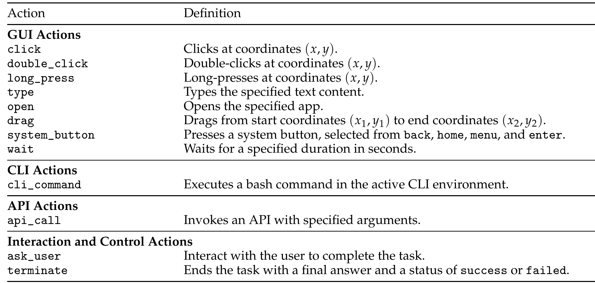

**表 1：Qwen-UI-Agent 的动作空间。**

| 类别 | 动作 | 定义 |
|---|---|---|
| GUI 动作 | `click` | 点击坐标 $(x,y)$。 |
| GUI 动作 | `double_click` | 双击坐标 $(x,y)$。 |
| GUI 动作 | `long_press` | 长按坐标 $(x,y)$。 |
| GUI 动作 | `type` | 输入指定文本内容。 |
| GUI 动作 | `open` | 打开指定应用。 |
| GUI 动作 | `drag` | 从起点坐标 $(x_1,y_1)$ 拖动至终点坐标 $(x_2,y_2)$。 |
| GUI 动作 | `system_button` | 按下系统按键，可选 `back`、`home`、`menu` 或 `enter`。 |
| GUI 动作 | `wait` | 等待指定秒数。 |
| CLI 动作 | `cli_command` | 在当前 CLI 环境中执行 bash 命令。 |
| API 动作 | `api_call` | 以指定参数调用 API。 |
| 交互与控制动作 | `ask_user` | 与用户交互以完成任务。 |
| 交互与控制动作 | `terminate` | 以 `success` 或 `failed` 状态结束任务，并给出最终答复。 |

#### 2.1.3 能力版图

这一统一形式化支持 Qwen-UI-Agent 围绕真实世界任务执行的四类互补能力。

1. **真实设备移动端执行。** 通过构建真实设备移动环境，并将其贯穿模型能力开发和评测，Qwen-UI-Agent 大幅缩小模拟到现实的差距；在真实世界移动端执行上，它同时领先专用 GUI 智能体与前沿闭源模型。
2. **多领域任务执行。** Qwen-UI-Agent 可在移动端、桌面、网页和 DeepSearch 环境中运行，从特定领域策略迈向处理异构数字任务的基础 GUI 智能体。
3. **混合且高效的交互。** 统一动作空间使模型能在同一轨迹中选择并交错使用 GUI 操作与基于 bash 的 CLI 命令，而批量动作则大幅提高执行效率。
4. **Harness 支持的服务。** 轻量 harness 层使核心智能体不再局限于孤立任务执行：它既能主动发起服务，也能让一个工作流跨越移动端与计算机系统。

### 2.2 环境基础设施

环境定义了智能体的能力边界：它决定智能体能感知什么、能采取哪些动作，以及能通过交互获得何种经验。因此，要让 GUI 智能体从以基准为中心的优化走向真实世界效用，不仅需要更强的模型，还需要更广泛、更真实的环境，使智能体能在其中学习、行动和适应。

如图 3 所示，我们的环境基础设施围绕四个核心组成部分组织。第一，**模拟环境与沙箱环境**为数据生成、智能体学习和评测提供可扩展、可控制、可复现的设置。第二，把这些模拟环境扩展到**真实设备**，使智能体能在动态设备状态、系统约束和用户交互等真实部署条件下学习并运行。第三，**混合 GUI 与 CLI 动作空间**允许智能体为每项任务选择最合适的交互方式，从而实现更高效、更自适应的执行。最后，**统一跨平台环境**为移动端使用、计算机使用、浏览器使用和 DeepSearch 提供统一流水线，同时跨平台保留上下文和任务状态。这些组成部分共同使环境成为智能体系统的核心，直接塑造智能体能够学习和完成的任务范围。


**图 3：Qwen-UI-Agent 的环境基础设施。**（a）覆盖移动端使用、计算机使用、浏览器使用和 DeepSearch 的可扩展沙箱环境，为数据合成和训练提供可控性与可重复评测。（b）模拟到真实的桥梁把智能体扩展到具有真实应用、网络和账号状态的真实设备，并支持用户接管登录、付款、权限和确认等步骤。（c）混合 GUI+CLI 动作空间可交错使用图形操作与直接命令执行。（d）统一接口把异构环境中的“思考—动作—观测”循环标准化。

#### 2.2.1 扩展沙箱环境

沙箱环境为训练、评测和消融提供可控且可重置的任务状态。我们的环境套件覆盖移动端使用、计算机使用、浏览器使用和 DeepSearch 任务。每个领域保留其原生应用、环境特定上下文和基于状态的验证机制。该基础设施的一项关键优势是可扩展性：它支持最多 **10,000 个**隔离沙箱环境并行运行，从而支持大规模 rollout 与智能体训练。

- **移动端使用。** 我们基于 MobileWorld 提供的环境构建移动端沙箱。MobileWorld 提供可重置的 Android 系统，包含 20 个应用，并支持 GUI 任务执行、智能体—用户交互和 MCP 工具使用（Kong et al., 2026）。为解决基于 KVM 的模拟器所形成的扩展瓶颈，我们在 redroid（Remote Android Project, 2024）上重建 MobileWorld 环境。redroid 无需 QEMU 或嵌套 KVM，直接把 Android 作为容器运行在宿主机内核上。这种设计使完整的“设备—后端”环境可以在普通容器宿主机上复制。容器化设备实例与自托管应用后端提供可控初始状态和可复现状态转移。基于该基础设施，我们构造多样化的任务相关环境上下文、合成任务并生成基于状态的验证器。由此得到的沙箱为轨迹收集和智能体训练提供了稳定、可扩展的环境。

- **计算机使用。** 我们基于 OSWorld 提供的 Ubuntu 虚拟机环境构建计算机使用沙箱；该环境支持真实桌面应用、操作系统操作和跨应用工作流（Xie et al., 2024）。标准 OSWorld 交互接口以 GUI 为主，我们则扩展了直接执行 bash 的能力，使智能体可以在同一条轨迹中交错使用 GUI 操作和 CLI 命令。对于我们新构建的任务，还为其中一部分任务创建了任务特定的初始环境状态和基于状态的验证器。这些扩展共同提供一个可控、可扩展的环境，以便在纯 GUI 和混合 GUI+CLI 交互条件下收集轨迹与训练智能体。

- **浏览器使用。** 我们的网页环境是使用 FastAPI、Playwright（Microsoft, 2020）和 Chromium 实现的自包含浏览器运行时。每个 episode 都在一个全新的 Playwright `BrowserContext` 中运行，cookie、缓存和本地存储彼此隔离，并从任务特定页面与状态开始。智能体接收渲染后的截图，并通过浏览器原生 GUI 动作交互。基于 JavaScript 的验证器检查 DOM 与持久化应用状态，因此不同动作序列只要到达目标状态也能获得成功判定。

- **DeepSearch。** DeepSearch 环境以结构化信息访问工具补充交互式浏览器控制。Serper（Serper, 2023）提供排序后的搜索结果，Jina Reader（Jina AI, 2024）将选定网页和文档转换成模型可消费的文本。智能体可以迭代地改写查询、选择来源、获取全文并综合多页面证据。因此，该环境针对开放式、多来源的信息检索任务，其中的主要观测不是渲染后的 GUI 状态，而是搜索结果与取回的文档。

#### 2.2.2 真实设备移动环境：从模拟沙箱走向真实世界学习


**图 4：** 具有闭环环境治理的真实设备移动运行时。感知健康状况的调度器把每项任务路由到符合条件的手机、应用/账号和显示画面；不健康目标会保持在黑名单中，直至修复并重新验证。虚拟显示允许一台手机并发运行多个应用。基于证据的复核利用完整轨迹区分任务成功、模型失败与环境失败，确认后的环境问题会反馈给调度器。

**为什么真实设备很重要？** 沙箱环境提供稳定、可重置的任务状态，因而对大规模 rollout 和训练至关重要。然而，沙箱无法完整复现不断演变的应用状态、与权限相关的约束，以及意外弹窗、网络不稳定等执行时打断。在真实设备上，应用界面和内容会随时间变化，权限和 CAPTCHA 会中断执行，网络或设备也可能在任意步骤故障。中国移动应用生态进一步放大了这些挑战：超级应用、密集界面和频繁弹窗使此类执行路径无法在沙箱中复现。为使 Qwen-UI-Agent 在这些条件下可靠运行，我们构建了真实设备移动运行时，并将其用于模型训练和评测。我们还构建 MobileWorld-Real（见 3.2 节），系统评估智能体在真实设备上的表现。

**真实设备移动运行时。** 我们构建的真实设备移动运行时包含 100 多台物理设备和 150 多个应用。在这一规模下，为每项任务分配可靠、可用的执行设备成为核心系统挑战。如图 4 所示，感知健康状况的调度器持续跟踪每台设备、每个应用、账号、网络连接和显示画面的健康与可用性。任务进入队列时，调度器选择符合条件的执行目标，把所需资源租给任务，并在发生故障时把执行重路由到另一目标。尽管真实手机、应用和网络连接固有的不稳定性会导致环境侧故障，这种健康感知编排仍能维持环境的有效运行。

为进一步扩展真实设备环境，我们采用虚拟屏幕机制 scrcpy（Genymobile, 2018），让一台手机在不同显示画面上并发承载多个应用会话。运行时控制器把每个虚拟显示绑定到相应智能体会话，保证观测送达正确的智能体，并使动作在预期画面上执行。这种设计无需按比例增加物理设备，就能提高活跃执行环境的数量。此外，真实任务常涉及需要用户明确批准的敏感操作，或需要用户补充缺失信息。因此，我们引入专门的 User Agent：它可以提供缺失信息，为涉及敏感数据或付款的操作取得明确确认，并在 CAPTCHA 等要求人类直接介入的动作上把控制权交给用户。所需输入或操作完成后，任务从更新后的环境状态继续。

真实设备运行时还必须区分模型失败与执行环境本身的失败。即使模型决策有效，应用限制、服务不可用、设备不稳定或网络错误也可能中断轨迹。调度器维护动态不健康设备黑名单，把这些设备排除在路由之外，只有人工检查后才恢复。我们使用基于 VLM 的评判器检查完整轨迹，区分任务成功、模型失败与环境失败。经确认的环境失败会更新调度器和维护队列，经验证的轨迹则保留用于训练。

#### 2.2.3 混合 GUI+CLI 动作空间

真实设备环境扩大了智能体可能遇到的状态范围，但真实世界效用同样取决于智能体能否高效地对这些状态采取行动。GUI 交互可普遍访问面向用户的应用和视觉上下文，但纯 GUI 执行可能把结构化操作变成漫长的定位、点击和输入序列。CLI 可直接以程序方式访问文件、代码、系统设置和批处理操作，但当任务依赖视觉理解、应用特定界面或没有可编程访问方式的服务时，CLI 并不合适。因此，GUI 与 CLI 提供互补的环境访问形式：GUI 带来广泛的应用覆盖和基于视觉的交互，而 CLI 能高效操作程序化状态。

为此，我们为 Qwen-UI-Agent 配备 2.1.2 节定义的统一 GUI+CLI 动作空间，环境则通过单一执行接口开放这两种访问形式。在计算机使用环境中，每个动作都被分发到虚拟机内部的轻量执行服务：GUI 动作被转换成原生输入事件；`cli_command` 则直接在非交互 shell 中运行命令，不需要先在视觉上找到并操作终端应用。执行产生的 stdout、stderr 和退出状态，与动作后的截图一起作为结构化观测返回，使模型可依据程序化状态和视觉状态共同决定下一步。

可靠执行 CLI 还需要环境侧进行额外处理，而不只是启动 shell。命令执行受超时限制，但会为安装依赖等慢操作提供相应预算；非零退出、超时等失败以错误观测形式返回，而不直接终止 episode，从而让模型可在同一轨迹中诊断并恢复。在批量动作中，GUI 和 CLI 子动作按顺序执行，CLI 输出聚合到一个观测中。已执行命令也会写入 shell 历史，使检查终端状态的验证器同样能够认可基于 CLI 的解决方案。

#### 2.2.4 面向异构环境的统一接口

移动端使用、计算机使用、浏览器使用和 DeepSearch 环境具有不同的资源模型、动作空间、观测格式和验证程序。因此，我们引入统一环境接口：它标准化环境生命周期以及面向智能体的输入输出，同时把执行、重置和验证委托给环境特定适配器。这样，同一个智能体与训练流水线便可跨异构环境运行，而无需强制所有环境采用相同的运行时语义。

接口开放一个通用异步生命周期，包括 `acquire`、`reset`、`step`、`evaluate`、`tear_down` 和 `release`。每个已取得的环境都表现为租赁会话，绑定到某个后端，并在必要时绑定显示标识符，使截图、动作与评测持续路由到同一隔离上下文。后端适配器实现资源初始化、观测捕获、动作执行和评测；任务适配器保留各平台特定的重置与验证逻辑。所有环境均返回包含观测、终止信号和奖励信息的通用转移格式。

策略与环境分别声明自己的原生动作空间。两者不一致时，系统通过规范化的中间表示转换所支持的 GUI 操作，并依据目标平台归一化坐标。2.1.2 节定义的混合 GUI、CLI 和 API 动作仍可通过原生适配器调用，其视觉结果或结构化结果通过同一观测流返回。这一设计在保留各平台原生交互语义的同时，提供共享的 rollout、数据收集和评测流水线。

### 2.3 智能体驱动的数据飞轮

持续改进 GUI 智能体需要一个迭代式闭环过程，覆盖任务设计、环境构建、验证器开发、数据整理、模型训练、评测和错误分析。当这些阶段都由人推动时，随着覆盖面扩展到更多应用、平台和能力维度，迭代会变慢且难以扩展。为此，我们引入 AutoResearch 风格、由智能体驱动的数据飞轮，把人的参与方式从亲自执行每一阶段转变为高层监督和有针对性的介入。

**总体流程。** 如图 5 所示，我们把智能体驱动的数据飞轮分成两个阶段：领域能力冷启动，以及迭代精炼闭环。在冷启动期间，我们利用强基础模型分析移动端、桌面和网页等不同领域所需的领域知识与能力。在这项分析的指导下，智能体生成初始任务池及相应环境上下文，并从中收集候选轨迹。

沿用 MAI-UI（Zhou et al., 2025a）的方法，我们首先执行多轮拒绝采样，把接受的轨迹汇总为统一 SFT 语料库。该过程产生一个对目标领域具有广泛覆盖的强初始策略。以此策略为基础，智能体驱动的失败分析识别模型仍存的弱点，并把它们映射为下一轮的针对性目标。这些目标引导系统生成新任务、环境配置，并在适用时生成任务特定验证器。随后，被接受的轨迹并入训练语料，进一步改进模型，从而闭合循环并启动下一次迭代。

在初始策略构建和迭代改进两个阶段，强基础模型都会生成任务和环境配置、合成任务特定验证器、评估轨迹、分析失败，并规划后续迭代的优化与执行。人类主要负责设计、实现整体系统，监督其运行，以及在必要时介入或修订工作流。下面介绍让该数据飞轮具有可扩展性和有效性的四项设计选择。


**图 5：Qwen-UI-Agent 的数据飞轮。** 领域能力冷启动初始化训练；迭代精炼闭环识别能力弱点并生成针对性任务；由此产生的数据用于改进下一轮训练。

**知识与能力感知的任务合成。** 训练任务界定模型可获得的学习信号，因此会塑造模型能够习得的知识与行为。我们沿两个概念上不同的维度组织任务合成：其一是决定智能体“需要知道什么”的**知识覆盖**；其二是决定智能体“必须如何推理和行动才能完成任务”的**能力需求**。知识覆盖规定领域特定的操作知识，包括应用功能、界面惯例、工具用法和常见工作流。能力需求则刻画可迁移的推理与交互能力，例如长时程状态跟踪、精确遵循约束、数值与时间推理，以及错误恢复。

对于每个目标领域，我们使用强基础模型为知识覆盖构建初始的分层功能树，并为能力需求构建能力画像。随后把二者编译成可复用的任务合成 skill，其中包含组合规则、难度控制、环境前置条件和代表性示例。以当前迭代目标为条件，该 skill 使智能体能够自动生成面向所需知识与能力的任务。

**智能体驱动的环境与验证器合成。** 任务合成决定一个训练实例应诱发哪些能力，但交互式训练还需要一个可复现环境，使任务可行且可执行。给定合成任务后，智能体使用 2.4.3 节详述的“环境状态合成”来构建执行所需的应用状态、文件、记录、账号和跨应用上下文。对于结果可被可靠检查的任务，智能体还会合成基于状态的验证器，检查最终的应用、文件、数据库或系统状态，从而得到可执行的“任务—验证器”对。

**用于可扩展 SFT 的步骤级评判，以及用于 Online RL 的可执行验证。** 可执行验证器提供高精度结果信号，但构建和验证一个这样的验证器代价很高。即使借助更强基础模型，我们也发现合成和验证可执行验证器仍然耗时；而随着模型发展，基于模型的评判器准确率会同步提高。因此，我们扩展 MAI-UI（Zhou et al., 2025a）的步骤级轨迹评判器，把基于 VLM 的评判器应用到移动端、网页和计算机使用轨迹，其中也包括混合 GUI+CLI 交互。

给定指令、轨迹以及视觉或结构化观测后，评判器提取三类有用监督：连续且正确推动任务前进的最大步骤片段；每个反思或探索阶段的第一个步骤；以及把执行从错误状态带回有效路径的恢复片段。只保留反思或探索的第一步，既能捕捉“重新考虑”这一有价值的决策，又不会过度保留后续可能含噪的分支。该细粒度过程可从成功和失败轨迹中恢复有效训练信号。实证上，我们发现，经过步骤级过滤的数据用于 SFT，其性能与使用可执行验证器筛出的完整轨迹相当或更好。因此，我们用细粒度 VLM 评判扩展 SFT 的过程监督，同时为 Online RL 所需的高精度结果信号构建可执行验证器。

**失败分析驱动的迭代。** 我们为每个领域构建广泛且具有诊断性的评测套件，用于跟踪模型性能并定义下一次迭代的优化目标。对于每项失败任务，分析智能体检查完整轨迹，区分模型失败与环境、任务或验证器失败。模型失败随后被映射到结构化原因，例如缺少应用知识、违反约束、状态跟踪错误或验证不足。系统汇总这些任务级诊断，识别当前策略中最常见且影响最大的弱点，并把它们转化为按优先级排列的优化目标。以这些目标和任务合成 skill 为条件，智能体为下一轮生成针对性任务和相应环境设置，并在适用时生成任务特定验证器。非模型问题则被送往环境维护，或任务与验证器修订流程，由智能体相应地诊断并处理已识别问题。

### 2.4 训练

#### 2.4.1 监督微调（SFT）

Qwen-UI-Agent 被设计为支持移动端、计算机使用、网页和 DeepSearch 场景中的任务执行。这一范围给 SFT 带来两个相互耦合的挑战：一是在单个模型中同时习得所有目标领域的强能力；二是保留稳健完成真实世界任务所需的通用推理与智能体能力。

**领域条件化的专家训练。** 移动端、桌面与网页领域对智能体有不同要求。移动任务要求在真实设备环境中可靠执行，其中界面因应用而异，工作流常被弹窗打断，涉及安全的动作必须始终处于用户控制之下。桌面任务常把 GUI 控制与基于 Bash 的文件和系统操作结合起来。网页任务要求与动态网页交互，而 DeepSearch 任务要求智能体通过搜索 API 检索、核验并综合证据。

我们为每个领域分别训练一个专用专家，然后整合这些专家的能力。每个专家主要使用其目标领域数据训练，同时以受控比例混入其他领域数据。跨领域混合有助于专家保留可跨领域迁移的能力，并减少对目标领域过拟合。实际部署需要单个模型在所有支持场景中运行，因此我们把各领域专家检查点合并成统一模型。模型合并把互补优势整合到一个检查点中，只需很少的额外训练开销，就能保留各专家获得的能力。

**用分布内数据保留通用能力与智能体能力。** 通用推理和智能体能力对于真实世界使用至关重要，因为智能体需要回应多样、开放式的用户请求。有些请求甚至与 GUI 任务无关，模型仍应妥善响应。即使在 GUI 任务内部，真实部署也会让智能体遭遇训练时未曾预见的分布外状态与目标；应对这些情形可能需要知识、推理、指令遵循、检索、编程或工具使用。因此，我们希望保留并尽可能增强从基础模型继承的通用推理和智能体能力，为处理陌生情境、保持一致用户体验提供重要基础。

我们发现，最有效的策略是使用分布内数据来强化起始模型本身能够产生的成功行为。我们构建一个广泛查询池，覆盖通用问答、数学、编程、视觉理解、搜索和智能体工具使用；从起始模型采样回答，规范化格式后仅保留经验证正确的样本。SFT 时把少量这些样本混入 GUI 轨迹。实验发现，起始模型本来就能解决的样本，在保留能力方面显著优于它会失败的挑战性样本。前者使用符合模型自身回答分布的目标复习既有能力；后者则把训练转向能力获取，并可能引入相互竞争的优化信号。

**用于高效长轨迹 SFT 的滑动窗口训练。** 如果把每个动作及其视觉与文本上下文分别打包成训练样本，长轨迹 SFT 会非常昂贵，因为相邻动作之间高度重叠的上下文会被反复处理。为此，我们把每条轨迹划分为连续 $n=5$ 步的窗口，每次把窗口向前推进 $n-1=4$ 步，使相邻窗口重叠一步。这一重叠保证后续窗口中第一个新受监督动作至少能以两张截图为条件。每个后续窗口中，共享的边界步骤仍保留在输入上下文里，但因它已在前一窗口受到监督，其损失会被掩蔽。因此，每个完整后续窗口监督四个新动作。当前窗口以前的截图从视觉输入中省略，但更早的文本轨迹历史仍作为上下文保留。联合监督减少重复的上下文处理，并提高每份已处理上下文中受监督动作目标的数量，从而提升训练效率。

#### 2.4.2 Action RL：纠正反复出现的动作错误

长时程 GUI 任务中的一次局部错误，就可能把界面带入错误状态并破坏后续决策。SFT 从成功示范中学习，却不会明确压制反复出现的动作错误。因此，我们引入 **Action RL**：一个动作级强化学习阶段，把针对错误模式构建的数据与动作感知奖励结合起来，以提高局部决策的可靠性。

**反复出现的动作错误模式。** 在各种应用中，我们识别出六类反复出现的模式：

- **易混淆元素定位。** 屏幕中存在视觉或语义相似的图标、控件或列表项时，模型可能把动作定位到附近干扰项，而非正确目标。
- **排序与排名。** 模型可能误解序数位置、top-$k$ 选择、新旧顺序或以多个属性为条件的排序要求，从而选错项目或以错误顺序处理项目。
- **数量与多目标完整性。** 指定精确数量或要求操作多个相关目标的任务容易只完成一部分。模型可能处理过少或过多对象，或遗漏复合目标中的某个组成部分。
- **过早完成。** 模型可能在准备好预期结果之后、执行最后一次改变状态的动作之前就宣告成功，例如尚未保存编辑、发送消息、提交表单或发布内容。
- **重复动作循环。** 模型可能反复执行同一动作或很短的动作序列，却没有取得与任务相关的进展；常见原因是它未能识别界面状态没有变化，或找不到恢复动作。
- **长尾动作选择失败。** 模型可能无法调用低频但关键的动作，例如 `open`、`ask_user` 或 `long_press`，转而使用 `click` 等并不合适的高频动作。

这些失败具有共同结构，因此可作为跨应用的动作级优化目标复用。然而，它们的重要性并不由其在自然收集轨迹中的频率体现：罕见但后果严重的模式可能被更常见动作淹没。

**针对错误模式的数据构建。** 为纠正这种覆盖不平衡，我们把历史轨迹挖掘与主动环境交互结合起来。对于现有轨迹，我们定位引发每次失败的动作；对于重复行为，视觉评判器区分无效循环和有目的的探索。历史覆盖不足时，智能体主动探索可执行环境，识别相关界面结构，围绕它们构建任务并收集新的 rollout。所得语料既保留当前策略的真实失败上下文，又有意识地提高罕见但重要错误的代表性。

**动作感知奖励与训练。** 使用这份针对性语料，Action RL 为步骤 $t$ 的每个预测动作分配结构化奖励：

$$
r_t=F_t\left(w_{\mathrm{type}}C_t+w_{\mathrm{arg}}C_tQ_t-\lambda_{\mathrm{sens}}S_t-\lambda_{\mathrm{rep}}L_t\right).
$$

其中，$F_t\in\{0,1\}$ 表示格式是否有效；$C_t$ 衡量动作类型正确性；$Q_t$ 使用像素距离、词汇相似度、标签匹配或基于 LLM 的评判来衡量参数质量；$S_t$ 和 $L_t$ 分别惩罚错误的敏感动作，以及动作历史中的重复。训练期间，我们观察到 token 熵下降、推理轨迹逐渐缩短。因此，我们同时使用熵正则化和推理长度上下界，既防止策略坍缩，也避免不必要的冗长。

#### 2.4.3 Online RL：学习长时程决策

长时程 GUI 任务并非一组局部正确动作的简单集合。一个动作在当前状态下看似合理，却可能把智能体带到未来难以甚至无法完成任务的状态。Action RL 提高局部决策可靠性，但无法完整捕捉这种延迟出现的轨迹级后果；因此，我们引入 Online RL，通过与环境交互优化端到端任务成功。

**用于可扩展 rollout 的统一环境基础设施。** 从完整交互中学习，要求跨异构 GUI 环境大规模、可靠地生成 rollout。基于 2.2.1 节描述的沙箱基础设施，我们开发统一环境基础设施，管理跨领域环境的分配、重置、交互和评测。在阿里云上，该基础设施部署移动端、计算机使用、网页和 DeepSearch 沙箱，支持最多 $10{,}000$ 个并发 rollout。每个领域保留原生应用、动作空间和验证机制，共享基础设施则向训练流水线提供通用环境生命周期与 rollout 接口。

对于必须在物理手机上执行的任务，我们使用 2.2.2 节所述虚拟屏幕机制，使多个应用会话可并发运行在同一设备的不同显示画面上。在真实设备集群中，与同一集群不使用虚拟屏幕相比，该机制把总 rollout 吞吐提高约 $20\times$。这些基础设施共同为沙箱和真实设备环境中的 Online RL 提供可扩展 rollout 能力。

**任务—验证器合成。** 在该 rollout 基础设施上，我们通过三个阶段自动构造可执行“任务—验证器”对，为训练提供可靠结果监督：

- **环境状态合成。** 编程智能体分析各沙箱的底层代码库，并从应用中提炼可复用的数据注入 skill。智能体利用这些 skill 构建跨多个应用、内部一致的初始环境状态。例如，一个表示计算机科学博士生准备投稿的环境状态，可能在学生手机上的邮件、照片、文件、日历事件和社交媒体记录间保持相互一致。环境状态合成至关重要，因为它在很大程度上决定后续任务的难度与多样性。若直接从基准提供的状态生成任务，任务合成将受限于基准已有的应用状态与数据。
- **任务合成。** 以每个合成环境状态为条件，LLM 生成多个不同难度的任务，其中包括跨多个应用的工作流。一个独立 LLM 评判器再按可行性及其与初始化环境状态的一致性过滤这些任务。
- **验证器合成。** 利用统一环境基础设施，编程智能体自主启动相应沙箱、注入合成环境状态，并构建任务特定的代码验证器。每个验证器通过来自多个智能体模型的 rollout 验证，同时由基于 VLM 的评判器检查验证器输出是否与所观察的 rollout 证据一致。

这条自动合成与执行验证流水线为 Online RL 生成约 $10{,}000$ 个经过验证的“任务—验证器”对。

**使用模型自适应任务课程的 Online RL。** 给定通过验证的“任务—验证器”对，我们使用验证器引导的 Online RL 改进长时程决策。沿用 MAI-UI（Zhou et al., 2025a），我们采用为 GUI 交互轨迹定制的 Group Relative Policy Optimization（GRPO）变体。对于每项任务，当前策略采样一组 $K$ 条完整交互轨迹 $\{\tau_i\}_{i=1}^{K}$。验证器评估每条轨迹的最终环境状态 $s_T^{(i)}$。我们计算二元结果奖励和组内相对优势：

$$
r_i=v_x\bigl(s_{\mathrm{final}}^{(i)}\bigr)\in\{0,1\},\quad
\bar r_x=\frac{1}{K}\sum_{j=1}^{K}r_j,\quad
\hat A_i=\frac{r_i-\bar r_x}{\operatorname{Std}(r_1,\ldots,r_K)+\epsilon}.
$$

其中，均值和标准差在为同一任务 $x$ 采样的 $K$ 条 rollout 上计算。GRPO 使用这些相对优势更新策略。Action RL 提供局部动作级反馈，而该阶段使用终止时验证器结果优化完整轨迹，目标是长时程规划、状态跟踪和中间决策。

任务的训练价值并非固定不变：最初过难的任务，可能随着策略从其他任务获得相关能力而变得可学。在组内相对目标下，如果某任务的 rollout 全部失败或全部成功，就没有奖励变化，因此几乎不提供即时学习信号。然而，永久移除困难任务会错过它进入策略学习前沿的时刻。为此，我们把任务难度视为当前策略的动态属性，并把课程组织为活跃训练池和监控池。

经验成功率居中的任务进入活跃池，获得完整 rollout 预算；当前无法解决的任务留在监控池，只获得较小预算。一旦困难任务开始产生成功 rollout，就被提升到活跃池进行完整规模训练。已掌握任务也以小预算继续监控；若性能下降，则重新激活。该闭环课程持续识别新近变得可学的任务，同时把 rollout 计算集中到能产生最有信息量相对奖励的位置。

### 2.5 Harness 层：主动服务与跨平台任务执行


**图 6：用于主动发起服务与跨平台执行的 harness 概览。**（I）没有 harness 时，用户必须自行理解通知、检索相关上下文，再向智能体下达指令。主动 harness 则检测航班取消，推理相关事务，主动准备航班改签、铁路替代方案和会议冲突检查，并报告一份可直接行动的计划。（II）Harness 还维护任务状态并支持跨平台执行。在餐厅选择示例中，Qwen-UI-Agent 在移动端寻找候选餐厅，在桌面电子表格中整理结果，发送材料以供批准，再把选定地点保存回移动端。

强任务执行能力是必要的，但若要让 GUI 智能体超越孤立任务执行，成为用户日常数字生活中的有效助手，仅有这一能力还不够。现有智能体基本是被动响应式的：即使需求已经明显体现在用户数字环境的信号中，仍需要用户先识别需求、表述指令并调用智能体。工作流还可能跨越不同设备：相关信息出现在手机上，后续动作却必须在计算机上完成。这产生两项根本缺口：智能体应当在**何时**主动提供帮助？又应当**如何**跨设备延续工作流而不丢失上下文？我们通过位于底层 GUI 智能体之上的共享 harness 层同时解决这两个问题。Harness 连接来自用户数字环境的信号，维护对正在进行活动的统一表示，并利用这些上下文在移动端和计算机环境中发起、协调任务。

基于这一层，我们发展出两项能力。**主动服务**解决第一项缺口：把任务发起方式从明确指令转变为从用户数字信号推断出的可行动事件，使智能体能在用户开口之前识别并准备有用帮助。**跨平台任务执行**解决第二项缺口：让工作流跨越手机与计算机，同时保留共享上下文、依赖关系和任务状态。这两种能力在两个互补维度上扩展 GUI 智能体：任务可以在**何时**开始，以及可以在**何处**继续推进。

#### 2.5.1 基于移动通知的主动服务

**移动通知作为高价值信号源。** 主动智能体需要及时、广泛可用且受用户控制的信号。我们把移动通知作为这种接口。手机汇聚通信、旅行、金融、物流和日程等信号；许多事件一旦变得可行动，就会以通知形式出现，例如航班取消、付款截止或日程变更。相较于持续监控屏幕、音频或视频，通知访问更轻量，并受逐应用显式权限管理。不过，通知仍是不完整且有噪声的：它只包含应用选择展示的内容。因此，harness 把通知视为观测而非完整世界状态，仅在需要时收集额外信息。

**从通知到主动工作流。** 设想深夜收到通知：用户次日早班航班已经取消。传统 GUI 智能体会等到明确指令才搜索替代方案；我们则设想一个超越简单搜索的主动工作流。航班取消通常不是孤立事件：它可能危及一场重要会议，需要修改酒店预订，并迫使用户在改签与铁路出行之间选择。关键问题是，智能体能否在用户提出要求之前，预见并准备这些相互依赖的后续动作。

我们的 harness 会在请求用户注意之前重建更广泛的上下文：把取消通知解析为结构化事件，将其关联到正在进行的行程和相关会议期限，从记忆中取回用户偏好，查询可行替代方案，依据用户的底层目标评估这些方案，再提交一份可直接决策的提议。改签、修改预订等会产生外部后果的动作仍须用户确认。图 11 与附录 A.3 的图 28 展示两类代表性行为：由航班取消通知触发的主动行程恢复计划；以及定时生成的晨间简报，把用户承诺与实时天气、通勤条件结合起来。

Harness 把该工作流实现成一个有状态流水线：将通知解析为结构化事件，把事件关联到持久事务，由事务推导可执行任务，并利用执行结果更新记忆与未来行为。其核心抽象是 **affair（事务）**，即对一项持续发展的真实世界事项的持久表示。**event（事件）**记录某一时刻发生了什么；**affair**表示跨事件、跨应用、跨天仍在发展的事项；**task（任务）**规定下一步应做什么。把三者分开后，harness 就能围绕用户底层目标进行推理。

- **事件感知。** 系统以短时间窗口处理收到的通知。事件解析器去除低价值噪声，把有用通知转成包含来源、实体、时间戳、紧迫性和可用动作的结构化事件。这些事件连同时间顺序和出处被存储，为后续推理提供证据基础。

- **事务状态与记忆。** 对每个新事件，harness 取回相关近期事件、活跃事务、当前上下文状态和用户画像记忆。随后把事件关联到现有事务或创建新事务，并更新事务生命周期、关键实体、截止时间、未解决缺口和支撑证据。事务保存每次旅行、购物、会议或家庭事项不断演变的状态；画像记忆则存储用户偏好、关系和行为模式等更稳定知识。两种记忆共同把情境特定推理与长期个性化结合起来。

- **事务级推理与任务形成。** Harness 对更新后的事务进行推理，识别预期下一步、缺失信息、未完成动作、时间压力，以及不同事务之间的依赖或冲突。结论以已观测事件或已存用户信息为依据，并附带置信度估计。任务生成器随后评估现在介入是否具有足够价值，考虑紧迫性、后果、证据支持和可节省的用户精力。视评估结果而定，任务会被立即提出、放入被动待办列表，或被抑制。

- **主动准备与受控执行。** 对选定任务，harness 选择合适执行器，例如信息检索工具、移动 GUI 智能体或计算机使用智能体。它可以在打扰用户之前先执行低风险准备动作，例如检索替代列车、比较出行时间或检查退款状态。因此，最终任务卡展示的是具体、可直接决策的选项，而不是另一条提醒。付款、预订、发送消息等具有外部后果的操作仍须用户确认。

- **个性化与持续演进。** Harness 持续改进对用户的理解及其主动行为。画像记忆由用户明确输入和有证据支持的观测构建，使系统能学习偏好、关系与日常习惯。反馈记忆记录用户如何回应已提出任务，包括批准、修改、拒绝、忽略和完成。这些信号会强化或修订画像条目，并校准未来任务的价值、时机与自动化程度。因此，演进发生在两个层面：画像记忆学习对用户而言**什么**重要，反馈记忆学习智能体应当在**何时、以何种方式**介入，使主动帮助越来越个性化且有用。

#### 2.5.2 跨平台任务执行

用户的数字活动主要分布在移动设备和计算机上。因此，许多真实工作流跨越多个界面、能力和状态各不相同的平台。例如，用户可能要求智能体在手机相册中找出收据，把选中的图片传到桌面，按识别出的日期重命名，并生成结构化报销电子表格。该工作流把手机上的视觉选择、跨设备材料传输和计算机上的文件处理组合在一起。如果把每台设备当作独立 episode，就会割裂任务状态、掩盖依赖与失败，并迫使用户自行协调交接。

图 12 与附录 A.3 的图 29 展示了 harness 执行的两类工作流：前者并行搜索多个移动应用中的餐厅，再在计算机上汇总结果；后者完成上述跨设备收据整理。两种情形下，移动端子任务均运行于虚拟屏幕，不会阻塞用户对设备的正常使用。因此，我们把 harness 实现为分层的“规划器—执行器”系统，具有按设备寻址的动作、共享执行状态和显式跨平台操作：

- **全局感知与设备定位。** Harness 首先枚举可用设备、应用、显示画面和工作区。每项观测都标记其应用、设备与显示画面，截图被组合成带标签的多设备视图，使规划器可以联合检查移动端与桌面状态。共享状态保存指令、应用—设备映射、近期观测、材料、工具输出和子任务结果。带设备标签的更新只改变相应平台状态，同时保留其余上下文。

- **依赖感知规划与执行器选择。** 我们实现一个类似 OpenClaw（OpenClaw Contributors, 2026）的规划器，配有持久会话、工作区和工具注册表。规划器把目标分解成具有依赖关系的子任务，并为每项任务选择合适执行器。对于需要视觉定位的应用交互，它调用作为 GUI 子智能体开放的 Qwen-UI-Agent；搜索、文件、CLI 和 API 工具则处理信息检索、确定性的系统操作与综合。每次 GUI 调用都指定指令、目标应用和目标设备。返回结果更新会话，后续步骤由最新状态重新规划。

- **并行多智能体执行。** 发往不同应用或环境且相互独立的调用并发运行。每项子任务用唯一标识符和观测队列隔离其动作与反馈；单个子任务内部的“动作—观测”循环按序进行，不同子任务则并行推进。在 Android 上，显示管理器把应用特定子任务分配到同一物理设备的不同虚拟显示。每个显示提供独立画面捕获与按显示寻址的输入，使多个 Qwen-UI-Agent 实例可以并发操作不同应用。

- **使用 Qwen-UI-Agent 的混合执行。** 每个 GUI 子任务使用 2.1.2 节的混合动作空间。Qwen-UI-Agent 以 GUI 动作进行需要视觉定位的交互，以 CLI 或 API 动作完成结构化操作、文件处理和外部服务调用。桌面 CLI 动作执行 shell 命令，Android 动作使用 ADB shell 命令；输出、错误和退出状态以结构化观测返回。兼容操作可以批量执行。平台适配器把动作路由到指定环境，并在设备之间传输材料。

## 3 实验

### 3.1 实验设置

**模型与实现细节。** 我们评测 Qwen-UI-Agent 的三个变体：27B、35B-A3B 和 4B 模型。27B 是主要变体，用于移动端、计算机使用、浏览器、DeepSearch 及通用智能体基准上的端到端智能体评测。各模型由相应基础检查点初始化，并使用 2.4 节的流水线训练。除非另有说明，我们遵循各基准的官方交互预算与评测配置。

**基准。** 我们按五组基准评测 Qwen-UI-Agent，覆盖真实设备移动端使用、计算机使用、浏览器使用、DeepSearch、GUI 定位，以及通用能力与智能体能力。

- **真实设备移动端使用。** 我们在 MobileWorld-Real 和 AndroidDaily（Sui et al., 2026）上评测端到端移动任务执行。3.2 节提出的 MobileWorld-Real 包含中国移动生态中、由人编写并在真实 Android 设备上执行的复杂任务；AndroidDaily 关注真实 Android 设备上的高频日常任务，为常见移动场景提供互补评测。我们还在 MobileWorld（Kong et al., 2026）上评测，它为具有挑战的长时程、跨应用任务提供稳定模拟环境。
- **计算机使用。** 我们在 OSWorld-Verified（Xie et al., 2024）与 OSWorld-v2（Yuan et al., 2026）上评测桌面任务执行。前者覆盖大量桌面应用和操作系统工作流，评估任务进度；后者更强调长时程任务，同时报告部分进度和二元任务完成。这些基准检验模型能否组合视觉交互、命令行操作和批量动作完成复杂计算机工作流。
- **网页导航与 DeepSearch。** WebArena（Zhou et al., 2024）用于评估在功能完整网站上的端到端浏览器交互，任务要求模型跟踪不断演变的页面状态并完成多步骤用户目标。我们另在 BrowseComp（Wei et al., 2025）与 BrowseComp-ZH（Zhou et al., 2025b）上评测 DeepSearch，分别测量对英文与中文网页进行持续信息检索、跨来源证据核验与答案综合的能力。两类基准区分了直接操作网页界面与需要信息聚合、核验的研究密集型任务。
- **GUI 定位。** 我们使用 ScreenSpot-Pro（Li et al., 2025a）、ScreenSpot-V2（Wu et al., 2024）、MMBench-GUI L2（Xuehui Wang et al., 2025）、OSWorld-G-Refined（Xie et al., 2025）和 UI-Vision（Nayak et al., 2025）评测元素定位。这些基准覆盖高分辨率专业软件、移动与网页界面、桌面应用、文字与图标目标、空间推理、功能推理和目标导向的定位指令。
- **通用能力与智能体能力。** 为评估 GUI 后训练是否保留基础模型的通用能力，我们使用 MMMU-Pro（Yue et al., 2025）、RealWorldQA（xAI, 2024）、CharXiv-RQ（Wang et al., 2024c）、MathVision（Wang et al., 2024a）、AI2D（Kembhavi et al., 2016）、MMLU-Pro（Wang et al., 2024b）和 IFEval（Zhou et al., 2023）。我们还在 Tau2-Bench（Barres et al., 2025）、Terminal-Bench 2.0（Merrill et al., 2026）、Claw-Eval（Ye et al., 2026）、BFCL-v4（Patil et al., 2025）、SkillsBench（Li et al., 2026b）和 QwenClawBench（Qwen Team & Data Team, 2026）上评测更广泛的智能体能力。这些评测涵盖多模态推理、指令遵循、工具使用、终端操作、多轮交互和常规 GUI 导航以外的自主任务执行。

**评测协议。** 除非另有说明，我们遵循官方任务集、环境和主要计分协议。对交互式 GUI 基准，采用基准规定的任务与步骤上限，并报告相应的成功率、部分进度或二元完成指标。MobileWorld-Real 中，AutoJudge 将每条轨迹分为 `pass`、`failed` 或 `env_error`。环境错误单独报告并从成功率分母中排除；平均轨迹长度在成功运行上计算。对于 WebArena，我们在评测前人工核验错误参考答案，并修正官方评测脚本中识别出的错误。

**比较基线。** 我们与三类系统比较：前沿专有模型、强开源权重基础模型以及专用 GUI 智能体。对于通用和智能体基准，还把 27B 模型与其基础检查点比较，以衡量 GUI 后训练后的能力保留。如果评测设置可直接比较，则使用官方报告结果；如果需要匹配的评测环境，则独立复现结果。每项结果的来源和评测设置均在相应表格中注明。

### 3.2 MobileWorld-Real：真实世界移动端使用评测基准

大多数移动 GUI 基准运行在沙箱中，应用状态可以重置，任务结果可以程序化验证（Kong et al., 2026；Rawles et al., 2024）。这种环境支持受控比较，却无法完整反映 GUI 智能体能否处理用户手机上不断变化的内容、账号状态和各种打断。我们提出 MobileWorld-Real：面向中国移动生态中移动 GUI 智能体的真实设备基准。MobileWorld-Real 使用人类编写的日常任务，在具有真实应用、账号、内容和网络的在线 Android 设备上运行。它评估智能体能否在应对真实使用中的不确定性和打断时，仍完成用户目标。

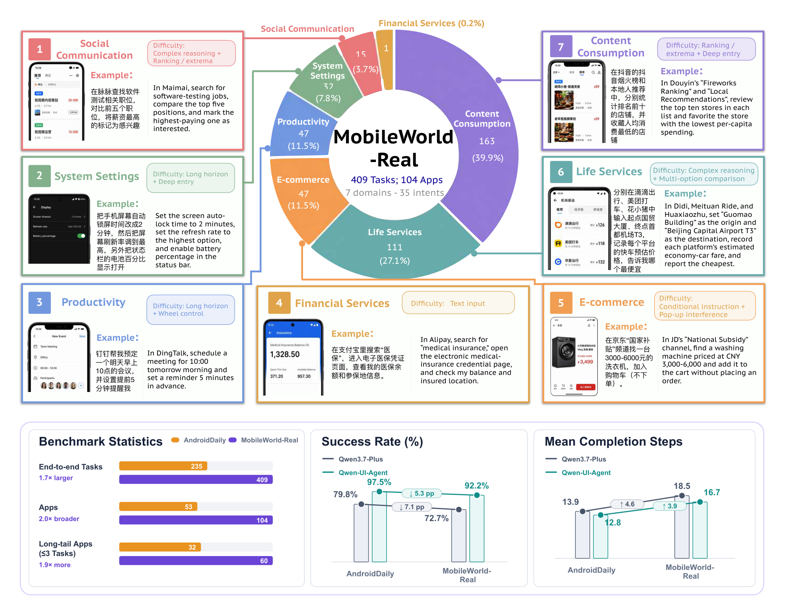

**图 7：MobileWorld-Real 概览。** 这是一个真实设备基准，其人工编写任务反映日常移动端使用的广度。代表性示例与汇总统计显示广泛领域覆盖和长尾应用分布；同一模型在该基准上的成功率低于 AndroidDaily，轨迹更长，说明真实移动交互更具挑战。

**基准设计与任务覆盖。** MobileWorld-Real 包含 104 个应用上的 409 项端到端任务，每项任务都源自一位人类贡献者识别出的日常需求。这些任务分属日常移动使用的七个领域：内容消费、生活服务、效率工具、电子商务、系统设置、金融服务和社交通信。每个领域又覆盖多种用户意图。例如，内容消费包括搜索内容、浏览信息流、发布和分享。

为在真实条件下评测这些任务，我们在 2.2.2 节的真实设备运行时上执行，使用在线账号状态和动态变化的网络内容。这会让 GUI 智能体遭遇弹窗、登录过期、权限请求、CAPTCHA，以及沙箱评测中很少出现的其他情形。除环境挑战外，许多任务还涉及复杂的多步骤工作流。接近一半的任务被标为“困难”，常见挑战包括长时程执行、比较与排序、对变化信息推理、导航到应用深层功能、从弹窗中恢复以及跨应用协同。

该基准还体现真实用户请求的含糊性：请求不一定提供成功执行所需的全部信息。此时，智能体必须识别缺失信息，通过 `ask_user` 获取必要细节，或在需要用户介入的步骤请求接管，然后继续任务。我们在真实性与重复评测需求之间保持平衡：MobileWorld-Real 避免依赖特定历史订单、购物车状态、银行卡或其他无法可靠设置、恢复的条件，从而确保评测结果高度稳定。图 7 总结其任务覆盖、挑战画像和代表性示例。

**用于轨迹级 GUI 智能体评测的 AutoJudge。** 在真实设备上评估任务成功很困难。与沙箱不同，真实应用通常不开放可对内部状态进行程序化检查的验证器。一次失败运行既可能源于智能体，也可能源于 CAPTCHA、登录会话过期、网络故障、服务不可用或基础设施错误等环境问题。仅看最终画面常不足以区分这些情况。

为实现可扩展、可重复的评测，我们开发 AutoJudge：面向真实设备交互的轨迹级评估器。评判提示明确规定把轨迹分配为 `pass`、`failed`、`env_error` 三种结果的判据。每次运行中，AutoJudge 接收任务指令和完整执行轨迹，每个动作都与相应截图对齐。五个独立 VLM 评判器检查同一轨迹，各自给出结果标签和简短理由，最终结果由多数票决定。通过单独报告环境错误并将其从成功率分母排除，AutoJudge 减少真实设备条件变化造成的评测噪声。附录 A.1 在 666 条轨迹上以独立专家标注检验 AutoJudge，其完全匹配准确率达到 **92.8%**。图 22、23、24 展示三种结果的代表性示例。

MobileWorld-Real 旨在补充而非取代沙箱基准：它衡量在受控环境中习得的能力能否迁移到真实设备。全部 MobileWorld-Real 任务及收集轨迹都与训练集隔离。由于在线应用与账号状态会随时间变化，我们单独报告环境错误，并保留完整执行轨迹以供审计和复现。

### 3.3 主要结果

#### 3.3.1 移动端使用评测

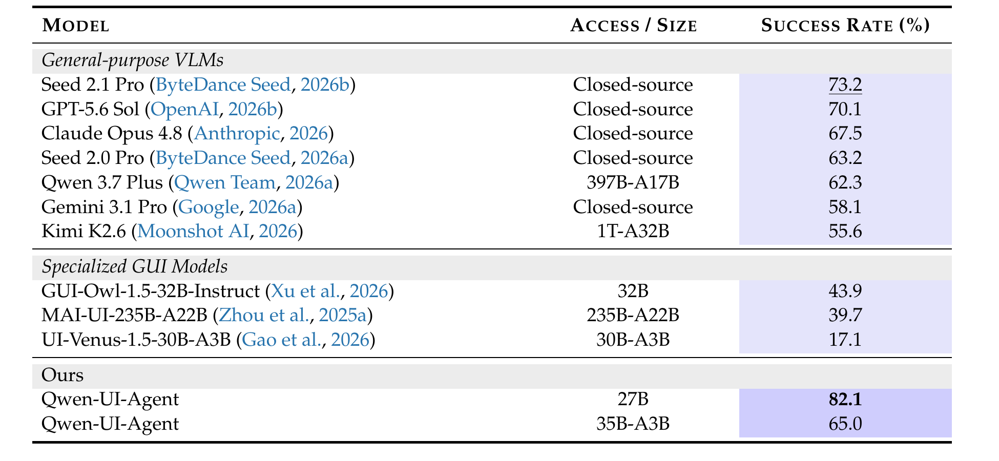

**表 2：MobileWorld 的纯 GUI 子集（117 项任务）性能比较（Kong et al., 2026）。** 比较纳入具有代表性的通用 VLM 与专用 GUI 模型；最佳结果加粗，次佳结果加下划线。

| 类型 | 模型 | 访问方式/规模 | 成功率（%） |
|---|---|---:|---:|
| 通用 VLM | Seed 2.1 Pro（ByteDance Seed, 2026b） | 闭源 | <u>73.2</u> |
| 通用 VLM | GPT-5.6 Sol（OpenAI, 2026b） | 闭源 | 70.1 |
| 通用 VLM | Claude Opus 4.8（Anthropic, 2026） | 闭源 | 67.5 |
| 通用 VLM | Seed 2.0 Pro（ByteDance Seed, 2026a） | 闭源 | 63.2 |
| 通用 VLM | Qwen 3.7 Plus（Qwen Team, 2026a） | 397B-A17B | 62.3 |
| 通用 VLM | Gemini 3.1 Pro（Google, 2026a） | 闭源 | 58.1 |
| 通用 VLM | Kimi K2.6（Moonshot AI, 2026） | 1T-A32B | 55.6 |
| 专用 GUI 模型 | GUI-Owl-1.5-32B-Instruct（Xu et al., 2026） | 32B | 43.9 |
| 专用 GUI 模型 | MAI-UI-235B-A22B（Zhou et al., 2025a） | 235B-A22B | 39.7 |
| 专用 GUI 模型 | UI-Venus-1.5-30B-A3B（Gao et al., 2026） | 30B-A3B | 17.1 |
| 本文 | Qwen-UI-Agent | 27B | **82.1** |
| 本文 | Qwen-UI-Agent | 35B-A3B | 65.0 |

我们在 MobileWorld（Kong et al., 2026）的纯 GUI 子集上评测 Qwen-UI-Agent。该基准包含多个 Android 应用中的长时程、跨应用工作流，具有挑战性且可复现；比较对象包括多家机构的前沿通用 VLM 和专用移动 GUI 模型。如表 2 所示，在标准 50 步评测预算下，Qwen-UI-Agent-27B 的成功率达到 **82.1%**，建立新的最佳水平。它分别比 GPT-5.6 Sol、Opus 4.8 和 Seed 2.1 Pro 高 12.0、14.6 与 8.9 个百分点；相较最强专用 GUI 基线 GUI-Owl-1.5-32B-Instruct（43.9%），高出 38.2 个百分点。

Qwen-UI-Agent-35B-A3B 也达到 65.0%，超过所有专用 GUI 基线，以及除 Seed 2.1 Pro 和 Claude Opus 4.8 外的所有通用 VLM。最大步骤数增至 100 后，27B 与 35B-A3B 的成功率分别进一步升至 85.5% 和 68.4%。这些结果表明，本模型在复杂移动环境中具有强长时程规划、视觉理解和可靠执行能力。

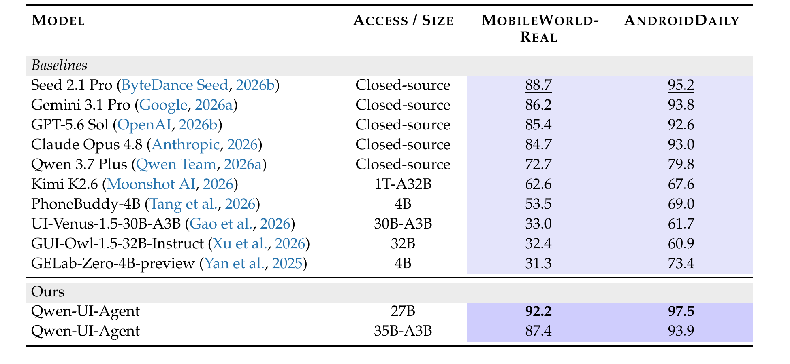

**表 3：真实设备移动基准性能比较（Sui et al., 2026）。** MobileWorld-Real 是本文提出的中国真实设备移动 GUI 基准；AndroidDaily 覆盖真实 Android 设备上的高频日常场景。

| 类型 | 模型 | 访问方式/规模 | MobileWorld-Real（%） | AndroidDaily（%） |
|---|---|---:|---:|---:|
| 基线 | Seed 2.1 Pro（ByteDance Seed, 2026b） | 闭源 | <u>88.7</u> | <u>95.2</u> |
| 基线 | Gemini 3.1 Pro（Google, 2026a） | 闭源 | 86.2 | 93.8 |
| 基线 | GPT-5.6 Sol（OpenAI, 2026b） | 闭源 | 85.4 | 92.6 |
| 基线 | Claude Opus 4.8（Anthropic, 2026） | 闭源 | 84.7 | 93.0 |
| 基线 | Qwen 3.7 Plus（Qwen Team, 2026a） | 闭源 | 72.7 | 79.8 |
| 基线 | Kimi K2.6（Moonshot AI, 2026） | 1T-A32B | 62.6 | 67.6 |
| 基线 | PhoneBuddy-4B（Tang et al., 2026） | 4B | 53.5 | 69.0 |
| 基线 | UI-Venus-1.5-30B-A3B（Gao et al., 2026） | 30B-A3B | 33.0 | 61.7 |
| 基线 | GUI-Owl-1.5-32B-Instruct（Xu et al., 2026） | 32B | 32.4 | 60.9 |
| 基线 | GELab-Zero-4B-preview（Yan et al., 2025） | 4B | 31.3 | 73.4 |
| 本文 | Qwen-UI-Agent | 27B | **92.2** | **97.5** |
| 本文 | Qwen-UI-Agent | 35B-A3B | 87.4 | 93.9 |

我们还在 MobileWorld-Real 与 AndroidDaily（Sui et al., 2026）两个真实设备移动基准上评测。前者关注中国移动生态中在在线 Android 设备上执行的复杂任务，后者覆盖真实 Android 设备上的高频日常场景。如表 3 所示，Qwen-UI-Agent 在 MobileWorld-Real 上达到 **92.2%**，超过所有基线，包括 Seed 2.1 Pro（88.7%）、Gemini 3.1 Pro（86.2%）和 GPT-5.6 Sol（85.4%）。这说明模型能够在真实移动设备上可靠处理长时程跨应用执行、超级应用内的深入口导航，以及对变化信息进行推理。仅用 27B 参数，它在任务能力、真实设备可靠性和部署效率之间取得较好平衡。

在 AndroidDaily 上，Qwen-UI-Agent 达到 **97.5%**，位列所有比较模型第一，超过 Seed 2.1 Pro（95.2%）与 Gemini 3.1 Pro（93.8%），说明其在高频日常移动场景中完成任务可靠。35B-A3B 变体在 MobileWorld-Real 与 AndroidDaily 上分别为 87.4% 和 93.9%，每个 token 仅激活 3B 参数，部署推理效率显著更高。

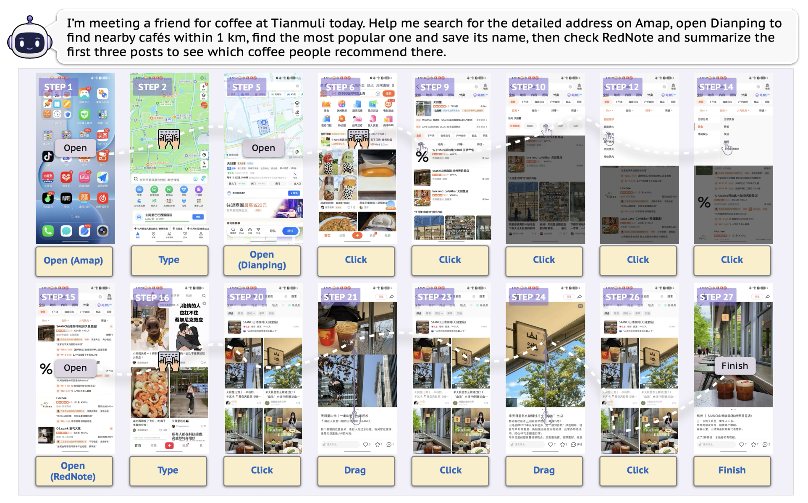

**图 8：真实设备移动 GUI 执行示例。** 轨迹以关键帧展示，每帧下方标注所执行动作。在该跨应用任务中，智能体在高德地图查找目标地址，在大众点评寻找附近最受欢迎的咖啡馆，再把结果摘要发布到小红书。该轨迹共 27 步；智能体直接导航至各应用的深层功能入口，在高德检索地址，在大众点评找出 1 公里内最受欢迎的咖啡馆，并把提取的关键信息带入小红书，作为完成摘要的决策依据。

#### 3.3.2 计算机使用评测

我们在 OSWorld-Verified（Xie et al., 2024）和 OSWorld-v2（Yuan et al., 2026）上评测 Qwen-UI-Agent 的计算机使用能力，并分别报告结果。OSWorld-Verified 对 361 项计算机使用任务衡量部分进度；OSWorld-v2 关注更长时程的工作流，同时报告部分进度和二元完成。

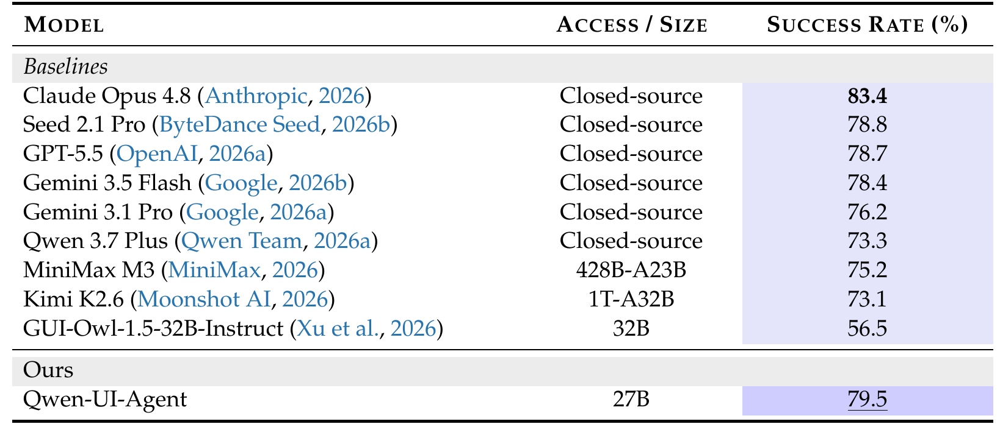

**表 4：OSWorld-Verified 性能比较（Xie et al., 2024）。**

| 类型 | 模型 | 访问方式/规模 | 成功率（%） |
|---|---|---:|---:|
| 基线 | Claude Opus 4.8（Anthropic, 2026） | 闭源 | **83.4** |
| 基线 | Seed 2.1 Pro（ByteDance Seed, 2026b） | 闭源 | 78.8 |
| 基线 | GPT-5.5（OpenAI, 2026a） | 闭源 | 78.7 |
| 基线 | Gemini 3.5 Flash（Google, 2026b） | 闭源 | 78.4 |
| 基线 | Gemini 3.1 Pro（Google, 2026a） | 闭源 | 76.2 |
| 基线 | Qwen 3.7 Plus（Qwen Team, 2026a） | 闭源 | 73.3 |
| 基线 | MiniMax M3（MiniMax, 2026） | 428B-A23B | 75.2 |
| 基线 | Kimi K2.6（Moonshot AI, 2026） | 1T-A32B | 73.1 |
| 基线 | GUI-Owl-1.5-32B-Instruct（Xu et al., 2026） | 32B | 56.5 |
| 本文 | Qwen-UI-Agent | 27B | <u>79.5</u> |

如表 4 所示，Qwen-UI-Agent 在 OSWorld-Verified 上达到 **79.5%**，在所有比较模型中排名第二，仅落后 Claude Opus 4.8。它超过 Seed 2.1 Pro、GPT-5.5、Gemini 3.5 Flash 和 Gemini 3.1 Pro 等领先闭源基础模型，也超过所有已评测开源权重基础模型。这表明 Qwen-UI-Agent 可与最强闭源模型竞争，同时相较现有开源权重模型具有显著优势。


**表 5：OSWorld-v2 性能比较（Yuan et al., 2026）。** Partial 表示部分任务进度，Binary 表示完整任务完成；每任务步骤数越低越好。

| 类型 | 模型 | Partial（%） | Binary（%） | 步骤/任务 | 动作模式 |
|---|---|---:|---:|---:|---|
| 基线 | Claude Opus 4.8（Anthropic, 2026） | **54.8** | **20.6** | 103.0 | 批量 |
| 基线 | GPT-5.5（OpenAI, 2026a） | <u>49.5</u> | 13.0 | 95.2 | 批量 |
| 基线 | MiniMax M3（MiniMax, 2026） | 22.3 | 4.6 | 326.7 | 单动作 |
| 基线 | Kimi K2.6（Moonshot AI, 2026） | 22.1 | 4.6 | 179.3 | 单动作 |
| 基线 | Qwen 3.7 Plus（Qwen Team, 2026a） | 21.5 | 2.8 | 173.5 | 单动作 |
| 本文 | Qwen-UI-Agent | 40.0 | <u>13.9</u> | 135.8 | 批量 |

如表 5 所示，Qwen-UI-Agent 在 OSWorld-v2 上取得 40.0% 的部分进度与 13.9% 的二元完成率，在前沿闭源模型中具有竞争力。它的二元完成率比 GPT-5.5 高 0.9 个百分点，部分进度低 9.5 个百分点。它也显著优于全部已评测开源权重模型。相较最强开源权重基线 MiniMax M3，部分进度与二元完成分别提高 17.7 和 9.3 个百分点；相较 Kimi K2.6，差距为 17.9/9.3 个百分点；相较 Qwen 3.7 Plus，为 18.5/11.1 个百分点。此外，它平均每项任务只需 135.8 步，显著少于 MiniMax M3 与 Qwen 3.7 Plus。这说明混合 GUI+CLI 和批量动作设计在长时程计算机工作流上兼顾任务表现与执行效率。

Qwen-UI-Agent 的关键特性是带批量执行的统一 GUI+CLI 动作空间。模型没有把 CLI 当作偶尔使用的后备，而是学会在同一轨迹中选择并交错 GUI 与 CLI 动作。在 OSWorld-Verified 和 OSWorld-v2 上，CLI 动作分别占全部动作的 **40.7%** 与 **55.1%**，以批量形式发出的动作比例分别为 **39.6%** 与 **41.6%**。4.2 节将详细分析这种组合方式。

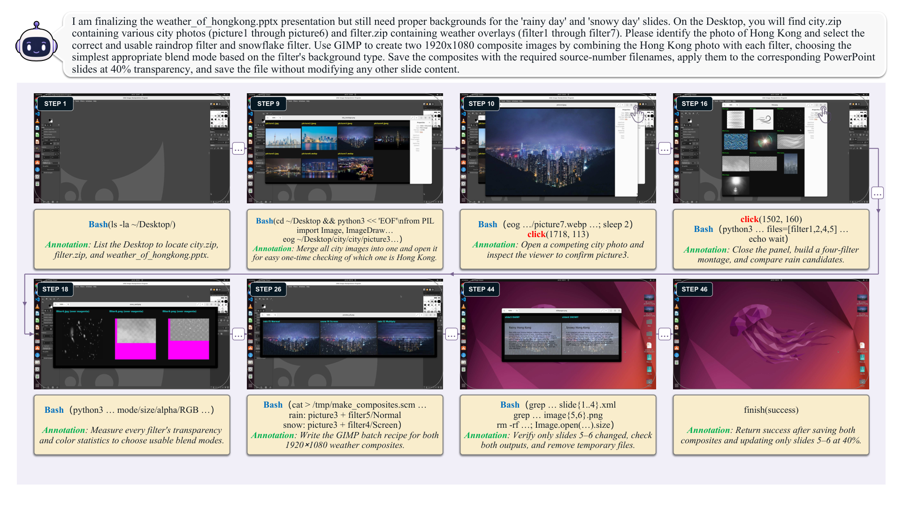

**图 9：计算机使用任务中的混合 GUI+CLI 执行示例。** 图中以关键帧配合发出的动作，CLI 命令标蓝，GUI 动作标红，每步均附简短意图说明。智能体需要在许多候选图片中找出目标城市照片和可用天气滤镜。若纯用 GUI，就必须逐个打开检查；智能体则用一段 CLI 脚本把全部候选拼成蒙太奇，一次性目视检查，再返回 GUI 完成合成与演示文稿编辑。GUI 与 CLI 的互补使用比单独使用任一接口高效得多；模型还会把多键快捷键序列，或命令后接等待等兼容操作合并到一次模型决策中。

**定性示例。** 图 9 与附录 A.3 的图 26 进一步展示 Qwen-UI-Agent 在两类代表性多应用工作流中的混合执行行为；每个关键帧下方都以蓝色标出 CLI 命令、以红色标出 GUI 动作，并简注该步骤的意图。在图 9 中，智能体必须从许多候选图像中识别目标城市照片和可用天气滤镜。纯 GUI 执行需要逐一打开检查，而智能体用一段 CLI 脚本把全部候选拼成单张蒙太奇，一眼完成核验，再返回 GUI 进行合成与演示文稿编辑。两种界面的互补使用比单独使用 GUI 或 CLI 都高效得多；智能体还把多键快捷键序列，或一条命令后接等待等兼容操作，批量合并到一次模型轮次中。

#### 3.3.3 浏览器使用与 DeepSearch 评测

除移动端与计算机使用外，我们还在基于浏览器的网页导航和 DeepSearch 上评测 Qwen-UI-Agent。两种能力密切相关，但衡量 GUI 智能体的不同方面。

**浏览器使用。** WebArena（Zhou et al., 2024）由功能完整网站上的有状态、多步骤任务构成。初次评测期间，我们发现官方参考答案中存在多处错误，官方评测脚本也有问题。因此，在报告最终结果之前，我们人工核验参考答案并修正受影响脚本。Kimi K2.5 同样在修正后的评测设置中报告其 WebArena 性能（Kimi Team, 2026）。

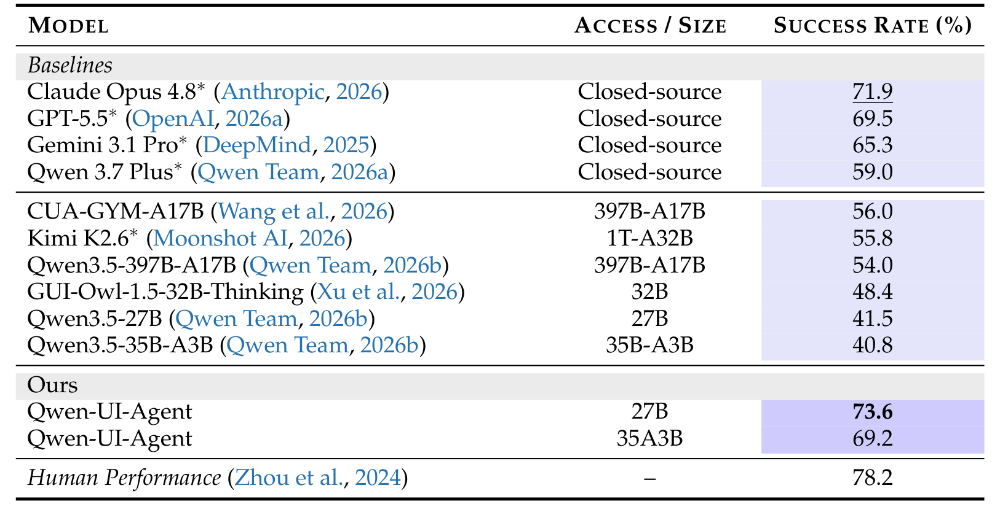

**表 6：WebArena 性能比较（Zhou et al., 2024）。** 标 `*` 的基线结果由本文在相同实验设置下评测得到。

| 类型 | 模型 | 访问方式/规模 | 成功率（%） |
|---|---|---:|---:|
| 基线 | Claude Opus 4.8*（Anthropic, 2026） | 闭源 | <u>71.9</u> |
| 基线 | GPT-5.5*（OpenAI, 2026a） | 闭源 | 69.5 |
| 基线 | Gemini 3.1 Pro*（DeepMind, 2025） | 闭源 | 65.3 |
| 基线 | Qwen 3.7 Plus*（Qwen Team, 2026a） | 闭源 | 59.0 |
| 基线 | CUA-GYM-A17B（Wang et al., 2026） | 397B-A17B | 56.0 |
| 基线 | Kimi K2.6*（Moonshot AI, 2026） | 1T-A32B | 55.8 |
| 基线 | Qwen3.5-397B-A17B（Qwen Team, 2026b） | 397B-A17B | 54.0 |
| 基线 | GUI-Owl-1.5-32B-Thinking（Xu et al., 2026） | 32B | 48.4 |
| 基线 | Qwen3.5-27B（Qwen Team, 2026b） | 27B | 41.5 |
| 基线 | Qwen3.5-35B-A3B（Qwen Team, 2026b） | 35B-A3B | 40.8 |
| 本文 | Qwen-UI-Agent | 27B | **73.6** |
| 本文 | Qwen-UI-Agent | 35B-A3B | 69.2 |
| 参考 | 人类表现（Zhou et al., 2024） | — | 78.2 |

如表 6 所示，Qwen-UI-Agent 27B 的成功率为 **73.6%**，是所有比较模型中最高；35B-A3B 为 69.2%。27B 比最强基线 Claude Opus 4.8（71.9%）高 1.7 个百分点，比 GPT-5.5（69.5%）高 4.1 个百分点。它也超过 Gemini 3.1 Pro、Qwen 3.7 Plus、Kimi K2.6、CUA-GYM-A17B，以及 Claude 3.7 Computer Use、GUI-Owl-1.5-32B-Thinking 等专用浏览器智能体。虽然仍比报告的人类表现 78.2% 低 4.6 个百分点，但结果表明其能在异构网页界面中实现强端到端浏览器控制。

**DeepSearch。** 简单搜索本身通常也是网页导航的一部分：智能体在浏览器中输入查询，检查排序结果，再打开一个可能相关的页面。DeepSearch 用基于 API 的检索与证据综合替代许多重复 GUI 动作，简化这一过程，使智能体可以在继续 GUI 工作流之前更高效地获得外部上下文。


**表 7：DeepSearch 基准性能比较。** BC 为 BrowseComp，BC-ZH 为 BrowseComp-ZH；“—”表示未报告。

| 类型 | 模型 | 访问方式/规模 | BC（%） | BC-ZH（%） |
|---|---|---:|---:|---:|
| 基线 | GPT-5.5（OpenAI, 2026a） | 闭源 | <u>90.1</u> | — |
| 基线 | Seed 2.1 Pro（ByteDance Seed, 2026b） | 闭源 | 86.2 | — |
| 基线 | Gemini 3.1 Pro（Google, 2026a） | 闭源 | 85.9 | — |
| 基线 | Claude Opus 4.8（Anthropic, 2026） | 闭源 | 84.3 | — |
| 基线 | UI-TARS-2（Wang et al., 2025a） | 闭源 | 29.6 | 50.5 |
| 基线 | Qwen3.5-397B-A17B（Qwen Team, 2026b） | 397B-A17B | 78.6 | 70.3 |
| 基线 | Apodex-1.0-mini（Apodex Team, 2026） | 35B-A3B | 71.5 | **80.6** |
| 基线 | Qwen3.5-27B（Qwen Team, 2026b） | 27B | 61.0 | 62.1 |
| 基线 | GLM-4.7（Z.ai, 2025） | 358B | 52.0 | 66.6 |
| 基线 | DeepSeek-V3.2（DeepSeek-AI, 2025） | 685B | 51.4 | 65.0 |
| 基线 | Tongyi-DR-30B（Tongyi DeepResearch, 2025） | 30B-A3B | 43.4 | 46.7 |
| 本文 | Qwen-UI-Agent | 27B | 64.1 | <u>75.0</u> |

BrowseComp 与 BrowseComp-ZH 分别评估智能体在英文与中文网页上的持续信息检索。如表 7 所示，Qwen-UI-Agent 分别取得 64.1% 和 75.0%。在 BrowseComp 上，它超过 Qwen3.5-27B、Tongyi-DR-30B 和 UI-TARS-2；虽然仍落后前沿专有模型和大得多的系统，但在 27B 规模上展现出有竞争力的英文 DeepSearch 能力。在 BrowseComp-ZH 上，它位列所有系统第二，显著超过 Qwen3.5-27B、Tongyi-DR-30B 和 UI-TARS-2。这说明 Qwen-UI-Agent 不仅能定位候选网页，还能把分散在多个来源的证据综合为可靠且与任务相关的信息，供后续推理与 GUI 执行使用。

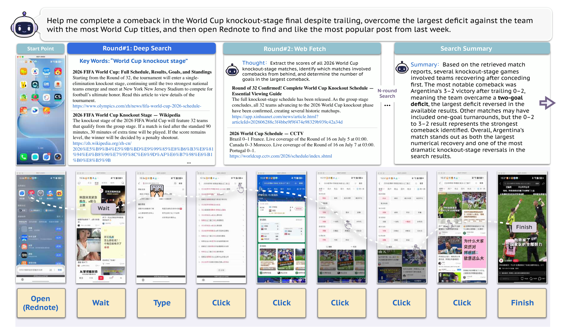

**图 10：DeepSearch 辅助的 GUI 执行示例。** 上部面板展示多轮搜索，包括基于关键词的 DeepSearch、带中间思考的定向网页抓取以及最终搜索摘要；下排展示随后的 GUI 轨迹。DeepSearch 在 GUI 执行前解决知识与推理问题，把模糊的跨来源请求转成明确目标：Qwen-UI-Agent 通过 DeepSearch 找出世界杯淘汰赛最大逆转，再打开小红书，直接导航到过去一周互动量最高的相关帖子，无需在应用内盲目搜索。

我们进一步给出两种 DeepSearch 与 GUI 执行互补整合的示例：GUI 动作用于操作应用，DeepSearch 用于获取外部知识、比较和决策。第一种（图 10）要求在任何 GUI 操作之前先解决知识与推理问题：找出本届世界杯淘汰赛阶段逆转幅度最大的比赛。上部面板追踪多轮检索：先以关键词对排序来源进行 DeepSearch，再定向获取网页、提取并交叉检查比分，最终摘要识别出阿根廷在 0:2 落后后以 3:2 逆转的比赛。这样，模糊的跨来源请求在执行前被转成明确 GUI 目标；随后智能体打开小红书，直接搜索已识别比赛，筛选过去七天帖子，并打开讨论最多的帖子，而无需盲搜或反复试错。

第二种示例见附录图 27，DeepSearch 在 GUI 执行中途按需调用：智能体先以 GUI 动作找到一条有关循证减重的抖音视频并提取主要主张，再调用 DeepSearch，用研究论文、官方指南和权威来源核验这些主张，因为仅凭界面无法决定是否评论、评论什么。核验结论直接决定后续 GUI 动作：发布一条纠正误导性主张并补充必要限定的评论，形成“观察—研究—决策—行动”闭环。

#### 3.3.4 GUI 定位

我们在五项综合基准上评测 Qwen-UI-Agent 的 GUI 定位能力：ScreenSpot-Pro、ScreenSpot-V2、MMBench-GUI L2、OSWorld-G-Refined 和 UI-Vision。它们覆盖高分辨率专业软件、通用跨平台界面、桌面软件环境及指令驱动定位。

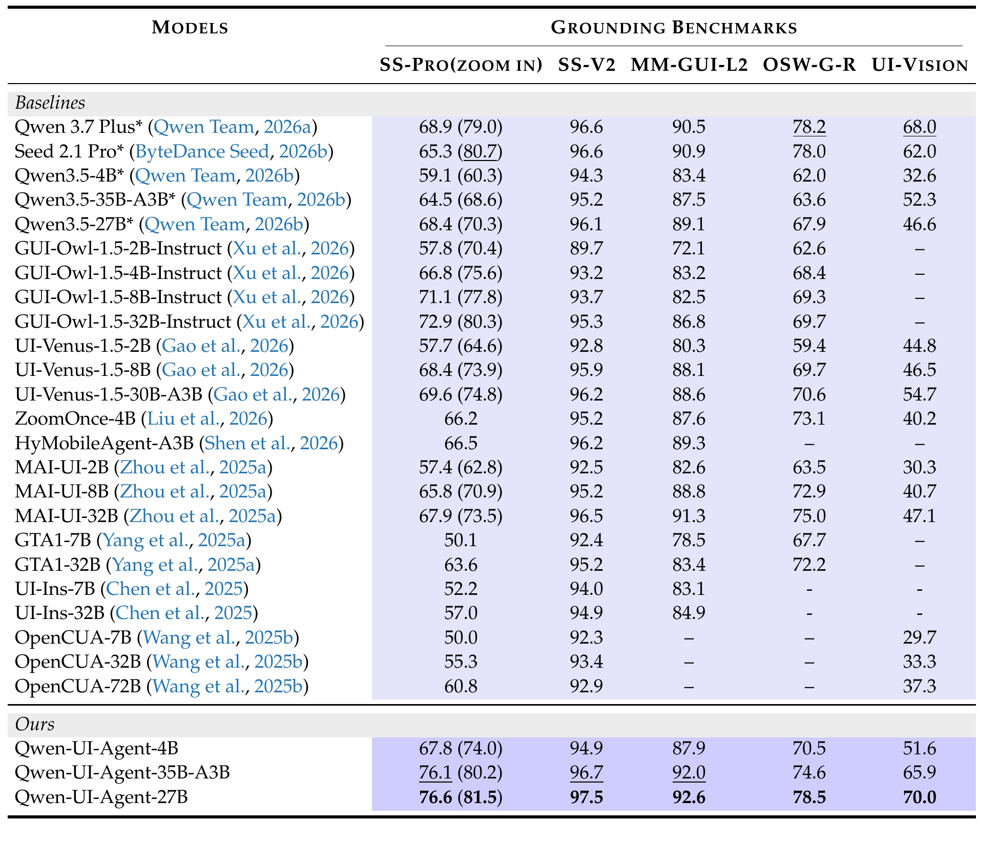

**表 8：GUI 定位基准性能比较。** ScreenSpot-Pro 报告不放大结果；括号中为允许放大时的结果。标 `*` 的基线由本文自行评测。

| 类型 | 模型 | SS-Pro（放大） | SS-V2 | MM-GUI-L2 | OSW-G-R | UI-Vision |
|---|---|---:|---:|---:|---:|---:|
| 基线 | Qwen 3.7 Plus*（Qwen Team, 2026a） | 68.9（79.0） | 96.6 | 90.5 | <u>78.2</u> | <u>68.0</u> |
| 基线 | Seed 2.1 Pro*（ByteDance Seed, 2026b） | 65.3（<u>80.7</u>） | 96.6 | 90.9 | 78.0 | 62.0 |
| 基线 | Qwen3.5-4B*（Qwen Team, 2026b） | 59.1（60.3） | 94.3 | 83.4 | 62.0 | 32.6 |
| 基线 | Qwen3.5-35B-A3B*（Qwen Team, 2026b） | 64.5（68.6） | 95.2 | 87.5 | 63.6 | 52.3 |
| 基线 | Qwen3.5-27B*（Qwen Team, 2026b） | 68.4（70.3） | 96.1 | 89.1 | 67.9 | 46.6 |
| 基线 | GUI-Owl-1.5-2B-Instruct（Xu et al., 2026） | 57.8（70.4） | 89.7 | 72.1 | 62.6 | — |
| 基线 | GUI-Owl-1.5-4B-Instruct（Xu et al., 2026） | 66.8（75.6） | 93.2 | 83.2 | 68.4 | — |
| 基线 | GUI-Owl-1.5-8B-Instruct（Xu et al., 2026） | 71.1（77.8） | 93.7 | 82.5 | 69.3 | — |
| 基线 | GUI-Owl-1.5-32B-Instruct（Xu et al., 2026） | 72.9（80.3） | 95.3 | 86.8 | 69.7 | — |
| 基线 | UI-Venus-1.5-2B（Gao et al., 2026） | 57.7（64.6） | 92.8 | 80.3 | 59.4 | 44.8 |
| 基线 | UI-Venus-1.5-8B（Gao et al., 2026） | 68.4（73.9） | 95.9 | 88.1 | 69.7 | 46.5 |
| 基线 | UI-Venus-1.5-30B-A3B（Gao et al., 2026） | 69.6（74.8） | 96.2 | 88.6 | 70.6 | 54.7 |
| 基线 | ZoomOnce-4B（Liu et al., 2026） | 66.2 | 95.2 | 87.6 | 73.1 | 40.2 |
| 基线 | HyMobileAgent-A3B（Shen et al., 2026） | 66.5 | 96.2 | 89.3 | — | — |
| 基线 | MAI-UI-2B（Zhou et al., 2025a） | 57.4（62.8） | 92.5 | 82.6 | 63.5 | 30.3 |
| 基线 | MAI-UI-8B（Zhou et al., 2025a） | 65.8（70.9） | 95.2 | 88.8 | 72.9 | 40.7 |
| 基线 | MAI-UI-32B（Zhou et al., 2025a） | 67.9（73.5） | 96.5 | 91.3 | 75.0 | 47.1 |
| 基线 | GTA1-7B（Yang et al., 2025a） | 50.1 | 92.4 | 78.5 | 67.7 | — |
| 基线 | GTA1-32B（Yang et al., 2025a） | 63.6 | 95.2 | 83.4 | 72.2 | — |
| 基线 | UI-Ins-7B（Chen et al., 2025） | 52.2 | 94.0 | 83.1 | — | — |
| 基线 | UI-Ins-32B（Chen et al., 2025） | 57.0 | 94.9 | 84.9 | — | — |
| 基线 | OpenCUA-7B（Wang et al., 2025b） | 50.0 | 92.3 | — | — | 29.7 |
| 基线 | OpenCUA-32B（Wang et al., 2025b） | 55.3 | 93.4 | — | — | 33.3 |
| 基线 | OpenCUA-72B（Wang et al., 2025b） | 60.8 | 92.9 | — | — | 37.3 |
| 本文 | Qwen-UI-Agent-4B | 67.8（74.0） | 94.9 | 87.9 | 70.5 | 51.6 |
| 本文 | Qwen-UI-Agent-35B-A3B | <u>76.1</u>（80.2） | <u>96.7</u> | <u>92.0</u> | 74.6 | 65.9 |
| 本文 | Qwen-UI-Agent-27B | **76.6（81.5）** | **97.5** | **92.6** | **78.5** | **70.0** |

如表 8 所示，27B 在五项基准上都表现强劲：不放大时 ScreenSpot-Pro 为 76.6%，ScreenSpot-V2 为 97.5%，MMBench-GUI L2 为 92.6%，OSWorld-G-Refined 为 78.5%，UI-Vision 为 70.0%。在 ScreenSpot-Pro 上，无论是否放大，它都位列所有比较模型第一；允许放大时进一步升至 **81.5%**。这说明模型在常见界面和复杂专业软件中均能准确定位元素，包括必须从功能或空间上下文而非显式文字推断目标的情形。

不同模型规模下，定位能力也保持强劲。ScreenSpot-Pro 不放大时，35B-A3B 与 4B 分别为 76.1% 和 67.8%，放大后升至 80.2% 和 74.0%。35B-A3B 每个 token 仅激活 3B 参数，在 ScreenSpot-V2、MMBench-GUI L2、OSWorld-G-Refined 和 UI-Vision 上还分别达到 96.7%、92.0%、74.6% 与 65.9%；4B 对应成绩为 94.9%、87.9%、70.5% 和 51.6%。总体上，从紧凑到中等规模，Qwen-UI-Agent 均能在常见界面、专业软件和不同指令类型上提供可靠 GUI 定位。

#### 3.3.5 通用能力与智能体能力

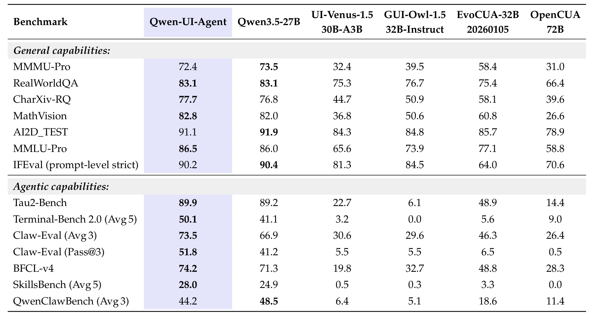

**表 9：通用能力与智能体能力比较。** Qwen-UI-Agent 在获得强 GUI 能力的同时，保留其基础模型的通用推理与智能体能力；在这些基准上也显著优于其他 GUI 专用模型。

| 类别 | 基准 | Qwen-UI-Agent | Qwen3.5-27B | UI-Venus-1.5-30B-A3B | GUI-Owl-1.5-32B-Instruct | EvoCUA-32B-20260105 | OpenCUA-72B |
|---|---|---:|---:|---:|---:|---:|---:|
| 通用 | MMMU-Pro | 72.4 | **73.5** | 32.4 | 39.5 | 58.4 | 31.0 |
| 通用 | RealWorldQA | **83.1** | **83.1** | 75.3 | 76.7 | 75.4 | 66.4 |
| 通用 | CharXiv-RQ | **77.7** | 76.8 | 44.7 | 50.9 | 58.1 | 39.6 |
| 通用 | MathVision | **82.8** | 82.0 | 36.8 | 50.6 | 60.8 | 26.6 |
| 通用 | AI2D_TEST | 91.1 | **91.9** | 84.3 | 84.8 | 85.7 | 78.9 |
| 通用 | MMLU-Pro | **86.5** | 86.0 | 65.6 | 73.9 | 77.1 | 58.8 |
| 通用 | IFEval（提示级严格） | 90.2 | **90.4** | 81.3 | 84.5 | 64.0 | 70.6 |
| 智能体 | Tau2-Bench | **89.9** | 89.2 | 22.7 | 6.1 | 48.9 | 14.4 |
| 智能体 | Terminal-Bench 2.0（5 次平均） | **50.1** | 41.1 | 3.2 | 0.0 | 5.6 | 9.0 |
| 智能体 | Claw-Eval（3 次平均） | **73.5** | 66.9 | 30.6 | 29.6 | 46.3 | 26.4 |
| 智能体 | Claw-Eval（Pass@3） | **51.8** | 41.2 | 5.5 | 5.5 | 6.5 | 0.5 |
| 智能体 | BFCL-v4 | **74.2** | 71.3 | 19.8 | 32.7 | 48.8 | 28.3 |
| 智能体 | SkillsBench（5 次平均） | **28.0** | 24.9 | 0.5 | 0.3 | 3.3 | 0.0 |
| 智能体 | QwenClawBench（3 次平均） | 44.2 | **48.5** | 6.4 | 5.1 | 18.6 | 11.4 |

**评测说明。** 表 9 的全部结果均由本文在自己的评测环境中独立复现。由于某些评测设置并不完全相同，得分可能不同于官方报告。除下述说明外，均遵循相应官方协议。

- **Tau2-Bench：** 遵循官方榜单任务集、harness 与计分协议，但用 GPT-5.5 作为用户模拟器和评判器。
- **Terminal-Bench 2.0：** 沿用 Qwen3.6 的评测设置，使用 Harbor/Terminus-2 harness；单任务超时三小时，最多 32 CPU、48 GB 内存。温度 1.0、top-$p$ 0.95、top-$k$ 20、输出上限 80K token、上下文窗口 256K，报告五次运行平均值。
- **Claw-Eval：** 遵循官方 199 项任务、三次试验与计分规则；通用与多轮评判都用 GPT-5.5，多轮用户模拟用 Qwen3.6-Plus，替代官方 Gemini 3 Flash/Claude Opus 4.6 设置；采样温度 0.6。
- **SkillsBench：** 沿用 Qwen3.6 设置，使用 OpenCode 评测 78 项自包含任务，排除依赖外部 API 的任务，报告五次运行平均值。
- **QwenClawBench：** 遵循官方 v1.1 任务集、三次运行与 penalized-hybrid 计分，但把默认 Claude Opus 4.5 评判器换成 GPT-5.2；OpenClaw 运行时固定为 2026.6.1，而非持续变化的 `main` 镜像。

Qwen-UI-Agent 在发展强 GUI 领域知识的同时，保留从基础模型继承的通用推理和智能体能力。如表 9 所示，它也在通用和智能体基准上显著优于专用 GUI 模型。这说明 Qwen-UI-Agent 仍是一个能力广泛的模型，而非狭窄的纯 GUI 模型。更广泛的能力画像也可能帮助它处理分布外或不寻常任务，因为这类任务要求超出常规 GUI 交互的知识、推理与工具使用。

### 3.4 Harness 支持的工作流

除基准评测外，我们还定性考察 2.5 节 harness 层所支持的工作流，包括主动发起服务和跨平台任务执行。

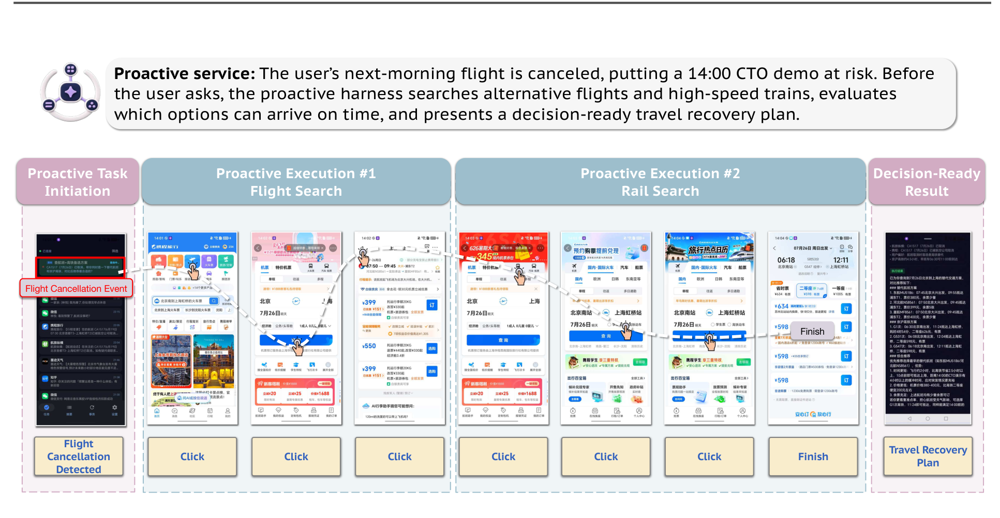

**图 11：基于移动通知的主动服务示例。** 轨迹分为由检测通知触发的主动任务发起、主动执行阶段，以及可直接决策的结果；每个关键帧下方标注动作。航班取消恢复场景中，用户次日早班航班取消，14:00 的演示面临风险。Harness 主动搜索替代航班和高铁，评估哪些选项能按时抵达，并提供可直接决策的行程恢复计划。

**主动服务。** 图 11 与附录 A.3 的图 28 展示两条代表性主动服务轨迹。每条轨迹均由四个高亮阶段组成：主动发起任务、一个或多个主动执行阶段，以及可直接决策的结果。附录图 28 的示例由 08:00 的定时触发器启动，把高亮通知中提取的用户晨间承诺与实时天气、通勤条件结合起来。Harness 先查询天气，再通过地图导航比较公共交通和出租车选项，在用户开口前给出包含带伞建议、出发时间和关键提醒的可行动晨报。

另一类示例如图 11：harness 检测航班取消通知，使次日 14:00 演示面临风险；它分两个执行阶段主动搜索替代航班和高铁，评估哪些选项能及时抵达，并给出可直接决策的行程恢复计划，把最终预订决定留给用户。两例都表明，harness 能把被动通知转成具有上下文、可执行的帮助，同时让会产生后果的动作保持在用户控制下。

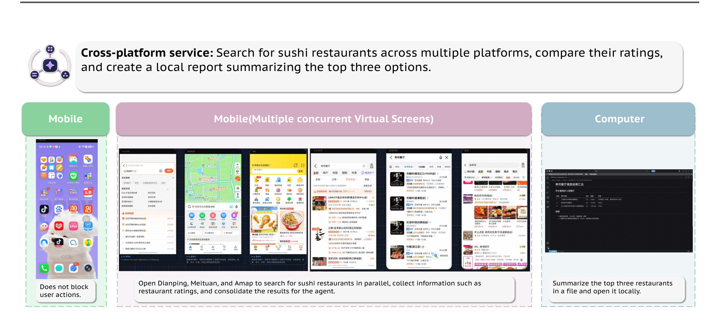

**图 12：跨平台任务执行示例。** 移动端子任务运行在物理设备的虚拟屏幕上，不会阻塞用户自己的操作。在并行多应用搜索中，智能体通过多个虚拟屏幕并发搜索大众点评、美团和高德地图上的寿司餐厅，汇总评分，并在计算机上打开的本地报告中总结前三个选项。

**跨平台任务执行。** 图 6（II）展示团队建设餐厅选择的跨平台工作流。Harness 把任务分成四个按设备寻址的阶段：Qwen-UI-Agent 在移动端发现候选餐厅；在桌面电子表格中整理评分、菜系和订座电话；把生成材料发送给团队负责人批准；最后把批准的餐厅保存回移动地图应用。整个工作流中，共享任务状态在设备间传递候选列表、生成的电子表格和审批结果，使每一阶段从最新上下文恢复，而非从头开始。

附录图 29 还展示收据整理工作流：将移动相册中的选择交给 GUI+CLI 计算机使用流程以生成报销报告。图 12 则展示并行餐厅搜索，在多个虚拟屏幕上并发操作大众点评、美团和高德地图。两种情形下，移动子任务都在虚拟屏幕中运行，不阻塞用户使用设备。这些示例表明，harness 能在执行于移动端和计算机之间转移时保留任务状态、材料与依赖关系。

## 4 GUI 智能体执行行为分析

汇总基准得分说明智能体是否完成任务，却很少揭示它如何执行、为何失败，以及 RL 训练后行为怎样变化。因此，我们主要围绕 Qwen-UI-Agent 的执行行为考察四个问题：**（1）**为何针对模拟基准优化的模型在物理设备上遇到困难？**（2）**Qwen-UI-Agent 在任务执行中如何组合 GUI、CLI 和批量动作，这些选择产生何种独特执行模式？**（3）**Action RL 如何改变步骤级执行行为？**（4）**Online RL 如何重塑长时程任务中的轨迹级行为？这些分析通过揭示智能体如何应对困难环境、使用动作空间及经 RL 后发生变化，补充汇总指标。

### 4.1 模型有限的真实设备经验如何影响其执行行为？

**真实设备失败的行为分析。** 大多数模型在训练中很少直接接触物理设备交互。Qwen 3.7 Plus 等前沿模型在许多基准上表现强劲，但 MobileWorld-Real 结果表明，在物理设备上可靠执行仍很困难。这引出一个更具体的行为问题：当训练中的真实设备交互有限时，会出现哪些执行模式，它们如何造成任务失败？为研究这一问题，我们复核 Qwen 3.7 Plus 在 MobileWorld-Real 与 AndroidDaily 上的每一条失败轨迹，识别主要失败模式。

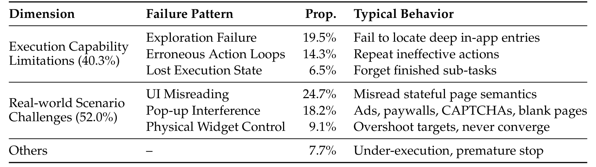

**表 10：Qwen 3.7 Plus 在真实设备上的全部失败轨迹之失败模式分布。**

| 维度 | 失败模式 | 占比 | 典型行为 |
|---|---|---:|---|
| 执行能力限制（40.3%） | 探索失败 | 19.5% | 找不到应用内深层入口 |
| 执行能力限制（40.3%） | 错误动作循环 | 14.3% | 重复无效动作 |
| 执行能力限制（40.3%） | 丢失执行状态 | 6.5% | 忘记已完成子任务 |
| 真实世界场景挑战（52.0%） | UI 误读 | 24.7% | 误解有状态页面语义 |
| 真实世界场景挑战（52.0%） | 弹窗干扰 | 18.2% | 广告、付费墙、CAPTCHA、空白页 |
| 真实世界场景挑战（52.0%） | 物理控件操作 | 9.1% | 越过目标、始终无法收敛 |
| 其他 | — | 7.7% | 执行不足、过早停止 |

如表 10 所示，我们从两个维度组织失败，两者都根植于训练时真实交互经验稀缺：**执行能力限制**占 40.3%，因为模拟环境很少激励模型学习探索、错误恢复和状态跟踪；**真实世界场景挑战**占 52.0%，由净化后的模拟器很少包含的界面现象触发。如图 13 所示，我们为每种模式选取一个代表性案例，以两个关键帧配合模型思考的节略版本，并逐项分析。


**图 13：Qwen 3.7 Plus 的代表性真实设备失败模式。** 执行能力限制：（a）探索失败；（b）错误动作循环；（c）丢失执行状态。真实世界场景挑战：（d）UI 误读；（e）弹窗干扰；（f）物理控件操作。气泡为模型思考的节略引文，关键谬误以紫色标出。

**执行能力限制。** Qwen 3.7 Plus 在这一维度的失败（40.3%）反映三种执行能力不足：定位不常用或深层嵌套的应用功能；从意外反馈或界面状态恢复；在长轨迹中维持任务状态。

- **探索失败（19.5%）**发生在目标是不常用功能，且隐藏在多个入口或深层页面层级之后时。Qwen 3.7 Plus 往往反复访问少数浅层页面，而不探索其他路线（图 13a）；Qwen-UI-Agent 则会在选定路线前检查多个合理入口。
- **错误动作循环（14.3%）**源于真实第三方应用的长尾：某动作常未产生预期状态转移。处理这种违反预期的情况本身是一种需要学习的技能，而高度可预测的模拟器很少提供学习机会。动作未产生预期结果时，缺少物理设备训练经验的模型倾向于重复同一动作，或在两个界面状态间来回切换，而不是诊断失败、修改计划（图 13b）。
- **丢失执行状态（6.5%）**出现在需要跨应用切换、打断与多个子任务保存中间信息和完成进度的长时程任务中。Qwen 3.7 Plus 可能丢失此前进度，重复已完成子任务，或从头重启部分工作流（图 13c）。

**真实世界场景挑战。** 这一维度的失败（52.0%）涉及物理设备上常见、但训练中可能代表不足的界面条件：含糊页面语义、意外界面打断，以及需要细粒度操作的交互控件。

- **UI 误读（24.7%）**是因为真实页面带有纯视觉外观无法消歧的有状态语义，例如预填搜索词、占位提示和动态刷新的列表，而模拟器界面通常干净、静态。因此，在模拟环境中训练的模型会误判界面状态；最典型的是把灰色占位文字误当成用户已输入内容，反复尝试清除，而不是直接覆盖输入（图 13d）。
- **弹窗干扰（18.2%）**包括广告、付费墙、CAPTCHA，以及无响应或空白页面；为了保持评测可复现，模拟器会有意排除这些非确定性打断。模型缺少恢复先验时，要么随干扰偏离原任务，要么反复重试被阻塞路径（图 13e）。
- **物理控件操作（9.1%）**涉及滚轮、滑块、日期选择器等要求增量闭环操作的控件，智能体必须观察当前值并据此调整滑动幅度。模拟环境通常通过直接文本注入或单次点击设置这些值，所以智能体会使用固定幅度滑动，在目标两侧不断越界而始终无法收敛（图 13f）。

这些发现为 2.2.2 节的真实设备训练与评测基础设施提供了动机，也有助于解释 Qwen-UI-Agent 在真实移动设备上的强表现。

### 4.2 深入观察 Qwen-UI-Agent 的 GUI—CLI 协同与批量执行

Qwen-UI-Agent 通过交错 GUI 与 CLI 动作的轨迹执行计算机任务，并选择性地把多个动作以批量形式一起输出。这一混合执行提出两个问题：模型如何在 GUI 与 CLI 间划分操作？何时选择批量执行多个动作？我们分析 Qwen-UI-Agent 在 OSWorld-Verified 与 OSWorld-v2 上生成的轨迹，得到如下行为模式。


**表 11：OSWorld-Verified 和 OSWorld-v2 上的 GUI+CLI 使用及批量执行统计。** 面板（a）报告动作级与任务级的 CLI 和批量动作使用情况；面板（b）报告批量输出的构成。差值为 OSWorld-v2 减 OSWorld-Verified，以百分点（pp）表示；平均批量大小按一个批次中的原子动作数计算。

| 分面 | 统计项 | 层级 | OSWorld-Verified | OSWorld-v2 | 差值（pp） |
|---|---|---|---:|---:|---:|
| （a）总体使用 | CLI | 动作 | 40.7% | 55.1% | +14.4 |
| （a）总体使用 | CLI | 任务 | 92.0% | 98.2% | +6.2 |
| （a）总体使用 | 批量 | 动作 | 39.6% | 41.6% | +2.0 |
| （a）总体使用 | 批量 | 任务 | 62.1% | 88.9% | +26.8 |
| （b）批量构成 | 纯 GUI 批次 | — | 75.8% | 64.7% | -11.1 |
| （b）批量构成 | 纯 CLI 批次 | — | 13.1% | 15.0% | +1.9 |
| （b）批量构成 | 混合 GUI+CLI 批次 | — | 11.0% | 20.3% | +9.3 |
| （b）批量构成 | 每批平均原子动作数 | — | 3.1 | 3.1 | 0.0 |

**跨动作与任务的使用统计。** 表 11 从动作和任务两个层级量化 CLI 与批量执行。GUI 和 CLI 都是 Qwen-UI-Agent 计算机使用轨迹中的主要执行通道。在 OSWorld-Verified 上，CLI 占全部动作的 40.7%，出现在 92.0% 的任务中；在 OSWorld-v2 上分别升至 55.1% 和 98.2%。GUI 与 CLI 近乎均衡的分布表明，模型灵活、互补地使用两者。OSWorld-v2 的 CLI 占比更高，部分是由于任务分布中包含更多天然适合程序化执行的工作流，例如合并文件、处理结构化数据和批量文件操作。

批量动作占 OSWorld-Verified 与 OSWorld-v2 全部动作的 39.6% 和 41.6%，分别出现在 62.1% 和 88.9% 的任务中，说明两项基准都广泛使用批量执行。每批平均含 3.1 个原子动作；相较把每个动作放到独立模型决策中，这显著减少“观测—推理—执行”循环，提高执行效率。纯 GUI 批次仍占主导，但纯 CLI 和混合 GUI+CLI 批次说明批量执行也支持程序化操作及两条执行通道之间的协同。

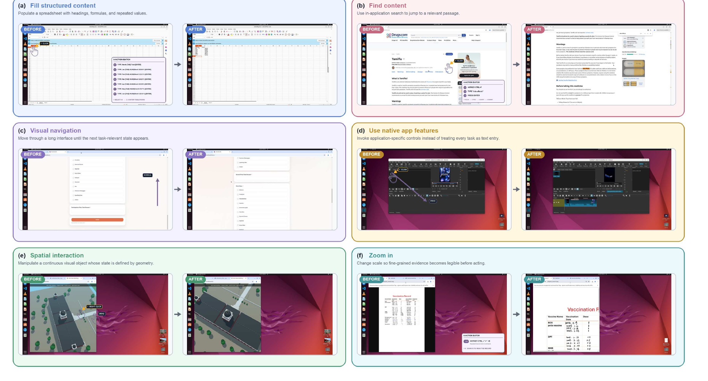

**图 14：代表性 GUI 交互模式。**（a）填充具有标题、公式与重复值的结构化电子表格；（b）用页内搜索查找内容；（c）滚动进行视觉导航；（d）使用原生媒体时间轴功能；（e）对状态由几何位置决定的空间对象进行连续交互；（f）放大以检查细粒度证据。每个面板都把执行动作与其造成的应用状态配对。

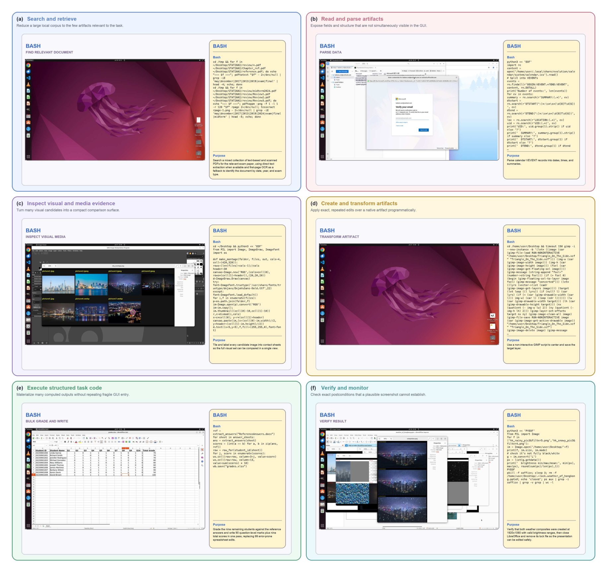

**图 15：代表性 CLI 交互模式。** 模型使用 CLI 工具：（a）从混合语料检索相关文档；（b）解析机器可读的材料结构；（c）把许多视觉候选压缩成一个带标签的比较面；（d）以程序方式转换材料；（e）执行重复计算并生成输出；（f）验证精确输出和进程后置条件。每个面板把应用上下文、命令摘录及其任务特定目的并列展示。

**Qwen-UI-Agent 何时使用 GUI、CLI 和批量动作？** 除汇总统计外，我们检查轨迹中的反复模式，理解三类能力的实际用法。下面的示例是经验倾向，而非固定能力边界。

- **GUI 交互。** 当界面既是控制表面又是执行反馈来源时，尤其是涉及原生应用控件、视觉导航或空间操作时，Qwen-UI-Agent 倾向依赖 GUI。图 14 的六种模式表明，GUI 不仅支持界面导航，也支持那些执行和后续决策依赖可见状态转移、原生控件或连续空间反馈的操作。
- **CLI 执行。** 当信息或操作以数据或代码表示，比一串 GUI 交互更紧凑、更精确时，Qwen-UI-Agent 倾向使用 CLI。图 15 展示六种典型用途。CLI 在推理前充当搜索空间压缩器，在结构化操作中充当高效执行通道，在编辑后充当精确的后置条件验证器。联系表（contact sheet）示例还说明，CLI 并非替代视觉判断，而是把分散的视觉证据重组到一个比较面，以补充视觉推理。


**图 16：代表性批量动作模式。**（a）用于页内搜索的紧凑 GUI 宏；（b）由 21 个相关动作组成的表单序列，在下一个不确定对话框处停止；（c）通过结构化任务状态验证空间操作的 GUI—CLI 交接。每行把渲染后的批次与批次结束后的首次观测配对。

- **批量执行。** 当多个操作形成连贯的局部序列，而且中间状态足够可预测，无需再次观测就能继续时，Qwen-UI-Agent 会使用批量执行。图 16 的代表性案例包括短 GUI 搜索宏、填写邮件并进入附件选择器的 21 动作相关序列，以及先操作对象、再验证任务状态的混合 GUI—CLI 序列。当下一决策依赖新截图、命令输出、对话框或错误时，模型会结束批次。因此，批量执行组合的是连贯局部事务，而不是单纯重复相似动作。


**图 17：GUI—CLI 紧密协作的代表性轨迹。** 任务要求 Qwen-UI-Agent 在基于浏览器的恐龙游戏中达到至少 100 分，且不得使用 DevTools 或 CDP。GUI 观测提供测量跳跃动力学、诊断失败控制策略和识别昼夜模式变化所需证据；CLI 代码则迭代实现有状态按键控制和自适应障碍检测。

**案例研究：动态任务中的紧密 GUI—CLI 协作。** 如果把每次跳跃都作为单独模型动作发出，在截图采集和模型推理期间障碍仍在移动，因此并不适合该任务。Qwen-UI-Agent 改用 CLI 构建并迭代改进一个本地控制器，通过渲染截图和标准键盘事件运行。控制器不访问 DOM 或内部游戏状态，仍以可见 GUI 为任务状态来源、以键盘为动作接口。

轨迹揭示了紧密耦合的 GUI—CLI 组合模式。连续 GUI 观测提供测量跳跃动力学、校准障碍触发距离以及诊断跳跃时机与持续时间错误所需的证据；CLI 代码把这些观测转成明确的感知与控制过程。多次试验暴露无状态固定时长点击的限制后，模型引入显式动作状态，持续按住跳跃键直到障碍通过。游戏由白天切换至夜晚又带来新挑战：对比度反转使“障碍是暗色像素”的初始假设失效。从渲染帧识别变化后，模型以相对背景分割替代固定颜色阈值，并利用障碍几何同时处理地面仙人掌与空中飞鸟。

最终控制器存活 60 秒，执行 50 次跳跃，可见最后得分为 156。这个案例说明，GUI 与 CLI 在同一轨迹中承担不同却相互依赖的功能：GUI 提供感知证据和执行反馈，CLI 把证据转成可重复的感知与控制过程，无需每个游戏步骤都进行模型推理。通过反复从 GUI 观测转入 CLI 修订，再回到 GUI 验证，Qwen-UI-Agent 在没有特权应用访问的情况下构建出有效控制器。

### 4.3 Action RL 后的步骤级行为纠正

**总体表现与行为变化。** 我们比较 Action RL 前后的模型行为。Action RL 的主要作用不只是提高汇总任务成功率，还在细粒度步骤层面系统纠正错误动作决策。除使总体任务成功率提高超过 7% 外，Action RL 使推理 token 数减少 21.3%，平均交互步骤数增加 8.4%。这说明更新后的策略减少冗余推理，更频繁地把决策转化为基于环境的动作。更重要的是，性能提升伴随着清晰的动作模式变化：反复出现的动作错误得到系统纠正。

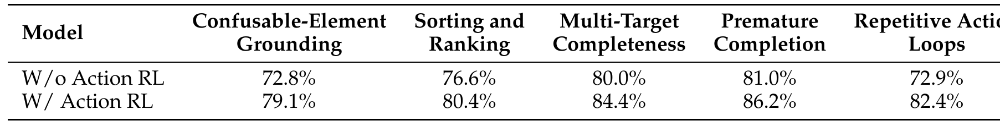

**表 12：Action RL 前后五个错误模式专项测试集上的性能。**

| 模型 | 易混淆元素定位 | 排序与排名 | 多目标完整性 | 过早完成 | 重复动作循环 |
|---|---:|---:|---:|---:|---:|
| 无 Action RL | 72.8% | 76.6% | 80.0% | 81.0% | 72.9% |
| 有 Action RL | 79.1% | 80.4% | 84.4% | 86.2% | 82.4% |

**纠正反复错误模式。** 如表 12 所示，Action RL 在五个错误模式专项测试集上一致提升表现。对于需要从视觉或语义相似候选中选择正确目标的定位任务，成功率提高 6.3%；排序与排名、数量与多目标完整性、过早完成分别提高 3.8%、4.4% 与 5.2%。其对短程动作循环的纠正尤其明显：在需要对多个目标重复操作或导航长滚动界面的任务上，成功率提高 9.5%。这表明模型更能识别近期动作没有造成与任务相关的状态变化，并切换到替代动作。


**图 18：Action RL 案例研究。** SFT 模型导航到账号页，反复点击“分享”图标又返回，陷入无效局部循环。Action RL 后，模型识别自己位于错误页面，转而探索 Mastodon 网页界面，找到正确入口，并以所需设置成功配置目标邀请链接。

图 18 给出一个代表性的 Mastodon 邀请链接案例：Action RL 前的模型反复操作个人资料分享图标，最终达到步骤上限；Action RL 后则识别路径错误，探索替代路径并到达正确配置界面。它体现了步骤级 Action RL 的核心作用：一小段动作未带来有意义进展时，自动构建的“打破循环”样本教会策略修改眼前动作选择，而非坚持无效模式。

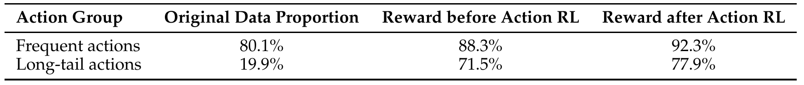

**表 13：高频与长尾动作的性能比较。**

| 动作组 | 原始数据占比 | Action RL 前奖励 | Action RL 后奖励 |
|---|---:|---:|---:|
| 高频动作 | 80.1% | 88.3% | 92.3% |
| 长尾动作 | 19.9% | 71.5% | 77.9% |

**改善长尾动作处理。** GUI 动作轨迹呈高度不均衡分布。`click`、`drag`、`type` 等高频动作占原子动作的 80.1%；`ask_user`、`long_press` 等长尾动作只占 19.9%。尽管频率低，这些动作常是到达特定应用状态或调用专门控件的关键。Pass-$N$ rollout 表明，长尾动作奖励比高频动作低 16.8%，反映其在训练数据中的覆盖有限。因此，Action RL 把训练数据中长尾动作样本占比提高到约 40%，使其奖励提高 6.4%。这说明 Action RL 能选择性增强低频但高影响的动作决策。

### 4.4 Online RL 后的轨迹级行为变化

通过仔细比较不同领域中 Online RL 前后的轨迹，我们识别出三种理想行为模式的涌现。

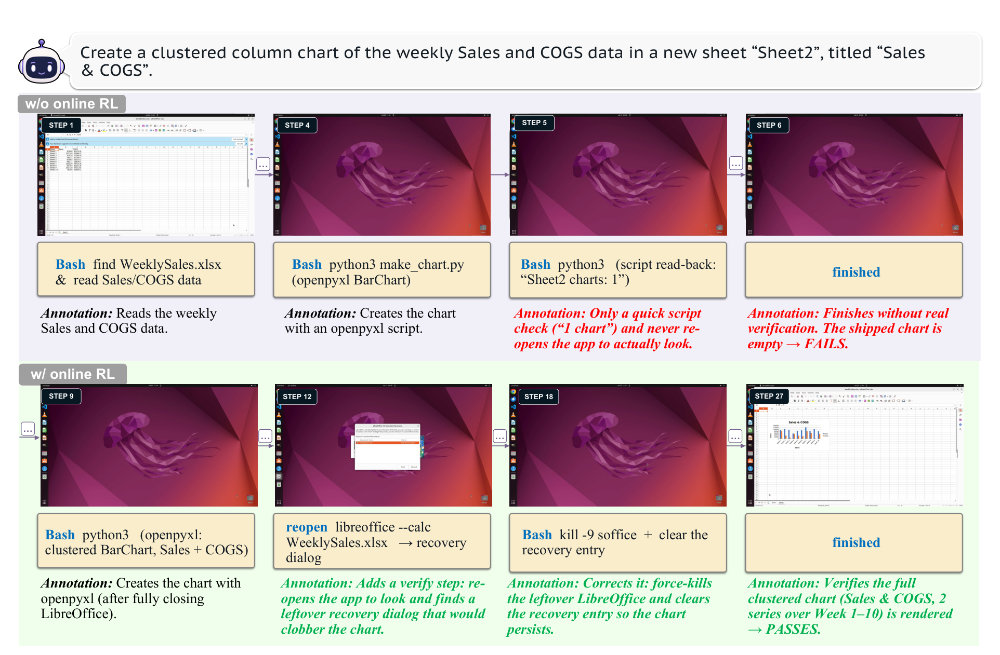

**图 19：Online RL 诱发验证与自我纠正。** 同一任务中，Online RL 策略（下）成功，而 SFT 策略（上）失败：前者重新打开应用检查真实结果，发现问题后在结束前纠正。SFT 策略相信只统计图表数量的表面脚本检查，未查看渲染输出，交付了没有数据序列的空图；RL 策略重新打开文件验证，发现残留应用实例会覆盖图表，移除它以使图表保留，并在终止前确认完整的簇状图已实际渲染。

**从假定成功到经验证完成。** Online RL 前，策略常在最后一次改变状态的动作后立即终止，未经验证就假定任务完成。Online RL 后，策略更常在终止前检查结果状态，并在验证发现执行不完整时恢复。图 19 中，RL 前策略执行一系列 Bash 操作后直接宣告完成；RL 后策略起初沿用相同 Bash 路径，却增加验证步骤，发现部分预期输出没有生成，切换到替代方案并成功完成任务。OSWorld 汇总结果呈现同样趋势：至少包含一次验证动作的轨迹比例提高 14.7%，而错误停止率——自称成功却未通过最终验证器的 episode 比例——下降 11.2%。


**图 20：Online RL 诱发涌现式跨模态行动。** 同一任务中，Online RL 策略（下）成功，SFT 策略（上）失败，因为前者基于视觉观测做决策，并在完成前验证。SFT 策略只从 OCR 文本读收据，把 Cash Out 误认为收入，且不检查便宣告成功；RL 策略打开收据图片进行视觉读取，正确记为支出，再读回电子表格验证后终止。

**Bash 是手，GUI 是眼：涌现式跨模态协作。** Online RL 后，策略从偏重 Bash 转向更均衡地使用 Bash 与 GUI：GUI 动作占比提高 6%，同时使用 GUI 和 Bash 的轨迹比例提高 10.6%。值得注意的是，尽管目标函数未显式要求模态协同，一种有用的跨模态协作模式仍然涌现：策略以 Bash 高效改变状态，再用 GUI 检查效果。与此一致，“执行—验证”转移——改变状态的 Bash 动作后接只读 GUI 检查——的轨迹比例从 40.2% 升至 52.4%。

图 20 中，Online RL 前策略只依赖 Bash 执行，在缺少视觉信息时无法区分收入与支出，给结果引入错误；RL 后策略以 Bash 高效执行，再用 GUI 打开各收据进行视觉检查，从而区分相关条目并正确完成任务。这个跨模态闭环把高效执行与可靠反馈结合起来：Bash 充当手，GUI 充当眼。

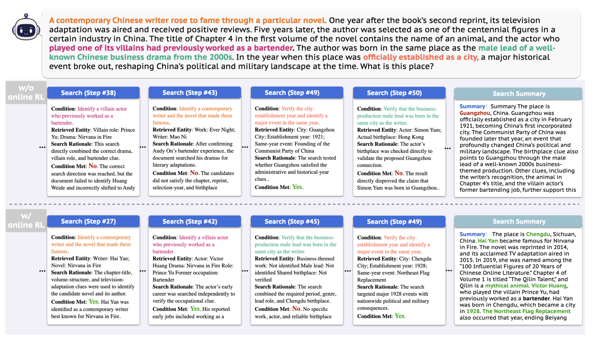

**图 21：Online RL 改进长时程搜索与核验。** 没有 Online RL 时，模型沿着错误实体关联得到无依据的答案“广州”；有 Online RL 时，它识别出海岩、《琅琊榜》、黄维德和成都之间的关键链条。

**在长时程中维持约束。** 长时程任务往往在主要目标之外附带数量、格式、范围与排除项等约束。比较 Online RL 前后行为，我们发现策略能更可靠地在整个执行过程中保留指令早期引入的约束。在两项基准上，满足全部指令约束的任务比例分别在 OSWorld 提高 8.6%，在 BrowseComp-ZH 提高 7.5%。图 21 展示一个包含四项约束的 BrowseComp-ZH 案例：策略从只满足一项约束并得出错误结论，转为保留并联合应用全部四项约束，最终得到正确答案。

## 5 相关工作

移动端使用、浏览器使用和计算机使用领域的近期 GUI 智能体工作，越来越偏向原生多模态策略而非仅靠提示词的编排，并更多使用自演进数据引擎、在线强化学习与结构化记忆（Seed, 2025；Zhou et al., 2025a；Gao et al., 2026；He et al., 2024；Wang et al., 2025b；Huang et al., 2026）。该领域也正从只优化基准，走向关注真实设备执行、隐私、运行可靠性、安全与时延等实际部署问题（Cao et al., 2026；Qin et al., 2025；Zhou et al., 2025a；Huang et al., 2026）。

**移动端使用。** 近期移动智能体工作逐渐超越基于截图的动作预测，转向带记忆、反思、RL 与智能体 harness 的更强系统。Mobile-Agent-v3.5（Xu et al., 2026）与 UI-Venus-1.5（Gao et al., 2026）把统一 GUI 模型扩展到多种平台和任务。Step-GUI（Yan et al., 2025）与 UI-TARS-2（Wang et al., 2025a）研究数据飞轮和多轮 RL，通过迭代交互提高智能体能力。MAI-UI（Zhou et al., 2025a）探索混合 GUI-MCP 操作和端—云协同；Xiaomi-GUI-0（Cao et al., 2026）研究捕获状态动态的真实设备闭环训练。现有移动智能体评测主要关注三方面：定位能力，例如 ScreenSpot-Pro（Li et al., 2025a）；受控环境中的交互式任务完成，例如 AndroidWorld（Rawles et al., 2024）；以及 MobileWorld（Kong et al., 2026）、AndroidDaily（Sui et al., 2026）、RealMobile（Cao et al., 2026）等更真实的日常使用场景。

**浏览器使用。** 与移动智能体相比，浏览器智能体还可以利用 DOM 树、无障碍树和浏览器 API 等结构化信息。WebVoyager（He et al., 2024）、SeeAct（Zheng et al., 2024）等早期研究表明，多模态 LLM 可将视觉理解与浏览器动作结合，完成端到端网页导航。OpenAI Operator（OpenAI, 2025）、Google Project Mariner（Google, 2025）、UI-TARS（Seed, 2025）等近期项目进一步把网页智能体扩展到复杂网站和多种数字环境的自主交互。WebWorld（Xiao et al., 2026）、WebEvolver（Fang et al., 2025）等研究还探索基于世界模型的网页智能体方法。网页智能体评测也从短时程页面导航，演进到跨多个网站、目标复杂的真实长时程工作流（Zhou et al., 2024；Xue et al., 2025；Jang et al., 2026）。

**计算机使用。** 计算机使用智能体（CUA）旨在实现对桌面环境的通用交互，覆盖多种软件和效率应用。相较移动与网页智能体，CUA 的动作空间明显更大，交互状态更多样，时程更长，因此可靠定位和执行验证尤为关键。UI-TARS（Qin et al., 2025）、DART-GUI（Li et al., 2025b）、OpenCUA（Wang et al., 2025b）、UltraCUA（Yang et al., 2025b）、EvoCUA（Huang et al., 2026）等近期工作利用多模态预训练、大规模交互数据和智能体推理，研究可扩展 GUI 基础模型。近期 CUA 基准越来越强调稳健性、可扩展性和真实部署挑战。OSWorld-Verified 通过更严格的验证协议和更少的成功判断歧义提高评测可靠性（Xie et al., 2024）；OSWorld-v2 则进一步扩展到更复杂的长时程工作流和多种真实计算机任务（Yuan et al., 2026）。

## 6 结论

本文提出 Qwen-UI-Agent，一个以真实世界为中心的基础 GUI 智能体。在“智能体应能运行于真实设备、跨平台维持工作流、结合 GUI 与 CLI 执行并主动发起有用服务”的愿景引导下，Qwen-UI-Agent 集成了：可扩展沙箱环境与稳健真实设备移动运行时；统一 GUI+CLI 动作空间；智能体驱动的数据飞轮；结合 SFT、Action RL 和 Online RL 的训练框架；以及用于主动发起服务和跨平台任务执行的 harness 层。

实证上，Qwen-UI-Agent 在 MobileWorld、MobileWorld-Real、AndroidDaily 上分别达到 **82.1%**、**92.2%** 和 **97.5%**；在 OSWorld-Verified 上达到 **79.5%**，在 OSWorld-v2 上达到 **40.0%**。它还在浏览器使用、DeepSearch 和 GUI 定位上取得领先或有竞争力的性能，同时保留强通用推理与智能体能力。这些结果共同支持一种 GUI 智能体系统观：围绕真实世界使用需求，协同设计模型、环境、数据飞轮、训练和 harness。

## 7 局限与未来方向

**局限。**

第一，我们使用 AutoJudge 评测真实设备移动轨迹，而非确定性验证器或人工专家逐条检查。由于第三方应用内部状态的访问受限，物理手机上通常无法使用确定性的状态验证；而人工裁决 Qwen-UI-Agent 与十个基线的轨迹需要大量专家投入，也会引入标注者间差异。为保持比较一致，所有系统均采用相同 AutoJudge 协议。在 666 个由专家独立检查的样本上，AutoJudge 的完全匹配准确率为 92.8%；但剩余错误仍可能给已报告的真实设备结果带来轻微不确定性。

第二，本技术报告发布时，35B-A3B 规模的 CUA 与 DeepSearch 训练仍在进行，因此未包含相应结果。作者计划在结果可用后更新 arXiv 版本。

第三，除本文描述的真实设备环境外，更接近真实应用的高保真合成环境是缩小模拟到真实差距的另一条路径。作者已经构建此类环境，但尚未把它用于本报告模型的训练，因此当前报告未介绍该组成部分；未来将开源环境合成方法。

第四，作者尝试完全自动化 GUI 能力开发，但发现当前基础模型尚无法可靠管理整个过程。因此，当前流水线是“智能体驱动”而非“完全自主”，仍需要相当多人工监督和介入来监控进度、纠正错误。

**未来方向。** 随着 GUI 智能体走向可靠、实用的真实世界使用，作者认为以下方向值得进一步研究：

- **高效 GUI 执行。** GUI 智能体已经能直接在真实设备上完成越来越复杂的工作流，但能力本身并不够。执行效率，尤其是交互时延，仍是实际应用的主要障碍。每个 GUI 步骤通常需要新观测、模型推理和环境转移，时延会沿长轨迹累积。移动端与桌面的虚拟显示机制能通过后台或并行执行部分缓解，却无法消除“感知—推理—动作”循环每一步的根本成本。通过更快推理、自适应观测、异步执行和减少交互轮次来降低成本，仍是走向真实应用的关键。

- **Harness 辅助的长时程工作流。** 混合 GUI+CLI 动作空间和批量动作提高执行效率，Online RL 增强长轨迹决策。一个互补方向是进一步利用 harness，在模型之外提供长时程支持。上下文压缩、任务分解、记忆管理、进度跟踪和结构化工具使用等 harness 级设计，可以从另一角度提高长时程工作流的效率与可靠性。

- **大规模跨领域 Online RL。** 长时程 GUI 任务使 Online RL 成本很高，因为 rollout 缓慢且长度不一，奖励常稀疏或延迟。未来应为这些设置开发更高效、稳定的训练策略，并在浏览器、移动端和计算机使用环境间联合训练，提高数据效率与跨领域泛化（Wang et al., 2025a；Hou et al., 2026）。

- **可扩展的高保真环境合成。** 真实设备环境提供最忠实的交互动态，却难以低成本扩展、重置和验证。高保真合成环境可作为互补路径：以能够大规模生成、控制的形式逼近真实应用行为。可扩展地合成这种环境，对于缩小模拟—真实差距和扩展真实世界导向的训练很重要。作者已构建此类环境，但未能及时完成其与本报告模型训练的集成，未来将开源环境合成方法。

- **安全、用户控制与个性化。** 随着 GUI 智能体能够跨应用、跨设备操作，确保其动作安全且受用户控制越来越重要。本文包含安全敏感训练场景，教模型在需要额外输入或授权时调用用户交互动作并把控制权交回用户。更系统的安全评测、安全导向训练目标，以及用可解释性理解并约束智能体行为的方法仍很重要。个性化同样是改善真实用户体验的关键。主动服务 harness 提供了初步探索，但如何构建有用的用户记忆与画像、以可靠信息源为依据，并让用户控制保留哪些信息，都值得进一步研究。

> 原文此处将安全相关动作写作 `call_user`，而第 2.1.2 节正式动作空间使用 `ask_user`；译文保留这一原文命名差异并予以说明。

## 8 贡献

### 核心贡献者

Hanzhang Zhou\*、Panrong Tong\*、Xu Zhang\*、Quyu Kong、Chenglin Cai、Tianyu Xia、Gongjie Zhang、Jianan Zhang、Long Li、Long Chen、Lei Wang、Gaole Dai、Pengxiang Li、Liangyu Chen、Yue Wang†、Steven Hoi。

### 贡献者

Hongliang Lu、Miaoyi Zhou、Chen Liu、Yuchen Sun、Yucheng Zhao、Yiran Zhong、Jiahui Zeng、Minggang Wu、Zhixiang Ma、Shaoshun Huang、Shuaihao Zhang。

\* 项目联合负责人。† 项目负责人。

## 参考文献

> 参考文献属于书目信息，以下按论文原始 `main.bbl` 完整保留（共 79 条），不翻译题名，以避免专名与出版信息失真。

```latex
\begin{thebibliography}{79}
\providecommand{\natexlab}[1]{#1}
\providecommand{\url}[1]{\texttt{#1}}
\expandafter\ifx\csname urlstyle\endcsname\relax
  \providecommand{\doi}[1]{doi: #1}\else
  \providecommand{\doi}{doi: \begingroup \urlstyle{rm}\Url}\fi

\bibitem[{Anthropic}(2026)]{anthropic2026claudeopus48}
{Anthropic}.
\newblock Introducing {Claude Opus 4.8}.
\newblock \url{https://www.anthropic.com/news/claude-opus-4-8}, May 2026.
\newblock Accessed: 2026-07-19.

\bibitem[{Apodex Team}(2026)]{apodex2026}
{Apodex Team}.
\newblock {Apodex-1.0}: A verification-centric agent team for discoverative intelligence.
\newblock Technical report, Apodex, 2026.
\newblock URL \url{https://www.apodex.com/blog/apodex-1.0}.

\bibitem[Barres et~al.(2025)Barres, Dong, Ray, Si, and Narasimhan]{tau2bench}
Victor Barres, Honghua Dong, Soham Ray, Xujie Si, and Karthik Narasimhan.
\newblock $\tau^2$-{Bench}: Evaluating conversational agents in a dual-control environment.
\newblock \emph{arXiv preprint arXiv:2506.07982}, 2025.
\newblock URL \url{https://arxiv.org/abs/2506.07982}.

\bibitem[{ByteDance Seed}(2026{\natexlab{a}})]{bytedanceseed2026seed20}
{ByteDance Seed}.
\newblock {Seed2.0}.
\newblock \url{https://seed.bytedance.com/en/seed2}, February 2026{\natexlab{a}}.
\newblock Released: 2026-02-14.

\bibitem[{ByteDance Seed}(2026{\natexlab{b}})]{bytedanceseed2026seed21}
{ByteDance Seed}.
\newblock {Seed2.1} officially released: Advancing {AI} productivity.
\newblock \url{https://seed.bytedance.com/en/blog/seed2-1-officially-released-advancing-ai-productivity}, June 2026{\natexlab{b}}.
\newblock Accessed: 2026-07-19.

\bibitem[Cao et~al.(2026)Cao, Duan, Fu, Gao, Lian, Liu, Liu, Qu, Wu, Yu, et~al.]{cao2026xiaomi}
Wanxia Cao, Chengzhen Duan, Pei Fu, Pengzhi Gao, Niu Lian, Fazhan Liu, Hui Liu, Heng Qu, Qinzhuo Wu, Zhehao Yu, et~al.
\newblock Xiaomi-gui-0 technical report.
\newblock \emph{arXiv preprint arXiv:2606.31410}, 2026.

\bibitem[Chen et~al.(2025)Chen, Zhou, Cai, Zhang, Tong, Kong, Zhang, Liu, Liu, Wang, et~al.]{uiins}
Liangyu Chen, Hanzhang Zhou, Chenglin Cai, Jianan Zhang, Panrong Tong, Quyu Kong, Xu~Zhang, Chen Liu, Yuqi Liu, Wenxuan Wang, et~al.
\newblock Ui-ins: Enhancing gui grounding with multi-perspective instruction-as-reasoning.
\newblock \emph{arXiv preprint arXiv:2510.20286}, 2025.

\bibitem[DeepMind(2025)]{gemini3pro}
Google DeepMind.
\newblock Gemini 3 pro, 2025.
\newblock URL \url{https://deepmind.google/models/gemini/pro/}.

\bibitem[{DeepSeek-AI}(2025)]{deepseekv32}
{DeepSeek-AI}.
\newblock {DeepSeek-V3.2}: Pushing the frontier of open large language models.
\newblock \emph{arXiv preprint arXiv:2512.02556}, 2025.
\newblock URL \url{https://arxiv.org/abs/2512.02556}.

\bibitem[Fang et~al.(2025)Fang, Zhang, Zhang, Ma, Yu, Mi, and Yu]{fang2025webevolver}
Tianqing Fang, Hongming Zhang, Zhisong Zhang, Kaixin Ma, Wenhao Yu, Haitao Mi, and Dong Yu.
\newblock Webevolver: Enhancing web agent self-improvement with co-evolving world model.
\newblock In \emph{Proceedings of the 2025 Conference on Empirical Methods in Natural Language Processing}, pp.\  8970--8986, 2025.

\bibitem[Gao et~al.(2026)Gao, Gu, Liu, Qiu, Shen, Wen, Xia, Xu, Zeng, Zhou, Zhou, Chen, Dai, Dou, Gong, Guo, Guo, Li, Li, Lin, Zhou, Zhu, Chen, Guo, Meng, and Wang]{uivenus15}
Changlong Gao, Zhangxuan Gu, Yulin Liu, Xinyu Qiu, Shuheng Shen, Yue Wen, Tianyu Xia, Zhenyu Xu, Zhengwen Zeng, Beitong Zhou, Xingran Zhou, Weizhi Chen, Sunhao Dai, Jingya Dou, Yichen Gong, Yuan Guo, Zhenlin Guo, Feng Li, Qian Li, Jinzhen Lin, Yuqi Zhou, Linchao Zhu, Liang Chen, Zhenyu Guo, Changhua Meng, and Weiqiang Wang.
\newblock {UI-Venus-1.5 Technical Report}.
\newblock \emph{arXiv preprint arXiv:2602.09082}, 2026.
\newblock URL \url{https://arxiv.org/abs/2602.09082}.

\bibitem[{Genymobile}(2018)]{scrcpy}
{Genymobile}.
\newblock scrcpy: Display and control your {Android} device.
\newblock \url{https://github.com/Genymobile/scrcpy}, 2018.
\newblock Accessed: 2026-07-28.

\bibitem[{Google}(2025)]{google_mariner}
{Google}.
\newblock Project mariner.
\newblock \url{https://labs.google.com/mariner/landing/}, 2025.

\bibitem[{Google}(2026{\natexlab{a}})]{google2026gemini31pro}
{Google}.
\newblock {Gemini 3.1 Pro Preview}.
\newblock \url{https://ai.google.dev/gemini-api/docs/models/gemini-3.1-pro-preview}, February 2026{\natexlab{a}}.
\newblock Google AI for Developers; accessed: 2026-07-19.

\bibitem[{Google}(2026{\natexlab{b}})]{google2026gemini35flash}
{Google}.
\newblock {Gemini 3.5 Flash}.
\newblock \url{https://ai.google.dev/gemini-api/docs/models/gemini-3.5-flash}, May 2026{\natexlab{b}}.
\newblock Google AI for Developers; accessed: 2026-07-19.

\bibitem[He et~al.(2024)He, Yao, Ma, Yu, Dai, Zhang, Lan, and Yu]{webvoyager}
Hongliang He, Wenlin Yao, Kaixin Ma, Wenhao Yu, Yong Dai, Hongming Zhang, Zhenzhong Lan, and Dong Yu.
\newblock Webvoyager: Building an end-to-end web agent with large multimodal models, 2024.
\newblock URL \url{https://arxiv.org/abs/2401.13919}.

\bibitem[Hou et~al.(2026)Hou, Li, Tang, and Dong]{hou2026single}
Zhenyu Hou, Yujiang Li, Jie Tang, and Yuxiao Dong.
\newblock Single-rollout asynchronous optimization for agentic reinforcement learning.
\newblock \emph{arXiv preprint arXiv:2607.07508}, 2026.

\bibitem[Hu et~al.(2026)Hu, Zhang, Xu, Qiao, Yang, Huang, Shao, Yan, and Ye]{toolcua2026}
Xuhao Hu, Xi~Zhang, Haiyang Xu, Kyle Qiao, Jingyi Yang, Xuanjing Huang, Jing Shao, Ming Yan, and Jieping Ye.
\newblock {ToolCUA}: Towards optimal {GUI}-tool path orchestration for computer use agents.
\newblock \emph{arXiv preprint arXiv:2605.12481}, 2026.
\newblock URL \url{https://arxiv.org/abs/2605.12481}.

\bibitem[Huang et~al.(2026)Huang, Xue, Peng, Ding, Fan, Hong, Gao, Zhang, Guo, Yang, et~al.]{evocua15}
Mianqiu Huang, Taofeng Xue, Chong Peng, Jinrui Ding, Sicheng Fan, Jiale Hong, Yufei Gao, Xiaocheng Zhang, Linsen Guo, Xin Yang, et~al.
\newblock Evocua-1.5: Online reinforcement learning for multi-turn computer-use agents.
\newblock \emph{arXiv preprint arXiv:2607.09773}, 2026.

\bibitem[Jang et~al.(2026)Jang, Koh, Fried, and Salakhutdinov]{jang2026odysseys}
Lawrence~Keunho Jang, Jing~Yu Koh, Daniel Fried, and Ruslan Salakhutdinov.
\newblock Odysseys: Benchmarking web agents on realistic long horizon tasks.
\newblock \emph{arXiv preprint arXiv:2604.24964}, 2026.

\bibitem[{Jina AI}(2024)]{jinareader}
{Jina AI}.
\newblock Jina reader: Converting {URL}s to {LLM}-friendly input.
\newblock \url{https://jina.ai/reader}, 2024.
\newblock Accessed: 2026-07-28.

\bibitem[Kembhavi et~al.(2016)Kembhavi, Salvato, Kolve, Seo, Hajishirzi, and Farhadi]{ai2d}
Aniruddha Kembhavi, Mike Salvato, Eric Kolve, Minjoon Seo, Hannaneh Hajishirzi, and Ali Farhadi.
\newblock A diagram is worth a dozen images.
\newblock In \emph{European Conference on Computer Vision (ECCV)}, pp.\  235--251, 2016.
\newblock URL \url{https://arxiv.org/abs/1603.07396}.

\bibitem[{Kimi Team}(2026)]{kimik25}
{Kimi Team}.
\newblock {Kimi K2.5}: Visual agentic intelligence.
\newblock \url{https://www.kimi.com/blog/kimi-k2-5.html}, 2026.
\newblock Accessed: 2026-07-21.

\bibitem[Kong et~al.(2026)Kong, Zhang, Yang, Gao, Liu, Tong, Cai, Zhou, Zhang, Chen, et~al.]{kong2026mobileworld}
Quyu Kong, Xu~Zhang, Zhenyu Yang, Nolan Gao, Chen Liu, Panrong Tong, Chenglin Cai, Hanzhang Zhou, Jianan Zhang, Liangyu Chen, et~al.
\newblock Mobileworld: Benchmarking autonomous mobile agents in agent-user interactive and mcp-augmented environments.
\newblock In \emph{Proceedings of the 64th Annual Meeting of the Association for Computational Linguistics (Volume 1: Long Papers)}, pp.\  6142--6167, 2026.

\bibitem[Li et~al.(2026{\natexlab{a}})Li, Fang, Tang, Lyu, Zhou, Lai, Tang, Wu, Guo, Wang, Li, Zhang, Ding, Shen, Fan, Peng, Ruan, Zhang, Wang, Zhang, and Hu]{phoneharness2026}
Chenxin Li, Zhengyao Fang, Zhengyang Tang, Pengyuan Lyu, Xingran Zhou, Xin Lai, Fei Tang, Liang Wu, Yiduo Guo, Weinong Wang, Junyi Li, Yi~Zhang, Yang Ding, Huawen Shen, Sunqi Fan, Shangpin Peng, Zheng Ruan, Anran Zhang, Benyou Wang, Chengquan Zhang, and Han Hu.
\newblock {PhoneHarness}: Harnessing phone-use agents through mixed {GUI}, {CLI}, and tool actions.
\newblock \emph{arXiv preprint arXiv:2606.14832}, 2026{\natexlab{a}}.
\newblock URL \url{https://arxiv.org/abs/2606.14832}.

\bibitem[Li et~al.(2025{\natexlab{a}})Li, Ziyang, Lin, Luo, Tian, Ma, Huang, and Chua]{li2025screenspotpro}
Kaixin Li, Meng Ziyang, Hongzhan Lin, Ziyang Luo, Yuchen Tian, Jing Ma, Zhiyong Huang, and Tat-Seng Chua.
\newblock Screenspot-pro: {GUI} grounding for professional high-resolution computer use.
\newblock In \emph{Workshop on Reasoning and Planning for Large Language Models}, 2025{\natexlab{a}}.
\newblock URL \url{https://openreview.net/forum?id=XaKNDIAHas}.

\bibitem[Li et~al.(2025{\natexlab{b}})Li, Hu, Shang, Wu, Liu, Liu, Gao, Shi, Zhang, Zhang, Shi, Yu, Wu, Wu, Jia, Xiang, He, and Li]{li2025dart}
Pengxiang Li, Zechen Hu, Zirui Shang, Jingrong Wu, Yang Liu, Hui Liu, Zhi Gao, Chenrui Shi, Bofei Zhang, Zihao Zhang, Xiaochuan Shi, Zedong Yu, Yuwei Wu, Xinxiao Wu, Yunde Jia, Liuyu Xiang, Zhaofeng He, and Qing Li.
\newblock Efficient multi-turn rl for gui agents via decoupled training and adaptive data curation.
\newblock \emph{arXiv preprint arXiv:2509.23866}, 2025{\natexlab{b}}.

\bibitem[Li et~al.(2026{\natexlab{b}})Li, Chen, Liu, Zheng, Chen, He, Li, You, Shen, Sun, et~al.]{skillsbench}
Xiangyi Li, Wenbo Chen, Yimin Liu, Shenghan Zheng, Xiaokun Chen, Yifeng He, Yubo Li, Bingran You, Haotian Shen, Jiankai Sun, et~al.
\newblock {SkillsBench}: Benchmarking how well agent skills work across diverse tasks.
\newblock \emph{arXiv preprint arXiv:2602.12670}, 2026{\natexlab{b}}.
\newblock URL \url{https://arxiv.org/abs/2602.12670}.

\bibitem[Lian et~al.(2026)Lian, Chen, Yu, Duan, Liu, Liu, Fu, Luan, Wang, Xia, and Wang]{uimopd2026}
Niu Lian, Alan Chen, Zhehao Yu, Chengzhen Duan, Fazhan Liu, Hui Liu, Pei Fu, Jian Luan, Yaowei Wang, Shu-Tao Xia, and Jinpeng Wang.
\newblock {UI-MOPD}: Multi-platform on-policy distillation for continual {GUI} agent learning.
\newblock \emph{arXiv preprint arXiv:2607.04425}, 2026.
\newblock URL \url{https://arxiv.org/abs/2607.04425}.

\bibitem[Liu et~al.(2026)Liu, Chen, Zhou, Chen, Cai, Yu, Hoi, and Wang]{liu2026forwardbeatstwoinnerzoom}
Chen Liu, Ling Chen, Hanzhang Zhou, Liangyu Chen, Chenglin Cai, Xin Yu, Steven Hoi, and Yue Wang.
\newblock One forward beats two: Innerzoom for accurate and efficient gui grounding, 2026.
\newblock URL \url{https://arxiv.org/abs/2606.30084}.

\bibitem[Merrill et~al.(2026)Merrill, Shaw, Carlini, Li, Raj, Bercovich, Shi, Shin, Walshe, Buchanan, et~al.]{terminalbench}
Mike~A. Merrill, Alexander~G. Shaw, Nicholas Carlini, Boxuan Li, Harsh Raj, Ivan Bercovich, Lin Shi, Jeong~Yeon Shin, Thomas Walshe, E.~Kelly Buchanan, et~al.
\newblock {Terminal-Bench}: Benchmarking agents on hard, realistic tasks in command line interfaces.
\newblock \emph{arXiv preprint arXiv:2601.11868}, 2026.
\newblock URL \url{https://arxiv.org/abs/2601.11868}.

\bibitem[{Microsoft}(2020)]{playwright}
{Microsoft}.
\newblock Playwright: Fast and reliable end-to-end testing for modern web apps.
\newblock \url{https://playwright.dev}, 2020.
\newblock Accessed: 2026-07-28.

\bibitem[{MiniMax}(2026)]{minimax2026m3}
{MiniMax}.
\newblock {MiniMax M3}: Frontier coding, 1m context, native multimodality.
\newblock \url{https://www.minimax.io/blog/minimax-m3}, June 2026.
\newblock Accessed: 2026-07-19.

\bibitem[{Moonshot AI}(2026)]{moonshot2026kimik26}
{Moonshot AI}.
\newblock {Kimi K2.6}: Advancing open-source coding.
\newblock \url{https://www.kimi.com/blog/kimi-k2-6}, April 2026.
\newblock Accessed: 2026-07-19.

\bibitem[Nayak et~al.(2025)Nayak, Jian, Lin, Rodriguez, Kalsi, Awal, Chapados, Özsu, Agrawal, Vazquez, Pal, Taslakian, Gella, and Rajeswar]{ui_vision}
Shravan Nayak, Xiangru Jian, Kevin~Qinghong Lin, Juan~A. Rodriguez, Montek Kalsi, Rabiul Awal, Nicolas Chapados, M.~Tamer Özsu, Aishwarya Agrawal, David Vazquez, Christopher Pal, Perouz Taslakian, Spandana Gella, and Sai Rajeswar.
\newblock Ui-vision: A desktop-centric gui benchmark for visual perception and interaction, 2025.
\newblock URL \url{https://arxiv.org/abs/2503.15661}.

\bibitem[{OpenAI}(2025)]{openai_operator}
{OpenAI}.
\newblock Introducing operator.
\newblock \url{https://openai.com/index/introducing-operator/}, 2025.

\bibitem[{OpenAI}(2026{\natexlab{a}})]{openai2026gpt55}
{OpenAI}.
\newblock {GPT-5.5} system card.
\newblock \url{https://deploymentsafety.openai.com/gpt-5-5}, April 2026{\natexlab{a}}.
\newblock Accessed: 2026-07-19.

\bibitem[{OpenAI}(2026{\natexlab{b}})]{openai2026gpt56}
{OpenAI}.
\newblock {GPT-5.6}: Frontier intelligence that scales with your ambition.
\newblock \url{https://openai.com/index/gpt-5-6/}, July 2026{\natexlab{b}}.
\newblock Accessed: 2026-07-20.

\bibitem[{OpenClaw Contributors}(2026)]{openclaw2026}
{OpenClaw Contributors}.
\newblock {OpenClaw}: Personal ai assistant.
\newblock GitHub repository, 2026.
\newblock URL \url{https://github.com/openclaw/openclaw}.
\newblock Accessed: 2026-07-20.

\bibitem[Patil et~al.(2025)Patil, Mao, Yan, Ji, Suresh, Stoica, and Gonzalez]{bfcl}
Shishir~G. Patil, Huanzhi Mao, Fanjia Yan, Charlie Cheng-Jie Ji, Vishnu Suresh, Ion Stoica, and Joseph~E. Gonzalez.
\newblock The {Berkeley} function calling leaderboard ({BFCL}): From tool use to agentic evaluation of large language models.
\newblock In \emph{Proceedings of the 42nd International Conference on Machine Learning (ICML)}, 2025.
\newblock BFCL-v4 leaderboard: \url{https://gorilla.cs.berkeley.edu/leaderboard.html}.

\bibitem[Qin et~al.(2025)Qin, Ye, Fang, Wang, Liang, Tian, Zhang, Li, Li, Huang, et~al.]{uitars}
Yujia Qin, Yining Ye, Junjie Fang, Haoming Wang, Shihao Liang, Shizuo Tian, Junda Zhang, Jiahao Li, Yunxin Li, Shijue Huang, et~al.
\newblock Ui-tars: Pioneering automated gui interaction with native agents.
\newblock \emph{arXiv preprint arXiv:2501.12326}, 2025.

\bibitem[{Qwen Team}(2026{\natexlab{a}})]{qwen2026qwen37plus}
{Qwen Team}.
\newblock {Qwen3.7-Plus}: Multimodal agent intelligence.
\newblock \url{https://qwen.ai/blog?id=qwen3.7-plus}, May 2026{\natexlab{a}}.
\newblock Accessed: 2026-07-19.

\bibitem[{Qwen Team}(2026{\natexlab{b}})]{qwen3.5}
{Qwen Team}.
\newblock {Qwen3.5}: Towards native multimodal agents, February 2026{\natexlab{b}}.
\newblock URL \url{https://qwen.ai/blog?id=qwen3.5}.

\bibitem[{Qwen Team} \& {Data Team, Alibaba Group}(2026){Qwen Team} and {Data Team, Alibaba Group}]{qwenclawbench}
{Qwen Team} and {Data Team, Alibaba Group}.
\newblock {QwenClawBench}: Real-user-distribution benchmark for {OpenClaw} agents.
\newblock \url{https://github.com/SKYLENAGE-AI/QwenClawBench}, April 2026.
\newblock Accessed: 2026-07-24.

\bibitem[Rawles et~al.(2024)Rawles, Clinckemaillie, Chang, Waltz, Lau, Fair, Li, Bishop, Li, Campbell-Ajala, Toyama, Berry, Tyamagundlu, Lillicrap, and Riva]{android_world}
Christopher Rawles, Sarah Clinckemaillie, Yifan Chang, Jonathan Waltz, Gabrielle Lau, Marybeth Fair, Alice Li, William Bishop, Wei Li, Folawiyo Campbell-Ajala, Daniel Toyama, Robert Berry, Divya Tyamagundlu, Timothy Lillicrap, and Oriana Riva.
\newblock Androidworld: A dynamic benchmarking environment for autonomous agents, 2024.
\newblock URL \url{https://arxiv.org/abs/2405.14573}.

\bibitem[{Remote Android Project}(2024)]{redroid}
{Remote Android Project}.
\newblock Redroid: A multi-arch, gpu-enabled android in cloud container solution.
\newblock \url{https://github.com/remote-android/redroid-doc}, 2024.

\bibitem[Seed(2025)]{ui-tars-15}
ByteDance Seed.
\newblock Ui-tars-1.5.
\newblock \url{https://seed-tars.com/1.5}, 2025.

\bibitem[{Serper}(2023)]{serper}
{Serper}.
\newblock Serper: Google search {API}.
\newblock \url{https://serper.dev}, 2023.
\newblock Accessed: 2026-07-28.

\bibitem[Shen et~al.(2026)Shen, Tang, Peng, Wu, Zhang, Wang, Guo, Li, Fang, Ding, Li, Tang, Ruan, Zhang, Zhou, Yang, Fan, Wan, Hu, Lai, Lyu, and Zhang]{hymobileagent}
Huawen Shen, Zhengyang Tang, Shangpin Peng, Liang Wu, Anran Zhang, Weinong Wang, Yiduo Guo, Chenxin Li, Zhengyao Fang, Yang Ding, Junyi Li, Fei Tang, Zheng Ruan, Yi~Zhang, Xingran Zhou, Dingchen Yang, Sunqi Fan, Zhiyi Wan, Han Hu, Xin Lai, Pengyuan Lyu, and Chengquan Zhang.
\newblock {HyMobileAgent: Data-Environment Co-Scaling for Efficient GUI Agents}.
\newblock \emph{arXiv preprint arXiv:2607.14548}, 2026.
\newblock URL \url{https://arxiv.org/abs/2607.14548}.

\bibitem[Sui et~al.(2026)Sui, Huang, Li, Xu, Lv, Yan, Shen, Liu, Fan, Meng, et~al.]{androiddaily}
Yifan Sui, Xin Huang, Hongbing Li, Fang Xu, Jiahe Lv, Haolong Yan, Yeqing Shen, Litao Liu, Zhimin Fan, Ziyang Meng, et~al.
\newblock Androiddaily: A verifiable benchmark for mobile gui agents on real-world closed-source applications.
\newblock \emph{arXiv preprint arXiv:2605.27761}, 2026.

\bibitem[Tang et~al.(2026)Tang, Lai, Lyu, Wang, Bai, Li, Guo, Shen, Liu, Li, Fang, Ding, Zhang, Wang, Zhou, Wu, Tang, Fan, Peng, Ruan, Zhang, Wang, Wen, Yan, Zhang, and Hu]{tang2026phonebuddytrainingopenmodels}
Zhengyang Tang, Xin Lai, Pengyuan Lyu, Xinyuan Wang, Tianyi Bai, Chenxin Li, Yiduo Guo, Huawen Shen, Yuxuan Liu, Junyi Li, Zhengyao Fang, Yang Ding, Yi~Zhang, Weinong Wang, Xingran Zhou, Liang Wu, Fei Tang, Sunqi Fan, Shangpin Peng, Zheng Ruan, Anran Zhang, Benyou Wang, Ji-Rong Wen, Rui Yan, Chengquan Zhang, and Han Hu.
\newblock Phonebuddy: Training open models for agentic phone use, 2026.
\newblock URL \url{https://arxiv.org/abs/2606.23049}.

\bibitem[{Tongyi DeepResearch}(2025)]{tongyidr}
{Tongyi DeepResearch}.
\newblock Tongyi {DeepResearch} technical report.
\newblock \emph{arXiv preprint arXiv:2510.24701}, 2025.
\newblock URL \url{https://arxiv.org/abs/2510.24701}.

\bibitem[Wang et~al.(2026)Wang, Lu, Wang, Bai, Liu, Zhang, Wang, Hu, Xie, Bai, Liu, Shen, Lin, and Yu]{cuagym}
Bowen Wang, Dunjie Lu, Junli Wang, Tianyi Bai, Shixuan Liu, Zhipeng Zhang, Haiquan Wang, Hao Hu, Tianbao Xie, Shuai Bai, Dayiheng Liu, Que Shen, Junyang Lin, and Tao Yu.
\newblock {CUA-GYM}: Scaling verifiable training environments and tasks for computer-use agents.
\newblock \emph{arXiv preprint arXiv:2605.25624}, 2026.
\newblock URL \url{https://arxiv.org/abs/2605.25624}.

\bibitem[Wang et~al.(2025{\natexlab{a}})Wang, Zou, Song, Feng, Fang, Lu, Liu, Luo, Liang, Huang, et~al.]{uitars2}
Haoming Wang, Haoyang Zou, Huatong Song, Jiazhan Feng, Junjie Fang, Junting Lu, Longxiang Liu, Qinyu Luo, Shihao Liang, Shijue Huang, et~al.
\newblock Ui-tars-2 technical report: Advancing gui agent with multi-turn reinforcement learning.
\newblock \emph{arXiv preprint arXiv:2509.02544}, 2025{\natexlab{a}}.

\bibitem[Wang et~al.(2024{\natexlab{a}})Wang, Pan, Shi, Lu, Zhan, and Li]{mathvision}
Ke~Wang, Junting Pan, Weikang Shi, Zimu Lu, Mingjie Zhan, and Hongsheng Li.
\newblock Measuring multimodal mathematical reasoning with {MATH-Vision} dataset.
\newblock \emph{arXiv preprint arXiv:2402.14804}, 2024{\natexlab{a}}.
\newblock URL \url{https://arxiv.org/abs/2402.14804}.

\bibitem[Wang et~al.(2025{\natexlab{b}})Wang, Wang, Lu, Yang, Xie, Wang, Deng, Guo, Xu, Wu, Shen, Li, Li, Li, Chen, Zheng, Li, Lei, Cao, Fu, Shin, Shin, Hu, Wang, Chen, Ye, Zhang, Du, Hu, Chen, Zhou, Yao, Chen, Gu, Wang, Wang, Yang, Zhong, Sung, Charles, Yang, and Yu]{opencua}
Xinyuan Wang, Bowen Wang, Dunjie Lu, Junlin Yang, Tianbao Xie, Junli Wang, Jiaqi Deng, Xiaole Guo, Yiheng Xu, Chen~Henry Wu, Zhennan Shen, Zhuokai Li, Ryan Li, Xiaochuan Li, Junda Chen, Boyuan Zheng, Peihang Li, Fangyu Lei, Ruisheng Cao, Yeqiao Fu, Dongchan Shin, Martin Shin, Jiarui Hu, Yuyan Wang, Jixuan Chen, Yuxiao Ye, Danyang Zhang, Dikang Du, Hao Hu, Huarong Chen, Zaida Zhou, Haotian Yao, Ziwei Chen, Qizheng Gu, Yipu Wang, Heng Wang, Diyi Yang, Victor Zhong, Flood Sung, Y.~Charles, Zhilin Yang, and Tao Yu.
\newblock Opencua: Open foundations for computer-use agents, 2025{\natexlab{b}}.
\newblock URL \url{https://arxiv.org/abs/2508.09123}.

\bibitem[Wang et~al.(2024{\natexlab{b}})Wang, Ma, Zhang, Ni, Chandra, Guo, Ren, Arulraj, He, Jiang, et~al.]{mmlupro}
Yubo Wang, Xueguang Ma, Ge~Zhang, Yuansheng Ni, Abhranil Chandra, Shiguang Guo, Weiming Ren, Aaran Arulraj, Xuan He, Ziyan Jiang, et~al.
\newblock {MMLU-Pro}: A more robust and challenging multi-task language understanding benchmark.
\newblock \emph{arXiv preprint arXiv:2406.01574}, 2024{\natexlab{b}}.
\newblock URL \url{https://arxiv.org/abs/2406.01574}.

\bibitem[Wang et~al.(2024{\natexlab{c}})Wang, Xia, He, Chen, Liu, Zhu, Liang, Wu, Liu, Malladi, Chevalier, Arora, and Chen]{charxiv}
Zirui Wang, Mengzhou Xia, Luxi He, Howard Chen, Yitao Liu, Richard Zhu, Kaiqu Liang, Xindi Wu, Haotian Liu, Sadhika Malladi, Alexis Chevalier, Sanjeev Arora, and Danqi Chen.
\newblock {CharXiv}: Charting gaps in realistic chart understanding in multimodal {LLMs}.
\newblock \emph{arXiv preprint arXiv:2406.18521}, 2024{\natexlab{c}}.
\newblock URL \url{https://arxiv.org/abs/2406.18521}.

\bibitem[Wei et~al.(2025)Wei, Sun, Papay, McKinney, Han, Fulford, Chung, Passos, Fedus, and Glaese]{browsecomp}
Jason Wei, Zhiqing Sun, Spencer Papay, Scott McKinney, Jeffrey Han, Isa Fulford, Hyung~Won Chung, Alex~Tachard Passos, William Fedus, and Amelia Glaese.
\newblock {BrowseComp}: A simple yet challenging benchmark for browsing agents.
\newblock \emph{arXiv preprint arXiv:2504.12516}, 2025.
\newblock URL \url{https://arxiv.org/abs/2504.12516}.

\bibitem[Wu et~al.(2024)Wu, Wu, Xu, Wang, Sun, Jia, Cheng, Ding, Chen, Liang, and Qiao]{osaltas_and_screenspot_v2}
Zhiyong Wu, Zhenyu Wu, Fangzhi Xu, Yian Wang, Qiushi Sun, Chengyou Jia, Kanzhi Cheng, Zichen Ding, Liheng Chen, Paul~Pu Liang, and Yu~Qiao.
\newblock Os-atlas: A foundation action model for generalist gui agents, 2024.
\newblock URL \url{https://arxiv.org/abs/2410.23218}.

\bibitem[{xAI}(2024)]{realworldqa}
{xAI}.
\newblock Grok-1.5 vision preview.
\newblock \url{https://x.ai/news/grok-1.5v}, 2024.
\newblock RealWorldQA benchmark released alongside the blog post; dataset at \url{https://huggingface.co/datasets/xai-org/RealworldQA}.

\bibitem[Xiao et~al.(2026)Xiao, Tu, Zou, Zuo, Li, Wang, Yu, Huang, Lin, and Liu]{xiao2026webworld}
Zikai Xiao, Jianhong Tu, Chuhang Zou, Yuxin Zuo, Zhi Li, Peng Wang, Bowen Yu, Fei Huang, Junyang Lin, and Zuozhu Liu.
\newblock Webworld: A large-scale world model for web agent training.
\newblock \emph{arXiv preprint arXiv:2602.14721}, 2026.

\bibitem[Xie et~al.(2024)Xie, Zhang, Chen, Li, Zhao, Cao, Hua, Cheng, Shin, Lei, Liu, Xu, Zhou, Savarese, Xiong, Zhong, and Yu]{OSWorld}
Tianbao Xie, Danyang Zhang, Jixuan Chen, Xiaochuan Li, Siheng Zhao, Ruisheng Cao, Toh~Jing Hua, Zhoujun Cheng, Dongchan Shin, Fangyu Lei, Yitao Liu, Yiheng Xu, Shuyan Zhou, Silvio Savarese, Caiming Xiong, Victor Zhong, and Tao Yu.
\newblock Osworld: Benchmarking multimodal agents for open-ended tasks in real computer environments, 2024.

\bibitem[Xie et~al.(2025)Xie, Deng, Li, Yang, Wu, Chen, Hu, Wang, Xu, Wang, Xu, Wang, Sahoo, Yu, and Xiong]{osworld_g}
Tianbao Xie, Jiaqi Deng, Xiaochuan Li, Junlin Yang, Haoyuan Wu, Jixuan Chen, Wenjing Hu, Xinyuan Wang, Yuhui Xu, Zekun Wang, Yiheng Xu, Junli Wang, Doyen Sahoo, Tao Yu, and Caiming Xiong.
\newblock Scaling computer-use grounding via user interface decomposition and synthesis, 2025.
\newblock URL \url{https://arxiv.org/abs/2505.13227}.

\bibitem[Xu et~al.(2026)Xu, Zhang, Liu, Wang, Zhu, Zhou, Hu, Gao, Cao, Wang, Chen, Liao, Zheng, Zeng, Xu, Bai, Lin, Zhou, and Yan]{Mobile-agent-v3.5}
Haiyang Xu, Xi~Zhang, Haowei Liu, Junyang Wang, Zhaozai Zhu, Shengjie Zhou, Xuhao Hu, Feiyu Gao, Junjie Cao, Zihua Wang, Zhiyuan Chen, Jitong Liao, Qi~Zheng, Jiahui Zeng, Ze~Xu, Shuai Bai, Junyang Lin, Jingren Zhou, and Ming Yan.
\newblock Mobile-agent-v3.5: Multi-platform fundamental gui agents.
\newblock \emph{arXiv preprint arXiv:2602.16855}, 2026.

\bibitem[Xue et~al.(2025)Xue, Qi, Shi, Song, Gou, Song, Sun, and Su]{xue2025illusion}
Tianci Xue, Weijian Qi, Tianneng Shi, Chan~Hee Song, Boyu Gou, Dawn Song, Huan Sun, and Yu~Su.
\newblock An illusion of progress? assessing the current state of web agents.
\newblock \emph{arXiv preprint arXiv:2504.01382}, 2025.

\bibitem[Xuehui~Wang et~al.(2025)]{mmbenchgui}
JingJing~Xie Xuehui~Wang, Zhenyu~Wu et~al.
\newblock Mmbench-gui: Hierarchical multi-platform evaluation framework for gui agents.
\newblock \emph{arXiv preprint arXiv:2507.19478}, 2025.

\bibitem[Yan et~al.(2025)Yan, Wang, Huang, Shen, Meng, Fan, Tan, Gao, Shi, Yang, et~al.]{step-gui}
Haolong Yan, Jia Wang, Xin Huang, Yeqing Shen, Ziyang Meng, Zhimin Fan, Kaijun Tan, Jin Gao, Lieyu Shi, Mi~Yang, et~al.
\newblock Step-gui technical report.
\newblock \emph{arXiv preprint arXiv:2512.15431}, 2025.

\bibitem[Yang et~al.(2025{\natexlab{a}})Yang, Li, Dai, Yang, Luo, Zhao, Hu, Huang, Saha, Chen, Xu, Pan, Xiong, and Li]{GTA1}
Yan Yang, Dongxu Li, Yutong Dai, Yuhao Yang, Ziyang Luo, Zirui Zhao, Zhiyuan Hu, Junzhe Huang, Amrita Saha, Zeyuan Chen, Ran Xu, Liyuan Pan, Caiming Xiong, and Junnan Li.
\newblock Gta1: Gui test-time scaling agent, 2025{\natexlab{a}}.
\newblock URL \url{https://arxiv.org/abs/2507.05791}.

\bibitem[Yang et~al.(2025{\natexlab{b}})Yang, Yang, Dou, Nguyen, You, Attia, Szot, Feng, Ramrakhya, Toshev, et~al.]{yang2025ultracua}
Yuhao Yang, Zhen Yang, Zi-Yi Dou, Anh Nguyen, Keen You, Omar Attia, Andrew Szot, Michael Feng, Ram Ramrakhya, Alexander Toshev, et~al.
\newblock Ultracua: A foundation model for computer use agents with hybrid action.
\newblock \emph{arXiv preprint arXiv:2510.17790}, 2025{\natexlab{b}}.

\bibitem[Ye et~al.(2026)Ye, Li, Yang, Liu, Yao, Lv, Xie, An, Li, Kong, Liu, Sui, and Yang]{claweval}
Bowen Ye, Rang Li, Qibin Yang, Yuanxin Liu, Linli Yao, Hanglong Lv, Zhihui Xie, Chenxin An, Lei Li, Lingpeng Kong, Qi~Liu, Zhifang Sui, and Tong Yang.
\newblock {Claw-Eval}: Towards trustworthy evaluation of autonomous agents.
\newblock \emph{arXiv preprint arXiv:2604.06132}, 2026.
\newblock URL \url{https://arxiv.org/abs/2604.06132}.

\bibitem[Yuan et~al.(2026)Yuan, Zhou, Xiong, Wu, Sun, Song, Cui, Wang, Wu, Li, Lu, Lu, Zhen, Wang, Deng, Yang, Chen, Zheng, Su, Yu, Zou, Agashe, Lu, Kaur, Qi, Chen, Sala, Liu, Lin, Yu, Su, Reddy, Wang, Qi, Xie, and Yu]{osworld2}
Mengqi Yuan, Zilong Zhou, Xinzhuang Xiong, Weiming Wu, Jiayang Sun, Jiamin Song, Kaiqian Cui, Bowen Wang, Haoyuan Wu, Yitong Li, Dunjie Lu, Haikong Lu, Qi~Zhen, Xinyuan Wang, Jiaqi Deng, Yuhao Yang, Cheng Chen, Boyuan Zheng, Alex Su, Xiao Yu, Hao Zou, Saaket Agashe, Xing~Han Lu, Manpreet Kaur, Zhengyang Qi, Vincent~Sunn Chen, Frederic Sala, Dayiheng Liu, Junyang Lin, Zhou Yu, Yu~Su, Siva Reddy, Xin~Eric Wang, Peng Qi, Tianbao Xie, and Tao Yu.
\newblock Osworld 2.0: Benchmarking computer use agents on long-horizon real-world tasks.
\newblock \emph{arXiv preprint arXiv:2606.29537}, 2026.

\bibitem[Yue et~al.(2025)Yue, Zheng, Ni, Wang, Zhang, Tong, Sun, Yu, Zhang, Sun, Su, Chen, and Neubig]{mmmupro}
Xiang Yue, Tianyu Zheng, Yuansheng Ni, Yubo Wang, Kai Zhang, Shengbang Tong, Yuxuan Sun, Botao Yu, Ge~Zhang, Huan Sun, Yu~Su, Wenhu Chen, and Graham Neubig.
\newblock {MMMU-Pro}: A more robust multi-discipline multimodal understanding benchmark.
\newblock In \emph{Proceedings of the 63rd Annual Meeting of the Association for Computational Linguistics (Volume 1: Long Papers)}, pp.\  15134--15186, 2025.
\newblock URL \url{https://arxiv.org/abs/2409.02813}.

\bibitem[{Z.ai}(2025)]{glm47}
{Z.ai}.
\newblock {GLM-4.7}: Advancing the coding capability.
\newblock Z.ai Technical Blog, December 2025.
\newblock URL \url{https://z.ai/blog/glm-4.7}.
\newblock Released: 2025-12-22; accessed: 2026-07-28.

\bibitem[Zheng et~al.(2024)Zheng, Gou, Kil, Sun, and Su]{seeact}
Boyuan Zheng, Boyu Gou, Jihyung Kil, Huan Sun, and Yu~Su.
\newblock Gpt-4v (ision) is a generalist web agent, if grounded.
\newblock \emph{arXiv preprint arXiv:2401.01614}, 2024.

\bibitem[Zhou et~al.(2025{\natexlab{a}})Zhou, Zhang, Tong, Zhang, Chen, Kong, Cai, Liu, Wang, Zhou, and Hoi]{maiui}
Hanzhang Zhou, Xu~Zhang, Panrong Tong, Jianan Zhang, Liangyu Chen, Quyu Kong, Chenglin Cai, Chen Liu, Yue Wang, Jingren Zhou, and Steven Hoi.
\newblock {MAI-UI Technical Report: Real-World Centric Foundation GUI Agents}.
\newblock \emph{arXiv preprint arXiv:2512.22047}, 2025{\natexlab{a}}.
\newblock URL \url{https://arxiv.org/abs/2512.22047}.

\bibitem[Zhou et~al.(2023)Zhou, Lu, Mishra, Brahma, Basu, Luan, Zhou, and Hou]{ifeval}
Jeffrey Zhou, Tianjian Lu, Swaroop Mishra, Siddhartha Brahma, Sujoy Basu, Yi~Luan, Denny Zhou, and Le~Hou.
\newblock Instruction-following evaluation for large language models.
\newblock \emph{arXiv preprint arXiv:2311.07911}, 2023.
\newblock URL \url{https://arxiv.org/abs/2311.07911}.

\bibitem[Zhou et~al.(2025{\natexlab{b}})Zhou, Leon, Ying, Zhang, Shao, Ye, Chong, Jin, Xie, Cao, Gu, Hong, Ren, Chen, Liu, and Hua]{browsecompzh}
Peilin Zhou, Bruce Leon, Xiang Ying, Can Zhang, Yifan Shao, Qichen Ye, Dading Chong, Zhiling Jin, Chenxuan Xie, Meng Cao, Yuxin Gu, Sixin Hong, Jing Ren, Jian Chen, Chao Liu, and Yining Hua.
\newblock {BrowseComp-ZH}: Benchmarking web browsing ability of large language models in {Chinese}.
\newblock \emph{arXiv preprint arXiv:2504.19314}, 2025{\natexlab{b}}.
\newblock URL \url{https://arxiv.org/abs/2504.19314}.

\bibitem[Zhou et~al.(2024)Zhou, Xu, Zhu, Zhou, Lo, Sridhar, Cheng, Ou, Bisk, Fried, Alon, and Neubig]{zhou2023webarena}
Shuyan Zhou, Frank~F. Xu, Hao Zhu, Xuhui Zhou, Robert Lo, Abishek Sridhar, Xianyi Cheng, Tianyue Ou, Yonatan Bisk, Daniel Fried, Uri Alon, and Graham Neubig.
\newblock Webarena: A realistic web environment for building autonomous agents.
\newblock In \emph{The Twelfth International Conference on Learning Representations}, 2024.
\newblock URL \url{https://arxiv.org/abs/2307.13854}.

\end{thebibliography}

```

## A 附录

### A.1 验证用于真实设备评测的 AutoJudge

与沙箱基准不同，真实设备任务通常无法依靠确定性的状态验证器。第三方应用不开放内部状态，任务结果又可能依赖不断变化的在线内容、账号状态或多个应用间的交互。人工复核每条轨迹也难以扩展，并可能引入标注者之间的差异。因此，在把 AutoJudge 用于大规模真实设备评测之前，我们先以独立人工标注验证它。


**表 14：AutoJudge 与独立人工标注的一致性。** 行表示 AutoJudge 判定，列表示人工标注；`pass` 对应合并后的 `perfect`/`fair_enough` 类别。计算一致率时，排除人工标为“不明确”的样本。

| AutoJudge 判定 | 人工：通过 | 人工：模型失败 | 人工：环境错误 | 人工：不明确 | 类别一致率 |
|---|---:|---:|---:|---:|---:|
| `pass` | **455** | 17 | 1 | 1 | 96.2% |
| `failed` | 15 | **144** | 9 | 1 | 85.7% |
| `env_error` | 1 | 5 | **19** | 0 | 76.0% |
| 总计 | 666 条确定样本中共 618 条一致 | — | — | — | **92.8%** |

表 14 给出比较结果。在具有确定人工标签的 666 条轨迹中，AutoJudge 与人工标注有 618 条一致，总体一致率为 92.8%；对成功轨迹的一致率达到 96.2%。模型失败和环境错误更难区分，因为相似观测既可能由智能体错误动作造成，也可能由在线执行环境问题造成。

我们还让专家复核 AutoJudge 与初始人工标注不一致的案例。专家裁决更常支持 AutoJudge 判定，这说明上面报告的一致率是对其准确率的保守估计。基于该验证，我们将 AutoJudge 用作真实设备实验的主要评估器。它提供更准确且可扩展的评测协议，同时分别识别模型失败与在线环境造成的错误。

### A.2 AutoJudge 对真实设备 GUI 智能体轨迹的判定

图 22–24 展示 AutoJudge 三种结果的代表性案例。每个案例包含原始中文任务及英文翻译、在截图上渲染动作的选定轨迹步骤，以及最终判定所用证据。这些示例说明 AutoJudge 如何把成功执行、模型失败与在线执行环境导致的错误区分开。

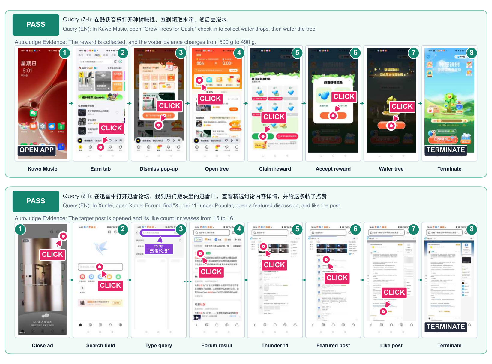

**图 22：AutoJudge 判定为通过的代表性案例。** 轨迹证据表明智能体成功完成请求任务。

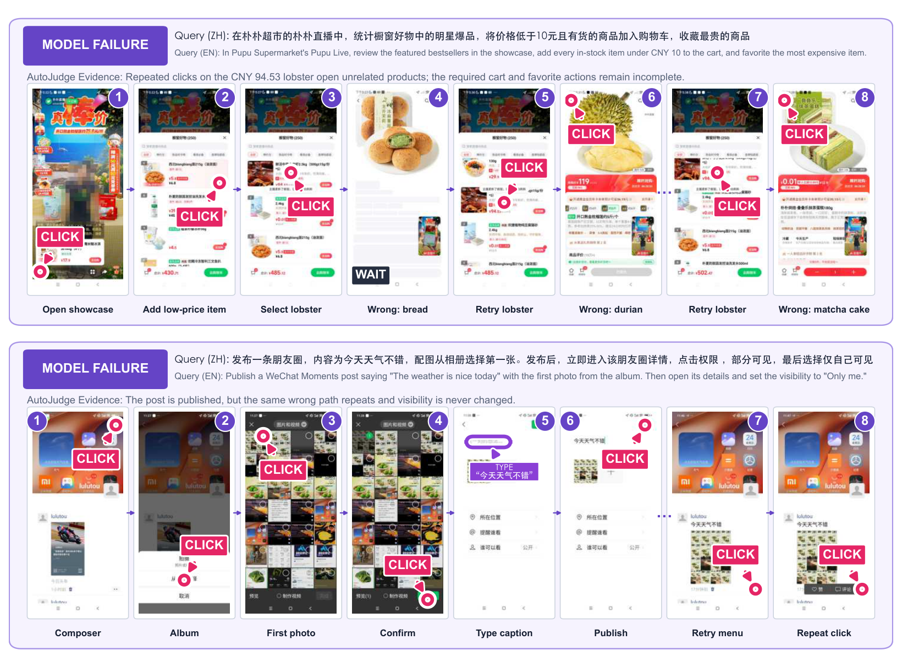

**图 23：AutoJudge 判定为模型失败的代表性案例。** 智能体采用错误或不完整的执行路径，未满足任务要求。

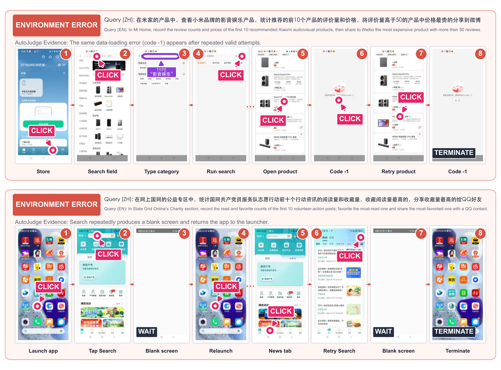

**图 24：AutoJudge 判定为环境错误的代表性案例。** 轨迹被在线应用或执行环境问题中断，而非由智能体动作造成。

### A.3 更多定性示例

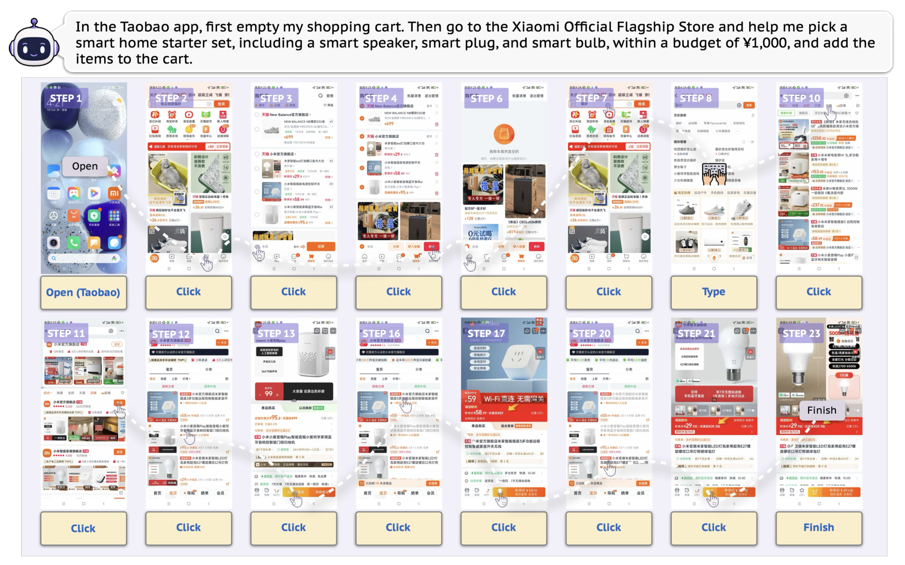

**图 25：长时程真实设备 GUI 执行示例。** 轨迹以关键帧展示，每帧下方标注所执行动作。在这项 23 步购物任务中，智能体把指令分解为连续子目标：先清空淘宝购物车，再在 1,000 元预算内从小米旗舰店选择智能音箱、智能插座和智能灯泡，并在全程保持预算约束和物品清单。

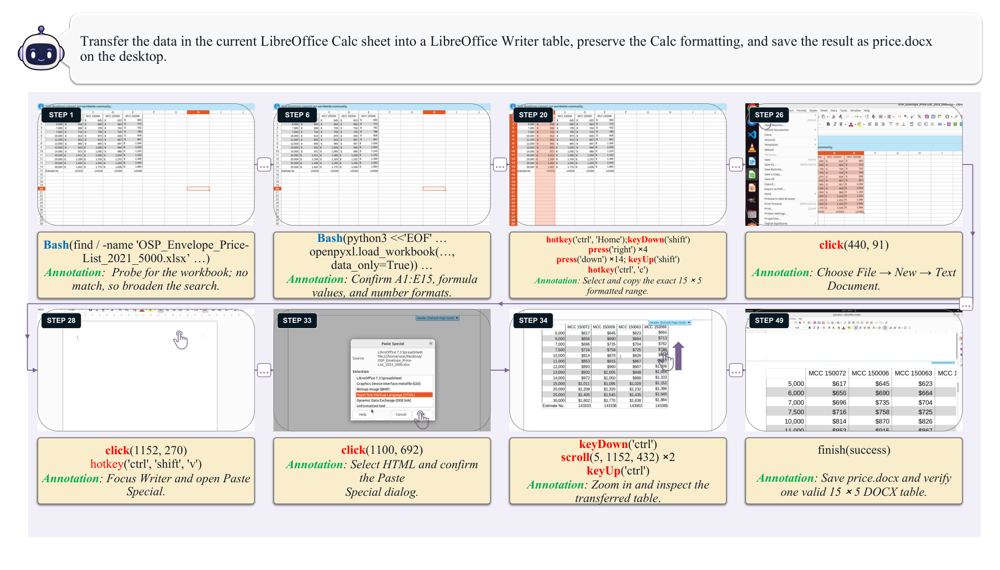

**图 26：计算机使用任务中的混合 GUI+CLI 执行示例。** 智能体使用 CLI 工具检查电子表格内容，并交错使用 GUI 动作，包括批量快捷键序列和“选择性粘贴”，把格式化数据转移到 Writer 文档。

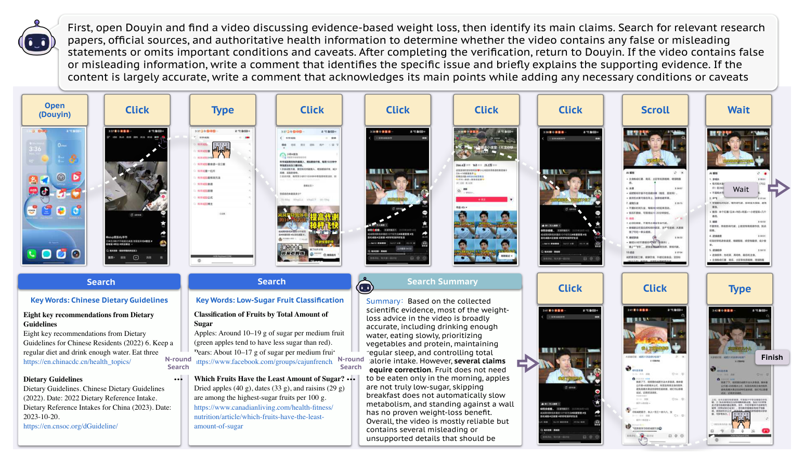

**图 27：GUI 执行过程中按需调用 DeepSearch 的示例。** Qwen-UI-Agent 先通过 GUI 动作找到一条有关循证减重的抖音视频并提取主要主张，再在轨迹中途调用 DeepSearch，以研究论文和权威健康来源核验这些主张，补充界面本身没有提供的外部证据。核验结论直接决定后续 GUI 动作；智能体返回抖音发布基于证据的评论，闭合“观察—研究—决策—行动”循环。

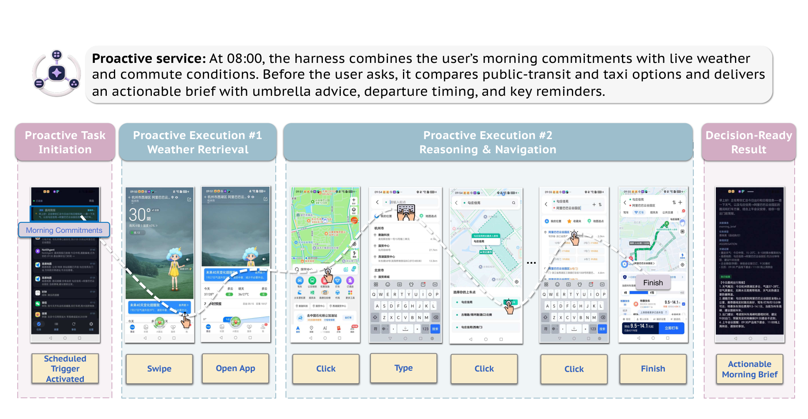

**图 28：基于移动通知的主动服务示例。** 轨迹按高亮阶段组织：从检测到通知主动发起任务，经历主动执行阶段，得到可直接决策的结果；每个关键帧下方标注动作。定时晨报场景中，08:00 时 harness 把用户晨间承诺与实时天气、通勤条件相结合，在用户询问前比较公共交通和出租车方案，并给出包含带伞建议、出发时间与关键提醒的可行动简报。

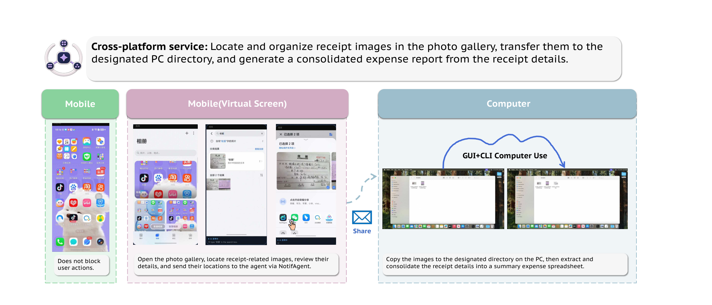

**图 29：跨平台任务执行示例。** 移动端子任务运行在物理设备的虚拟屏幕中，不会阻塞用户自己的操作。跨设备收据整理场景中，智能体在移动虚拟屏幕上的相册中找到收据图片，将其传输至指定 PC 目录，再使用 GUI+CLI 计算机操作把收据细节汇总成费用摘要电子表格。

---

**全文翻译完。** 翻译覆盖题名、作者与机构、摘要、目录、正文第 1–8 节、全部公式、14 个表格的完整表体、29 幅图的图注、79 条参考文献原文以及附录 A.1–A.3。
