# Qwen-UI-Agent：以真实世界为中心的基础 GUI 智能体

## 核心信息

- 标题: Qwen-UI-Agent Technical Report: Toward Next-Generation Real-World Centric Foundation GUI Agents
- 标题翻译: Qwen-UI-Agent 技术报告：迈向下一代以真实世界为中心的基础 GUI 智能体
- 作者: Hanzhang Zhou、Panrong Tong、Xu Zhang、Quyu Kong、Chenglin Cai、Tianyu Xia、Gongjie Zhang、Jianan Zhang、Long Li、Long Chen、Lei Wang、Gaole Dai、Pengxiang Li、Liangyu Chen、Yue Wang、Steven Hoi 等
- 机构: 阿里巴巴集团 Alibaba Token Hub，MAI-UI Team
- 发表时间: 2026-07-31（arXiv v1 提交于 2026-07-30）
- 发表渠道: arXiv 技术报告
- DOI: 未提供
- arXiv: 2607.28227
- 论文链接: https://arxiv.org/abs/2607.28227
- 代码 / 项目: https://tongyi-mai.github.io/Qwen-UI-Agent/
- 数据 / 资源: 报告描述 MobileWorld-Real、约 10,000 个已验证任务—验证器对及真实设备运行时，但未公开完整训练数据与运行栈
- 论文类型: AI 方法与系统技术报告

## 原文摘要翻译

GUI 智能体有潜力成为现有数字设备上的通用执行器。为了推动它们走向真实世界应用，作者设想这样的智能体：能够在真实设备上可靠运行，跨平台执行工作流，把 GUI 交互与 CLI 执行结合起来，完成长时程任务，主动发起有用服务，并且仅需极少人力便能自主提升能力。以这一愿景为指引，论文提出 Qwen-UI-Agent：一个以真实世界为中心、覆盖移动端、计算机使用、网页和 DeepSearch 环境的基础 GUI 智能体。

Qwen-UI-Agent 将多种沙箱环境与大规模真实设备移动端运行时结合起来。它的统一动作空间可交错使用 GUI 操作与 CLI 执行，并在一次模型决策中生成一批动作。一个 AutoResearch 风格的数据飞轮利用智能体构建任务与环境、诊断失败，并规划后续迭代。在线强化学习支持在超过 100 轮的轨迹上训练，超过 10,000 个并发环境则用于加速 rollout。一个轻量级 harness 支持主动发起服务，以及在移动端与计算机之间执行有状态工作流。

在广泛评测中，Qwen-UI-Agent 在移动端使用基准上取得领先性能，同时在计算机与浏览器使用任务上，相对于 Opus 4.8、Gemini 3.1 Pro、GPT-5.6 Sol 等前沿模型表现出竞争力。

移动端方面，它在 MobileWorld、MobileWorld-Real 和 AndroidDaily 上分别达到 82.1%、92.2% 和 97.5%。

计算机使用方面，它在 OSWorld-Verified 上达到 79.5%，在 OSWorld-v2 上取得 40.0% 的部分进度。

浏览器使用和 GUI 定位方面，它在 WebArena 和 ScreenSpot-Pro 上分别达到 73.6% 和 81.5%。

## 创新点

### 1. 把 GUI 智能体从单一模型问题改写为系统共同设计问题

论文的贡献并不只是训练一个更会点击的视觉语言模型，而是把环境、动作、数据、训练、评测和 harness 视为互相制约的整体。真实设备经验决定模型能见到哪些长尾状态；统一动作接口决定它能否把视觉操作与程序化执行组合起来；可执行验证器又决定长轨迹强化学习是否能获得可靠终止奖励。这一系统视角是报告最重要的创新。

### 2. 真实设备训练运行时进入能力开发主循环

作者构建 100 多台物理手机、150 多个应用的真实设备集群，并用健康感知调度、设备黑名单、人工接管和虚拟屏幕维持运行。真实设备不再只是发布前测试工具，而是任务设计、轨迹采集、在线强化学习和评测共同依赖的学习环境。虚拟屏幕机制使同一集群的 rollout 吞吐约提高 20 倍。

### 3. GUI、CLI、API 与批量动作构成统一执行语言

一次策略决策既能输出单动作，也能输出有序动作批次。GUI 提供视觉语义与原生控件，CLI 处理文件、代码和结构化状态，API 高效取得外部信息，询问用户动作则保留敏感操作的授权边界。论文不仅声明这种组合，还给出 OSWorld 上的使用统计与轨迹案例。

### 4. 用两级强化学习分治局部错误与长时程决策

Action RL 针对定位混淆、数量遗漏、过早结束、动作循环和长尾动作等步骤级错误；Online RL 则用可执行验证器的终止结果训练完整交互轨迹。前者塑造“下一步怎么做”，后者塑造“整条路径最终是否完成”，二者的职责区分清楚。

### 5. 从被动工具走向受约束的主动服务

Harness 能监听通知、结合事务记忆发起计划，并在手机与计算机之间迁移任务状态。论文同时保留一条重要安全原则：付款、预订、发消息等具有外部后果的动作必须请求用户确认。主动性因此被限定为“先发现、先准备、再授权执行”，而不是无条件自治。

## 一句话总结

Qwen-UI-Agent 的核心不是单点提升 GUI 点击准确率，而是用真实设备环境、混合动作空间、智能体数据飞轮、两级强化学习和跨平台 harness 组成一条可持续扩展的真实世界执行链；其结果很强，但组件因果贡献、评测可比性和端到端复现仍未完全闭合。

## 研究问题

### 从基准分数到真实效用的六道鸿沟

论文试图回答：怎样把在可控模拟器中表现不错的 GUI 策略，变成可以在真实设备、异构应用和长流程中稳定工作的基础执行器？作者把问题拆为六项转变：

1. 从模拟环境转向真实设备，处理权限、弹窗、网络、账号和界面版本漂移。
2. 从孤立领域转向移动端、桌面、网页与检索系统之间的连续工作流。
3. 从纯 GUI 动作转向 GUI、CLI、API 和批量动作的互补组合。
4. 从短任务转向超过 100 步、需要状态跟踪和中间验证的长任务。
5. 从人工密集的数据生产转向智能体驱动的任务、环境、验证器与失败分析循环。
6. 从等待明确指令转向由通知和事务状态触发、但仍受用户授权约束的主动服务。

论文隐含的研究假设是：真实世界可靠性不是某个单独模块的局部指标，而是“经验覆盖 × 动作表达力 × 奖励可靠性 × 执行编排”的乘积。任何一项接近零，端到端能力都会坍塌。

## 数据与任务定义

### 交互任务的形式化

任务写作：

$$
\tau=\left(I,\mathcal{E}_{\tau}\right),
$$

其中，$I$ 是用户指令，$\mathcal{E}_{\tau}$ 是任务可访问的环境集合。环境可以是手机、网页、桌面、DeepSearch，或多个环境的组合。第 $t$ 步的观测为：

$$
o_t=\left(o_t^{\mathrm{GUI}},o_t^{\mathrm{CLI}},o_t^{\mathrm{API}}\right).
$$

策略根据指令、当前观测和历史产生中间推理与动作：

$$
\left(r_t,\mathbf{a}_t\right)=\pi_{\theta}\left(I,o_t,h_t\right),
\qquad
\mathbf{a}_t=\left(a_t^{(1)},\ldots,a_t^{(K_t)}\right).
$$

当 $K_t=1$ 时执行单动作；当 $K_t>1$ 时，一次决策连续执行一组局部可预测动作。批量动作的收益是减少重复的“截图—推理—执行”循环，代价是批次中间缺少新反馈，因此模型必须在不确定状态前及时停止批次。

### 环境层级

论文使用三类互补环境证据：

- 可重置沙箱覆盖移动端、桌面、网页与 DeepSearch，最多支持 10,000 个隔离环境并发运行。
- 真实设备集群覆盖 100 多台手机和 150 多个应用，用于收集非确定性打断、账号状态、真实网络和复杂应用生态经验。
- MobileWorld-Real 以人工编写任务和物理设备执行评测真实世界移动能力；环境错误与模型失败分开标注。

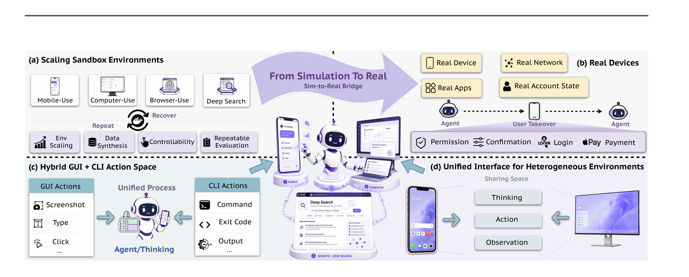
*图 3。可扩展沙箱、真实设备、混合动作与统一接口共同构成训练和评测底座。*

### 数据从哪里来

数据飞轮先用强模型构建知识功能树与能力画像，再合成任务、初始环境状态和验证器；多轮拒绝采样及步骤级 VLM 评判筛出可用于 SFT 的轨迹片段。失败分析智能体把失败映射为缺少应用知识、违反约束、状态跟踪错误、验证不足等类别，再为下一轮生成针对性任务。Online RL 部分最终得到约 10,000 个经过执行验证的任务—验证器对。

这里要特别区分两个概念：步骤级模型评判器适合低成本扩充过程监督，可执行验证器则为长轨迹强化学习提供高精度终止信号。前者覆盖广，后者可信度高但构建昂贵。

## 方法主线

### 机制流程

1. **输入与环境实例化。** 系统把用户指令、可用平台和任务初始状态送入统一环境接口；调度器分配沙箱或真实设备，并返回 GUI、CLI 或 API 观测。
2. **跨通道推理与动作生成。** 策略融合截图、命令输出、外部检索结果和历史状态，生成单个动作或有序动作批次；环境适配器将统一表示解码成平台原生操作。
3. **执行、验证与恢复。** GUI 改变或读取视觉状态，CLI 精确处理结构化状态，API 补充外部证据；新观测用于检查后置条件，发现偏差时更新计划并继续执行。
4. **数据回流与策略更新。** 轨迹经步骤级评判或可执行验证后进入 SFT、Action RL、Online RL；失败类别再更新任务合成目标，使下一轮训练聚焦当前策略的能力缺口。

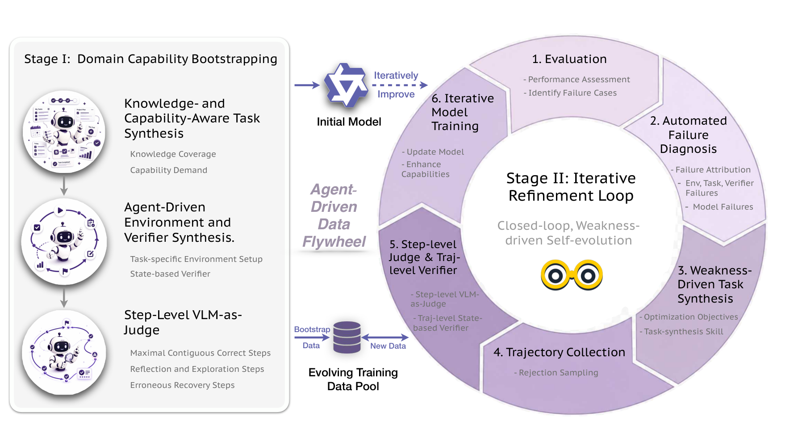
*图 5。领域冷启动提供初始覆盖，失败诊断和定向任务合成闭合迭代精炼回路。*

### 环境基础设施与统一动作

环境接口标准化环境获取、重置、单步执行、评估、拆除和释放，而平台适配器保留各自的运行时语义。桌面端的 CLI 不需要先用 GUI 打开终端，命令输出、错误码和动作后截图共同回到观测流；失败命令不会自动结束任务，策略可以在同一轨迹中诊断并恢复。

统一动作空间也包含询问用户和显式终止动作。这个设计使“安全停顿”成为策略可学习的合法动作，而不是部署层临时补丁。它对主动服务尤其重要，因为越主动的系统越需要把不可逆动作和准备性动作分开。

### 监督微调

作者先分别训练移动端、桌面、网页与 DeepSearch 专家，再把检查点合并为统一模型。为保持通用推理和工具能力，训练中混入由起始模型自身生成且经验证正确的分布内样本。长轨迹使用五步滑动窗口，相邻窗口重叠一步，并屏蔽已监督边界动作的损失，从而减少重复处理相同视觉上下文。

### Action RL：局部动作纠错

步骤级奖励为：

$$
r_t=F_t\left(w_{\mathrm{type}}C_t+w_{\mathrm{arg}}C_tQ_t-\lambda_{\mathrm{sens}}S_t-\lambda_{\mathrm{rep}}L_t\right).
$$

$F_t$ 检查动作格式；$C_t$ 衡量动作类型；$Q_t$ 衡量参数质量；$S_t$ 惩罚错误敏感动作；$L_t$ 惩罚无进展重复。目标不是笼统地提高成功率，而是压低六类可跨应用复现的错误模式。作者还用熵正则和推理长度边界防止策略坍缩或产生无效长思考。

### Online RL：轨迹级结果优化

对同一任务采样 $K$ 条完整轨迹，由验证器读取最终环境状态并给出二元奖励：

$$
r_i=v_x\left(s_{\mathrm{final}}^{(i)}\right)\in\{0,1\},
\qquad
\hat A_i=
\frac{r_i-\bar r_x}
{\operatorname{Std}(r_1,\ldots,r_K)+\epsilon}.
$$

组内相对优势用于更新策略。全成功或全失败的任务几乎没有相对学习信号，因此系统维护活跃池与监控池：成功率居中的任务获得完整预算，尚不可解或已经掌握的任务用小预算监控，一旦进入“可学前沿”便重新激活。这是一个随模型能力变化的动态课程，而不是一次性难度排序。

### Harness：把模型变成服务

Harness 把通知监听、事务记忆、计划、设备寻址和状态传递放到核心模型之外。它可以先准备低风险候选方案，再在付费、预订、消息发送等动作前调用用户确认；跨平台执行时，手机产生的上下文可以传到桌面继续处理。

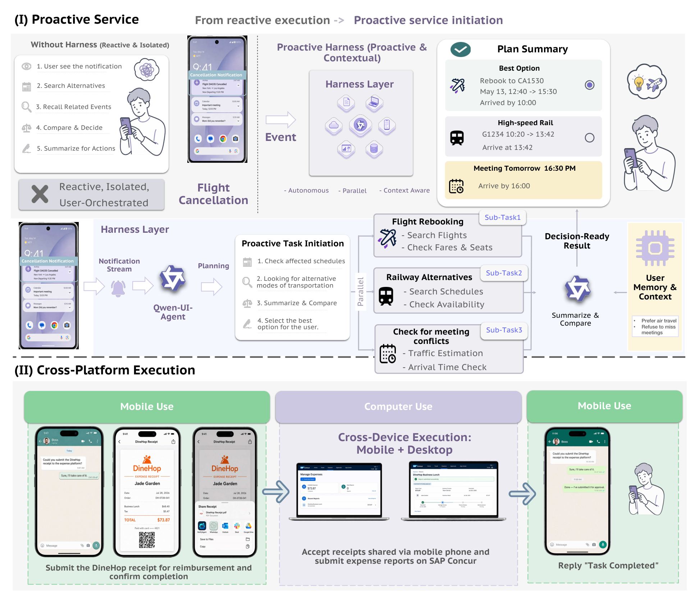
*图 6。Harness 负责识别机会、维护事务状态、编排平台，并在有外部后果的节点请求用户决策。*

## 关键结果

### 跨领域结果概览

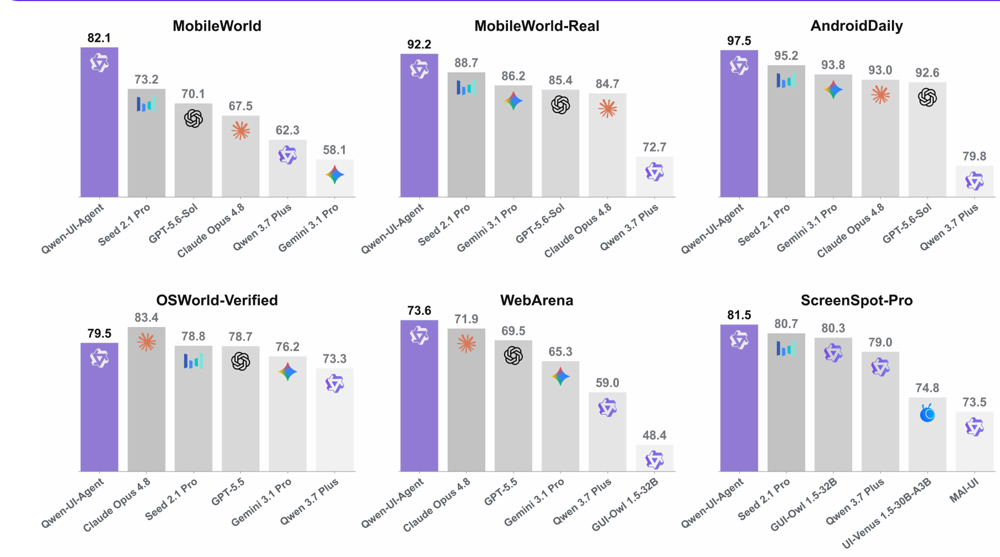
*图 1。27B 模型在移动端与网页任务领先，在桌面、检索和定位任务上达到领先或竞争性水平。*

| 领域 | 基准 | Qwen-UI-Agent | 主要参照 | 读法 |
|---|---|---:|---:|---|
| 移动沙箱 | MobileWorld | 82.1% | Seed 2.1 Pro：75.8% | 论文比较中第一 |
| 真实移动 | MobileWorld-Real | 92.2% | Seed 2.1 Pro：88.7% | 论文比较中第一 |
| 高频移动 | AndroidDaily | 97.5% | Seed 2.1 Pro：95.2% | 论文比较中第一 |
| 桌面 | OSWorld-Verified | 79.5% | Claude Opus 4.8：83.4% | 第二，仍低 3.9 个百分点 |
| 长桌面 | OSWorld-v2 Partial | 40.0% | Claude Opus 4.8：54.8% | 第三，差距明显 |
| 长桌面 | OSWorld-v2 Binary | 13.9% | Claude Opus 4.8：20.6% | 第二 |
| 网页 | WebArena | 73.6% | 人类：78.2% | 模型比较第一，低于人类 |
| 英文检索 | BrowseComp | 64.1% | GPT-5.5：90.1% | 落后前沿闭源模型 |
| 中文检索 | BrowseComp-ZH | 75.0% | Apodex：80.6% | 第二 |
| 定位 | ScreenSpot-Pro 放大 | 81.5% | Seed 2.1 Pro：80.7% | 论文比较中第一 |

这张表说明，论文的“领先”不是所有任务上的绝对领先。最强证据来自移动端和 GUI 定位；桌面长任务与英文 DeepSearch 仍有明显空间。WebArena 使用作者人工核验答案并修订脚本后的设置，部分基线由作者在同一环境复现，因此数字应连同评测协议一起阅读。

### 长时程桌面任务：效率提升不等于绝对领先

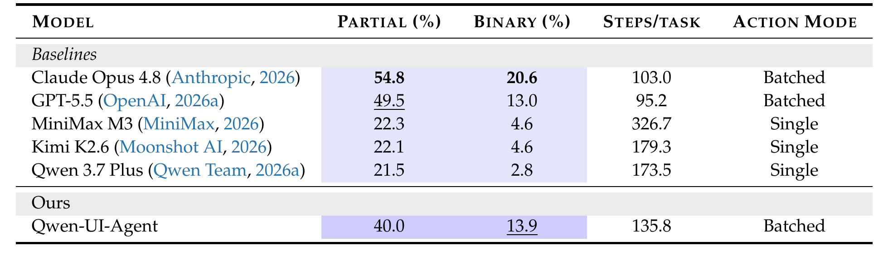
*表 5。Qwen-UI-Agent 的二元完成率为 13.9%，平均 135.8 步；它明显优于开源权重基线，但仍落后 Claude Opus 4.8。*

与 MiniMax M3 相比，Qwen-UI-Agent 的部分进度提高 17.7 个百分点，平均步骤减少约 58.4%；与 Qwen 3.7 Plus 相比，部分进度提高 18.5 个百分点，步骤减少约 21.7%。这些结果与混合动作和批量执行相符，但论文没有给出关闭 CLI 或关闭批量动作的严格端到端消融，因此不能把全部增益唯一归因于动作空间。

### DeepSearch：中文强、英文仍弱

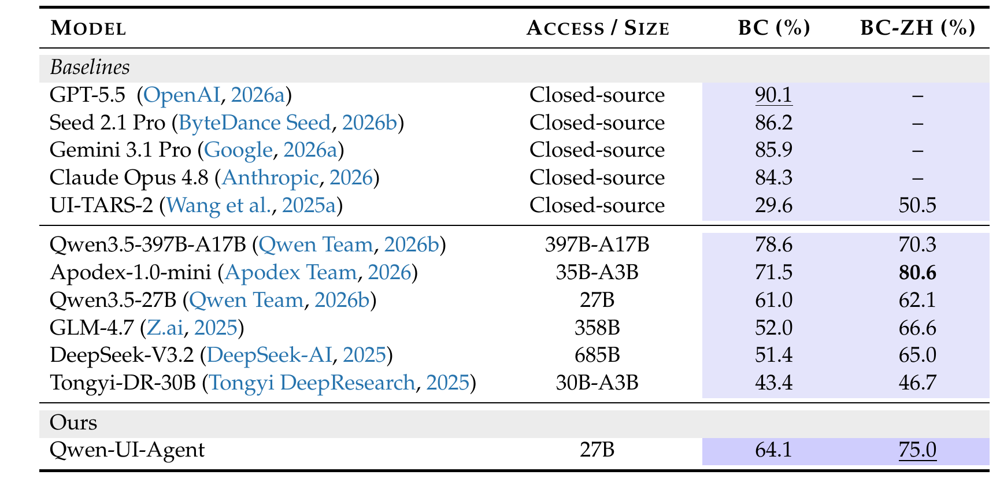
*表 7。27B 模型在中文检索上达到 75.0%，但英文检索的 64.1% 与最强闭源系统仍有大幅差距。*

BrowseComp 结果是报告中最重要的负结果之一：Qwen-UI-Agent 虽超过同规模基础模型和部分专用 GUI 智能体，却比 GPT-5.5 低 26.0 个百分点。这意味着“GUI 与检索一体化”已经可用，但不能把它等同于最强开放域研究能力。

### GUI 定位与通用能力保持

ScreenSpot-Pro 在不放大和放大设置下分别达到 76.6% 与 81.5%；ScreenSpot-V2、MMBench-GUI L2、OSWorld-G-Refined、UI-Vision 分别为 97.5%、92.6%、78.5%、70.0%。

与此同时，表 9 显示模型在多数通用推理基准上与 Qwen3.5-27B 接近，并在多项终端和工具基准上更强。不过这些结果全部由作者自建环境复现，部分用户模拟器、评判器和运行版本与官方设置不同，不能直接与外部榜单逐项混用。

## 深度分析

### 1. 真正的护城河可能在环境，而不只在模型

真实设备基线 Qwen 3.7 Plus 的失败中，40.3% 属于执行能力限制，52.0% 属于真实世界场景挑战。最常见类别包括 UI 误读 24.7%、探索失败 19.5%、弹窗干扰 18.2%、错误动作循环 14.3% 和物理控件操作 9.1%。这些不是扩大静态截图数据就必然消失的问题，而是需要在具有状态转移、意外反馈和恢复机会的环境中学习。

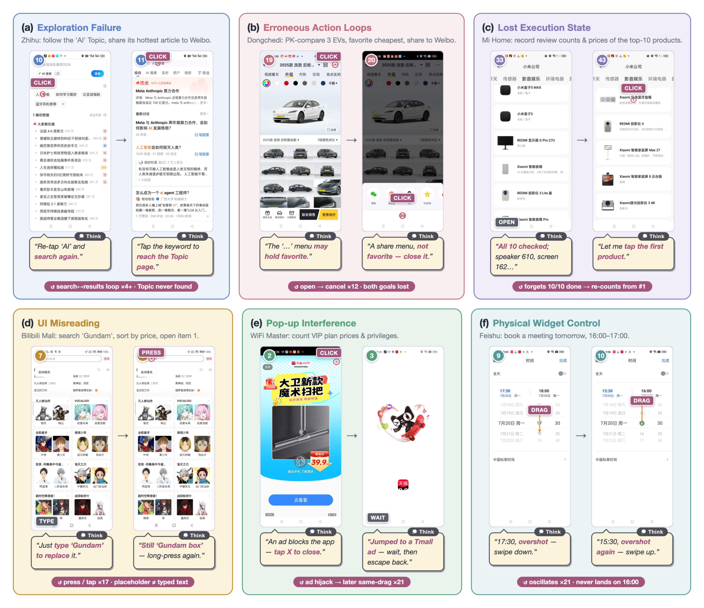
*图 13。深入口探索、动作循环、状态遗忘、页面语义误读、弹窗和物理控件共同暴露模拟—真实鸿沟。*

**论文事实：** 加入真实设备任务、运行时治理和闭环经验后，27B 模型在 MobileWorld-Real 达到 92.2%。  
**分析判断：** 这一关联支持“真实经验重要”，但尚未构成严格因果证明，因为论文没有在相同模型、相同数据量下给出移除真实设备数据的控制实验。

### 2. GUI 与 CLI 更像“眼—手—校验器”分工

OSWorld-Verified 与 OSWorld-v2 中，CLI 出现在 92.0% 与 98.2% 的任务里；CLI 动作占比分别为 40.7% 与 55.1%。批量动作占 39.6% 与 41.6%，每批平均 3.1 个原子动作。较难的 OSWorld-v2 反而更常使用 CLI 与混合批次，说明策略不是把命令行当作应急后备。

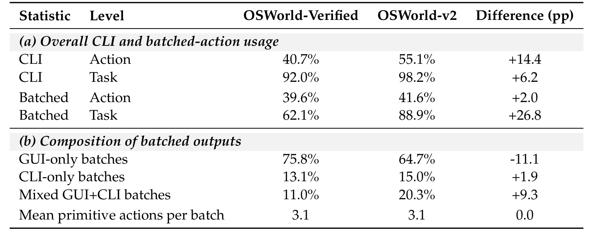
*表 11。CLI 几乎覆盖全部桌面任务，约四成动作以批量形式执行。*

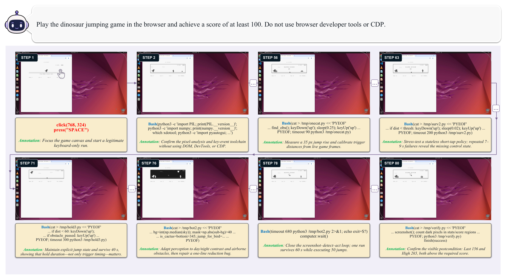
*图 17。GUI 提供可见状态与错误证据，CLI 把观察转化为可重复控制器，二者交替迭代。*

这类协作的关键不是“用 CLI 取代 GUI”，而是选择信息密度最高的接口：CLI 压缩结构化搜索空间并精确改变状态，GUI 读取程序难以可靠表达的视觉语义并检查最终效果。批量动作则适合局部确定性高的事务；一旦下一步依赖新截图、命令结果或弹窗，就应停止批次。

### 3. 两级 RL 的行为证据比总分更有解释力

Action RL 后，总体成功率提高超过 7%，推理令牌减少 21.3%，交互步骤增加 8.4%。五个专项测试集均改善，其中重复动作循环从 72.9% 升到 82.4%，提高 9.5 个百分点；长尾动作奖励从 71.5% 升到 77.9%。

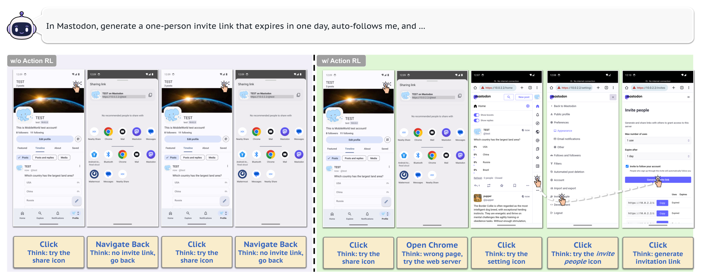
*图 18。训练前策略反复点击错误入口，训练后策略识别无进展状态并切换探索路径。*

Online RL 后，带至少一次验证动作的轨迹比例提高 14.7%，错误停止率下降 11.2%；GUI 动作占比提高 6%，同时使用 GUI 与 Bash 的轨迹比例提高 10.6%。

“执行—验证”转移从 40.2% 升至 52.4%，全部约束满足率在 OSWorld 和 BrowseComp-ZH 上分别提高 8.6% 与 7.5%。

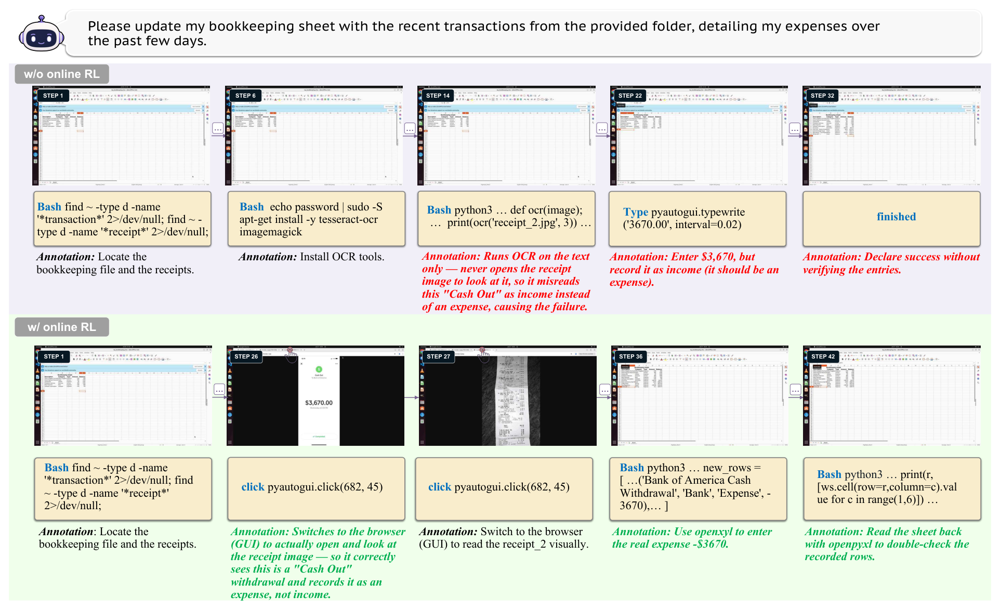
*图 20。策略先用程序化动作高效处理数据，再通过可见界面读取语义并回查结果。*

**实际证明了什么：** RL 后出现更多验证、自我纠正、跨模态协作与约束保持，这与训练目标方向一致。  
**没有证明什么：** 报告没有多随机种子置信区间，也没有完整的训练阶段组合消融；这些统计仍可能混入数据构成、训练时长和模型检查点差异，不能把所有变化唯一归因于某个单独阶段。

### 4. AutoJudge 足以扩展评测，但不是无偏真值

作者在 666 条人工标签确定的轨迹上验证 AutoJudge，总体一致 618 条，即 92.8%。通过类一致率 96.2%，模型失败类 85.7%，环境错误类只有 76.0%。环境错误最难判，恰好又会被从真实设备成功率分母中排除，因此小比例误分也可能影响排行榜。

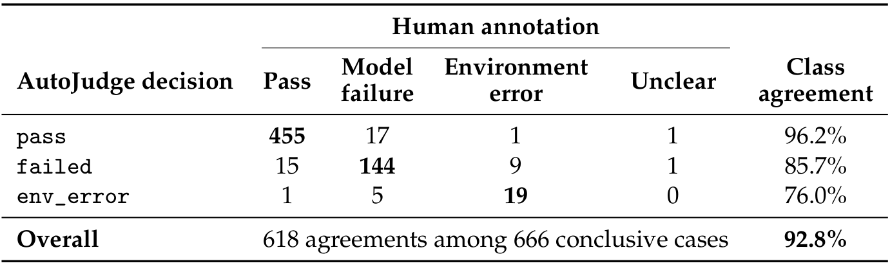
*表 14。总体一致率较高，但模型失败与环境错误的区分仍是主要误差源。*

合理的使用方式是：用 AutoJudge 承担规模化初筛，同时保留完整轨迹、环境错误率和抽样人工复核；不应只公布一个剔除环境错误后的成功率。对于付款、隐私、消息发送等安全事件，自动任务完成评判也不能替代专门的安全审计。

### 5. Harness 的价值在于治理跨任务状态

主动服务并不是多加一个“监听通知”的触发器。它需要维护事务之间的因果关系，例如航班取消会影响会议、材料和交通；还要在不同设备间寻址并携带状态。Harness 把这些治理职责放在模型外，使任务可以恢复、暂停、请求授权和迁移平台。其工程价值很高，但报告主要提供定性工作流，尚未量化误触发率、打扰率、跨平台状态丢失率和长期记忆错误。

## 局限

1. **组件贡献没有被充分隔离。** 报告同时改变环境、数据、模型、动作空间、强化学习和 harness，缺少同规模、同数据预算下逐项移除真实设备、CLI、批量动作、Action RL 与 Online RL 的完整消融。
2. **评测可比性存在协议边界。** WebArena 修订了参考答案和脚本；通用智能体表中的部分用户模拟器、评判器与运行版本也不同于官方设置。作者内部比较有参考价值，但不能无条件拼接到外部榜单。
3. **AutoJudge 对困难类别仍不稳定。** 环境错误一致率为 76.0%，模型失败一致率为 85.7%；真实设备得分应连同原始轨迹、排除规则和人工抽检一起解释。
4. **模型变体覆盖不完整。** 35B-A3B 在报告发布时尚未完成计算机使用与 DeepSearch 训练，因此无法判断其稀疏激活效率是否能跨全部领域保持。
5. **数据飞轮不是完全自主。** 人类仍负责系统设计、监督、纠错和必要介入；“agent-driven”不能解读为无人值守的自动研究闭环。
6. **复现信息不足。** 报告未公开完整模型权重、训练数据、真实设备运行栈、任务—验证器对、训练算力、设备小时和能耗，第三方暂时难以端到端复现。
7. **安全与个性化仍是开放问题。** 询问用户动作提供了控制接口，但论文没有系统报告误触发、越权、敏感信息泄露、提示注入、用户画像错误或长期记忆治理结果。
8. **真实世界长期漂移未量化。** 应用版本、账号策略、网络与界面持续变化；一次性基准成绩不能直接推出数月运行的稳定性。
9. **高保真环境合成尚未进入本报告训练。** 作者已构建相关方法但未完成集成，模拟—真实鸿沟的可扩展替代路径仍待验证。

## 我的笔记

### 最值得复用的设计原则

- 把环境、验证器和调度器视为模型能力的一部分。没有可靠状态重置、失败归因和轨迹证据，就无法稳定做长时程 RL。
- 把接口按信息结构分工：视觉语义交给 GUI，结构化变换交给 CLI，外部知识交给 API，外部后果交给用户确认。
- 在终止前强制做后置条件检查。论文中 Online RL 最有价值的行为变化，不是动作更多，而是“做完以后再看一眼”。
- 为低频高风险动作单独建数据与奖励。自然轨迹频率并不等于业务重要度，询问用户、长按和失败恢复都可能被高频点击淹没。
- 真实设备评测必须把模型失败和环境失败分开，同时公开两类比例与评判误差；只报清洗后成功率会隐藏运维成本。

### 如果我要复现实验

1. 先在一个可重置桌面环境复现统一 GUI+CLI 接口、完整轨迹日志和确定性状态验证器。
2. 固定同一基础模型与数据预算，做纯 GUI、GUI+CLI、GUI+CLI+批量动作三组对照。
3. 分别加入 Action RL 与 Online RL，并至少用三个随机种子报告均值、方差和错误类型迁移。
4. 对每个任务同时记录成功、环境错误、模型错误、步骤、token、时延和恢复次数。
5. 最后再接入少量真实设备，重点测弹窗、权限、账号、网络、物理控件和跨应用状态，而不是只扩充常规任务数量。

### 下一步最关键的问题

- 移除真实设备数据、CLI、批量动作或两类 RL 后，端到端成功率分别下降多少？
- 10,000 并发环境的训练成本、资源利用率和边际收益是什么？
- MobileWorld-Real 的环境错误率、应用版本覆盖和跨时间复测稳定性如何？
- 主动服务的误触发率、用户拒绝率和敏感动作拦截召回率是多少？
- 完整权重、任务—验证器对与运行时开放后，第三方能否复现移动端和桌面端主结果？

### 总体评价

这是一篇“系统先于单模型”的技术报告。它最强的部分是把真实设备环境、执行接口和训练信号连成闭环，并用行为统计解释为什么模型在长任务中更可靠；最弱的部分是系统同时变化太多，因果归因和复现透明度不足。若后续能够补全组件消融、长期真实设备测量和开放资源，Qwen-UI-Agent 会比单次榜单领先更有研究价值。

## 引用

- Hanzhang Zhou, Panrong Tong, Xu Zhang, et al. “Qwen-UI-Agent Technical Report: Toward Next-Generation Real-World Centric Foundation GUI Agents.” arXiv:2607.28227, 2026. https://arxiv.org/abs/2607.28227
- Qwen-UI-Agent 项目主页. https://tongyi-mai.github.io/Qwen-UI-Agent/
- Hanzhang Zhou et al. “MAI-UI: ...” 论文在本报告中作为前序工作引用；完整书目信息见原论文参考文献。
