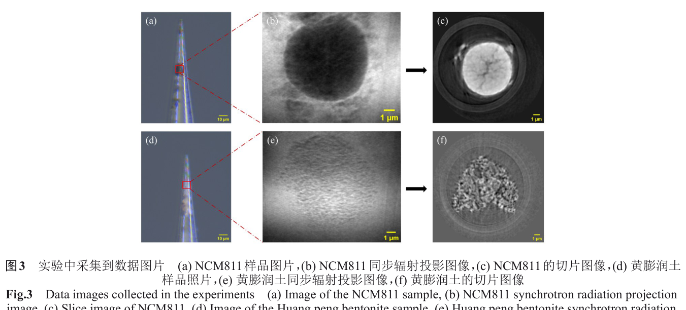
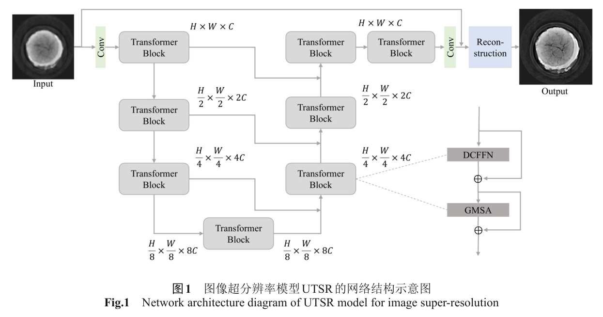
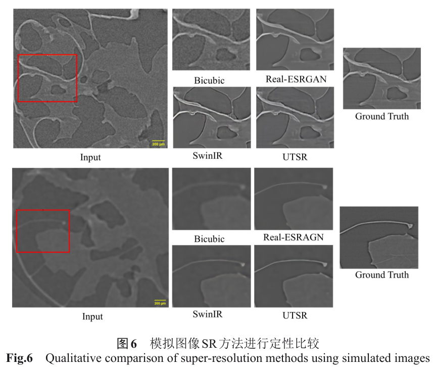
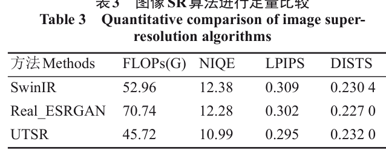
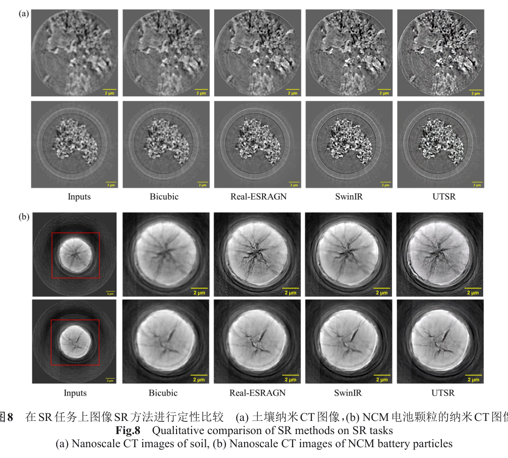
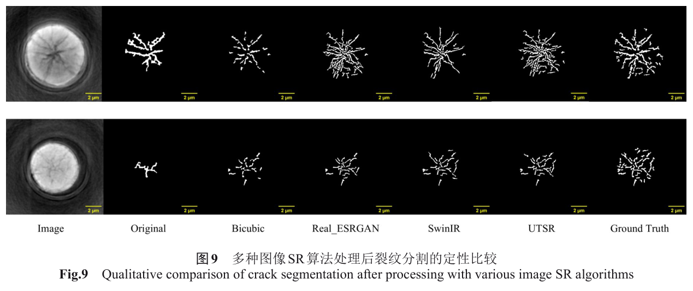
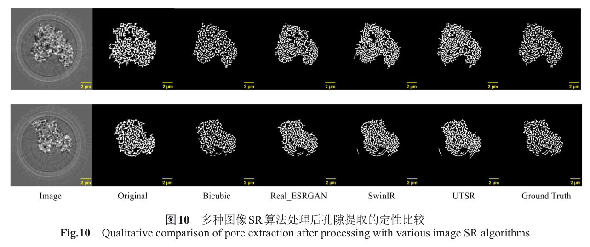
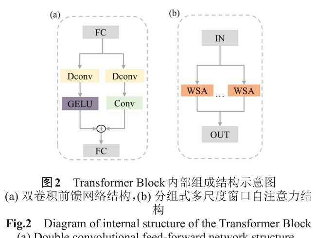

---
tags:
  - papers/X-ray-imaging
  - papers/nano-CT
  - papers/super-resolution
aliases:
  - "Super-resolution reconstruction of synchrotron radiation nano-CT images and its applications"
date: 2026
doi: 10.3724/j.0253-3219.2026.hjs.49.250034
---

# 同步辐射纳米 CT 图像超分辨率重建及其应用研究

## 核心信息

- 标题: 同步辐射纳米 CT 图像超分辨率重建及其应用研究
- 标题翻译: Super-resolution reconstruction of synchrotron radiation nano-CT images and its applications
- 作者: 彭真、汪澳、汪俊、陶芬、张玲、杜国浩、邓彪
- 机构: 上海大学；上海理工大学；中国科学院上海高等研究院上海光源中心
- 发表时间: 2026
- 发表渠道: 核技术，49(1)，010101
- DOI: 10.3724/j.0253-3219.2026.hjs.49.250034
- 论文链接: https://doi.org/10.3724/j.0253-3219.2026.hjs.49.250034
- 论文类型: 面向同步辐射纳米 CT 的 Transformer 超分辨率方法

## 原文摘要翻译

同步辐射纳米 CT 能在纳米尺度提供高分辨率三维结构信息，已用于材料、能源和地质研究；但环境干扰、设备精度与光源强度波动会降低信噪比、造成模糊和细节损失，进而影响定量分析。

在公开纳米 CT 数据稀缺的条件下，作者提出面向纳米 CT 图像质量提升的 Transformer 超分辨率网络 `UTSR`，并考察它作为裂纹分割等下游任务预处理的效果。网络采用 U 形对称结构，结合双卷积前馈网络与分组式多尺度窗口自注意力，通过自然图像预训练、上海光源数据微调和 Sobel 边缘损失完成训练。

论文报告该网络在计算量和多项指标上优于所选基线；裂纹分割准确率达到 `99.3%`，召回率相对原始图像增加 `24.5` 个百分点。

## 创新点

1. 针对同步辐射纳米 CT 数据量小的问题，采用“大规模自然图像预训练—BL18B 切片微调”的迁移学习路径，降低从零训练专用网络的数据需求。
2. 构建 U 形 Transformer 超分辨率网络 `UTSR`，以 `4 × 4`、`8 × 8` 和 `16 × 16` 多尺度窗口聚合不同范围上下文，同时用双卷积前馈模块强化局部纹理。
3. 在像素绝对误差之外加入 Sobel 边缘损失，把裂纹和孔隙边界作为优化重点。
4. 除视觉图和图像质量指标外，加入裂纹、孔隙分割作为下游验证，比只报告峰值信噪比更接近材料定量任务。

## 一句话总结

`UTSR` 在本文的人工退化数据和两类 BL18B 纳米 CT 切片上改善了多项图像指标及阈值分割召回率，但它是图像域后处理，不能替代光学、采集与三维重建的物理分辨率验收，也不能证明模型生成的每条细裂纹都真实存在。

## 研究问题

上海光源 `BL18B` 可以获取几十纳米有效像素的三维纳米 CT 数据，但机械振动、光强波动、噪声与模糊仍会影响重建切片。细裂纹和孔隙接近采样极限时，低对比和边缘扩散尤其容易造成阈值分割漏检。与此同时，真实低质量—高质量配对纳米 CT 数据很难获得，直接监督训练专用超分辨网络缺乏样本。

论文将问题定义为四倍单图超分辨率：从低质量重建切片预测边缘更清晰、纹理更丰富的高分辨图，再把结果送入局部自适应二值化分割。低质量训练输入不是同一结构的独立低剂量实测，而是由高质量切片下采样并叠加随机噪声、模糊后合成。这使监督真值可得，也让模型更可能在“训练退化与测试退化相似”时表现良好。

物理边界必须先说明：`38 nm/pixel` 与 `46 nm/pixel` 是有效像素尺寸，不是独立测得的空间分辨率；四倍输出尺寸也不是束线分辨率提高四倍。超分辨率只能基于训练先验推断高频内容，不能从缺失测量中确定性恢复真实纳米结构。

## 数据与任务定义

### BL18B 数据

数据在上海光源纳米三维成像线站 `BL18B` 的硬 X 射线全场透射显微系统采集，包括黄膨润土和高镍三元正极 `LiNi₀.₈Co₀.₁Mn₀.₁O₂`（NCM811）两类样品。

| 样品 | 能量 | 曝光 | 有效像素 | 单幅投影尺寸 | 投影数 |
|---|---:|---:|---:|---:|---:|
| 黄膨润土 | `7 keV` | `1.5 s` | `38 nm/pixel` | `552 × 392` | `361` |
| NCM811 | `8.4 keV` | `0.8 s` | `46 nm/pixel` | `480 × 308` | `361` |

两组投影均用 `AduRecon` 完成三维重建，再从切片序列中精选 `3000` 张图像。论文把它们划为 `2600/300/100` 张训练、验证和测试图，并对训练图随机旋转及水平翻转，扩增四倍至 `10400` 张。论文没有说明按独立样品、独立扫描或完整体数据隔离集合；若相邻切片被分到不同集合，高度相关的三维邻层会产生数据泄漏并抬高测试表现。

*图 3｜NCM811 与黄膨润土的样品、同步辐射投影和重建切片，界定了纳米 CT 微调数据的材料域。*

### 训练与评价数据

自然图像预训练使用 `DIV2K`、`Flickr2K` 与 `OutdoorSceneTraining`。两类图像都采用与 `BSRGAN` 相近的人工退化：先下采样，再随机加入噪声和模糊，形成低质量输入。

评价分为三层：

- 模拟退化图像有高分辨参考，可报告 `PSNR` 与 `SSIM`。
- 真实低质量纳米 CT 没有配对高分辨真值，只能报告 `NIQE`、`LPIPS`、`DISTS` 等无参考或感知指标。
- 下游任务以检测算法加人工修正的裂纹、孔隙分割为参考，报告准确率、精确率、召回率与 F1。

三层证据不能互换：模拟全参考指标不代表真实退化恢复，感知指标不证明结构真实性，分割改善也可能同时包含更高召回和更多假阳性。

## 方法主线

### 机制流程

1. **输入与通用预训练**：输入为自然高分辨图像及其人工退化版本；操作是以 `L1` 损失训练 U 形 `UTSR` 学习通用的边缘和纹理先验，迭代 `3 × 10⁵` 次；输出为自然图像预训练权重。
2. **多尺度特征编码**：输入为尺寸 $H\times W$ 的低质量切片；操作是卷积提取浅层特征，经块数 `[12, 2, 2, 8]` 的分级编码器和像素重排下采样，分组窗口注意力分别在 `4 × 4`、`8 × 8`、`16 × 16` 窗口捕获多尺度依赖；输出为最低尺度深层特征。
3. **解码与纳米 CT 微调**：输入为深层特征和编码器跳跃连接；操作是以像素重排上采样逐级恢复尺寸，双卷积前馈网络融合深度卷积、普通卷积和激活分支，并在 BL18B 切片上以 `L1 + Sobel` 联合损失微调 `10⁴` 次；输出为四倍尺寸超分辨切片。
4. **质量与任务评价**：输入为超分辨结果；操作是分别计算模拟全参考、真实感知指标，并执行局部自适应阈值裂纹/孔隙分割；输出为图像指标、分割混淆矩阵指标及各基线比较。

*图 1｜`UTSR` 的 U 形编码器—解码器、跳跃连接与四倍超分辨率输出结构。*

### 边缘约束

总损失为

$$
\mathcal{L}=\mathcal{L}_1+\eta\mathcal{L}_{\mathrm{Sobel}},\qquad \eta=0.2.
$$

Sobel 项比较预测图与高分辨参考在横、纵方向的梯度差，促使网络优先恢复边缘。作者也指出 $\eta$ 过大会让模型过度追逐边缘而忽略全局结构。对科学图像而言，这不只是调参问题：边缘损失会奖励“看起来像边”的输出，因此必须用独立物理真值审计伪裂纹。

第一阶段训练约 `63 h 37 min`，第二阶段约 `3 h 25 min`。

训练硬件为 `NVIDIA RTX 3090`，显存 `24 GB`。论文写第一阶段总迭代 `3 × 10⁵` 次，却同时列出 `4.5 × 10⁵` 和 `4.75 × 10⁵` 的学习率衰减节点，训练日程存在需复核的内部矛盾。

## 关键结果

### 模拟退化

| 方法 | PSNR / dB | SSIM |
|---|---:|---:|
| 双三次插值 | `31.70` | `0.853` |
| Real-ESRGAN | `33.58` | `0.908` |
| SwinIR | `33.94` | `0.912` |
| UTSR | **`34.55`** | **`0.934`** |

在这套人工退化分布上，`UTSR` 的全参考指标最佳，定性图中边缘也更清晰。这证明模型能较好逆转论文所构造的退化过程，但真实成像退化未必服从相同生成模型。

*图 6｜人工退化图像上的双三次插值、Real-ESRGAN、SwinIR 与 `UTSR` 定性比较。*

### 真实纳米 CT 图像

正文表 3 是条件最清楚的定量记录：

| 方法 | FLOPs / G | NIQE ↓ | LPIPS ↓ | DISTS ↓ |
|---|---:|---:|---:|---:|
| SwinIR | `52.96` | `12.38` | `0.309` | `0.2304` |
| Real-ESRGAN | `70.74` | `12.28` | `0.302` | **`0.2270`** |
| UTSR | **`45.72`** | **`10.99`** | **`0.295`** | `0.2320` |

`UTSR` 的计算量、`NIQE` 和 `LPIPS` 最优，但 `DISTS` 比两个基线都高，不能概括为所有指标全面领先。英文摘要另报 `NIQE` 为 `9.38`、`LPIPS` 为 `0.312`，与表 3 不一致；本文不混用两组数值。

*表 3｜真实纳米 CT 图像的计算量与感知质量比较；`UTSR` 在 `DISTS` 上并非最佳。*

*图 8｜黄膨润土与 NCM811 真实切片的定性比较；视觉锐利度不能单独证明细节真实。*

### 裂纹与孔隙分割

| 任务/方法 | Accuracy / % | Precision / % | Recall / % | F1 / % |
|---|---:|---:|---:|---:|
| 裂纹，原图 | `98.7` | `81.7` | `35.4` | `49.4` |
| 裂纹，双三次插值 | `99.2` | **`95.6`** | `41.2` | `57.7` |
| 裂纹，SwinIR | **`99.3`** | `87.1` | `57.7` | **`69.4`** |
| 裂纹，Real-ESRGAN | `99.2` | `78.5` | `57.3` | `66.3` |
| 裂纹，UTSR | **`99.3`** | `80.1` | **`59.9`** | `68.5` |
| 孔隙，UTSR | **`97.1`** | `84.2` | `81.4` | **`82.8`** |

相对原图，`UTSR` 的裂纹召回率增加 `24.5` 个百分点，F1 增加 `19.1` 个百分点；这是百分点差，不是相对百分比。该模型获得最高召回率，却不是最高精确率或 F1，说明找回更多细裂纹的同时仍有误检权衡。

孔隙任务中 `UTSR` 的准确率和 F1 最好，但原图召回率 `87.6%` 仍高于超分辨结果的 `81.4%`。

*图 9｜不同超分辨率预处理后的裂纹分割；`UTSR` 提高召回，但结果仍需核对新增细裂纹是否真实。*

*图 10｜孔隙分割定性比较，配合全指标表可见精确率与召回率之间的权衡。*

### 消融结果

只使用 `GMSA` 时，三项指标依次为 `12.44/0.338/0.231`；加入普通前馈网络后为 `11.47/0.318/0.250`；改用双卷积前馈网络后为 `10.99/0.295/0.238`。

双卷积前馈网络相对普通前馈网络改善三项指标，但相对仅使用 `GMSA` 的基准，`DISTS` 从 `0.231` 变差到 `0.238`。这支持模块在 `NIQE` 和 `LPIPS` 上有价值，不支持“所有结构感知指标一致改善”。

## 深度分析

### 模型为何可能有效

纳米 CT 裂纹既需要长程上下文区分连通结构，也需要局部卷积抓取细边界。多尺度窗口注意力在有限计算量下覆盖不同空间范围，双卷积分支补足 Transformer 对局部纹理的归纳偏置，U 形跳跃连接则保留高分辨浅层特征。自然图预训练提供通用边缘先验，纳米 CT 微调把先验拉回灰度切片域。

*图 2｜Transformer 块中的双卷积前馈网络与分组式多尺度窗口注意力，分别偏向局部纹理和多尺度上下文。*

### 最大可信度风险：相邻切片泄漏

三维体数据的相邻切片高度相似。本文从两个样品重建序列中选 `3000` 张图，再按图像数划分训练、验证和测试，却未说明按完整体数据或独立样品隔离。如果相邻切片跨集合，测试图的纹理与结构可能在训练集中已有近邻，模型评价将更像插值同一体数据，而不是泛化到新样品。后续至少应按“独立样品—独立扫描—独立实验日”三级盲测。

### 超分辨率不等于物理分辨率

模型输出的高频成分来自输入证据与训练先验的共同作用。`PSNR/SSIM` 衡量人工退化后的像素恢复；`NIQE/LPIPS/DISTS` 衡量统计或感知相似性；阈值分割衡量特定算法能否获得更接近人工修正参考的掩膜。这些证据都没有直接测量点扩散函数、调制传递函数或三维频率壳相关，也没有用扫描电镜、聚焦离子束或更高分辨纳米 CT 逐条确认新增裂纹。

因此，`UTSR` 最合适的角色是“带不确定度的任务增强预处理”。原图必须保留，输出应伴随差异图和置信度；低置信区域回退到物理重建，任何新生细结构在用于定量结论前需外部验证。

## 局限

1. 数据只有黄膨润土与 NCM811 两类样品，且论文未报告独立材料、独立实验日或跨线站外部测试。
2. `3000` 张切片来自极少数三维体，集合划分未说明样品级隔离，存在相邻切片泄漏的高风险。
3. 低质量输入主要由高质量切片人工下采样、加噪和模糊产生，与真实低剂量、稀疏角度、漂移和重建伪影不一定一致。
4. 真实纳米 CT 没有配对高分辨物理真值，只用无参考/感知指标和人工修正分割，无法排除纹理幻觉或伪裂纹。
5. Sobel 损失主动奖励锐利边缘，可能改善视觉和召回，也可能把噪声强化成结构。
6. `UTSR` 在真实数据表 3 的 `DISTS` 为 `0.2320`，劣于 Real-ESRGAN 的 `0.2270`；裂纹精确率和 F1 也不是最佳。
7. 英文摘要与表 3 的 `NIQE/LPIPS` 数值冲突，表 3 与消融表的 `DISTS` 也分别为 `0.232` 与 `0.238`，复现实验需确认评价集和模型检查点。
8. 第一阶段总迭代数与部分学习率衰减节点不相容，训练日程记录不足以无歧义复现。
9. 四倍图像输出不能被解释为有效像素、光学分辨率或三维分辨率提高四倍。

## 我的笔记

- 这篇论文把超分辨率接到裂纹与孔隙任务上是正确方向，但验收重点应从“更清晰”升级为“结构是否真实、尺寸是否无偏”。
- 下一轮数据集必须以完整体数据为最小划分单元；最好新增同一样品的真实高/低剂量配对、稀疏/完整投影配对，并保留完全独立的材料盲测。
- 建议增加伪结构率、裂纹宽度偏差、连通性误差、孔隙率偏差和拓扑一致性，而不只报告像素级 Accuracy。
- 原图、超分辨图、差异图和模型置信度应一并归档；任何仅在超分辨图出现的结构都标记为“待物理验证”。
- 与其在重建后单切片补纹理，更可信的长期方向是把成像物理、投影一致性和三维邻域约束纳入联合重建。

## 引用

- 彭真等（2026）. 同步辐射纳米 CT 图像超分辨率重建及其应用研究. 核技术，49(1)，010101. DOI: 10.3724/j.0253-3219.2026.hjs.49.250034.
- 苏博等（2021）. 同步辐射纳米 CT 图像配准方法研究. 物理学报，70(16). DOI: 10.7498/aps.70.20210156.
- Tao, F. et al. (2023). The 3D nanoimaging beamline at SSRF. Journal of Synchrotron Radiation, 30, 815–821.
