# UI-Mate：借助上下文内演示推进开放权重基础 GUI 智能体

> [!info] 译文范围与来源
> 本文依据 arXiv:2608.15930 的 50 页 PDF 与其 arXiv 源 LaTeX 完整翻译。覆盖题名、摘要、正文全部章节与小节、公式、图 1–14 及其图注、表 1–16 的全部可读表体、作者贡献、参考文献和附录。参考文献的题名与出版信息按原文保留。图像均来自论文源包或经逐页核验的 PDF 裁剪；普通表格同时转写为可检索的 Markdown 表格。

**团队归属：** 腾讯 HY Frontier Team（不是千问团队）。

**论文链接：** [arXiv 摘要页](https://arxiv.org/abs/2608.15930) · [PDF](https://arxiv.org/pdf/2608.15930) · [项目主页](https://ui-mate.github.io/)

## 作者与贡献者

论文首页以团队署名，完整个人名单在“作者贡献”一节给出。核心贡献者为 Zihan Ding、Longxu Dou\*、Qi Gao、Xiangwu Guo、Shengchao Hu、Zilong Huang†、Zihang Jiang\*、Lei Ke\*、Mengcheng Lan、Weixian Lei\*、Hanxuan Li、Honglin Li、Xiyun Li、Zaitang Li、Leowei Liang‡、Xin Luo、Haozhe Ma、Jiayi Mao、Zhoujie Pan、Can Qin、Tianyuan Qu、Weiqi Wang、Wenkai Wang、Yonglin Wang、Yuxin Wang、Chenxu Wu、Yingchen Yu\*、Chenyu Zhang、Yuhao Zheng。其他贡献者为 Tianqing Fang、Zhenpeng Huang、Zhongwei Wan、Jiahao Xu、Ruihan Yang、Yidi Zhang。\*项目共同负责人；†项目负责人；‡项目监督人。

## 摘要

基础 GUI 智能体在自动化复杂数字任务方面潜力巨大，但其部署受到两个关键问题阻碍：训练层面的数据稀缺与分布偏差，以及交互层面的提示歧义与执行不可靠。日常工作流高度依赖用户特定的工具和默会约定；未明说的指令细节可能在不同运行中被任意解释，因此一次成功的智能体下一次仍可能失败。

我们提出 **UI-Mate**：一种把环境落地的训练栈与上下文内演示学习结合起来、旨在突破上述瓶颈的基础 GUI 智能体。UI-Mate 包含三项核心贡献。

1. **可扩展的环境落地训练栈。** 闭环数据引擎自动完成任务生成、环境构建、rollout、过滤和分层能力均衡；统一的“任务—验证器”包通过大规模并行环境，为监督微调（SFT）和在线强化学习（RL）持续供数。
2. **上下文内演示学习。** 把多模态演示转换成灵活的子任务级工作流，而不是回放僵硬轨迹；在关键处遵循演示步骤，同时依据实时界面自主重规划。
3. **OSWorkerBench 基准与经验洞见。** 提出跨 41 个应用的 100 个长时程办公任务，支持仅指令与演示引导两种评测。演示资源区分：由强智能体在同一目标任务上成功 rollout 构成的 33 任务 self-demo 设置，以及由人类录制相关但不相同任务构成的 45 任务 variant-demo 设置。

实验显示，UI-Mate-27B 在通用计算机使用基准上刷新开放权重最佳成绩：OSWorld-Verified 为 77.0%，WindowsAgentArena 为 66.2%。在 OSWorkerBench 上，严格成功率达到 41.0%，进度分达到 76.9%，分别比 Qwen3.6-27B 基座高 17.7 和 24.5 个百分点。在 33 任务 self-demo 子集上，一条演示将严格成功率从 17.2% 提升到 35.4%，将进度分从 67.9% 提升到 81.1%，显著改善长时程可靠性。

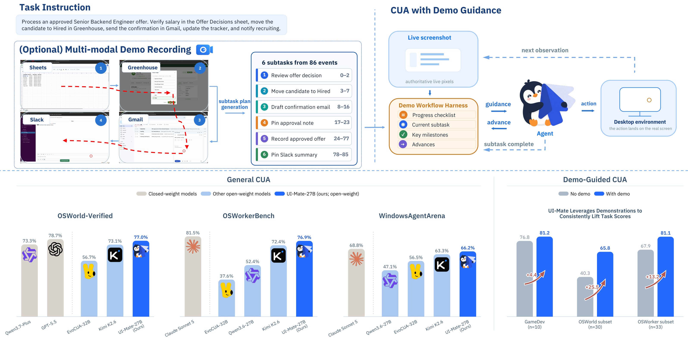

**图 1｜UI-Mate 将强大的通用计算机使用能力与演示引导执行结合起来。** 上：面对描述不足的跨应用任务，可选的多模态演示先被提炼为子任务级工作流。执行时，harness 提供当前子任务与关键里程碑；智能体在实时界面中定位目标、执行动作，并在完成后推进工作流。下：在通用 CUA 评测设置中，UI-Mate-27B 在 OSWorld-Verified、OSWorkerBench 与 WindowsAgentArena 上可与领先的开放/闭源系统竞争。在所报告的 self-demo 评测中，一条同任务演示分别把 GameDev、OSWorld 子集和 33 任务 OSWorkerBench 子集的任务分数从 76.8 提升到 81.2、从 40.3 提升到 65.8、从 67.9 提升到 81.1。

## 目录

1. 引言
2. 概览
   1. 任务形式化
   2. UI-Mate 系统概览
3. 数据流水线
4. 面向通用计算机使用训练 UI-Mate
5. DemoCUA：从上下文内演示中学习
6. OSWorkerBench：带多模态演示的真实跨应用办公工作流
7. 评测
8. UI-Mate App
9. 相关工作
10. 讨论与未来工作
11. 作者贡献
12. 参考文献
13. 附录

## 1 引言

基础 GUI 智能体有望把自然语言意图转化为跨软件生态的多步操作。近期 CUA 系统 [1,2]，包括 UI-TARS [3,4] 与 Qwen-UI-Agent [5]，表明视觉语言模型能够直接在屏幕上感知界面、定位动作并执行较长工作流。然而，仅有基准分数的进步并不能带来可靠的现实部署，因为它仍受两类互补瓶颈制约。第一是**训练瓶颈**：可扩展 GUI 学习不仅需要轨迹，还需要可执行环境、可靠验证器与广泛能力覆盖。第二是**交互瓶颈**：指令通常容易说明用户想要的结果，却很难穷尽用户特定的实现过程。前者限制智能体能学到什么，后者限制它能否稳定运用已有能力。

GUI 交互数据无法与产生数据的环境分离。不同于静态文本或图像语料，一条轨迹只有在其初始状态可实例化、动作可执行、结果可验证时才有学习价值。近期工作通过可扩展合成经验、跨平台轨迹收集和自动构建可验证环境来应对这一问题 [2,6–8]。然而，规模本身并不保证覆盖面。数据生产天然偏爱成本低的内容：短时程、单应用任务快速积累，而长时程工作流、跨应用信息转移和执行错误恢复仍然稀缺。用这种偏斜分布训练会鼓励狭窄的执行模式。因此，核心数据问题不只是“收集多少轨迹”，还包括如何诊断并修正语料覆盖不到的能力。

即使智能体能力足够，交互瓶颈仍然存在，因为缺失的信息根本没有写在指令中。日常工作受用户所用工具、文件组织方式、模板、命名规范和交付格式影响，并不存在一种普适流程。若把每一个选择都编码进提示，其成本可能与亲自执行任务相当，因此用户往往只给简短指令，把程序性细节留作隐含条件。这些细节可能在不同运行中被不同解释，使智能体在看似完全相同的请求上一次成功、一次失败。平均成功率会掩盖这种差别：偶尔正确消解歧义与稳定正确消解歧义可能得到相同均值，但只有后者足以支持可靠委派。对终端用户而言，可靠性不是能力之外的次要属性，而是能力被实际感知的方式。

为同时解决两类瓶颈，我们提出 **UI-Mate**，一种把环境落地训练与上下文内演示学习结合起来的开放权重基础 GUI 智能体。图 1 概括系统和两种评测制度，第 2 节形式化任务并给出完整架构。训练侧的闭环数据流水线（第 3 节）构建任务及可执行环境、收集和过滤 rollout，并利用分层能力树识别和再平衡覆盖缺口。所得验证轨迹与“任务—验证器”包支持监督微调，随后在通用计算机使用训练栈（第 4 节）中进行在线智能体强化学习。

交互侧引入 DemoCUA（第 5 节），通过由人类或智能体录制的多模态演示传达程序性意图。此前的人类教学 GUI 智能体已表明，屏幕录像可以暴露可复用的程序知识 [9]。UI-Mate 不把录像当作要复现的动作序列，而是转为子任务级工作流。执行时，实时截图始终具有最终权威：智能体在仍适用时遵循演示步骤，补足演示省略的低层动作，并在目标任务与录像分叉时重新规划。UI-Mate App（第 8 节）在用户自己的桌面上实现这一范式，可录制一次演示并在同一实时环境中运行智能体。

衡量这种引导的价值，需要超越 OSWorld [10] 和 WindowsAgentArena [11] 等桌面基准的仅指令协议。因此我们提出 OSWorkerBench（第 6 节）：100 个办公中心的长时程任务，跨越 41 个归一化应用和 10 类岗位。67 个 Long-Memory 任务要求延迟复用动态信息，49 个 Multi-App 任务要求在至少三个应用间实质传递信息。基准同时支持仅指令和演示引导，并区分两种演示设置。33 任务 **self-demo** 集把每个目标与强智能体在同一任务上的成功 rollout 配对，用于本报告的定量 DemoCUA 评测；45 任务 **variant-demo** 集则把目标与人类在语义相关但并不相同的源任务上的多模态录像配对，用于衡量程序迁移。在任一成对比较中，目标指令、初始化环境、交互预算和可执行验证器固定不变，唯一变化是是否提供演示。

第 7 节的评测结果表明：UI-Mate-27B 在 OSWorld-Verified 得到 77.0%，在 WindowsAgentArena 得到 66.2%，是比较系统中最强的开放权重结果。在 OSWorkerBench 上，它取得 41.0% 严格成功率与 76.9% 进度分，分别比 Qwen3.6-27B 基座高 17.7 和 24.5 个百分点。在 OSWorld-Verified 的 30 任务子集上，一条演示把平均任务分数从 40.3% 提高到 65.8%。在本工作提出的 33 任务 OSWorkerBench self-demo 子集上，进度从 67.9% 升至 81.1%，严格成功率从 17.2% 升至 35.4%。这些结果支持一个核心经验结论：演示不仅提高平均任务完成度，也提高智能体实现欠明确用户意图时的一致性。

本报告的三项主要贡献为：

- **环境落地的数据与训练。** 开发闭环流水线，联合构建任务和环境、过滤轨迹、诊断能力覆盖，并为 SFT 与在线 RL 同时生产监督信号。
- **演示引导的计算机使用。** 提出上下文学习形式，将人类或智能体的多模态演示转换为自适应子任务工作流，在不把执行退化成僵硬回放的前提下保留程序性意图。
- **基准与经验证据。** 提出 OSWorkerBench 及其受控成对协议；展示 UI-Mate 推进开放权重通用计算机使用，并证明演示能大幅提升长时程执行可靠性。

## 2 概览

### 2.1 任务形式化

#### 通用计算机使用

我们把一个计算机使用任务定义为一对：

$$
\mathcal{T}=(x,\mathcal{E}),\tag{1}
$$

其中，$x$ 是自然语言指令，$\mathcal{E}$ 是计算机使用环境，即一台包含操作系统、已安装应用和用户文件、由智能体直接操作的机器。

智能体以离散决策步与 $\mathcal{E}$ 交互。在第 $t$ 步，它接收观察 $o_t$，即上一个动作执行后的屏幕截图；随后产生响应：

$$
y_t=(r_t,a_t)\sim\pi_\theta\!\left(\cdot\mid x,h_t,o_t\right),
$$

其中 $r_t$ 是中间推理，$a_t$ 是要执行的动作，$h_t$ 是交互历史。$h_t$ 只保留最近若干响应的有界窗口，因此输入不会随任务长度无限增长。记该步上下文为 $c_t=(x,h_t,o_t)$。

一次响应可以携带多个动作：

$$
a_t=\left(a_t^{(1)},\ldots,a_t^{(K_t)}\right),\qquad a_t^{(k)}\in\mathcal{A},
$$

其中 $\mathcal{A}$ 是动作空间。这 $K_t$ 个动作连续执行，全部结束前智能体不会收到新观察。因此，一次响应就是一个**决策轮**，本文以决策轮而非单个操作度量交互长度。

智能体发出终止动作或耗尽步数预算后，执行结束。所得轨迹为：

$$
\tau=(x,o_1,y_1,\ldots,o_T,y_T).
$$

任务是否成功不能仅从 $\tau$ 本身读出，而由可执行验证器检查 $\mathcal{E}$ 的最终状态，并返回二值结果 $R(\tau)\in\{0,1\}$。智能体优化 $\mathbb{E}[R(\tau)]$。

#### 演示引导的计算机使用

演示引导任务额外提供演示 $d$，展示过去如何完成同一任务或高度相关的任务。本文不把 $d$ 当作扁平动作序列，而将其分割成有序子任务集合：

$$
d=(s_1,\ldots,s_N),\qquad s_n=(\ell_n,v_n,u_n),
$$

其中 $\ell_n$ 是自然语言子任务目标，$v_n$ 是可验证的完成准则，$u_n=(u_n^{(1)},\ldots,u_n^{(M_n)})$ 是该子任务内按序执行的动作描述。每个 $u_n^{(m)}$ 都是一次操作及其目标视觉线索的文字描述，不含像素坐标，因而只是建议而不是可直接执行的动作。

每一步只向智能体展示当前相关的演示部分。指针 $n_t\in\{1,\ldots,N\}$ 跟踪活动子任务，智能体所条件化的**工作流视图**为：

$$
g_t=\Phi(d,n_t)=\left(\underbrace{\ell_1,\ldots,\ell_N}_{\text{进度检查清单}},\ \ell_{n_t},v_{n_t},u_{n_t}\right).
$$

也就是说，系统展示全部子任务目标，并标注已完成/当前/即将执行，但只展示当前子任务的详细动作步骤。策略变为：

$$
y_t=(r_t,a_t)\sim\pi_\theta\!\left(\cdot\mid x,h_t,o_t,g_t\right),
$$

动作空间增加一个控制动作：$\mathcal{A}^{+}=\mathcal{A}\cup\{\textsc{subtask\_complete}\}$。当 $o_t$ 满足 $v_{n_t}$ 时，智能体发出 `subtask_complete`，推进指针：

$$
n_{t+1}=\begin{cases}
\min(n_t+1,N), & a_t=\textsc{subtask\_complete},\\
n_t, & \text{其他情况}.
\end{cases}
$$

因此，演示进度由所观察的屏幕状态驱动，而非固定步数计数器。

这一形式有两项关键性质。第一，$g_t$ 是**先验**而非目标：$u_{n_t}$ 可能遗漏实时屏幕所需的低层操作，也可能引用不存在的元素或与当前状态错位。因此，正确的 $a_t$ 是观察 $o_t$ 所要求的动作，观察对演示保有否决权。第二，目标没有改变：验证器仍检查 $\mathcal{E}$ 的最终状态，智能体仍最大化 $\mathbb{E}[R(\tau)]$；演示只改变策略的条件输入。没有有用演示时 $g_t=\varnothing$，通用计算机使用正是这一特例，而演示引导智能体也必须在该情形下保持能力。

### 2.2 UI-Mate 系统概览

UI-Mate 提供五个相互连接的组件，共同覆盖计算机使用智能体的完整生命周期：环境落地的数据流水线、通用计算机使用训练栈、用于上下文内演示学习的 DemoCUA、用于受控评测的 OSWorkerBench，以及用于部署和评测的统一 harness。它们把可执行数据构建、策略训练、程序适配、基准评测与真实执行连接起来。

**环境落地的数据流水线。** 从任务指令出发，流水线构建所需应用、文件和初始状态，执行智能体 rollout，并删除无效或不完整轨迹。分层能力树跟踪数据覆盖，识别覆盖不足的应用、操作和工作流。流水线为 SFT 输出验证轨迹，为在线 RL 输出可执行“任务—验证器”包；rollout 结果和能力诊断反馈到下一轮任务与环境构建，使收集聚焦薄弱或缺失能力。第 3 节详述该流水线。

**通用计算机使用训练。** SFT 学习交互协议、视觉定位、应用工作流和多步执行；RL 让策略在可执行环境中行动，并依据完整轨迹的验证器分数学习。两阶段共同产生能够长时程规划、跟踪跨应用状态、从错误中恢复并从自然语言指令完成任务的策略。训练方法见第 4 节。

**DemoCUA。** 人类录制或成功智能体 rollout 在线下被转换为包含子任务、完成准则和视觉落地动作描述的结构化工作流。执行期间，模型同时接收当前工作流、实时截图与交互历史。由于截图仍是动作选择的主要依据，模型能够遵循有用步骤、跳过不必要步骤，并在目标与录像不同时修改计划。训练样例覆盖演示与屏幕一致、部分分叉或无关的情形，使模型把工作流当作指导而非固定脚本。

**OSWorkerBench。** 100 个长时程办公任务跨 41 个应用。33 个目标配有同任务强智能体 self-demo，45 个目标配有人类录制的相关但不同任务 variant-demo。在任一成对协议中，有无演示的运行保持目标、指令、环境、预算与验证器一致。前者隔离同任务执行指导的价值，后者才真正测量跨任务变体的程序迁移；基准同时报告严格成功和长工作流的部分进度。其设计与构建见第 6 节。

**统一部署与评测 harness。** 共享 harness 在部署和评测中将策略连接到可执行计算机环境，管理观察—推理—动作循环、历史、模型调用、动作执行和轨迹记录。平台适配器支持本地桌面、虚拟机和沙盒。UI-Mate App 用它实现通用/演示引导执行、演示录制和用户监督；评测系统使用相同交互格式，并在受控环境中对完整轨迹附加可执行验证器。UI-Mate App 及其部署见第 8 节。

## 3 数据流水线

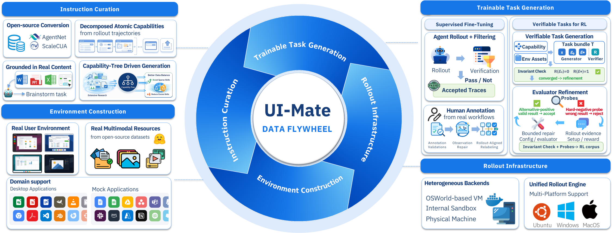

**图 2｜UI-Mate 数据飞轮概览。** 流水线联合扩展指令策划、环境构建、可训练任务生成和 rollout 基础设施。SFT 数据把过滤后的智能体 rollout 与经验证、修复的人类轨迹结合起来；RL 数据来自可验证任务包，其评估器通过互补探针与 rollout 反馈持续改进。覆盖诊断和结果诊断反馈到下一轮能力再平衡，使训练分布在多样性、难度与可靠性上不断改善。

### 3.1 任务指令

用于 rollout 和训练通用计算机使用智能体的任务指令要同时满足两个方向相反的要求：既应反映人们真实会在计算机上做什么，又应系统覆盖智能体需要操作的功能表面。我们通过四类互补来源兼顾二者。

第一，AgentNet [1]、ScaleCUA [12] 等开放计算机使用数据集提供源于真实用户活动的广泛日常任务基础。第二，从失败或停滞 rollout 中分解出的原子子任务，使分布聚焦智能体实际觉得困难的操作。第三，从真实文档、电子表格、演示文稿和静态网站生成的指令 [7] 会引用具体实体和关系，而非合成占位符，并支持跨多个应用的长时程工作流。第四，从应用规范构建的能力树会暴露普通工作流往往触及不到的细粒度操作。

我们有意把分布偏向日常办公使用，同时纳入真实用户执行的任务和从真实工作材料派生的任务。二者结合，在保证 GUI 智能体所需能力得到系统覆盖的同时，提高多样性与真实性。指令来源详见附录 A。

### 3.2 环境构建

#### 从指令到可运行环境

我们设计自动流水线，把每条指令转换成可执行环境。LLM 识别所需文件（文档、表格、演示文稿或图像等），并在需要时生成可执行代码来创建文件。流水线上传资源并配置操作系统、应用和任务特定状态，从而得到执行所需的初始设置与环境资源。

即使支持同一任务，真实用户环境也会有显著差异。因此，随机化设置代码在不破坏任务可行性的前提下改变壁纸、桌面布局、应用设置和侧边栏位置，以丰富数据并降低模型对偶然视觉或界面配置的依赖。

#### 用真实资源落地环境

LLM 生成的资源往往比真实文件更短、更同质，并可能包含占位符。这类产物会制造捷径，扭曲真实性和难度。因此，我们索引开放源文档、演示文稿、电子表格、图像、视频与音频，使文件更接近真实工作材料的丰富度和不规则性。构建期间，LLM 通过设置代码检索并复制真实文件；只有没有可用文件时才合成。已由真实文件或静态网站落地的任务直接使用原资源。这样既简化了真实材料访问，也减少了合成伪迹。

### 3.3 Rollout 与过滤

#### Rollout 基础设施

rollout 基础设施要高效、可靠地执行大量异构计算机使用任务。它通过统一接口支持 Ubuntu、Windows 和 macOS，同时适配各操作系统不同的虚拟化与部署限制。

为支持并行 rollout 和复杂 RL 环境，我们开发了内部云虚拟机后端，针对轻量环境供应与高吞吐并行执行优化。后端暴露环境创建、交互、观察和销毁的可编程接口；在保持并发 rollout 隔离的同时动态分配 worker。它还管理完整 rollout 生命周期，包括资源上传、环境设置、智能体交互、观察收集和奖励计算。rollout 被独立调度到可用 worker，大量长时程轨迹可跨异构机器与后端并发进行。

#### 轨迹过滤

过滤分两阶段：任务/环境有效性检查，以及逐步结果过滤。第一阶段由多模态裁判检查设置配置与初始环境状态；只有任务和环境有效，且 rollout 证据支持全部预期交付物时才保留轨迹。

在评估智能体行为前，裁判会拒绝含糊或不可行任务、与设置不一致或初始状态已经满足的任务，以及动作畸形、缺失视觉观察或环境故障的轨迹，避免任务与基础设施缺陷进入监督。

第二阶段进行逐步结果验证：裁判从每条指令中抽取可独立验证的交付物，并跨 GUI 观察与动作追踪支持证据。只有每一项交付物都有证据支持，轨迹才会保留。贯穿 rollout 的证据跟踪能防止看似合理的最终状态或智能体无依据的自述掩盖部分失败，也能捕捉最终画面中不存在的中间证据。

### 3.4 能力树与数据诊断

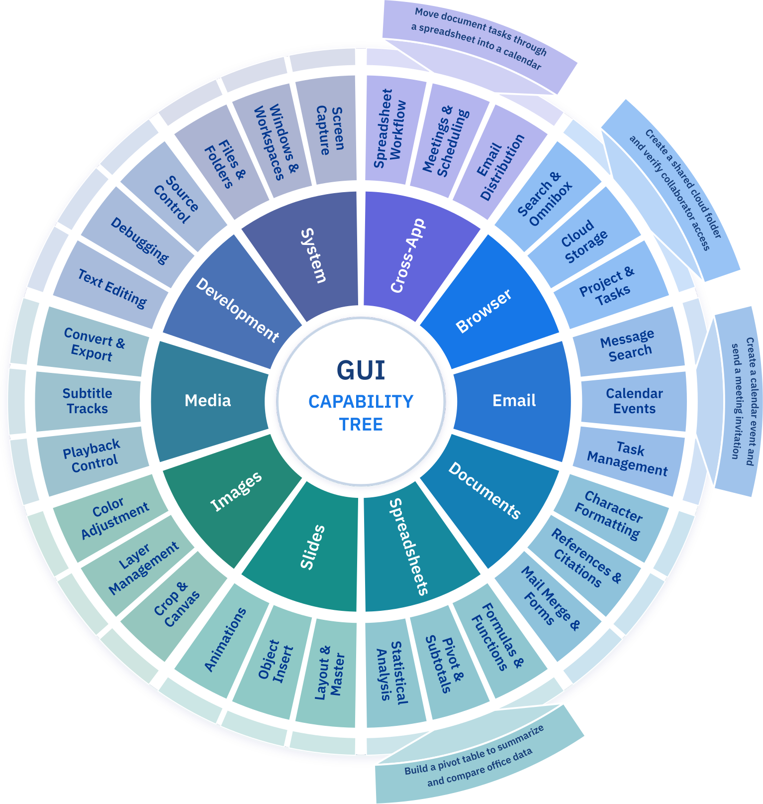

**图 3｜所收集 GUI 能力树的代表性子集。** 层级从应用领域进入细粒度能力，再进入代表性工作流；扇区大小仅为示意。

大规模数据生产偏爱低成本任务，而应用级统计又会掩盖覆盖不足的行为。因此，我们把每个任务映射到共享能力分类，并把 rollout 结果关联到相应能力，使覆盖缺口能直接指导下一轮数据生成。

#### 提取能力

对每个应用，我们维护面向用户的原子能力清单。清单由应用文档初始化，并用训练指令中发现的行为扩充。标注时，每条指令先匹配已有条目；只有不存在合适匹配时才创建新条目。连接多个应用的行为（如应用间的信息转移与变换）维护在独立的跨应用领域。

#### 构建能力树

扁平清单变大后，匹配会产生歧义，数据预算也难以一致分配。因此，能力按三层组织：应用、粗粒度能力、细粒度操作。每个任务先路由到粗粒度能力，再在其子树内匹配，从而减少近重复项混淆。粗层级保持稳定以便预算，细粒度节点按需增加，并定期合并冗余或不活跃节点。跨应用的等价条目相互对齐，以暴露共享交互模式。

#### 数据再平衡

我们依据目标覆盖度、观察到的数据密度、rollout 成功率和过滤拒绝率来再平衡语料。相对目标密度过低会触发额外生成，供应过量的能力会降权。若数据量充分但成功率低或拒绝率高，则更可能说明任务或环境有缺陷。任务长度被作为单独采样维度，避免大量短任务掩盖长时程缺口。新任务再次经过同一标注与评估流水线，其结果更新下一轮分配，由此闭合能力诊断与数据生成之间的回路。

### 3.5 人工标注

自动 rollout 提供规模，但仍偏向当前智能体能执行、且环境便宜易建的任务。因此，我们补充来自不同操作系统和应用中真实工作流的人类标注轨迹，捕捉合成数据中覆盖不足的自然交互与长尾行为。原始标注可能存在标签不一致、录制伪迹或监督格式不同，故需经过验证、观察修复和对齐重标。

**标注验证与观察修复。** 确定性检查验证结构完整性以及动作—参数一致性；多模态复核判断任务是否完成、每个动作是否符合可见状态变化。我们特别关注观察时机：动作前截图可能通过光标或悬停状态泄漏目标，也可能捕捉不稳定的界面过渡。目标泄漏时从缓冲中选择更早帧，渲染未完成时选择更晚帧，并在需要时从源录像做有时间界限的恢复。修复帧再次验证；只有无法修复的损坏或标注工具污染才会导致轨迹删除。优先修复既保留昂贵监督，又不让视觉捷径或动作不一致进入训练。

**与 rollout 对齐的重标。** 人类录像提供动作类型和参数，却没有策略所需的推理与自然语言动作描述。教师模型使用和模型 rollout 相同的系统提示、交互历史、观察折叠和动作空间进行补标。输出按顺序联合生成，但全部人类标注动作参数固定不变。一致性检查剔除动作不匹配与特权标注泄漏，在不改变可执行人类监督的前提下得到相同的决策步表示。

### 3.6 用于强化学习的可验证任务

可验证奖励强化学习（RLVR）不仅需要指令与可运行环境，每次 rollout 还必须以可验证信号结束。人工编写这类任务昂贵，因为指令、配置和奖励必须对同一初始条件与完成准则达成一致。因此，我们把构建自动化为两阶段：**生成**把能力与环境资产转为多样、自包含的任务包；**细化**用独立压力测试修复评估器。

两阶段共享同一数据契约。除公式（1）中的任务指令 $x$ 和环境 $\mathcal{E}$ 外，用于 RL 的任务还固定 rollout 起始的初始状态 $\mathcal{E}_0$、生成器可以抵达的参考完成状态 $\mathcal{E}^{\star}$，以及对环境状态求值的逐任务可执行验证器 $R$。每个任务必须满足执行不变量：

$$
R(\mathcal{E}_0)=0,\qquad R(\mathcal{E}^{\star})=1.\tag{9}
$$

生成用它检查内部一致性；细化则进一步判断评估器是否忠实表达指令，而不只是同参考答案一致。

#### 可验证任务生成

**扩展指令与可执行配置。** 复用第 3.1、3.2 节的来源和环境构建机制，但在 RL 中把二者耦合得更紧。能力引导采样控制要练习的行为及其组合方式；配置合成实例化指令执行所需的资源、前置条件和应用状态。于是同一能力可在不同文件、用户上下文、应用状态和系统配置中实现，扩大交互多样性而非只做释义。复杂指令也能保留真正可执行所需的环境依赖，而不会被简化成最易初始化或最易评估的版本。联合扩展指令与配置空间，是扩大可验证任务覆盖面和难度的主要机制。

**环境与奖励解耦构建。** 受 CUA-Gym [8] 的生成器—判别器形式启发，我们分离“实现任务”和“判断结果”两个角色。生成器构建可执行配置、初始状态与参考完成状态；验证器智能体从任务规范派生奖励。这个信息边界保障评估忠实：验证器只看到规范和结果状态，判断用户可见目标是否达成，而不依赖参考完成的具体路径。我们进一步加入应用感知配置合成，因为决定任务成功的状态可能存在用户产物、应用配置、结构化存储（如数据库）或操作系统状态中。生成器逐任务解析状态位置，并通过统一评估器接口将其暴露给验证器。配置可观察性与奖励语义共同设计，使可验证性成为构建期约束，而不是 rollout 后追加的标注。

**生成期收敛检查。** 只有任务包各组件收敛到同一任务语义时才保留。静态和模型检查先拒绝无支持前置条件、不一致产物、弱代理奖励以及未暴露评估所需状态的配置，再通过执行直接测试不变量。这能低成本删除畸形或平凡满足的任务，但只建立内部一致性；参考完成与奖励仍可能共享语义盲点。因此，收敛是独立细化的前提，而不能替代细化。

#### 评估器细化

**独立于自洽性的探针。** 细化把收敛任务包当作只读输入，沿独立于生成的推理路径重新检查指令—奖励对齐。先把标量通过/失败拆成逐要求诊断，再应用两个互补探针：**困难负例**把成功状态扰动成合理但错误的完成，理应被拒绝；若接受则奖励定义不足。**替代正例**构造不同但合法的完成，理应被接受；若拒绝则奖励过严。连同原始初始和参考状态，这些探针同时提供误接收与误拒绝证据，而不只验证单个解。

**Rollout 反馈与有界修复。** 真实 rollout 会暴露生成时无法预料的不一致：配置生成意外状态、前置条件在初始化后失效、合法结果在应用中以不同形式表示，或奖励响应某种捷径。被标记任务进入有界修复循环，而不是直接丢弃；修复可针对配置、参考状态、评估器，或在目标本身含糊时针对指令。每次修改都必须重新通过不变量和探针；若改善一个信号却损害评估器可观察性或任务符合性，则撤回。只有没有硬设置缺陷、并同时得到正负证据支持的任务才进入 RL 语料。

**把扩展视为耦合设计目标。** 这些组件使扩展不再是三个彼此独立的吞吐问题。新增生成能力贡献的是新能力、新交互上下文和新难度，而不是释义、易验证任务或噪声奖励；它在保持 RLVR 所需可执行性与可靠性的同时拓宽训练分布前沿。

## 4 面向通用计算机使用训练 UI-Mate

### 4.1 训练配方

UI-Mate 分两阶段训练：监督微调（SFT），随后是智能体强化学习（RL）。SFT 从第 3 节数据流水线过滤后的离线轨迹学习，使模型掌握 GUI 交互能力：按交互协议生成格式正确且可执行的响应，把语义目标落到屏幕坐标，并依据截图和历史选择动作。

智能体 RL 让模型在第 3.6 节的可验证环境中在线交互，以任务级奖励优化成功完成，而不是模仿动作。这一阶段改善长时程规划、状态跟踪、错误恢复与可靠任务完成。

### 4.2 监督微调

**训练数据。** SFT 语料依据第 3 节数据流水线构建。对每条任务指令，先用第 3.2 节机制实例化可运行环境，再通过第 3.3.1 节基础设施执行智能体 rollout；只有第 3.3.2 节逐步验证确认全部要求结果的轨迹才保留。所得轨迹按照第 3.4 节能力树采样，在应用、能力层级和任务长度之间保持均衡。训练混合覆盖原子操作、单应用工作流与跨应用任务，并同时包含带显式中间推理和不带显式中间推理的轨迹 [1]。

**目标。** 每个训练实例是保留轨迹中的一个决策轮。给定指令 $x$、进入第 $t$ 轮的交互历史 $h_t$ 和当前截图 $o_t$，模型复现目标响应 $y_t$（推理加动作）。记轮次上下文 $c_t=(x,h_t,o_t)$，SFT 对响应 token 最小化下一 token 预测损失：

$$
\mathcal{L}_{\mathrm{SFT}}(\theta)=-\mathbb{E}_{(c_t,y_t)\sim\mathcal{D}_{\mathrm{SFT}}}\left[\frac{1}{|y_t|}\sum_{k=1}^{|y_t|}\log\pi_\theta\!\left(y_{t,k}\mid y_{t,<k},c_t\right)\right].
$$

其中 $y_{t,k}$ 是响应第 $k$ 个 token，$|y_t|$ 为响应长度；轮次上下文不计算损失，只充当条件。

### 4.3 智能体强化学习

从 SFT 策略出发，UI-Mate 在第 3.6 节所述可验证 GUI 环境中，按第 2.1 节定义的决策轮交互在线优化。每条完整轨迹由环境验证器评分。图 4 概括整个 RL 流水线：自适应任务采样和分组在线 rollout 与基于验证器的信用分配、异步 GRPO 更新结合；决策轮中心化与 token 级归一化构成仅结果信用路径，可选的**过程信用模型**（PCM）进一步把验证器信用定位到具体步骤，并提供过程级诊断。

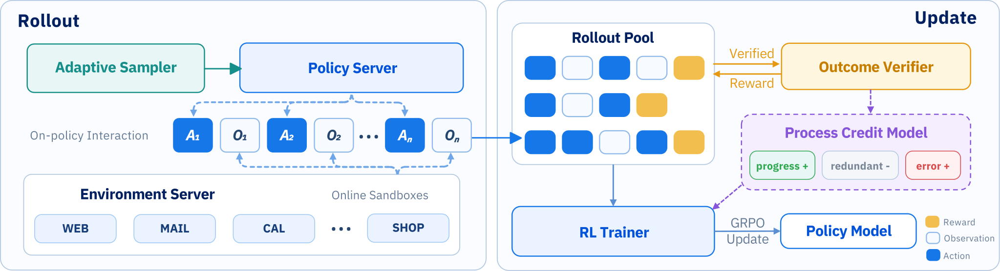

**图 4｜UI-Mate 的智能体 RL 系统。** 流水线分为 rollout 阶段（左）和更新阶段（右）。自适应采样器在固定策略快照下驱动在线沙盒 rollout；完整轨迹按任务组汇集，进行结果验证、可选过程信用分配与异步 GRPO 更新。

#### 4.3.1 在线 GUI RL 预备知识

**分组在线交互。** 按照第 2.1 节的形式化，设所选可验证任务为 $\mathcal{T}=(x,\mathcal{E})$。轨迹 $i$ 的第 $t$ 个决策轮由 rollout 策略快照 $\pi_{\bar\theta}$ 采样：

$$
y_{i,t}=(r_{i,t},a_{i,t})\sim\pi_{\bar\theta}(\cdot\mid c_{i,t}),\qquad c_{i,t}=(x,h_{i,t},o_{i,t}).
$$

即使 $a_{i,t}$ 含多个连续操作，$y_{i,t}$ 仍只算一个决策轮。模型发出终止动作或达到预算后轨迹结束。构造 rollout 组时，同一固定策略快照在多个独立环境实例上运行所选任务，每次得到一条完整轨迹。成功和失败任务执行都保留，只丢弃环境或基础设施故障破坏的 rollout；剩余 $N$ 条轨迹组成 $\mathcal{G}=\{\tau_i\}_{i=1}^{N}$。因其共享同一任务和策略快照，结果可直接比较。

**组相对结果监督。** 验证器检查最终环境状态并返回 $R_i=R(\tau_i)\in\{0,1\}$。本文采用组相对策略优化（GRPO）[13,14]，无需学习价值模型，而通过同一组内结果比较估计相对优势。当组内所有轨迹结果相同时，由于没有相对学习信号，该组被排除 [15]。

#### 4.3.2 从轨迹到 token 的信用分配

验证器每条轨迹只给一个结果，actor 却在很多决策轮的 token 上优化。把同一轨迹级 GRPO 优势广播给所有决策轮有两个问题。第一，仅结果监督下，同组轨迹的决策轮数不同；失败轨迹因试错往往更长，因而会得到更大权重，形成决策轮偏差。本文用决策轮中心化修正。第二，即使中心化，结果仍不能说明哪些步骤是成败关键；PCM 用过程证据识别这些步骤并重新加权学习信号。

**决策轮中心化。** 在决策轮测度下计算组基线：

$$
\mu^{\mathrm{turn}}=\frac{\sum_{i=1}^{N}T_iR_i}{\sum_{i=1}^{N}T_i},\qquad A_{i,t}^{\mathrm{base}}=R_i-\mu^{\mathrm{turn}},
$$

其中 $T_i$ 是 $\tau_i$ 的决策轮数，$t\in\{1,\ldots,T_i\}$。优势在同一轨迹内保持常数，但以决策轮为索引；它近似使 $\mathbb{E}[A]\approx0$。组内只减均值而不除以标准差，以保留奖励尺度，并避免组结果几乎一致时的不稳定放大。

**轨迹合并过程信用。** 仅结果目标可以直接利用最终奖励优化策略，却无法指出同一轨迹中哪些决策步真正关键。因此可选 PCM 借鉴过程监督 [16–18]，使用教师标注识别关键步骤并调整其学习信号，但只在步骤间重分配信用，不改变最终任务奖励 $R_i$；禁用 PCM 时仍使用仅结果目标。

教师先从验证成功的轨迹抽取可观察里程碑，把等价子目标与替代合法分支合并成共享任务结构，再用其标注所有轨迹。对失败轨迹，教师选择最接近的合法分支，把里程碑标为 `completed`、`attempted_failed`、`not_attempted` 或 `skipped_by_branch`；后两类防止被阻塞或无关子目标被误判为策略失败。轨迹级失败分为策略相关、外部、混合或不明确；决策轮级标注识别进展、因果错误、恢复和冗余。相关错误被分组，以区分根因与下游症状。若任务组没有验证成功轨迹，则不应用 PCM，回退到仅结果路径。

设 $e_{i,t}$ 为所得过程证据，PCM 将其转换为非负重要性权重：

$$
w_{i,t}:=\operatorname{clip}\!\left(b+\phi\!\left(e_{i,t},\operatorname{sgn}(A_{i,t}^{\mathrm{base}})\right),0,w_{\max}\right),\qquad
\widetilde w_{i,t}:=\frac{w_{i,t}}{\frac{1}{T_i}\sum_{u=1}^{T_i}w_{i,u}}.
$$

$b$ 与 $w_{\max}$（$0<b\le w_{\max}$）设定基础和最大权重尺度。映射 $\phi$ 奖励成功轨迹中取得进展或从错误恢复的步骤；在失败轨迹中惩罚引入错误的步骤，以及之后未能修正它的步骤。冗余步骤和被环境阻塞的步骤也受惩罚。权重在每条轨迹内归一到均值为 1；若裁剪后全部为零，则给所有步骤相等权重。

符号感知选择器 $m_{i,t}\in\{0,1\}$ 保留有正向证据或对失败负有因果责任的决策轮。PCM 产生：

$$
A_{i,t}^{\mathrm{proc}}:=m_{i,t}A_{i,t}^{\mathrm{base}}\widetilde w_{i,t}s_i,
$$

其中 $s_i\in[0,1]$ 对仅部分归因于策略的失败打折，其余情况为 1。标注有效时 $A_{i,t}^{\mathrm{credit}}=A_{i,t}^{\mathrm{proc}}$；否则 $A_{i,t}^{\mathrm{credit}}=A_{i,t}^{\mathrm{base}}$。未选择响应继续作为上下文，但不承担 actor 损失。PCM 因而把学习集中在信息量大的决策上，并提供过程级数据洞见。

**Token 级归一化。** 决策轮信用之外，响应长度变化也带来偏差，因为 actor 目标按生成 token 聚合。失败试错轮往往需要更多推理 token，其优势被重复更多次，会对目标产生不成比例的影响。本文在优化批次的全部响应 token 上归一化优势 [19]，使统计量与 token 聚合对齐、控制策略更新尺度，并改善稳定性。

#### 4.3.3 异步组相对优化

同步训练要等一个 rollout 组的全部轨迹结束，而 GUI rollout 在环境和任务时程上耗时差异很大 [20]。异步方案让 worker 使用最新可用策略快照；同任务组缓存到足够完整轨迹后，learner 即开始优化。任何单条轨迹都不截断，同组轨迹共享任务配置与策略快照。

异步训练会产生策略陈旧。简记生成响应 $y=(y_1,\ldots,y_{|y|})$，第 $k$ 个 token 前缀为 $y_{<k}$，上下文为 $c$，生成它的 rollout 快照为 $\bar\theta$。训练—rollout 不匹配由似然比衡量：

$$
\rho_k(\theta)=\frac{\pi_\theta(y_k\mid y_{<k},c)}{\pi_{\bar\theta}(y_k\mid y_{<k},c)}.
$$

$\rho_k$ 远离 1 表示显著不匹配。IcePop [21] 与 SeqClip [22] 是互补过滤器：前者拒绝似然比异常的孤立 token，后者检查整个响应上 $\rho_k$ 的几何均值，以发现一致的策略漂移。令 $M_k\in\{0,1\}$ 表示 token 同时通过两者。PPO 式裁剪 actor 目标 [23] 为：

$$
\mathcal{L}_{\mathrm{RL}}(\theta)=-\mathbb{E}_{y}\left[\frac{1}{|y|}\sum_{k=1}^{|y|}M_k\min\!\left(\rho_k(\theta)A_k,\operatorname{clip}(\rho_k(\theta),1-\epsilon,1+\epsilon)A_k\right)\right].
$$

其中 $\epsilon>0$ 是 PPO 裁剪半径。被任一不匹配过滤器拒绝的 token 有 $M_k=0$，不产生 actor 损失。过滤器决定陈旧 token 是否可学习，PPO 裁剪限制保留 token 的贡献，二者处理不匹配的不同方面。

#### 4.3.4 自适应课程采样

随着策略变强，均匀采样会把越来越多 rollout 浪费在已解决任务上。因此，我们使用领域级**自适应课程采样器**，兼顾广泛覆盖与对薄弱应用领域的强调 [24–28]。它只在固定 RL 语料内重分配 rollout 计算；任务构建与语料再平衡仍属于第 3 节。

**基础与自适应分配。** 每次训练迭代选择固定数量任务，每个任务产生一个 rollout 组。任务预算分为基础采样与自适应采样；前者遵循 RL 语料的领域分布维持广覆盖，后者把预算投向最近在线结果识别出的薄弱领域。两部分选择互不重叠的任务，同一批次不会重复。

**估计薄弱领域。** 在最近 rollout 窗口上估计领域性能；只有有效轨迹足够、环境错误率较低的领域才纳入，以免把基础设施故障误作策略弱点。设合格领域集合为 $\mathcal{D}_{\mathrm{elig}}$，领域 $d$ 的有效和成功轨迹数为 $V_d,S_d$，则：

$$
\widehat p_d=\frac{S_d}{V_d},\qquad \bar p=\frac{\sum_{d\in\mathcal{D}_{\mathrm{elig}}}S_d}{\sum_{d\in\mathcal{D}_{\mathrm{elig}}}V_d}.
$$

若 $\bar p-\widehat p_d\ge\delta$（$\delta>0$ 为最小成功率差），领域被视为薄弱。至少两个领域有可靠估计且识别出薄弱领域时才启用自适应采样。随后从薄弱领域无放回抽取任务，并受逐领域上限限制；候选优先级接近时，优先选择最近 rollout 组中成败混合的部分学会任务，因为其组相对信号更有信息量。若统计不足、没有薄弱领域或某领域耗尽任务，未用的自适应预算回流基础采样。

## 5 DemoCUA：从上下文内演示中学习

### 5.1 演示表示

**如何获得演示。** 演示是一段成功桌面执行的录像，其中记录每次鼠标/键盘动作及其前后截图。来源取决于评测设置：self-demo 可以是更强 GUI 智能体在同任务上的成功 rollout；variant-demo 则由人类在相关但不相同的任务上录制。原始轨迹先归一为统一的动作—帧格式，再由视觉语言模型沿四个维度离线标注：屏幕状态、意图、所执行动作，以及如何从视觉上定位动作目标。最后把标注轨迹分成少量连贯子任务，每个子任务有简短目标和明确可检验的完成准则。图 5 概括该离线流水线及演示在在线阶段的逐步使用方式。

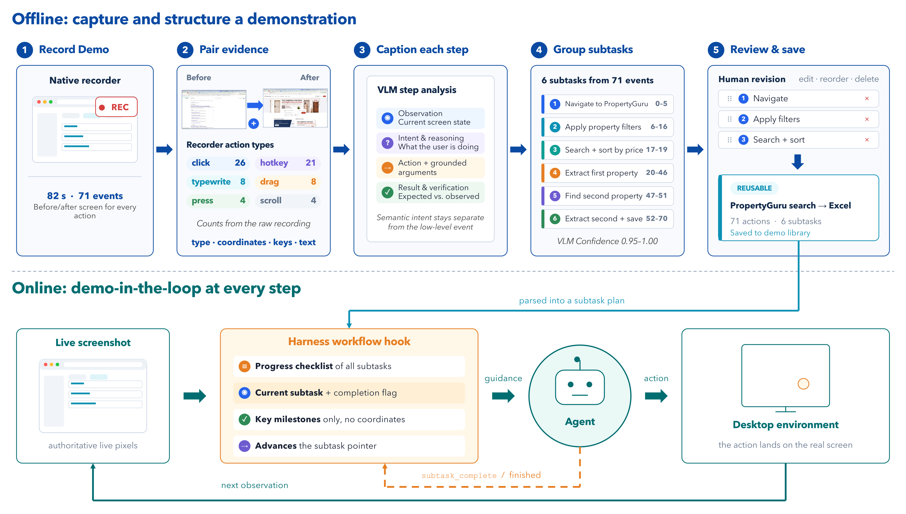

**图 5｜演示表示。** 离线阶段（上），人类录像被标注并分割成带目标和可验证完成准则的子任务；在线阶段（下），智能体依据实时截图执行当前子任务，并在完成后推进。

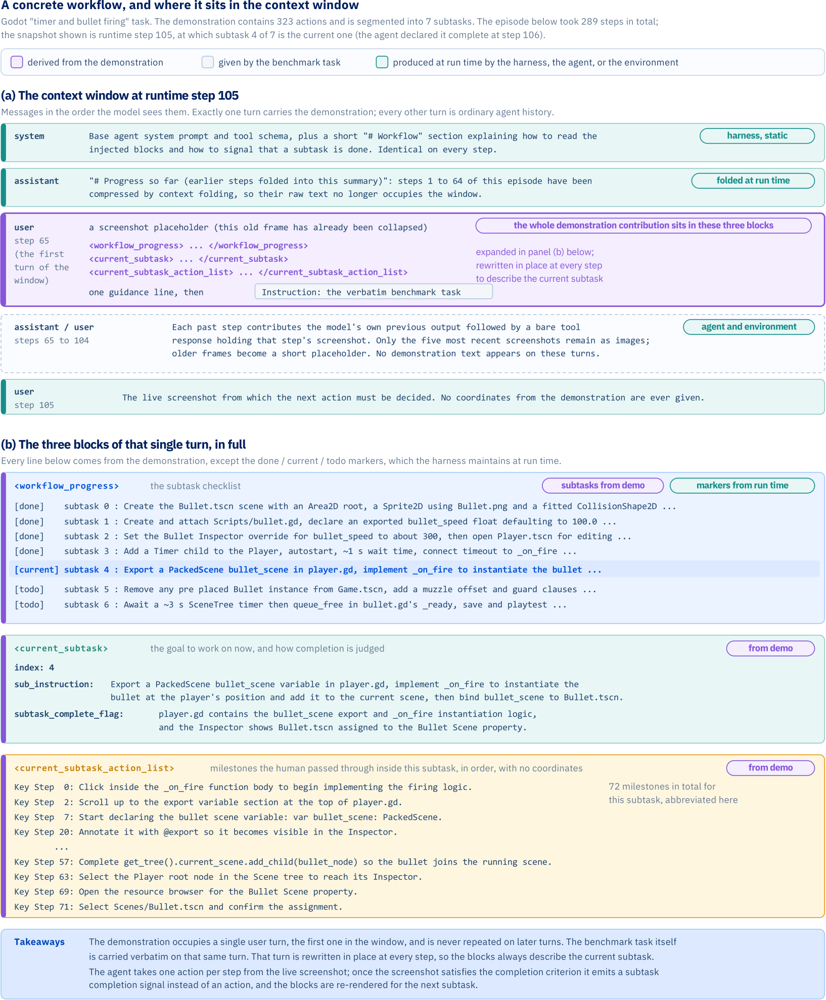

**图 6｜一个完整的 Godot demo-workflow。** 任务要求给简单游戏加入基于定时器的子弹发射。面板（a）展示执行某一时刻智能体可见的上下文，包括原始任务指令、包含演示的一次用户轮次，以及智能体交互历史。面板（b）把演示拆为子任务检查清单、当前子任务及其完成准则和关键里程碑。

**如何使用演示。** 演示是指南，而不是要逐项重放的脚本。每次模型调用前，harness 提供已完成、当前和即将执行子任务的短摘要，以及关键目标与里程碑。它省略像素坐标和低层动作，因此智能体必须依赖实时截图，并能在界面变化时适配。智能体在进入下一个子任务前显式标记当前子任务完成；图 6 给出完整示例及此时提供给智能体的上下文。

### 5.2 使用演示训练

#### 数据生成

我们构建三阶段流水线生成 self-demo（相同任务）和 variant-demo（相似任务）数据：Rollout、Score、Filter & Repair。

1. **Rollout：** 在扰动后的 AgentNet [1] 数据上收集观察到动作的轨迹；用演示引导提示与子任务报告协议提高成功率。
2. **Score：** 混合评估机制由 VLM 裁判判断语义完成度，规则指标验证格式；分别在轨迹、子任务和演示遵循三个层次打分，细节见表 8。
3. **Filter & Repair：** 按需求特定阈值保留数据；不直接丢弃可修复缺陷，而采用表 9 的规则与 VLM 修复以提高数据效率。

**图 7｜DemoCUA SFT 格式。** 演示作为工作流状态快照固定在第一条用户消息中。系统工具包含 `computer_use(click|type|scroll|..., subtask_complete, finished)`；演示工作流是一项契约，但实时截图具有权威。第一条用户消息包括图像、全部子任务的完成/当前/未来进度、当前子任务及完成标记、本子任务的有序动作列表，以及任务指令。

#### 演示增强训练数据格式

如图 7 所示，每个训练样本代表轨迹中的一个决策步。相对标准 CUA 格式有两项变化。第一，系统提示加入演示工作流契约和新 `computer_use` 动作 `subtask_complete`。第二，第一条用户消息加入监督步对应的演示工作流快照，包含子任务清单与进度、当前子任务与完成准则，以及有序动作步骤（完整示例见图 6）。

其余格式不变：助手轮次保留 `<think>`/`<action>`/`<tool_call>` 结构，后续用户轮次只含截图，因此多轮主体与无演示基线一致。子任务完成时，智能体观察动作后截图，再发出 `subtask_complete`；每个 episode 以显式 `finished` 结束。

#### 演示增强数据类别比例

因为演示工作流和目标查询高度对齐，模型可能只复制下一工作流步骤而不查看截图；一旦实时界面与工作流分叉，这一捷径就会失败。为阻止它，训练加入三种“演示工作流—屏幕”关系：

1. **完全对齐：** 模型遵循工作流；
2. **部分错位：** 模型依据截图修正不匹配步骤；
3. **无关：** 模型忽略工作流，只从截图行动。

完全对齐仍占多数，以保证工作流始终是有用信号。

#### 从不完整工作流训练，防止捷径学习

完整轨迹仍是监督目标，但展示给模型的演示工作流只保留关键动作。聚焦点击、滚动、关闭弹窗等中间动作被省略。因此，即便完全对齐，模型也不能直接抄写工作流，必须根据截图推断缺失动作。工作流提供里程碑，模型学习如何抵达。

### 5.3 使用演示推理

推理时直接提供当前子任务的完整动作序列，不再用 LLM 提取关键动作，因此动作列表比训练时更详细。这种不匹配是有意设计：训练时省略动作以防盲目复制；模型学会以截图仲裁后，推理时提供完整序列能给予更充分指导，同时减少一次模型调用和提取错误。

**长时程上下文管理。** 长 episode 会让历史超过模型上下文窗口。系统通过主动折叠和被动截断控制增长。每次推理前，harness 用“每三个文本字符约一个 token”和“每张截图固定 token 成本”估算请求大小。估计使用量接近可配置阈值时，额外调用 LLM，把最早的交互步骤概括成紧凑进度说明；最近步骤保留原文，最近截图单独保留而不被摘要。

**局限。** 当前工作流放在上下文开头，每次子任务更新都会使共享前缀失效，无法有效复用 KV cache。未来将把工作流移到末尾，使上下文只追加增长，并在整个 episode 复用缓存。

## 6 OSWorkerBench：带多模态演示的真实跨应用办公工作流

多数现有 GUI 基准 [10,11] 使用仅指令协议，要求智能体从自然语言请求推断并执行工作流。这对测量通用计算机使用能力至关重要，却不能直接测试智能体能否利用一个“过程应该如何完成”的例子。这种能力对个性化流程、专有/组织内部应用，以及公共训练数据不含其约定、又难以完全用文字描述的复杂过程尤其重要。演示能同时暴露预期动作和结果视觉状态变化。为同时评测演示引导执行与标准指令遵循，我们提出 **OSWorkerBench**：一个面向企业生产力环境、以长时程跨应用办公工作流为中心的基准。

OSWorkerBench 含 100 个真实办公任务，跨 41 个归一化应用和 10 个合并岗位族（图 9a）；全部任务都支持标准仅指令评测。两个独立标注且可重叠的能力子集刻画真实复杂性：67 个 **Long-Memory** 任务要求延迟复用动态信息或持续跟踪约束与工作流状态；49 个 **Multi-App** 任务要求在至少三个逻辑应用间可靠传输动态多字段信息。

演示引导模式又分两个目的不同的设置：33 个目标的 **self-demo** 来自强智能体在同一任务上的成功 rollout，用于第 7.3 节的定量 DemoCUA 评测；45 个目标的 **variant-demo** 来自人类在语义相关但不相同任务上的录像。33 和 45 指不同演示集合，不是 100 个任务的划分。45 个 variant-demo 目标有意选择高难长时程任务；Kimi-2.6 在仅指令运行中平均每任务终止前超过 100 个观察—动作决策轮，决策轮定义及完整轨迹分析见第 7.2.4 节。这些并非只能用演示做的任务，同一目标和评估器可在有无引导两种条件下运行。作者认为，OSWorkerBench 是首个在评测期间把多模态演示作为显式单次指导的 CUA 基准。第 7 节系统呈现 33 任务 self-demo 结果，45 任务 variant-demo 的系统评测留待未来。

### 6.1 基准设计与构建流水线

图 8 概括 OSWorkerBench 构建流水线：从能力落地的任务合成和稠密评估器生成，经过人在回路验证，再为选定的 45 个目标配对人类录制的 variant-demo；33 条 self-demo 则由最终目标任务上的成功强智能体 rollout 单独产生。

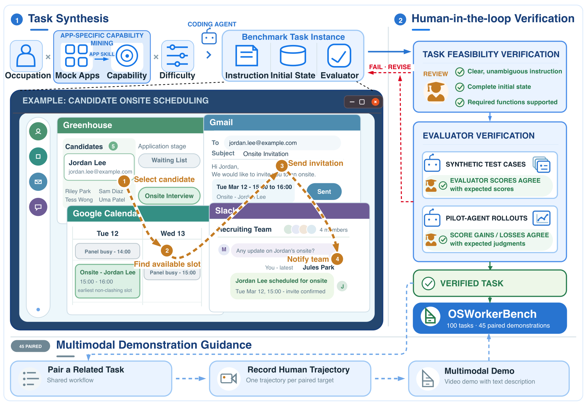

**图 8｜OSWorkerBench 基准构建流水线。** 候选任务实例经历能力落地的任务合成、人类审查、评估器测试与先导智能体 rollout。另有 45 个目标配对人类录制的相关但不相同任务演示，构成 variant-demo 设置。用于 self-demo 评测的 33 条同任务强智能体 rollout 单独构建，图中未画出。

**能力落地的工作流合成。** OSWorkerBench 从职业、应用集合、验证过的应用能力与目标难度出发合成 mock-app 任务。对每个应用，检查其已实现 UI 与状态 schema，识别既能通过界面执行又能以程序观察的功能，并把这些功能作为工作流积木。合成器要求至少一个显式跨应用依赖，而不是简单并列无关动作。在图 8 的现场排期示例中，Greenhouse 选中的候选人决定要安排什么；Calendar 空闲时间约束 Gmail 邀请；确认日程又提供 Slack 通知内容。

难度在合成时指定，而非根据模型表现事后推断。它由三个互补轴控制：**广度**（应用与应用间转换数量）、**深度**（需要导航或发现的非平凡 UI 入口数量与多样性）和**推理**（任务状态中需派生、筛选或刻意保持不变的内容，而非直接复制的量）。更难任务同时提高多个维度。时程由完整人类参考解中的 GUI 动作估计，不是观察到的模型轨迹长度。

工作流与难度确定后，编码智能体流水线把规范实现为自然语言指令、确定性初始状态和可执行评估器。设置与评估器在共享任务和答案契约下分别编写，CUA-Gym [8] 的状态注入设计提供隔离、可重置的会话。

**稠密评估器生成与人在回路验证。** 每个评估器按功能结果而非参考轨迹相似度评分，把任务完成拆成可独立验证的检查点。记录级检查检测缺失、错误或多余输出；门控强制依赖结果的前置条件；权重优先业务主结果，再考虑跨应用输出和辅助确认。大多数检查点比较最终和初始应用状态，包括统一 API 暴露的会话级 mock-app 数据；后端状态不足时，任务专用评估器检查电子表格单元格、生成文件、图像、复合文档或条件输出。每个评估器有 1–13 个检查点（均值 4.86，中位数 5），既支持稠密进度，又把严格成功保留给满足全部最终条件的任务。

部署前，评估器在受控终止状态上测试： untouched 初始状态必须得 0，黄金完成状态必须得 1；逐检查点和合法部分状态测试中间分数，负例加入缺失前置条件、错误值/分支、干扰项和过度操作。每个案例对初始化状态施加受控变异，执行前按 rubric 固定期望分数；生产评估器不作修改地运行全部案例，逐任务 manifest 记录变异和期望分数以便复现。

人类复核指令清晰度、设置完整度、可行性、检查点覆盖、权重与预期部分分数。Kimi-2.6 等代表性 CUA 独立执行各任务，复核者把轨迹和终态与逐检查点、聚合分数对照；任何不匹配都触发指令、设置或评估器修订，并重跑受影响验证。

### 6.2 多模态演示引导

**Self-demo 设置。** 33 个多应用目标用于所报告 DemoCUA 评测。更强 GUI 智能体先成功完成同一任务，rollout 被转换为保留截图和动作类型、但对被评模型省略具体像素坐标的多模态演示。目标重置后，分别在有无同任务演示下评测。self-demo 测量模型使用已演示执行路径的能力；因源任务与目标完全相同，它本身不能证明跨任务变体的程序迁移。

**Variant-demo 设置。** 另选 45 个程序要求高的多阶段目标，专门评测演示引导的程序迁移。每个目标与一条相关但不相同源任务的人类成功演示配对；二者共享可迁移工作流结构，但实体、数值、初始状态和执行细节不同，无法直接回放。原始演示含源指令，以及每个工具调用的动作前截图、动作类型与参数、动作后截图，不含自然语言推理。推理前轨迹被转换成第 5 节无坐标子任务工作流。这 45 对与 33 条同任务演示不同。

**受控评测协议。** 100 个任务都可仅指令评测；演示引导设置在上下文中精确增加一条演示后重跑关联目标。有无演示时目标指令、初始化环境、交互预算和评估器均相同。33 任务 self-demo 的配对差测同任务执行指导价值；45 任务 variant-demo 的差才测已观察程序向相关但不同任务的迁移。其余 55 个任务没有 variant-demo，但仍属于完整仅指令基准。

### 6.3 任务覆盖与特征

如图 9a 所示，每个任务按主要业务结果而非碰巧使用的应用归入唯一岗位族。销售/客户成功/支持最大，共 27 个任务；人力资源与人才、财务与采购各 17；工程/IT/可靠性和营销/增长各 11；余下 17 个覆盖行政运营、数据/文档/学习运营、产品/项目/计划管理、创意媒体、法律合规。

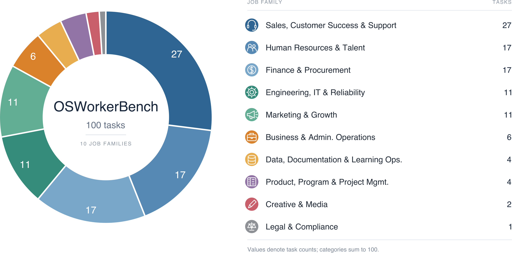

**图 9a｜主要岗位族分布。** 每个任务依据主要业务目标只归一个岗位族。

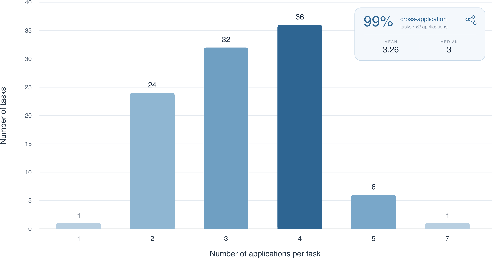

**图 9b｜完整基准中每任务要求的不同应用数量。**

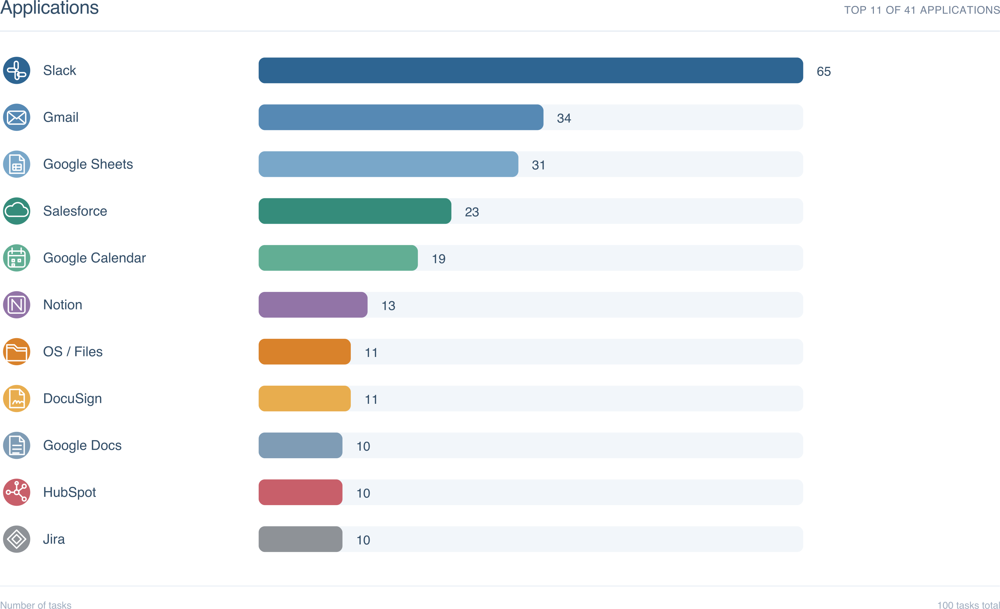

**图 9c｜基准中最常出现的归一化应用。**

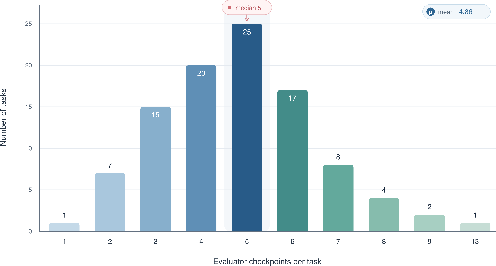

**图 9d｜每任务评估器检查点数量分布。** 图 9 的全部统计基于标准 100 任务集；计数前归一化应用别名和 mock 变体。

**面向能力的任务切片。** 岗位与应用统计只说明任务位于哪里，不能说明工作流为何困难。为此每个任务沿两个要求级维度标注：成功是否需要长期保留任务状态，以及是否需要跨应用实质传递信息。标签刻画任务规范本身，而不依据某模型分数或失败模式；每个案例由语义审查结合指令、设置、评估器和轨迹证据决定，自动脚本只用于对齐证据、计数应用和验证标签一致性。

**Long-Memory 工作流（67 个）。** 当任务要求：（i）读取或派生动态值，跨越实质中间操作或应用切换保留，再在后续被评结果中一致复现；或（ii）跨多阶段维护多个约束、决策、已完成和待办项，就标为 Long-Memory。二者都在早期观察与后续动作间建立显式依赖。单纯轨迹长、绕路、重复点击或最终失败都不算。

**跨应用信息流（49 个）。** 仅打开多个应用不代表跨应用推理。Multi-App 要求至少三个逻辑应用，并从一个应用获取至少两个动态事实、一组多字段记录或一段实质文本，再在另一应用中忠实复现、组织或转换。只转移一个标识符、指令已给常量、或跨应用执行互不相关的固定动作都排除。只计完成评测工作流必须读写的工具；浏览器/桌面 shell、偶然探索和后台应用不计，同一产品的多个标签页或窗口只计一次。Long-Memory 与 Multi-App 可重叠：前者捕捉时间依赖，后者捕捉工具间信息依赖。

**跨应用广度。** 演示改变评测上下文而不改变所需工作流，故图 9b 汇总全部 100 任务。99 个任务至少要求两个应用，68 个要求三或四个，均值 3.26（中位数 3，最大 7）。该数量宽于 49 个 Multi-App 子集，因为后者还要求动态信息转移。

应用频率见图 9c，呈枢纽—辐条结构：Slack 出现在 65 个任务中，其次为 Gmail（34）、Google Sheets（31）、Salesforce（23）、Google Calendar（19）；最常见应用对是 Google Sheets—Slack 和 Gmail—Slack，各 23 个任务。41 个应用的长尾通过这些枢纽完成沟通和状态同步。结合图 9d，应用广度与评估器粒度共同刻画任务结构，评估器包含 1–13 个检查点。

**长时程交互难度。** OSWorkerBench 围绕由许多依赖阶段构成的真实办公工作流，而非孤立 GUI 操作。智能体必须携带动态发现的信息、跨切换保持约束，并同时跟踪已完成与待执行步骤。Kimi-2.6 rollout 的轨迹中位数为 68 个观察—决策轮（均值 88.3），100 条中有 38 条至少 100 轮，因此基准直接考验长记忆、跨应用状态跟踪和端到端控制。决策轮定义及完整轨迹分析见第 7.2.4 节。

### 6.4 可执行评估

每个任务配一个按功能结果而非参考轨迹相似度评分的评估器。88 个任务使用对初始化企业应用后端的状态评估器；其余 12 个使用电子表格、图像、复合文档交付物或条件工作流的任务专用评估器。这一组合在支持无法用单一状态谓词表达的输出时，仍保持确定性最终状态验证。

报告两项指标：要求全部最终状态条件的**严格任务成功**，以及检查点加权的**部分进度**：

$$
S_{\mathrm{partial}}=\frac{\sum_i w_ic_i}{\sum_i w_i},
$$

其中 $c_i\in[0,1]$ 是检查点得分，$w_i$ 是其权重。Long-Memory 与 Multi-App 子集只报告严格成功，因为任务级标签可能只对应部分检查点，部分分数的能力归因含糊。有无演示使用同一评估器，保证增益反映任务结果，而不是动作模仿。作者计划发布任务规范、33 个 self-demo 和 45 个 variant-demo 配对、分类元数据及评估器。

## 7 评测

### 7.1 评测设置

#### 基准

**公共基准。** 用 OSWorld-Verified [10] 与 WindowsAgentArena（WAA）[11] 作为通用计算机使用性能的公共参照。

**OSWorkerBench（第 6 节）。** 仅指令协议下，所有模型只接收目标指令；在全部 100 个任务上报告严格二值成功和基于检查点的进度，并在相互重叠的 67 个 Long-Memory 与 49 个 Multi-App 子集报告二值成功。演示引导评测使用不同配对：所报告定量实验是 33 条同任务强智能体 self-demo，另有 45 条相关但不同任务的人类 variant-demo；后者的系统汇总留给未来。

#### 基线

通用模型包括 Kimi-K2.6 [29]、Qwen3.6-27B [30]、Qwen3.5-9B [31]、GPT-5.5 [32]、Claude Sonnet 5 [33] 和 Claude Opus 4.8 [34]；专用模型包括 EvoCUA-32B [6]、UI-TARS-1.5-7B [3] 与 ScaleCUA-Qwen3.5-9B [35]。由于架构、训练数据和智能体脚手架不同，比较反映端到端系统表现，而不是单独隔离模型规模或专用训练效果。除非另行说明，系统使用相同初始化环境、任务指令、交互预算和可执行评估器；演示引导比较给各系统同一演示，但使用其各自输入格式。

#### 评测协议

**OSWorld-Verified。** 遵循官方代码库和协议 [10]，在官方 Docker/AWS provider 上评测。Docker 提供隔离可复现桌面（可用时启用 KVM），AWS 使用官方 host-client 架构进行并行评测。并行只影响吞吐，不改变单任务配置和评分；报告官方评估器计算的端到端成功率。

**WindowsAgentArena。** 遵循 OS-SYMPHONY 的 WAA 协议 [11]，并参照相应 OSWorld 配置设置模型。实现同时支持 WAA 原始 Docker 环境和内部沙盒，报告任务专用评估器给出的端到端成功率。

**OSWorkerBench。** 为支持长时程状态跟踪，UI-Mate-27B 在历史中保留生成的推理，使中间约束、决策和待办动作在工作流后续仍可用。仅指令基线遵循各自 OSWorld 配置，再适配 OSWorkerBench 环境而不改变模型特定交互机制。所有智能体每任务最多 200 个交互步。

### 7.2 主要结果

#### 7.2.1 OSWorld-Verified

**表 1｜OSWorld-Verified 总体平均分（%）。** 按官方 OSWorld 协议；Size 为公开模型规模；越高越好；`*` 表示作者按官方仓库复现。

| 类别 | 模型 | 规模 | 平均分 |
|---|---|---:|---:|
| 通用多模态 | Kimi-K2.6 | 1T-A32B | 73.1 |
| 通用多模态 | Qwen3.7-Plus | 闭源 | 73.3 |
| 通用多模态 | Qwen3.6-27B | 27B | 52.5* |
| 通用多模态 | GPT-5.5 | 闭源 | 78.7 |
| 通用多模态 | Claude Sonnet 5 | 闭源 | 81.2 |
| 通用多模态 | Claude Opus 4.8 | 闭源 | 83.4 |
| 专用 CUA | EvoCUA | 32B | 56.7 |
| 专用 CUA | UI-TARS-1.5 | 7B | 25.4 |
| 专用 CUA | ScaleCUA-Qwen3.5 | 9B | 68.7 |
| 本文 | **UI-Mate-9B** | 9B | **66.2** |
| 本文 | **UI-Mate-27B** | 27B | **77.0** |

**UI-Mate 推进了专用计算机使用智能体。** 如表 1 所示，UI-Mate-27B 得 77.0%，超过 Kimi-K2.6（73.1%）和 Qwen3.7-Plus（73.3%），距 GPT-5.5（78.7%）1.7 个百分点；也高于 ScaleCUA-Qwen3.5（68.7%）、EvoCUA-32B（56.7%）与 UI-TARS-1.5（25.4%）。UI-Mate-9B 为 66.2%，略低于同为 9B 的 ScaleCUA-Qwen3.5，但比更大的 EvoCUA-32B 高 9.5 点。环境落地训练可让较小模型与大得多的通用系统竞争，规模不是能力的唯一决定因素。

**扩展主要改善应用级工作流。** 9B 与 27B 的 OS 类得分同为 91.7%，说明小模型已学会强基础操作系统交互；27B 总体高 10.8 点，主要来自 Office（+11.9）、Daily（+12.7）、Professional（+6.1）和 Workflow（+13.0）。增加容量对原子 OS 控制帮助较小，对较长的应用特定执行路径帮助更大。

**相对强项在系统交互和工作流协调。** 相对 Kimi-K2.6，UI-Mate-27B 在 OS（91.7 vs 79.2）、Office（85.4 vs 80.0）与 Workflow（63.7 vs 55.0）更高，Daily 接近（76.8 vs 77.1），Professional 较弱（75.5 vs 81.6）。这说明训练更好迁移到操作系统、办公应用和多阶段流程，而专业软件仍是覆盖与泛化的重要改进方向。

#### 7.2.2 WindowsAgentArena

**表 3｜WindowsAgentArena 智能体成功率。** 单位均为百分比，越高越好。

| 类别 | 模型 | 访问/规模 | 总分 |
|---|---|---|---:|
| 通用多模态 | Kimi-K2.6 | 开放，1T-A32B | 63.3 |
| 通用多模态 | Qwen3.6-27B | 开放，27B | 47.1 |
| 通用多模态 | Qwen3.5-9B | 开放，9B | 37.5 |
| 通用多模态 | GPT-5.5 | 闭源 | 70.4 |
| 通用多模态 | Claude Sonnet 5 | 闭源 | 68.8 |
| 通用多模态 | Claude Opus 4.8 | 闭源 | 69.3 |
| 专用 CUA | EvoCUA-8B | 开放，8B | 37.4 |
| 专用 CUA | EvoCUA-32B | 开放，32B | 56.5 |
| 专用 CUA | UI-TARS-1.5-7B | 开放，7B | 42.1 |
| 专用 CUA | UI-TARS-2 | 闭源，230B-A23B | 50.6 |
| 专用 CUA | ScaleCUA-Qwen3.5-9B | 开放，9B | 38.1 |
| 本文 | **UI-Mate-9B** | 9B | **61.7** |
| 本文 | **UI-Mate-27B** | 27B | **66.2** |

如表 3 所示，UI-Mate-27B 的 66.2% 是比较中最强的开放权重结果，比 1T 的 Kimi-K2.6 高 2.9 点，比 EvoCUA-32B、UI-TARS-1.5-7B、ScaleCUA-Qwen3.5-9B 分别高 9.7、24.1、28.1 点；距 Claude Sonnet 5、Claude Opus 4.8、GPT-5.5 分别只差 2.6、3.1、4.2 点。

UI-Mate-9B 达 61.7%，比 Qwen3.5-9B 基座高 24.2 点，比同基座 ScaleCUA 高 23.6 点，比 EvoCUA-32B 高 5.2 点，距 1T Kimi 仅 1.6 点。UI-Mate-27B 相对同规模 Qwen3.6-27B 提升 19.1 点，表明增益来自训练覆盖、质量和可执行反馈，而不只是模型容量。

#### 7.2.3 OSWorkerBench

**表 2｜仅指令协议下 OSWorkerBench 主结果。** Progress 为 100 任务检查点平均；Multi-App（49）、Long-Memory（67）和 Overall（100）为严格二值成功率。单位 %，越高越好。

| 类别 | 模型 | 规模 | 总体进度 | Multi-App 成功 | Long-Memory 成功 | 总体成功 |
|---|---|---:|---:|---:|---:|---:|
| 闭源 | GPT-5.6-Sol | — | **87.67** | **65.31** | **67.16** | **71.00** |
| 闭源 | Claude Opus 4.8 | — | 81.54 | 53.06 | 55.22 | 62.00 |
| 闭源 | Claude Sonnet 5 | — | 81.46 | 42.86 | 50.75 | 55.00 |
| 开放 | UI-TARS-1.5 [3] | 7B | 9.22 | 0.00 | 0.00 | 4.33 |
| 开放 | Qwen3.5 [31] | 9B | 18.11 | 2.04 | 1.49 | 5.05 |
| 开放 | EvoCUA [6] | 32B | 37.62 | 2.04 | 4.48 | 16.00 |
| 开放 | ScaleCUA-Qwen3.5 [35] | 9B | 38.27 | 3.40 | 7.96 | 16.33 |
| 开放 | Qwen3.6 [30] | 27B | 52.35 | 7.48 | 12.94 | 23.33 |
| 开放 | Kimi-K2.6 [29] | 1T | 72.42 | 18.37 | 25.37 | 40.67 |
| 本文 | **UI-Mate** | 9B | 66.55 | 16.33 | 25.37 | 34.00 |
| 本文 | **UI-Mate** | 27B | **76.86** | **28.57** | **32.84** | **41.00** |

**27B 规模的竞争力。** 表 2 显示，UI-Mate-27B 总体成功 41.00%、进度 76.86%。相对同架构同规模 Qwen3.6-27B，分别提高 17.67 和 24.51 点；略超 Kimi-K2.6 的 40.67% 和 72.42%。它也超过此前最佳专用智能体，但距前沿闭源模型仍有明显差距。

**9B 规模的大幅提升。** 同样如表 2 所示，UI-Mate-9B 相对 Qwen3.5-9B 把总体成功从 5.05% 提到 34.00%（+28.95），进度从 18.11% 提到 66.55%（+48.44）；也远高于同基座 ScaleCUA 的成功 16.33% 和进度 38.27%。

**长时程与跨应用优势。** UI-Mate-27B 在 Multi-App 和 Long-Memory 分别为 28.57%、32.84%，远高于 Qwen3.6 基座的 7.48%、12.94%，也高于 Kimi 的 18.37%、25.37%。在总体成功几乎打平 Kimi 的条件下，这一差异表明训练尤其有益于跨应用信息转移和持续状态跟踪。

**轨迹级证据。** 在五应用流水线管理任务中，UI-Mate 把逐记录属性保留到最终更新，Kimi 完成多数阶段却没有持久化所需日期；在多学生成绩单任务中，UI-Mate 保持记录、报告、收件人和状态更新之间的对应关系，Kimi 的最终邮件遗漏必要属性。差异主要来自后期信息保存，而不是基本界面可达性。

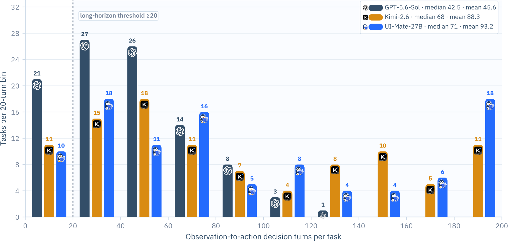

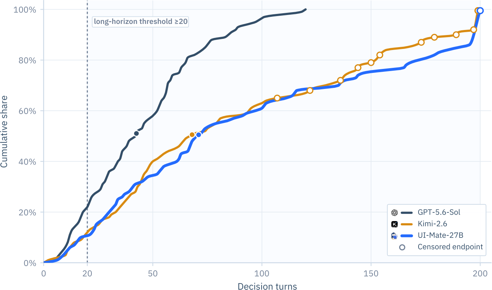

**图 10｜GPT-5.6-Sol、Kimi-K2.6 和 UI-Mate-27B 在相同 100 个 OSWorkerBench 任务上的决策轮分布。** 一个决策轮是一次观察到动作的模型响应；响应即使包含多个 UI 动作，也因期间没有新观察而只计一轮；终止响应和重复日志排除。左图使用 20 轮分箱显示长交互的普遍程度，右图给出经验累计分布；空心三角表示因轮数上限或技术故障而删失。每系统每任务一次 rollout，计数描述端到端交互而非原子 UI 操作。

**剩余失败模式。** UI-Mate-27B 的进度分比二值成功率高 35.86 点，说明许多未端到端完成的任务仍取得大量部分进展。轨迹显示晚期遗漏（未写字段、缺最终通知）仍是关键失败模式。Long-Memory 与 Multi-App 是重叠任务人群而非匹配变体，其成功率描述相对强项，不能隔离单一训练组件的因果作用。

#### 7.2.4 OSWorkerBench 决策轮分析

**协议和指标。** 在相同 100 个任务上分析 GPT-5.6-Sol、Kimi-K2.6、UI-Mate-27B。一个决策轮由一次界面观察及其后一次模型响应组成；动作批次仍只算一轮，因为批次内模型没有新观察或新决策。终止响应和重复记录排除。所有系统使用截图观察、PyAutoGUI 控制、$1920\times1080$ 环境和名义 200 轮预算，每任务一次 rollout。

**基准确实需要长时程交互。** 图 10a 的直方图与图 10b 的累计分布显示，Kimi 轨迹中位数 68 轮，UI-Mate 71 轮；UI-Mate 有 40 条轨迹至少 100 轮。即使分布更短的 GPT，多数任务仍需持续交互。若因上限或技术故障终止，观察长度只是下界。这证明 OSWorkerBench 测的是持续规划、状态跟踪和执行，而非孤立操作。

**GPT 更短主要来自动作批处理。** GPT 平均每轮生成 3.83 条动作记录，近一半轮次含多个非等待 UI 动作，因此图 10 中的分布差异很大部分来自系统交互政策和动作批处理，而不是底层工作流真的更短或原子操作更少。

**UI-Mate 能维持长工作流。** UI-Mate-27B 中位轨迹 71 轮，很多超过 100 轮；结合表 2 的结果，说明它能在多阶段长工作流中保存任务状态并积累验证进度。关键结论不是“越短越好”，而是基准暴露长期执行需求，UI-Mate 能有效运行到很长时程。

### 7.3 DemoCUA 结果

本小节所有定量 No-Demo 与 Demo 结果都使用 **self-demo**，即每个目标配同一任务演示。33 任务 OSWorker 子集中，每条演示是更强 GUI 智能体在目标上的成功 rollout。该设置不同于第 6 节所述的 45 条相关但不相同任务的人类 variant-demo；第 10 节（具体见第 10.2 节）概括其中一个 10 任务先导观察，但结果不放进汇总表，45 对的系统评测留待未来。

#### 7.3.1 基准

在三个基准共 73 个任务上评测 DemoCUA：OSWorld 的 30 任务子集、新构建的 OSWorkerBench 33 任务子集和 10 任务 GameDev。它们覆盖多样应用、长时程交互及重复/分支工作流。

**GameDev。** 人工策划 10 个超长 GUI 任务，平均每个需要超过 200 次人类动作；其中八个 Godot 任务共同覆盖从零开始的端到端 2D 游戏开发。演示设置提供人类录像和相关在线教程；任务细节见附录 C。

**OSWorkerBench-Subset。** 33 个多应用任务各需协调三至五个应用，包含重复子任务模式和分支路径。不了解应用操作和工作流结构时，智能体可能发现不了必要交互、忘记重复目标或只完成一部分就停止。每个目标配更强智能体在同任务上的成功 rollout，用于检验同任务工作流引导能否提高完整性。

**OSWorld-Subset。** 30 个任务均是 UI-Mate-27B 无演示失败、但更强参考智能体能解的可行任务；不可行任务排除。该选择隔离“有挑战但确定可执行”的案例，检查演示能否提供弥合能力缺口的程序知识。

#### 7.3.2 演示构建

先部署强 GUI 智能体与目标应用交互，把轨迹录成屏幕视频；再将原始轨迹转换成带标注截图的结构化动作序列。人类标注者随后：（1）补完智能体未解决部分；（2）删除错误恢复循环等冗余交互；（3）保留传达核心工作流逻辑的关键动作。最终演示简洁、正确且覆盖完整任务，不泄漏底层数据值或分类标签等任务专用答案。

#### 7.3.3 评测设置

Kimi K2.6 和 UI-Mate-27B 都在 No-Demo 与 Demo 条件下评测；除明确说明外，Demo 即 self-demo。指令、初始环境、预算和评估器相同，最多 1,000 交互步。两者都用第 5.3 节的长上下文机制。

主动折叠估算时每张截图按 1,800 token；折叠摘要温度 0.2，上限 2,048 token。Kimi 使用 96K 上下文，预留 32K 生成，原样保留最近 8 个交互步，在输入预算 85% 触发折叠。UI-Mate-27B 使用 128K 上下文，预留 64K 生成，保留最近最多 40 个文本步骤和 5 张截图；因推理更长，在输入预算 60% 提前折叠。每个模型内部有无演示的其他设置不变。

#### 7.3.4 结果

**表 4｜UI-Mate-27B 在 GameDev 上有无演示的表现。** 每任务五次运行；两个平均列为成功率均值，$\Delta$ 为 Demo−No-Demo 的百分点差，越高越好。

| 任务 | 无演示 1 | 2 | 3 | 4 | 5 | 无演示均值 | 演示 1 | 2 | 3 | 4 | 5 | 演示均值 | Δ |
|---|---:|---:|---:|---:|---:|---:|---:|---:|---:|---:|---:|---:|---:|
| godot-01 | 100.00 | 100.00 | 100.00 | 100.00 | 100.00 | 100.00 | 100.00 | 100.00 | 100.00 | 100.00 | 100.00 | 100.00 | 0.00 |
| godot-02 | 71.43 | 64.29 | 78.57 | 78.57 | 57.14 | 70.00 | 71.43 | 71.43 | 64.29 | 71.43 | 64.29 | 68.57 | -1.43 |
| godot-03 | 100.00 | 100.00 | 100.00 | 100.00 | 100.00 | 100.00 | 100.00 | 100.00 | 100.00 | 100.00 | 100.00 | 100.00 | 0.00 |
| godot-04 | 22.22 | 38.89 | 44.44 | 38.89 | 38.89 | 36.67 | 55.56 | 50.00 | 55.56 | 66.67 | 50.00 | 55.56 | +18.89 |
| godot-05 | 76.47 | 82.35 | 82.35 | 82.35 | 76.47 | 80.00 | 64.71 | 76.47 | 70.59 | 76.47 | 88.24 | 75.29 | -4.71 |
| godot-06 | 86.67 | 86.67 | 80.00 | 80.00 | 80.00 | 82.67 | 93.33 | 93.33 | 73.33 | 86.67 | 86.67 | 86.67 | +4.00 |
| godot-07 | 63.16 | 36.84 | 78.95 | 84.21 | 68.42 | 66.32 | 89.47 | 94.74 | 73.68 | 89.47 | 73.68 | 84.21 | +17.89 |
| godot-08 | 100.00 | 100.00 | 100.00 | 100.00 | 100.00 | 100.00 | 100.00 | 100.00 | 100.00 | 100.00 | 100.00 | 100.00 | 0.00 |
| obsidian-01 | 66.67 | 80.00 | 33.33 | 53.33 | 70.00 | 60.67 | 66.67 | 60.00 | 36.67 | 76.67 | 53.33 | 58.67 | -2.00 |
| qgis-01 | 68.75 | 81.25 | 68.75 | 68.75 | 68.75 | 71.25 | 75.00 | 100.00 | 87.50 | 75.00 | 75.00 | 82.50 | +11.25 |
| **平均** | **75.54** | **77.03** | **76.64** | **78.61** | **75.97** | **76.76** | **81.62** | **84.60** | **76.16** | **84.24** | **79.12** | **81.15** | **+4.39** |

表 4 显示，演示把 UI-Mate-27B 平均分从 76.76% 提至 81.15%（+4.39）。最大增益在 godot-04（+18.89）、godot-07（+17.89）、qgis-01（+11.25），均需很长且结构化的细粒度操作；三个无演示已满分的任务不变。Kimi K2.6 也有相似改善，见附录表 12–13。

**表 5｜UI-Mate-27B 在 OSWorld-Subset30 和 OSWorkerBench-Subset33 上的成对 self-demo 结果。** 初始状态、预算和评估器完全相同。OSWorld 每目标五次运行，OSWorkerBench 每目标三次；增益为演示减仅指令，单位百分点。

| 评测集 | 条件 | 进度分 (%) | 二值成功 (%) | Δ进度 | Δ成功 |
|---|---|---:|---:|---:|---:|
| OSWorld（Subset-30） | 仅指令 | 40.27 | — | — | — |
| OSWorld（Subset-30） | 演示引导 | **65.75** | — | **+25.48** | — |
| OSWorkerBench（Subset-33） | 仅指令 | 67.85 | 17.17 | — | — |
| OSWorkerBench（Subset-33） | 演示引导 | **81.14** | **35.35** | **+13.29** | **+18.18** |

**OSWorkerBench 子集。** 表 5 给出该子集结果：进度从 67.85% 升到 81.14%，33 个任务中 28 个改善；满分任务从 1 个增至 5 个。同时平均轨迹从 173.3 增到 216.0 步（表 16）。更长并非简单低效：任务含重复/分支子任务，无演示智能体常只做部分流程就终止；演示帮助发现并执行剩余分支，故轨迹更长但完成度更高。

**OSWorld 子集。** 表 5 与附录表 14 显示，平均分从 40.27% 升到 65.75%（+25.48）。30 个任务中 18 个改善、8 个不变；chrome-02、chrome-03、multi-02、os-01 无演示为 0，加入演示后五次均满分。4 个任务下降，说明演示程序被误用或与当前界面冲突时也会造成伤害。

#### 7.3.5 案例研究

下面给出两个演示参与执行的代表性案例：一个来自 GameDev 基准，另一个改编自 OSWorld2 [36]。

**GameDev—Godot。** 如图 11 所示，任务要求配置游戏角色发射哪一种子弹。无演示智能体找对了子弹文件，却把它附加到当前关卡内的角色实例，而非可复用角色模板（图 11c）；两种操作界面几乎一样，因此智能体误认为已经完成。演示不仅指出文件，还说明应打开和修改模板，并检查可见确认图标（图 11a）。演示条件下修改了正确底层对象（图 11b）并通过 `player-bullet-reference` 检查，无演示运行失败。

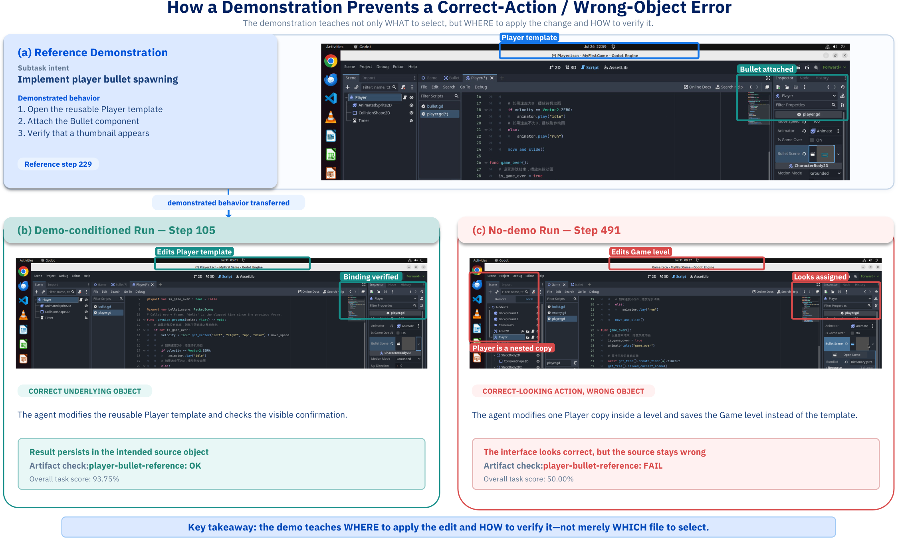

**图 11｜演示帮助智能体修改正确底层对象。** 参考演示与演示条件运行修改可复用 Player 模板；无演示运行只修改关卡中的某个 Player 副本。两种操作视觉相近，只有前者会持久化到预期源对象。

**OSWorld2—签证申请 [36]。** 如图 12 所示，任务要求阅读证明 PDF，并用一致表单值和财务证据填写 DS-2019 申请。无演示智能体放大文档，却未适当重定位视口以露出相关字段（图 12c），造成错误视觉/OCR 读取，继而填错值和选错文档。演示说明应最大化 PDF 查看器、调整视口定位关键字段，并在提交前交叉核验（图 12a）。演示条件智能体正确识别 18,000 美元资金要求，发现原 12,000 美元证明不足，找到替代 18,000 美元证明并提交一致证据（图 12b）；通过全部 JSON 检查，得 99.5%。无演示运行提交错误值和不足证明，仅 24.5%。

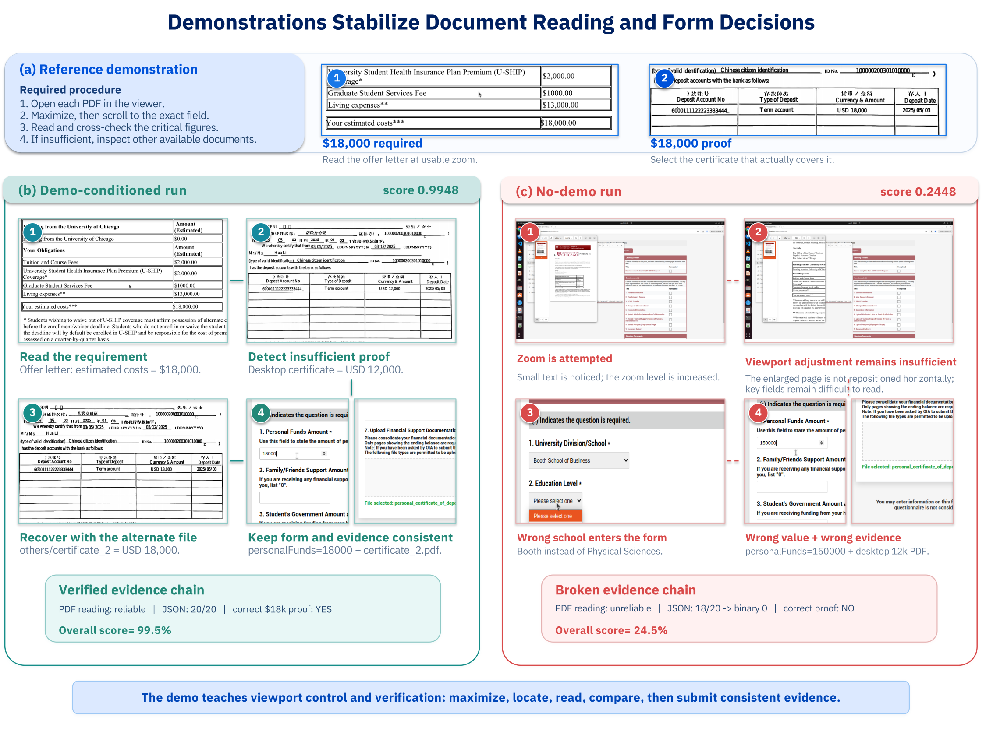

**图 12｜演示教授面向文档推理的可靠视口控制。** 参考演示与演示条件运行会最大化查看器、定位并交叉核验关键值，再提交一致表单和证据；无演示运行只放大、不重定位，导致 OCR 错误和下游错误决策。

### 7.4 研究发现

#### 数据

**任务难度存在于环境，而非指令。** 同一指令在只有十几行均匀数据的合成表格上很容易；在多工作表、合并表头和大量无关列的真实工作簿中，则必须定位、消歧与交叉检查。办公任务中，检索真实资源约为合成资源的 6 倍大，其轨迹平均 58.4 步，而合成资源为 38.5 步，增加 51.7%。因此构建训练数据时，环境真实性比指令复杂度更应优先。

**能力感知分配比原始数据量重要。** 均匀采样会反复访问覆盖良好的能力，长尾缺口又被应用级统计掩盖。第 3.4 节的能力树把指令路由到细粒度操作并按覆盖分配数据，新增覆盖主要集中在 Multi-App 工作流，相比不做能力感知采样，Multi-App 性能提高 15.5 点；原先覆盖不足能力的任务增益也更大。证据是相关性而非严格因果消融，但说明能力树是诊断长尾和按共享操作结构归组任务的有效接口。

**可验证任务最难的是让奖励真正表达指令。** 公式（9）的执行不变量只能排除内部不一致，无法证明奖励语义正确。对已通过不变量的评估器做 LLM 审计，约 18% 仍错位；主要模式是过严匹配（40%）、语义空洞断言（23%）和检查错误目标（19%）。审计应位于流水线内，标记任务优先修复而非丢弃，以保留最容易误判的困难、环境丰富任务。规模化合成的约束是奖励有效性，而非产物能否被机械检查。

#### 模型训练

**历史推理改善推理，却削弱 RL rollout 探索。** 保存前序步骤推理在评测时稳定提升：只在评测启用，SFT 模型 +3.43 点，无历史推理训练的 RL 模型 +2.27 点；SFT 也纳入历史推理，则长时程跨应用再约 +2.85 点，短简单任务几乎不增。质性分析显示，它改善跨应用实体链保存、约束遵循、来源落地与错误恢复，减少过早 `DONE`。但 RL 训练中加入历史推理会提高预测置信度、加速策略熵下降，出现熵坍缩迹象，限制探索并降低评测性能。需要既保留长期状态优势、又不牺牲策略多样性的整合方式。

**自适应课程和过程信用主要提高训练效率，而非最终性能。** 二者不持续提高最终成功率，但常以不到一半的优化更新达到相近表现。前者优先薄弱领域，后者把信用集中到与成败最相关的决策；它们改善固定语料的学习效率，而进一步提升仍主要受数据覆盖和质量限制。

**小模型需要显式推理和分阶段、验证器落地训练。** 9B 在 SFT 中受益于显式推理轨迹，27B 用有无推理混合仍有效。9B 在 RL 中对评估器正确性更敏感，宽松代理更容易强化部分或非预期行为；它也受益于跨训练阶段重复访问相同任务。小 GUI 智能体需要更明确推理监督、更严格验证评估器和对同分布的反复在线暴露。

#### DemoCUA

**子任务级演示保持跟踪。** 一次提供完整任务演示会让模型混淆当前进度、误用后续步骤。因此，只详细展示活动子任务，其余用进度清单概括，在保留整体工作流的同时聚焦当前执行（见图 6）。

**训练时少指导，推理时多指导。** 训练时只抽取当前子任务关键动作，迫使模型从截图推断缺失中间步骤，而不是复制演示；训练后模型把演示视作可出错参考，并用实时截图解决冲突，所以推理不再需要关键动作提取，完整序列更简单、信息更多且经验上更好。

**表 6｜UI-Mate-27B 在 GameDev 上的轨迹长度与分数。** Human Demo 是人类演示步数；No-Demo/Demo 是五次运行的平均模型步数和归一化分数。

| 任务 | 人类演示步数 | 无演示平均步数 | 无演示分数 | 演示平均步数 | 演示分数 |
|---|---:|---:|---:|---:|---:|
| godot-01 | 35 | 29.8 | 100.00 | 30.0 | 100.00 |
| godot-02 | 223 | 178.8 | 70.00 | 186.6 | 68.57 |
| godot-03 | 202 | 173.8 | 100.00 | 131.0 | 100.00 |
| godot-04 | 247 | 410.4 | 36.67 | 357.8 | 55.56 |
| godot-05 | 380 | 580.0 | 80.00 | 362.6 | 75.29 |
| godot-06 | 323 | 638.4 | 82.67 | 379.2 | 86.67 |
| godot-07 | 376 | 442.8 | 66.32 | 448.0 | 84.21 |
| godot-08 | 46 | 15.0 | 100.00 | 36.2 | 100.00 |
| obsidian-01 | 255 | 427.4 | 60.67 | 457.6 | 58.67 |
| qgis-01 | 305 | 139.6 | 71.25 | 142.2 | 82.50 |
| **平均** | **239.2** | **303.6** | **76.76** | **253.1** | **81.15** |

表 6 显示，更长任务通常得分更低：godot-01 和 godot-08 只需 29.8、15.0 步且满分，所有需要超过 400 步的任务都低于 83%。人类演示长度与模型所需步数的秩相关为 +0.83，是更干净的预测量，说明轨迹长度主要反映任务固有工作量。结合表 4 和表 6，演示把 GameDev 平均轨迹从 303.6 缩到 253.1（-50.5 步，-16.6%），同时分数从 76.76 提到 81.15。节省集中于无演示超过 400 步的五个任务，其均值从 499.8 降到 401.0，说明演示主要删除长任务的探索绕路。

## 8 UI-Mate App

### 8.1 概览

UI-Mate App 把已配置的视觉语言模型变成用户机器上的计算机使用智能体。给定任务后，它观察屏幕并通过鼠标键盘操作应用，也能在同一环境录制上下文学习演示。由于直接驱动桌面，已安装应用无需插件、API 或脚本接口。

**设计。** 架构由两个决策定义。第一，**应用本身不包含模型**：它向配置端点发送 OpenAI 格式请求，因此一套构建即可支持第 8.4 节所有部署方式。第二，**智能体逻辑分离**：API 连接的 harness 负责提示、动作选择和完成判断。模型/智能体逻辑可以独立于桌面控制、演示捕获和执行可视化演进。

**架构。** 图 13 有四层：前端控制与可视化运行并录制演示；后端入口验证与配置请求；harness 选择动作；平台特定 bridge 执行动作。同一智能体因此可运行于离线评测或虚拟机。JSON Lines 事件流连接前后端进程，支持实时更新和中途命令。macOS bridge 是原生 Swift helper；Linux 使用 `pyautogui`；Windows 支持仍在开发。

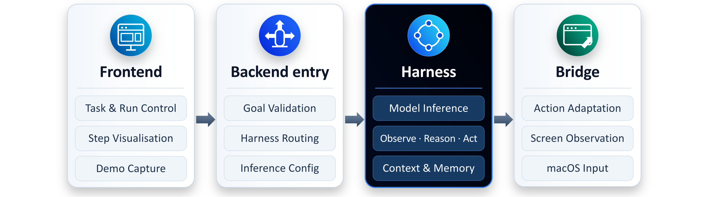

**图 13｜UI-Mate App 四层架构。** 前端控制运行和演示；后端配置请求；harness 驱动智能体循环；bridge 提供 macOS 观察与输入。

### 8.2 通用 CUA

通用运行不使用演示，只执行自然语言目标。图 14a 的轨迹概括每一步，可展开查看观察、推理、动作与延迟。用户能暂停、继续或停止，并发送供下一步使用的消息。应用标记受控显示器、高亮动作，同时从屏幕捕获中排除自己的窗口。每次运行都逐步保存为含截图、模型输入与动作的 JSONL 轨迹，可导出作训练数据或基准任务。

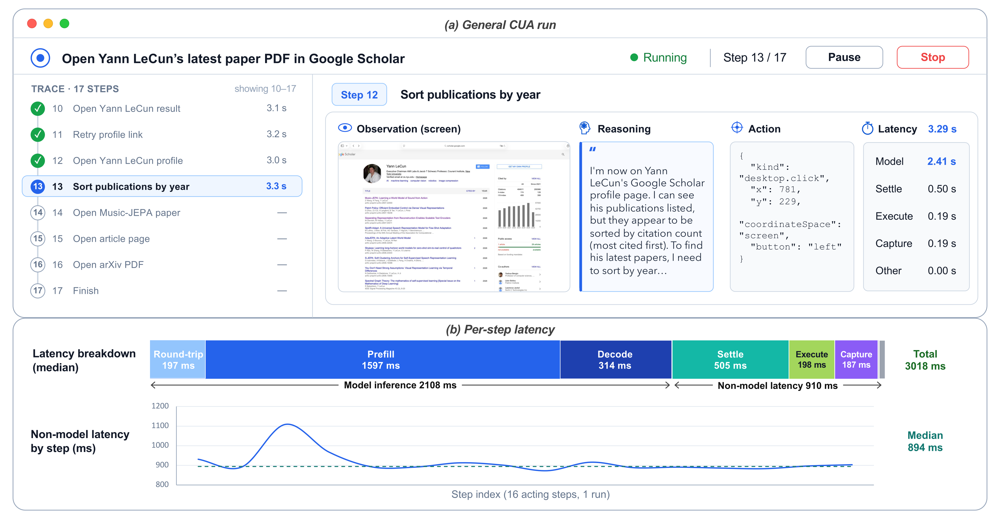

**图 14｜UI-Mate 界面与运行时延迟。** （a）执行轨迹及展开步骤；（b）真实 CUA 运行的逐步延迟和分解。

**步骤循环。** 每一步，应用对当前屏幕调用模型，抽取并执行动作，等待界面稳定，再捕获下一步观察。UI-Mate、Kimi [29] 等引擎的提示和历史策略不同，但共享动作空间和执行路径。

**动作适配。** bridge 将平台无关、`pyautogui` 式动作落到当前桌面。指针坐标从 1,000 单位图像网格，经过截图缩放、Retina 缩放和显示器原点映射到全局坐标。macOS Accessibility（AX）API 再识别元素：可操作元素直接调用，因此容忍小坐标误差；否则模拟点击，以支持画布和 AX 中不存在的界面。终端外还把 `ctrl` 映射为 `cmd`。

**逐步延迟。** 图 14b 分析第 8.4 节延迟调优的 27B 端点：中位一步 3030 ms，模型调用 2108 ms，其他 910 ms。预填充和解码约占模型调用 76% 和 15%；动作稳定等待、执行和截图占其余。即使把全部非模型成本减半，中位数也只降低约 15%。因此，UI-Mate 暴露图像历史、分辨率、提示前缀复用和推理输出控制，专门针对预填充或解码。

### 8.3 Demo CUA

内部工具、个人习惯或固定动作顺序常不在模型知识中。用户可演示一次：离线阶段把录像转成保存的工作流，在线阶段用于引导自主运行。

**录制与 Demo2Workflow。** macOS 原生录制器保存视频和原始输入，把相关事件分组为动作，并在动作时及动作后抽帧，以展示目标和效果。Demo2Workflow 用 VLM 依据帧对和录制事实描述动作、把步骤分组为命名子任务，并允许用户修改结果。人工编辑与模型输出分开保存，互不覆盖。

**引导运行。** 处理后的工作流进入个人库，由用户显式附加一条到任务。引导运行复用通用循环，但每一步额外提供工作流进度和当前子任务的录制步骤。智能体报告子任务完成，工作流及显示进度随之推进。

### 8.4 部署

模型服务与客户端安装分离。用户为每个智能体引擎配置 OpenAI 兼容端点的 base URL 和模型名，因此同一安装可在表 7 的服务安排间切换，无需重构。

**表 7｜服务部署方式与作者设备上的近似单步耗时。**

| 模型运行位置 | 服务形式 | 每步耗时 |
|---|---|---:|
| 托管网关 | 厂商自有服务 | 不定 |
| 自托管，单台 8-GPU 机器 | 27B，bf16 | 3–5 秒 |
| 自托管，单台 8-GPU 机器 | 27B，本文优化 | 2–3 秒 |
| 设备本地，单台 Apple Silicon Mac | 9B，6-bit | 10–20 秒 |

**加速自托管服务。** 第 8.2 节的计时采用 QuaRot [37] 式 W8A8 量化和 DFlash [38] 训练草稿模型的推测解码，同一机器上无需修改应用即可把单步从 3–5 秒降到 2–3 秒。

**设备端服务。** 单台 Mac 上视觉编码和预填充占主导。使用约 7 GB 的 6-bit 9B 模型，把截图从 1080p 降至 720p，并修改 `mlx-vlm` 复用提示前缀与缓存图像特征，把典型单步从约 45 秒降至 10–20 秒。

**客户端分发。** 签名并公证的磁盘镜像包含原生 helper 与 Python 运行时。安装后，UI-Mate 请求观察和控制桌面所需的 macOS 屏幕录制与辅助功能权限。

## 9 相关工作

### 9.1 计算机使用智能体

计算机使用智能体已从围绕通用视觉语言模型组合规划、定位和反思模块的脚手架 [39–41]，转向端到端内化感知、定位和动作的原生模型 [42–47]。UI-TARS [4]、OpenCUA [1]、ScaleCUA [2]、Mobile-Agent-v3 [48]、UI-Venus-1.5 [49]、MAI-UI/Qwen-UI-Agent [5,50] 等基础智能体使用大规模轨迹语料，并逐渐用环境交互闭环训练，包括在线/课程强化学习 [25,27,51]、大规模多轮 RL [4]、EvoCUA 的可扩展合成经验自进化 [6]、可扩展环境构建 [8]，以及结合高效在线 RL 的可验证任务合成 [35]。

然而，这些语料会偏向低成本实例化内容，而多数标准训练和评测主要以任务指令为条件。UI-Mate 在两方面推进：闭环数据引擎用分层能力树分配生成预算，只把审计后的任务—验证器包用于 RL；同时从单条人类录像或智能体 rollout 提炼子任务级程序意图，在用户步骤承载意图时遵循，在目标界面分叉时由实时屏幕覆盖，直接针对仅扩展指令训练不能解决的提示歧义和执行不可靠。

### 9.2 计算机使用基准

GUI 智能体评测涵盖静态定位 [52]、离线网页导航 [53]，以及 Web [54,55]、移动设备 [56,57] 和桌面操作系统上的可执行状态验证交互环境；OSWorld [10] 与 WindowsAgentArena [11] 是桌面代表。近期基准提高真实性和时程：OSWorld 2.0 [58] 含 108 个小时级工作流与任务中动态事件；WeaveBench [59] 在轨迹审计下交错 GUI 与 CLI；ScienceBoard [60] 面向科研流程；办公基准 [61,62] 考察多业务应用交付物。

多数协议仍通过指令和环境材料规定目标，并不对相同目标显式控制演示可用性。即使教程跟随任务 [58] 也测试对环境所给材料的遵守，而不是习得用户自己的程序。OSWorkerBench 用 100 个长时程任务、41 个应用、Long-Memory/Multi-App 子集和验证检查点评估器弥补空白；它区分同任务强智能体 self-demo 与相关但不同任务的人类 variant-demo，并在相同目标、环境、预算、验证器下同仅指令运行做受控比较，以测量演示引导的程序泛化与任务完成。

### 9.3 演示引导的计算机使用

传统机器人流程自动化（RPA）[63] 记录或编写固定界面操作序列，对重复流程高效确定，但对任务逻辑或 UI 状态变化脆弱。近期工作把程序知识暴露为可复用智能体技能：CUA-Skill [64] 用参数化执行和组合图表示人类编写的桌面程序；MMSkills [65] 用状态卡和视觉关键帧增强文字程序，使智能体识别技能何时适用并验证进度；最相关的 ShowUI-Aloha [9] 把人类屏幕录像转成语义动作轨迹，引导规划与执行，其迁移主要在共享相同工作流逻辑的任务实例间复用被教程序。

UI-Mate 则把人类录像或智能体 rollout 提炼成子任务级程序意图，选择性遵循、跳过或适配演示步骤，并让每个决策都落地于实时界面，从而实现演示引导的程序泛化，而非工作流回放。

## 10 讨论与未来工作

### 10.1 验证器落地的进度信用

PCM 的效率增益提示可从里程碑结构估计验证器落地的进度。任务条件模型可以奖励里程碑完成和恢复、惩罚回退，并在同结果组中保留信号。环境仍应具有最终权威：终止残差使总过程奖励等于可执行结果。确定性检查给可验证里程碑打分，只在不确定状态使用学习裁判；中性片段保留为上下文但从 actor 损失屏蔽，从而缩短优化时程而不丢因果证据。

### 10.2 超越 Self-Demo：Variant-Demo 设置

本报告全部定量 DemoCUA 结果都是 self-demo，演示与目标为同一任务；OSWorker 子集的 33 个目标配更强 GUI 智能体成功同任务 rollout。它证明执行指导有价值，但不能解读为跨变体程序迁移。

开放问题是 variant-demo。OSWorkerBench 提供 45 条源任务相关但不相同的人类录像，本文没有报告系统汇总。在其中 10 个目标的先导实验中，若把被演示片段重复到目标真实实体数，variant 设置总体变为正增益，但仍不够稳定，不能作主要基准结论。

未来有三条方向：（1）**模型能力**：训练智能体抽取部分匹配演示的可迁移结构，并识别演示未覆盖什么，而不是逐步回放；（2）**离线获取**：从书籍、策划文档和教学视频规模化采集演示，而非逐任务录制；（3）**检索**：依据实时状态查询演示语料，使覆盖随语料增长，而非随标注工作量增长。

## 11 作者贡献

作者向所有贡献者（包括论文未列名者）的支持与投入致谢。每个角色内按姓氏字母顺序排列。

### 核心贡献者

Zihan Ding；Longxu Dou\*；Qi Gao；Xiangwu Guo；Shengchao Hu；Zilong Huang†；Zihang Jiang\*；Lei Ke\*；Mengcheng Lan；Weixian Lei\*；Hanxuan Li；Honglin Li；Xiyun Li；Zaitang Li；Leowei Liang‡；Xin Luo；Haozhe Ma；Jiayi Mao；Zhoujie Pan；Can Qin；Tianyuan Qu；Weiqi Wang；Wenkai Wang；Yonglin Wang；Yuxin Wang；Chenxu Wu；Yingchen Yu\*；Chenyu Zhang；Yuhao Zheng。

### 其他贡献者

Tianqing Fang；Zhenpeng Huang；Zhongwei Wan；Jiahao Xu；Ruihan Yang；Yidi Zhang。

\*项目共同负责人；†项目负责人；‡项目监督人。

## 参考文献

> 参考文献的题名、作者和出版信息按原文保留，不作中文改写。

1. Xinyuan Wang, Bowen Wang, Dunjie Lu, Junlin Yang, Tianbao Xie, Junli Wang, Jiaqi Deng, Xiaole Guo, Yiheng Xu, Chen Wu, et al. *OpenCUA: Open foundations for computer-use agents.* Advances in Neural Information Processing Systems, 38:139756–139806, 2026.
2. Zhaoyang Liu, JingJing Xie, Zichen Ding, Zehao Li, Bowen Yang, Zhenyu Wu, Xuehui Wang, Qiushi Sun, Shi Liu, Weiyun Wang, et al. *ScaleCUA: Scaling open-source computer use agents with cross-platform data.* International Conference on Learning Representations, 2026, pp. 62707–62766.
3. Yujia Qin, Yining Ye, Junjie Fang, Haoming Wang, Shihao Liang, Shizuo Tian, Junda Zhang, Jiahao Li, Yunxin Li, Shijue Huang, et al. *UI-TARS: Pioneering automated GUI interaction with native agents.* arXiv:2501.12326, 2025.
4. ByteDance Seed. *UI-TARS-2 technical report: Advancing GUI agent with multi-turn reinforcement learning.* CoRR, abs/2509.02544, 2025.
5. Hanzhang Zhou, Panrong Tong, Xu Zhang, Quyu Kong, Chenglin Cai, Tianyu Xia, Gongjie Zhang, Jianan Zhang, Long Li, Long Chen, Lei Wang, Gaole Dai, Pengxiang Li, Liangyu Chen, Yue Wang, and Steven Hoi. *Qwen-UI-Agent technical report: Toward next-generation real-world centric foundation GUI agents.* arXiv:2607.28227, 2026.
6. Taofeng Xue, Chong Peng, Mianqiu Huang, Linsen Guo, Tiancheng Han, Haozhe Wang, Jianing Wang, Xiaocheng Zhang, Xin Yang, Dengchang Zhao, et al. *EvoCUA: Evolving computer use agents via learning from scalable synthetic experience.* arXiv:2601.15876, 2026.
7. Ziyun Zhang, Zezhou Wang, Xiaoyi Zhang, Zongyu Guo, Jiahao Li, Bin Li, and Yan Lu. *InfiniteWeb: Scalable web environment synthesis for GUI agent training.* arXiv:2601.04126, 2026.
8. Bowen Wang, Dunjie Lu, Junli Wang, Tianyi Bai, Shixuan Liu, Zhipeng Zhang, Haiquan Wang, Hao Hu, Tianbao Xie, Shuai Bai, et al. *CUA-Gym: Scaling verifiable training environments and tasks for computer-use agents.* arXiv:2605.25624, 2026.
9. Yichun Zhang, Xiangwu Guo, Yauhong Goh, Jessica Hu, Zhiheng Chen, Xin Wang, Difei Gao, and Mike Zheng Shou. *ShowUI-Aloha: Human-taught GUI agent.* arXiv:2601.07181, 2026.
10. Tianbao Xie, Danyang Zhang, Jixuan Chen, Xiaochuan Li, Siheng Zhao, Ruisheng Cao, Toh J Hua, Zhoujun Cheng, Dongchan Shin, Fangyu Lei, et al. *OSWorld: Benchmarking multimodal agents for open-ended tasks in real computer environments.* Advances in Neural Information Processing Systems, 37:52040–52094, 2024.
11. Rogerio Bonatti, Dan Zhao, Francesco Bonacci, Dillon Dupont, Sara Abdali, Yinheng Li, Yadong Lu, Justin Wagle, Kazuhito Koishida, Arthur Bucker, Lawrence Keunho Jang, and Zheng Hui. *Windows Agent Arena: Evaluating multi-modal OS agents at scale.* ICML 42, PMLR 267:4874–4910, 2025.
12. Zhaoyang Liu, JingJing Xie, Zichen Ding, Zehao Li, Bowen Yang, Zhenyu Wu, Xuehui Wang, Qiushi Sun, Shi Liu, Weiyun Wang, et al. *ScaleCUA: Scaling open-source computer use agents with cross-platform data.* arXiv:2509.15221, 2025.
13. Zhihong Shao, Peiyi Wang, Qihao Zhu, Runxin Xu, Junxiao Song, Xiao Bi, Haowei Zhang, Mingchuan Zhang, YK Li, Yang Wu, et al. *DeepSeekMath: Pushing the limits of mathematical reasoning in open language models.* arXiv:2402.03300, 2024.
14. Daya Guo, Dejian Yang, Haowei Zhang, Junxiao Song, Peiyi Wang, Qihao Zhu, Runxin Xu, Ruoyu Zhang, Shirong Ma, Xiao Bi, Xiaokang Zhang, Xingkai Yu, Yu Wu, Z. F. Wu, Zhibin Gou, Zhihong Shao, Zhuoshu Li, Ziyi Gao, et al. *DeepSeek-R1 incentivizes reasoning in LLMs through reinforcement learning.* Nature, 645(8081):633–638, 2025.
15. Qiying Yu, Zheng Zhang, Ruofei Zhu, Yufeng Yuan, Xiaochen Zuo, Yu Yue, Weinan Dai, Tiantian Fan, Gaohong Liu, Juncai Liu, Lingjun Liu, Xin Liu, Haibin Lin, Zhiqi Lin, Bole Ma, Guangming Sheng, Yuxuan Tong, Chi Zhang, Mofan Zhang, Ru Zhang, Wang Zhang, Hang Zhu, Jinhua Zhu, Jiaze Chen, Jiangjie Chen, Chengyi Wang, Hongli Yu, Yuxuan Song, Xiangpeng Wei, Hao Zhou, Jingjing Liu, Wei-Ying Ma, Ya-Qin Zhang, Lin Yan, Yonghui Wu, and Mingxuan Wang. *DAPO: An open-source LLM reinforcement learning system at scale.* NeurIPS 2025.
16. Danyang Zhang, Situo Zhang, Ziyue Yang, Zichen Zhu, Zihan Zhao, Ruisheng Cao, Lu Chen, and Kai Yu. *ProgRM: Build better GUI agents with progress rewards.* CoRR, abs/2505.18121, 2025.
17. Congmin Zheng, Xiaoyun Mo, Xinbei Ma, Qiqiang Lin, Yin Zhao, Jiachen Zhu, Xingyu Lou, Jun Wang, Zhaoxiang Wang, Weiwen Liu, Zhuosheng Zhang, Yong Yu, and Weinan Zhang. *Adaptive milestone reward for GUI agents.* CoRR, abs/2602.11524, 2026.
18. Zhiheng Xi, Chenyang Liao, Guanyu Li, Zhihao Zhang, Wenxiang Chen, Binghai Wang, Senjie Jin, Yuhao Zhou, Jian Guan, Wei Wu, Tao Ji, Tao Gui, Qi Zhang, and Xuanjing Huang. *AgentPRM: Process reward models for LLM agents via step-wise promise and progress.* WWW 2026, pp. 4184–4195.
19. Zilin Zhu, Chengxing Xie, Xin Lv, and slime Contributors. *slime: An LLM post-training framework for RL scaling.* https://github.com/THUDM/slime, 2025. GitHub repository; corresponding author: Xin Lv.
20. Zhongwen Xu and Zihan Ding. *Single-stream policy optimization.* ICLR 2026.
21. Ling Team, Anqi Shen, Baihui Li, Bin Hu, Bin Jing, Cai Chen, Chao Huang, Chao Zhang, Chaokun Yang, Cheng Lin, Chengyao Wen, et al. *Every step evolves: Scaling reinforcement learning for trillion-scale thinking model.* 2025.
22. Guanhua Huang, Tingqiang Xu, Jinbo Wang, Guangming Sheng, Siheng Li, Evander Yang, Kejiao Li, Yunxiang Li, Zenan Xu, Qi Yi, Kyrierl Deng, Ziyuan Nan, Yuhao Jiang, Chenchen Zhang, Taiqiang Wu, Feiyuan Zhang, Junhao Wang, Bo Zhou, Alex Chen, Di Wang, and Shunyu Yao. *Stabilizing RLVR via token-level gradient diagnosis and layerwise clipping.* 2026.
23. John Schulman, Filip Wolski, Prafulla Dhariwal, Alec Radford, and Oleg Klimov. *Proximal policy optimization algorithms.* arXiv:1707.06347, 2017.
24. Weiqi Wang, Xin Liu, Binxuan Huang, Hejie Cui, Rongzhi Zhang, Changlong Yu, Shuowei Jin, Jingfeng Yang, Qingyu Yin, Zhengyang Wang, Zheng Li, Yifan Gao, Priyanka Nigam, Bing Yin, Lihong Li, and Yangqiu Song. *HEAPA: Difficulty-aware heap sampling and on-policy query augmentation for LLM reinforcement learning.* Third Conference on Language Modeling, 2026.
25. Fanbin Lu, Zhisheng Zhong, Shu Liu, Chi-Wing Fu, and Jiaya Jia. *ARPO: End-to-end policy optimization for GUI agents with experience replay.* CoRR, abs/2505.16282, 2025.
26. Songqin Nong, Jingxuan Xu, Sheng Zhou, Jianfeng Chen, Xiaoxuan Tang, Tao Jiang, and Wenhao Xu. *CRAFT-GUI: Curriculum-reinforced agent for GUI tasks.* CoRR, abs/2508.11360, 2025.
27. Zehan Qi, Xiao Liu, Iat Long Iong, Hanyu Lai, Xueqiao Sun, Jiadai Sun, Xinyue Yang, Yu Yang, Shuntian Yao, Wei Xu, Jie Tang, and Yuxiao Dong. *WebRL: Training LLM web agents via self-evolving online curriculum reinforcement learning.* ICLR 2025.
28. Zhaoyang Liu, JingJing Xie, Zichen Ding, Zehao Li, Bowen Yang, Zhenyu Wu, Xuehui Wang, Qiushi Sun, Shi Liu, Weiyun Wang, Shenglong Ye, Qingyun Li, Xuan Dong, Yue Yu, Chenyu Lu, YunXiang Mo, Yao Yan, Zeyue Tian, Xiao Zhang, Yuan Huang, Yiqian Liu, Weijie Su, Gen Luo, Xiangyu Yue, Biqing Qi, Kai Chen, Bowen Zhou, Yu Qiao, Qifeng Chen, and Wenhai Wang. *ScaleCUA: Scaling open-source computer use agents with cross-platform data.* CoRR, abs/2509.15221, 2025.
29. Moonshot AI. *Kimi K2.6: Advancing open-source coding.* 2026.
30. Qwen Team. *Qwen3.6-27B: Flagship-level coding in a 27B dense model.* April 2026.
31. Qwen Team. *Qwen3.5: Towards native multimodal agents.* February 2026.
32. OpenAI. *GPT-5.5 system card.* April 2026.
33. Anthropic. *Introducing Claude Sonnet 5.* June 2026.
34. Anthropic. *Introducing Claude Opus 4.8.* May 2026.
35. Bowen Lv, Xiao Liu, Yanyu Ren, Hanyu Lai, Bohao Jing, Hanchen Zhang, Yanxiao Zhao, Shuntian Yao, Jie Tang, and Yuxiao Dong. *ScaleCUA: Scaling computer use agents with verifiable task synthesis and efficient online RL.* 2026.
36. Mengqi Yuan, Zilong Zhou, Xinzhuang Xiong, Weiming Wu, Jiayang Sun, Jiamin Song, Kaiqian Cui, Bowen Wang, Haoyuan Wu, Yitong Li, Dunjie Lu, Haikong Lu, Qi Zhen, Xinyuan Wang, Jiaqi Deng, Yuhao Yang, Cheng Chen, Boyuan Zheng, Alex Su, Xiao Yu, Hao Zou, Saaket Agashe, Xing Han Lu, Manpreet Kaur, Zhengyang Qi, Vincent Sunn Chen, Frederic Sala, Dayiheng Liu, Junyang Lin, Zhou Yu, Yu Su, Siva Reddy, Xin Eric Wang, Peng Qi, Tianbao Xie, and Tao Yu. *OSWorld 2.0: Benchmarking computer use agents on long-horizon real-world tasks.* 2026.
37. Saleh Ashkboos, Amirkeivan Mohtashami, Maximilian L. Croci, Bo Li, Pashmina Cameron, Martin Jaggi, Dan Alistarh, Torsten Hoefler, and James Hensman. *QuaRot: Outlier-free 4-bit inference in rotated LLMs.* NeurIPS 2024.
38. Jian Chen, Yesheng Liang, and Zhijian Liu. *DFlash: Block diffusion for flash speculative decoding.* ICML 43, 2026.
39. Saaket Agashe, Kyle Wong, Vincent Tu, Jiachen Yang, Ang Li, and Xin Eric Wang. *Agent S2: A compositional generalist-specialist framework for computer use agents.* arXiv:2504.00906, 2025.
40. Chaoyun Zhang, He Huang, Chiming Ni, Jian Mu, Si Qin, Shilin He, Lu Wang, Fangkai Yang, Pu Zhao, Chao Du, et al. *UFO2: The Desktop AgentOS.* arXiv:2504.14603, 2025.
41. Linxin Song, Yutong Dai, Viraj Prabhu, Jieyu Zhang, Taiwei Shi, Li Li, Junnan Li, Zeyuan Chen, Jieyu Zhao, Ran Xu, et al. *CoAct-1: Computer-using multi-agent system with coding actions.* ICLR 2026, pp. 127091–127107.
42. Wenyi Hong, Weihan Wang, Qingsong Lv, Jiazheng Xu, Wenmeng Yu, Junhui Ji, Yan Wang, Zihan Wang, Yuxiao Dong, Ming Ding, et al. *CogAgent: A visual language model for GUI agents.* CVPR 2024, pp. 14281–14290.
43. Kanzhi Cheng, Qiushi Sun, Yougang Chu, Fangzhi Xu, Li YanTao, Jianbing Zhang, and Zhiyong Wu. *SeeClick: Harnessing GUI grounding for advanced visual GUI agents.* ACL 2024, pp. 9313–9332.
44. Zhiyong Wu, Zhenyu Wu, Fangzhi Xu, Yian Wang, Qiushi Sun, Chengyou Jia, Kanzhi Cheng, Zichen Ding, Liheng Chen, Paul Pu Liang, et al. *OS-Atlas: Foundation action model for generalist GUI agents.* ICLR 2025, pp. 5090–5108.
45. Boyu Gou, Demi Ruohan Wang, Boyuan Zheng, Yanan Xie, Cheng Chang, Yiheng Shu, Huan Sun, and Yu Su. *Navigating the digital world as humans do: Universal visual grounding for GUI agents.* ICLR 2025, pp. 30851–30883.
46. Yiheng Xu, Zekun Wang, Junli Wang, Dunjie Lu, Tianbao Xie, Amrita Saha, Doyen Sahoo, Tao Yu, and Caiming Xiong. *Aguvis: Unified pure vision agents for autonomous GUI interaction.* arXiv:2412.04454, 2024.
47. Kevin Qinghong Lin, Linjie Li, Difei Gao, Zhengyuan Yang, Shiwei Wu, Zechen Bai, Stan Weixian Lei, Lijuan Wang, and Mike Zheng Shou. *ShowUI: One vision-language-action model for GUI visual agent.* CVPR 2025, pp. 19498–19508.
48. Jiabo Ye, Xi Zhang, Haiyang Xu, Haowei Liu, Junyang Wang, Zhaoqing Zhu, Ziwei Zheng, Feiyu Gao, Junjie Cao, Zhengxi Lu, et al. *Mobile-Agent-v3: Fundamental agents for GUI automation.* arXiv:2508.15144, 2025.
49. Venus Team, Changlong Gao, Zhangxuan Gu, Yulin Liu, Xinyu Qiu, Shuheng Shen, Yue Wen, Tianyu Xia, Zhenyu Xu, Zhengwen Zeng, et al. *UI-Venus-1.5 technical report.* arXiv:2602.09082, 2026.
50. Hanzhang Zhou, Xu Zhang, Panrong Tong, Jianan Zhang, Liangyu Chen, Quyu Kong, Chenglin Cai, Chen Liu, Yue Wang, Jingren Zhou, et al. *MAI-UI technical report: Real-world centric foundation GUI agents.* arXiv:2512.22047, 2025.
51. Hao Bai, Yifei Zhou, Mert Cemri, Jiayi Pan, Alane Suhr, Sergey Levine, and Aviral Kumar. *DigiRL: Training in-the-wild device-control agents with autonomous reinforcement learning.* NeurIPS, 37:12461–12495, 2024.
52. Kaixin Li, Ziyang Meng, Hongzhan Lin, Ziyang Luo, Yuchen Tian, Jing Ma, Zhiyong Huang, and Tat-Seng Chua. *ScreenSpot-Pro: GUI grounding for professional high-resolution computer use.* ACM Multimedia 2025, pp. 8778–8786.
53. Xiang Deng, Yu Gu, Boyuan Zheng, Shijie Chen, Sam Stevens, Boshi Wang, Huan Sun, and Yu Su. *Mind2Web: Towards a generalist agent for the web.* NeurIPS, 36:28091–28114, 2023.
54. Shuyan Zhou, Frank F Xu, Hao Zhu, Xuhui Zhou, Robert Lo, Abishek Sridhar, Xianyi Cheng, Tianyue Ou, Yonatan Bisk, Daniel Fried, et al. *WebArena: A realistic web environment for building autonomous agents.* ICLR 2024, pp. 15585–15606.
55. Jing Yu Koh, Robert Lo, Lawrence Jang, Vikram Duvvur, Ming Lim, Po-Yu Huang, Graham Neubig, Shuyan Zhou, Russ Salakhutdinov, and Daniel Fried. *VisualWebArena: Evaluating multimodal agents on realistic visual web tasks.* ACL 2024, pp. 881–905.
56. Chris Rawles, Sarah Clinckemaillie, Yifan Chang, Jonathan Waltz, Gabrielle Lau, Marybeth Fair, Alice Li, William Bishop, Wei Li, Folawiyo Campbell-Ajala, et al. *AndroidWorld: A dynamic benchmarking environment for autonomous agents.* ICLR 2025, pp. 406–441.
57. Quyu Kong, Xu Zhang, Zhenyu Yang, Nolan Gao, Chen Liu, Panrong Tong, Chenglin Cai, Hanzhang Zhou, Jianan Zhang, Liangyu Chen, et al. *MobileWorld: Benchmarking autonomous mobile agents in agent-user interactive and MCP-augmented environments.* ACL 2026, pp. 6142–6167.
58. Mengqi Yuan, Zilong Zhou, Xinzhuang Xiong, Weiming Wu, Jiayang Sun, Jiamin Song, Kaiqian Cui, Bowen Wang, Haoyuan Wu, Yitong Li, et al. *OSWorld 2.0: Benchmarking computer use agents on long-horizon real-world tasks.* arXiv:2606.29537, 2026.
59. Wanli Li, Bowen Zhou, Yunyao Yu, Zhou Xu, Yifan Yang, Dongsheng Li, and Caihua Shan. *WeaveBench: A long-horizon, real-world benchmark for computer-use agents with hybrid interfaces.* arXiv:2606.09426, 2026.
60. Qiushi Sun, Zhoumianze Liu, Chang Ma, Zichen Ding, Fangzhi Xu, Zhangyue Yin, Haiteng Zhao, Zhenyu Wu, Kanzhi Cheng, Zhaoyang Liu, et al. *ScienceBoard: Evaluating multimodal autonomous agents in realistic scientific workflows.* ICLR 2026, pp. 75694–75731.
61. Frank Fangzheng Xu, Yufan Song, Boxuan Li, Yuxuan Tang, Kritanjali Jain, Mengxue Bao, Zora Wang, Xuhui Zhou, Zhitong Guo, Murong Cao, et al. *TheAgentCompany: Benchmarking LLM agents on consequential real world tasks.* NeurIPS 38, 2026.
62. Zilong Wang, Yuedong Cui, Li Zhong, Zimin Zhang, Da Yin, Bill Yuchen Lin, and Jingbo Shang. *OfficeBench: Benchmarking language agents across multiple applications for office automation.* arXiv:2407.19056, 2024.
63. Wil M. P. van der Aalst, Martin Bichler, and Armin Heinzl. *Robotic process automation.* Business & Information Systems Engineering, 60(4):269–272, 2018.
64. Tianyi Chen, Yinheng Li, Michael Solodko, Sen Wang, Nan Jiang, Tingyuan Cui, Junheng Hao, Jongwoo Ko, Sara Abdali, Qing Xiao, Leon Xu, Suzhen Zheng, Hao Fan, Pashmina Cameron, Justin Wagle, and Kazuhito Koishida. *CUA-Skill: Develop skills for computer using agent.* arXiv:2601.21123, 2026.
65. Kangning Zhang, Shuai Shao, Qingyao Li, Jianghao Lin, Lingyue Fu, Shijian Wang, Wenxiang Jiao, Yuan Lu, Weiwen Liu, Weinan Zhang, and Yong Yu. *MMSkills: Towards multimodal skills for general visual agents.* 2026.

## 附录 A 任务指令来源

**转换开放源指令。** 我们把 AgentNet [1]、ScaleCUA [12] 等数据集的指令适配到自身平台。选中指令同时经过清理与平台转换：删除需要不可用应用、目标含糊或结果不可验证的任务；保留操作意图，但调整应用和平台引用，例如把 Ubuntu 应用替换为 Windows 等价物。这样既保留既有能力覆盖，又使指令可执行且无歧义。

**从既有 rollout 分解原子能力。** 按照 EvoCUA [6] 的做法分析失败或停滞 rollout，识别责任操作/决策，并把它隔离为独立子任务。长工作流的困难片段由此变成可定向评测与改进原子能力的指令，数据收集也聚焦智能体实际遇到的难交互；分解还扩充基本操作系统交互覆盖，并使失败更容易独立评估。

**以真实内容落地的指令。** 开放数据和 rollout 派生任务覆盖原子操作较好，却不足以支持真实跨应用工作流。我们从 InfiniteWeb [7] 的真实文档、电子表格、演示文稿和静态网站生成指令。内容预览让指令引用具体实体与关系，而非虚构占位符；应用手册的操作模式引导真实长流程，例如从网站转移信息到表格，再用分析更新文档或演示文稿。真实内容提高任务真实性，也使结果更易评估。

**能力树驱动生成。** 从应用规范构建能力树，把功能组织成操作模式与细粒度能力。这一自顶向下过程补充数据集、rollout 和真实文件来源，暴露容易被常见工作流淹没的低覆盖操作；定向指令系统填补剩余能力缺口。

## 附录 B DemoCUA 数据生成细节

为补充第 5.2 节的三阶段数据生成流水线，这里给出 Score 和 Filter & Repair 的细节。Score 用混合机制沿三个维度评测：轨迹级 Whole-Task Completion（S1）由使用 Skeptical-Auditor 提示的 VLM 依据视觉链判断；子任务级 Per-Subtask Completion（S2）由 VLM 依据边界帧和自报告判断；Demo-following（S3–S4）用规则计算子任务完成率，并用最长公共子序列（LCS）衡量执行顺序与参考工作流的一致性（表 8）。

Filter & Repair 不丢弃可修复轨迹，而应用确定性规则和 LLM 修复（表 9）。R1、R2、R4 折叠重复报告、闭合未终止轨迹、重推子任务 ID，并删除开头 `WAIT` 或空动作；若发生子任务转换却没有边界报告，R3 由 LLM 根据周围上下文补写。

**表 8｜Rollout 评分规则。** $K$ 是 S1 视觉链末尾追加帧数的小常数；$\mathcal{S}$ 是工作流子任务集合。

| ID | 维度 | 项目 | 类型 | 判定方法 |
|---|---|---|---|---|
| S1 | 轨迹级 | 全任务完成 | VLM | 向 VLM 输入 Skeptical-Auditor 提示和多帧视觉链（初始帧 + 均匀采样中间帧 + 最后 $K$ 帧），返回整个任务是否完成的二值判断。 |
| S2 | 子任务级 | 逐子任务完成 | VLM | 对每个子任务输入边界帧和自报告句，独立返回 $\mathrm{passed}(s)\in\{\text{True},\text{False}\}$。 |
| S3 | 演示遵循 | 子任务完成率 | 规则 | 被 S2 判定通过的子任务占比：$\#\{s\in\mathcal{S}\mid\mathrm{passed}(s)=\text{True}\}/|\mathcal{S}|$。 |
| S4 | 演示遵循 | 执行顺序一致性 | 规则 | 智能体实际访问顺序 $\mathbf{o}_{\text{agent}}$ 与演示参考顺序 $\mathbf{o}_{\text{demo}}$ 的 LCS 相似度，归一为 $\mathrm{LCS}(\mathbf{o}_{\text{agent}},\mathbf{o}_{\text{demo}})/|\mathcal{S}|$。 |

**表 9｜应用于 rollout 的修复规则。** 子任务报告指边界处的 `report(subtask_id, status)` 调用。

| ID | 项目 | 类型 | 修复方法 |
|---|---|---|---|
| R1 | 重复报告 | 规则 | 检测相邻、`subtask_id` 与 `status` 相同的 `report` 调用并合并为一个。 |
| R2 | 未闭合轨迹 | 规则 | 若轨迹终止却无最终 `report(subtask_id, done)`，追加该调用闭合最后子任务。 |
| R3 | 缺失边界 | LLM | 动作流已发生子任务转换但缺对应边界 `report` 时，由 LLM 根据周围上下文合成缺失报告。 |
| R4 | 步骤级清理 | 规则 | 从报告流重推子任务边界，改写每步 `subtask_id` 与正确片段对齐；同一遍处理中删除开头 `WAIT` 或空动作，使第一步具有实际动作。 |

## 附录 C GameDev 任务细节

下列十个策划任务案例分别评测。原始指令在此完整翻译；rubric 项目均为等权产物检查。

### 表 10｜十个策划任务案例（1/2）

#### 案例 1：obsidian-01——外观与工作区（30 项检查）

**原始指令。** 从默认 Ubuntu 桌面开始，安装 Obsidian，并在终端用 `--password-store=basic` 参数启动其 AppImage（例如 `./Obsidian-1.12.7.AppImage --password-store=basic`），然后创建或打开一个 Obsidian vault。在 Obsidian 中启用社区插件，安装并启用 Style Settings 插件，再安装并启用 AnuPpuccin 主题。确保 Fira Code 和 Maple Mono NF CN 字体确实安装在系统上。在 Appearance 设置中，把界面字体设为 Maple Mono NF CN，等宽字体设为 Fira Code，主题选择 AnuPpuccin，并使用深色外观模式。

在 Style Settings 中配置 AnuPpuccin：深色主题风味设为 Frappe，活动行高亮设为 border 样式，callout 设为 block 样式；启用文件图标、浮动标题、折叠文件夹样式和自定义 vault 标题；彩虹文件夹设为 simple rainbow，并对文件夹标题、折叠图标、缩进线、文件夹图标和子文件夹启用彩虹配色；还要启用浮动状态栏、mini tabs 和 card layout。最后把右侧边栏排成上下两个垂直分区，上方为 graph view，下方为 outline view。所有插件、主题、字体、Style Settings 与边栏布局变更都必须保存。

**产物 rubric。** 安装（6）：Obsidian 可执行文件和已注册 vault；Style Settings 已启用；插件真实安装；AnuPpuccin 真实安装；Fira Code、Maple Mono NF CN 已安装。外观（4）：AnuPpuccin、深色模式、Fira Code 等宽字体、Maple Mono NF CN 界面字体。Style Settings（16）：Frappe、border 活动行、block callout、文件图标、浮动标题、折叠文件夹、自定义 vault 标题、simple-rainbow、彩虹标题/折叠图标/缩进线/文件夹图标/子文件夹、浮动状态栏、mini tabs、card layout。工作区（4）：右边栏存在；上下分区；Graph 在上；Outline 在下。

#### 案例 2：qgis-01——CSV 到带标签地图（16 项检查）

**原始指令。** 从默认 Ubuntu 桌面开始，下载并安装 QGIS；从给定 Google Drive 文件夹下载 `Cities_Asia.csv` 到 Downloads。CSV 含 14 个亚洲城市的 Name、Latitude、Longitude。QGIS 中从官方仓库安装并启用 QuickMapServices，添加 OSM Standard 底图并设 50% 透明度。把 CSV 作为分隔文本点图层导入，X/Y 使用 Longitude/Latitude，坐标系 WGS 84（EPSG:4326）。点样式用 4 mm simple marker，并基于 Name 启用单标签。把点图层导出到 Desktop，ESRI Shapefile 名 `cities_asia`（生成 `.shp/.shx/.dbf/.prj`），坐标系 EPSG:4326，保留 Name、Latitude、Longitude 属性；项目保存为 Desktop 上的 `cities_asia.qgz`。QGIS、CSV、插件、shapefile 和项目必须持久化到磁盘。

**产物 rubric。** 安装（1）：真实 QGIS 可执行文件和 profile 或可解析项目证据。Shapefile（6）：四个文件/可打开图层；Point 几何；恰好 14 个要素；EPSG:4326；坐标全部匹配且经纬不对调；只有 Name/Latitude/Longitude 字段且值匹配。项目（7）：Desktop QGZ；项目 CRS EPSG:4326；矢量图层指向 `cities_asia`；4 mm SimpleMarker；Name 单标签；OSM Standard 瓦片源；50% 不透明/透明。插件（1）：QuickMapServices 已安装且启用。源数据（1）：Downloads 中有准确 CSV，或全部核心导出数据正确。

#### 案例 3：godot-01——安装与初始化（7 项检查）

**原始指令。** 安装 `/home/user/Desktop/Godot_v4.3-stable_linux.x86_64.zip` 提供的离线 Godot 4.3 Linux 构建。解压到 `/home/user/Desktop/Godot`，使可执行文件路径精确为 `/home/user/Desktop/Godot/Godot_v4.3-stable_linux.x86_64`；赋予执行权限并成功启动。项目管理器中新建项目 MyFirstGame，路径 `/home/user/Desktop/myfirstgame`；使用 Godot 4.3 Forward Plus renderer，在独立文件夹创建并带 Git 元数据和默认文件，包括 `project.godot`、`icon.svg`、`.gitignore`、`.gitattributes`。打开项目并将全部文件保存。只能使用提供的离线构建，不能安装其他 Godot 版本。

**产物 rubric。** 安装（3）：Desktop 独立目录；精确路径的固定可执行文件；报告 Godot 4.3。项目（4）：指定路径；名称 MyFirstGame；Forward Plus；默认 icon 引用及 `.gitignore`、`.gitattributes`。

#### 案例 4：godot-02——组装游戏场景（14 项检查）

**原始指令。** 用 Godot 4.3 在指定路径建立 Forward Plus 项目 MyFirstGame，把 `/home/user/Desktop/AssetBundle` 复制到项目根，使 Sprites、Audio、`Uranus_Pixel_11Px.ttf` 位于 `res://AssetBundle`；画布纹理过滤保持 nearest/no filtering。

创建 Scenes 文件夹和主 2D 场景 `Scenes/Game.tscn`，根为 Node2D。加入名为 Background 1、Background 2 的 Sprite2D，二者都使用 `AssetBundle/Sprites/ForestBackground.png`；无缝并排，组合森林/道路地图以世界原点为中心。原点加入 Camera2D，统一 zoom `(2.415, 2.415)`，完整框住地图；`Game.tscn` 设为 `run/main_scene`。

创建 `Scenes/Player.tscn`，根为 CharacterBody2D、名 Player，子节点 AnimatedSprite2D。用 `Foxy.png` 建名为 idle 的 SpriteFrames 动画：按天然等距角色格切片、不跨帧边界，按序取第一行前四格，循环、12 fps、自动播放 idle。把 Player 场景实例化进 Game，二者均保存；Player 在 Game 原点；运行主场景并验证两段背景上可见 idle 狐狸。

**产物 rubric。** 项目（4）：MyFirstGame/Forward Plus；Game 为主场景；nearest 过滤；完整 sprite/audio/font。场景根（2）：Game Node2D；Player CharacterBody2D。idle（3）：4 帧、12 fps、autoplay、33×32 第一行 atlas 格。世界（3）：两张 ForestBackground，一左一右。相机/玩家（2）：Camera2D 约 2.4×；Game 实例化 Player。

#### 案例 5：godot-03——实现 WASD 移动（10 项检查）

**原始指令。** 在给定 MyFirstGame 中配置四个 Input Map 动作，默认 deadzone 0.5：left 绑定物理 A、right 绑定 D、up 绑定 W、down 绑定 S；保留 Game、Player 和 idle。

创建 `Scripts/player.gd`，继承 CharacterBody2D，附到 `Player.tscn` 的 Player 根。声明 `@export var move_speed: float = 50.0` 默认值，再在 Player Inspector 把 `move_speed` 覆盖为 100，使场景值不同于脚本默认。`_process(delta)` 中读取 `Input.get_vector("left", "right", "up", "down")`，乘 `move_speed`，赋给 `velocity`，调用 `move_and_slide()`。保存脚本、场景和项目；脚本不得含 debug print 或 `_ready()` 中硬编码速度；运行验证 WASD 四向移动。

**产物 rubric。** Input Map（4）：left=A、right=D、up=W、down=S，使用物理键码。脚本/配置（2）：脚本附到 CharacterBody2D；导出速度默认 50、场景覆盖约 100。移动（3）：四动作进入输入向量和 velocity；移动在帧/物理回调；调用 `move_and_slide()`。清理（1）：无临时 debug print。

### 表 11｜十个策划任务案例（2/2）

#### 案例 6：godot-04——跑步动画与边界（18 项检查）

**原始指令。** 安装 Godot 4，打开 `/home/user/Desktop/myfirstgame` 的 MyFirstGame，完成两组变更并保存。

（1）玩家跑步动画：在 AnimatedSprite2D 上新增 `run`，从 Desktop AssetBundle 的 `Foxy.png` 判断网格、切片并取第二行六帧，12 fps；保留 `idle` 且仍由 idle 自动播放，run 不可 autoplay。`player.gd` 改为在 `_physics_process` 中处理移动：由 left/right/up/down 驱动 velocity，停止时切 idle、移动时切 run，再调用 `move_and_slide()`。用 `@export`/`@onready` 等把 AnimatedSprite2D 暴露给脚本并真正绑定节点。玩家还需 CollisionShape2D + CircleShape2D，圆心下移到狐狸脚部。

（2）地图边界：Game 中加入四个 WorldBoundaryShape2D 静态墙，分别位于下、左、右地图边缘附近，以及地图中部森林/道路分界的上墙（不是最顶部），实心侧都朝内。四个墙体归入同一 Node2D 父节点并锁定父节点。

**产物 rubric。** 动画（6）：run 存在；idle 保留；run 6 帧；速度满足要求；run 不 autoplay；帧为 atlas 切片。控制器（5）：从输入得速度；切 idle/run；调用 `move_and_slide()`；使用 `_physics_process`；动画引用已绑定。碰撞体（2）：玩家碰撞体；中心下移。边界（5）：下/左/右/中部上墙位置正确，四墙归入锁定父节点。

#### 案例 7：godot-05——触发碰撞与游戏结束（17 项检查）

**原始指令。** 创建可复用 Area2D 敌人场景 `Scenes/Slime.tscn`。AnimatedSprite2D 用 `Slimer.png`，把整条均匀 slime 姿势分成完整序列，全部帧做 12 fps 循环且 autoplay。CollisionShape2D 用适配实体的 CircleShape2D，并把中心下移到 slime 底部。创建 `Scripts/enemy.gd` 附到 Area2D，声明 `@export var slime_speed: float = -100.0`；物理更新中用该速度按帧率无关方式向左移动，再在场景 Inspector 覆盖约 -50。

连接 Area2D `body_entered` 到 `enemy.gd`；处理器检测 CharacterBody2D 玩家并调用其 `game_over()`。在 `Game.tscn` 道路上玩家右侧放一个完全可见 slime 测试，同时保留 Y-sort 渲染。

Player 新增从 `Foxy.png` 完整失败动作行构建、从左到右、约 6 fps 的循环 `game_over` 动画。`player.gd` 加初始 false 的 `is_game_over`；只有未结束时处理输入、idle/run 和 `move_and_slide`。`game_over()` 设置标志、播放动画、等待约 3 秒 SceneTree timer 并重载当前场景。保存并验证碰 slime 后玩家停止、显示失败动画并重启。

**产物 rubric。** Slime（6）：Area2D+脚本；第一行 8 个按序 41×38 帧、12 fps；autoplay；圆碰撞体及向下偏移；速度默认 -100、覆盖约 -50。信号/移动（4）：连接 `body_entered`；物理移动；速度按帧率无关使用；调用 Player `game_over()`。放置（2）：Game 有实例；位于右下道路。动画（2）：6 帧循环 game_over、约 6 fps。玩家逻辑（3）：状态/函数；正常移动 guard；延迟重载。继承的主场景 Y-sort 是无权重回归门。

#### 案例 8：godot-06——定时发射子弹（15 项检查）

**原始指令。** 创建 `Scenes/Bullet.tscn`，根为 Area2D、名 Bullet。Sprite2D 用 `Bullet.png`，CollisionShape2D 用紧贴可见子弹的 RectangleShape2D。创建并附加 `Scripts/bullet.gd`，声明 `@export var bullet_speed: float = 100.0`；场景 Inspector 覆盖约 300；`_physics_process` 用 `position += Vector2(bullet_speed, 0) * delta` 向右移动；`_ready` 等待约 3 秒 SceneTree timer 后 `queue_free`，避免漏弹积累。

`player.gd` 声明 `@export var bullet_scene: PackedScene`，Player 场景绑定到 Bullet。加入自动启动、连续重复、约 1 秒间隔的 Timer，并把 timeout 接到 `_on_fire`。若 velocity 非 `Vector2.ZERO` 或 `is_game_over` 为真，`_on_fire` 直接返回；否则实例化 `bullet_scene`，放在玩家右侧枪口、使其视觉上从武器出现，并加入 `get_tree().current_scene`。Game 不得预放 Bullet。保存并验证静止玩家重复发射，移动/结束状态禁止发射，旧子弹自毁。

**产物 rubric。** Bullet（7）：Area2D+脚本；图片；贴合矩形碰撞；高速场景覆盖；速度驱动物理移动；timer+`queue_free`；约 3 秒寿命。引用（1）：Player 导出并绑定 Bullet。Timer（4）：autostart；约 1 秒；重复；连接 `_on_fire`。发射（3）：动态实例化且无预放；移动/结束时阻止；玩家相对右枪口偏移。

#### 案例 9：godot-07——死亡与动态生成（19 项检查）

**原始指令。** 把 Bullet Area2D 加入组 `bullet`。Slime 中把现有循环动画改名 idle 并保持 autoplay；用 `SlimerDeath.png` 全部姿势建立 12 fps 非循环 death；连接 Slime Area2D `area_entered` 到 `enemy.gd`。

`enemy.gd` 加初始 false 的 `is_dead`，只在未死亡时移动。area-entered 处理器开头若已死亡立即返回；否则检查 `area.is_in_group("bullet")`，首次命中播放 death、置 `is_dead=true`、释放 bullet area、等待约 0.6 秒再释放 slime；保留独立 `body_entered` 玩家碰撞 game-over。

创建继承 Node2D 的 `Scripts/GameManager.gd`，附到 Game 根。导出 `slime_scene: PackedScene` 和 `spawn_timer: Timer`，分别绑定 Slime 场景和 Game 的 Timer。Timer `wait_time=3`、autostart，timeout 接 `_spawn_slime`。删除旧预放 slime。`_spawn_slime` 实例化 slime，放在地图右边界外、随机高度但完整 sprite 位于可玩道路带内，加入当前场景。`_process` 逐渐从 `spawn_timer.wait_time` 减去约 `0.2 * delta`，并把间隔夹在 1–3 秒。保存并验证生成越来越频繁、子弹只触发一次干净死亡序列。

**产物 rubric。** Bullet 组（1）。生成器（9）：GameManager 附加；场景/Timer 绑定；无预放；3 秒 autostart；timeout；实例化/添加；右界外随机道路安全位置；间隔调整与夹取；约 0.2/s、1–3 秒。动画（3）：8 帧 idle 12 fps、autoplay；7 帧非循环 death 12 fps。死亡（6）：`area_entered`；bullet 组检查；重复命中 guard 与死亡状态；bullet/slime 清理；约 0.6 秒；死 slime 停止移动。继承的 `body_entered` game-over 为无权重回归门。

#### 案例 10：godot-08——清理屏外敌人（2 项检查）

**原始指令。** 在 `Scripts/enemy.gd` 加屏外 slime 清理。地图左碰撞墙约 x=-235，使用 x=-267 为屏外阈值。在 `_physics_process` 更新 slime 移动后，若 `position.x < -267`，调用 `queue_free()`。保存脚本。

**产物 rubric。** 边界（1）：检测 slime 已越过左界。清理顺序（1）：物理回调先更新移动，再释放越界 slime。

## 附录 D Kimi-K2.6 的 GameDev 表现

**表 12｜Kimi K2.6 在 GameDev 上有无演示的表现。** 每任务五次运行；均值列为成功率，$\Delta$ 为 Demo−No-Demo，单位百分点。

| 任务 | 无演示 1 | 2 | 3 | 4 | 5 | 无演示均值 | 演示 1 | 2 | 3 | 4 | 5 | 演示均值 | Δ |
|---|---:|---:|---:|---:|---:|---:|---:|---:|---:|---:|---:|---:|---:|
| godot-01 | 100.00 | 100.00 | 100.00 | 100.00 | 100.00 | 100.00 | 100.00 | 100.00 | 100.00 | 100.00 | 100.00 | 100.00 | 0.00 |
| godot-02 | 92.86 | 71.43 | 92.86 | 78.57 | 92.86 | 85.71 | 92.86 | 71.43 | 50.00 | 85.71 | 85.71 | 77.14 | -8.57 |
| godot-03 | 100.00 | 100.00 | 100.00 | 100.00 | 100.00 | 100.00 | 100.00 | 100.00 | 100.00 | 100.00 | 100.00 | 100.00 | 0.00 |
| godot-04 | 78.95 | 52.63 | 84.21 | 63.16 | 68.42 | 69.47 | 94.74 | 84.21 | 68.42 | 84.21 | 84.21 | 83.16 | +13.68 |
| godot-05 | 82.35 | 41.18 | 64.71 | 82.35 | 29.41 | 60.00 | 70.59 | 58.82 | 70.59 | 76.47 | 70.59 | 69.41 | +9.41 |
| godot-06 | 86.67 | 93.33 | 86.67 | 80.00 | 93.33 | 88.00 | 93.33 | 86.67 | 86.67 | 100.00 | 86.67 | 90.67 | +2.67 |
| godot-07 | 84.21 | 89.47 | 36.84 | 78.95 | 84.21 | 74.74 | 78.95 | 78.95 | 84.21 | 89.47 | 52.63 | 76.84 | +2.11 |
| godot-08 | 100.00 | 100.00 | 100.00 | 100.00 | 100.00 | 100.00 | 100.00 | 100.00 | 100.00 | 100.00 | 100.00 | 100.00 | 0.00 |
| obsidian-01 | 80.00 | 90.00 | 90.00 | 83.33 | 90.00 | 86.67 | 76.67 | 90.00 | 76.67 | 96.67 | 96.67 | 87.33 | +0.67 |
| qgis-01 | 75.00 | 68.75 | 68.75 | 68.75 | 68.75 | 70.00 | 100.00 | 100.00 | 100.00 | 100.00 | 100.00 | 100.00 | +30.00 |
| **平均** | **88.00** | **80.68** | **82.40** | **83.51** | **82.70** | **83.46** | **90.71** | **87.01** | **83.66** | **93.25** | **87.65** | **88.46** | **+5.00** |

表 12 显示，Kimi 无演示即得 83.46，完全解决三个任务；演示把均值提高到 88.46（+5.00），七个未达天花板任务中六个改善。最大增益为 QGIS +30.00、godot-04 +13.68、godot-05 +9.41，说明对细粒度产物要求覆盖更好。

**表 13｜Kimi K2.6 在 GameDev 上的轨迹长度与任务分数。** Human Demo 为人类步数，其余为五次运行均值。

| 任务 | 人类演示步数 | 无演示平均步数 | 无演示分数 | 演示平均步数 | 演示分数 |
|---|---:|---:|---:|---:|---:|
| godot-01 | 35 | 22.2 | 100.00 | 31.8 | 100.00 |
| godot-02 | 223 | 253.4 | 85.71 | 190.6 | 77.14 |
| godot-03 | 202 | 103.0 | 100.00 | 145.8 | 100.00 |
| godot-04 | 247 | 387.4 | 69.47 | 418.2 | 83.16 |
| godot-05 | 380 | 450.6 | 60.00 | 445.0 | 69.41 |
| godot-06 | 323 | 213.8 | 88.00 | 233.6 | 90.67 |
| godot-07 | 376 | 433.2 | 74.74 | 388.6 | 76.84 |
| godot-08 | 46 | 104.8 | 100.00 | 121.0 | 100.00 |
| obsidian-01 | 255 | 193.0 | 86.67 | 463.2 | 87.33 |
| qgis-01 | 305 | 100.4 | 70.00 | 136.8 | 100.00 |
| **平均** | **239.2** | **226.2** | **83.46** | **257.5** | **88.46** |

表 13 显示，无演示时 Kimi 常用 CLI 绕过冗长 GUI 序列，故步数平均少于纯 GUI 人类参考；提供主要沿 GUI 流程的演示后，平均 257.5 步但分数更高，说明这些流程有助于满足细粒度要求。

## 附录 E DemoCUA 设置下的 OSWorld-Subset 细节

30 任务逐项结果见表 14。self-demo 把平均分从 40.27% 提至 65.75%（+25.48）；18 个改善、8 个不变、4 个下降，说明总体收益很大，但存在少量负迁移。表 15 比较轨迹长度：演示把平均模型轨迹从 33.3 缩到 30.0 步，同时提高完成度；模型轨迹长度与人类演示长度的秩相关从 0.66 升到 0.86。

**表 14｜UI-Mate-27B 在 OSWorld 30 任务上的逐任务有无演示表现。** 每任务五次；均值为成功率，$\Delta$ 为演示减无演示，单位百分点。

| 任务 | ND1 | ND2 | ND3 | ND4 | ND5 | ND均值 | D1 | D2 | D3 | D4 | D5 | D均值 | Δ |
|---|---:|---:|---:|---:|---:|---:|---:|---:|---:|---:|---:|---:|---:|
| chrome-01 | 100.00 | 0.00 | 0.00 | 0.00 | 100.00 | 40.00 | 100.00 | 100.00 | 100.00 | 100.00 | 100.00 | 100.00 | +60.00 |
| chrome-02 | 0.00 | 0.00 | 0.00 | 0.00 | 0.00 | 0.00 | 100.00 | 100.00 | 100.00 | 100.00 | 100.00 | 100.00 | +100.00 |
| chrome-03 | 0.00 | 0.00 | 0.00 | 0.00 | 0.00 | 0.00 | 100.00 | 100.00 | 100.00 | 100.00 | 100.00 | 100.00 | +100.00 |
| chrome-04 | 0.00 | 0.00 | 0.00 | 0.00 | 0.00 | 0.00 | 0.00 | 0.00 | 0.00 | 0.00 | 0.00 | 0.00 | 0.00 |
| gimp-01 | 0.00 | 0.00 | 0.00 | 0.00 | 0.00 | 0.00 | 0.00 | 100.00 | 0.00 | 0.00 | 100.00 | 40.00 | +40.00 |
| calc-01 | 100.00 | 100.00 | 100.00 | 100.00 | 100.00 | 100.00 | 100.00 | 100.00 | 100.00 | 100.00 | 100.00 | 100.00 | 0.00 |
| calc-02 | 0.00 | 0.00 | 0.00 | 0.00 | 0.00 | 0.00 | 0.00 | 0.00 | 0.00 | 100.00 | 0.00 | 20.00 | +20.00 |
| calc-03 | 100.00 | 100.00 | 100.00 | 100.00 | 100.00 | 100.00 | 100.00 | 100.00 | 100.00 | 100.00 | 100.00 | 100.00 | 0.00 |
| calc-04 | 0.00 | 0.00 | 0.00 | 0.00 | 0.00 | 0.00 | 0.00 | 100.00 | 0.00 | 0.00 | 0.00 | 20.00 | +20.00 |
| calc-05 | 100.00 | 100.00 | 100.00 | 100.00 | 100.00 | 100.00 | 100.00 | 100.00 | 100.00 | 100.00 | 100.00 | 100.00 | 0.00 |
| impress-01 | 0.00 | 100.00 | 0.00 | 0.00 | 0.00 | 20.00 | 100.00 | 100.00 | 100.00 | 100.00 | 100.00 | 100.00 | +80.00 |
| impress-02 | 100.00 | 0.00 | 0.00 | 100.00 | 100.00 | 60.00 | 100.00 | 100.00 | 100.00 | 100.00 | 100.00 | 100.00 | +40.00 |
| writer-01 | 0.00 | 100.00 | 0.00 | 100.00 | 0.00 | 40.00 | 100.00 | 100.00 | 100.00 | 100.00 | 0.00 | 80.00 | +40.00 |
| writer-02 | 0.00 | 100.00 | 0.00 | 0.00 | 100.00 | 40.00 | 0.00 | 0.00 | 0.00 | 0.00 | 0.00 | 0.00 | -40.00 |
| writer-03 | 100.00 | 0.00 | 0.00 | 0.00 | 100.00 | 40.00 | 0.00 | 0.00 | 0.00 | 100.00 | 0.00 | 20.00 | -20.00 |
| multi-01 | 0.00 | 0.00 | 0.00 | 0.00 | 0.00 | 0.00 | 0.00 | 0.00 | 0.00 | 0.00 | 0.00 | 0.00 | 0.00 |
| multi-02 | 0.00 | 0.00 | 0.00 | 0.00 | 0.00 | 0.00 | 100.00 | 100.00 | 100.00 | 100.00 | 100.00 | 100.00 | +100.00 |
| multi-03 | 100.00 | 100.00 | 100.00 | 100.00 | 100.00 | 100.00 | 0.00 | 0.00 | 0.00 | 0.00 | 0.00 | 0.00 | -100.00 |
| multi-04 | 0.00 | 0.00 | 0.00 | 100.00 | 0.00 | 20.00 | 0.00 | 100.00 | 100.00 | 100.00 | 0.00 | 60.00 | +40.00 |
| multi-05 | 83.99 | 58.60 | 62.49 | 84.11 | 52.29 | 68.30 | 93.85 | 93.85 | 93.85 | 93.85 | 93.85 | 93.85 | +25.55 |
| multi-06 | 100.00 | 0.00 | 0.00 | 0.00 | 100.00 | 40.00 | 0.00 | 100.00 | 100.00 | 100.00 | 0.00 | 60.00 | +20.00 |
| multi-07 | 0.00 | 0.00 | 0.00 | 0.00 | 0.00 | 0.00 | 0.00 | 0.00 | 0.00 | 0.00 | 0.00 | 0.00 | 0.00 |
| multi-08 | 100.00 | 100.00 | 100.00 | 100.00 | 100.00 | 100.00 | 0.00 | 100.00 | 100.00 | 100.00 | 100.00 | 80.00 | -20.00 |
| multi-09 | 0.00 | 0.00 | 0.00 | 0.00 | 0.00 | 0.00 | 0.00 | 0.00 | 0.00 | 0.00 | 0.00 | 0.00 | 0.00 |
| os-01 | 0.00 | 0.00 | 0.00 | 0.00 | 0.00 | 0.00 | 100.00 | 100.00 | 100.00 | 100.00 | 100.00 | 100.00 | +100.00 |
| vlc-01 | 100.00 | 100.00 | 100.00 | 100.00 | 100.00 | 100.00 | 100.00 | 100.00 | 100.00 | 100.00 | 100.00 | 100.00 | 0.00 |
| vlc-02 | 100.00 | 100.00 | 0.00 | 0.00 | 100.00 | 60.00 | 100.00 | 100.00 | 100.00 | 100.00 | 100.00 | 100.00 | +40.00 |
| vlc-03 | 98.70 | 0.00 | 0.00 | 0.00 | 0.00 | 19.74 | 98.63 | 98.63 | 98.63 | 98.70 | 98.63 | 98.64 | +78.90 |
| vlc-04 | 100.00 | 100.00 | 0.00 | 100.00 | 100.00 | 80.00 | 100.00 | 100.00 | 100.00 | 100.00 | 100.00 | 100.00 | +20.00 |
| vlc-05 | 100.00 | 100.00 | 100.00 | 100.00 | 0.00 | 80.00 | 100.00 | 100.00 | 100.00 | 100.00 | 100.00 | 100.00 | +20.00 |
| **平均** | **49.42** | **41.95** | **25.42** | **39.47** | **45.08** | **40.27** | **56.42** | **73.08** | **66.42** | **73.08** | **59.75** | **65.75** | **+25.48** |

**表 15｜UI-Mate-27B 在 OSWorld-Subset 30 上有无演示的轨迹长度与分数。** Human Demo 为人类演示步数；模型列为五次运行均值。

| 任务 | 人类步数 | 无演示平均步数 | 无演示分数 | 演示平均步数 | 演示分数 |
|---|---:|---:|---:|---:|---:|
| chrome-01 | 5 | 9.0 | 40.00 | 8.8 | 100.00 |
| chrome-02 | 13 | 87.4 | 0.00 | 21.6 | 100.00 |
| chrome-03 | 24 | 10.8 | 0.00 | 18.0 | 100.00 |
| chrome-04 | 17 | 34.4 | 0.00 | 64.0 | 0.00 |
| gimp-01 | 4 | 4.8 | 0.00 | 6.6 | 40.00 |
| calc-01 | 17 | 22.8 | 100.00 | 21.8 | 100.00 |
| calc-02 | 14 | 25.2 | 0.00 | 35.6 | 20.00 |
| calc-03 | 7 | 9.0 | 100.00 | 10.2 | 100.00 |
| calc-04 | 45 | 26.2 | 0.00 | 50.6 | 20.00 |
| calc-05 | 10 | 22.6 | 100.00 | 15.6 | 100.00 |
| impress-01 | 16 | 55.0 | 20.00 | 26.4 | 100.00 |
| impress-02 | 45 | 44.8 | 60.00 | 54.8 | 100.00 |
| writer-01 | 4 | 12.8 | 40.00 | 7.0 | 80.00 |
| writer-02 | 16 | 85.2 | 40.00 | 31.0 | 0.00 |
| writer-03 | 22 | 40.0 | 40.00 | 25.6 | 20.00 |
| multi-01 | 32 | 60.8 | 0.00 | 48.4 | 0.00 |
| multi-02 | 21 | 36.0 | 0.00 | 44.0 | 100.00 |
| multi-03 | 26 | 45.0 | 100.00 | 50.6 | 0.00 |
| multi-04 | 39 | 84.2 | 20.00 | 49.6 | 60.00 |
| multi-05 | 20 | 37.4 | 68.30 | 25.6 | 93.85 |
| multi-06 | 21 | 19.8 | 40.00 | 27.0 | 60.00 |
| multi-07 | 11 | 11.4 | 0.00 | 15.2 | 0.00 |
| multi-08 | 39 | 69.8 | 100.00 | 73.6 | 80.00 |
| multi-09 | 13 | 28.4 | 0.00 | 22.4 | 0.00 |
| os-01 | 42 | 35.8 | 0.00 | 54.0 | 100.00 |
| vlc-01 | 8 | 12.8 | 100.00 | 15.2 | 100.00 |
| vlc-02 | 3 | 5.6 | 60.00 | 10.0 | 100.00 |
| vlc-03 | 8 | 18.4 | 19.74 | 13.0 | 98.64 |
| vlc-04 | 12 | 30.2 | 80.00 | 26.8 | 100.00 |
| vlc-05 | 14 | 13.8 | 80.00 | 25.8 | 100.00 |
| **平均** | **18.9** | **33.3** | **40.27** | **30.0** | **65.75** |

## 附录 F DemoCUA 设置下的 OSWorker-Subset 细节

**表 16｜UI-Mate-27B 在 33 任务 OSWorkerBench self-demo 子集上的轨迹长度与分数。** 每个目标的 Demo 是更强智能体在同任务上的成功 rollout，以截图和动作类型表示、不含具体像素坐标；有无演示均为三次运行平均，其他条件相同。演示把平均分提高 13.29 个百分点，但轨迹更长，因为重复/分支子任务在无演示时常被漏掉，造成过早完成；更长表示完成度更高，而非效率更低。

| 任务 | 无演示平均步数 | 无演示分数 | 演示平均步数 | 演示分数 |
|---|---:|---:|---:|---:|
| task-01 | 250.3 | 95.67 | 265.3 | 98.33 |
| task-02 | 145.0 | 78.89 | 203.3 | 68.33 |
| task-03 | 224.0 | 53.33 | 313.3 | 18.33 |
| task-04 | 174.3 | 43.75 | 264.0 | 41.67 |
| task-05 | 270.3 | 79.58 | 278.0 | 81.25 |
| task-06 | 139.7 | 93.33 | 123.3 | 93.33 |
| task-07 | 384.3 | 0.00 | 454.3 | 15.67 |
| task-08 | 220.7 | 93.33 | 393.3 | 97.67 |
| task-09 | 80.3 | 86.56 | 120.3 | 100.00 |
| task-10 | 230.7 | 43.33 | 191.7 | 49.17 |
| task-11 | 196.7 | 72.33 | 213.3 | 76.00 |
| task-12 | 319.0 | 61.69 | 205.7 | 93.35 |
| task-13 | 205.0 | 76.58 | 253.0 | 78.48 |
| task-14 | 164.3 | 32.67 | 300.7 | 58.00 |
| task-15 | 168.7 | 98.33 | 244.3 | 100.00 |
| task-16 | 125.3 | 54.17 | 301.3 | 94.78 |
| task-17 | 133.7 | 57.22 | 99.7 | 93.33 |
| task-18 | 106.7 | 52.97 | 165.7 | 97.92 |
| task-19 | 165.0 | 72.00 | 171.3 | 97.33 |
| task-20 | 273.7 | 63.29 | 329.0 | 85.62 |
| task-21 | 200.7 | 62.00 | 293.0 | 84.00 |
| task-22 | 157.3 | 48.83 | 219.7 | 90.00 |
| task-23 | 82.3 | 78.36 | 83.7 | 84.17 |
| task-24 | 156.7 | 68.55 | 140.7 | 100.00 |
| task-25 | 183.0 | 58.67 | 214.7 | 84.33 |
| task-26 | 109.0 | 93.33 | 122.7 | 100.00 |
| task-27 | 160.0 | 53.96 | 223.7 | 62.50 |
| task-28 | 101.0 | 98.33 | 112.0 | 100.00 |
| task-29 | 140.3 | 46.19 | 198.0 | 66.81 |
| task-30 | 122.0 | 100.00 | 89.0 | 82.22 |
| task-31 | 140.3 | 56.67 | 283.7 | 96.19 |
| task-32 | 59.3 | 82.19 | 114.3 | 91.26 |
| task-33 | 130.0 | 82.92 | 142.3 | 97.50 |
| **平均** | **173.3** | **67.85** | **216.0** | **81.14** |

**表 16 的示例说明。** Task 18 要把六封入站邮件按层级分类，并对每个合格 lead 更新 Salesforce、创建日历事件、在 Slack 发消息。无演示时模型正确分类六封邮件，却只处理两个 “Hot” lead 中的一个；长历史中遗失第二个并错误宣告完成，平均 106.7 步、52.97%。演示虽不明说具体处理哪些 lead，却展示“对每个合格 lead 重复同一动作序列”的参考工作流，引导模型更完整处理两个 Hot lead，包括更新 Salesforce、创建后续任务和安排日历事件，平均 165.7 步、97.92%。

---

**译文结束。** 图 1–14、表 1–16、正文、作者贡献、65 条参考文献和全部附录均已覆盖。
