---
tags:
  - papers/GUI-agent
  - papers/computer-use
  - papers/in-context-demonstration
  - papers/agentic-RL
aliases:
  - UI-Mate 深读
  - DemoCUA 深读
date: 2026-08-31
arxiv: 2608.15930
---

# UI-Mate：开放权重 GUI 智能体与上下文内演示的深读笔记

## 核心信息

- 标题: UI-Mate: Advancing Open-Weight Foundation GUI Agents with In-Context Demonstrations
- 标题翻译: UI-Mate：借助上下文内演示推进开放权重基础 GUI 智能体
- 作者: Tencent HY Frontier Team；核心贡献者 29 人，项目负责人 Zilong Huang
- 机构: Tencent HY Frontier Team
- 发表时间: 2026-08（arXiv:2608.15930）
- 发表渠道: arXiv 技术报告
- DOI: 未提供
- 论文链接: https://arxiv.org/abs/2608.15930
- 代码 / 项目: https://ui-mate.github.io/
- 数据 / 资源: 论文计划发布 OSWorkerBench 任务、33 条 self-demo、45 条 variant-demo、分类元数据和评估器；当前报告未给出完整下载许可与落地链接
- 论文类型: 基础 GUI 智能体方法、系统与基准联合技术报告

## 原文摘要翻译

基础 GUI 智能体在自动化复杂数字任务方面潜力巨大，但部署受两类问题阻碍：训练侧的数据稀缺和分布偏差，以及交互侧的提示歧义和执行不可靠。日常工作流依赖用户特定工具和默会约定，未写出的细节可能在不同运行中被不同解释，导致一次成功、下次失败。

UI-Mate 将环境落地训练栈与上下文内演示学习结合。其闭环数据引擎自动生成任务、构建环境、执行和过滤轨迹，并依据分层能力树再平衡覆盖，为监督微调和在线强化学习生成验证轨迹与任务—验证器包。DemoCUA 把多模态演示变成可适配的子任务工作流，而非僵硬动作回放；智能体在必要处遵循演示，同时依据实时界面补步和重规划。作者还提出含 100 个任务、41 个应用的 OSWorkerBench，区分 33 个同任务强智能体演示和 45 个相关但不同任务的人类变体演示。

UI-Mate-27B 在 OSWorld-Verified 和 WindowsAgentArena 分别得到 77.0% 与 66.2%。在 OSWorkerBench 上，它取得 41.0% 严格成功和 76.9% 进度，比 Qwen3.6-27B 基座高 17.7 与 24.5 个百分点。33 任务 self-demo 子集中，一条演示把严格成功从 17.2% 提到 35.4%，把进度从 67.9% 提到 81.1%。

## 创新点

1. **把训练数据定义为“任务—环境—验证器”联合对象。** 轨迹只有初态可重建、动作可执行、结果可验证时才适合训练。数据飞轮不只追求数量，还用能力树找出长期、跨应用和恢复行为的覆盖缺口。
2. **把演示从坐标脚本升级为带完成准则的程序先验。** 演示被拆成目标、完成条件和无坐标动作描述；实时截图拥有否决权，模型可以补足、跳过或修改步骤。
3. **用反捷径训练教会模型“何时不要服从演示”。** 训练数据显式包含完全对齐、部分错位和无关三类关系，并省略中间动作，迫使模型阅读屏幕，而不是抄写下一行。
4. **把长轨迹的信用与异步训练偏差写进优化目标。** 决策轮中心化修正失败轨迹更长造成的权重偏差；可选 PCM 把最终奖励重分配到关键步骤；IcePop 和 SeqClip 控制陈旧策略词元。
5. **建立成对演示评测协议。** 相同目标、环境、预算和验证器下只切换演示可用性，避免把环境差异误当演示收益；同时明确 self-demo 只测执行指导，variant-demo 才测程序迁移。
6. **提供从训练到桌面产品的系统闭环。** UI-Mate App 分离模型服务、智能体 harness 和平台 bridge，支持演示录制、运行审计与训练轨迹导出，并报告真实逐步延迟。

## 一句话总结

UI-Mate 的关键不是“再训练一个会点鼠标的模型”，而是把可验证环境、长轨迹 RL 和可由实时截图覆盖的子任务演示连成闭环；它把开放权重 27B 智能体推到公共基准前列，并证明同任务演示能大幅提高困难长流程的完成度，但跨任务变体迁移尚未被系统验证。

## 研究问题

论文识别出两个彼此独立、不能只靠扩大模型解决的瓶颈。

**训练瓶颈。** GUI 轨迹无法像文本那样脱离环境收集。若初态不能重建、软件不齐、动作不能执行、终态不能验证，一条看似合理的轨迹也无法给出可信监督。规模化生产还会偏向便宜的短、单应用任务，长期状态、跨应用信息流和错误恢复因此长期稀缺。

**交互瓶颈。** 用户通常容易说清“要什么”，却不会把工具选择、文件组织、模板、命名规范和动作顺序完全写进指令。一次运行偶然选对隐含流程，不代表下一次能稳定复现。平均成功率会把“偶尔正确”和“始终正确”混在一起。

论文的研究问题因此可写成：能否一方面用环境和验证器约束训练，使开放权重模型学会可靠长流程；另一方面用一次多模态演示补足文本没说出的程序意图，同时又避免模型盲目回放过时步骤？

## 数据与任务定义

### 两种任务形式

通用计算机任务是 $\mathcal{T}=(x,\mathcal{E})$。在决策轮 $t$，模型基于指令、最近历史和当前截图产生推理与动作：

$$
y_t=(r_t,a_t)\sim\pi_\theta(\cdot\mid x,h_t,o_t).
$$

一次响应可以批量包含多个 UI 操作，但在获得新截图前仍只计一个决策轮。任务成功由检查终态的可执行验证器 $R(\tau)$ 决定。

演示引导任务另给 $d=(s_1,\ldots,s_N)$，每个子任务 $s_n=(\ell_n,v_n,u_n)$ 含目标、可检查完成准则和无坐标动作描述。工作流视图只详细展示当前子任务，并用清单标记整体进度。发出 `subtask_complete` 后指针前进；因此进度由可见状态满足完成准则驱动，而不是按录像步数推进。

### OSWorkerBench 的构造

| 维度 | 规模或定义 | 解释边界 |
|---|---:|---|
| 任务总数 | 100 | 全部支持仅指令评测 |
| 归一化应用 | 41 | 浏览器/桌面壳和偶然探索不计 |
| 岗位族 | 10 | 按主要业务结果互斥归类 |
| Long-Memory | 67 | 需延迟复用动态信息或跨阶段维护约束 |
| Multi-App | 49 | 至少三个应用，并有实质动态信息传输 |
| self-demo | 33 | 强智能体在相同目标任务上的成功轨迹 |
| variant-demo | 45 | 人类在相关但不相同源任务上的录像 |
| 检查点 | 每任务 1–13，均值 4.86 | 支持部分进度；严格成功要求全部条件 |

长记忆与多应用标签可以重叠。仅打开多个应用不算多应用任务；必须读取多字段动态内容并在另一应用忠实复现、组织或转换。同任务演示与变体演示也不是 100 任务的互补划分，而是两个目的不同的配对集合。

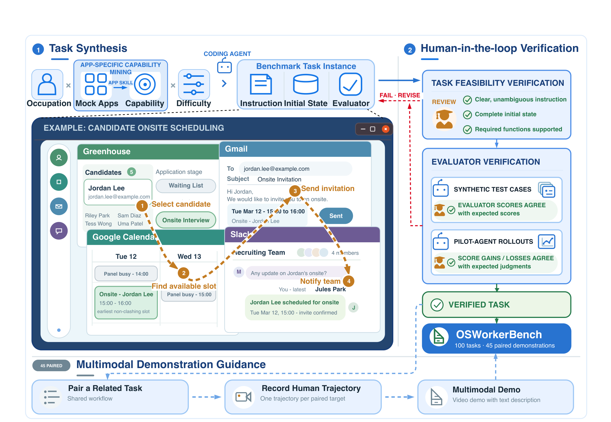
*图 8｜候选任务由能力落地合成，经人类审查、评估器测试和先导 rollout；45 个 variant-demo 在主流程中配对，33 个 self-demo 另行构建。*

### 评价指标与选择条件

- **严格成功：** 所有最终状态条件满足才记 1。
- **部分进度：** $S_{\mathrm{partial}}=\sum_i w_ic_i/\sum_i w_i$。
- **决策轮：** 一次观察到一次模型响应；动作批次只算一轮。
- **成对演示差：** 目标、初态、预算和验证器相同，只改变是否提供演示。

需要特别注意：OSWorld-Subset30 不是随机样本，而是从“UI-Mate-27B 无演示失败、但强参考智能体可解”的任务中筛选，因此 25.48 点增益描述的是这一困难条件子集，不是完整 OSWorld 的平均处理效应。

## 方法主线

### 机制流程

1. **输入：任务、真实资源和能力缺口。** 系统从开放任务、失败 rollout 的原子片段、真实文档/网页和能力树生成指令；操作是合成可重置环境与验证器，输出去向是经独立探针审计的任务—验证器包。
2. **输入：过滤后的完整轨迹与可验证环境。** 操作先用决策轮 SFT 学习协议、视觉定位和工作流，再进行分组在线 GRPO；输出去向是能够从仅指令执行长任务的通用 UI-Mate 策略。
3. **输入：成功人类录像或强智能体 rollout。** 操作把录像标注、切分为带完成准则的无坐标子任务工作流，并构造对齐、错位和无关训练样例；输出去向是模型第一用户轮中的演示快照。
4. **输入：当前工作流视图和实时截图。** 操作由模型执行、补步、跳过或重规划，截图对演示拥有否决权；输出去向是桌面 bridge 的鼠标键盘动作与验证器检查的最终环境状态。

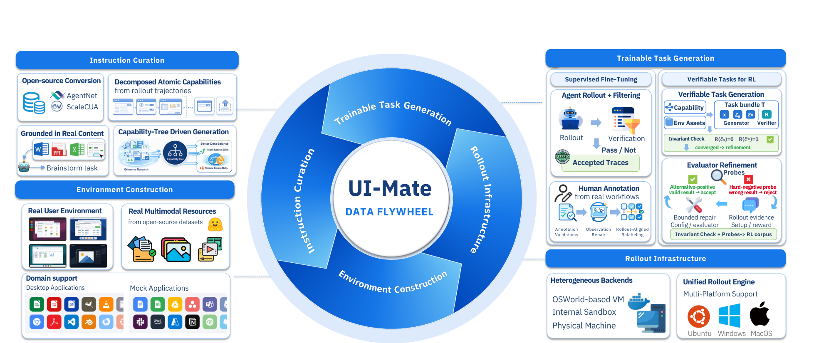
*图 2｜数据生产、能力诊断和训练形成闭环；这里的“飞轮”同时约束环境真实性、覆盖面和验证器语义，而非只积累轨迹。*

### 可验证任务为什么需要独立探针

任务包固定初始状态 $\mathcal{E}_0$、参考完成状态 $\mathcal{E}^{\star}$ 与验证器 $R$，最低不变量为：

$$
R(\mathcal{E}_0)=0,\qquad R(\mathcal{E}^{\star})=1.
$$

但自洽不等于语义正确：参考完成和验证器可能共享同一盲点。作者因此加入困难负例和替代正例，分别检查错误完成是否被误接收、合法不同解是否被误拒绝。论文后续审计仍发现，只通过上述不变量的评估器约有 18% 语义错位；这支持“验证器是训练数据的一部分，而不是事后打分脚本”。

### 从轨迹奖励到词元更新

同任务用固定策略快照产生 $N$ 条轨迹。失败轨迹通常更长，若把同一结果优势广播到每个决策轮，长失败会被过度加权。作者在决策轮测度下计算：

$$
\mu^{\mathrm{turn}}=\frac{\sum_iT_iR_i}{\sum_iT_i},\qquad A_{i,t}^{\mathrm{base}}=R_i-\mu^{\mathrm{turn}}.
$$

优势只中心化，不除以组标准差，避免近乎同结果时放大噪声。可选 PCM 再从成功轨迹合并里程碑，给失败轨迹标注因果错误、恢复、冗余与外部阻塞，把优势重分配给信息量大的决策。若没有成功锚点或标注无效，回退到结果信用。

异步采样会使生成策略落后于学习器。IcePop 过滤孤立异常似然比，SeqClip 过滤整个响应的一致漂移，PPO 裁剪限制保留词元的贡献。

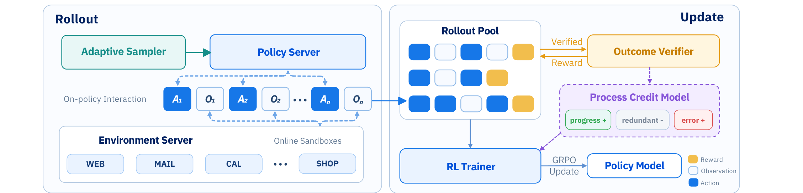
*图 4｜固定策略快照并行 rollout，完整轨迹按任务汇集，经结果验证、可选过程信用和异步 GRPO 更新。*

### DemoCUA 的反捷径设计

若工作流由监督轨迹自身生成，条件与目标几乎相同，模型很容易不看屏幕、直接复制下一步。UI-Mate 用两层设计打断这条捷径：训练分布加入完全对齐、部分错位和无关演示；工作流只展示关键动作，省略聚焦点击、滚动和弹窗处理等中间步骤。

推理时反而提供完整动作序列。作者的逻辑是：稀疏指导是训练阶段破坏恒等映射的手段；一旦模型学会以截图仲裁，完整序列信息更多，也省去一次关键动作抽取调用。这一判断合理，但论文没有给出完整、独立的稀疏/完整提示消融矩阵。

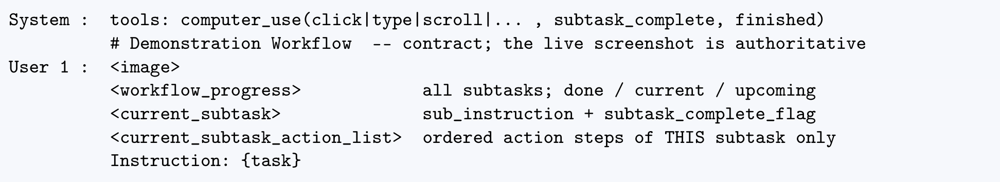
*图 7｜演示工作流快照固定在第一条用户消息；后续用户轮仍只提供截图，保持与无演示多轮格式一致。*

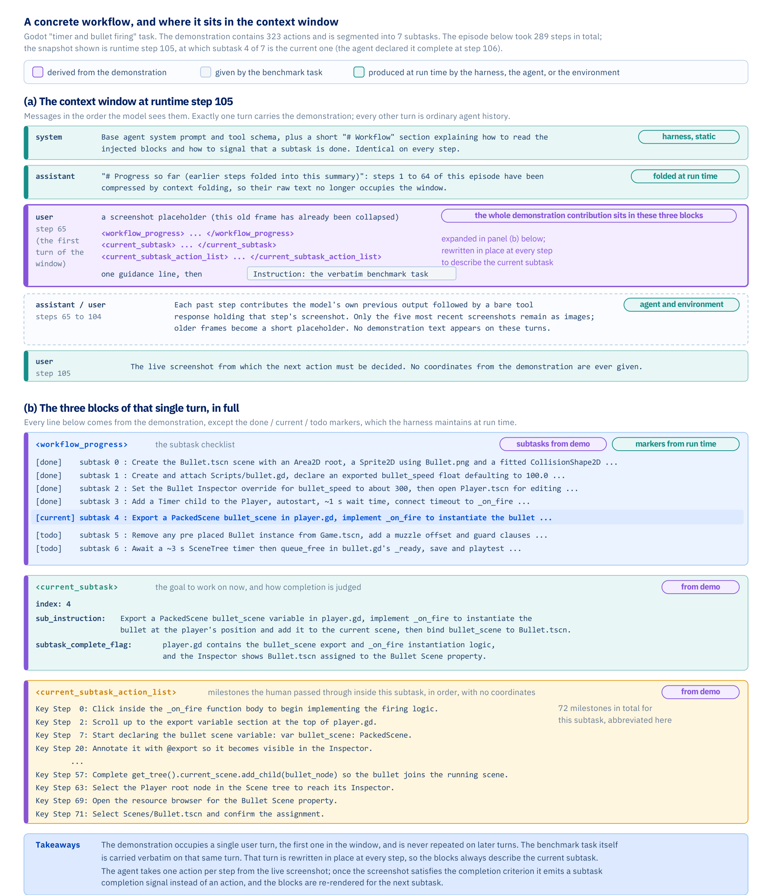
*图 6｜工作流同时保留整体检查清单、当前子任务、完成准则和关键里程碑，避免一次展示全部细节造成进度混淆。*

### 部署架构

App 不内置模型，只向 OpenAI 兼容端点发请求；agent harness 与桌面 bridge 分离。这样模型、提示与完成判断可独立于演示录制、平台输入和用户审计迭代。

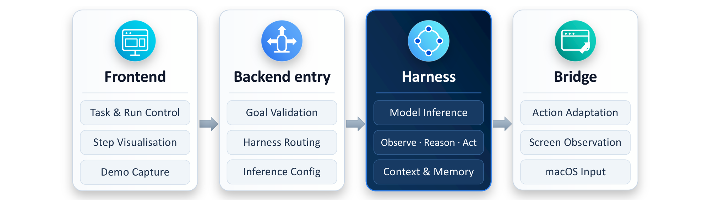
*图 13｜前端、后端入口、agent harness 和平台 bridge 四层解耦；同一 harness 可用于本地桌面、虚拟机和离线评测。*

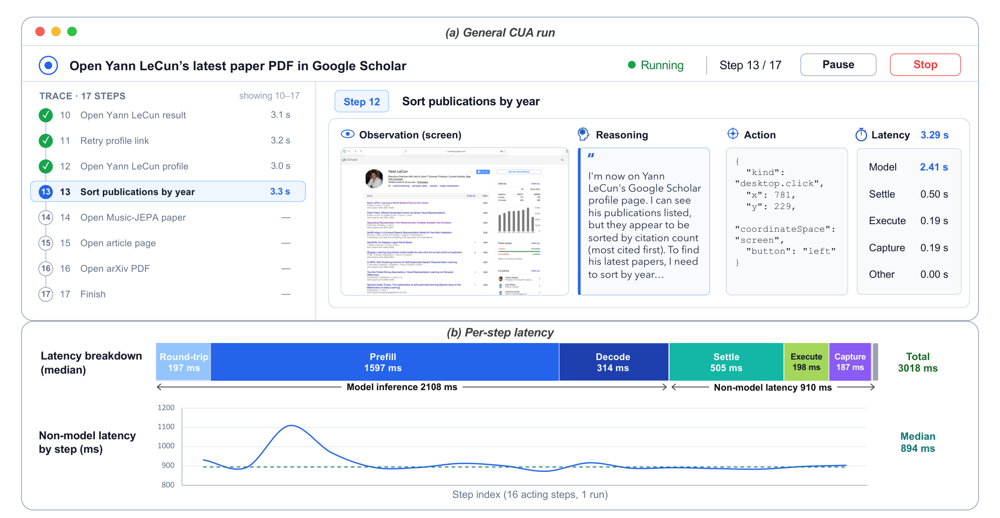
*图 14｜27B 优化端点单步中位 3030 ms，模型调用 2108 ms；预填充约占模型调用 76%，因此前缀和图像缓存比单纯削减鼠标执行开销更关键。*

## 关键结果

### 公共基准

| 模型 | OSWorld-Verified | WindowsAgentArena |
|---|---:|---:|
| Qwen3.5-9B | — | 37.5 |
| UI-Mate-9B | 66.2 | 61.7 |
| Qwen3.6-27B | 52.5 | 47.1 |
| UI-Mate-27B | 77.0 | 66.2 |
| Kimi-K2.6 | 73.1 | 63.3 |
| GPT-5.5 | 78.7 | 70.4 |
| Claude Opus 4.8 | 83.4 | 69.3 |

UI-Mate-27B 在两项公共基准都超过全部开放权重比较对象，距闭源前沿仍有差距。最有解释力的比较是同规模基座：OSWorld 相对 Qwen3.6-27B 提高 24.5 点，WAA 提高 19.1 点；9B 模型在 WAA 相对 Qwen3.5 提高 24.2 点。因为系统之间执行框架、历史、动作批处理和服务设置不完全相同，结果应称为端到端系统领先，不宜解释为单独模型权重的纯增益。

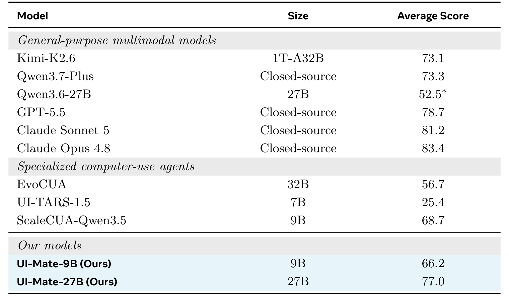
*表 1｜UI-Mate-27B 在 OSWorld-Verified 得 77.0%，高于开放权重比较对象，但仍低于 Claude Sonnet 5 与 Opus 4.8。*

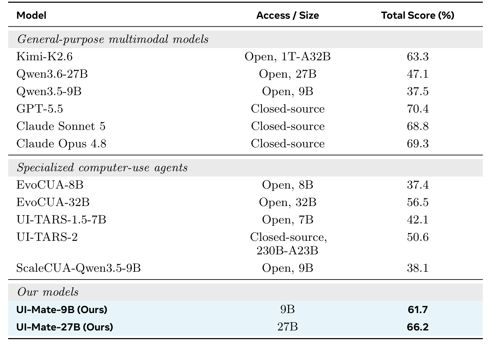
*表 3｜UI-Mate-27B 在 WindowsAgentArena 得 66.2%，UI-Mate-9B 得 61.7%；两者都显示训练栈带来的同规模增益。*

### OSWorkerBench：进度高，收尾仍弱

| 模型 | 总体进度 | 多应用成功 | 长记忆成功 | 严格成功 |
|---|---:|---:|---:|---:|
| Qwen3.6-27B | 52.35 | 7.48 | 12.94 | 23.33 |
| Kimi-K2.6 | 72.42 | 18.37 | 25.37 | 40.67 |
| UI-Mate-27B | **76.86** | **28.57** | **32.84** | **41.00** |
| GPT-5.6-Sol | 87.67 | 65.31 | 67.16 | 71.00 |

UI-Mate-27B 与 Kimi 的总体严格成功近乎打平，但在多应用和长记忆任务上分别高 10.20 与 7.47 点，说明优势更集中在信息转移和状态保持。不过，进度 76.86 与严格成功 41.00 相差 35.86 点；大量运行已完成大部分工作，最终仍因漏字段、漏通知或未执行最后分支失败。这比单看严格成功更明确地指出下一步研究靶点：不是“不会开始”，而是“不能可靠收尾”。

### Self-demo 的平均收益与负迁移

| 数据集 | 无演示 | 有演示 | 增益 | 选择条件 |
|---|---:|---:|---:|---|
| GameDev 10，任务分 | 76.76 | 81.15 | +4.39 | 人工策划超长任务 |
| OSWorld-Subset30，任务分 | 40.27 | 65.75 | +25.48 | UI-Mate 无演示失败、强参考可解 |
| OSWorkerBench-Subset33，进度 | 67.85 | 81.14 | +13.29 | 同任务强智能体成功演示 |
| OSWorkerBench-Subset33，严格成功 | 17.17 | 35.35 | +18.18 | 同上 |

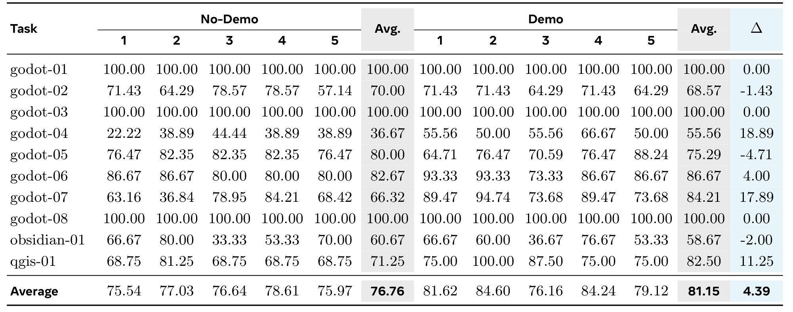
*表 4｜UI-Mate-27B 在 GameDev 五次运行均值由 76.76% 升到 81.15%；godot-04 与 godot-07 增益最大，但 godot-05、obsidian-01 下降。*

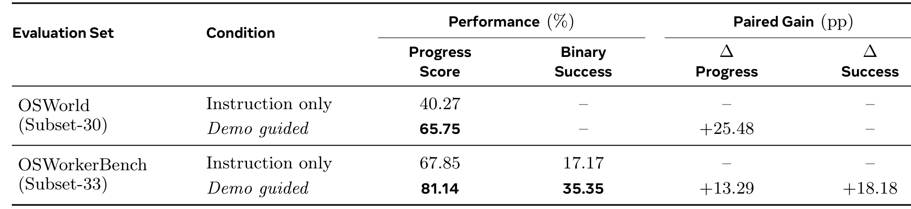
*表 5｜相同目标条件下，self-demo 对 OSWorld-Subset30 和 OSWorkerBench-Subset33 都产生较大平均增益。*

平均增益不意味着每个任务都受益。OSWorld 子集中 18/30 改善、8/30 不变、4/30 下降。任务 multi-03 从无演示五次全成功降为五次全失败，另三项任务也退化。GameDev 中 godot-05 下降 4.71 点，obsidian-01 下降 2 点。演示是一项带偏差的先验；当程序与当前状态冲突、错误地限定搜索，或让模型过度承诺某条路径时，会产生强负迁移。

### 轨迹长度不能脱离完成度解释

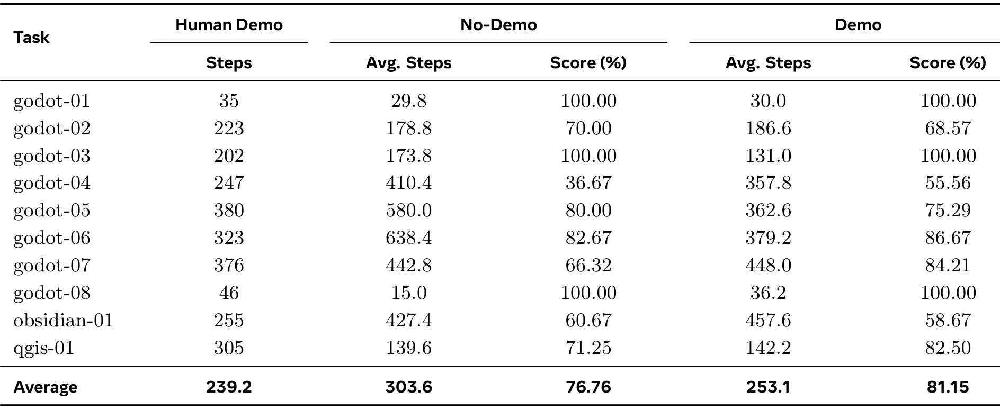
*表 6｜GameDev 中演示让 UI-Mate 平均步数由 303.6 降到 253.1，同时把分数由 76.76 提到 81.15；主要减少长任务的探索绕路。*

OSWorkerBench 上情况相反：平均步数从 173.3 增到 216.0，但进度也提高。原因是无演示智能体常在重复或分支流程未做完时过早 `DONE`；演示让它找到剩余分支，所以更长反而表示更完整。论文还发现 GPT 每决策轮平均含 3.83 条动作记录，近半轮次有多个非等待动作。不同系统的“步数”混合了任务工作量、动作批处理政策和完成程度，不能直接当效率排名。

### 产品化时延

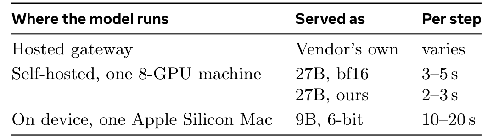
*表 7｜单台八卡机器上，27B 的 bf16 服务每步约 3–5 秒；W8A8 量化和 DFlash 推测解码后约 2–3 秒。苹果芯片上 6 位 9B 模型配合 720p 与缓存约 10–20 秒。*

真实运行的 3030 ms 中位数里，模型调用 2108 ms、其他开销 910 ms。即使所有非模型成本减半，总体也只约降 15%。这支持系统把优化重点放在视觉预填充、分辨率、历史截图和前缀缓存，而不是只加快鼠标执行。

## 深度分析

### 1. 论文真正解决的是“可靠性接口”，不只是模型能力

训练栈提高了无演示能力，DemoCUA 则给用户一个把默会程序注入模型的接口。二者互补：如果基座连基本界面都不会操作，演示无法补足能力；如果基座能力强但指令有多个合法程序，继续扩大平均训练数据也不能知道某个用户偏好哪条路径。

这种接口设计有三个正确抽象：演示只提供无坐标语义步骤；每步仍由实时截图落地；子任务完成由可见准则推进。它把“学习用户过程”与“复制用户动作”分开，接近一个可适配、可验证的一次性技能描述。

### 2. Self-demo 证明执行指导，不证明程序迁移

33 个 OSWorkerBench 结果和 OSWorld-Subset30 都是同目标演示。它们说明：当有人已经给出一条成功路径，模型能较好消费这条路径。这是重要但较容易的命题。

更有现实意义的问题是：用户演示“给客户甲建档并排期”，智能体能否迁移到“给客户乙、丙批量建档”，并正确识别字段、数量和分支不同。论文为此准备 45 个变体演示，但只报告十任务先导观察；必须按目标实体数量重复被演示片段后，结果才总体转正，而且仍不稳定。因此，标题中的“上下文内演示”有充分同任务证据，却只有早期变体证据。

### 3. 演示收益应被建模成条件决策，而非默认开关

四个 OSWorld 负迁移任务表明，“有演示”不是单调干预。部署系统更合理的形式是先估计演示与当前状态的适用度，再决定：

- 直接采用工作流；
- 只采用部分子任务；
- 请求用户确认差异；
- 完全忽略演示，回到通用策略。

当前训练用全对齐、部分错位和无关三类样本，已在策略层做了初步仲裁，但没有显式输出适用度、置信度或风险门。对企业流程，误用一条相似演示可能比没有演示更危险，尤其涉及邮件、采购、权限与不可逆操作。

### 4. 验证器质量是整个数据飞轮的瓶颈

论文最可信的数据洞见是：初态失败、黄金终态成功，仍不足以证明奖励表达指令。约 18% 已过自洽检查的评估器在 LLM 审计中错位，其中过严匹配占 40%、语义空洞占 23%、检查错对象占 19%。若这类奖励进入 RL，模型会稳定学习“通过错误检查”，而不是完成用户任务。

困难负例与替代正例是正确方向，但仍由任务生成逻辑决定覆盖哪些错误方式。更强方案应加入：真实模型发现的奖励捷径、逐版本回归集、人工审计样本和评估器间一致性。验证器不是数据流水线末端的附件，而是训练目标本身。

### 5. RL 方法的优点与证据强度不同

决策轮中心化有明确统计动机：奖励在轮次上广播时，长轨迹会自然拥有更多梯度项；用轮次加权组均值至少使优势在实际聚合测度下近似中心化。token 归一化同理处理响应长度。

PCM 的机制也合理，但论文自己报告它与自适应课程主要提高收敛速度，没有稳定提高最终成功率。因此，不应把主结果归功于 PCM。更保守的结论是：训练基础设施减少了达到同等性能所需更新，而最终上限仍由任务覆盖和奖励质量决定。

### 6. 历史推理揭示“记忆—探索”张力

评测时保留历史推理，SFT 模型提高 3.43 点，RL 模型提高 2.27 点；SFT 训练也加入历史推理，长时程跨应用再约提高 2.85 点。它帮助保存实体链、约束和待办项。

但 RL rollout 中保留历史推理会提高条件确定性、加速熵下降，造成探索不足。这里有一个可推广洞见：对长时程智能体，推理历史既是外部记忆，也是自我强化先验。部署阶段需要稳定性，训练阶段需要多样性，二者可能要求不同的历史表示或随机化策略。

### 7. OSWorkerBench 的价值与外部效度

基准的强项是工作流依赖明确、检查点稠密、成对协议受控，而且不把“打开多个应用”偷换成真正的信息流。长轨迹分布和进度—严格成功差能有效暴露尾部失误。

边界在于它仍是初始化、可重置、后端状态可观察的受控企业应用环境。真实办公还包含权限、通知延迟、网络故障、同事输入、组织政策和不可逆外部副作用。当前分数能衡量受控工作流执行，不能直接换算为现实生产力或自主部署安全性。

## 局限

1. **定量演示证据局限于 self-demo。** 45 个 variant-demo 没有系统汇总；标题最具现实意义的“从相关例子迁移”仍未完成验证。
2. **OSWorld 子集存在条件选择。** 按无演示失败且强参考可解选择，25.48 点不能外推到完整基准。
3. **端到端比较缺少组件级归因。** 训练数据、RL、历史管理、动作批处理和 harness 同时变化，无法从主表分解各自贡献。
4. **负迁移未形成风险模型。** 论文报告有害任务，却没有演示适用度检测、置信门控或不可逆动作安全实验。
5. **消融和不确定性不足。** 关键动作稀疏化、三类关系比例、PCM、课程采样、历史推理与上下文折叠缺少统一的多次运行方差和完整矩阵。
6. **进度到严格成功仍有大缺口。** UI-Mate-27B 相差 35.86 点，说明长流程最后阶段和完整性检查仍不可靠。
7. **受控应用外部效度有限。** mock 应用和可观察后端比真实企业软件更易重置与验证，尚未量化跨环境迁移。
8. **跨平台产品仍不完整。** macOS 和 Linux 有 bridge，Windows 仍在开发；本地 9B 的 10–20 秒一步也限制交互体验。
9. **上下文与缓存矛盾。** 工作流置于上下文前部，每次子任务更新都使 KV cache 前缀失效；长流程服务成本仍高。
10. **开放性信息尚不完整。** 论文表示“计划发布”基准和配套资源，但报告本身没有给出完整资源下载、许可证、模型权重与训练配方清单，独立复现仍受限。

## 我的笔记

### 最值得复用的工程原则

1. **把演示存成工作流，不存成坐标。** 目标、完成准则、视觉线索和可选动作顺序比像素轨迹更能跨分辨率与 UI 小改动复用。
2. **让环境拥有最终否决权。** 演示、历史推理和语言计划都是先验；实时状态和验证器才是事实源。
3. **用负迁移验收演示系统。** 除平均增益，还应报告恶化任务比例、最坏下降、拒用演示准确率和不可逆错误率。
4. **把“完成前检查”作为单独能力训练。** 进度高而严格失败说明需要在终止前依据验证器里程碑检查漏字段、漏分支与漏通知。
5. **把奖励审计放在数据生成闭环里。** 每个评估器至少需要初态、黄金终态、困难负例、替代正例和真实策略发现的捷径回归集。

### 一个更强的后续实验设计

45 个 variant-demo 应采用分层成对实验：按源—目标结构相似度、实体数量差、应用版本差和演示质量分层；每个目标运行仅指令、完整演示、自动裁剪演示、随机不相关演示和人工摘要工作流五个条件。除了进度与严格成功，还报告演示采纳率、偏离率、负迁移率、不可逆错误和用户纠正次数。这样才能区分“程序知识迁移”与“同任务路径提示”。

### 对智能科研工作流的启示

在实验站、数据处理或仿真软件中，用户也很难用一句话写完目录规则、参数选择和检查顺序。UI-Mate 的工作流表示可迁移为“实验子任务—完成判据—关键视觉/数值里程碑”，但科研任务还需增加数值单位、版本、数据谱系和安全边界。尤其不能让演示覆盖实时仪器状态；正确架构仍应是演示给先验、设备遥测和独立验证器给事实。

### 后续追问

- 演示与当前状态的结构相似度能否校准成“使用/部分使用/拒绝”的概率？
- 如果演示本身含错误、恶意步骤或过时界面，三类反捷径训练能抵抗到什么程度？
- 终止前调用一次里程碑审计，能否缩小 35.86 点的进度—严格成功差？
- 公开权重是否包含 DemoCUA 能力，模型、训练数据和评估器将采用什么许可证？
- 同一模型在标准化 harness 下比较时，公共基准领先是否仍然成立？

## 引用

Tencent HY Frontier Team. *UI-Mate: Advancing Open-Weight Foundation GUI Agents with In-Context Demonstrations.* arXiv:2608.15930, 2026. https://arxiv.org/abs/2608.15930
