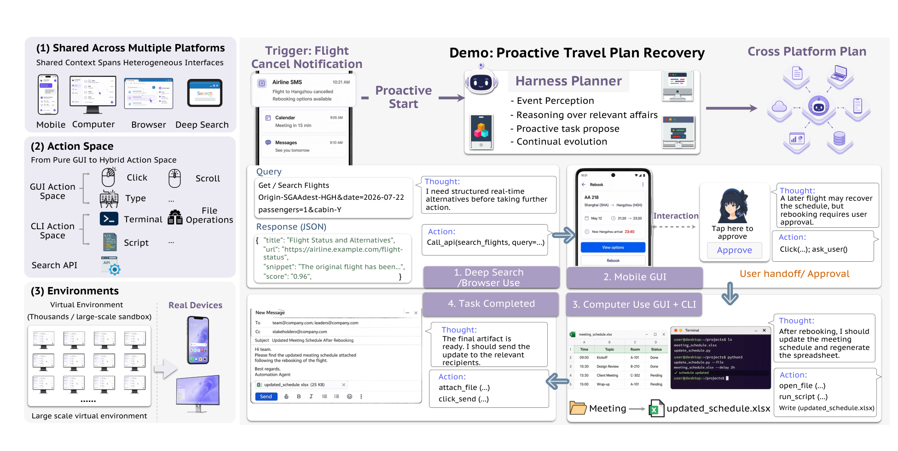
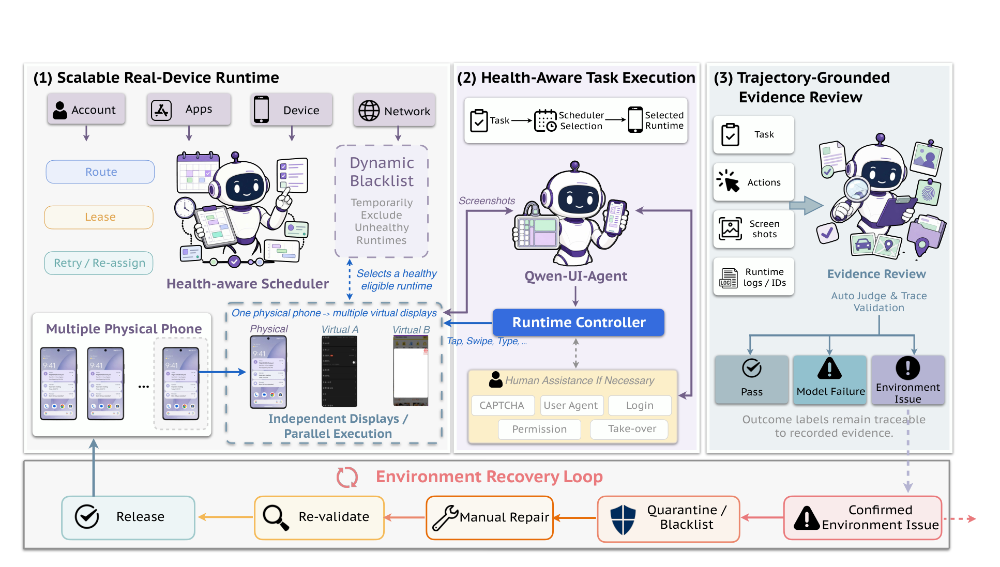
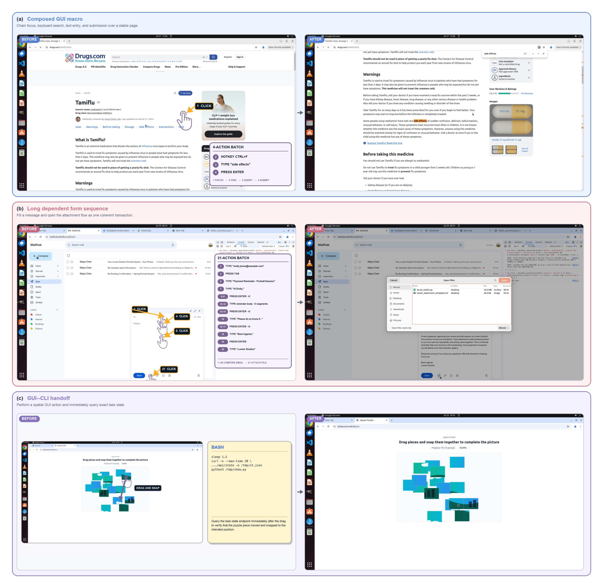

# Qwen-CUA vs Qwen-UI-Agent：场景、长上下文、SFT 与 RL 横向对比

> [!summary] 结论先行
>
> 两篇工作不是同一条路线上的简单版本替换。**Qwen-CUA** 研究的是：在严格的“只看截图、只发原生键鼠事件”约束下，怎样把桌面计算机使用扩展成一种可跨软件迁移的基础能力。**Qwen-UI-Agent** 研究的是：怎样把 GUI 模型、真实手机、CLI/API、批量动作、数据飞轮与 harness 组合成一个面向真实世界服务的跨平台系统。
>
> 最简洁的区分是：**Qwen-CUA 追求接口纯度与原生覆盖，Qwen-UI-Agent 追求工具异构性与系统效用。** 这一设计哲学差异进一步决定了二者的场景、上下文管理、SFT 数据组织和 RL 信号设计。

## 1. 论文身份与可比性

| 项目 | Qwen-CUA | Qwen-UI-Agent |
|---|---|---|
| 论文 | *Qwen-CUA: Native Computer Use for (almost) Everything* | *Qwen-UI-Agent Technical Report: Toward Next-Generation Real-World Centric Foundation GUI Agents* |
| 团队 | **Qwen Team + Xlang Lab** | **MAI-UI Team，Alibaba Token Hub** |
| 时间 | 2026-08-03 | 2026-07-30（arXiv v1；译文记录日期为 2026-07-31） |
| 核心研究对象 | 原生 Computer-Use Agent | 真实世界中心的基础 GUI Agent 系统 |
| 主要科学问题 | 像人一样只凭像素和键鼠，能否跨广泛桌面软件完成长任务？ | 如何把移动端、桌面、网页、检索、CLI/API 与主动服务组织为统一系统？ |
| 最有辨识度的贡献 | 20 图活动历史、10 图成块折叠；大规模可验证任务；SAPO 长轨迹 RLVR | 真实设备运行时；GUI+CLI/API+批量动作；领域专家 SFT；Action RL + Online RL；跨平台 harness |

需要特别澄清：Qwen-UI-Agent 虽然以 “Qwen” 命名，但论文署名团队是 MAI-UI Team，并明确说明它延续此前的 MAI-UI；Qwen-CUA 则由 Qwen Team 与 Xlang Lab 联合完成。因此，两者位于同一阿里/Qwen 技术生态，却来自不同的组织与方法积累。

本对比的本地证据源：

- [Qwen-CUA 全文中文翻译](../2026_Qwen-CUA_native_computer_use/01_全文中文翻译_Qwen-CUA.md)
- [Qwen-CUA PDF 原文](../2026_Qwen-CUA_native_computer_use/2026_Qwen-CUA_native_computer_use.pdf)
- [Qwen-UI-Agent 全文中文翻译](../2026_Qwen-UI-Agent_foundation_GUI_agents/01_全文中文翻译_Qwen-UI-Agent.md)
- [Qwen-UI-Agent PDF 原文](../2026_Qwen-UI-Agent_foundation_GUI_agents/Qwen-UI-Agent_Technical_Report_arXiv_2607.28227.pdf)

## 2. “基线模式”需要分成三个层次理解

“基线模式”可能指模型基座、智能体交互协议，也可能指实验比较对象。三者混在一起会得出错误结论。

| 层次 | Qwen-CUA | Qwen-UI-Agent |
|---|---|---|
| **模型主干/训练起点** | 明确报告 **397B-A17B Qwen MoE**；Qwen-CUA-Max 总参数超过 1T。每轮 SFT 都从同一个中期训练检查点重新初始化，而不是接着微调上一轮智能体。论文没有把该中期检查点明确命名为 Qwen3.7。 | 主模型为 **27B**，另有 **35B-A3B** 与 **4B**；论文称从“相应基础检查点”初始化。结果表把 27B 与 Qwen3.5-27B 作为基础能力对照，模型尺寸也与 Qwen3.5 系列对应，因此“以 Qwen3.5 相应尺寸为基座”是高可信推断，但正文没有直接给出完整初始化名称。 |
| **智能体交互基线/协议** | **纯原生模式**：截图输入；键盘、鼠标与少量控制动作输出；无 DOM、无无障碍树、无 Shell、无任务 API。 | **混合模式**：GUI 截图、CLI 输出、API 返回可共同构成观测；动作可为 GUI、CLI、API、询问用户，且一次决策可输出动作批次。 |
| **主要实验基线** | 最核心内部对照是 **Qwen3.7**，并与 GPT-5.5、Claude Opus 4.8 等系统比较。 | 基线更广：Qwen3.5 各尺寸、Qwen3.7 Plus、专用 GUI 模型和多种闭源前沿模型；不同领域使用不同对照组。 |

因此，**Qwen3.7 是 Qwen-CUA 的主要效果基线，不等于已被论文明确证明是其初始化基座**；同理，Qwen-UI-Agent 与 Qwen3.5 的基座关系虽然证据很强，严格写作时仍应保留“报告未明确命名对应检查点”的边界。

## 3. 面向场景：桌面原生基础能力 vs 跨平台真实世界系统

### 3.1 Qwen-CUA 的目标场景

Qwen-CUA 的主场是需要通过**桌面视觉界面**完成的广泛工作流：

- 浏览器与动态网站；
- 日常桌面与跨应用办公；
- 个性化文件、账号和历史驱动的工作流；
- CAD、Blender、科学软件等专业或长尾软件；
- 需要用户澄清、错误恢复、最终状态核验的长时程任务；
- 间接提示注入等对抗性屏幕内容。

它有意放弃结构化捷径，使同一个“截图—键鼠”协议不经应用适配即可迁移。论文也研究与 Bash 混合的潜力，但主模型训练和主要评测仍强调纯原生协议。

*Qwen-CUA 原论文图 2：任务、截图、智能体脚手架、原生动作与虚拟机组成的交互闭环。*

**原图解读。** 图中只有两种实质信息进入策略：任务文本和截图；只有点击、拖动、输入/按键等动作改变虚拟机。紫色的 context manager 位于循环内部，说明长历史处理是核心智能体脚手架的一部分。图中没有 DOM、CLI 或 API 旁路，这不是绘图省略，而是论文刻意定义的能力边界。

### 3.2 Qwen-UI-Agent 的目标场景

Qwen-UI-Agent 的范围更像一个完整的数字执行平台：

- 移动端沙箱和真实 Android 设备；
- 桌面计算机使用；
- 端到端浏览器使用；
- DeepSearch 多来源检索与证据综合；
- 手机与计算机之间的跨平台工作流；
- 由通知触发的主动服务；
- 需要 API 检索、GUI 操作、CLI 文件处理和用户授权共同完成的任务。

*Qwen-UI-Agent 原论文图 2：由航班取消触发、跨搜索/API、移动端和桌面端执行的主动工作流。*

**原图解读。** 左侧三块分别把“多平台”“混合动作”“虚拟与真实环境”列为系统前提；右侧航班取消案例依次调用搜索/API、移动 GUI、用户批准、桌面 GUI+CLI 和消息发送。与 Qwen-CUA 的单闭环不同，这张图表达的是**规划器在异构执行通道之间路由任务**。

### 3.3 场景差异的本质

| 维度 | Qwen-CUA | Qwen-UI-Agent |
|---|---|---|
| 优先覆盖 | 桌面/浏览器/专业软件的原生计算机使用 | 移动、桌面、网页、DeepSearch 和跨设备工作流 |
| 真实设备重点 | 主要是隔离桌面环境与浏览器部署 | 100+ 物理手机、150+ 应用，真实设备进入训练与评测主循环 |
| 工具观 | 工具越少，越能检验通用像素—键鼠能力；Bash 是补充研究 | GUI、CLI、API、批量动作各司其职，是核心产品能力 |
| 主动性 | 主要响应用户任务，必要时 call_user | 通知可触发主动服务，harness 维护事务、任务和记忆 |
| 跨平台状态 | 主要在同一桌面/多应用工作流内保持 | harness 显式维护移动端与计算机间的共享状态、材料与依赖 |

## 4. 方法主线：共同闭环，不同中心

### 4.1 Qwen-CUA 的方法主线

Qwen-CUA 可以压缩为一条“**原生接口—可验证经验—长轨迹 RL—数据刷新**”主线：

1. 任务文本与当前截图进入 397B-A17B Qwen MoE。
2. 模型只输出原生键鼠/控制动作，环境返回下一张截图。
3. context manager 保留最近 20 张截图，旧图按 10 张一块折叠。
4. 可控 Web、广泛桌面和个性化人类工作流共同提供训练经验。
5. 自然语言目标、可复现初始状态和可执行评估器构成可验证任务。
6. SFT 先建立策略，再用完整轨迹终止奖励和 SAPO 做 RLVR。
7. 当前策略暴露失败后，刷新教师示范、人类轨迹、薄弱领域数据与 RL 任务池；下一轮重新训练。

它的中心不是某个单独定位模块，而是把模型、环境、任务、rollout 吞吐和训练配方同时扩展。

### 4.2 Qwen-UI-Agent 的方法主线

Qwen-UI-Agent 是“**异构环境—数据飞轮—分层训练—harness 服务**”主线：

1. 统一接口接入移动、桌面、网页和 DeepSearch 环境。
2. 策略联合读取截图、CLI 输出和 API 返回，输出单动作或动作批次。
3. 强模型生成任务、环境状态与验证器；步骤级 VLM 评判器从成功和失败轨迹中回收有效片段。
4. 分领域训练专家，再合并成统一模型；混入经过验证的起始模型分布内样本以保留通用能力。
5. Action RL 纠正局部动作错误，Online RL 优化完整长轨迹的最终成功。
6. harness 在模型之外维护事件、事务、记忆、跨设备材料和子任务依赖，实现主动服务与跨平台执行。

*Qwen-UI-Agent 原论文图 3：沙箱、真实设备、混合动作空间和统一环境接口。*

**原图解读。** 四象限分别对应可扩展沙箱、模拟到真实设备、GUI+CLI 混合动作、异构环境统一接口。中心机器人不是一个孤立模型，而是被环境、执行器和真实设备共同包围；这正是该工作的系统观。图右上还画出用户接管，表明权限、登录、支付和确认被视作运行时协议，而不是单纯依赖模型拒绝。

### 4.3 主线的共同点与差异

共同点：

- 都把 GUI 智能体看成“模型 + 环境 + 数据 + 验证器”的闭环，而非静态截图定位器。
- 都使用当前模型的失败反向驱动下一轮任务和数据构造。
- 都依赖可复现初始状态和最终状态验证，允许不同动作路径到达正确结果。
- 都把长时程状态跟踪、恢复与终局核验视为核心能力。
- 都通过大规模并发 rollout 扩展经验，而不是只增加离线标注数据。

关键差异：

- Qwen-CUA 把**接口约束**放在中心：先固定纯像素—键鼠协议，再扩大能力。
- Qwen-UI-Agent 把**系统效用**放在中心：根据任务选择 GUI、CLI、API、批处理或外部 harness。
- Qwen-CUA 的“统一”是统一成一个最小原生接口；Qwen-UI-Agent 的“统一”是用适配器统一多种原生语义。
- Qwen-CUA 的长程支持主要内置于模型上下文与 RL 切片；Qwen-UI-Agent 还把一部分长期状态移到 harness、事务记忆和分层规划中。

## 5. 真实轨迹数据：采集方法、规模与场景

### 5.1 先界定“真实轨迹”的三种含义

这里的“真实轨迹”不应只理解成“人在真实手机上操作”。只要智能体的动作确实改变了一个有状态、可继续交互且可验证的环境，它就不同于静态截图问答或离线动作标注。为避免混淆，本文把相关数据分成三类：

| 轨迹类型 | 含义 | Qwen-CUA | Qwen-UI-Agent |
|---|---|---|---|
| 可执行环境中的模型 rollout | 模型连续读取截图/环境返回、执行动作并实际改变应用状态，最后由评估器检查 | **明确包含**：模拟 Web、隔离桌面与真实软件沙箱 | **明确包含**：移动、桌面、浏览器、DeepSearch 沙箱 |
| 人类端到端示范 | 标注者亲自完成真实用户工作流，保留完整观察、动作和结果状态 | **明确包含且单独描述采集协议** | 报告主要写人类监督系统、干预异常和编写评测任务，**未给出与 CUA 对等的人类示范数据集采集协议** |
| 物理设备在线轨迹 | 策略在真实手机、真实应用、账户和网络条件下运行 | 未作为主要采集设施披露 | **明确包含**：100+ 物理设备、150+ 应用，并进入训练与验证闭环 |

因此，两篇论文都使用“真实执行产生的轨迹”，但真实性的来源不同：Qwen-CUA 更强调**真实软件中的可复现执行和人类专业工作流**，Qwen-UI-Agent 更强调**物理设备上的部署噪声、账户状态和动态应用生态**。

> [!IMPORTANT]
> **任务数 ≠ 轨迹数 ≠ 并发环境数。** 一个任务可以被人类、教师模型或当前策略多次采样；一条长轨迹又可切成多个训练片段。下文所有规模均按论文原有统计口径分别列出。

### 5.2 Qwen-CUA：人类个性化示范与大规模可验证 rollout 双轨采集

Qwen-CUA 的数据采集由两条互补链路构成。

**第一条是人类端到端示范。** 论文不是让标注者只点击一个孤立控件，而是先建立带有个性化文件、应用状态和任务历史的桌面环境，再让标注者完成完整工作流。场景既包括日常个人任务，也包括 CAD、Blender 等专业软件；较长示范会自然包含跨应用交接、错误恢复和最终检查。原始记录至少保留：

- 自然语言任务；
- 每一步截图观察；
- 原生键盘与鼠标动作；
- 动作执行后的环境状态。

人类动作记录本身没有充分暴露“为何这样做”。因此，团队再用模型根据此前轨迹、当前截图和已示范动作重建逐步推理，并做动作—理由一致性过滤。这里形成的是“**人类提供可靠行为路径，模型补全可学习的推理监督**”的数据，而不是让教师模型从头生成全部轨迹。

**第二条是模型在可执行环境中的 rollout。** 每个任务被组织为“自然语言目标 + 可复现初始状态 + 可执行评估器”。采样时，系统恢复任务快照，模型连续接收截图并发出原生动作，终止后调用评估器，再重置环境。任务来源分为三类：

1. 从软件功能分类和常见使用情境构造的环境交互任务；
2. 由用户模拟器在智能体主动询问时补充信息的交互任务；
3. 将阶段状态序列化为下一阶段初态的长程链式任务，使跨阶段结果仍可验证。

采样并非只运行一次。当前策略的失败会反向暴露薄弱领域，随后教师重采样尚未解决的 SFT 查询，加入新的人类轨迹，并定向补充弱领域任务；RL 候选任务则先试采样，以当前策略的成功难度筛选进入下一轮的数据。

*Qwen-CUA 原论文图 4a：模型代际、约 4 万个可验证任务与近 10 万 vCPU/数万个并发环境的联合扩展。*

**原图解读。** 横轴展示从 Qwen3-VL 到 Qwen-CUA 的模型代际，折线给出相应能力提升；“约 4 万任务”和“近 10 万 vCPU”被并列画出，表达的是**模型、任务覆盖和采样吞吐共同扩展**。这张图能证明任务池与基础设施规模，却不能证明有“4 万条轨迹”：同一任务会产生多条 rollout，而人类示范的具体条数没有公开。

### 5.3 Qwen-UI-Agent：数据飞轮中的沙箱 rollout 与物理手机轨迹

Qwen-UI-Agent 更像一条由当前策略驱动的在线数据生产线。强模型先生成任务、环境配置、验证器和候选轨迹；多轮拒绝采样把通过验证的轨迹汇入 SFT 语料；当前策略的失败再生成下一轮定向任务。其环境层同时覆盖：

- **移动沙箱**：基于 redroid 重建，覆盖 20 个应用，并带任务上下文、初始状态和状态验证器；
- **桌面沙箱**：Ubuntu 虚拟机中的真实桌面应用和跨应用工作流，可产生 GUI+CLI 混合轨迹；
- **浏览器沙箱**：每个 episode 使用独立 BrowserContext，既记录截图与原生 GUI 操作，也用 JavaScript 检查 DOM 和持久状态；
- **DeepSearch 环境**：搜索、网页与文档返回形成文本/工具观察序列。

它比 Qwen-CUA 多出一条明确的**物理手机在线采集链**。调度器持续检查设备、应用、账户、网络和显示状态，把任务分配给可用设备；scrcpy 虚拟屏幕允许同一物理设备并行承载多个应用会话。当缺少用户信息、需要敏感操作确认，或遇到 CAPTCHA 时，User Agent/人工接管参与交互。终止后，VLM 根据完整轨迹区分“成功、模型失败、环境失败”；确认的环境故障进入黑名单或维修队列，通过核验的轨迹才保留用于训练。

*Qwen-UI-Agent 原论文图 4：真实手机轨迹从设备调度、并行虚拟屏幕、必要时人工介入，到轨迹证据复核和环境修复的完整采集链。*

**原图解读。** 左侧把账户、应用、设备和网络健康度汇总到调度器，并通过虚拟屏幕提高同一设备的并发利用率；中间展示截图—动作循环，以及登录、权限、CAPTCHA 等需要用户或人工协助的断点；右侧把任务、动作、截图和运行日志一起交给轨迹评判，再将环境故障反馈给运行时恢复模块。它说明该工作的“真实”不仅是使用真实 App，还包括**不可控网络、权限弹窗、账号失效和人机交接**。

此外，Qwen-UI-Agent 不只保留最终成功的完整轨迹。步骤级 VLM 评判器会从成功和失败轨迹中提取：最大连续正确前缀、反思/探索片段的首个有效步骤，以及从错误中恢复的片段。由此，同一条失败 rollout 也可能提供局部 SFT 监督。其数据利用率更高，但质量更依赖 VLM 对过程边界和错误归因的可靠性。

### 5.4 数据量：论文公开了什么，仍缺什么

| 规模口径 | Qwen-CUA | Qwen-UI-Agent | 正确解释 |
|---|---|---|---|
| 已验证任务规模 | 约 **4 万个可验证任务** | 自动合成约 **1 万个任务—验证器对** | 都是任务规模，不是轨迹条数 |
| 总体并发基础设施 | 近 **10 万 vCPU**，可支持数万个并发计算机使用环境 | 沙箱 rollout 最多 **1 万并发** | 是吞吐容量，不是累计样本数 |
| 报告中的实际 RL 环境配置 | 附录配置最多 **2000 个活跃环境**，平均利用率超过 75% | 物理设备虚拟屏幕使同一设备集群的 rollout 吞吐提高约 **20 倍** | 运行配置/相对吞吐，仍不是数据总量 |
| 单任务采样 | 每个任务尝试采样 20 条，剔除无效轨迹后最多取前 16 条有效轨迹 | 每个任务采样 $K$ 条完整轨迹，但 **未披露 $K$** | CUA 可推采样上限；UI-Agent 无法据此反推总量 |
| 人类/真实设备覆盖 | 人类在个性化桌面采集端到端示范；**示范条数未披露** | **100+ 物理设备、150+ 应用**；训练轨迹条数未披露 | 设备/应用覆盖不等于样本量 |
| 训练轨迹总量 | **未直接披露去重后总量** | **未直接披露去重后总量** | 两篇论文都缺完整 dataset card |
| 真实移动评测数据 | 不适用 | MobileWorld-Real 有 409 个任务、104 个应用；其任务与轨迹**全部从训练中留出** | 不能把 409 个评测任务计入训练数据 |

若只按 Qwen-CUA 附录公开的 RL 配置做**名义上限推算**：每次更新含 128 个任务，每任务最多尝试 20 条，训练 1000 次更新，因而最多对应 $128\times20\times1000=2{,}560{,}000$ 次轨迹尝试；若按每任务最多保留 16 条有效轨迹，则切片前的有效轨迹名义上限为 $128\times16\times1000=2{,}048{,}000$。这不是论文公布的“独立训练轨迹数”，因为任务可能重复、无效轨迹会被删除，同一完整轨迹还会被切成多个优化样本。Qwen-UI-Agent 未给出 $K$、更新轮数和每轮任务数，不能做同等级推算。

### 5.5 数据场景与采集偏向

| 维度 | Qwen-CUA | Qwen-UI-Agent |
|---|---|---|
| 日常工作 | 文件、办公、多应用协作、浏览器与个性化桌面任务 | 手机生活服务、内容消费、社交、电商、系统设置，以及桌面/浏览器工作流 |
| 专业场景 | 创意、科学、工程和长尾桌面软件，明确包括 CAD、Blender 等 | GUI+CLI 的桌面专业任务、DeepSearch 与跨平台服务；真实手机覆盖 150+ 应用 |
| 长程来源 | 人类完整工作流、跨应用交接、错误恢复、阶段状态串联 | 多轮在线 rollout、跨设备依赖、动态内容、弹窗/权限/网络故障和人机交接 |
| 用户交互 | 用户模拟器只在智能体主动澄清时响应；人类示范提供个性化先验 | User Agent 提供缺失信息、敏感操作确认和 CAPTCHA 接管，嵌入运行时协议 |
| 环境可控性 | 更依赖可重置沙箱、任务快照和确定性最终状态验证 | 沙箱部分同样可控；物理设备部分更接近部署，但环境噪声更大，需要健康调度和故障归因 |
| 主要采集偏向 | 擅长获取稀疏终局奖励难以发现的“专家式路径”和专业软件行为 | 擅长获取真实部署中的异常、恢复、权限、账号和动态内容行为 |

两者的共同基础仍是“让动作真的执行，并用结果状态而非固定点击序列判定成功”。差别在于，Qwen-CUA 通过人类示范为长程专业行为注入较强先验，再用可控环境放大；Qwen-UI-Agent 通过模型主导的数据飞轮和物理设备闭环采集更广泛的部署分布，并从失败轨迹回收局部有效监督。

### 5.6 小结：两套真实轨迹路线

- **Qwen-CUA：人类专家先验 + 可验证环境中的大规模模型试错。** 它公开了较完整的人类示范字段、任务构造方式和 RL 单任务采样配置，但没有公开人类示范数及最终去重轨迹总量。
- **Qwen-UI-Agent：模型驱动的数据飞轮 + 物理设备在线闭环。** 它公开了设备/应用覆盖、真实设备运行链、过程片段回收和并发能力，但没有公开被接受的 SFT 轨迹数、物理设备训练轨迹数及 Online RL 的 $K$ 值。
- 因而不能仅凭“4 万 vs 1 万”判断哪一方数据更多。更准确的结论是：**CUA 的轨迹来源更强调人类专业行为与可控复现，UI-Agent 的轨迹来源更强调平台异质性与真实部署噪声。**

## 6. 长时上下文与图像折叠：二者不是同一种方案

这是两篇论文最容易被误读的部分。Qwen-CUA 给出的是**推理期与 RL 训练期共享的明确图像折叠算法**；Qwen-UI-Agent 给出的是**SFT 数据打包的滑动窗口**，并没有在报告中公开一个等价的推理期视觉折叠算法。

### 6.1 总表

| 维度 | Qwen-CUA | Qwen-UI-Agent |
|---|---|---|
| 主要作用阶段 | 在线推理 + RL 轨迹构造 | 明确描述于长轨迹 SFT |
| 活动视觉预算 | 最多 **20 张截图** | 每个 SFT 窗口 **5 步** |
| 边界移动 | 超预算后每次折叠 **10 张** | 窗口每次前移 **4 步**，相邻窗口重叠 1 步 |
| 更早图像怎样处理 | 替换成固定的文本占位符 | 当前窗口以前的截图从视觉输入中省略 |
| 更早文本怎样处理 | 推理、动作和其他文本历史保留 | 更早文本轨迹历史继续保留 |
| 是否需要摘要模型 | 不需要；确定性折叠 | 没有使用摘要模型的描述 |
| 缓存目标 | 明确追求 21–30 步共享稳定前缀和 KV 缓存复用 | 目标是减少相邻 SFT 样本的重复计算；未提出同等的推理缓存机制 |
| 损失掩码 | 每个 RL 切片只训练活动策略 token；旧前缀、截图、环境响应均掩蔽 | 重叠边界步骤只作上下文，因已在前窗监督而掩蔽；每个完整后续窗监督 4 个新动作 |
| 终局奖励如何进入长轨迹 | 每个上下文受限切片继承父回合完整终止奖励 | Online RL 使用完整轨迹终止验证；报告未说明如何对其图像历史做等价切片 |
| 推理期长期记忆 | 明确：20 图 + 旧图占位符 + 旧文本 | 报告形式化保留历史，也用 harness 状态；但未披露核心策略的图像预算/折叠实现 |

### 6.2 Qwen-CUA：保留近期像素，折叠早期像素

*Qwen-CUA 原论文图 3a：Qwen 各代模型活动视觉历史容量的扩展，Qwen-CUA 达到 20 张截图。*

**原图解读。** 每个蓝色方块代表仍以像素形式存在的一张截图。图的重点不是模型“总共看过 20 张图”，而是**同一决策请求中最多保留 20 张可直接重新读取的历史图像**；这是对部分可观测 GUI 的显式视觉记忆预算。

*Qwen-CUA 原论文图 3b：逐步折叠与每 10 张成块折叠的前缀稳定性对比。*

**原图解读。**

- 上半部分展示逐步折叠的问题：第 21、22、23 步若分别把 1–10、1–11、1–12 改写，提示前缀每步变化，造成缓存失效。
- 下半部分展示 Qwen-CUA 的做法：第 21–30 步都共享“1–10 已折叠”的相同前缀；只有到第 31 步才一次折叠下一组 10 张图。
- 蓝色/绿色块表示近期交互仍保留原始内容，浅蓝 “folded 1–10” 表示旧截图已不再保留像素细节。其收益是视觉 token 有界且前缀稳定，代价是旧图中的精确文字、数值和空间细节不可恢复。

训练期，Qwen-CUA 每隔 10 对交互轮次生成一个上下文受限视图，最大上下文为 144K token。多个视图的并集覆盖完整轨迹，每个视图继承同一个终局奖励，但只更新当前活动的模型生成 token。因而，折叠既是推理工程机制，也是 RL 长轨迹可训练性的组成部分。

### 6.3 Qwen-UI-Agent：SFT 窗口化，不等于推理期折叠

Qwen-UI-Agent 把每条 SFT 轨迹切成 5 步窗口，步长为 4：

- 第一个窗口监督 5 个动作；
- 后续窗口与前窗共享 1 个边界步骤；
- 共享步骤保留在上下文中，但损失被掩蔽；
- 每个后续窗口监督 4 个新动作；
- 窗口之前的截图删除，较早文本历史保留；
- 重叠使第一个新受监督动作至少能看到两张相邻截图，从而根据状态变化判断上一动作效果。

这是一种**训练样本去冗余/联合监督设计**，并不能直接回答部署时第 80 步模型还能看到哪些截图。论文同时宣称 Online RL 覆盖超过 100 步，但没有披露该阶段或推理阶段的图像预算、占位符格式、折叠边界或缓存策略。

*Qwen-UI-Agent 原论文图 6：harness 支持的主动服务、并行子任务与跨设备连续执行。*

**原图解读。** 这张图展示了 Qwen-UI-Agent 另一种“长程”思路：harness 在模型之外保存通知事件、用户记忆、事务状态、子任务和跨设备材料。它可以减轻把所有长期信息都塞进视觉 token 的压力，但这属于**系统级结构化状态**，不是旧截图的视觉压缩，也不能恢复已经从模型窗口中删除的像素细节。

> [!important] 证据边界
>
> “报告没有公开推理期视觉折叠方案”不等于实际代码一定没有任何截断或压缩；它只表示本文无法像 Qwen-CUA 那样复现或审计该机制。Qwen-UI-Agent 的局限章节甚至把 context compression 列为未来可由 harness 加强的方向，这进一步说明当前报告没有把它作为已完成、可复现的核心贡献。

## 7. SFT 方案对比

### 7.1 一览表

| 维度 | Qwen-CUA | Qwen-UI-Agent |
|---|---|---|
| 主要数据来源 | 更新后的教师为未解决查询重采样；新的人类长轨迹；薄弱领域定向数据；个性化与专业软件工作流 | 强模型合成任务/环境；多轮拒绝采样；成功和失败 rollout；步骤级 VLM 评判回收有效片段 |
| 人类示范 | 明确收集个性化桌面和 CAD/Blender 等专业工作流 | 人类主要监督系统并定向修订；流水线以智能体生成、评判和失败分析为主，但论文承认仍需大量人工介入 |
| 推理监督 | 对人类动作轨迹做模型辅助的逐步理由补全，并按观察—动作一致性筛选 | 步骤级评判器保留最长连续正确片段、每段反思/探索的第一步、从错误状态恢复的片段 |
| 跨领域组织 | 统一聚焦纯原生计算机使用；按应用薄弱领域刷新混合 | 移动、桌面、网页、DeepSearch 分别训练领域专家，受控混入其他领域数据，再合并检查点 |
| 通用能力保持 | 论文没有给出与 UI-Agent 同等明确的通用能力回放配方 | 从起始模型采样其本来能答对的分布内问答、数学、编程、视觉、搜索与工具样本；验证后少量混入 GUI 轨迹 |
| 长轨迹打包 | SFT 细节未公开一个与附录 RL 折叠同等完整的打包算法 | 5 步窗口、步长 4、重叠 1；早期截图省略、早期文本保留、重叠动作损失掩蔽 |
| 跨轮次更新 | 每轮从**同一个中期检查点**重新开始 SFT，改进通过新数据传递 | 领域专家合并为统一模型；新数据进入持续演化的数据池，驱动下一轮训练 |

### 7.2 Qwen-CUA 的特色：让数据承载迭代，而不是让参数承载漂移

Qwen-CUA 每轮先让当前策略暴露失败，再由教师、人类和定向采集补充监督数据；但下一轮 SFT 不从上一轮智能体继续训练，而是回到相同的中期检查点。这样做的意图是把改进编码进经过整理的数据混合，减少连续后训练造成的优化漂移。

*Qwen-CUA 原论文图 4b：连续开发轮次上 OSWorld-Verified、OSWorld 2.0 与 ScienceBoard 的变化。*

**原图解读。** 三条曲线随迭代轮次上升，说明完整的“失败发现—SFT 刷新—RL 校准”流程与性能共同增长；但图中每一轮的数据、教师、领域覆盖和 RL 任务分布都发生了变化，因此它不是固定数据上的收敛曲线，也不能单独证明某个 SFT 组件的因果贡献。

### 7.3 Qwen-UI-Agent 的特色：领域专家、过程片段回收与能力回放

Qwen-UI-Agent 的 SFT 更像多领域后训练工程：

1. 先以知识覆盖和能力需求合成任务；
2. 用多轮拒绝采样建立初始 SFT 语料；
3. 训练移动、桌面、网页/检索等领域专家，并用少量跨域数据抑制过拟合；
4. 合并专家检查点；
5. 从失败轨迹中回收正确推进、首次反思和成功恢复片段；
6. 混入起始模型本来能解决的已验证分布内样本，避免 GUI 后训练损伤通用能力。

*Qwen-UI-Agent 原论文图 5：领域能力冷启动与弱点驱动的迭代精炼闭环。*

**原图解读。** 左侧是冷启动：任务、环境/验证器与步骤级评判依次产生初始数据；右侧是六阶段闭环：评估、自动失败诊断、弱点驱动任务合成、轨迹收集、步骤/轨迹验证、模型再训练。与 Qwen-CUA 的“同一中间点重启”不同，这张图强调**演化训练池和领域能力整合**。它是流程示意，不代表整个闭环已经完全无人化；论文明确承认当前仍是 agent-driven，而非 fully autonomous。

### 7.4 SFT 的共同问题

两篇论文都缺少足以分离各个 SFT 组件贡献的受控消融。现有证据支持“整套数据—训练闭环有效”，但不能定量回答：

- 人类示范、教师重采样、步骤级 VLM 过滤各贡献多少；
- 推理理由补全是否优于只监督动作；
- 专家合并是否优于直接混合训练；
- 5 步窗口或 20 图历史分别是不是最优；
- 数据迭代与模型容量扩展之间是否存在混杂。

## 8. RL 方案对比

### 8.1 共同骨架

两篇工作的 Online/trajectory RL 都以同一任务的多条完整 rollout 为比较组，用最终环境状态得到结果奖励，再计算组内相对优势：

$$
\hat A_i=\frac{r_i-\bar r}{\operatorname{Std}(r_1,\ldots,r_K)+\epsilon}.
$$

共同点是：

- 奖励关注最终状态，而不是要求复现唯一参考动作序列；
- 同一任务的成功和失败轨迹构成相对基线；
- 全成功或全失败组在均值中心化后几乎没有梯度；
- 环境、任务和验证器的质量直接决定 RL 信号质量；
- 目标都是改善长时程规划、状态跟踪、验证和恢复。

### 8.2 关键差异表

| 维度 | Qwen-CUA | Qwen-UI-Agent |
|---|---|---|
| RL 层级 | 一个主 RLVR 阶段，优化完整轨迹 | 两级：**Action RL** 优化局部动作；**Online RL** 优化完整轨迹 |
| 终局奖励 | 可执行评估器输出 $[0,1]$，任务适合时允许部分分 | Online RL 的验证器奖励明确为二元 $\{0,1\}$ |
| 优化算法 | **SAPO**：token 重要性比率经过平滑、正负优势不对称的软门 | 面向 GUI 轨迹的 **GRPO 变体**；报告没有给出与 Qwen-CUA 同等细的软门/重要性比率配置 |
| 组采样 | 每任务过采样 20 条，去无效后保留前 16 条 | 每任务采样 $K$ 条完整轨迹；正文未给出 $K$ 的具体值 |
| token/动作信用 | 终局优势广播给轨迹内所有活动推理与工具 token；按活动 token 数归一化 | Action RL 给当前动作结构化步骤奖励；Online RL 使用轨迹级相对优势，正文未展开逐 token 信用细节 |
| 图像长轨迹 | 推理期折叠算子复用于 RL；多个切片继承同一终局奖励 | 宣称训练超过 100 步；未公开 Online RL 的图像折叠或切片细节 |
| 任务课程 | RL 前用当前 SFT 策略试采样 8 次，只保留 $0<c(q)<8$；本轮移除不可达与已饱和任务 | 活跃池放成功率居中的任务；困难/已掌握任务留在监控池，小预算监测，条件变化后可重新激活 |
| 主要稳定化 | SAPO 软信赖域、正负优势非对称温度、单遍更新 | Action RL 使用熵正则与推理长度上下界；Online RL 用动态课程集中 rollout 预算 |

### 8.3 Qwen-CUA：单一终局奖励下的长多模态优化

Qwen-CUA 的 RLVR 任务是 $(t,s,r)$ 三元组。对于每个任务：

1. 用当前 SFT 策略做 8 次校准试采样，只保留至少一次成功且非全成功的任务；
2. 训练时过采样 20 条轨迹，保留前 16 条有效轨迹；
3. 用最终环境状态获得 $[0,1]$ 奖励；
4. 组内标准化得到轨迹优势；
5. 让同一轨迹的活动推理/工具 token 继承同一优势；
6. 用 SAPO 的软门衰减明显离策略的 token 更新；
7. 对图像密集的完整回合做确定性切片，每个切片继承终局奖励。

优点是只需可靠的最终状态评估器；不足是信用分配粗糙：成功轨迹中的多余动作也可能被强化，失败轨迹中原本正确的早期动作也可能被压低。上下文切片增加了不同阶段 token 获得训练信号的机会，但没有把终局奖励变成真正的步骤级奖励。

### 8.4 Qwen-UI-Agent：局部错误与全局结果分治

**Action RL** 明确针对六类反复错误：相似元素定位、排序/排名、数量与多目标完整性、过早结束、重复循环、长尾动作选择。其步骤奖励为：

$$
r_t=F_t\left(w_{\mathrm{type}}C_t+w_{\mathrm{arg}}C_tQ_t-\lambda_{\mathrm{sens}}S_t-\lambda_{\mathrm{rep}}L_t\right).
$$

其中格式、动作类型、参数质量提供正信号，错误敏感动作和重复行为受惩罚。它解决“下一步是否可靠”，而不是完整任务是否最终完成。

**Online RL** 再用二元终止验证器和 GRPO 变体优化端到端任务成功，并使用活跃池/监控池动态维护当前学习前沿。与 Qwen-CUA 一次 RL 运行前的硬筛选相比，这种课程不会永久放弃当前过难或已掌握的任务。

*Qwen-UI-Agent 原论文图 16：GUI 宏、长表单动作批次和 GUI—CLI 状态核验交接。*

**原图解读。** 上部把一次页面内搜索压缩为四动作宏；中部在页面状态可预测时一次输出 21 个表单动作，并在出现不确定文件对话框前停止；下部先用 GUI 操作空间对象，再用 CLI 查询结构化任务状态。它说明“批量”不是无条件多发动作，而是把**无需新观测的局部事务**折叠成一个模型决策。

*Qwen-UI-Agent 原论文图 20：SFT 与 Online RL 策略在收据视觉核验和表格更新任务上的行为对照。*

**原图解读。** 上排的 SFT 策略主要依赖 OCR/脚本，把 “Cash Out” 误记为收入并直接结束；下排的 Online RL 策略主动打开收据图像进行视觉核验，再用脚本写入并读回表格。该图直观体现了图像在 UI-Agent 中的角色：**视觉不是被 CLI 替代，而是负责判别语义与验证真实渲染状态；CLI 负责高效改变结构化状态。** 这是 Qwen-UI-Agent 与 Qwen-CUA “所有执行都必须落到原生 GUI”最鲜明的区别之一。

## 9. 两种长程策略的更深层解释

可以把两篇工作的长程问题分成三层：

| 长程层次 | Qwen-CUA | Qwen-UI-Agent |
|---|---|---|
| **感知历史**：过去屏幕怎样进入当前决策？ | 明确用 20 图活动窗口和 10 图块折叠解决 | SFT 中用 5 步窗口减少图像冗余；推理/Online RL 细节未公开 |
| **策略学习**：怎样从长轨迹获得梯度？ | 终局奖励 + 多切片 + SAPO；活动 token 继承轨迹优势 | Action RL 提供局部信号，Online GRPO 提供终局信号；支持 100+ 步 |
| **任务编排**：怎样保持跨设备目标、材料和依赖？ | 主要依赖模型历史、环境状态和任务设计 | harness 显式维护事务、记忆、子任务依赖、设备标记和材料 |

因此不能简单说哪一个“上下文更长”：

- 如果问题是**一条纯视觉桌面轨迹的旧截图怎样被压缩且保持训练—推理一致**，Qwen-CUA 的方案更明确、更可复现。
- 如果问题是**一个真实用户事项如何跨手机、PC、搜索与多天事件持续推进**，Qwen-UI-Agent 的 harness 表达力更强，但它把一部分长程状态移出了核心模型上下文。
- 两者都没有解决旧图像的可逆记忆：Qwen-CUA 的占位符不能恢复像素，UI-Agent 的 SFT 窗口删除旧图后同样无法回看。检索式视觉记忆、学习式摘要和外部图像索引仍是共同空白。

## 10. 该如何看待两篇论文的结果

在报告数字上，Qwen-CUA 的 OSWorld-Verified 为 86.2，OSWorld 2.0 二元/部分完成为 18.5/48.4；Qwen-UI-Agent 对应报告为 79.5 与 13.9/40.0。表面上 Qwen-CUA 更高，但不应把差值直接归因于某个算法：

- 两篇论文的模型规模、发布时间、环境版本和运行配置不同；
- Qwen-CUA 强调纯截图—键鼠协议，Qwen-UI-Agent 可使用 GUI+CLI 和批量动作；
- 步数、批量动作与底层原子动作并不一一对应；
- 二者都缺少在同一模型基座、同一训练数据、同一环境和同一预算下的头对头消融。

可成立的结论是：Qwen-CUA 在其报告的纯原生协议下展现了更强的桌面基准成绩；Qwen-UI-Agent 则提供了更完整的真实移动、跨平台、混合工具和主动服务证据。二者优化的目标函数并不完全相同。

两篇论文各自的负面证据也很重要。Qwen-CUA 在 MyPCBench 中加入 Bash 后，平均轮数从 63.6 降到 49.1，但完整任务率从 58.7 降到 55.1，说明“开放更多工具”不自动等于更强，工具路由本身必须训练。Qwen-UI-Agent 则没有给出关闭 CLI、批量动作、Action RL 或 harness 的统一端到端消融；报告发布时 35B-A3B 版本的 CUA 与 DeepSearch 训练尚未完成，数据飞轮也仍需显著人工监督。这些限制都使单组件归因和独立复现保持开放。

## 11. 最终对照结论

| 用户关心的问题 | 结论 |
|---|---|
| 两篇工作面向什么场景？ | Qwen-CUA 面向纯原生桌面/浏览器/专业软件使用；Qwen-UI-Agent 面向移动、桌面、网页、DeepSearch、跨设备和主动服务。 |
| 基线模式是什么？ | Qwen-CUA 是 397B-A17B Qwen MoE + 纯截图键鼠协议，Qwen3.7 是主要效果基线；Qwen-UI-Agent 以 27B 为主、另有 35B-A3B/4B，相应基座高度疑似 Qwen3.5 系列，执行协议为 GUI+CLI+API+批量动作。 |
| 方法主线有何异同？ | 都是环境—数据—验证—训练闭环；CUA 围绕最小原生接口和可验证规模化，UI-Agent 围绕异构环境、数据飞轮、两级 RL 与 harness。 |
| 真实轨迹怎样采集？ | CUA 明确采用“个性化桌面的人类端到端示范 + 可重置沙箱中的大规模模型 rollout”；UI-Agent 采用“多域沙箱数据飞轮 + 100+ 物理手机上的在线采集与故障归因”，并从失败轨迹回收正确片段。两者都未披露最终去重训练轨迹总数，4 万/1 万均是任务口径。 |
| 长时上下文尤其图像怎样处理？ | CUA 明确保留 20 图、每 10 图块折叠为占位符，并在 RL 中复用；UI-Agent 明确的是 SFT 5 步窗口/步长 4，旧图省略、旧文本保留，未公开等价的推理/Online RL 图像折叠。 |
| SFT 有何异同？ | CUA 强调教师重采样、人类个性化长轨迹、理由补全、每轮从同一中期点重训；UI-Agent 强调领域专家合并、步骤级 VLM 片段回收、分布内能力回放和滑窗联合监督。 |
| RL 有何异同？ | 都用可验证最终状态和组内相对优势；CUA 使用可部分计分的 RLVR + SAPO + 轨迹切片，UI-Agent 先以 Action RL 修正局部动作，再以二元终局 Online GRPO 和动态课程学长程决策。 |
| 两篇工作谁“更强”？ | 无法用一个总排名回答。严格原生桌面能力与视觉历史机制更应看 CUA；真实移动、工具协同、跨平台和主动服务系统更应看 UI-Agent。 |

## 12. 可复用的设计启示

1. **先决定接口哲学，再设计训练。** 纯 GUI 强化通用性与协议公平，混合工具强化效率与产品覆盖；两者的数据与评测不能直接混用。
2. **图像历史需要单独治理。** 文本上下文窗口变长不代表能无成本保留高分辨率截图；应明确图像预算、删减粒度、缓存策略和训练—推理一致性。
3. **局部动作与全局结果最好分层监督。** UI-Agent 的 Action RL/Online RL 分治能缓解纯终局奖励的粗信用分配；CUA 的结果验证与切片则更简洁、可扩展。
4. **课程应随策略能力移动。** CUA 的 $0<c<8$ 硬筛选高效，UI-Agent 的活跃/监控池更适合让困难任务在未来重新进入学习前沿。
5. **长程不只是上下文长度。** 它同时包括感知历史、策略信用分配和任务编排；模型内折叠与模型外 harness 是互补方案。
6. **原图和案例只提供机制直觉。** 真正确认组件贡献仍需要同基座、同数据、同环境、同预算的受控消融。
7. **公开数据规模时必须分层报告。** 至少要分别给出独立任务数、人类示范数、模型 rollout 数、切片后训练样本数、环境失败率和去重规则；只给任务池或并发容量无法复现数据配方。

## 13. 证据定位与不确定项

| 主题 | Qwen-CUA 证据位置 | Qwen-UI-Agent 证据位置 |
|---|---|---|
| 团队、模型与场景 | 全文翻译第 17–30、38–56 行 | 第 21–34、85–127、408–418 行 |
| 观测与动作 | 第 62–82、280–300 行 | 第 139–203、249–263 行 |
| 真实轨迹采集与场景 | 第 100–126、154–160、331–341、497–529 行 | 第 223–289、332–360、424–442 行 |
| 长时图像上下文 | 第 72–88、302–323、487–493 行 | 第 151–179、293–305、878–882 行 |
| SFT/数据迭代 | 第 104–126、154–160 行 | 第 265–305 行 |
| RL | 第 128–152、329–527 行 | 第 307–360、792–846 行 |
| harness 与跨平台 | 非核心贡献；浏览器/Bash 为补充实验 | 第 362–405、678–696 行 |

仍需保留的四项不确定性：

- Qwen-CUA 没有明确命名每轮共用的中期训练检查点，因此不能把 Qwen3.7 当作已证实的初始化模型。
- Qwen-UI-Agent 没有在初始化句中明确写出 Qwen3.5 名称；“Qwen3.5 基座”来自尺寸、对照表和论文引用的一致指向。
- Qwen-UI-Agent 没有披露 Online RL/推理期的图像压缩细节，不能假设其 5 步 SFT 窗口原样用于部署。
- 两篇论文都没有披露可复核的最终训练轨迹总量、去重统计和完整场景分布；Qwen-CUA 的 256 万/204.8 万仅是由附录配置得到的采样上限推算，Qwen-UI-Agent 则因 $K$ 等配置缺失无法作同类估算。

---

本文仅把两份本地全文翻译和原论文图片作为事实证据；“接口纯度 vs 系统效用”“模型内折叠 vs 模型外状态”属于基于论文结构的比较判断，已与论文明确陈述分开标注。
