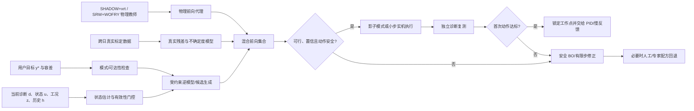

# 光束线光束调优算法综述

## 摘要

光束调优不是一个单一算法问题，而是三个时间尺度不同的任务：从失调状态恢复光束的**对准/寻优**，把用户需求转成可执行设定值的**工作点配置**，以及在既定工作点附近抑制漂移和振动的**稳定反馈**。三者的执行器、输入、评价指标与合适算法不同，不能用“GA、DE、PID 谁更快”作简单横向比较。

本文核验得到四个主要结论。第一，光束线真正调节的是狭缝、单色器、反射镜、聚焦元件和实验站运动轴等执行器；算法输入还必须包含目标光束、当前诊断、能量/热态等工况、动作历史和安全约束，输出则应是带置信度和可回退信息的动作，而不只是一个“最优电机值”。第二，SHADOW/SHADOW3 是同步辐射几何光线追迹的历史主流，OASYS/ShadowOui 极大推动了其使用，但“多数在线光束调优都基于 SHADOW”并不准确：已上线的 GA、DE、NSGA-II、贝叶斯优化、阈值反馈和 PID 多数直接以实测诊断量为目标；衍射极限和相干光学又常需 SRW、xrt、WOFRY/WISE、WPG、COMSYL 或混合传播。第三，公开、带标签、可直接用于“执行器状态→样品点光束”的真实同步辐射数据非常少；最相关的是上海光源 BL15U 的 KB 失调衍射图像，但其 Science Data Bank 页面截至核验日显示受限访问。第四，已有工作已经覆盖了“仿真数据预训练、数字孪生校准、多保真贝叶斯优化、实测响应代理、快速逆控制”等部件，却尚未在公开文献中同时证明：**整条同步辐射光束线、跨工况 sim-to-real、可校准不确定度、一次电机动作达到目标且安全成功**。

因此，推荐的研究路线不是直接训练一个无保护的端到端逆网络，而是构建“物理仿真教师 + 真实残差代理 + 不确定度 + 受约束逆模型 + 实机复测门控”的混合系统。把“一步调优”严格定义为**局部、可辨识、受限扰动下的 first-action success**，把域外样本、严重失调和低置信预测自动回退给安全贝叶斯优化或人工；高速扰动仍交给 PID/FPGA 层。

## 1. 研究范围与术语

### 1.1 三类任务必须分开

| 任务 | 初始状态 | 典型输出 | 时间尺度 | 合适方法 |
|---|---|---|---|---|
| 光束获取/粗对准 | 可能丢束或严重失调 | 恢复可测光束、进入安全可行域 | 分钟至小时 | 几何规则、专家配方、分阶段扫描、GA/DE/BO |
| 工作点寻优/重配置 | 已有光束但未满足目标 | 一组满足通量、束位、束斑、能量等要求的设定值 | 秒至几十分钟 | DE/NSGA-II、贝叶斯优化、代理模型、有限步策略 |
| 稳定与漂移补偿 | 已在正确工作点附近 | 小幅连续或离散修正 | 亚毫秒至秒/分钟 | PID、极值寻优、前馈、阈值死区、Kalman/状态估计 |

PID 快并不意味着它能从大范围内找到全局最优点；GA/DE 能寻优也不意味着适合抑制 100 Hz 振动。合理系统通常是分层控制，而不是让一个算法取代所有层。

### 1.2 统一问题表述

记：

- $\mathbf u_t$：电机、压电、狭缝等执行器的当前设定；
- $\mathbf z_t$：能量、储存环电流/轨道、热态、真空、光学模式等上下文；
- $\mathbf h_t$：动作方向、历史状态、等待时间等回差/蠕变记忆；
- $\mathbf d_t$：BPM、刀口、光电二极管、相机、波前传感器等原始诊断；
- $\mathbf y_t=g(\mathbf d_t)$：由诊断计算的通量、束位、束斑、能量、波前等指标；
- $\mathbf y^*$：用户希望得到的目标光束及容差。

前向模型是

$$
\hat{\mathbf y}_{t+1}=f(\mathbf u_t+\Delta\mathbf u_t,\mathbf z_t,\mathbf h_t),
$$

控制器/逆模型则是

$$
\Delta\mathbf u_t=\pi(\mathbf y_t,\mathbf y^*,\mathbf z_t,\mathbf h_t,\mathcal C),
$$

其中 $\mathcal C$ 是软硬限位、碰撞包络、最大单步、轴权限、束流损失门槛和恢复路径。真实控制输入不是单独一张束斑图，真实输出也不能只是一个无置信度的向量。

## 2. 光束线具体调什么：执行器、输入与输出

### 2.1 从光源到实验站的可调参数

下表是通用分类；某条线站哪些轴可写、可同时移动以及安全行程，必须由其光学和控制责任人确认。

| 区段/元件 | 常见可调参数 | 主要影响 | 在线调优注意点 |
|---|---|---|---|
| 储存环/插入件 | 电子束轨道与电流；波荡器 gap/phase | 光子能量、通量、偏振、源点位置 | 常作为外部上下文或联动设定，不应默认由线站优化器自由写入 |
| 前端与白光狭缝 | 上下左右刀口、中心、开口 | 接受度、热负荷、相干性、通量和截光 | 刀口耦合、热安全和束流损失是硬约束 |
| 准直/输运镜 CM、M1 | pitch、yaw、roll、法向/横向平移、弯曲半径、镀层条带 | 方向、准直、谐波抑制、下游入射位置 | 小角度经长杠杆放大；热漂移和机械回差明显 |
| DCM/DMM/光栅单色器 | Bragg/光栅角；第二晶体/镜 pitch、roll、translation；固定出口补偿 | 能量、带宽、通量、束位和能量稳定性 | 多轴按能量协同；摇摆曲线峰值与束位可能耦合 |
| 聚焦镜 TM、KB、PFM | pitch/yaw/roll、横/竖/法向平移、上/下游弯曲器或曲率 | 焦点位置、束斑尺寸、像散、通量密度、波前 | KB 两镜及弯曲器高度耦合，逆解往往不唯一 |
| 次级光源孔径 SSA/出口狭缝 | 四刀口、中心和 gap | 通量、相干长度、照明尺寸、束位代理 | 既是执行器也常是诊断；“通量最大”可能牺牲相干性 |
| 区板/毛细管/OSA/针孔 | 横纵/轴向位置、倾角、孔径 | 聚焦、照明锥、杂散光和视场 | 需要与样品、FZP 焦距和能量联动 |
| 样品与探测器 | 样品 $x,y,z,\theta$；探测器 $x,y,z$；曝光、增益 | 对中、焦距、放大率、采样、信噪比 | 属于实验站调准；不可把后处理配准等同于机械对准 |
| 衰减片/滤片 | 材料、厚度/片位 | 剂量、动态范围、谐波 | 主要是离散动作，需避免探测器饱和和样品损伤 |


*图 1　BL18B 实验站中的单毛细管、beam stop、针孔、样品、FZP 和探测器说明：线站“调光”还包含实验站几何、照明和成像链，不只是在上游调一块镜。图源：Tao 等，2022，[DOI: 10.3788/AOS202242.2334001](https://doi.org/10.3788/AOS202242.2334001)，本地 PDF 提取图。*

### 2.2 BL18B 的直接映射

BL18B 的公开光学链为弯铁源 → 柱面准直镜 CM → Si(111) 双晶单色器 DCM → 超环面镜 TM → 39 m 次级光源四刀狭缝 SSA → 单毛细管/针孔 → 样品/FZP/探测器，覆盖 5–14 keV。公开验收在 8 keV 给出能量分辨率 $(1.83\pm0.01)\times10^{-4}$、按 300 mA 归一化的样品通量约 $1.64\times10^{10}\ \mathrm{photon\,s^{-1}}$ 和约 19.6 nm 的二维成像指标 [R1–R3]。

对 BL18B，第一阶段可把候选动作限定为 SSA 刀口、DCM 二晶的小范围姿态/位置、TM 小范围姿态/曲率，以及实验站已被证明可安全联动的 FZP/样品/探测器轴。这里的“候选”不等于“已授权”：每根轴仍需逐项完成符号、灵敏度、回差、限位、碰撞、失束风险和恢复性测试。

### 2.3 算法的输入、输出应如何定义

| 类别 | 应包含的字段 | 典型来源 |
|---|---|---|
| 目标输入 | 能量/带宽、目标通量或下限、束心、水平/垂直 FWHM、均匀性、相干性、剂量上限、模式 | 用户意图卡、实验配方 |
| 当前观测 | 各级 BPM/刀口/电离室/相机/波前信号，饱和和有效性标志 | EPICS/Tango/采集系统 |
| 设备状态 | 实际编码器值与命令值、运动方向、following error、限位、到位时间 | 运动控制器 |
| 工况上下文 | 光子能量、机器电流、轨道、插入件、镜温、冷却、真空、时间、班次/重启状态 | 控制与环境日志 |
| 历史状态 | 前若干动作、等待时间、上次标定、回差方向、蠕变状态 | 时序数据集 |
| 约束 | 软硬限位、最大单步/速度、互斥轴、允许总运动、最低可见通量、紧急回退配方 | 安全白名单 |
| 主输出 | $\Delta\mathbf u$ 或候选 $\mathbf u^*$、动作顺序和等待时间 | 优化器/策略 |
| 必需辅助输出 | 预测 $\hat{\mathbf y}$、不确定度、可行概率、域外分数、停止/拒答/回退原因 | 前向代理和安全层 |

## 3. 评估指标与计算方式

### 3.1 原始诊断到光束指标

设探测器暗场扣除后的像素或通道信号为 $I_i$。

**积分强度与标定光子通量。** 相机计数和电流常只是代理量。若探测器响应度为 $R(E)$（A/W）、暗电流为 $I_{\rm dark}$、路径透过率为 $T(E)$，则近似光子通量为

$$
\Phi(E)=\frac{I-I_{\rm dark}}{R(E)\,E_\gamma\,T(E)},\qquad
E_\gamma=E_{\rm eV}q_e.
$$

必须记录增益、曝光、响应度和能量；否则只能称“积分计数/相对通量”，不能称绝对 photon/s。

**束心和二阶矩。** 对二维图像：

$$
x_c=\frac{\sum_i I_i x_i}{\sum_i I_i},\quad
y_c=\frac{\sum_i I_i y_i}{\sum_i I_i},
$$

$$
\sigma_x^2=\frac{\sum_i I_i(x_i-x_c)^2}{\sum_i I_i},\quad
\sigma_y^2=\frac{\sum_i I_i(y_i-y_c)^2}{\sum_i I_i}.
$$

若轮廓近似高斯，$\mathrm{FWHM}=2\sqrt{2\ln2}\,\sigma$。对截断、空心、双峰或强散斑束，应报告投影半高宽、包围能量直径或拟合模型，不能机械套用高斯换算。

**归一化刀口/BPM 差值。** BL08U1A 的左右刀口位置代理为

$$
S_{RL}=\frac{S_R-S_L}{S_R+S_L}.
$$

分母减弱总通量变化，但在总信号很低或通道饱和时会失真，因此需要有效信号门槛。

**透过率、均匀性和通量密度。** 可分别用

$$
\eta=\frac{\Phi_{\rm out}}{\Phi_{\rm in}},\qquad
CV=\frac{\sigma_I}{\bar I},\qquad
D_\Phi=\frac{\Phi}{A_{\rm eff}}.
$$

均匀性应在预注册 ROI 内计算并同时报告坏点、遮挡和饱和比例。

**能量与分辨率。** 晶体满足 Bragg 定律

$$
E=\frac{hc}{2d\sin\theta},
$$

小角度误差下 $|\Delta E/E|\approx|\cot\theta\,\Delta\theta|$；实机验收仍应由摇摆曲线、吸收边或标准样给出，不应只用编码器推算。

**波前。** 波前 RMS $\sigma_W$ 可直接作为目标；小像差近似下 Strehl 比为

$$
S\approx\exp\left[-\left(\frac{2\pi\sigma_W}{\lambda}\right)^2\right].
$$

### 3.2 稳定性、数据质量和算法指标

| 层级 | 建议指标 | 计算/说明 |
|---|---|---|
| 光束均值 | 通量、束心、FWHM、能量、波前 RMS | 同时报告绝对值与相对名义值 |
| 短期稳定 | $\mathrm{RMS}(y_t-\bar y)$、峰峰值、PSD | 指定采样率、带宽和时间窗；不可混淆 1 Hz 漂移与 100 Hz 振动 |
| 长期稳定 | Allan deviation、跨 top-up/能扫漂移 | 对不同平均时间 $\tau$ 报告，区分白噪声和漂移 |
| 光束可用率 | 在容差内时间/总有效时间 | 掉束、快门关闭和无效诊断需单列 |
| 谱学质量 | SNR/CNR、边位重复性、归一化残差 | 明确 SNR 是 $20\log_{10}(A_{\rm signal}/A_{\rm noise})$ 还是功率定义 |
| nano-CT 用户指标 | 平/暗场稳定、投影 SNR/CNR、饱和率、环伪影、旋转中心残差、FSC/MTF 分辨率 | 最终 KPI 应进入验收，避免只优化上游代理通量 |
| 寻优效率 | 成功率、到达目标时间、真实测量次数、总行程、曝光/剂量 | 运动和稳定等待通常比模型推理更耗时 |
| 安全性 | 越界动作率、失束率、联锁触发、人工接管、恢复成功率 | 目标应是零危险动作，不应用平均误差掩盖尾部风险 |
| 可重复性 | 跨日、跨能量、跨热态重复成功率与方差 | 必须按时间/工况分组测试，不能随机拆分相邻扫描点 |

时间稳定可用 Allan deviation 表示：

$$
\sigma_A(\tau)=\sqrt{\frac{1}{2(M-1)}\sum_{k=1}^{M-1}(\bar y_{k+1}(\tau)-\bar y_k(\tau))^2}.
$$

### 3.3 单目标与多目标评价

若必须标量化，可定义带容差归一化的代价：

$$
J(\mathbf u)=\sum_j w_j\,\rho\!\left(\frac{y_j(\mathbf u)-y_j^*}{\tau_j}\right)
+\lambda_m\left\|\frac{\Delta\mathbf u}{\mathbf s}\right\|_2^2
+\lambda_c C(\mathbf u),
$$

其中 $\tau_j$ 是物理容差，$\rho$ 是非负稳健惩罚（可用 Huber 损失抑制异常诊断），$\mathbf s$ 是各轴安全步长，$C$ 是失束、饱和、超限等惩罚。若通量、束斑、相干性和剂量冲突明显，更合理的是保留 Pareto 前沿并按实验模式选择，而不是隐藏在任意权重中。

## 4. SHADOW 是否主导光束调优

### 4.1 结论：设计/追迹主流，不等于在线调优主流

SHADOW3 的原始论文称其为同步辐射光线追迹的“de facto standard”，并指出几乎所有当时的同步辐射光束线都以某种方式受益于 SHADOW [R4]。ShadowOui 论文又把 SHADOW3 选为 OASYS 的主追迹引擎，理由是它是社区使用最多的光线追迹代码 [R5]。所以，若命题是“同步辐射光学设计和几何追迹长期大量使用 SHADOW”，答案是**准确**。

但若命题是“多数真实在线调优以 SHADOW 为闭环核心”，答案是**不准确或至少没有足够证据**：

1. XAFCA、SSRF BL14B1/BL10U2/BL13U 的进化寻优直接以实机通量、束位等为适应度，不要求每次先跑 SHADOW [R13–R17]。
2. SSRF BL08U1A 的在线反馈读取刀口信号后按阈值移动 M2；BL13U 的 BiBEST 直接在 FPGA 上运行 PID [R18–R19]。
3. Blop 和 AutoFocus 确实使用 SHADOW/OASYS 数字孪生开发或预训练策略，但实机阶段仍由实时诊断闭环修正，而不是相信未校准仿真给出的唯一答案 [R20–R22]。
4. 对衍射极限、部分相干、波前和面形误差问题，纯几何光线追迹不够，原始研究明确转向 SRW、xrt、COMSYL 或混合波动传播 [R6–R10]。

目前没有统一、可复核的全球软件使用普查，因此本文不报告“占比多少”；“广泛使用”是基于原始软件论文、多设施应用和维护生态的定性等级。

### 4.2 主要仿真器和使用范围

| 工具 | 核心物理/角色 | 优势 | 局限 | 使用判断 |
|---|---|---|---|---|
| SHADOW3/Shadow4 | 蒙特卡洛几何/相位光线追迹，晶体、镜、光栅、失调 | 同步辐射专用、成熟、脚本化、适合大接受度与灵敏度扫描 | 衍射和部分相干需额外方法；蒙特卡洛噪声；高保真批量扫描仍慢 | **广泛**；设计与几何数字孪生历史主流 [R4] |
| OASYS/ShadowOui | 工作流/GUI，不是单一物理求解器；封装 SHADOW、WOFRY、SRW 等 | 易组装光路、可导出脚本、可混合工具 | 结果精度取决于底层引擎和参数；不能把 OASYS 等同 SHADOW | **广泛生态** [R5] |
| SRW | 从电子轨迹到全/部分相干波前传播 | 源—光路一体、适合低发射度和相干成像 | 多电子/多模态传播计算昂贵，建模门槛较高 | **广泛**的波动光学工具；多光源设施使用 [R6] |
| xrt | Python 光线追迹与波传播、GPU 支持 | 代码原生、交互建模，适合优化器直接调用 | 社区规模小于 SHADOW/OASYS；模型仍需实机校准 | **成熟、多设施使用** [R7] |
| Sirepo | 浏览器/云端仿真编排，支持 SRW、SHADOW3 等 | 远程、可与 Bluesky/数字孪生接口结合 | 本身不是新的传播物理；部署和版本控制仍关键 | **成熟平台**，Blop 数字孪生采用 [R8,R20] |
| WOFRY/WISE/WISER | 1D/2D 波动传播，尤其掠入射镜 | 面形、衍射、相干效应更直接 | 常需降维或分步传播；全线计算成本高 | **专业化使用** |
| WPG | 基于 SRW 的波前传播工作流，常见于 FEL | 时间/空间相干传播、端到端波前 | 主要面向波动/FEL场景，不是一般在线运动控制器 | **专业化使用** [R9] |
| COMSYL | 相干模分解和部分相干传播 | 适合衍射极限储存环 | 模态计算昂贵，不适合每个控制周期直接运行 | **专业化使用** [R10] |
| HYBRID | SHADOW 光线追迹加波前衍射修正 | 在效率与衍射效应间折中 | 近似与适用条件需核验 | **专业化使用** [R11] |
| McXtrace | Monte Carlo X 射线仪器模拟 | 组件化、适合散射/仪器链 | 在线光束线调优公开案例较少 | **小众/专业化** [R12] |
| Zemax | 商业通用光学设计 | 工业光学界成熟、可生成受控模拟系统 | 非同步辐射专用；2026 RL 工作仅验证小型模拟激光光路 | **论文特定**，不能据此证明同步辐射实机可迁移 [R29] |


*图 2　对 DCM 第二晶体施加 1 Hz、1 µrad 俯仰扰动后，SHADOW 静态追迹序列给出的强度、束位和束斑响应。强度出现 2 Hz 分量，说明非线性可改变输出频谱；实验只支持定性趋势，幅值有明显 sim-to-real 差异。图源：Houghton 等，2021，[DOI: 10.1107/S1600577521007013](https://doi.org/10.1107/S1600577521007013) [R23]。*

该研究每个点追迹 $10^6$ 条光线约需 60 s；模型能把六自由度扰动映射到样品点强度、束位和 FWHM，并用于灵敏度排序，但没有求解结构动力学、执行器带宽或状态记忆。它非常适合筛查关键元件，不足以不经校准地承担快速实机闭环 [R23]。

### 4.3 对 BL18B 的仿真组合建议

- **第一层：SHADOW/OASYS 或 xrt。** 做全线几何接受度、失调、遮挡、晶体/镜姿态和大规模参数扫描。
- **第二层：SRW/WOFRY/WISE。** 对 FZP、针孔、相干性、面形误差、焦区传播和 nano-CT 照明做高保真校核。
- **第三层：热—结构或实测残差。** SHADOW 不会自动产生热漂移、支撑结构振动、回差和压电蠕变；用有限元或实测状态模型补齐。
- **第四层：快速代理。** 代理只学习已经标定的映射及残差，并输出不确定度；高保真仿真留作教师、离线验证和域外复核。

## 5. 开放数据集：有多少、包含什么、能否直接用

### 5.1 判定标准

真正的光束调优数据至少要把同一时间基准下的 `(目标、工况、执行器命令、实际位置、诊断原始量、计算指标、动作后结果、有效性/安全标志)` 关联起来。只有 X 射线实验图像、CT 投影、镜面轮廓或仿真脚本，不等于可直接训练控制器的调优数据集。

### 5.2 可获得资源清单

| 资源 | 出处与访问状态（核验于 2026-09-04） | 内容 | 可用于什么 | 关键缺口 |
|---|---|---|---|---|
| BL15U KB 失调衍射图像 | Science Data Bank，[DOI: 10.57760/sciencedb.j00186.00138](https://doi.org/10.57760/sciencedb.j00186.00138)；论文称开放，但当前页面 JSON-LD 为 `RESTRICTED`，匿名 API 返回“无访问权限” | 10 keV；两种束流状态；改变 KB 两镜 pitch/curvature；有/无焦点附近砂纸散射体；2048×2048、1.625 µm 像素、探测器距焦点 2075 mm。论文报告 1762 幅真实图及 8000 个仿真样本 [R24] | 真实图像→失调参数估计、sim-to-real、可辨识性 | 当前并非无摩擦下载；数据划分、重复、时间顺序和独立测试说明不足 |
| `alignment_beamlines_rl` | [GitHub 仓库](https://github.com/sygogo/alignment_beamlines_rl)，Apache-2.0 [R29] | 仓库 `system_data` 含两套 Zemax 数据：只读结构检查为 3576×(12→4) 和 4536×(30→4) 样本；4 个输出是椭圆束心 $x,y$ 与两半轴。系统分别为两面和五面可调镜的小型模拟激光光路 | 前向 MLP、目标条件 RL、连续动作算法基线 | 不是同步辐射/X 射线实机；模型权重目录当前为空，README 很少；论文策略仍是多步迭代 |
| DABAM | [ESRF 数据入口](https://ftp.esrf.fr/pub/scisoft/dabam/readme.html)、[开放论文](https://pmc.ncbi.nlm.nih.gov/articles/PMC4888647/) [R25] | 多实验室真实 X 射线镜高度/斜率一维轮廓及元数据、统计量和 PSD | 给 SHADOW/波动传播注入真实面形误差，做域随机化 | 不是电机—光束配对数据，不含在线工况和控制动作 |
| CRL 面形误差深度学习资料 | [论文代码与 OASYS 工作区](https://github.com/oasys-esrf-kit/Paper_JSR_zt5005)，[论文](https://pmc.ncbi.nlm.nih.gov/articles/PMC11371063/) [R26] | WOFRY 1D 多平面强度、合成 Zernike/Gram–Schmidt 面形系数、HDF5 生成流程、CNN | 仿真器批量生成、逆诊断、面形误差代理的复现范例 | 合成 CRL 逆问题，不是实机整线调优；论文的 5000/10000 样本需按脚本再生成 |
| Blop/Sirepo/xrt 示例 | [Blop xrt KB 教程](https://blueskyproject.io/blop/main/tutorials/xrt-kb-mirrors.html) [R7,R20] | 可运行的模拟设备、两 KB 曲率自由度、图像、FWHM 和强度约束 | 建立标准化优化环境和自动生成基准 | 更像环境/生成器，不是固定、版本化、跨设施真实数据集 |

**结论：**有开放资源，但没有一个已经成为社区标准、覆盖真实同步辐射整线、多能量、多日期、动作历史和安全事件的调优 benchmark。BL15U 是最接近的真实有标签样本；DABAM 和 CRL 仓库是高价值辅助数据；Zemax/RL 仓库适合算法原型，不应被写成真实同步辐射验证。

### 5.3 BL15U 数据的意义和访问边界


*图 3　BL15U 用垂直/水平 KB 镜调节俯仰和曲率，在焦点附近放置散射体，再在下游采集图像。图源：Jiang 等，2023，[DOI: 10.1007/s41365-023-01282-4](https://doi.org/10.1007/s41365-023-01282-4) [R24]。*

BL15U 工作把仿真的六个目标定义为 VFM/HFM pitch、VFM/HFM curvature、astigmatism 和 defocus。真实实验中像散由机械结构固定、直束图又难辨识离焦，所以实机有效输出维数更少。论文用仿真预训练和真实图微调，最佳验证归一化 RMSE 约 4%，一次网络推理约 0.13 s；但没有把预测发送给电机并复测闭环。理论焦斑约 $1.1\times1.6\ \mu$m，实测约 $4\times4\ \mu$m，是上游退化、噪声、振动和未建模误差造成域差异的直接证据 [R24]。


*图 4　不同 HFM pitch 与离焦状态改变刀口扫描轮廓；它也说明标签“零点”来自最小焦斑的实验设定，而不是独立绝对波前真值。图源同图 3 [R24]。*

Science Data Bank 元数据仍可公开读取，且清楚描述两套 10 keV 衍射图像和采集几何；但当前匿名文件访问受限。因此应把状态写成“**有 DOI、有公开元数据、论文声明开放，但当前下载需权限/申请**”，而不是简单写成“完全开放”或“没有数据”。

### 5.4 建议自建数据集最小模式

每条记录建议至少包含：

```text
run_id, timestamp, beamline_mode, photon_energy, ring_current, topup_state
target_metrics[], tolerance[]
commanded_positions[], encoder_positions[], move_direction[], settling_time[]
previous_positions[], previous_metrics[]
raw_diagnostics_uri[], gain[], exposure[], validity_flags[]
derived_metrics[], metric_uncertainty[]
interlock_state, limit_state, beam_lost, operator_override
simulator_version, simulator_parameters, simulated_metrics[]
calibration_id, recipe_id, software_commit
```

训练/验证/测试必须按“日期、能量区段、热态、shutdown 前后、光学模式”成组拆分。随机打散相邻网格点会让同一次扫描的强相关样本同时进入训练和测试，严重高估 sim-to-real 和跨日泛化。

## 6. 已有算法与实机证据

### 6.1 方法谱系

| 方法 | 优点 | 代价/风险 | 最适合的任务 |
|---|---|---|---|
| 专家配方/规则/分步扫描 | 可解释、容易设安全边界、冷启动可靠 | 依赖维护；难覆盖耦合与漂移 | 粗对准、模式切换、回退基线 |
| 阈值步进/爬山/极值寻优 | 简单、真实测量闭环、局部可靠 | 需要单调或有符号误差；可能振荡/慢 | 单镜、单峰通量、慢漂移 |
| PID/FPGA | 高频、确定性、成熟 | 只能围绕设定点；需局部线性和稳定裕度 | 束位/能量连续稳定 |
| GA | 对非光滑、多峰和离散变量友好 | 样本多、实机运动成本高 | 大范围全局寻优、并行评估 |
| DE | 连续空间实现简单、通常比传统 GA 高效 | 仍需种群和多代实测；安全可行域处理重要 | 多轴连续参数工作点寻优 |
| NSGA-II | 保留通量—束位—束斑的 Pareto 权衡 | 评估量更大；最后仍需选一个解 | 多目标配置 |
| 贝叶斯优化 | 样本效率高、能建模不确定度和约束 | 高维、非平稳、回差与无效诊断会破坏假设 | 实测昂贵的中维在线寻优 |
| 前向代理＋数值逆优化 | 推理快、可复用、可先验安全筛选 | 训练域外不可靠；逆问题可能多解 | 配方推荐、少步重配置 |
| 直接逆网络/串联网络 | 单次给出候选动作 | 容易平均多个逆解；需前向验证和不确定度 | 局部、可辨识的快速动作 |
| 强化学习 | 能利用当前—目标差和多步策略 | 训练/探索风险大、奖励和 sim-to-real 敏感 | 仿真充分、动作顺序重要的有限步任务 |

### 6.2 代表性在线工作

| 年份/设施 | 方法、输入与输出 | 结果与证据边界 |
|---|---|---|
| 2015 SSLS XAFCA | LabVIEW GA；多光学元件电机 → 样品通量 | 即使初始通量仅最大值 4%，17 代内完成优化；证明全局寻优可上线，但未解决多目标与高频稳定 [R13] |
| 2017 SSLS/BSRF | 开源 AI-BL1.0，GA、DE、OMEA；实机反馈 | 在 XAFCA 与 BSRF 1W1B 验证，记录电机—适应度日志；是可移植框架证据 [R14] |
| 2020 SSRF BL14B1 | EPICS/CaLab＋DE；调 DCM/聚焦相关设备，以样品点通量为目标 | 约 30 min 收敛，论文称效率比人工高一个数量级；仍是单目标和多次实测 [R15] |
| 2021 SSRF BL10U2 | NSGA-II；次级光源束位和通量双目标 | 30 min 内给出 Pareto 解；说明“最大通量”不能替代位置约束 [R16] |
| 2023 SSRF BL08U1A | 左右刀口归一化差＋死区＋M2 固定 0.2 µm 步长，每 3 s 更新 | 能扫中维持 $S_{RL}\in[-0.05,0.05]$；XAS 示例 SNR 由 55.390 到 57.351 dB。它**不是 PID**，是局部阈值离散反馈 [R18] |
| 2024 SSRF BL13U | 专家系统暖启动＋DE/NSGA-II；电机、通量和束位 | 文中四轴单目标示例约 2 min，并报告相对传统流程显著加速；核心收益来自缩小初始搜索域，仍是迭代实测 [R17] |
| 2025 SSRF BL13U | BiBEST，5 kHz XBPM 采样，FPGA PID 将信号分频后驱动 PFM、DCM/DMM pitch/roll | 约 1 Hz 慢环补漂移、100 Hz 以上快环抑振；这是 PID 稳定层，不是全局寻优器 [R19] |
| 2021 Diamond I14 | 强度极值寻优与束位 PID 交织，第二晶体和 M2 联动 | 已连续运行两年；大于 2 keV 能量跳变可需约 120 s 稳定，显示运动/热稳定主导总时间 [R27] |
| 2024 NSLS-II/ALS/ATF | Blop 多目标贝叶斯优化；直接接真实电机/诊断，也用 Sirepo–Bluesky/SHADOW 数字孪生 | ALS 5.3.1 四自由度在 5 min 内将功率密度优化，强度超人工两倍；仿真 8D 从 32 个准随机点开始，4D KB 从 16 点开始，均是在线迭代而非一步 [R20] |


*图 5　BL08U1A 中 M2 和 Slit 2 的位置关系。在线反馈利用 Slit 2 刀口信号修正 M2，说明一个有效闭环可以只覆盖整线中的一个局部耦合。图源：Zhang 等，2023，[DOI: 10.3390/app13095456](https://doi.org/10.3390/app13095456) [R18]。*

### 6.3 如何理解 PID

连续 PID 可写为

$$
u(t)=K_Pe(t)+K_I\int_0^t e(\tau)\,d\tau+K_D\frac{de(t)}{dt}.
$$

它要求能定义有符号误差 $e(t)=y^*-y(t)$，并且执行器在工作点附近对误差具有稳定、足够快的响应。它适合把束位锁在 BPM 中心、把晶体保持在局部摇摆曲线峰附近，却不会自动知道“哪组 KB 曲率和 SSA 开口同时实现目标相干性与束斑”。工程上应是：配方/代理/BO 找到设定点，PID 负责抗扰动，监督层处理模式切换、掉束和域外状态。

## 7. “仿真器端到端代理＋一步调优”是否已有相关工作

### 7.1 最接近的公开工作

| 工作 | 是否学仿真/数字孪生 | 是否有真实场景 | 是否直接输出动作 | 是否一步 | 与设想的距离 |
|---|---:|---:|---:|---:|---|
| 2022 神经网络辅助束线设计 [R28] | SHADOW3＋SRW/OASYS 生成训练集 | 否，回代 OASYS 验证 | 预测聚焦倍率 $M$ 和二次光源位置 $P$ | 单次预测 | 最接近“需求→参数”，但仅仿真设计助手，>97% 是仿真内部精度 |
| 2023 BL15U KB 失调估计 [R24] | 自建波动传播仿真预训练 | 是，1762 图微调 | 输出失调参数估计，未驱动电机 | 单次诊断，不是一步控制 | 直接展示 sim-to-real 差距和快速逆估计 |
| 2023 APS 自适应双压电镜 [R31] | 否，学习真实响应 | 是，28-ID IDEA | 神经网络给电压并保持目标波前 | 数秒响应，局部快速 | 真实闭环很强，但对象是一块自适应镜，不是整线仿真代理 |
| 2023 AutoFocus [R21] | 波前实测校准 OASYS 数字孪生 | 是，真实聚焦镜系统 | MOBO 提议电机动作 | 10 个 Sobol 初始化＋多次 BO | 与数字孪生调束最接近，但明确是迭代多目标优化 |
| 2024 Blop [R20] | Sirepo–Bluesky/SHADOW twin 用于基准 | 多线站实机 | BO 提议动作 | 迭代 | 通用、实机、样本高效，但不学习一次逆映射 |
| 2023 实测自适应镜动力学 [R30] | 学习真实离散非线性动力学 | 原型镜、离线 Fizeau 计量 | 开环形状控制 | 可少反馈/开环 | 证明历史、蠕变、回差可由前向模型吸收，范围仍是一块镜 |
| 2025 串联神经网络双压电镜 [R32] | 基于任务特定真实数据 | 自适应镜 | 逆网络预测电压序列 | “无反馈”但仍为命令序列 | 很接近快速逆控制；数据未公开，非整线、非单一动作 |
| 2025 AutoFocus-U [R22] | Shadow4/OASYS＋真实优化的多保真迁移 | APS 初始部署 | 多目标 BO | 持续迭代 | 已把 sim＋real 融合推进到实机，但仍不是一步 |
| 2026 action-attentive RL [R29] | Zemax 数据训练 MLP 环境 | 否，仅两套模拟激光系统 | 当前＋目标→连续动作 | 平均少步，代码最多 10 步 | 概念接近端到端策略，但非同步辐射实机且论文明确顺序迭代 |

截至 2026-09-04，在本文核验的公开论文与仓库中，**未发现一项工作同时满足以下四项**：

1. 覆盖源到样品的真实同步辐射整线，而非单镜或小型激光光路；
2. 把物理仿真压缩成可实时推理的代理；
3. 在跨日、跨能量、跨热态数据上量化并校准 sim-to-real 残差与不确定度；
4. 以一次实际电机动作的成功率、安全率和用户侧数据质量作为主要终点。

这说明你的方向已有充分先例支撑，但“安全的一步实机成功率”仍是明确研究空白。表述时应使用“在本检索范围未发现”，而不是绝对宣称全世界没有。

### 7.2 为什么直接逆网络很难一步成功

整线映射常是多对一：多组镜角、狭缝和曲率可产生相近的束斑；相反，同一命令又会因回差、热态、源漂移和蠕变产生不同输出。用 MSE 直接训练 $\mathbf y^*\rightarrow\mathbf u$，模型可能对多个有效逆解取平均，得到一个实际无效的中间设定。还有三个物理限制：

- **不可辨识：** 单张强度图无法区分某些像散、离焦、源点和面形组合；BL15U 已观察到这一点。
- **不可达：** 用户目标可能超出当前能量/孔径/光学模式的可行域。
- **状态记忆：** 弯曲器、压电和机械回差使 $y_{t+1}$ 依赖历史，而不只依赖 $u_{t+1}$。

因此，“一步”必须从全局承诺缩小为：在指定模式、已见到光束、扰动有界、诊断有效、模型置信且候选动作通过前向验证时，一次动作使所有关键指标进入容差。

### 7.3 推荐的混合架构



推荐把真实系统写成物理模型加残差：

$$
\mathbf y_{\rm real}=f_{\rm phys}(\mathbf u,\mathbf z)
+r_\phi(\mathbf u,\mathbf z,\mathbf h)+\boldsymbol\epsilon,
$$

并让模型输出分布 $p(\mathbf y\mid\mathbf u,\mathbf z,\mathbf h)$，而非单点。逆模型生成若干候选 $\{\mathbf u^{(k)}\}$，再由冻结的前向集合计算目标误差、可行概率和最坏情况风险：

$$
\mathbf u^*=\arg\min_{\mathbf u\in\mathcal U_{\rm safe}}
\mathbb E[J(\mathbf u)]+\beta\sqrt{\mathrm{Var}[J(\mathbf u)]}
$$

subject to

$$
P(\text{valid beam}\mid\mathbf u)\ge1-\alpha,
\qquad |\Delta u_i|\le s_i.
$$

这比单独训练逆网络更稳健：物理层提供可解释外推，残差层学习真实差异，集合方差用于拒答，受约束逆层才负责速度。

### 7.4 sim-to-real 与一步调优的验收设计

**数据拆分。** 至少设置：同日插值测试、留一能量段、留一天、留一热态/光学模式、shutdown 前后测试。最后一组才接近真实部署风险。

**前向代理基线。** 比较：

1. 未校准物理仿真；
2. 仅真实数据网络；
3. 仿真预训练＋真实微调；
4. 物理输出＋真实残差；
5. 上述模型的深度集合/概率模型。

逐输出报告 MAE、RMSE、NRMSE、偏差、$R^2$、负对数似然和预测区间覆盖率 PICP：

$$
\mathrm{NRMSE}_j=\frac{\sqrt{N^{-1}\sum_i(\hat y_{ij}-y_{ij})^2}}{y_{j,\max}-y_{j,\min}},
$$

$$
\mathrm{PICP}_{1-\alpha}=\frac1N\sum_i
\mathbf 1[y_i\in L_i^{1-\alpha},U_i^{1-\alpha}].
$$

sim-to-real 还应画逐指标残差随能量、热态和执行器位置的图；MMD/Wasserstein 或域分类器 AUC 可作补充，但不能替代物理量误差和置信区间校准。

**控制基线。** 与人工、专家配方、DE/NSGA-II、安全 BO、PID/阈值局部反馈、直接逆网络和混合残差模型比较。相同起点、目标和真实动作预算下报告：

- 首次动作成功率（FASR）；
- 首次动作后的归一化目标误差；
- 达标所需后续动作数和墙钟时间；
- 总运动距离、最大单轴步长、曝光/剂量；
- 失束、越界、联锁、人工接管和恢复率；
- 达标后 10 min/1 h 的稳定性以及 CT/谱学用户指标。

严格定义：

$$
\mathrm{FASR}=\frac{1}{N}\sum_{i=1}^{N}
\mathbf 1\!\left[
|y_{ij}^{(1)}-y_{ij}^*|\le\tau_j\ \forall j,
\ \mathcal C_i=0
\right].
$$

一次推理 0.13 s、一次给出电机向量、或者仿真中一步到达都不等于 FASR；动作、稳定等待、复测和安全条件必须全部计入。

## 8. 面向 SSRF-nanoCT/BL18B 的建议路线

### 阶段 0：定义问题，不先选网络

1. 与线站人员冻结 1–2 个高价值模式，例如 8 keV 高分辨 TXM 与一个快速 CT 模式。
2. 将目标限定为通量下限、SSA/样品束位、照明/FWHM、平场均匀性、能量分辨率和剂量；明确哪些是硬约束。
3. 逐轴测小扰动响应矩阵 $S_{ji}=\partial y_j/\partial u_i$，筛掉不可观测、危险或贡献很小的轴。
4. 建立专家配方和一键回退，先实现只读影子模式。

### 阶段 1：先做可审计前向代理

- 用现有 XOP/SHADOW 模型扩展几何失调；对 FZP/相干焦区用 SRW/WOFRY 校核。
- 把 DABAM/实测面形、源点、能量、热态和噪声做域随机化。
- 在实机用安全设计采样收集小范围多日数据，优先学习 $r_\phi$ 残差而不是重新学习全部物理。
- 先要求“预测准且知道何时不准”，再训练逆控制。

### 阶段 2：从建议到一步动作

- 冻结前向集合，在其上训练 tandem/conditional inverse 或生成式候选器。
- 候选动作必须通过最坏情况前向检查、硬限位和可行概率门槛。
- 依次运行：离线回放 → 仿真闭环 → 影子建议 → 操作员确认小步 → 自动小步 → 局部一步尝试。
- 域外、低通量、诊断无效、跨模式或严重失调自动回退安全 BO/专家流程。

### 阶段 3：分层上线

| 层 | 任务 | 建议控制器 |
|---|---|---|
| L0 硬安全 | 限位、碰撞、真空、热负荷、快门、掉束 | 独立联锁，不受 ML 覆盖 |
| L1 快稳定 | 束位/能量高频扰动 | FPGA/PID、前馈 |
| L2 慢稳定 | 热漂移、单镜工作点 | 阈值反馈、极值寻优、状态估计 |
| L3 工作点重配置 | 用户目标→安全候选设定 | 混合代理＋受约束逆模型；低置信用 BO |
| L4 粗恢复 | 丢束、shutdown 后或大范围失调 | 专家配方、分阶段扫描、人工确认 |

最有研究价值的首篇成果可以不是“全线一次成功”，而是一个严格、可复核的递进结论：在 BL18B 固定能量和固定模式、白名单 3–5 个自由度、预注册扰动范围内，混合残差代理相对纯 SHADOW 显著降低跨日误差，并在不增加安全事件的前提下把首次动作成功率提高到某一可验收水平。

## 9. 对四个问题的直接回答

1. **具体调什么，输入输出和指标是什么？** 调节的是从狭缝、CM/DCM/DMM、TM/KB/PFM 到 FZP/样品/探测器的可写执行器；输入应包含目标、当前诊断、设备/工况、历史和安全约束；输出是动作/设定值以及预测、不确定度、可行性与回退信息。评价必须同时覆盖通量、束位、束斑、能量/带宽、波前/相干性、稳定性、安全、动作成本和最终 CT/谱学质量，计算公式见第 3 节。
2. **大部分是否基于 SHADOW？** 对历史光学设计和几何追迹可说 SHADOW 广泛且曾是事实标准；对真实在线调优不能这样概括。大量上线方法直接以实测反馈运行，衍射极限场景还普遍需要波动/部分相干工具。其他成熟工具包括 SRW、xrt、Sirepo、WOFRY/WISE、WPG、COMSYL 和 HYBRID，使用范围见第 4 节。
3. **是否有开源数据集？** 有少量相关资源，但没有公认的整线调优标准集。BL15U 是最接近的真实有标签数据，有 DOI 和公开元数据，但当前匿名访问受限；Zemax/RL 仓库开放模拟数据，DABAM 开放真实镜面计量，CRL 仓库开放合成数据生成流程，均不能直接替代真实整线日志。
4. **端到端仿真代理、评估 sim-real 差异并一步调优是否已有？** 各组成部分已有：仿真→参数单次预测、仿真预训练＋真实微调、校准数字孪生＋多目标 BO、实测响应前向模型和无反馈逆控制。但在本文检索范围内，还没有同时完成真实整线、跨工况 sim-real 校准和安全一次动作成功率验证的公开工作；这是可做的研究空白，但应以局部 FASR 而非无限制“一步全局调优”定义。

## 10. 证据边界与检索说明

- 文献与资源核验截止 2026-09-04，优先使用论文原文、出版方页面、机构页面和官方代码仓库。
- 本文是面向研发决策的叙述性技术综述，不是穷尽数据库、双人筛选的 PRISMA 系统综述；“未发现”仅限所检索证据。
- 不把仿真内部精度当作实机精度，不把单次网络前向时间当作端到端调束时间，不把代理通量改善自动等同于 nano-CT 数据质量改善。
- BL18B 候选轴来自公开光路和已有本地调研，不代表当前控制权限或实机安全白名单。
- 论文图用于研究说明并标明原始出处；本地文件为既有 PDF 的提取图，不是本文新生成的实验结果。

## 参考文献与资源

- **[R1]** Tao, F. et al. *上海同步辐射光源纳米三维成像线站设计、研发及调试* (2022). [DOI](https://doi.org/10.3788/AOS202242.2334001).
- **[R2]** Tao, F. et al. *Full-field hard X-ray nano-tomography at SSRF* (2023). [开放全文](https://pmc.ncbi.nlm.nih.gov/articles/PMC10325026/), [DOI](https://doi.org/10.1107/S1600577523003168).
- **[R3]** Wang, S. et al. *The 3D nanoimaging beamline at SSRF* (2023). [DOI](https://doi.org/10.1007/s41365-023-01347-4).
- **[R4]** Sánchez del Río, M. et al. *SHADOW3: a new version of the synchrotron X-ray optics modelling package* (2011). [开放全文](https://pmc.ncbi.nlm.nih.gov/articles/PMC3267628/), [DOI](https://doi.org/10.1107/S0909049511026306).
- **[R5]** Rebuffi, L.; Sánchez del Río, M. *ShadowOui: a new visual environment for X-ray optics and synchrotron beamline simulations* (2016). [开放全文](https://pmc.ncbi.nlm.nih.gov/articles/PMC5298219/), [DOI](https://doi.org/10.1107/S1600577516013837).
- **[R6]** Chubar, O. et al. *Sirepo: an open-source cloud-based software interface for X-ray source and optics simulations* (2018). [开放全文](https://pmc.ncbi.nlm.nih.gov/articles/PMC6225744/), [SRW 代码](https://github.com/ochubar/SRW).
- **[R7]** Klementiev, K.; Chernikov, R. *Powerful scriptable ray tracing package xrt* (2014). [xrt 官方仓库](https://github.com/kklmn/xrt), [DOI](https://doi.org/10.1117/12.2061400).
- **[R8]** Sirepo 官方平台与 Sirepo–Bluesky 数字孪生接口，见 [Sirepo 论文](https://pmc.ncbi.nlm.nih.gov/articles/PMC6225744/) 与 [Blop 论文](https://doi.org/10.1107/S1600577524008993).
- **[R9]** Samoylova, L. et al. *WavePropaGator: interactive framework for X-ray free-electron laser optics simulations* (2016). [开放全文](https://pmc.ncbi.nlm.nih.gov/articles/PMC4970499/).
- **[R10]** Glass, M.; Sánchez del Río, M. *Coherent modes of X-ray beams emitted by undulators in new storage rings* (2017). [arXiv 全文](https://arxiv.org/abs/1706.04393), [DOI](https://doi.org/10.1209/0295-5075/119/34004). 另见 WOFRY/COMSYL 的工具与基准比较：[开放全文](https://pmc.ncbi.nlm.nih.gov/articles/PMC9641568/), [DOI](https://doi.org/10.1107/S1600577522008736).
- **[R11]** Shi, X. et al. *Hybrid method for X-ray optics simulation* (2014/2016). [开放全文](https://pmc.ncbi.nlm.nih.gov/articles/PMC4861879/).
- **[R12]** Bergbäck Knudsen, E. et al. McXtrace 应用示例. [开放全文](https://pmc.ncbi.nlm.nih.gov/articles/PMC5531297/).
- **[R13]** Xi, S.; Borgna, L. S.; Du, Y. *General method for automatic on-line beamline optimization based on genetic algorithm* (2015). [PubMed](https://pubmed.ncbi.nlm.nih.gov/25931082/), [DOI](https://doi.org/10.1107/S1600577515001861).
- **[R14]** Xi, S. et al. *AI-BL1.0: a program for automatic on-line beamline optimization using the evolutionary algorithm* (2017). [IUCr 全文](https://journals.iucr.org/s/issues/2017/01/00/ve5061/), [DOI](https://doi.org/10.1107/S1600577516018117).
- **[R15]** 汪启胜等. *基于差分进化算法的同步辐射光束线智能调束系统* (2020). [论文 PDF](https://www.sciengine.com/doi/pdf/EB3069006B954FFA88A18ADCC41B135C), [DOI](https://doi.org/10.11889/j.0253-3219.2020.hjs.43.050101).
- **[R16]** 张丁等. *基于 NSGA-II 的晶体学光束线多目标自动优化* (2021). [论文 PDF](https://www.sciengine.com/doi/pdfView/E067862B9AC74B5EAB158421AE58A030), [DOI](https://doi.org/10.11889/j.0253-3219.2021.hjs.44.120102).
- **[R17]** He, C. et al. *Intelligent Control System for the Hard X-Ray Nanoprobe Beamline Beam Optimization Based on Automatic Evolution Algorithm and Expert System* (2024). [全文](https://www.mdpi.com/1424-8220/24/22/7211), [DOI](https://doi.org/10.3390/s24227211).
- **[R18]** Zhang, J.; Qi, P.; Wang, J. *Automatic Feedback System for X-ray Flux in the Beamline of a Synchrotron Radiation Facility* (2023). [全文](https://www.mdpi.com/2076-3417/13/9/5456), [DOI](https://doi.org/10.3390/app13095456).
- **[R19]** He, C. et al. *Development and testing of a dual-frequency real-time hardware feedback system for the hard X-ray nanoprobe beamline of the SSRF* (2025). [IUCr 全文](https://journals.iucr.org/s/issues/2025/01/00/ye5050/), [DOI](https://doi.org/10.1107/S1600577524010208).
- **[R20]** Morris, T. W. et al. *A general Bayesian algorithm for the autonomous alignment of beamlines* (2024). [IUCr 全文](https://journals.iucr.org/s/issues/2024/06/00/gy5067/), [DOI](https://doi.org/10.1107/S1600577524008993), [Blop xrt KB 教程](https://blueskyproject.io/blop/main/tutorials/xrt-kb-mirrors.html).
- **[R21]** Rebuffi, L. et al. *AutoFocus: AI-driven alignment of nanofocusing X-ray mirror systems* (2023). [PubMed](https://pubmed.ncbi.nlm.nih.gov/38041271/), [DOI](https://doi.org/10.1364/OE.505289).
- **[R22]** Rebuffi, L. et al. *AutoFocus: AI/ML-driven real-time wavefront diagnostics to autonomously align and optimize X-ray optics* (2025). [PubMed](https://pubmed.ncbi.nlm.nih.gov/40984214/), [DOI](https://doi.org/10.1364/OE.570448), [APS 项目说明](https://www.aps.anl.gov/Optics/Beamline-Optics-Simulation-and-Code-Development).
- **[R23]** Houghton, C. et al. *Using OASYS and SHADOW to model optical system vibration at the sample position* (2021). [开放全文](https://pmc.ncbi.nlm.nih.gov/articles/PMC8415342/), [DOI](https://doi.org/10.1107/S1600577521007013).
- **[R24]** Jiang, H. et al. *Deep learning for estimation of Kirkpatrick–Baez mirror alignment errors* (2023). [DOI](https://doi.org/10.1007/s41365-023-01282-4), [数据 DOI](https://doi.org/10.57760/sciencedb.j00186.00138).
- **[R25]** Sánchez del Río, M. et al. *DABAM: an open-source database of X-ray mirrors metrology* (2016). [ESRF 数据入口](https://ftp.esrf.fr/pub/scisoft/dabam/readme.html), [开放全文](https://pmc.ncbi.nlm.nih.gov/articles/PMC4888647/), [DOI](https://doi.org/10.1107/S1600577516005014).
- **[R26]** Sánchez del Río, M.; Celestre, R.; Reyes-Herrera, J. *X-ray lens figure errors retrieved by deep learning from several beam intensity images* (2024). [开放全文](https://pmc.ncbi.nlm.nih.gov/articles/PMC11371063/), [代码/工作区](https://github.com/oasys-esrf-kit/Paper_JSR_zt5005), [DOI](https://doi.org/10.1107/S1600577524004958).
- **[R27]** Quinn, P. D. et al. *Beam and sample movement compensation for robust spectro-microscopy measurements on a hard X-ray nanoprobe* (2021). [IUCr 全文](https://journals.iucr.org/s/issues/2021/05/00/mo5243/), [DOI](https://doi.org/10.1107/S1600577521007736).
- **[R28]** Yan, R. et al. *An assisted decision-making tool for synchrotron beamline alignment based on neural networks* (2022). [DOI](https://doi.org/10.1088/1748-0221/17/10/P10033).
- **[R29]** Wang, S. et al. *Action-attentive deep reinforcement learning for autonomous alignment of beamlines* (2026). [ScienceDirect](https://www.sciencedirect.com/science/article/pii/S1568494626012846), [开放代码/数据](https://github.com/sygogo/alignment_beamlines_rl), [DOI](https://doi.org/10.1016/j.asoc.2026.115836).
- **[R30]** Gunjala, G. et al. *Data-driven modeling and control of an X-ray bimorph adaptive mirror* (2023). [开放全文](https://escholarship.org/uc/item/1xq8t77j), [DOI](https://doi.org/10.1107/S1600577522011080).
- **[R31]** Rebuffi, L. et al. *Real-time machine-learning-driven control system of a deformable mirror for achieving aberration-free X-ray wavefronts* (2023). [开放全文](https://escholarship.org/uc/item/6fx7w42m), [DOI](https://doi.org/10.1364/OE.488189).
- **[R32]** Zhang, R. et al. *Tandem neural network-based controller for X-ray bimorph mirrors* (2025). [Optica 页面](https://opg.optica.org/ol/abstract.cfm?uri=ol-50-10-3237), [DOI](https://doi.org/10.1364/OL.559583). 数据在出版页面标为可向作者合理申请，当前未公开下载。
