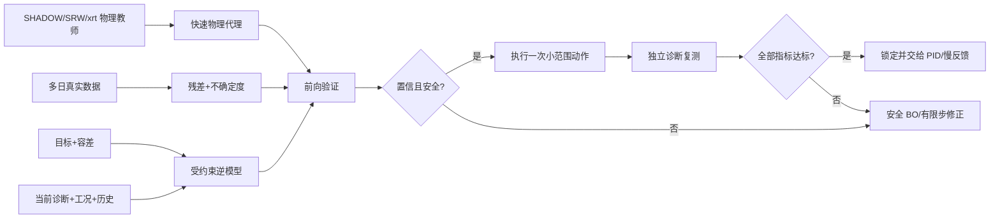

# 光束调优算法综述（精简版）

## 核心判断

光束调优应拆成三层：

1. **粗对准/找回光束**：从严重失调或丢束状态进入安全工作区，适合专家配方、分阶段扫描、GA/DE/贝叶斯优化。
2. **工作点寻优/重配置**：把目标能量、通量、束位、束斑、相干性和剂量转成一组设定值，适合 DE、NSGA-II、贝叶斯优化和代理模型。
3. **稳定反馈**：在正确工作点附近抑制漂移和振动，适合 PID、极值寻优和阈值反馈。

所以，GA/DE 与 PID 不是同一任务上的竞争算法。前者用于“找到工作点”，后者用于“守住工作点”。

## 1. 线站具体调什么

常见执行器包括：

- 狭缝/SSA 的四刀口、中心和开口；
- CM、TM、KB、PFM 等反射镜的 pitch/yaw/roll、平移和弯曲半径；
- DCM/DMM/光栅单色器的能量角、第二晶体/镜的 pitch、roll、translation；
- FZP、毛细管、针孔/OSA、样品和探测器的位置；
- 必要时与插入件 gap/phase、衰减片和曝光参数联动。

算法输入不能只有当前束斑图，还要包括目标光束、当前诊断、编码器状态、能量/机器电流/热态、动作历史和安全约束；输出应是动作或设定值，同时附带预测光束、不确定度、可行概率、域外告警和回退原因。

对 BL18B，公开光学链为弯铁源 → CM → Si(111) DCM → TM → 39 m SSA → 单毛细管/针孔 → 样品/FZP/探测器，覆盖 5–14 keV。第一阶段可考虑 SSA、DCM 二晶、TM 和已验证实验站轴的小范围动作，但最终白名单必须逐轴完成灵敏度、回差、限位、碰撞和恢复性确认。

*BL18B 实验站说明“调光”还包括毛细管、针孔、样品、FZP 和探测器几何。图源：[Tao 等，2022](https://doi.org/10.3788/AOS202242.2334001)。*

## 2. 评价指标和基本计算

必须同时评价光束质量、调优效率、安全和最终实验质量。

| 类别 | 主要指标 |
|---|---|
| 光束质量 | 标定光子通量、束心、水平/垂直 FWHM、均匀性、通量密度、透过率、能量分辨率、波前 RMS/相干性 |
| 稳定性 | RMS、峰峰值、PSD、Allan deviation、容差内时间比例 |
| 调优效率 | 首次动作成功率、达标时间、真实测量次数、总行程、曝光/剂量 |
| 安全 | 越界、失束、联锁、人工接管、恢复成功率 |
| nano-CT 终点 | 平/暗场稳定、投影 SNR/CNR、饱和率、环伪影、旋转中心残差、FSC/MTF 分辨率 |

常用计算为

$$
x_c=\frac{\sum I_ix_i}{\sum I_i},\qquad
\sigma_x^2=\frac{\sum I_i(x_i-x_c)^2}{\sum I_i},
$$

近似高斯时

$$
\mathrm{FWHM}=2\sqrt{2\ln2}\,\sigma,
$$

左右刀口归一化位置代理为

$$
S_{RL}=\frac{S_R-S_L}{S_R+S_L}.
$$

多指标可用容差归一化代价，但通量、束斑、相干性和剂量明显冲突时，应保留 Pareto 解而不是只给一个任意加权分数。

## 3. SHADOW 判断

“SHADOW 被同步辐射光学设计和几何追迹广泛使用”是准确的。SHADOW3 原始论文称其为事实标准，OASYS/ShadowOui 又提供了成熟 GUI 和工作流。

“多数真实在线调优都依赖 SHADOW”则不准确：

- SSRF BL14B1、BL10U2、BL13U 及 SSLS 的 GA/DE/NSGA-II 直接用实测通量、束位等作适应度；
- BL08U1A 的阈值反馈和 BL13U 的 FPGA PID 直接读在线传感器；
- Blop、AutoFocus 会用 SHADOW/OASYS 数字孪生开发算法，但实机仍依赖真实诊断闭环；
- 衍射极限和相干问题往往需要 SRW、xrt、WOFRY/WISE、WPG、COMSYL 或 HYBRID。

建议 BL18B 采用“SHADOW/OASYS 或 xrt 做全线几何失调 + SRW/WOFRY 做 FZP/相干焦区校核 + 真实残差模型补热态、回差和噪声”，而不是押注单一仿真器。

## 4. 开放数据结论

没有公认的真实同步辐射整线调优标准数据集。现有资源如下：

| 资源 | 内容与用途 | 访问/局限 |
|---|---|---|
| [BL15U KB 数据](https://doi.org/10.57760/sciencedb.j00186.00138) | 10 keV、改变两镜 pitch/curvature、有/无散射体的真实衍射图；论文报告 1762 幅真实图和 8000 仿真样本 | 有 DOI 和公开元数据，但截至 2026-09-04 页面标记 `RESTRICTED`，匿名 API 返回无权限 |
| [alignment_beamlines_rl](https://github.com/sygogo/alignment_beamlines_rl) | 两套 Zemax 模拟数据，12→4 和 30→4，用于前向 MLP 与目标条件 RL | 开放但为小型模拟激光光路，不是同步辐射实机；策略仍多步 |
| [DABAM](https://ftp.esrf.fr/pub/scisoft/dabam/readme.html)（[论文](https://pmc.ncbi.nlm.nih.gov/articles/PMC4888647/)） | 真实 X 射线镜高度/斜率轮廓及元数据 | 可给仿真注入真实面形，不是电机—光束控制数据 |
| [CRL 面形误差仓库](https://github.com/oasys-esrf-kit/Paper_JSR_zt5005) | WOFRY/OASYS 合成多平面强度和面形系数的生成流程 | 适合复现逆诊断，不是实机整线日志 |
| [Blop xrt KB 示例](https://blueskyproject.io/blop/main/tutorials/xrt-kb-mirrors.html) | 可运行的模拟设备、FWHM/强度目标和优化循环 | 是数据生成环境，不是固定真实 benchmark |

自建数据必须同步保存目标、工况、命令值与编码器值、动作方向/等待时间、原始诊断、动作后指标、安全事件、仿真版本和校准版本；训练测试应按日期、能量、热态和 shutdown 前后分组，不能随机打散相邻扫描点。

## 5. 已有方法达到什么程度

- 2015 年 SSLS XAFCA 的 GA 即使从最大通量 4% 起步，也在 17 代内优化完成。
- 2017 年 AI-BL1.0 开源实现 GA、DE 和 OMEA，并在 SSLS/BSRF 实机验证。
- 2020 年 SSRF BL14B1 用 EPICS＋DE 把单目标通量优化控制在约 30 min。
- 2021 年 SSRF BL10U2 用 NSGA-II 同时优化次级光源束位和通量，30 min 内得到 Pareto 解。
- 2023 年 SSRF BL08U1A 用“刀口差—死区—M2 固定步长”反馈，每 3 s 更新；这不是 PID。
- 2025 年 SSRF BL13U BiBEST 才是明确的 FPGA PID：5 kHz 采样，约 1 Hz 慢环补漂移，100 Hz 以上快环抑振。
- 2024 年 Blop 把贝叶斯优化用于 NSLS-II、ALS 和 ATF，也用 SHADOW 数字孪生基准；实机 ALS 四自由度在 5 min 内完成优化，但仍需多次采样。

## 6. 端到端代理和“一步调优”

相关部件已经分别出现：

- 2022 年有 SHADOW3＋SRW/OASYS 合成训练集、神经网络一次预测光学参数的设计助手，但只在仿真中回代验证。
- 2023 年 BL15U 用仿真预训练＋真实图微调，一次约 0.13 s 估计 KB 失调，最佳验证 NRMSE 约 4%；论文未驱动电机，也没有闭环成功率。
- 2023/2025 年 APS AutoFocus 用波前数据校准 OASYS/Shadow 数字孪生，再用多目标贝叶斯优化实机对准；这是最接近的数字孪生路线，但明确是多次迭代。
- 2023/2025 年自适应双压电 X 射线镜已经有实测响应神经网络和无反馈串联网络控制，但对象是一块镜及电压序列，不是整条线站的一次动作。
- 2026 年 action-attentive RL 用 Zemax→MLP 环境和当前—目标状态输出动作，但只验证两套模拟激光光路，平均少步而非严格一步。

截至 2026-09-04，在本综述范围内未发现公开工作同时证明：**真实源到样品整线、仿真代理、跨工况 sim-to-real 校准，以及安全的一次电机动作成功率**。这正是可研究的空白。

推荐系统为：

真实映射建议写成

$$
\mathbf y_{\rm real}=f_{\rm phys}(\mathbf u,\mathbf z)
+r_\phi(\mathbf u,\mathbf z,\mathbf h)+\epsilon,
$$

由物理代理给出主趋势，真实残差模型学习热态、面形、回差和噪声，并输出不确定度。逆模型只负责生成候选，冻结的前向集合和独立安全层负责验证。

“一步成功”应严格定义为：在固定模式、可辨识、有界扰动、诊断有效和动作安全的前提下，一次动作后所有指标进入容差。主要指标为

$$
\mathrm{FASR}=\frac1N\sum_i
\mathbf1\left[|y_{ij}^{(1)}-y_{ij}^*|\le\tau_j\ \forall j,
\ \text{无安全违规}\right].
$$

一次神经网络推理很快不等于一步调优；电机运动、稳定等待、复测、失败回退和最终实验质量都必须计时和验收。

## 7. 推荐的最小可行研究

1. 固定 BL18B 的一个能量和一个成像模式，只选 3–5 个完成白名单验证的自由度。
2. 先测小扰动响应矩阵，确认每个目标对哪些轴可辨识。
3. 构建 SHADOW/xrt 几何模型和 SRW/WOFRY 高保真校核，采集多日小范围实机数据。
4. 比较未校准仿真、真实数据模型、仿真预训练、物理＋残差和概率集合五个前向基线。
5. 再训练受约束逆模型，依次通过离线回放、仿真闭环、影子建议、人工确认小步和自动小步。
6. 与专家配方、DE/NSGA-II、安全 BO 和直接逆网络公平比较，报告跨日误差、首次动作成功率、总时间、总行程、失束/越界和 nano-CT 数据质量。
7. 低置信、域外、掉束、严重失调和模式切换必须拒答并回退；高速扰动继续由 PID/FPGA 处理。

完整公式、仿真器对照、论文证据表和参考文献见 [01_光束调优算法完整综述.md](./01_光束调优算法完整综述.md)。
