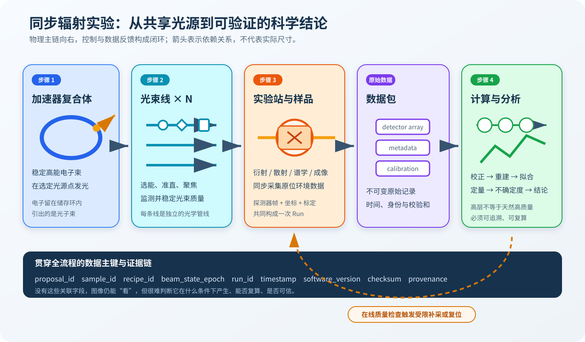
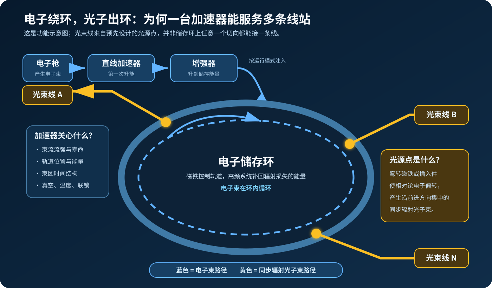
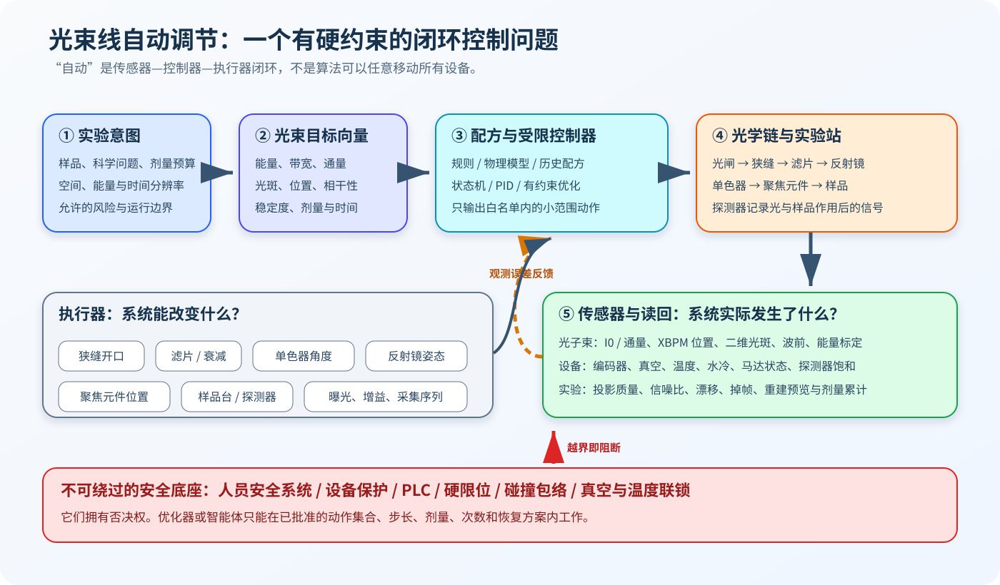
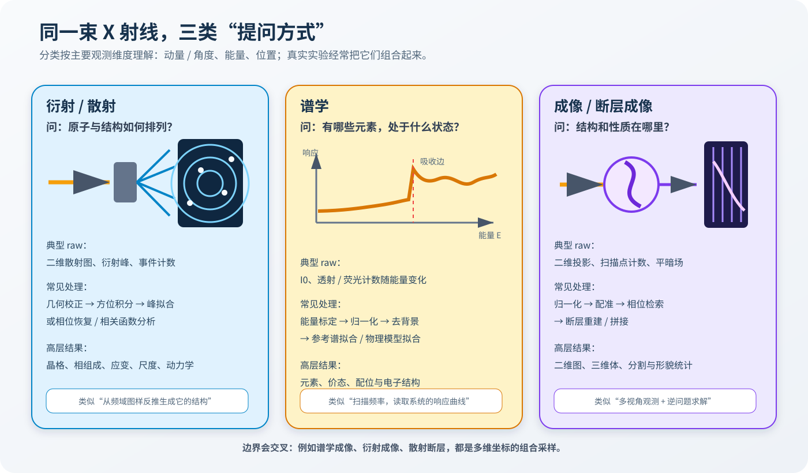
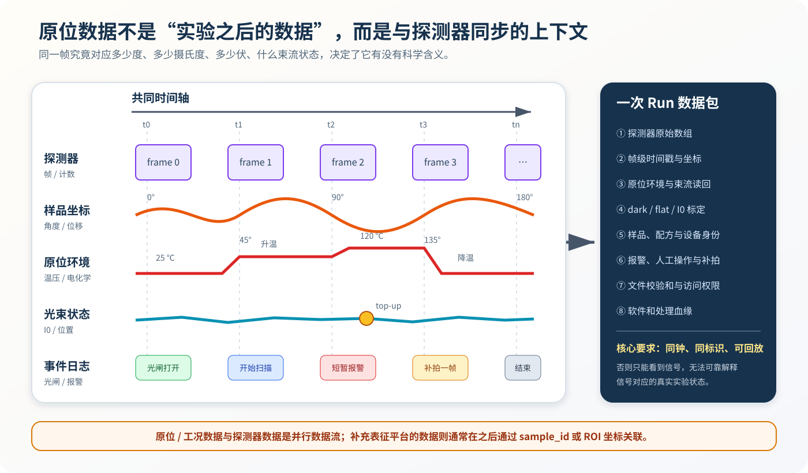
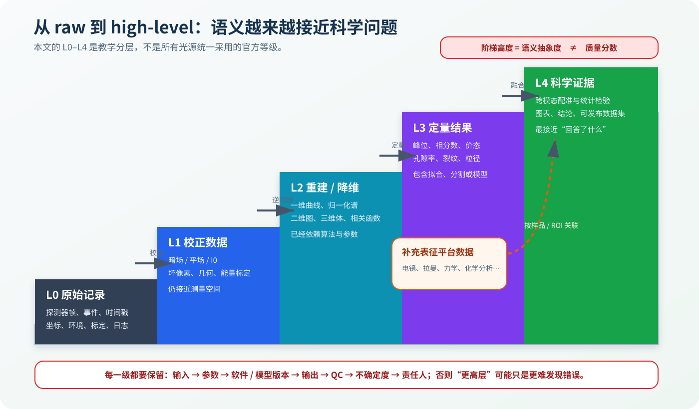

---
tags:
  - 科普/同步辐射
  - 大科学装置/数据流程
  - SSRF/nanoCT
aliases:
  - 同步辐射实验全流程
  - 从电子束到科学结论
created: 2026-09-04
status: 完成
---

# 从电子束到科学结论：同步辐射实验完整流程科普

> [!abstract] 一句话先讲清
> 一座同步辐射光源可以理解为一套超大型、共享的“科学数据生产系统”：加速器稳定电子束并在选定光源点产生光子束；多条光束线把光调成各类实验所需的状态；实验站让光与样品相互作用并同步记录探测器、光束和样品环境；计算平台再把原始测量变成可追溯、带质量评估和不确定度的科学结果。



*图 1　同步辐射实验的物理主链、数据主链与反馈闭环。本文配图均为原创教学示意，未按装置尺寸绘制。*

## 1. 完整流程：四个相互连接的系统层

一次同步辐射实验通常从一个科学问题开始，例如“材料内部是否存在纳米裂纹”“某种元素处于什么价态”或“样品在升温过程中如何变化”。这个问题先被转换为可测量的实验条件，再依次落实到共享光源、光束调制、样品测量和数据分析中。

| 系统层 | 核心任务 | 主要数据 | 关键边界 |
|---|---|---|---|
| 加速器层 | 稳定高能电子束，并在已建设的弯转磁铁或插入件处产生同步辐射 | 束流流强、轨道、能量、束团结构、真空、温度和运行事件 | 储存环中循环的是**电子束**；沿设计切线进入光束线的是**光子束**，并非把电子束分给各条线站。 |
| 光束线层 | 选择并整形光束，使能量、带宽、通量、光斑、位置、相干性和剂量满足实验需求 | 光束诊断、光学元件读回、设备状态、配方和报警 | 自动调节必须服从联锁、限位、碰撞包络和剂量预算，不能任意移动全部光学元件。 |
| 实验站层 | 让光与样品相互作用，执行衍射/散射、谱学、成像及其组合实验 | 探测器帧或事件、角度、位置、能量、原位环境和标定 | 原位装置数据通常与探测器**同步产生**；完整原始记录不只是探测器文件。 |
| 数据分析层 | 进行校正、重建、拟合、分割、统计和跨模态融合 | 校正数据、曲线、谱、二维图、三维体、定量指标和质量报告 | high-level data 表示语义更接近科学问题，并不天然代表质量更高。 |

从设施结构看，一座光源通常表现为“一个共享加速器复合体 → 多个光源点 → 多条光束线 → 一个或多个实验站与可插拔样品环境 → 多种实验方法 → 共享数据底座与模态算法”。光束线数量随设施和建设阶段变化，“通用”和“专用”也常是底座与插件的组合，而不是两个互斥类别。

这四层不是依次完成后就关闭的四个工位。加速器和光束线在实验期间持续运行，原位环境与探测器并行采数，在线处理还可能在扫描结束前返回质量判断并触发受限补采。整个过程因此是一张有状态、有反馈、有审计的有向图，而不是一次性的单向数据管道。

## 2. 同步辐射设施：一套共享、分布式的科学实验系统

从系统工程角度看，同步辐射设施具有共享基础设施、分布式控制、多源数据流和分层分析等特征。下面的类比用于说明组织方式，并不替代真实的物理过程。

| 同步辐射系统 | 软件系统类比 | 真正含义 |
|---|---|---|
| 加速器复合体 | 共享基础设施层 | 为所有用户维持稳定的高能电子束和时间结构，并在多个光源点提供同步辐射。 |
| 光束线 | 可配置的硬件数据管线 | 用光闸、狭缝、滤片、反射镜、单色器和聚焦元件选择并整形光子束。 |
| 实验站 | 外设、测试台与任务执行器 | 放置样品、施加温度/压力/电压等条件，按角度、能量、位置或时间执行采集。 |
| 探测器 | 高速传感器与模数转换前端 | 把光子与样品作用后的信号变为计数、波形或二维数组。 |
| EPICS 等控制系统 | 分布式控制平面 | 用进程变量、发布订阅、设备控制器、报警和归档连接现场设备。EPICS 官方文档将远程监控、自动序列、公共时间、报警、闭环和归档都列为典型能力。 |
| 原始数据与元数据 | 不可变事件流 + 日志 + 追踪信息 | 记录“测到了什么”，也记录“何时、对谁、在什么状态下测到”。 |
| 重建与分析 | 流处理、批处理与逆问题求解 | 将测量空间的数据转换为结构、成分、价态或动力学参数。 |
| 数据目录与血缘 | 数据目录、版本库与可观测性平台 | 关联提案、样品、设备、输入、参数、代码、输出、质量和权限。 |

还可以把整套系统分成四个“平面”：

1. **物理平面**：电子、光子、光学元件、样品和探测器。
2. **控制平面**：设定值、读回值、状态机、反馈回路、报警和联锁。
3. **数据平面**：设备时序、探测器帧、标定文件、元数据和派生数据。
4. **科学与治理平面**：实验意图、质量门槛、不确定度、处理血缘、权限和最终解释。

只看物理平面，会低估软件与数据工程；只看数据平面，又会忘记每个数组都受真实光学、噪声、剂量和机械约束。

## 3. 步骤一：加速器层——先制造稳定电子束，再从光源点获得光子束

### 3.1 电子如何走，光又从哪里来

同步辐射的根本物理事实很简单：**高速带电粒子只要发生加速度——包括改变方向——就会辐射电磁波。** 在现代同步辐射光源中，相对论电子被磁铁约束在储存环轨道上。电子经过弯转磁铁，或者经过让电子周期性摆动的波荡器、扭摆器等插入件时，就会发出高度前向集中的同步辐射。



*图 2　从注入器到储存环，再从预先设计的光源点向多条光束线供光。蓝色表示电子束，黄色表示光子束。*

典型加速器复合体包含：

1. **电子枪**产生电子。
2. **直线加速器**先把电子加速到较高能量。
3. **增强器**继续升能，使电子达到储存环所需能量。
4. **输运线**把电子注入储存环。
5. **储存环**让电子长时间循环；磁铁维持轨道，高频系统补回电子因辐射而损失的能量。

以[上海光源官方加速器介绍](https://ssrf.sari.ac.cn/dkxzz/tbfs/jsq_gb/)为例，电子由直线加速器加速至 `150 MeV`，再由增强器升至 `3.5 GeV`，最终注入周长 `432 m` 的储存环。这组数字不是理解流程所必需的，但能帮助建立尺度感：实验室末端看到的一束微米或纳米尺度 X 射线，背后是一套数百米尺度的共享基础设施。

### 3.2 “切向出光”应该怎样准确理解

相对论电子发出的光集中在其瞬时运动方向附近，所以光子束大体沿轨道切线方向离开光源点。这里有三个容易混淆的地方：

- **电子不会进入光束线。** 电子继续在储存环内循环，进入光束线的是光子。
- **不是所有几何切线都能取光。** 只有设计了弯铁端口或插入件、前端区、屏蔽和光束线的位置才是可用光源点。
- **“一台加速器供多条线”不是复制电子束。** 各条线站从不同光源点接收持续产生的光子束；某些光源点还可能通过分支服务多个实验站。

这也是为什么“加速器 ×1 → 光束线 ×10”可以用来表达共享关系，却不应被当成固定硬件公式。更一般的基数关系是：

```text
加速器复合体 × 1
└── 已建设的光源点 × S
    └── 光束线 / 分支线 × N
        └── 实验站 × E
            └── 实验运行 Run × M
                └── 数据产品 × K
```

### 3.3 加速器数据是什么

加速器层的主要任务不是直接回答某个材料问题，而是证明“共享光源处于可用、稳定、可追踪的状态”。常见数据包括：

| 类别 | 例子 | 为什么影响实验 |
|---|---|---|
| 束流强度 | 储存环电流、束流寿命、注入时刻 | 光通量会随束流状态变化，注入也可能带来短暂扰动。 |
| 轨道 | 各束流位置监测器的横向/纵向位置 | 微小轨道漂移会放大为线站光斑位置或角度漂移。 |
| 能量与高频 | 电子能量、射频电压和相位 | 影响辐射谱和时间结构。 |
| 束团结构 | 束团数、填充模式、时钟 | 决定时间分辨实验如何同步触发。 |
| 设备状态 | 磁铁电源、真空、温度、水冷 | 决定装置是否稳定、安全和可重复。 |
| 运行事件 | 注入、故障、报警、联锁动作 | 可解释某一时段的异常帧或数据分段。 |

现代光源常采用 [`top-up`（恒流注入）模式](https://ssrf.sari.ac.cn/xwgg_gb/ttxw_gb/202404/t20240429_441490.html)：在用户运行过程中定期补充少量电子，使储存环电流与热负载更稳定。对下游实验而言，这类似一个共享基础服务保持稳定容量，但每次注入仍应成为可查询的运行事件。

加速器通常产生海量时序数据。科学数据包不必复制所有通道的全历史，而应至少保存：

- 能定位到中央归档的时间范围；
- 与本次扫描有关的关键状态快照；
- 束流状态发生显著变化时的 epoch 标识；
- 注入、报警和人工干预等事件。

换成软件工程语言：加速器归档是全局遥测（telemetry），本次实验只需保存足够的追踪上下文（trace context）和不可歧义的查询键。

## 4. 步骤二：光束线层——把“有光”变成“这项实验可用的光”

### 4.1 光束线不是一根空管，而是一条精密光学管线

储存环输出的同步辐射通常具有较宽的能谱和特定的空间、角度、偏振与时间特性。光束线要把它变成样品所需的光。不同线站顺序会不同，但常见部件包括：

- **前端与光闸**：隔离储存环和线站，承担人员与设备安全相关功能；
- **光阑、狭缝和掩模**：限定接受角、光斑大小和杂散光；
- **滤片或衰减器**：降低热负载、通量或样品剂量；
- **反射镜**：准直、聚焦、抑制高次谐波或改变光路；
- **单色器**：从宽谱中选择所需光子能量和带宽；
- **聚焦元件**：例如 KB 镜、复合折射透镜、波带片或毛细管；
- **光束诊断器件**：测量位置、强度、尺寸、能量或波前；
- **实验站**：样品台、原位环境、探测器及触发系统。

[上海光源的装置概览](https://ssrf.sari.ac.cn/cbp/hc/201712/P020250306544742454436.pdf)将光束线描述为连接储存环与实验站的“桥梁”，并明确列出分光、准直、聚焦等作用；[硬 X 射线通用谱学线站的调试记录](https://ssrf.sari.ac.cn/xwgg_gb/xwbd_gb/202404/t20240429_441406.html)也给出了“准直镜—单色器—聚焦镜”的实际链路。可见“目标光束”并非加速器一步直接给出，而是源和光束线共同决定。

### 4.2 所谓“光束质量”不是一个分数，而是多目标向量

对一个样品有用的光束，至少可能涉及以下维度：

| 目标量 | 直观解释 | 常见冲突 |
|---|---|---|
| 光子能量 $E$ | 光的“颜色”，决定穿透能力、吸收边和散射条件 | 改能量常使焦点、通量和光路位置一起变化。 |
| 能量带宽 $\Delta E/E$ | 能量选择有多窄 | 更窄通常意味着损失通量。 |
| 光子通量 $\Phi$ | 每秒到达的光子数 | 更高通量可能增加热负载、剂量和饱和。 |
| 光斑尺寸与位置 | 照到多大区域、中心在哪里 | 更小光斑对振动、漂移和对准更敏感。 |
| 发散角与相干性 | 光传播方向有多一致、相位相关性如何 | 光阑可提高相干比例，但会牺牲通量。 |
| 偏振与时间结构 | 电场方向和光脉冲节奏 | 受到光源点、磁结构与运行模式约束。 |
| 稳定度 | 上述量随时间是否漂移 | 热平衡、机械和束流扰动都会影响。 |
| 样品剂量 | 样品吸收了多少能量 | 信噪比与辐照损伤之间必须权衡。 |

因此“自动调束”通常是**有硬约束的多目标优化问题**，而不是把一个“质量分数”最大化。对生物样品，剂量可能比通量更重要；对 XANES，能量标定和重复性可能比最小光斑更重要；对相干成像，相干通量与波前质量又是核心。

### 4.3 传感器、执行器与闭环



*图 3　实验意图先被编译为光束目标，控制器根据传感器读回驱动白名单执行器；安全系统始终保留否决权。*

线站传感器可能包括离子室、光电二极管、X 射线束流位置监测器、荧光屏相机、波前传感器、编码器、真空计、温度计和探测器状态通道。执行器则包括狭缝、滤片、单色器晶体、反射镜、聚焦元件、样品台和探测器位置等。

一个最小闭环可以写成：

$$
\text{误差}(t)=\text{目标光束}-\text{传感器观测}(t),
$$

$$
\text{动作}(t)=\operatorname{Controller}\bigl(\text{误差}(t),\text{设备状态},\text{安全约束}\bigr).
$$

在工程上，快扰动通常交给硬件反馈、PID 或专用控制器；换能、对焦、对中和采集序列适合由确定性配方与状态机执行；贝叶斯优化或智能体可在批准边界内推荐少量慢变量。层次越靠近安全关键设备，越不能依赖开放式自然语言决策。

很多大型实验装置采用 [EPICS](https://docs.epics-controls.org/en/latest/) 一类分布式控制框架。可以把一个进程变量（PV）理解为带名称、类型、单位、时间戳、报警状态和访问权限的设备状态接口；输入输出控制器（IOC）连接现场硬件，客户端通过发布订阅或请求响应读取、归档或修改允许的变量。不过，PV 是控制接口，不自动等于可直接用于机器学习的干净特征：单位、坐标系、采样率、无效值、回差和权限都要另行建模。

### 4.4 自动调节为什么必须保留边界

光学元件往往昂贵、精密且相互耦合。移动一个元件可能改变通量、光斑、能量、热态和下游标定。可靠自动化至少要有四层：

1. **不可绕过的保护层**：人员安全系统、设备保护、PLC、硬限位、真空与温度联锁。
2. **确定性设备层**：驱动器、IOC、运动完成判断、超时、急停和安全停止。
3. **受控流程层**：经过测试的配方、状态机和可恢复扫描计划。
4. **建议与优化层**：在动作白名单、步长、次数、剂量和时间预算内给出推荐。

如果换能、移动聚焦元件或改变探测器模式使原有 dark、flat、$I_0$、焦点、倍率或几何标定失效，系统应新建一个校准/光束状态 epoch，而不是把前后数据静默混在一起。这一点与数据库 schema migration 或模型版本切换很相似：状态边界不显式，后续结果就难以复现。

## 5. 步骤三：实验站层——批量产生的不只是探测器文件，而是同步实验运行（Run）

### 5.1 三类主要实验模态，本质上是三种提问方式

同步辐射技术通常粗分为衍射/散射、谱学和成像。[Lightsources.org 的技术概览](https://lightsources.org/about-2/techniques/)采用了同样的三分法；[APS 的入门材料](https://www.aps.anl.gov/files/APS-sync/technical_bulletins/files/APS_1421583.pdf)则把它们对应到动量、能量和位置三个主要观测维度，并额外强调时间分辨实验。真实线站可以把这些维度组合起来。



*图 4　三类实验不是三种互斥设备，而是对样品提出的三类主要问题。*

| 模态 | 主要扫描/坐标 | 典型原始信号 | 常见高层结果 | 直观类比 |
|---|---|---|---|---|
| 衍射 / 散射 | 角度、探测器位置、动量转移、时间 | 二维散射图、衍射斑点或环、光子事件 | 晶格参数、物相、应变、织构、结构尺度、动力学 | 从频域或相关图样反推生成结构。 |
| 谱学 | 光子能量、时间、偏振、空间位置 | 入射 $I_0$、透射 $I_t$、荧光或电子产额 | 元素种类、氧化态、配位与电子结构 | 扫描输入频率，估计系统响应函数。 |
| 成像 | 样品位置、旋转角、传播距离、时间、能量 | 二维投影、逐点计数、平场和暗场 | 二维图、三维体、密度/相位/元素分布、形貌统计 | 多视角采样后求解逆问题。 |

衍射中常见的 Bragg 条件是

$$
n\lambda=2d\sin\theta,
$$

它把 X 射线波长 $\lambda$、晶面间距 $d$ 和衍射角 $\theta$ 联系起来。谱学中，暗电流校正后的透射数据常通过

$$
\mu(E)x=-\ln\frac{I_t(E)}{I_0(E)}
$$

转为能量相关吸收。吸收 CT 的单个投影近似是沿射线路径的线积分：

$$
p_\theta(s)=\int_{L(\theta,s)}\mu(x,y)\,\mathrm dl,
$$

断层重建要从许多角度的 $p_\theta(s)$ 反求 $\mu(x,y)$ 或三维 $\mu(x,y,z)$。这正是典型逆问题：探测器记录的不是“内部结构本身”，而是结构经过物理前向模型后的观测。

### 5.2 一次可靠的 raw 数据包应包含什么

“raw”并不等于某种固定扩展名，也不一定完全未经探测器固件处理。更实用的定义是：**设施约定的、最接近原始测量且不可被静默覆盖的记录层**。一次实验运行至少需要以下部分：

- 主探测器数组或事件流；
- 每帧的时间戳、角度、位置、能量、曝光和触发编号；
- 入射强度、光束位置等关键线站读回；
- dark、flat、空白、标准样等校准数据；
- 样品身份、方向、容器、批次和感兴趣区信息；
- 原位环境的温度、压力、电压、电流、力、气氛或流量；
- 配方、设备配置、报警、丢帧、补拍和人工干预；
- 文件校验和、访问权限和数据所有权信息。

只有主数组而没有这些上下文，就像只有服务返回值而没有请求 ID、版本、时间戳和 trace：文件也许能打开，却很难证明其物理含义。

### 5.3 原位数据必须同步，而不是“实验结束后再补”



*图 5　探测器、样品坐标、原位环境、光束状态和操作事件沿同一时间轴对齐。其他平台的补充表征通常通过样品或 ROI 标识在之后关联。*

**原位（in situ）**表示样品在特定环境中被观察，例如升温、受力、气氛变化或电化学循环；**工况（operando）**通常进一步要求样品在接近真实工作状态下运行，并同步测量性能。二者的关键都不是多了一份“后数据”，而是实验条件与科学信号能够按时间对齐。

例如某帧出现裂纹，如果只知道它是第 843 帧，却不知道对应温度、旋转角、载荷、电池电压和束流状态，就无法判断裂纹是相变、机械载荷、辐照损伤，还是一次运动或采集异常造成的伪影。

同步至少要解决：

- 不同控制器时钟的偏差和漂移；
- 触发延迟、曝光窗口和传感器采样窗口；
- 网络消息乱序、缺失和重复；
- 设备设定值与真实读回值的区别；
- 注入、光闸、报警、补拍等离散事件；
- 跨 epoch 后标定是否仍然有效。

这就是为什么科学采集既是仪器问题，也是事件时间处理、分布式追踪和数据一致性问题。

### 5.4 “批量产生 raw data”还缺一个质量闭环

批量采集不应只是循环保存文件。一个成熟扫描计划通常是状态机：

```text
PLANNED
  → PREFLIGHT（权限、联锁、碰撞、剂量、磁盘）
  → ALIGN（对中、对焦）
  → CALIBRATE（dark / flat / I0 / 标准样）
  → ACQUIRE（按角度、能量、位置或时间采集）
  → ONLINE_QC（饱和、掉帧、漂移、覆盖、快速预览）
  → PROCESS（校正、重建、拟合）
  → REVIEW（质量、不确定度、人工签字）
  → ARCHIVE / PUBLISH
```

任何一步失败都应转入明确的暂停、有限重试、安全停止或人工接管状态。在线 QC 可以请求补一张 flat、补若干角度或重新对中，但必须受剩余时间、剂量和运动边界限制，不能无限循环重拍。

## 6. 步骤四：数据分析层——从测量值到可审计的高层数据

### 6.1 高层数据（high-level data）的“高”是语义更高，不保证质量更高

原始投影离“孔隙率是多少”很远；重建三维体近了一步；分割孔隙并统计体积分数则更接近科学问题。因此 high-level data 更准确的含义是：**经过更多变换、携带更高层语义的数据产品**。

它并不自动表示“更清晰”“更准确”或“更可信”。每经过一个算法，数据都会引入新的假设、参数和失败模式：错误的平场会产生条纹，错误的转轴会产生双影，过强的正则化会抹掉小裂纹，错误的谱学参考会给出貌似精确的错误物相。高层结果如果失去处理血缘，反而比 raw 更难排错。



*图 6　阶梯高度表示语义抽象程度，不是质量分数。本文的 L0–L4 仅为教学分层，不是所有光源统一使用的官方等级。*

可以用下面的教学分层理解一条常见数据链：

| 层级 | 主要内容 | nano-CT 例子 | 必须保留的依赖 |
|---|---|---|---|
| L0 原始记录 | 探测器数据、坐标、环境、事件和校准 | projection、flat、dark、rotation angle、温度 | 原始文件、时间戳、设备与样品身份、校验和 |
| L1 校正数据 | 仪器响应和基础伪影校正后的测量 | 平暗场归一化、坏像素修复、漂移与几何校正 | 校准文件、掩膜、校正参数、软件版本 |
| L2 重建 / 降维 | 从测量空间转换到更直观的数据空间 | sinogram、切片、三维体、归一化谱、$I(q)$ | 前向模型、算法、正则化、坐标变换 |
| L3 定量结果 | 拟合、分割、检测和统计 | 孔隙率、裂纹长度、相分数、价态、置信区间 | 模型、阈值、标样、训练集或拟合残差 |
| L4 科学证据 | 跨模态融合、统计检验、图表与结论 | 温度—裂纹增长关系及独立表征验证 | 全部上游血缘、排除标准、统计方案、责任人 |

[PaNOSC 的光子与中子设施数据政策框架](https://www.panosc.eu/deliverables/d2-1-panosc-data-policy-framework/)使用 raw、processed、auxiliary data 和 results 等概念，并强调自动处理数据、实验辅助数据及结果应与准确元数据共同管理。本文将其进一步拆成 L0–L4，以便直观展示数据语义如何逐层变化。

### 6.2 一条典型处理流水线

不同模态共享数据基础设施，但算法插件不同：

```text
统一入口
  校验和 → 完整性检查 → 元数据校验 → 数据目录登记
      ├── 成像：平暗场 → 漂移/条纹/几何 → 相位检索 → CT 重建 → 分割/计量
      ├── 谱学：I0 校正 → 能量标定 → 去背景/归一化 → 配准 → 参考谱或物理模型拟合
      └── 衍射/散射：探测器校准 → 掩膜 → 几何变换 → 方位积分/峰拟合/相关分析
  共同出口
  QC → 不确定度 → 血缘登记 → 人工审核 → 归档或发布
```

这里的“通用分析”适合承担文件读取、计算调度、权限、校验和、元数据、可视化、日志、版本、质量报告和结果目录；“特殊模态分析”则实现相位检索、断层重建、衍射积分、谱学归一化、峰拟合等领域算法。二者的关系类似平台层与插件层，而不是两套完全隔离的系统。

### 6.3 在线、近线和离线处理要分开

| 时机 | 目标 | 可以牺牲什么 | 不应承担什么 |
|---|---|---|---|
| 在线（扫描中） | 数秒内发现饱和、掉帧、漂移、覆盖不足，给出低分辨预览 | 分辨率、算法精度、完整参数搜索 | 不能直接给出未经审核的最终科学结论。 |
| 近线（扫描后不久） | 自动完成标准校正、首轮重建、谱处理和 QC | 可先采用固定可靠配方 | 不能静默覆盖 raw 或删除失败信息。 |
| 离线（正式分析） | 使用完整数据、严格参数、重复实验和不确定度生成最终结果 | 可以花费更多算力和人工 | 不能只保留“最好看”的输出而丢失版本与负结果。 |

这三种处理可以复用代码，却有不同的延迟、资源和证据标准。在线预览像监控面板，离线结果才像经过测试、审阅和版本冻结的正式发布物。

### 6.4 怎样判断 high-level data 真正“高质量”

至少需要六个条件：

1. **可追溯**：任何像素、体素或拟合参数都能定位到输入帧、校准、配方、代码和模型版本。
2. **物理一致**：输出重新经过前向模型后，应在噪声允许范围内解释原始观测；不能只凭视觉更锐利。
3. **质量可量化**：报告缺帧、饱和、信噪比、几何误差、残差、分辨率或任务指标，而不是只放代表性图片。
4. **不确定度可见**：区分测量噪声、标定误差、重建参数、模型偏差和跨模态配准误差。
5. **失败可审计**：保存拒答、回退、人工干预和失败样本，防止幸存者偏差。
6. **可复算**：相同输入、版本和参数应在声明的数值容差内得到相同结果。

机器学习输出尤其要保留经典基线、输入输出差值、数据一致性残差、模型适用域和拒答机制。生成一个视觉上更平滑的三维体，不等于恢复了真实存在的结构。

## 7. 设施拓扑：共享基础设施、可插拔平台与统一数据底座

一个典型同步辐射设施的功能拓扑可以写成：

```text
用户科学问题 / 实验意图
            │
            ▼
共享加速器复合体 × 1
            │  在多个已建设光源点产生光子束
            ▼
光束线 / 分支线 × N
            │  每条线完成选能、整形、聚焦和诊断
            ▼
实验站 × E
   ├── 通用样品台、探测器与采集框架
   ├── 面向材料的可插拔原位环境
   └── 面向方法的专用光学、谱仪或探测器
            │
            ▼
同步 Run 数据包 × M
   ├── detector raw
   ├── beamline / accelerator context
   ├── sample environment
   └── calibration / event / provenance
            │
            ▼
共享数据底座
   ├── 存储、目录、权限、调度、版本、QC、可视化
   └── 成像 / 谱学 / 衍射散射专用算法插件
            │
            ▼
可验证的数据产品、跨模态证据与科学结论
```

这套拓扑具有四个结构特征：

- 共享光源通常是一个**加速器复合体**，内部可能包含直线加速器、增强器、输运线和储存环。
- 光束线数量用 $N$ 表示；不同设施、建设阶段和分支结构差别很大，不固定为 `10`。
- 通用平台和特殊材料平台常采用**底座 + 插件**的组合：通用样品台上可以安装电池原位池、加热炉、拉伸台或气氛反应池。
- 数据分析是多对多共享：同一重建服务可服务多条成像线，同一线站也可能调用成像、谱学和散射多种插件。

因此，工程上最值得统一的不是“让所有线站使用同一算法”，而是统一身份、时钟、元数据、权限、处理血缘和质量接口，再允许各模态保留自己的物理模型。

## 8. 一个完整例子：电池颗粒升温原位 nano-CT

假设科学问题是：“某类电池颗粒在升温过程中，内部孔隙和裂纹如何演化？”完整流程可以这样走。

### 8.1 实验前：把自然语言问题编译成可执行意图

实验团队先定义：

- 样品组成、尺寸、容器和危险属性；
- 希望分辨的最小裂纹、视场和三维分辨率；
- 温度范围、升温速率、保持时间和安全上限；
- 总剂量和总机时预算；
- 需要多少时间点、是否允许补扫；
- 最终要输出裂纹体积分数、连通性还是与温度的变化率。

这些信息形成版本化的 Intent。系统据此选择合适线站与实验模式，而不是直接让用户填写几十个电机绝对位置。

### 8.2 加速器与光束线：建立可复用的光束状态

加速器提供稳定运行窗口和束流状态 epoch。线站人员或受控程序选择光子能量、单色器状态、光阑、聚焦方式、曝光和探测器几何，并检查：

- 穿透与对比度是否足够；
- 光斑、视场和像素采样是否匹配；
- 是否饱和，剂量是否超预算；
- 样品旋转时会不会碰撞原位装置；
- 改变能量或焦点后哪些标定必须重做。

这些设置形成 Recipe；其有效时间段和配套 dark、flat、几何、焦点构成 Calibration/Beam-state epoch。

### 8.3 采集：让每一帧都带上物理上下文

扫描前采集暗场和无样品平场。随后样品按角度旋转，在每个温度阶段采集投影。每帧至少关联：

```yaml
run_id: R20260904_001
sample_id: battery_particle_A03
frame_id: 000843
timestamp: 2026-09-04T10:15:32.184Z
rotation_angle_deg: 84.30
temperature_C: 119.8
exposure_ms: 25
beam_state_epoch: BSE_017
recipe_version: nanoct_heat_v3
calibration_ids: [dark_031, flat_032, geometry_008]
event_flags: [top_up_recent]
```

示例只表达数据契约，不代表实际线站必须采用 YAML。关键是相同概念要进入机器可读格式，并通过 `run_id`、`frame_id`、时间戳和 epoch 形成稳定关联。

### 8.4 在线 QC：在还能补救时发现问题

系统实时检查饱和、平均强度、缺帧、角度单调性、平场漂移、样品是否出视场、sinogram 是否连续，并周期性产生低分辨预览。如果第 843 帧对应短暂束流异常，可以标记或在剂量预算内补拍；如果整个温度阶段发生严重漂移，则暂停并重新对中，而不是等到实验结束才发现数小时数据不能重建。

### 8.5 处理与量化：从投影到“裂纹随温度如何变化”

处理链可能是：

```text
projection + dark + flat
  → 归一化与坏像素处理
  → 漂移、环伪影与转轴校正
  → 相位检索（仅在模型假设适用时）
  → 三维重建
  → 跨时间点配准
  → 颗粒与裂纹分割
  → 裂纹体积、长度、连通性及置信区间
  → 与温度曲线和重复样品进行统计关联
```

最后的 high-level data 不只是一个好看的体渲染，而应包括：三维体、分割掩膜、裂纹指标表、QC 报告、不确定度、失败时间点、处理 DAG 和软件环境。

### 8.6 其他分析测试平台如何进入

实验后可能用电镜、拉曼、实验室 XRD 或电化学测试补充验证。这些平台也各自有 raw 和 processed data，不能因为“后来测”就直接称为 high-level data。它们应通过稳定的 `sample_id`、取样位置、方向、ROI 坐标和处理版本进入跨模态关联；如果无法保证同一位置或样品在转移中发生变化，就必须把这种不确定性写进结论。

这个例子也说明：**原位环境数据进入 L0/L1，补充表征数据通常在 L3/L4 融合，但二者都需要自己的原始记录与血缘。**

## 9. 贯穿全流程的数据与控制挑战

### 9.1 时间同步：事件发生时间不等于消息到达时间

探测器、马达、温控器和束流监测器可能以不同频率运行，网络到达顺序也不等于真实发生顺序。需要统一时钟、硬件触发或经过测量的延迟，并明确用曝光开始、曝光中心还是曝光结束作为帧时间。

### 9.2 身份解析：同名文件不是同一样品

提案、用户、样品、容器、ROI、设备、配方、校准、run、帧和结果都应有稳定 ID。只用目录名或人工备注关联，极易在批量实验中串样。

### 9.3 数据模式与单位：数字没有单位就不是可靠数据

`energy=8` 可能是 `eV`、`keV` 或某个电机编码值；`x=10` 可能位于实验室坐标、样品坐标或探测器坐标。数据模式（schema）应明确数据类型、单位、坐标系、正方向、允许范围、缺失值和版本。

### 9.4 高吞吐与背压：探测器不会等慢算法

高速探测器的数据率可能超过实时重建能力。系统需要分层缓存、异步队列、优先级、降采样预览、失败重试和存储水位保护。在线 QC 应选择足够便宜且关键的计算，而不是把最终高精度算法全部塞进实时路径。

### 9.5 可重现性：数据处理是一张有向无环图（DAG）

每个结果节点应记录输入哈希、参数、代码/容器/模型版本、硬件环境、随机种子和父结果。更新算法时生成新版本，不覆盖旧结果。数据血缘本质上是内容寻址和工作流编排问题。

### 9.6 安全与权限：能写 PV 不等于被授权控制设备

读数据、给建议、排队计划、执行低风险动作、移动高风险轴、修改联锁和批准科学结论应是不同权限。控制系统必须在算法之外独立实施最小权限、白名单、限位、超时和不可绕过的保护。

### 9.7 数据漂移：这里真的有“物理域偏移”

光学元件老化、热态、样品批次、探测器更换、能量变化和对准方式都会改变数据分布。机器学习模型不仅要检测图像分布外样本，也要绑定设备、标定和 beam-state epoch，并在超出适用域时拒答或回退到经典方法。

## 10. 推荐的数据组织方式

### 10.1 最小的五类版本化对象

为了让四个步骤真正闭合，可以定义五个核心对象：

| 对象 | 回答的问题 | 不应混入什么 |
|---|---|---|
| Intent | 用户想回答什么，样品与风险边界是什么？ | 不应直接塞入所有设备电机值。 |
| Recipe | 在批准范围内准备怎样的光束与采集序列？ | 不应假装它等于实际执行结果。 |
| Calibration / Beam-state epoch | 哪些标定与光束状态在这一数据段内有效？ | 不应跨重大状态变化静默复用。 |
| Run | 实际发出了什么命令、读回什么状态、采到哪些帧？ | 不应只保存理想设定值。 |
| Result | 用哪些输入、代码和参数生成什么结果，质量如何？ | 不应丢失失败、回退和人工修改。 |

它们形成可双向查询的证据链：

$$
\text{Intent}\rightarrow\text{Recipe}\rightarrow\text{Epoch}\rightarrow\text{Run}\rightarrow\text{Result}.
$$

任何 Result 都应能反查原始帧，任何原始帧也应能查到它进入了哪些结果版本。

### 10.2 文件格式与目录只是载体，语义契约更重要

光子与中子科学社区广泛使用 NeXus/HDF5 组织数据。官方 [NXtomo 应用定义](https://manual.nexusformat.org/classes/applications/NXtomo.html)专门面向 X 射线或中子断层原始数据，明确包含探测器数据、`rotation_angle` 和用于区分 projection、flat、dark 的 `image_key` 等字段。这比“把 TIFF 按序号放进文件夹”更容易实现跨软件解释。

一个教学性的目录可以是：

```text
proposal_P1234/
└── sample_A03/
    └── run_R20260904_001/
        ├── raw/                  # 只追加，不静默覆盖
        ├── calibration/          # dark、flat、几何、能量、标准样
        ├── metadata/             # 设备、环境、事件和电子日志
        ├── processed/
        │   ├── v001_classical/
        │   └── v002_candidate/
        └── reports/              # QC、UQ、人工审核和发布清单
```

但目录结构本身不能代替数据契约。真正关键的是字段语义、唯一 ID、单位、坐标、时间、版本、校验和和血缘。大型设施还会把这些信息登记到数据目录中；[ICAT 的核心科学元数据模型](https://icatproject.org/user-documentation/csmd/)正是围绕 study、investigation、dataset、raw/derived data 和最终结果组织研究生命周期。

## 11. 十个常见误区

1. **误区：电子束沿光束线打到样品。**  
   事实：电子束留在储存环，样品接收的是光子束。

2. **误区：储存环每个切向都能随时开一条线。**  
   事实：可用光源点、前端、屏蔽、光学和建筑布局都需要预先设计。

3. **误区：光越强，数据一定越好。**  
   事实：更高通量也可能造成饱和、热漂移、辐照损伤和更差的能量分辨。

4. **误区：单色器负责制造某种能量的 X 射线。**  
   事实：它主要从已有辐射谱中选择窄能带，并会改变通量、热态和出射位置等条件。

5. **误区：探测器图片就是样品内部结构。**  
   事实：它是物理前向过程的观测；CT、相位恢复和相干成像都要解逆问题。

6. **误区：raw data 就是一堆探测器文件。**  
   事实：没有时间、坐标、校准、束流和样品上下文，数组很难被可靠解释。

7. **误区：原位装置数据是扫描之后附加的。**  
   事实：核心原位变量必须与曝光同步；事后只能补充无法改变的说明，不能重建丢失的真实状态。

8. **误区：high-level data 天然更高质量。**  
   事实：它只表示语义抽象更高；每一步算法都可能放大偏差或产生伪影。

9. **误区：通用平台与特殊平台必须各建一套。**  
   事实：常见方式是共享样品台、控制、存储和 QC，再插入专用环境、探测器或算法。

10. **误区：AI 能把坏数据“修成”可发表数据。**  
    事实：AI 必须受物理一致性、适用域、盲测和不确定度约束；无法挽回缺失的关键元数据或不合格实验设计。

## 12. 术语速查

| 术语 | 简明解释 |
|---|---|
| 同步辐射 | 相对论带电粒子发生加速度时发出的电磁辐射；光源主要利用电子在磁场中转弯或摆动时产生的辐射。 |
| 储存环 | 长时间维持高能电子束循环的环形装置；不是把样品放进去的实验环。 |
| 弯转磁铁 | 使电子转弯，也可作为同步辐射光源点。 |
| 插入件 | 放在直线节中的周期磁结构，如波荡器和扭摆器，用于产生更高亮度或特定谱特性的光。 |
| 光束线 | 从光源点到实验站的真空、光学、诊断、控制和安全系统总成。 |
| 实验站 / endstation | 光与样品发生实验相互作用的位置，包含样品、环境、运动和探测器。 |
| 单色器 | 选择光子能量带宽的光学器件。 |
| XBPM | X 射线光束位置监测器，用于观测光束位置或角度变化。 |
| $I_0$ | 样品前的入射光强参考，用于归一化束流变化。 |
| dark / flat | 无光时的探测器背景 / 无样品时的照明与探测器响应参考。 |
| raw data | 设施定义的、最接近原始测量且不可静默覆盖的数据层。 |
| Run / 实验运行 | 一次实际执行的采集单元，关联命令、读回、帧、事件、校准和状态。 |
| epoch / 状态时段 | 一组校准和设备/光束状态仍被认为有效的连续数据范围；越过失效边界就应建立新时段。 |
| high-level data | 经过重建、拟合、分割或融合、语义更接近科学问题的数据产品；不等于天然高质量。 |
| metadata | 解释数据身份、条件、坐标、单位、时间、版本和血缘的信息。 |
| in situ | 在特定环境或过程发生时观察样品。 |
| operando | 在接近真实工作状态下运行，并同步测量功能表现和结构/化学变化。 |
| nano-CT | 以纳米尺度成像能力为目标的 X 射线断层成像；体素尺寸不能自动等同于真实三维分辨率。 |
| XANES | X 射线吸收近边结构谱，通过吸收边附近的能量扫描研究元素价态和局部配位等信息。 |
| QC | 质量控制：检测数据是否满足预先定义的完整性和质量门槛。 |
| UQ | 不确定度量化：说明结果可能偏差多大、来自哪些来源。 |
| provenance | 数据血缘：结果由哪些输入、参数、软件、模型和人工操作产生。 |

## 13. 五分钟复述版

如果要把整篇文章压缩成四句话，可以这样表述：

1. **加速器层**稳定的是环内高能电子束；电子在设计好的弯转磁铁或插入件处产生同步辐射，光子束沿切线进入多条光束线。
2. **光束线层**读取传感器并用受保护的光学元件与控制回路，把光调成目标能量、通量、光斑、位置、相干性和剂量；不同目标之间存在权衡。
3. **实验站层**按角度、能量、位置和时间让光探测样品，同时采集探测器、样品坐标、原位环境、光束状态、校准和事件，形成可解释的 raw Run，而不是孤立文件。
4. **数据分析层**通过校正、重建、拟合、分割、统计和跨模态融合生成 high-level data；“高层”必须由 QC、不确定度和完整血缘支撑，才可以成为可信科学证据。

最准确的整体公式不是一条单向流水线，而是：

$$
\boxed{
\text{共享光源}
\rightarrow
\text{多线站光束调制}
\rightarrow
\text{同步实验采集}
\rightleftarrows
\text{在线质量反馈}
\rightarrow
\text{可追溯分析}
\rightarrow
\text{科学结论}
}
$$

## 14. 参考资料与延伸阅读

以下资料优先选用光源设施、控制系统和数据标准的官方页面。访问日期：`2026-09-04`。

1. [上海光源：加速器介绍](https://ssrf.sari.ac.cn/dkxzz/tbfs/jsq_gb/)——直线加速器、增强器、储存环、光源点与主要运行参数。
2. [上海光源：装置与光束线概览（PDF）](https://ssrf.sari.ac.cn/cbp/hc/201712/P020250306544742454436.pdf)——加速器、光束线和实验站的关系，以及分光、准直、聚焦等作用。
3. [Diamond Light Source: Inside the Machine](https://www.diamond.ac.uk/Home/About/FAQs/Inside-the-Machine.html)——弯转磁铁、波荡器和扭摆器的通俗说明。
4. [EPICS Documentation](https://docs.epics-controls.org/en/latest/)——大型科学装置分布式控制、公共时间、报警、闭环、归档和数据采集。
5. [Lightsources.org: Beamline Research Techniques](https://lightsources.org/about-2/techniques/)——衍射/散射、谱学和成像三类技术概览。
6. [Advanced Photon Source: X-ray Research Techniques—A Primer（PDF）](https://www.aps.anl.gov/files/APS-sync/technical_bulletins/files/APS_1421583.pdf)——从动量、能量、位置和时间理解同步辐射实验。
7. [NeXus: NXtomo Application Definition](https://manual.nexusformat.org/classes/applications/NXtomo.html)——断层原始数据、旋转角和 projection/flat/dark 标识的标准结构。
8. [PaNOSC FAIR Data Policy Framework](https://www.panosc.eu/deliverables/d2-1-panosc-data-policy-framework/)——光子与中子设施的 raw、processed、auxiliary data、results 和元数据治理。
9. [ICAT Core Scientific Metadata Model](https://icatproject.org/user-documentation/csmd/)——从研究、实验到原始/派生数据和结果的数据目录模型。
10. [ESRF Data Policy 2024](https://www.esrf.fr/datapolicy)——原始数据、元数据、处理数据、数据保管和 FAIR 原则的设施政策案例。

本资料包中的相关延伸阅读：

- [《上海光源纳米 CT 全流程智能化需求评估与实施路线》](../上海光源纳米CT全流程智能化需求评估与实施路线_2026-07.md)
- [《上海光源纳米 CT 现状、国内外进展与技术路线图》](../上海光源纳米CT_现状与路线图_2026-07.md)

---

> [!note] 使用边界
> 本文用于介绍同步辐射实验的整体流程，不替代具体线站的用户手册、辐射安全规程、设备操作规程或实验方案审批。不同光源、光束线和探测器的实际部件顺序、字段名、数据等级与自动化权限可能不同，应以现场已验证配置和正式文档为准。
