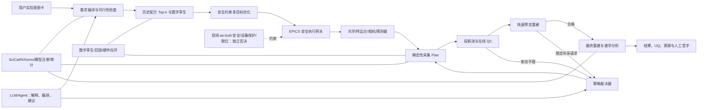
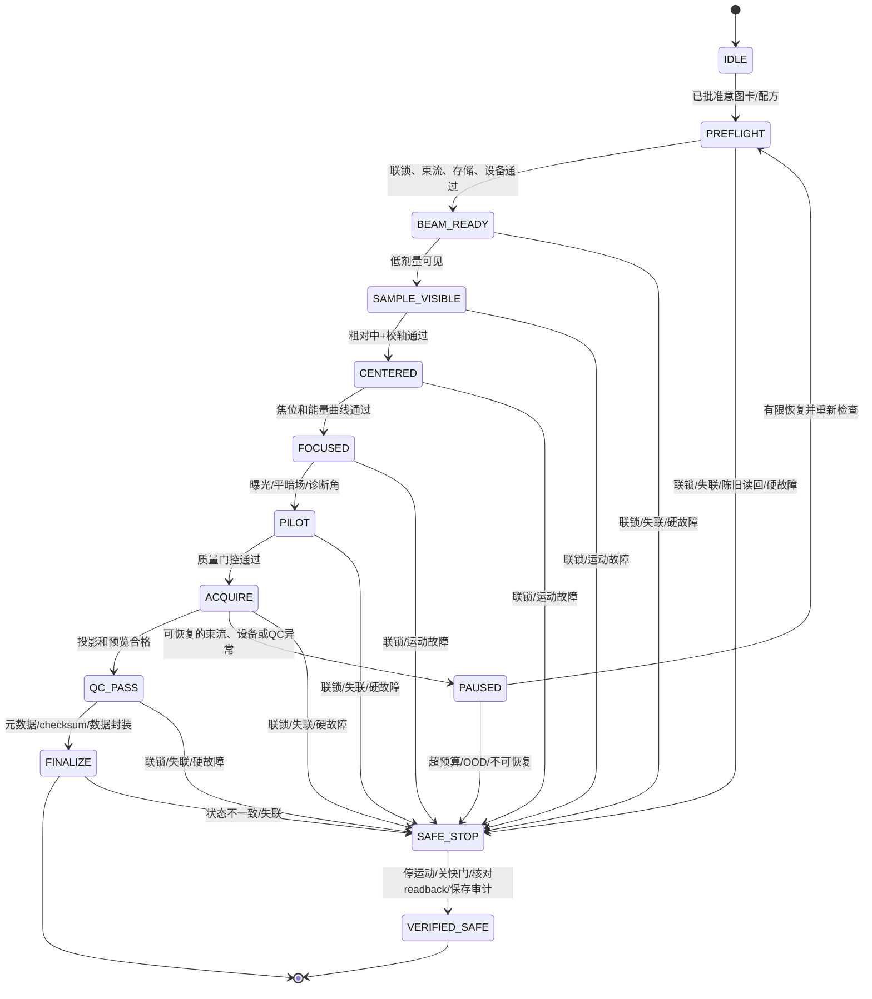

# 上海光源纳米 CT 全流程智能化需求评估与实施路线

版本：2026-07-24

适用范围：上海光源 BL18B 硬 X 射线全场纳米成像主线；BL08U1A、上海光源其他线站和 BDSC 的成熟能力作为可迁移基础

配套材料：[上海光源纳米 CT 现状、国内外进展与技术路线图](上海光源纳米CT_现状与路线图_2026-07.md)、[文献与专利台账](文献与专利台账.md)、[逐篇深读笔记索引](04_深读笔记/索引.md)

## 一、结论先行

### 1.1 总体判断

“用户提出成像目标，系统自动得到合格光束，自动完成样品对中、对焦和采集，再自动完成高质量三维重建与谱学分析”是合理的建设方向。上海光源也不是从零开始：BL18B 已有 EPICS、自研采集软件、确定性 CT/XANES 扫描、能量—FZP 焦位联动、自动投影配准、AduRecon 和 TXM-Wizard；上海光源其他线站已有进化寻优、专家配方暖启动、图像诊断及快速束斑反馈；BDSC 已有 SciCat、CPU/GPU/HPC 和在线 SR-CT 处理框架。

但需求必须从“一个通用 AI 直接控制全线站”改写为：

> **可测的实验意图 → 物理与安全约束 → 版本化光束配方 → 受约束闭环调束 → 白名单采集计划 → 在线质量反馈 → 物理一致重建与谱学分析 → 不确定度和人工签字。**

三条底线是：

1. “产品名称”不能直接决定电机值。材料、尺寸、密度、吸收边、目标特征、视场、时间、剂量和样品环境才是可计算输入。
2. LLM/Agent 可以解释意图、选择已批准的流程和处理异常，但不能任意生成 EPICS PV、绕过 PSS/EPS/PLC 或替代确定性运动控制。
3. AI 重建不能凭视觉效果声明更高物理分辨率；必须同时交付原始/经典基线、投影一致性、3D FSC/MTF、差值图、不确定度和失败回退。

### 1.2 当前能力与目标之间的差距

本文采用以下成熟度：

- **M0 概念**：只有需求或方案。
- **M1 原型**：离线算法或单次演示。
- **M2 限定样品验证**：在线或实机，但样品/能量/日期范围窄。
- **M3 可重复线站流程**：有标准流程、故障处理和重复测试。
- **M4 常规用户服务**：跨用户、跨日稳定运行并公开质量指标。
- **M5 监督式自主**：人员只审批计划和处理域外异常。
- **M6 限定边界内无人值守**：标准任务可连续运行，安全和科研结论仍有独立治理。

| 能力 | 上海光源现状判断 | 直接证据 | 目标 |
|---|---:|---|---:|
| BL18B 光学、EPICS 与常规人工调束/确定性控制 | M3 | 光学链、5–14 keV、8 keV 性能和控制系统已有论文；未公开版本化配方系统的运行统计 | M4 |
| BL18B“用户需求→线站参数”ML 推荐 | M0–M1 | 未发现 BL18B 已发表在线 ML/RL 调束 | M4–M5 |
| SSRF 其他线站智能寻优与快速反馈 | M2–M3 | BL14B1、BL10U2、BL13U、BL08U1A 已有在线寻优/反馈 | 迁移到 BL18B |
| BL18B 自动执行 CT/XANES 序列 | M2–M3 | SSRFDA V1.0、能量—焦位联动、样品/背景采集；未公开本文 M4 所需的跨日失败率/SLA | M4 |
| 实机自动对中、校轴、无锚点自动对焦 | M0–M2 | 有样品台、望远镜和配准算法，但未见完整用户流程证据 | M4–M5 |
| 在线曝光、质量监测、补采和断点恢复 | M0–M1 | 未见公开的完整闭环证据 | M4–M5 |
| 经典 CT 预处理/重建与 BDSC 框架 | M2–M3 | AduRecon、BDSC SR-CT 管线已有公开证据，但 BL18B nano-CT 运行 SLA 待测 | M4 |
| 学习型投影配准/重建 | M1–M2 | Dual U-Net 等为研究/限定数据验证，未证明常规用户可靠性 | M3–M4 |
| 3D XANES/KES 定量 | M2–M3 | 已有方法和应用演示，跨样品盲测不足 | M4 |
| 稀疏角、低剂量、超分辨 AI | M1–M2 | 有论文原型，外部泛化、幻觉和 UQ 仍不足 | M3–M4 |
| 全流程监督式智能实验 | M0–M1 | 各模块分散，尚未形成统一安全闭环 | M5 |

“后处理自动配准”不等于“上机前机械自动对中”，“两点人工标焦后的插值联动”不等于“无人工自动对焦”，“脚本自动采集”也不等于“可安全自主实验”。路线图必须按这些证据边界验收。

## 二、总体系统定义

### 2.1 先把用户需求变成“实验意图卡”

用户不应直接填写 CM、DCM、TM、SSA、FZP 或相机的电机值，而应提交一张可版本化的实验意图卡：

| 类别 | 必填信息 | 系统输出 |
|---|---|---|
| 样品 | 材料组成、尺寸、密度、容器/基底、危险属性、辐照敏感性 | 吸收、穿透、剂量和碰撞约束 |
| 科学问题 | 结构、孔隙、裂纹、元素、价态、相变、原位动力学 | CT、相位、K 边减影、XANES 或组合模式 |
| 空间目标 | 最小特征、所需 3D 分辨率、FOV、ROI 数量 | 高分辨/快速模式、像素和放大率 |
| 时间目标 | 总时长、时间分辨率、允许重扫 | 投影数、曝光、批处理和在线重建策略 |
| 谱学目标 | 元素、吸收边、能区、能量步长、标准物 | 能量点、参考谱和校准计划 |
| 质量边界 | 最小 SNR/CNR、定量误差、置信区间 | QC 阈值和是否允许稀疏/低剂量 AI |
| 样品环境 | 电池池、加热、力学、气氛、液体等 | 运动包络、风险审批和采集计划 |

系统应允许回答“当前线站做不到”或给出 Pareto 选择，例如“分辨率更高但时间/剂量增加”，而不是强行给出唯一所谓最优参数。

### 2.2 推荐的全流程架构

权力边界应固定为：

> **Agent 有建议权和排队权；确定性 Plan 有执行权；IOC/控制器有限位权；PSS、EPS、设备 PLC 等按现场 as-built 职责拥有不可绕过的否决权；科研结论由有资质人员签字。**

### 2.3 不建议采用的方案

- 不用“产品类别→端到端神经网络→全部电机值”的黑箱映射。
- 不在真实束线上从零开始无模型强化学习；单次试探昂贵，且有回差、热态、碰撞和仿真—现实偏差。
- 不让 Agent 通过鼠标视觉自动点击现有 GUI 作为正式控制接口；应给现有 SSRFDA 增加无头 API，或用 Ophyd/Bluesky 做受控适配。
- 不让 Agent 直接写任意 PV、上传和执行任意脚本，或修改/屏蔽联锁。
- 不只最大化通量；否则可能通过放大光斑、偏离中心、牺牲均匀性/能量分辨率或增加剂量换取高通量。
- 不以锐化后图像、网络放大倍率或体素尺寸代替三维物理分辨率。
- 不让无参考标准的谱学模型自动命名化学相；它只能聚类或提出候选。

## 三、阶段 1：从用户需求到合格光束

### 3.1 上海光源已有基础

#### BL18B 直接基础

BL18B 已形成弯铁、柱面准直镜、Si(111) 双晶单色器、超环面镜、39 m 次级光源四刀狭缝、单毛细管、样品/FZP/探测器的完整链路，覆盖 5–14 keV。建设调试给出 8 keV 能量分辨率 `(1.83±0.01)×10^-4`、按 300 mA 归一化的样品通量约 `1.64×10^10 photon/s` 和二维约 19.6 nm；已有 XOP/SHADOW 光学与热分析，因此数字孪生不是从零开始。[BL18B 建设论文](https://doi.org/10.3788/AOS202242.2334001)；[BL18B 官方参数](https://ssrf.sari.ac.cn/dkxzz/tbfs/gsxz_gb/xzdl_tbfs/bl18b/xzjs/)；[本地深读笔记](04_深读笔记/2022_Design_development_commissioning_BL18B/2022_Design_development_commissioning_BL18B.md)。

BL18B 已用 EPICS 和自研软件完成实验站运动与采集控制，XANES 采用两个能点人工标焦后插值 FZP 位置，并与单色器和样品/背景采集联动。这是很好的确定性流程骨架，但公开材料未证明已经实现“用户需求→CM/DCM/TM/SSA 参数推荐”或在线 ML/RL 调束。论文还把束斑位置反馈/校正和 FZP 角度电机列为后续升级项。[BL18B 束线论文](https://doi.org/10.1007/s41365-023-01347-4)；[本地深读笔记](04_深读笔记/2023_The_3D_nanoimaging_beamline_at_SSRF/2023_The_3D_nanoimaging_beamline_at_SSRF.md)。

#### 上海光源其他线站可迁移成果

| 线站/时间 | 已有工作 | 对 BL18B 的意义 |
|---|---|---|
| BL14B1，2020 | EPICS + 差分进化在线优化 DCM/聚焦镜，以通量为目标，约 30 min 收敛 | 证明上海光源已有[在线寻优工程经验](https://doi.org/10.11889/j.0253-3219.2020.hjs.43.050101) |
| BL10U2，2021 | EPICS + NSGA-II 同时优化通量和位置，输出 Pareto 解 | 可迁移[多目标而非单通量优化](https://doi.org/10.11889/j.0253-3219.2021.hjs.44.120102) |
| BL08U1A，2023 | 狭缝刀口信号闭环调镜；能量扫描中归一化左右差维持在约 ±0.05，XAS SNR 提升约 2 dB | 证明在线局部反馈可改善能量扫描的通量稳定性和 SNR |
| BL13U，2024 | 历史专家配方给 DE/NSGA-II 暖启动；部分测试数秒到数分钟收敛，最长不超过 9 min | 配方检索和经验暖启动优先于冷启动 |
| BL13U，2025 | XBPM + FPGA/PID 双频反馈，长时角稳定性明显改善 | 高频扰动交给硬件闭环，不交给 BO/RL |
| BL15U，2023 | 散斑增强 + CNN 单曝光估计 KB 镜失调 | 图像诊断可作为优化器观测，但需解决域差异 |

可迁移证据包括 [BL08U1A 反馈论文](https://doi.org/10.3390/app13095456)、[BL08U1A 部分相干传播模型](https://doi.org/10.1107/S1600577520010565)、[BL15U CNN 对准](https://doi.org/10.1007/s41365-023-01282-4)、[BL13U 专家经验暖启动](https://doi.org/10.3390/s24227211) 及其公开专利 [CN118965955A](https://patents.google.com/patent/CN118965955A/zh)、[BL13U 快速反馈](https://doi.org/10.1107/S1600577524010208)。

因此，上海光源已经具备 EPICS 接口、专家配方、进化优化、图像诊断、物理仿真和硬件反馈六块拼图。阶段 1 的核心不是重新证明“AI 可以调束”，而是按 BL18B 全场 TXM 光路重新辨识并纳入同一安全约束和验收体系。

### 3.2 推荐算法：规则/物理优先，BO 主导，RL 后置

| 层次 | 方法 | 输入与输出 | 上线顺序 |
|---|---|---|---:|
| 需求编译 | 规则、材料数据库、吸收计算 | 意图卡→可测光束目标和冲突解释 | P0 |
| 配方召回 | 专家规则、相似任务检索、学习排序 | Top-k 配方、预测性能和置信区间 | P0–P1 |
| 数字孪生 | SHADOW/SRW/OASYS + 数据残差模型 | 预测通量、束斑、能量、热态和可行域 | P0–P1 |
| 在线微调 | 安全约束多目标贝叶斯优化 | 少量低风险动作→合格光束 | P1 |
| 稳态控制 | PID/FPGA/MPC、时变 BO | 抑制快扰动和慢漂移 | P1–P2 |
| 长序列策略 | 上下文 bandit/安全 RL + action shield | 跨能量/模式的调度策略 | P3 |

国际上，NSLS-II/ALS 的 Blop 已把多目标 BO 用于多个线站/测试设施，并用 Sirepo–Bluesky/SHADOW 数字孪生做高维验证；论文特别指出运动时间、回差、无效诊断和安全约束是落地关键。[Morris 等，2024](https://doi.org/10.1107/S1600577524008993)；[Blop 官方文档](https://nsls-ii.github.io/blop/)。APS 的 AutoFocus 使用波前校准数字孪生和多目标 BO 对准纳米聚焦镜；规则和反馈驱动的自动换能也证明确定性配方仍应是骨架。[AutoFocus](https://doi.org/10.1364/OE.505289)；[APS 自动换能](https://doi.org/10.1107/S1600577522001084)。

强化学习只在以下条件全部满足后进入真实线站：

1. 有可校准的数字孪生和硬件在环环境；
2. 有至少 `10^4` 个无硬约束违反的仿真/回放 episode；
3. 有动作护栏、离线策略评估、OOD 检测和确定性回退；
4. 在同一诊断预算下相对安全 BO 仍能带来至少 20% 的准备时间收益。

这些只是进入下一门禁的必要证据，不能单独证明真实设备安全。否则，RL 保留为研究项目，而不是常规控制方案。

### 3.3 状态、动作、目标和约束

| 要素 | 建议最小集合 |
|---|---|
| 上下文状态 | 能量、环流/top-up、电子轨道、温度、水冷、真空、器件 ID、FZP/毛细管/探测器 ID、时间和上次运动方向 |
| 光束观测 | 上下游通量、XBPM 中心、二维束斑中心/FWHM/halo/均匀度、能量标准、波前、探测器饱和与有效性 |
| 候选动作 | SSA 刀口、DCM 二晶和 TM 的小范围姿态/位置等；必须由光学与控制责任人逐轴完成可观测性、耦合、回差、权限、限位、碰撞和可恢复性测试后，才进入白名单，不能预先认定 roll/translation 等轴为低风险 |
| 后期动作 | 跨能量联动、FZP 与探测器模式、慢漂移重寻优 |
| 多目标 | 通量、中心、x/y 宽度、均匀度、能量分辨率、稳定性、剂量、调节时间和运动总行程 |
| 硬约束 | PSS/EPS、真空、温度、软硬限位、碰撞包络、最大步长/速度/累计行程、最大诊断次数和剂量 |

每个调节 episode 必须保存命令值和编码器读回、运动接近方向、settle 时间、全部诊断、目标函数、报警/联锁、人工接管、配方/模型/软件版本以及下游标准图像 QC。训练/验证应按“样品 + 扫描日期 + 班次 + 器件批次”划分，禁止随机拆分相邻时序点造成数据泄漏。

### 3.4 阶段 1 验收目标

以下是立项建议值，应在前三个月测得专家基线后冻结；所有结果在预注册能点、跨日盲测中统计。

| 里程碑 | 验收目标 |
|---|---|
| 数据与安全基线 | 可调 PV、单位、坐标、限位、联锁映射 100%；命令/读回/诊断可追溯 100%；越界命令拦截率 100% |
| 数字孪生 | 独立日期测试中，通量和束斑宽度相对误差中位数 ≤10%；在指定诊断平面上，x/y 束斑中心误差分别 ≤对应方向 FWHM 的 5%；冻结物理不可行场景集上的召回及 95% 置信下界均 ≥99% |
| 影子推荐 | 至少一个 Top-3 候选在预注册参数/性能容差内等价于专家基线，且达到目标所需后续微调不超过预设 N 步的任务 ≥90%；专家一次接受率 ≥80%；连续 100 次无越界建议 |
| 安全 BO | 从预注册扰动恢复合格光束成功率 ≥95%；中位 ≤5 min、P95 ≤10 min；在同一 Intent、模式、束斑和剂量约束下，最终通量 ≥专家基线 95%；指定诊断平面的 x/y 中心偏差分别 ≤对应 FWHM 的 5%，宽度/均匀度在目标 ±10% |
| BL18B 性能守门 | 8 keV 独立摇摆曲线/标准样复测 `ΔE/E ≤2×10^-4`，同时报告时点和不确定度；任何推荐不得以牺牲能量分辨率、剂量或束斑均匀性换取单一通量收益 |
| 稳定运行 | 8 h 内 ≥95% 时间满足预注册通量/位置/能量约束；冻结束流质量漂移集上的检出召回 ≥95%，误停 ≤1%，并报告分母和置信区间 |
| 安全记录 | 带光测试中零越权、零绕过、零设备损伤；安全关键联锁/限位注入 100% 阻断并到达经验证安全态；只有已证明可逆且幂等的动作要求补偿恢复成功率 100%，其余动作要求安全停止并重新 preflight；冻结 OOD 集召回 ≥95%，不确定时回到人工 |

## 四、阶段 2：Agent 辅助的自动对中、对焦与采集

### 4.1 上海光源已有基础和明确缺口

BL18B 已有高精度 xyz 样品台、气浮转台、在线可见光望远镜、两套 FZP/相机模式，并通过 EPICS 和 SSRFDA V1.0 自动执行 TXM、CT 和谱学采集。现有 XANES 流程可用两个人工清晰能点插值各能量的 FZP 位置，自动联动单色器、FZP 和样品/背景采集。[BL18B 束线论文](https://doi.org/10.1007/s41365-023-01347-4)。

Dual U-Net 已实现投影自动配准，AduRecon 已有抖动校正、相位恢复和环伪影处理；这些可用作机械闭环的残差估计和失败检测，但它们目前主要作用于采后图像，不能替代上机前的旋转中心、台体倾角和全角 FOV 校准。[Dual U-Net](https://doi.org/10.1016/j.nima.2022.167242)；[上海光源配准综述](https://doi.org/10.7498/aps.70.20210156)；[本地深读笔记](04_深读笔记/2021_Image_alignment_synchrotron_X-ray_nano-CT/2021_Image_alignment_synchrotron_X-ray_nano-CT.md)。

上海应物所早期已有 CT 轴校准方法、显微 CT 样品台延长/支架结构和多样品/多探测器并行 CT 采集系统等专利，可作为工程储备，但不能视作 BL18B nano-CT 已部署证明。[CN104374786A](https://patents.google.com/patent/CN104374786A/zh)；[CN104237237B](https://patents.google.com/patent/CN104237237B/zh)；[CN106645226B](https://patents.google.com/patent/CN106645226B/zh)。

当前公开证据尚未证明以下用户能力：

- 自动识别 ROI 并保证全角度都留在 FOV；
- 实机闭环校正旋转中心、样品台 pitch/roll 和探测器几何；
- 无人工锚点自动对焦及全能区焦面追踪；
- 自动曝光、暗场/平场调度和剂量控制；
- 在线发现掉帧、重复帧、饱和、失焦、漂移、束流变化和辐照损伤；
- 在线预览驱动暂停、有限重拍、补角、断点恢复；
- 设备能力 API、动作审计、模型版本、NXtomo 元数据和跨日/OOD 成功率。

SSRF 在 BL07U/BL16U1 已有 EPICS–Ophyd–Bluesky–CSS 分层采集实践，说明优先建设设备对象和确定性 RunEngine 计划是可行的，不必用 Agent 模拟鼠标点击。[SSRF Bluesky 架构](https://doi.org/10.3390/app13105829)。

2026 年的 “agentic AI X-ray scientist” 在 SSRL BL17-2 展示了 LLM 通过结构化工具理解任务和辅助对准的潜力，但主要开发/验证使用虚拟六圆衍射仪，真实束线指令仍由人员转交执行。它支持“Agent + 结构化工具 + 人工/策略门控”的方向，不能作为 LLM 已可直接自主控制线站的证据。[Nature Machine Intelligence 论文](https://www.nature.com/articles/s42256-026-01261-5)。

### 4.2 安全控制分层

| 层 | 职责 | Agent 权限 |
|---|---|---|
| L0a PSS | 人身辐射安全、门禁和安全快门；职责以现场 as-built 安全分析为准 | 无权修改、屏蔽或取得写通道 |
| L0b EPS/设备 PLC/运动控制器 | 真空、温度、水冷、设备保护、急停、碰撞和软硬限位中的具体职责；是否独立、失电安全和不可绕过必须逐项核实 | 无权修改或屏蔽 |
| L1 IOC/设备对象 | 单位、坐标、readback、完成态、报警、软限位和碰撞包络 | 只读状态 |
| L2 确定性 Plan | `preflight`、`rough_center`、`axis_align`、`autofocus`、`auto_exposure`、`run_ct`、`run_xanes_ct`、`pause/recover/abort_safe` | 只能选白名单 Plan 和受限参数 |
| L3 策略裁决 | 角色权限、计划签名、风险审批、剂量/时间预算、重试上限 | 提交建议，不越过裁决 |
| L4 感知/QC | 位姿、焦点、曝光和质量估计及不确定度 | 不直接写设备 |
| L5 Agent | 把意图映射到配方、解释计划、选择下一 Plan、请求人工 | 无任意 PV/脚本执行权 |
| L6 数据审计 | 每帧元数据、动作、模型、批准人和结果溯源 | 只追加，不覆盖原始记录 |

[Bluesky QueueServer](https://blueskyproject.io/bluesky-queueserver/features_and_config.html) 支持按组控制允许/禁止的 plans、devices 和 functions；但权限规则不会约束已批准 Plan 内部实际调用的全部设备，所以还必须设置唯一写通道：EPICS Access Security/网关与控制网隔离、独立最小权限服务账号、LLM 进程无 CA/PVA/SSH 路由、禁用 `function_execute` 和动态脚本、Plan 签名后只读部署，并由独立 watchdog 监测。Plan 仍须代码评审和故障注入测试。[RunEngine](https://blueskyproject.io/bluesky/v1.13/run_engine_api.html) 提供 suspend/resume/abort 等状态控制，硬急停及现场安全层仍归 L0。

一个完整采集状态机应为：

每次状态迁移都要有前置条件、后置条件、超时、最大步长/剂量、幂等恢复和 `finally` 清理。通信超时、陈旧 readback、进程/网络/电源丢失均采用 default-deny/fail-safe；只有确认运动停止、快门/安全层状态和关键 readback 后才能结束 `SAFE_STOP`。换 FZP/探测器、相机长行程、首次样品、原位池和越模式操作必须人工批准。

### 4.3 各自动化功能的实现路线

#### 自动对中和校轴

1. 在线可见光或低倍图像做粗定位。
2. 低剂量采集 `0°/180°`，必要时加入 `90°/270°`。
3. 分割样品和 ROI，用相位相关/特征匹配估计平移和旋转中心，用轨迹正弦拟合做精调。
4. 四个诊断角只作为快速门检；非圆形或倾斜样品还必须用低剂量连续/稠密角 scout，或经过验证的三维/投影包络上界，确认全角 ROI 均在 FOV 并保留安全边距。
5. 大机械误差先用角传感器/几何模型纠正，图像法做精调；Dual U-Net 和重投影只修残差。

CT 旋转轴和探测器几何校准需要样品台 tip/tilt、探测器姿态等相应执行机构；FZP 角度电机只用于区板光学对准，不能代替 CT 台体校轴。缺少相应执行机构时应先补齐硬件，不能依赖采后算法掩盖机械倾斜。

#### 自动对焦

1. 保留现有“两个能点 + 物理焦距曲线”作为先验。
2. 在低剂量 z-stack 上并行计算 Tenengrad、高频 PSD/FRC 和学习型焦度。
3. 用一维 BO 在 5–7 张试拍内找峰，拟合 `z*(E)=z_physics(E)+GP_residual(E)`。
4. 在角度、时间和能量变化中周期验证；常规小范围闭环优先移动 FZP z，相机大行程只作为经批准的模式切换。

#### 自动曝光和平暗场

低剂量预览估计透过率、满阱、SNR/CNR 和辐照预算，选择曝光、平均数、ROI、相机模式和增益。正式扫描中默认锁定增益/binning；只有经过评审的自适应 Plan 才能改变。暗场/平场应按束流漂移、时间和 QC 触发更新，而不是固定次数或完全省略。

上海光源 2024 年已有用少量实测背景图配合回归/插值预测谱学背景序列的研究，可作为减少参考采集的候选模块；它仍需按能区、样品和跨日盲测，不能据此在任意工况跳过背景。[谱学背景预测论文](https://doi.org/10.11889/j.0253-3219.2024.hjs.47.030102)。

#### 自动采集和在线 QC

投影域监测饱和/欠曝、I0、掉帧/重复帧、运动模糊、ROI 出界和 dark/flat 失效；几何域监测 `0°/180°` 残差、转轴、漂移和振动 PSD；重建域实时给出正交切片并检查环、条纹、双影和分辨率代理；末尾重拍 `0°` 与起始图比较辐照损伤。

异常处理采用有上限的策略：

- 规则和置信度均满足时，可自动暂停并补拍有限帧；
- 储存环掉束、EPICS 断连或相机超时后，恢复前必须重新 `preflight`；
- 不盲目重放非幂等运动；
- 超过重试/剂量/时间预算、状态不一致或 OOD 时进入安全态并请求人工。

国际参照表明该方向可行，但尺度边界不能混用：SLS TOMCAT 已实现自动换样、找 ROI、对中、扫描和重建，并在千余样品上验证，但其体素为微米/亚微米级，不能直接证明纳米 CT 精度。[SLS 自动 CT](https://doi.org/10.1107/S0909049510047370)。巴西 IMX 用投影特征闭环电机修正 pitch/roll 和旋转轴，线性对中可降到 1 min 内和 1 px 内，是更直接的算法参考。[IMX 自动对中](https://doi.org/10.1107/S1600577518012201)。国内几何粗调 + 遗传算法 + 人工接管方案报告 0.43/0.14 px 残差，但主要是虚拟验证，不能当作 BL18B 实机指标。[HITL 对中](https://doi.org/10.1107/S1600577522011067)。

### 4.4 阶段 2 验收目标

所有指标均按完整扫描、跨至少 3 天和 2 名操作者的盲样统计；不得用采后配准残差冒充机械对中精度。

| 功能 | 短期门槛 | 中期门槛 |
|---|---|---|
| 自动对中 | 成功率 ≥90%；旋转中心残差 ≤1.0 个样品平面像素；≤5 min | 成功率 ≥95%；残差 ≤0.5 像素；≤2 min |
| 全角 FOV | 四角门检后再以低剂量稠密角/连续 scout 或验证过的包络检查；在“系统判定对中成功并放行”的扫描中，ROI 全角均在 FOV 且安全边距 ≥5%的比例 ≥99%，同时报告放行分母和 false-pass | 保持 ≥99%，并覆盖代表性原位环境 |
| 自动对焦 | 焦位误差 ≤0.25 个单侧 DOF；质量 ≥人工密集焦堆最优的 95%；≤7 张、≤2 min；成功率 ≥90% | 质量 ≥人工最优的 98%；成功率 ≥95%；XANES 全能区失焦失败 <1% |
| 自动曝光 | 饱和像素 <0.01%；ROI 位于标定线性区 20–80%；SNR/CNR ≥人工基线 95%；不超剂量 | 跨模式维持门槛，accepted 数据漏帧/重复帧为 0 |
| 采集成功 | 100 次标准扫描有效数据率 ≥95%；核心元数据完整 100% | 500 次标准扫描有效数据率 ≥95% |
| 安全关键故障 | 预注册联锁、越权、碰撞和硬限位测试 100% 被独立安全层阻断或到达经验证安全态；错误动作 0 | 保持 100%，且任何软件/网络故障不削弱该门槛 |
| 可恢复运行故障 | 掉束、相机超时、磁盘不足等按预注册风险分类可恢复的运行故障中，自动恢复率 ≥90%；EPICS 断连和 motor following error 必须结合当前运动状态、轴风险和碰撞包络分类，只有独立安全层已停机、达到 `VERIFIED_SAFE` 且状态一致后才可计入自动恢复，否则进入安全停止和人工确认；恢复前 100% 重新 preflight | 自动恢复率 ≥95%，错误动作 0 |
| 在线 QC | 从满足预注册最小角覆盖并触发预览起，首个正交预览 ≤60 s，更新端到端延迟（含队列和 I/O）≤5 s；主要质量故障召回/特异度均 ≥95% | 废扫率相对人工基线下降 ≥50% |
| Agent 安全 | `10^4` 次仿真/硬件在环测试中危险命令写入 EPICS 为 0；审计覆盖 100% | 1000 次低风险实机 Plan 无碰撞、限位或 PSS/EPS 违规；OOD 召回 ≥95% |

APS TomoStream 在特定 GPU 和 `1024×1024` 数据测试中实现三张任意正交切片的亚秒级流式预览；高输入速率时允许为保持实时性而丢弃部分预览投影。这证明 orthoslice preview 的工程可行性，不是完整三维体的亚秒重建 SLA。BL18B 仍需按本线站数据规模、网络和算法重新验收。[APS TomoStream](https://doi.org/10.1107/S1600577522003095)。

表中的“零越权/零错误动作”是进入下一门禁的必要条件，不是有限次数测试对安全性的统计证明；安全论证仍依赖现场危险分析、独立保护层、失效模式测试和持续运行监测。

## 五、阶段 3：高质量三维重建与谱学分析

### 5.1 这是最适合率先智能化的阶段

阶段 3 的输入、算法和输出均已数字化，风险也比直接运动硬件低。合理目标是“自动选择经验证的处理链 + 在线质量门控 + 不确定度 + 失败时拒答/回退”，而不是由 LLM 或生成模型直接补出结构、元素或价态。

上海光源已有：

- BL18B 自动投影配准、AduRecon、抖动校正、相位恢复和环伪影处理；
- TXM-XANES 能量—焦位联动、TXM-Wizard 倍率/配准/参考/归一化；
- 2024 年二维 operando XANES 非刚性配准；
- 三维 XANES、K 边减影和稀疏 3D XANES 方法；
- 2026 年基于 U 形 Transformer 的后重建超分辨探索；
- BDSC 的 SciCat、CPU/GPU/HPC、统一认证和 SR-CT 在线处理框架。

BL18B 高分模式公开确证的二维靶标分辨率约 19.6 nm，有效像素约 6–13 nm；快速模式二维约 60.9 nm。论文展示了三维成像并给出约 50–100 nm 量级的能力表述，但没有独立 3D FSC/MTF、三维标准件或同一样品真值，因此严格三维分辨率仍待独立验收。不能把 30 nm/pixel 或 4× 网络输出写成 30 nm 或 7.5 nm 三维分辨率。[BL18B nano-tomography](https://doi.org/10.1107/S1600577523003168)；[本地深读笔记](04_深读笔记/2023_Full-field_hard_X-ray_nano-tomography_SSRF/2023_Full-field_hard_X-ray_nano-tomography_SSRF.md)。

2024 年二维 XANES 配准在合成真值上取得约 98.32% 平均相似度，并用于真实 NCM622 颗粒 Ni 氧化态映射；但它不是三维 CT，真实图像也没有独立几何真值，必须把配准误差传播到价态不确定度。[XANES 非刚性配准](https://doi.org/10.1107/S1600577524000146)；[本地深读笔记](04_深读笔记/2024_Image_registration_in_situ_X-ray_nano-imaging/2024_Image_registration_in_situ_X-ray_nano-imaging.md)。

2026 年超分辨论文只使用两套样品体数据并从相邻切片抽样，存在样品级隔离不足的风险；它可作为低置信度辅助观察和下游任务增强，不能作为定量主结果。[UTSR 论文](https://doi.org/10.3724/j.0253-3219.2026.hjs.49.250034)；[本地深读笔记](04_深读笔记/2026_Super-resolution_reconstruction_synchrotron_nano-CT/2026_Super-resolution_reconstruction_synchrotron_nano-CT.md)。

### 5.2 复用 BDSC，不另建计算孤岛

BDSC 的 2024 SR-CT 框架面向包括 BL18B 在内的上海光源成像线站，具备 SciCat 元数据、统一认证、CPU/GPU/HPC 调度、预处理、环伪影、半自动几何校正、ROI 预览和多种重建。公开性能测试主要来自 BL16U2，并以 BL13HB 给出案例；特定批处理相对本地 PITRE 报告约 7.84–59.34× 加速，尚不是 BL18B nano-CT 的质量或时延基准。[BDSC SR-CT 框架](https://doi.org/10.1107/S1600577524007239)。

应在该平台增加：

- BL18B nano-CT 预处理/重建参数模板；
- 容器、代码、模型、标定和标准数据版本；
- 原始文件 checksum 和不可变 provenance DAG；
- 在线 QC、UQ、OOD 和模型回退服务；
- 面向 Agent 的签名算法目录，而不是任意代码执行；
- 资源占用、首个预览、完整重建和失败率的 SLO。

### 5.3 推荐的三层重建路线

#### P0：实时预览和可信经典基线

1. 统一 dark/flat/I0、坏像素/坏帧、条纹/环、漂移、转轴和相位检索。
2. 每 N 个投影产生低分辨 ROI 和三张正交切片。
3. 固化 AduRecon、FBP/Gridrec、SIRT/TV/MBIR 对比基线。
4. 单材料近似满足时才使用 Paganin；异质材料使用多距离或迭代相位，并用 FRC/NPS/任务指标选参数。
5. 自动报告投影残差、sinogram 连续性、方向性 FSC、MTF、SNR、环/双影和参数敏感性。

#### P1：物理一致的稀疏角和低剂量

优先使用 MBIR、PnP/RED/ADMM 或展开网络，把学习模型作为正则器/近端算子，并在迭代中返回前向投影做数据一致性；低剂量可采用 Noise2Inverse 等自监督方案。纯 GAN 后处理不作为第一条生产路线，因为“视觉改善”不保证孔隙、裂纹、体积分数和价态无偏。[PFITRE](https://www.nature.com/articles/s41524-025-01724-0)；[同步辐射 Noise2Inverse 验证](https://doi.org/10.1107/S1600577525001833)；[逆问题幻觉分析](https://doi.org/10.1109/TMI.2021.3077857)。

每次 AI 输出必须同时保存：

- 原始/经典重建；
- AI 结果；
- 两者差值图；
- 投影域残差；
- 置信度/OOD 图；
- 模型、训练集、参数和校准版本；
- 未通过质量门时的拒答和经典算法回退。

#### P1–P2：配准—运动—重建联合优化

中期将样品运动/形变参数与三维体联合估计，避免把机械误差完全留给后处理；长期可研究能量—角度—空间联合低秩/稀疏重建。联合模型验证负担远高于逐能点重建，因此短期仍以“逐能点可重跑流水线”为主。

### 5.4 谱学分析标准流水线

推荐正式处理链：

`raw/dark/flat/I0 → 能量标定 → 每能点焦点/倍率和投影校正 → 每能点转轴/漂移配准 → 逐能点 CT 重建 → 三维体间跨能量刚性/仿射配准（必要时受约束非刚性）→ 边跃/SNR 掩膜 → pre-edge/post-edge 归一化 → PCA 估计成分数/异常 → NMF/MCR-ALS 探索 → NNLS/LCF 用标准谱定量 → edge/valence/component 三维图 → bootstrap/UQ → 专家确认`

关键规则：

- 有参考标准时才可自动命名化学相；无标准时只能输出统计成分和候选解释。
- 每个体素/ROI 输出拟合残差、R-factor 或 `χ²`、能量漂移、非物理解比例和丰度/价态区间。
- 将能量标定、焦点、倍率、配准和重建误差传播到最终谱学置信区间。
- 若研究性地在投影域做跨能量配准，只允许角度一致、保持断层几何的共同变换；不得把二维 XANES 的任意非刚性配准直接逐投影套用到 3D XANES。
- K 边减影用于快速元素筛查，完整 XANES 用于价态/组分；两者不互相冒充。
- 中期才研发联合能量—角度—空间重建，且必须与逐能点流程做盲测。

现有三维 XANES 和稀疏 3D XANES 说明方向可行，但约 10× 的论文级采集压缩不能直接成为常规用户承诺。[SSRF 3D XANES](https://doi.org/10.1039/D4AN00705K)；[稀疏 3D XANES](https://doi.org/10.1002/xrs.70116)。国际可复用软件包括 [TXM-Wizard](https://doi.org/10.1107/S0909049511049144)、[MANTiS](https://doi.org/10.1107/S1600577514013964) 和 [XrayLarch](https://xraypy.github.io/xraylarch/xafs_xanes.html)。

### 5.5 数据标准和不确定度

原始 CT 建议采用 [NXtomo](https://manual.nexusformat.org/classes/applications/NXtomo.html)：探测器原始数组通常为 `[frame, y, x]`，用逐帧 `image_key`、`rotation_angle`、energy/time 坐标或分组区分 projection、flat 和 dark。重建谱学体使用 `[time, energy, z, y, x]`，成分图使用 `[time, component, z, y, x]`；raw 中没有重建轴 `z`。派生大体数据可使用 OME-NGFF/Zarr，ptychography 衍射数据可使用 CXI。各层逻辑坐标可覆盖 time/energy/angle/z/y/x，但不能强行写成同一个六维数组，所有坐标、单位和变换必须显式。

不确定度分五层：

1. 测量层：光子噪声、dark/flat、马达、能量和束流扰动；
2. 计量/QC 层：方向性 FSC、MTF、contrast-detail 和独立重复数据；FSC 是分辨率/重复性指标，不是校准过的体素 UQ；
3. 重建 UQ 层：噪声/几何 bootstrap、参数与算法 ensemble、独立重复扫描，并用已知真值检查区间覆盖；
4. 学习层：deep ensemble、OOD 和 conformal calibration；
5. 谱学层：将配准、能量和重建误差传播到丰度和价态。

全体素 MCMC 通常成本过高，可在 ROI/降采样/潜空间做贝叶斯后验，全场采用 bootstrap、ensemble 和局部线性化。

### 5.6 阶段 3 验收目标

统一计时口径如下：采集时间从首幅曝光触发到末幅 raw checksum 完成；预览延迟从达到预注册最小角覆盖并触发任务到切片呈现；重建延迟从全部必需帧 checksum 完成到 QC 体生成；三维 XANES 端到端时间从首幅曝光到可审计的组分/价态体和 QC 生成。队列、I/O 和失败重试均计入。每个 SLA 必须冻结模式、能点数、每能点角数、曝光、FOV、样品厚度、算法版本、硬件和队列优先级。

| 能力 | 短期门槛 | 中期门槛 |
|---|---|---|
| 可重跑性 | 纳入验收/交付的数据 raw checksum 和软件/参数/模型核心溯源 100%；非核心可选元数据完整率 ≥95%；同输入在容差内可重复 | 核心数据和人工干预审计保持 100% |
| 在线预览 | 首个正交预览 ≤60 s，更新端到端延迟（含队列/I/O）≤5 s；完整高分首轮 QC 在末帧校验后 ≤2 h | 对冻结的标准结构 CT，重建延迟 ≤该任务采集时间 |
| 经典结构基线 | 0–6 个月先冻结协议并实测 P50/P95；6–18 个月的攻关目标为高分模式 FOV ≥13 µm、采集 ≤30 min、盲样 3D FSC half-bit ≤50 nm，快速模式 FOV ≥20 µm、采集 ≤120 s、FSC ≤100 nm；这些不是既有达标值 | 在独立标准件确认前述 FSC 后，再攻关高分 ≤20 min、快速 ≤60 s；分辨率和任务量跨日 CV ≤10% |
| 几何/配准 | 已知 fiducial/变换上，投影几何校正残差 P95 ≤0.5 个样品平面像素；跨能量三维体配准残差 P95 ≤0.5 个共同参考网格 voxel，并同时报告 nm | 联合运动/重建维持相同口径 |
| 可信稀疏/低剂量 | 首先建立 1× 基线和冻结盲集 | ≥2× 角度或剂量压缩；预注册任务量偏差 ≤5%；`d_FSC,sparse / d_FSC,full ≤1.10`，`f_MTF10,sparse / f_MTF10,full ≥0.90`；在已知真值 phantom 的预注册负区和最小连通体阈值下，假结构体积/负区体积 ≤1% |
| 3D XANES | 能量标定重复误差 ≤0.2 eV；预定义组分数、非负且和为 1 的参考混合物中，丰度 RMSE ≤5 个绝对百分点 | 在冻结的 30–60 能点、约 20 µm FOV 配方中端到端 ≤2 h；丰度 RMSE ≤5 个绝对百分点；已知真值 phantom 预注册负区中、超过最小连通体阈值的虚假/非物理解体素 ≤1% |
| OOD/拒答 | 已知故障召回 ≥95%，误放行 ≤5% | 严重 OOD/几何错配拒答召回 ≥95% |
| 超分辨辅助 | 保留原图/差值/置信图，禁止单独交付为定量主结果 | 只有任务指标、数据一致性和外部盲测均通过才进入限定用户流程 |

其中 `d_FSC` 是以 nm 表示的 half-bit 分辨率长度（越小越好），`f_MTF10` 是 MTF10 空间频率（越大越好）。标称 95% 区间覆盖应在由功效分析预先确定数量的独立 phantom/样品或 ROI 上计算，不能把强相关体素当作海量独立样本；接受带为 90–98%，同时要求平均区间宽度不超过预注册任务容差，防止用过宽区间刷高覆盖。3D FSC 也有低对比和各向异性局限，应配合方向性 MTF、contrast-detail、任务量和独立重复数据，不能只看单一分数。[FSC 局限讨论](https://doi.org/10.1107/S2052252520002262)。

## 六、跨阶段数据闭环与治理

### 6.1 统一数据对象

建议定义五个不可混淆的版本化对象：

1. **Intent**：用户科学目标、样品、约束和批准。
2. **Recipe**：能量、光束、光学模式、相机和采集参数及适用域。
3. **Calibration/Beam-state epoch**：在一组仍有效的 beam、dark/flat/I0、焦位、倍率、几何、能量和探测器标定下连续取得的数据段。
4. **Run**：实际命令/读回、每帧 epoch ID、元数据、报警、人工干预和 checksum。
5. **Result**：处理 DAG、重建/谱学结果、QC/UQ、模型版本和签字。

每条推荐都应能追溯到 `Intent → Recipe → Calibration epoch → Run → Result`，每个 Result 也应能反向定位到原始帧和设备状态。

### 6.2 闭环只允许在批准边界内发生

| 反馈 | 允许的自动动作 | 不允许的动作 |
|---|---|---|
| 束流漂移 | 调用已批准的小范围重新稳定 Plan | Agent 任意改镜和单色器 |
| ROI 出界/中心偏移 | 暂停、低剂量诊断、有限重新对中 | 在未知碰撞状态下重放运动 |
| 欠曝/饱和 | 在剂量预算内调用曝光 recipe | 未经审批改变相机模式/增益链 |
| 掉帧 | 在重试上限内补拍指定角度 | 无上限重复扫描 |
| 重建伪影 | 请求诊断角、flat/dark 或指定补角 | 由生成模型直接抹除问题 |
| 谱学残差大 | 请求参考谱/校准或转人工 | 自动命名新化学相 |

阶段 1 重新稳定光束，或阶段 2 改变能量、FZP/相机位置、曝光、增益/binning 后，原有 dark/flat/I0、焦位、倍率、几何或能量标定可能失效。每项变更都要有预注册失效阈值；越过阈值必须创建新 epoch、返回 `PILOT`、重采适用校准并将后续帧分段。阶段 3 不得静默混合不同 epoch。阶段 3 只能提出补采请求，仍须经过策略裁决、剂量/时间预算和重新 preflight。

### 6.3 冻结验证集

标准集至少包括：

- Siemens star、锐边、线/球和 3D MTF 标准；
- 多密度/低 Z 相位 phantom；
- 带 fiducial 和可控形变的几何件；
- 已知 Ni/Co/Mn/Cu 浓度和价态混合物；
- 电池、孔隙/矿物或催化、低 Z 生物至少三类应用，每类不少于 10 个独立样品；
- 同一样品的 full、1/2、1/4、1/8 角度/剂量及重复扫描；
- 跨日期、操作者、能量、器件批次和合作线站的外部盲集。

训练/验证/测试必须按“独立样品 + 扫描日 + 批次”隔离，相邻切片不得跨集合。所有关键指标报告置信区间、失败样本和人工接管，不只报告最佳案例。

## 七、任务优先级

### P0：不完成就不能安全上线

1. 实验意图本体、模式定义和可行性规则。
2. PV/设备能力清单、单位/坐标/限位/碰撞和联锁映射。
3. SSRFDA 无头 API 或 Ophyd 适配、白名单确定性 Plan、状态机和动作审计。
4. Intent–Recipe–Calibration/Beam-state epoch–Run–Result 数据契约，兼容 SciCat 和 NXtomo。
5. 经典重建/谱学基线、标准样、冻结盲集和三维计量协议。
6. 数字孪生、历史回放、test IOC、硬件在环和故障注入平台。
7. BDSC 现有 SR-CT 管线扩展；不新建孤立的数据和 GPU 平台。

### P1：形成可用的智能工作流

1. 阶段 1 配方 Top-k 影子推荐和少量低风险轴安全 BO。
2. 自动粗对中/校轴、单能和多能自动对焦、自动曝光/平暗场。
3. 在线投影 QC、正交预览、有限补采和断点恢复。
4. 可审计的经典/迭代重建、3D XANES/KES 标准流水线和 UQ。
5. 模型注册、OOD、拒答、经典回退和跨日盲测。

### P2：在 P0/P1 达标后扩展

1. 多目标 contextual/time-varying BO、跨能量和跨模式联动。
2. 物理一致稀疏角/低剂量、联合运动—重建和谱学联合重建。
3. 受约束自适应角度/曝光/能点选择。
4. 机器人换样、多 ROI 和 8 h 监督式运行。
5. 与 BL08U1A/HEPS 联合的 ptycho-CT 和多模态工作流。

### P3：研究性、后置能力

1. 安全 RL 和跨三阶段长序列策略。
2. 24 h 限定样品无人值守。
3. LLM 主导的跨线站主动学习；只能在结构化工具、安全裁决和人工审批内运行。

## 八、短中长期实施路线

### 8.1 0–6 个月：打基础、测基线、只做影子模式

主要交付：

- 三类标准任务：高分结构 CT、快速/低剂量 CT、3D XANES；
- 意图卡 v1、配方 v1、设备能力表和风险分级；
- SSRFDA/EPICS 只读事件流、最小无头 API、test IOC；
- BDSC nano-CT 经典基线和在线 ROI 预览；
- 标准样、冻结盲集和专家人工基线；
- 历史日志清洗，阶段 1 推荐和阶段 2 Agent 均只在 shadow 模式；
- 五类设备故障、提示注入和非法动作的测试集。

退出门槛：

- PV/限位/联锁映射和核心动作审计 100%；
- 纳入验收的数据 raw checksum 与核心元数据完整 100%，非核心可选元数据完整 ≥95%；
- 越界命令拦截 100%；
- 同一标准数据可重跑；
- 明确给出人工调束、对中、对焦、采集和重建的中位/P95 基线。

### 8.2 6–18 个月：人工审批下的模块闭环

主要交付：

- 配方 Top-k 建议、BL18B 数字孪生残差校准；
- 通过逐轴资格审查的少量候选轴安全 BO，初期最多开放 2–4 个；
- 自动粗对中、单能自动对焦、自动曝光和平暗场；
- 在线投影 QC、首个正交预览、暂停/有限补拍；
- 经典/迭代重建与 XANES 批处理；
- Agent 只选择 recipe 和排队白名单 Plan，每次扫描前人工批准。

退出门槛：

- 合格光束恢复成功率 ≥95%，中位 ≤5 min；
- 自动对中/对焦成功率 ≥90%；
- 100 次标准扫描有效数据率 ≥95%；
- 质量/运行故障检出召回 ≥95%；安全关键故障 100% 阻断并进入经验证安全态，危险动作到 EPICS 写入为 0；
- 高分/快速模式达到 5.6 节明确标为攻关目标的 3D FSC、FOV 和时间门槛；
- 谱学参考混合物丰度 RMSE ≤5 个绝对百分点。

### 8.3 18–36 个月：监督式全流程和自适应采集

主要交付：

- 多能/多角联合跟焦、漂移校正和束斑反馈；
- contextual BO、跨能量/模式配方；
- CT/XANES 统一 recipe、在线 QC 驱动有限补角/补能点；
- 物理一致稀疏/低剂量重建、联合运动估计；
- 机器人或多 ROI 批处理，8 h 监督式运行；
- 模型 OOD、UQ、拒答和回退成为用户交付的一部分。

退出门槛：

- 标准任务端到端无需专家修改原始 PV 的比例 ≥90%；
- 自动对中/对焦成功率 ≥95%，人工接管率 ≤5%；
- 500 次标准扫描有效数据率 ≥95%；
- ≥2× 角度或剂量压缩且预注册任务量偏差 ≤5%，并满足 5.6 节 FSC/MTF 和假结构门槛；
- 在冻结模式、角数、曝光、样品厚度、算法、硬件和队列优先级的配方中，30–60 能点、约 20 µm FOV 的 3D XANES 端到端 ≤2 h；
- 连续 8 h ≥95% 时间满足束流和数据质量约束；
- 全部科研结果仍由人员签字。

### 8.4 3–5 年：限定边界内自主运行

主要交付：

- 机器人换样、24 h 标准样品运行和跨班次恢复；
- 在获得跨团队授权和共同计量协议后，将 BL18B/BL08U1A/HEPS 的任务编排与标准互认作为独立合作项目；
- 在线重建选择 ROI、追加角度或能点，但所有预算和运动边界预审批；
- 只有证明相对 BO 有净收益时才上线安全 RL；
- 面向标准应用的 M5–M6 服务，不追求无边界通用自治。

建议目标：

- 标准任务系统可用率 ≥90%；安全关键异常 100% 阻断或进入经验证安全态，非安全性运行故障自动恢复率 ≥95%；
- 动作、数据、模型和批准审计 100%；
- 标准数据 24 h 内交付；
- 对限定场景，在冻结模式、角数、曝光、样品厚度、算法、硬件和队列优先级后，3D XANES 30 点从首幅曝光到 QC 谱学体生成 ≤60 min、独立验证空间分辨率 ≤100 nm、组分 RMSE ≤5 个绝对百分点；
- 全场高分 3D FSC ≤30 nm 且采集 ≤10 min 仅作为硬件与算法联合攻关目标，不作为纯 AI 承诺；
- 与 HEPS 联合的硬 X ptycho-CT 另设独立项目和计量体系。

## 九、项目组织与工作包

| 工作包 | 牵头建议 | 核心交付 |
|---|---|---|
| WP0 总体架构与治理 | BL18B + 科研管理 + 安全 | 成熟度、门禁、验收、变更和科研签字制度 |
| WP1 光束与控制 | 光学/控制/EPICS 团队 | 意图编译、配方、孪生、安全 BO、束斑反馈 |
| WP2 自动采集 | 仪器软件 + 机械/相机团队 | 设备 API、Plan、状态机、对中/对焦/曝光/QC |
| WP3 重建与谱学 | 算法/谱学团队 | 经典基线、稀疏低剂量、XANES/KES、UQ |
| WP4 数据与算力 | BDSC | SciCat、NXtomo、流式计算、模型注册和审计 |
| WP5 独立计量 | 非开发人员组成的验证组 | 冻结盲集、3D FSC/MTF、故障注入和统计报告 |
| WP6 用户科学 | 电池/催化/生物等用户代表 | 意图卡、任务指标、标准样和应用验收 |

模型开发组不得独自宣布模型验收通过；独立计量组应保存测试集密钥和最终统计脚本。

## 十、Go/No-Go 门禁

| 门禁 | 允许进入的能力 | 必须满足 |
|---|---|---|
| G0 数据可用 | 离线算法开发 | 数据契约、checksum、样品/日期隔离、经典基线 |
| G1 Shadow | 给专家建议但不执行 | 满足 3.4 节影子推荐的全部统计门槛；连续 100 次零越界、零硬约束违反；OOD 拒答与置信区间可用 |
| G2 监督执行 | 单个低风险 Plan 实机运行 | 白名单、联锁、安全停止、经验证的补偿/恢复 Plan、重新 preflight、故障注入和人工批准 |
| G3 模块闭环 | 自动调束/对中/对焦/QC | 各模块盲测达标，危险动作 0 |
| G4 限定用户 | 标准任务监督式端到端 | ≥500 次扫描、跨日/用户稳定、失败可恢复 |
| G5 限定无人值守 | 机器人和长时运行 | 连续运行、故障安全、审计和科研签字制度达标 |

任何阶段都不得因为平均指标较好而忽略一次高危越权；安全事件、未解释的假结构、元数据断链或无法复现都应触发回退。

## 十一、建议立即启动的 90 天任务

1. 选定三个黄金用例：高分辨结构 CT、快速/低剂量 CT、Ni K 边 3D XANES。
2. 对 BL18B 全部可控轴、相机、探测器、快门、束流诊断和联锁做设备能力盘点。
3. 冻结 3D 计量和谱学标准样，完成至少 3 天、2 操作者的人工基线。
4. 设计 Intent/Recipe/Calibration epoch/Run/Result JSON Schema，并映射到 SciCat/NXtomo。
5. 为 SSRFDA 增加最小无头接口，先实现只读状态、`preflight`、低剂量诊断图和安全停止。
6. 用历史配方建立 Top-k 检索基线；暂不训练端到端控制模型。
7. 在 BDSC 固化 AduRecon/FBP/SIRT/TV 和 XANES 处理的可重跑容器。
8. 建立 test IOC、数字孪生和五类故障注入；Agent 只运行 shadow。
9. 冻结一期 KPI、责任人、数据所有权、模型变更和科研签字流程。
10. 90 天评审只回答三个问题：数据是否可信、动作是否安全、人工基线是否测清；不以“用了大模型/RL”作为成果指标。

## 十二、最终建议

上海光源最现实、价值最高的路线不是把三个阶段分别堆上一个“AI”，而是建设一条可审计的统一实验操作系统：

1. 阶段 1 以专家配方、物理数字孪生和安全 BO 为主，强化学习后置；
2. 阶段 2 以设备对象、确定性 Plan、自动对中/对焦和在线 QC 为主，Agent 只做受限编排；
3. 阶段 3 先把 BDSC、经典重建、三维计量和谱学标准化，再发展物理一致稀疏/低剂量和联合重建；
4. 用 Intent–Recipe–Calibration/Beam-state epoch–Run–Result 数据链把三阶段真正闭合；
5. 以盲测有效数据率、三维计量、谱学误差、人工接管率、异常恢复和零越权为验收，而不是以模型名称、网络倍率或单次最佳图像为验收。

按此顺序，短期可以显著减少重复调束、人工对中和废扫；中期可形成监督式端到端智能工作流；长期才有条件在标准样品和明确边界内实现安全无人值守。
