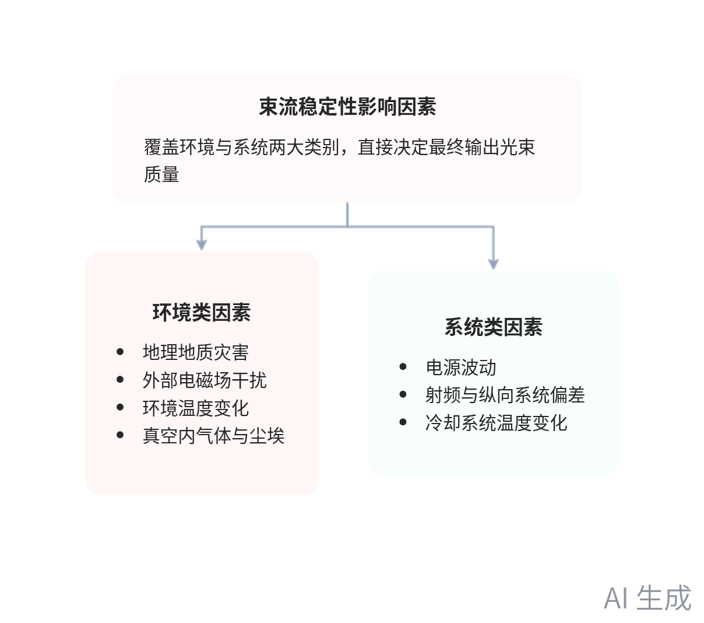
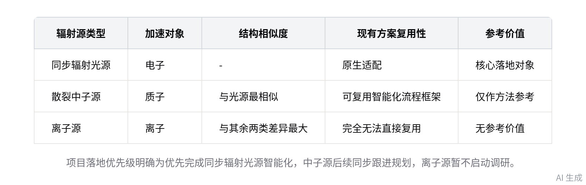

# 智能纪要：大科学装置调研会议 2026年8月27日

> 会议主题：大科学装置调研会议
> 
> 会议时间：2026年8月27日（周四） 14:59 \- 16:25 （GMT\+08）
> 
> 参会人：@黎振宇 @崔航玮 @费奔 @杨海瑞 @陆岩 @吕泽林 @欧阳万里 @秦风宝 @帅林飞 @苏锐 @王智慧 @王宁 @William @黄东升 @用户092094 @刘浩刚 @常闯 @柳博谦 @孙宝利 @于森灏 @周福涛 @邹安棋
> 
> 

> 智能会议纪要由 AI 生成，可能不准确，请谨慎甄别后使用
> 
> 

# 总结

本次会议复盘同步辐射光源智能化项目阶段调研成果，明确后续调研方向与工作规则，内容如下：

- **阶段调研成果汇报**

    - **当前调研分工安排**：当前项目调研分工为，振宇负责整体加速器原理梳理，东升负责同步辐射基础理论文献，福涛负责束流误差来源调研。

    - **同步辐射基础理论论文调研**

        - 1998年光源发展论文核心内容：梳理从X射线管、弯铁光源到自由电子激光的技术演进路线，明确低发射度对光源性能的核心作用。

        - 1998年论文汇报调整：因该内容已在前期会议做过科普讲解，本次会议明确无需在后续汇报中展开该篇内容。

        - 同步辐射理论论文核心创新：将经典角分布、谱分布、波荡器辐射、量子效应等参数纳入统一物理框架，明确同步辐射与波荡器辐射同源异态的关系。

        - 同步辐射理论论文研究方向：覆盖同步辐射基本图像、频谱形成逻辑、不同辐射类型关联、量子理论附加物理量四大核心方向。

        - 同步辐射理论论文核心结论：同步辐射具备强方向性、宽频谱特征，量子效应会反向影响存储环内束流状态，需纳入核心考量范畴。

    - **同步辐射原理补充说明**

        - 三类发光方式：共分单次偏转的弯铁辐射、大幅摆动的摆荡器辐射、小幅周期摆动的波荡器辐射，三类均属于同步辐射范畴。

        - 两类加速路径：分为环形加速与直线加速两类，环形加速器负责将电子加速至近光速，周期磁铁通过切向加速度产生符合实验需求的辐射光。

        - 光束线核心作用：通过狭缝、晶体、准直镜等光学元件，对光斑大小、通量、波长进行筛选，输出符合线站实验要求的标准光斑。

        - 线站应用现状：以纳米CT线站为例，通过同步辐射光对样品做360度透射成像，重构得到样品内部三维结构，当前线站操作未实现完全智能化。

    - **束流稳定性影响因素调研**

        - 核心观测指标：光子束核心观测维度包括强度恒定度、光斑漂移量、入射角、波前变化、光子能量、能谱宽度、偏振、相干性等。

        - 电子束关联参数：核心关联电子发射周期、加速后速度、偏转弧度等参数，参数偏差会直接导致输出辐射光不符合实验要求。

        - 环境类影响因素：包括地理地质灾害、外部电磁场、环境温变、真空环境内的气体与尘埃，会改变光学元件位置、面形与磁场强度。

        - 系统类影响因素：包括电源波动、射频与纵向系统参数偏差、冷却系统温度变化，会改变电子能量、同步相位与电子束到达时刻。

- **跨源项目方向共识**

    - **不同辐射源差异化特征**

        - 同步辐射光源：加速对象为电子，质量远低于质子，加速流程相对简单，电子束可在长轨迹内稳定保持近光速状态。

        - 散裂中子源：东莞中子源带环形加速器，苏州在建中子源仅用直线加速器，加速原理与光源差异大，现有光源调研参考价值极低。

        - 离子源：三类辐射源中与光源、中子源的结构相似度最低，智能化流程无法直接复用光源的现有方案。

        

        

    - **项目推进节奏共识**

        - 落地优先级：优先完成同步辐射光源侧的智能化方案落地，暂不启动中子源、离子源的针对性调研，避免资源分散。

        - 项目群规划：中子源、离子源侧已在推进项目群搭建，预计短期内即可落地，需同步参与整体规划，无需等光源方案完全落地。

        - 仿真工具适配：当前 Shadow、XRT 等仿真工具仅适用于束线环节，加速器环节的仿真逻辑与工具需单独适配，无法直接复用现有工具。

- **后续调研工作要求**

    - **调研方法调整要求**

        - 内容侧重方向：优先建立全流程宏观认知，重点梳理各环节影响指标、误差来源与可调整参数，复杂公式细节暂不做强制要求。

        - 深度适配规则：针对后续需要落地优化的环节，再针对性回溯对应原理细节，避免无差别深挖所有内容导致进度滞后。

    - **调研内容补充要求**

        - 映射关系梳理：需明确各类束流稳定性影响因素与线站已部署传感器的对应关系，为后续数据采集与建模提供基础。

        - 仿真逻辑梳理：需梳理各类误差的可仿真路径，明确不同影响因素对应的参数调整维度，支撑后续仿真环境搭建。

        - 建模优先级规则：无需深究各类影响因素的底层作用机制，仅需明确不同因素最终对应的参数调整维度，即可支撑仿真环境搭建。

    - **会议机制优化要求**

        - 会前同步规则：每次调研会前需将本次调研的核心提纲发至项目群，经参会老师确认方向无偏差后再开展具体调研工作。

        - 内容导向规则：调研内容需优先围绕当前项目推进的核心困惑点展开，避免调研内容与项目实际需求脱节。

# 待办

* [ ] 会议时间确认：与王老师沟通协调会议时间，确认最终会议安排为 3 点半召开或次日召开（来自欧阳万里）

* [ ] 束流相关调研：调研线站建设、运维阶段为保障束流稳定所部署的传感器，以及对应影响因素的关联关系，本周推进相关工作（来自王智慧）

* [ ] 调研规划梳理：总结本次会议欧阳万里老师提及的关键问题、下一步调研重点，结合团队当前困惑点规划调研内容并形成提纲发至群内，供欧阳万里、王智慧查阅以避免调研方向偏差（来自王智慧,欧阳万里）

* [ ] 项目进展沟通：与其他同学沟通当前项目的整体进展情况

# 相关链接

- 妙记：[大科学装置调研会议](https://k0b8qg3ufmm.feishu.cn/minutes/obcnn98589f37q8t5j7r7trt?from=ai_minutes)

- 文字记录

    - [大科学装置调研会议 2026年8月27日](https://k0b8qg3ufmm.feishu.cn/docx/PnULdXSunop9kfxplIgc71O1nYg)

